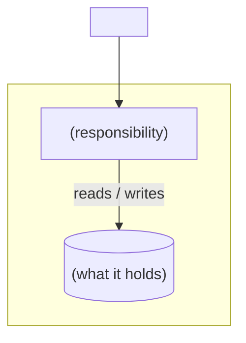
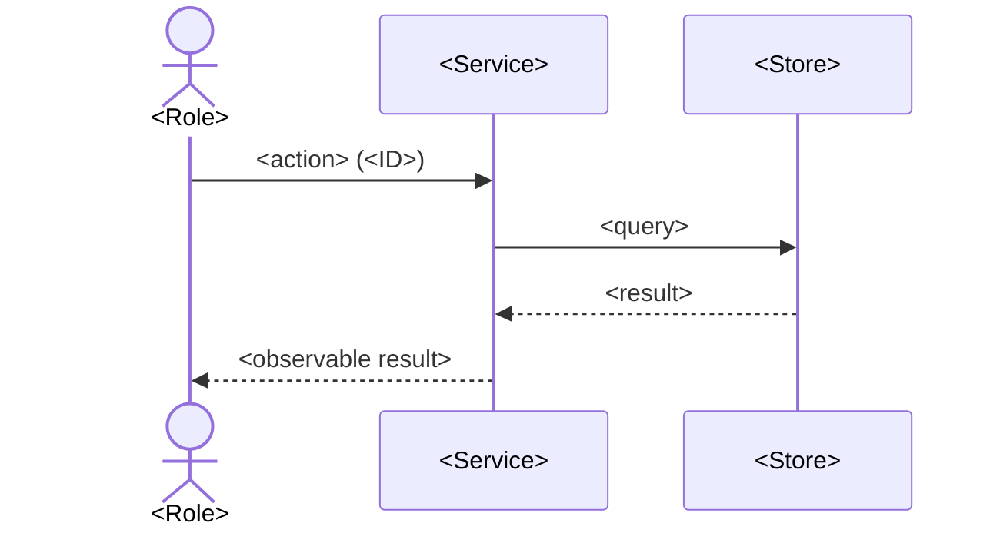

<!--
  Skeleton for a forward-looking architecture decision document (RFC / design doc).
  Write the document in the language of the request and its source material; translate these headings.
  Treat sections as a checklist, not a cage: drop what does not apply, add what the decision needs.
  Nothing links out of this document to carry its argument: inline the number, the query, the excerpt,
  the diagram. Links go in Sources at the end, as provenance for what is already stated.
  Name instruments, not vendors: "the latency board", "the cost report", "the issue tracker".
-->

# <Title: the problem, never the product>

**Status:** <proposed | accepted | superseded by X | deprecated>
**Decider:** <role>  ·  **Reviewers:** <roles>
**Current working focus:** <context | requirements | design | tradeoff | decision | concluded>

## Reversibility

<One-way door (expensive or impossible to undo) or two-way door (walkable back cheaply), and why. A
two-way door gets the one-page light shape instead of this template.>

## Context

<For someone meeting the project today: what exists, who uses it for what, how much. Every number
carries its source inline and a label: `(latency board, read yyyy-mm-dd; measured)`,
`(18,000/h ÷ 3,600 × 72 s; estimated)`, `(nobody has checked; assumed: an hour with the reindex logs
would settle it)`. Then the problem: the measured gap between what the roles need and what they get.>

### Current usage

| Role (what they do with the system) | What they do today | Through what | How often or how much (source) |
| --- | --- | --- | --- |
| <role> | <the task> | <the mechanism or channel> | <number, source, label> |

### Goals

<An outcome for a role, with no system feature, technology or system metric in it. If you could build
it, it is a requirement; if you could choose it, it is an option.>

| Goal | Who benefits | How we will know |
| --- | --- | --- |
| <outcome> | <role> | <the observable change, with its measure where one exists> |

### Stakeholders

<Usage roles, never departments: operators, beneficiaries, maintainers, regulators, approvers, and the
negative stakeholders who lose something.>

| Role (what they do with the system) | What they need from this decision | Who speaks for them |
| --- | --- | --- |
| <role> | <the need> | <name or title> |

### Constraints

<Externally imposed: law, regulation, contract, physics, a signed budget, a regulator's date. A
constraint may exclude an option; the row cites the clause. Nobody inside the organization is the
source of a constraint.>

| Constraint | Source (outside the organization, or a signed commitment) | What it excludes, and the clause |
| --- | --- | --- |
| <the limitation> | <regulation and article, contract and clause, approved budget line> | <the option it rules out, or "none"> |

### Prior decisions

<Decided by someone inside the organization: the platform, the language, an org standard, a previous
ADR. Never excludes an option. The incumbent gets a row in the tradeoff table beside an alternative.>

| Prior decision | Who made it, when | Incumbent it implies | Cost to reverse |
| --- | --- | --- | --- |
| <the decision> | <team or person, date> | <the option it favours> | <low / medium / high, and why> |

### Assumptions and open questions

**Blocking** (any answer changes the decision; the status stays proposed while one is open):

| Question | Owner | Date | If yes | If no |
| --- | --- | --- | --- | --- |
| <question> | <role> | <yyyy-mm-dd> | <what changes> | <what changes> |

**Non-blocking:**

- <what we proceed on without proof, its label, and what would close it>

### Out of scope

- <problems explicitly excluded, and why. Never an option: options are rejected in the tradeoff table>

## Requirements

<Only the architecturally-relevant ones: hard to reverse, structure-shaping, business-critical, or a
cross-cutting quality with a target. Nothing optional. Say in a line which items from the request were
reclassified and why.>

### Functional

<Scenario first: the role, the situation, the action, the observable result. The requirement is its
generalization. Remove the row and that role notices a capability is missing.>

| ID | Goal (a row of the Goals table) | Requirement (the role, and what the system does for it) | Proof (the scenario, and how it is run) | Source |
| --- | --- | --- | --- | --- |
| F1 | <goal> | <role> can <capability> | Given <situation>, when <action>, then <observable result>; run as <test> | <the Context fact it derives from> |

### Non-functional

<Five parts: metric, target, condition, derived from, measurement. A target with no derivation is
labeled assumed and is measured first after cutover.>

| ID | Goal | Requirement (metric, target, condition) | Derived from | Proof (measurement) | Source |
| --- | --- | --- | --- | --- | --- |
| N1 | <goal> | <p95 of X at or below Y ms at Z load> | <today's value, source, date; the reason for the delta> | <load run / drill / dashboard, by whom> | <the Context fact it derives from> |

## Design

<Solve the requirements with technology, and nothing more. Each component names the requirement IDs it
answers; each requirement maps to something here. Where a constraint or a prior decision shaped a
choice, say which. Decide dimension by dimension.>

### Static view

*Figure 1. C4 <context | container | component> diagram. Answers <IDs>.*

### Dynamic view

*Figure 2. Sequence for "<scenario>". Answers <IDs>.*

<A deployment view if the choice is about runtime, scaling or cost; a data view if it is about the
model, ownership or migration.>

## Alternatives analysis (Tradeoff)

### Decision drivers

1. <driver, and where it comes from: requirement IDs, a constraint, cost of ownership, time to market,
   operational load, team skills, reversibility>

### What every option shares

<Write it down. Each shared element is a constraint with its clause, a prior decision with its own row
and an alternative beside it, or a missing option that goes into the table.>

| Alternative | Requirements (met / partial / missed, by ID) | Pros | Cons | Risk | Impact | Probability | Mitigation | Contingency |
| --- | --- | --- | --- | --- | --- | --- | --- | --- |
| **[Dimension] <option A>** | met: <IDs>; partial: <ID> (<gap>); missed: <IDs> | | | <risk> | low / med / high (why) | low / med / high (why) | <stop it happening> | <act if it happens> |
| **[Dimension] <option B>** | | | | | | | | |
| **Baseline: do nothing, or the smallest change that would work** | | | | | | | | |

<Add a row per additional risk without repeating the alternative. Every incumbent from the prior
decisions table has a row and an alternative. Where the evidence is thin, run the proof of concept and
report its numbers here.>

## The decision

<Which alternative, and the drivers that carried it. Decision style: autocratic (one person decides
after consulting) or democratic (majority, with a stated tiebreaker). Commit.>

### Stakeholder conflicts

- <where a role's stated wish was overridden, by which requirement and whose>

### Consequences

- <what becomes easier, what becomes harder, what the team now maintains>

### Residual risks

- <the risks the mitigations do not remove>

### Confirmation

<How we will know later that this is holding: the metric to watch, the automated check or fitness
function, the review date. Which targets were assumed and get measured first.>

## Launch strategy

<Phases, without an eternal migration. What ships now, what comes later, what gets retired.>

## Tasks and roadmap

| Task | Description | Estimate |
| --- | --- | --- |
| <task> | <description; contracts, schemas and runbooks are tasks here, not sections above> | <Xd> |

## Glossary

| Term | Meaning |
| --- | --- |
| <domain term, system name, acronym> | <definition, used consistently everywhere above> |

## Sources

- <provenance for facts already stated above: boards with dates, queries, files, tickets, bills>

## Version history

| Version | Date | Author | Description |
| --- | --- | --- | --- |
| 1.0 | <yyyy-mm-dd> | <author> | Document created. |
