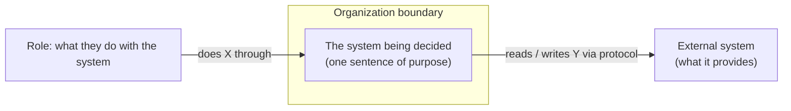
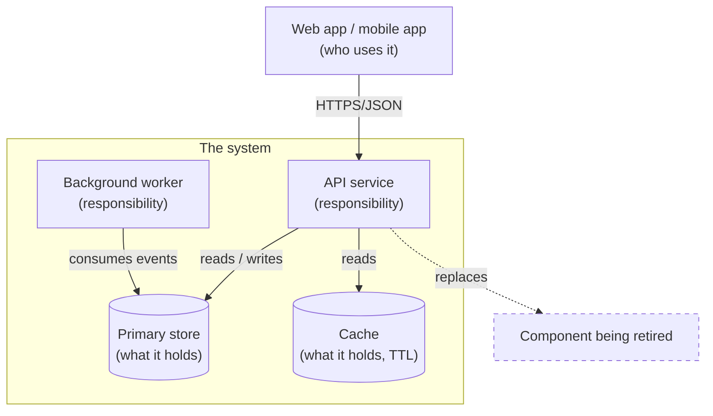
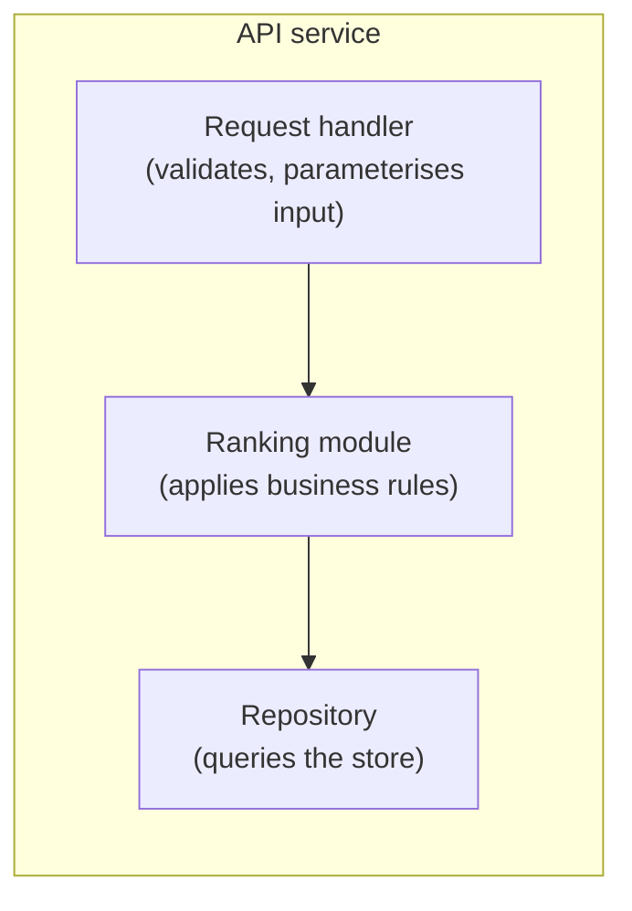
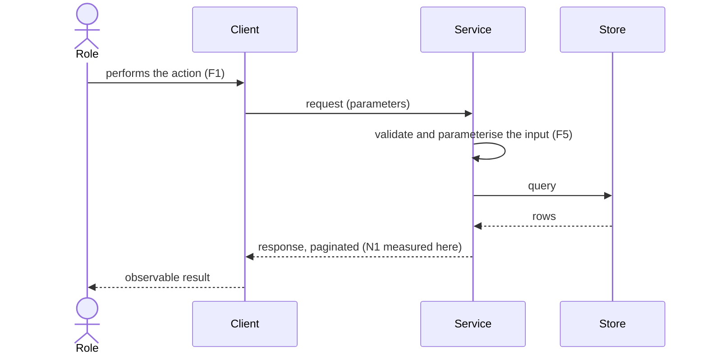
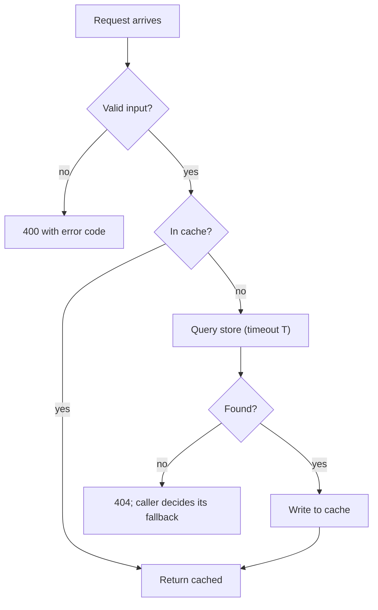
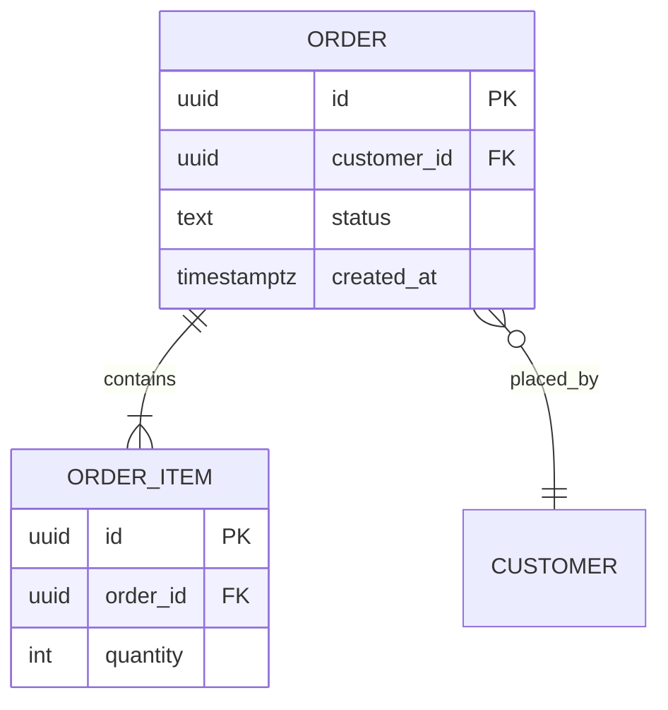
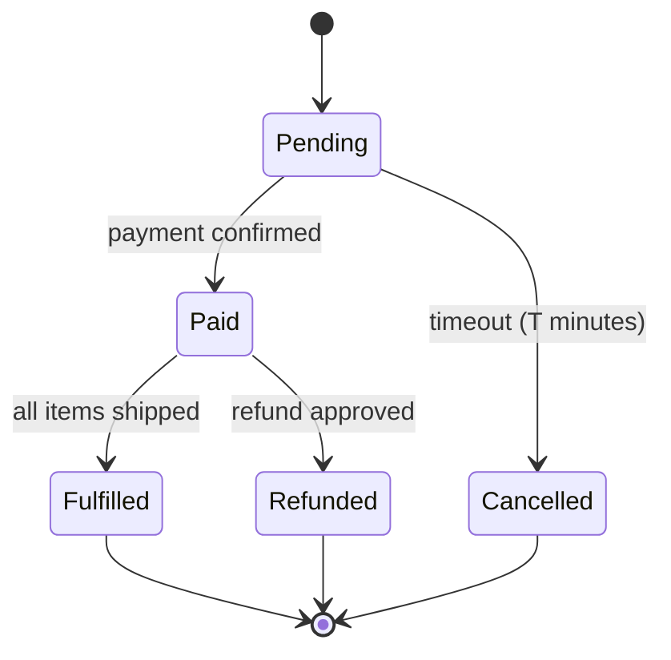
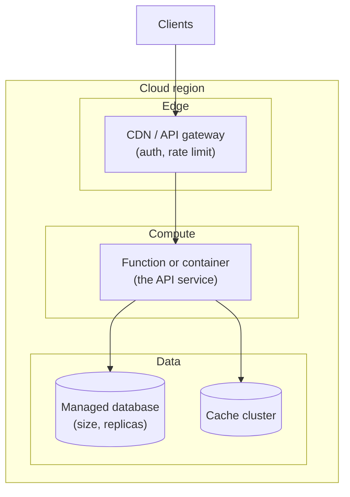

# Diagrams: which one answers which question

A diagram exists to answer a reader's question. Pick it from the question, draw it at one level of
zoom, embed it as Mermaid so the document keeps standing alone, and caption it with its type, its
level, and the requirement IDs it answers. Two are required in the Design step: one static (structure)
and one dynamic (behaviour over time). Add others only when the decision turns on what they show.

## Contents

1. [Picker](#picker)
2. [Rules that apply to every diagram](#rules-that-apply-to-every-diagram)
3. [Skeletons](#skeletons)

## Picker

| The reader asks | Diagram | Level | Static or dynamic |
| --- | --- | --- | --- |
| What is this system, who uses it, what does it talk to? | C4 context | Level 1: the system as one box, its users and external systems | Static |
| What are the deployable parts and how do they communicate? | C4 container | Level 2: applications, services, data stores inside the boundary | Static |
| How is one container built inside? | C4 component | Level 3: the modules of one container | Static |
| In what order do the parts talk during one use case? | Sequence | The containers or components involved in that one flow | Dynamic |
| What decisions does a request go through? | Flowchart | One operation, with its branches | Dynamic |
| What are the entities and how do they relate? | Entity-relationship | The tables or aggregates the decision touches | Static (data) |
| What states can a thing be in, and what moves it? | State | One entity or one workflow | Dynamic |
| Where does each part run, and on what? | Deployment | Infrastructure nodes and the containers placed on them | Static (runtime) |

Choose the deployment view when the decision is about runtime, scaling or cost. Choose the
entity-relationship view when it is about the data model, ownership or migration. Choose a state
diagram when the decision hinges on a lifecycle (an order, a document, a job). Otherwise the context or
container view plus one sequence is enough.

## Rules that apply to every diagram

- **One level of zoom per diagram** (C4). A picture that shows the system's users and also the tables
  inside one service is two diagrams drawn on top of each other, and the reader cannot tell which
  boxes are peers.
- **Every box is named with the same name the text uses.** One name per concept holds in pictures
  too. If the glossary says "the search service", the box says "Search service".
- **Every arrow carries a verb or a protocol**: "reads", "publishes order events", "HTTPS/JSON". An
  unlabeled arrow is a claim with no content.
- **The caption names the type, the level, and the requirement IDs** the diagram answers, so a reader
  can check that every requirement is met by something and every component serves one:

  ```
  *Figure 2. C4 container diagram. Answers F1, F3, N1, N3.*
  ```

- **Embed, do not link.** A diagram that lives in another tool is a forward reference, and the document
  stops standing alone. If the real drawing exists elsewhere, the Mermaid version is the one the
  argument uses, and the external file is listed under Sources.
- **Show what changes.** In a forward-looking document, mark the components being added and the ones
  being removed (a style or a label such as "new" and "to be retired"), so the reader sees the
  decision, not just the end state.

## Skeletons

Mermaid `flowchart` with subgraphs is used for the C4 levels because it renders everywhere Mermaid does.
Mermaid's dedicated C4 syntax exists but renders inconsistently across tools; use it only if the team
already does.

### C4 context (level 1)



*Figure 1. C4 context diagram. Answers F1, F2.*

### C4 container (level 2)



*Figure 2. C4 container diagram. Answers F1, F3, N1, N3.*

### C4 component (level 3)



*Figure 3. C4 component diagram of the API service. Answers F4, F5.*

### Sequence (one use case)



*Figure 4. Sequence diagram, container level, for the "search by term" scenario. Answers F1, F5, N1.*

### Flowchart (one operation's decisions)



*Figure 5. Resolution flow for one lookup. Answers F3, N1, N2.*

### Entity-relationship (data view)



*Figure 6. Entity-relationship diagram of the tables the decision touches. Answers F2, N4.*

### State (lifecycle)



*Figure 7. State diagram of an order. Answers F6, N5.*

### Deployment (runtime view)



*Figure 8. Deployment diagram. Answers N1, N3, N4.*
