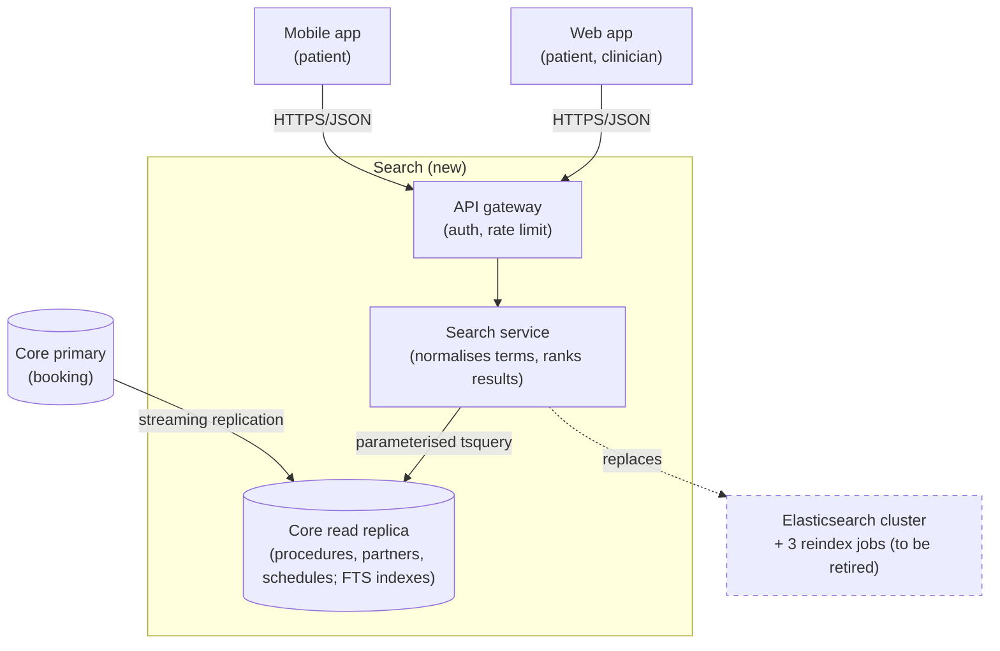
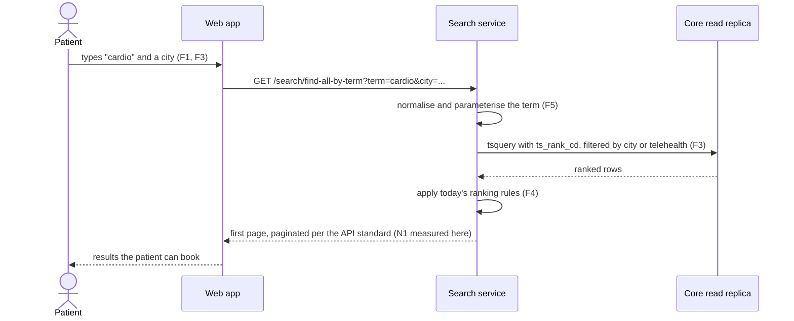

# Worked example: forward-looking RFC

A condensed RFC deciding how search will be served for a purchase flow. Use it as a model for
*structure, depth and tone*: the usage and goals tables, constraints kept apart from prior decisions,
requirement tables with a goal, a scenario or a derived target, and a proof on every row, embedded
diagrams, and a tradeoff table with a requirements column and a baseline row. Figures are illustrative
but written the way real ones should be written, with a source and a label attached. The instruments
behind those figures are named generically here only because this file ships in a public repository;
a real document names the dashboard, the tracker and the load tool the team actually uses. (The skill
writes in the language of the request; this example is in English, and the same structure applies in
any language.)

---

# RFC: Serving search for the purchase flow

**Status:** proposed
**Decider:** Tech lead, Search  ·  **Reviewers:** Platform guild, DBA, Product owner for scheduling
**Current working focus:** decision

## Reversibility

**One-way door on the data store.** Moving search off Elasticsearch means writing ranking logic against
Postgres and decommissioning the cluster; coming back would mean rebuilding indexes and re-tuning
ranking. The provisioning and language choices are two-way doors, cheap to revisit, so they get less
space below.

> Sizing the decision first is what justifies the depth of the rest. A document that spends equal
> effort on a reversible choice and an irreversible one has mis-sized both.

## Context

> Told as a story that lands on a problem, not as "this document describes". Every number carries its
> source inline and a label.

Search is served two different ways today: straight from the transactional database and from
Elasticsearch, stitched together across two APIs (the Public Search API and the internal Rest API).
That shape grew as features were added, and it now costs us in three measurable places.

- **Latency.** p95 of the schedule-search endpoint sat at 4.1 s over the last 30 days (latency board,
  read 2026-04-12; *measured*).
- **Money.** Elasticsearch ran USD 2,840 in March (cloud cost report, tag `service:search`;
  *measured*), against USD 310 for the search share of the Core database instance (*estimated*, from
  instance cost apportioned by query time).
- **Maintenance.** 7 of the 19 search bugs closed in the last two quarters were divergences between the
  two sources (issue tracker, component `search`, label `sync`; *measured*).

### Current usage

| Role (what they do with the system) | What they do today | Through what | How often or how much (source) |
| --- | --- | --- | --- |
| Patient searching for a procedure, a professional or a clinic | Types a term in the search modal, picks a result, books a slot | Web app and mobile app calling `GET /public/search` | 18,000 searches/hour at the daily peak; under 40/hour between 01:00 and 05:00 (latency board; *measured*) |
| Clinician searching by the code on a form | Types the national procedure code instead of a name | The same modal | 41% of terms are numeric procedure codes (query logs, 2026-03; *measured*) |
| Support agent resolving "the slot was not available" | Looks the booking up, refunds, rebooks by hand | Admin panel | 11% of Q1 support contacts (support ticket tag `wrong-location`; *measured*) |
| On-call engineer diagnosing a failed search | Correlates logs across two APIs and the reindex jobs by hand | Log search, two dashboards | Last outage took 3 h 10 m to diagnose (INC-4471 post-mortem; *measured*) |

**The problem.** Phase III layers the full purchase flow (search, cart, checkout) on top of this search.
The fragmented shape cannot carry the new flow without regressing today's behaviour or its ranking, and
it already loses patients above 3 s: the funnel shows a 31% drop-off when search exceeds 3 s (funnel
dashboard, 2026-03 cohort; *measured*).

### Technical context

There are two data sources. The transactional Postgres database holds `management.procedure` and
`partner.partner`, queried directly by the Rest API with `ILIKE` predicates and no text index
(`api/search.rb:96-184`). Elasticsearch holds one index per entity, refreshed by three cron jobs
(`ops/cron/reindex-*.yml`), and serves the search modal through the Public Search API. Ranking rules
live in `search/ranking.py:212-388` and are duplicated in the Rest API path, which is where most of the
sync bugs come from.

> Every index, endpoint, table and file is named. The obvious is stated, and each claim can be checked
> without asking anyone.

### Goals

| Goal | Who benefits | How we will know |
| --- | --- | --- |
| Patients complete the search they started and book from it | Patients; the scheduling funnel | Drop-off above 3 s falls from 31% toward the funnel's baseline of 9% for sub-second steps (funnel dashboard) |
| A result shown is a result the patient can book | Patients; support agents | "Slot not available" contacts fall from 11% of Q1 volume (support ticket tag) |
| Search stops being a source of incidents for the booking flow | On-call engineers; the DBA | No booking-flow incident with search as root cause in the two quarters after cutover (incident log) |
| Search costs what it is worth at our volume | The team's budget owner | Monthly run cost of search on the cloud cost report |

> Each goal is an outcome for a role. None names a feature, a technology or a system metric; those
> come next, and they point back here.

### Stakeholders

| Role (what they do with the system) | What they need from this decision | Who speaks for them |
| --- | --- | --- |
| Patient searching and booking | Today's orderings and filters keep working; results they can book | Product owner, scheduling |
| Clinician searching by code | Code search stays first-class | Product owner, scheduling |
| Support agent handling wrong-location contacts | Fewer unbookable results | Head of support |
| On-call engineer diagnosing search | One place for search logic; a failing request traceable end to end | Search team lead |
| DBA protecting the booking flow | No new read load on the primary without a ceiling | DBA |
| Platform guild operating the runtimes | A runtime someone owns; the API standard followed | Platform guild lead |

### Constraints

> Externally imposed. They are true from the start rather than proved at the end, and a row may exclude
> an option only by citing the clause that does it.

| Constraint | Source (outside the organization, or a signed commitment) | What it excludes, and the clause |
| --- | --- | --- |
| Procedure codes shown and searched are the national standard codes | National health agency terminology standard; the partner contracts reference it (clause 4.2) | Nothing in this analysis; every option indexes the same codes |
| New managed services for 2026 fit within the approved platform budget line of USD 4,000/month in total | Finance-approved 2026 budget, line "platform services" | An option whose run cost pushes the line past USD 4,000 is excluded unless finance reopens the line |

### Prior decisions

> Decided by someone inside the organization. None excludes an option: each incumbent has a row in the
> tradeoff table and an alternative beside it, with the cost of reversing recorded in the row.

| Prior decision | Who made it, when | Incumbent it implies | Cost to reverse |
| --- | --- | --- | --- |
| Public endpoints follow the company API standard | Platform guild, 2025-03 | Standard-shaped endpoints | Low for new endpoints; high for ones the mobile app already consumes, which need a client release |
| Compute runs on the existing Kubernetes cluster unless the guild reviews an exception | Platform team, 2025-11 | Cluster deployment | Medium: a review takes about two weeks; two services already run serverless |
| Ranking business rules stay as they are today | Product owner, scheduling, 2026-02 | Today's ranking | High: a ranking change needs an experiment and product sign-off |
| Merges are gated by the repository coverage threshold | Search team, in `.github/workflows/ci.yml:38` | Coverage gate stays | Low: team practice, changeable in a pull request |

### Assumptions and open questions

**Blocking** (the status stays proposed while one is open):

| Question | Owner | Date | If yes | If no |
| --- | --- | --- | --- | --- |
| Can Postgres full-text search reproduce today's first-page ranking for the top 500 terms (pass: at least 490 of 500 with zero position differences)? | Search team lead | 2026-04-09 (run; result below) | The Postgres option stays and the cluster is retired | Elasticsearch stays for the divergent query shapes behind a flag, and N4's target moves |

The proof of concept ran on 2026-04-09 (branch `poc/pg-fts`): 487 of 500 terms matched, 13 diverged.
Below the pass criterion by three terms; the product owner reviewed the 13 and accepted the list, so
the question is closed with a residual risk recorded in the Decision.

**Non-blocking:**

- Peak concurrency is *estimated*, not measured: ≈360 concurrent requests (18,000 searches/hour at the
  observed daily peak ÷ 3,600 × 72 s median session, from the latency board). A month of request-level
  tracing would replace the estimate; N1 and N3 are re-tested if it is materially higher.
- We assume ranking parity matters to conversion at the margin (*assumed*). A two-week A/B on the top
  500 terms would tell us; until then parity is a prior decision of the product owner.

### Out of scope

- **The checkout and purchase flow.** Its own document, even though it underpins the search
  requirements.
- **Which cities may offer telehealth.** A business-rules problem owned by the CMS; search reads the
  rule, it does not decide it.

> Out of scope lists problems, never options. Every option that was considered sits in the tradeoff
> table, including the ones that lose.

## Requirements

> Five items from the original request were reclassified. "Standardized endpoints", "coverage above
> 90%" and "runs on the cluster" are prior decisions and moved to that table with their incumbents in
> the tradeoff analysis. "Tracing on every request" is a design choice serving N2 and moved to Design.
> A "nice to have ADR directory" left the document and became a roadmap task.

### Functional

| ID | Goal (a row of the Goals table) | Requirement (the role, and what the system does for it) | Proof (the scenario, and how it is run) | Source |
| --- | --- | --- | --- | --- |
| F1 | Patients complete the search they started | A patient can use every ordering and filter available today, including filter by location | Given the 500 most frequent query shapes from the last 90 days, when each is replayed against old and new, then result sets match; run as a contract suite in CI | Technical context: current endpoints and parameters |
| F2 | Patients complete the search they started | A clinician can find a procedure by its national code as well as by name or keyword | Given 200 real terms sampled from the logs (82 of them codes), when each is searched, then the expected procedure is on the first page; run as a fixture test | Query logs: 41% of terms are codes (*measured*) |
| F3 | A result shown is a result the patient can book | A patient sees only partners serving the location they gave, telehealth counting as bookable anywhere | Given a patient in a city with no clinic offering the procedure, when they search, then every result offers telehealth or is bookable in that city; run end to end per location tier, plus a production check on bookings rejected for location | 11% of Q1 contacts (*measured*) |
| F4 | Patients complete the search they started | A patient sees results ranked as they are today for the top 500 terms | Given the top 500 terms, when ranked by old and new, then zero first-page position differences (residual: 13 accepted terms); run side by side before cutover | Prior decision: ranking rules stay; POC result above |
| F5 | Search stops being a source of incidents | A user-entered term cannot read or damage partner data | Given the injection payload suite, when each payload is submitted on every path into the store, then no query is altered; run in CI with a static rule on the query builders | `api/search.rb:118` interpolates terms into `ILIKE` today |

### Non-functional

| ID | Goal | Requirement (metric, target, condition) | Derived from | Proof (measurement) | Source |
| --- | --- | --- | --- | --- | --- |
| N1 | Patients complete the search they started | p95 of `GET /search/find-all-by-term` at or below 3,000 ms at the estimated peak of ≈360 concurrent requests | Today 4,100 ms (latency board, 30 days to 2026-04-12; *measured*); drop-off rises above 3 s (funnel dashboard, 2026-03 cohort; *measured*), so 3 s is where the loss begins | Load run in staging reproducing the peak against production-sized data, in CI before each release | Funnel dashboard; latency board; peak from Assumptions (*estimated*) |
| N2 | Search stops being a source of incidents | Any failed search request is traceable end to end from its correlation id within 5 minutes of the alert | INC-4471 took 3 h 10 m (post-mortem; *measured*); 5 minutes is the on-call lead's commitment for a single-service diagnosis | Game-day drill before launch: inject a failure, time the diagnosis | INC-4471 |
| N3 | Search stops being a source of incidents | Search query load adds at most 10% to Core database CPU at the estimated peak | The nightly reindex alone saturated Core for 22 minutes (INC-4471; *measured*); 10% is the DBA's stated ceiling for any non-booking workload | Load test with search traffic on; CPU read from the database dashboard | INC-4471; DBA |
| N4 | Search costs what it is worth | Monthly run cost of search at or below USD 1,500 at current volume | Today USD 3,150 combined (cost report; *measured* + *estimated*); USD 1,500 is the point where payback on the migration effort is under a year (estimate: 60 engineer-days) | Cloud cost report, tagged, one month after cutover | Context: money |

> Every row states the goal before the requirement, because the goal is what makes the requirement
> negotiable, and every target says where its number came from. If 3.5 s turns out to cost almost
> nothing in abandonment, N1's target can move and a cheaper design becomes viable.

## Design

> Decides dimension by dimension, naming the requirement each choice answers and the prior decision it
> touches.

### Data access and ranking

A **search service** owns all search reads (F1, F2, F3, F4). It exposes the endpoints the web app and
the mobile app call, so ranking logic exists in exactly one place, which removes the class of bug behind
7 of 19 search defects. Terms are parameterised at the query-builder boundary (F5).

### Application provisioning

Lambda versus the existing Kubernetes cluster. Search traffic drops to near zero overnight (under 40
requests/hour between 01:00 and 05:00; *measured*), which favours per-invocation billing (N4). The
watch point is database connections: ≈360 concurrent invocations without pooling would exhaust Core's
connection limit, and the database connection proxy already in place covers it (N3). Choosing Lambda
touches the cluster prior decision; the guild's review is the cost, and two services already run this
way.

### Language

Node versus Go at the estimated peak. Both handle I/O well; Go pulls ahead on CPU-bound ranking work and
cuts memory per invocation, which reduces Lambda cost (N4). Prior CPU problems in the Node services are
what drove the team's earlier move to Go.

### Data store

Elasticsearch delivers ranking and indexing out of the box but costs USD 2,840/month (N4), and part of
search traffic already bypasses it. The alternative is Postgres full-text search (`tsvector`,
`tsquery`, `pg_trgm`, `ts_rank_cd`) against a dedicated read replica, which keeps search load off the
primary (N3). Reproducing the ranking (F4) was the blocking question; its proof of concept is reported
in the tradeoff table.

### Observability

Structured logs with a correlation id propagated from the edge, distributed tracing across the service
and its database calls, and a latency and error dashboard per endpoint. This is the design choice that
meets **N2**; the requirement is the 5-minute diagnosis, not the tool.

### Static view

*Figure 1. C4 container diagram of the target state. Answers F1, F2, F3, F5, N3, N4.*

### Dynamic view

*Figure 2. Sequence for the "search by term" scenario, container level. Answers F1, F3, F4, F5, N1.*

> Every component names the requirement it serves, and every requirement ID appears at least once in
> this section. That two-way check is what catches both scope creep and gaps.

## Alternatives analysis (Tradeoff)

### Decision drivers

1. **N3** (cannot endanger the booking flow) and **F4** (ranking parity): effectively veto criteria.
2. **N1** (latency), then **N4** (cost), then the budget constraint's ceiling.
3. Operational load on a team of four.
4. Reversibility: the data store is a one-way door, so evidence matters more there than elsewhere.

> Naming the drivers before the options is what stops the table from being reverse-engineered to fit a
> favourite. "The platform team prefers the cluster" is not a driver: it is a prior decision with a
> cost, and it appears as a cost in the rows below.

### What every option shares

Every option below keeps search as an internal service reading the company's own data, on the current
cloud provider. The first is the smallest change that would work and sits in the baseline row for
comparison; a bought search product was considered and appears as the managed-service row; the cloud
provider is a prior decision from 2024 whose reversal is out of proportion to this decision, and it is
recorded here rather than given a row.

| Alternative | Requirements (met / partial / missed, by ID) | Pros | Cons | Risk | Impact | Probability | Mitigation | Contingency |
| --- | --- | --- | --- | --- | --- | --- | --- | --- |
| **[Data store] Postgres FTS on a dedicated read replica** | met: F1, F2, F3, F5, N3, N4; partial: F4 (13 of 500 terms diverge) | Removes USD 2,840/month; single source, no sync; POC reproduced first-page ranking on 487 of 500 | High effort to replicate scoring (`dis_max`, boost, BM25); 13 terms still diverge | Text-search queries compete with transactional load | High: the booking flow | Medium: GIN indexes are write-heavy | Dedicated replica; GIN indexes; `VACUUM ANALYZE` in low-traffic windows; the N3 load test gates cutover | Separate Postgres instance for search reads only |
| | | | | The 13 divergent terms may not converge | Medium: ranking complaints | Medium: per-term tuning has diminishing returns | Tune `ts_rank_cd` weights; product sign-off on the residual list | Keep Elasticsearch for those query shapes behind a flag |
| **[Data store] Keep Elasticsearch, improve it, database for specific cases** | met: F1, F2, F4, N1; partial: F3 (needs a city field indexed); missed: N4 | Mature ranking for free; less implementation effort | Keeps the USD 2,840; two sources, so sync bugs persist | Reindexing remains a sensitive operation | Medium: stale results | High: three jobs, no versioning today | Blue-green indexing with versioned indexes | Roll the alias back |
| **[Data store] Managed search service (OpenSearch Serverless)** | met: F1, F2, F4; partial: N4 (USD 1,900 estimated, so the budget line is met only marginally); missed: none | No cluster to operate; scales to the overnight trough | Guild review for a new managed service (two weeks); usage-based pricing hard to predict | Cost model surprises at peak | Medium | Medium: no metered history | Two-week metered trial before committing | Fall back to the replica option |
| **[Provisioning] Lambda** | met: N4, N3 (with the connection proxy) | Cost matches the traffic shape; auto-scales to the peak; no cluster to operate | Cold start visible on an interactive search; reverses the cluster prior decision (guild review) | Cold start adds hundreds of ms to p95 (N1) | Low | Medium: Go binaries start fast | Provisioned concurrency in business hours | Move the hot endpoint to the cluster |
| | | | | Saturating the connection proxy at ≈360 invocations (N3) | High | Medium: limits untested at this concurrency | Validate proxy limits in the N1 load run; monitor connections | Reserved concurrency; larger proxy instance |
| **[Provisioning] Existing Kubernetes cluster (incumbent)** | met: N1, N3; partial: N4 (idle cost overnight) | No reversal cost; no cold start; pooling in-process | Pays for idle capacity when traffic is under 40 req/h | Idle cost erodes the migration's payback | Medium | High: the traffic shape is measured | Scale to zero with an autoscaler | Accept the cost and move N4's target |
| **[Language] Go** | met: N4 | Better CPU profile for ranking; lower memory per invocation; single binary | Lower team familiarity; slower delivery at first | Learning curve lowers early productivity | Medium | High: two of four engineers are new to Go | Go patterns defined up front; the curve budgeted on the board | Ship the first endpoint in Node and port it |
| **[Language] Node (incumbent)** | met: N1; partial: N4 (higher memory per invocation) | Team familiarity; faster start | Prior CPU incidents in Node services | CPU-bound ranking regresses at peak | Medium | Medium: two past incidents | Profile ranking early | Port the ranking module to Go |
| **[Ranking] Re-tune ranking during the migration (reverses the prior decision)** | missed: F4 | Chance to fix known ranking oddities | Reverses a product decision; needs an experiment | Conversion moves in an unmeasured direction | High | High: no A/B infrastructure yet | None without the experiment | Not applicable; rejected |
| **Baseline: do nothing** | met: F1, F2, F4; missed: F3, N1, N2, N4 | Zero effort and zero migration risk | Leaves p95 at 4.1 s, the cost at USD 3,150, the sync bugs, and Phase III on the fragmented shape | Phase III inherits the coupling and search takes the booking flow down | High | Medium: INC-4471 already happened once | None available without the work this RFC proposes | None |

> Rows are added without repeating the alternative to carry multiple risks. Every option is scored
> against the requirement IDs, *partial* names its gap, every incumbent from the prior decisions table
> has a row and an alternative, and the baseline is on the table so the cost of acting is compared
> against the cost of not acting.

## The decision

**Provision on Lambda, in Go, retiring Elasticsearch and serving search from a dedicated Core read
replica with Postgres full-text search.** The drivers decided it: the read-replica option is the only
one that meets N4 without a marginal cost model, and the proof of concept brought F4 within 13 terms of
parity, which the product owner accepted with the residual list attached. N3 is handled by the replica
plus the load-test gate.

**Decision style: autocratic.** The tech lead for Search owns the call, having consulted the platform
guild (provisioning), the DBA (N3) and the product owner (F4). Recorded here so the basis is visible.

### Stakeholder conflicts

- The platform guild preferred the cluster (prior decision, 2025-11). Overridden by N4 and the measured
  overnight trough; the guild's review is scheduled and its cost is in the Lambda row.
- The DBA asked for no new read load on Core at all. Met halfway: the replica takes the load, and N3's
  10% ceiling on the primary is the DBA's own number.

### Consequences

- Search ranking lives in SQL and Postgres scoring functions from now on: cheaper to run, harder to
  change, and it needs someone on the team who understands `ts_rank_cd`.
- The Elasticsearch cluster and its three cron jobs are decommissioned, removing the sync bug class.
- Core gains a replica to operate and monitor, and search failures now correlate with database health.
- Two runtimes remain in play for the team (Lambda and the cluster), so the on-call runbook grows.

### Residual risks

- The 13 divergent terms may not converge; product accepted the list, but a ranking complaint after
  cutover is plausible.
- Peak concurrency is an estimate. If the real peak is materially higher, N1 and N3 both need re-testing
  before the second phase.

### Confirmation

- The N1 load run stays in CI as a release gate: if p95 crosses 3,000 ms at the modelled peak, the
  build fails. That is the fitness function for this decision.
- The peak estimate is the one assumed input: request-level tracing runs for the first month and the
  N1 and N3 tests are re-run against the measured peak.
- Weekly review of Core CPU attributable to search against N3's 10% ceiling for the first quarter.
- Cost report check one month after cutover against N4's USD 1,500.
- Revisit this document if peak concurrency doubles or if the ranking prior decision is lifted.

## Launch strategy

Phase the delivery so there is no eternal migration: the main search-flow endpoints first behind a
flag, with the contract suite (F1) comparing old and new on live traffic shapes; then the secondary
endpoints; then decommission Elasticsearch and delete the cron jobs. Anything not on that list is
explicitly out of scope for now.

## Tasks and roadmap

| Task | Description | Estimate |
| --- | --- | --- |
| Initial project setup | README, folder structure (hexagonal), CI with the coverage gate | 2d |
| Migrations for `tsvector` and indexes; `pg_trgm`; thresholds | `management.procedure`, `partner.partner` (use `CONCURRENTLY`) | 5d |
| Read replica provisioning and monitoring | Replica, connection proxy configuration, CPU dashboard for N3 | 2d |
| `/search/find-all-by-term` | Unified search endpoint, contract tests, load run for N1 | 3d |
| Correlation id and tracing | Edge propagation, tracing, dashboards for N2 | 2d |
| API contract and runbook | OpenAPI file and on-call runbook, produced by this decision, kept in the service repository | 2d |
| ADR directory | Roadmap item carried over from the original wish list | 1d |

## Glossary

| Term | Meaning |
| --- | --- |
| Search service | The new service that owns all search reads; the single home for ranking logic |
| National procedure code | The standard code printed on the forms clinicians work from |
| Core | The transactional Postgres database behind booking |
| FTS | Postgres full-text search (`tsvector`, `tsquery`, `ts_rank_cd`) |

## Sources

- Latency board, read 2026-04-12 (p95, overnight volume, daily peak).
- Cloud cost report, tag `service:search`, March 2026 (Elasticsearch cost).
- Issue tracker, component `search`, label `sync`, closed Q4 2025 to Q1 2026 (sync bug count).
- Support ticket tag `wrong-location`, Q1 2026 (support contact share).
- Funnel dashboard, 2026-03 cohort (abandonment above 3 s).
- INC-4471 post-mortem (reindex saturation, diagnosis time).
- Postgres text-search proof of concept, branch `poc/pg-fts`, run 2026-04-09 (ranking parity).
- 2026 platform budget, line "platform services" (the USD 4,000 ceiling).

> Provenance sits at the end, as backing for facts the document already stated. Nothing above requires
> opening one of these to follow the argument, which is the test of a self-contained document.
