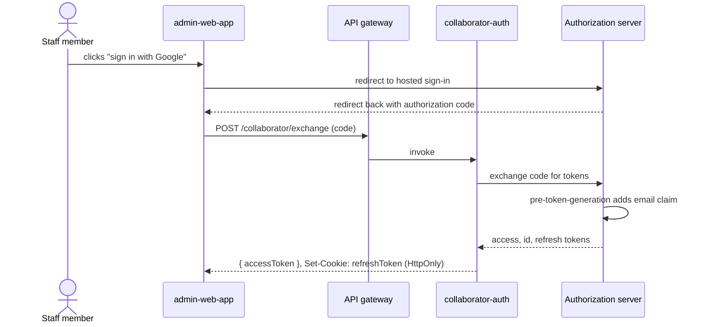

# Worked example: retrospective technical documentation

A condensed technical document written *after* an implementation (social login via an external
identity provider and a managed authorization server). Use it as a model for the retrospective shape:
it documents what was built and why, the flows in detail, and, distinctively, the **lessons learned**
and a **version history**. Links, images and internal tooling names from the original are elided
because this file ships in a public repository; a real document keeps them. (The skill writes in the
language of the request; this example is in English, and the same structure applies in any language.)

---

# Social authentication for the Admin system

**Status:** accepted (in production since 2026-03)

## Introduction

This document describes the implementation of social login in the Admin system, using Google as the
identity provider and AWS Cognito as the authorization server (OAuth 2.0 / OIDC; in production, Google
to Cognito over SAML 2.0).

## Context

### Prior situation

Admin had only internal CPF-and-password authentication, with three weaknesses: credential sharing, an
**access token with a 12-hour lifetime** (`auth/jwt.py:41`, `EXP_HOURS = 12`; *measured*), and
**non-expiring refresh tokens stored in localStorage** (`admin-web/src/auth.ts:88`; *measured*), which
a cross-site scripting attack would have handed over. Credential sharing was reported in the Q4
security review but never counted (*assumed*; an audit of concurrent sessions per account would
quantify it).

> Even a retrospective document sources its current-state claims. "The token lifetime was long" invites
> an argument; `auth/jwt.py:41` ends it, and the label says whether anyone checked.

### Who uses it

| Role (what they do with the system) | What they did before | What changes for them |
| --- | --- | --- |
| Staff member signing in to Admin | Typed CPF and password; shared them when in a hurry | Signs in with the company Google account; nothing to share |
| Security engineer reviewing access | Read the password store and the session table | Reads the identity provider's audit log; passwords no longer exist internally |
| On-call engineer during a provider outage | Nothing to do; the internal login had no external dependency | Switches the sign-in method with a feature flag (see Risks) |

### Motivations for the change

- Remove internal password storage and its management.
- Reduce onboarding friction for staff.
- Inherit the identity provider's controls (multi-factor authentication, password rotation).

### Scope

Focused on the Admin system and staff authentication, designed to be reusable across other internal
systems. It does **not** manage authentication for users external to the company (clients, partners).

> Prior situation, roles, motivations and scope are the retrospective equivalent of an RFC's Context:
> where we came from, who it touches, why we changed, and how far the change reaches.

## Architecture

### Components involved

- **Frontend, admin-web-app:** starts the flow, receives the authorization code, stores the tokens.
- **Backend, rest-api:** validates the access token against the authorization server; keeps the
  CPF/password method available behind the flag.
- **Function, collaborator-auth:** acquires, refreshes and revokes tokens.
- **Function, pre-token-generation:** enriches the access token with the user's email.
- **API gateway, auth.example.com:** fronts the token functions.
- **Authorization server:** user pool, application client, identity provider (Google).

*Figure 1. Sequence of the sign-in flow, container level.*

### Authentication flow

1. **Flow start.** The user clicks to sign in, triggering social login.
2. **Redirect with code.** Google and the authorization server authenticate and redirect with an
   authorization code.
3. **Token request.** The frontend sends the code to `/collaborator/exchange`.
4. **Function execution via the gateway.** `APIGatewayProxyEventV2` event.
5. **Token request to the authorization server.** Exchanges the code for tokens.
6. **Pre-token-generation trigger.** Runs before the final issuance.
7. **Access token enrichment.** Adds the email as a claim.
8. **Tokens returned.** Access, id and refresh.
9. **Response to the frontend.** Body `{ accessToken }`, `Set-Cookie: refreshToken` (HttpOnly).
10. **Client storage.** Access token in localStorage, refresh token in a cookie.

#### Security pattern summary

| Token | Storage | Reason |
| --- | --- | --- |
| accessToken | localStorage | Fast access for API calls (short life, 15 min) |
| refreshToken | Cookie (HttpOnly) | Stronger protection against cross-site scripting (long life, 12 h) |

> Also document the rest of the lifecycle: token **validation** (expiration and issuer, then the JWKS,
> then user identification), **refresh**, and **revocation** (logout), each as its own numbered
> sequence.

## Risks and mitigations

| Risk | Impact | Probability | Mitigation | Contingency |
| --- | --- | --- | --- | --- |
| Identity provider or authorization server unavailable | High: no staff can sign in | Low: two provider incidents in the last year (status page history; *measured*) | The CPF/password method stays deployed behind a feature flag | Flip the flag; sign-in falls back within a minute, no deploy |
| User pool schema needs a change | Medium: recreating the pool means migrating all users | Medium: two schema requests arrived during the project | Attributes kept minimal; custom attributes avoided | Scripted export and import, rehearsed in staging |

## Lessons learned

> The section that sets a retrospective document apart: what we discovered *by doing it*, so whoever
> comes next does not trip on the same stone.

- **Browser cookie management.** `SameSite`, `HttpOnly` and `Secure` are fundamental against
  cross-site scripting and request forgery; understanding each property was crucial.
- **The user pool schema is immutable.** Changing it requires recreating the user pool; in production
  that would mean migrating all users.
- **Cross-origin rules should have been decided before implementation.** Adjusting them mid-work cost
  time and shifted direction (it motivated the API gateway).
- **Short-lived tokens.** The architecture was conceived around short-lived tokens; studying the
  approach deeply (market recommendations, security impact) was essential.

## Improvement point

To raise security, complete the PKCE flow (validate `code_challenge` and `code_verifier`). Not
implemented today because initialization happens via Google Workspace with a fixed ACS URL, which
prevents dynamic generation of those parameters.

## Glossary

| Term | Meaning |
| --- | --- |
| CPF | Brazilian individual taxpayer number, used as the internal login identifier |
| User pool | The authorization server's directory holding staff identities and its client configuration |
| PKCE | Proof Key for Code Exchange, the OAuth extension that binds an authorization code to the client that requested it |
| ACS URL | Assertion Consumer Service URL, where the identity provider posts the SAML response |

## Sources

- `auth/jwt.py:41` and `admin-web/src/auth.ts:88` (prior token lifetimes and storage).
- Q4 security review, credential-sharing finding.
- Identity provider status page, incident history for the last twelve months.
- User pool `admin-staff`, console configuration as of the cutover.

## Version history

| Version | Date | Author | Description |
| --- | --- | --- | --- |
| 1.0 | 2026-03-16 | Author A | Document created. |
| 1.1 | 2026-03-17 | Author B | Updated the logout flow. |
