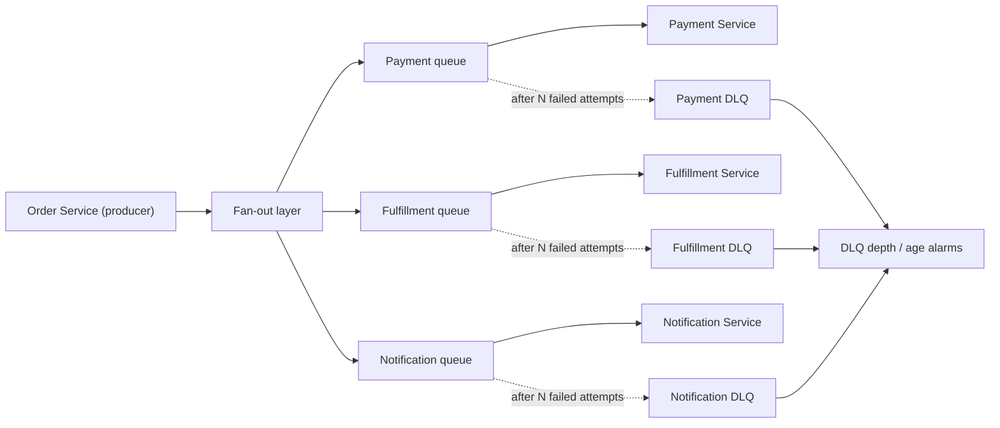
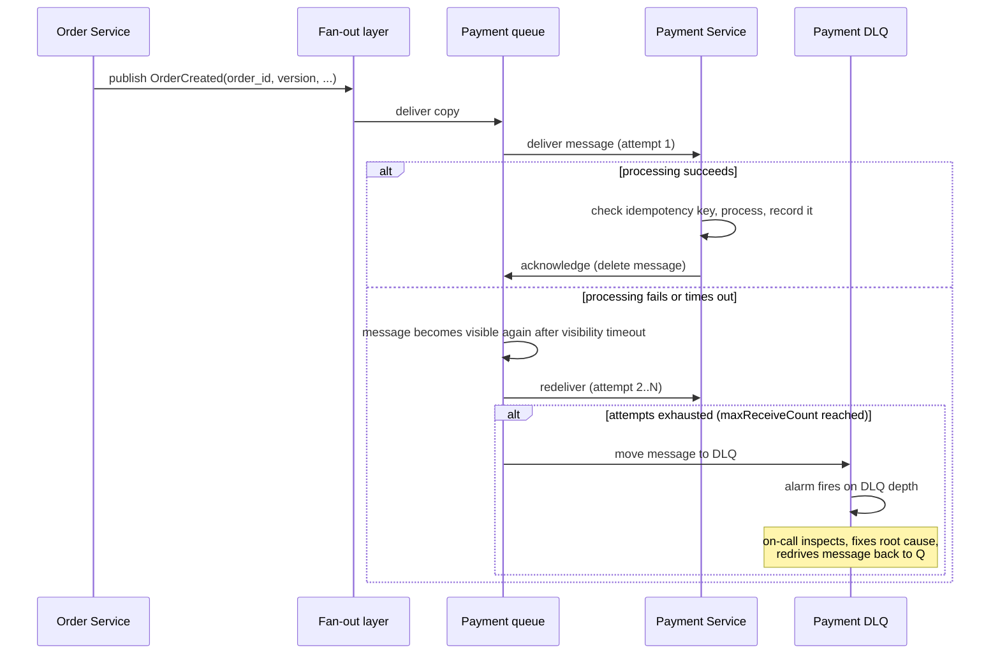

# RFC — Message Queue for the Order-Processing Pipeline

**Status:** Draft — proposed for team review
**Current working focus:** decision

## Related documents

- None supplied at time of writing. This RFC should link, once available: the order-processing
  pipeline's service map, current throughput/traffic projections, and the on-call runbook for the
  team that will own this queue.

## Context

We are building a new order-processing pipeline: a chain of services that reacts to an order being
placed — charging payment, reserving inventory, notifying the customer, triggering fulfillment — each
of which currently would be invoked synchronously or not at all. To decouple these steps, survive a
downstream service being briefly unavailable, and let each stage scale independently, we need an
asynchronous message queue sitting between the order producer and its consumers.

Two candidates are on the table:

- **AWS SQS** — a fully managed, "serverless" queue service. No cluster to run; AWS operates the
  storage, replication, and scaling.
- **Self-hosted RabbitMQ** — an open-source AMQP 0-9-1 broker, deployed by us on infrastructure we
  already operate ("our existing cluster" — assumed to mean an existing Kubernetes cluster; see
  **Assumptions** below, since the RFC request didn't specify).

The choice matters because a message queue sits on the critical path of revenue-generating traffic,
is expensive to change once consumers are built against its delivery semantics and client libraries,
and is exactly the kind of foundational, hard-to-reverse decision this document's method exists for.

### Out of scope

- **The order-processing business logic itself** (what payment, inventory, and fulfillment do with
  an order event) — this RFC is only about the transport between them.
- **The order database / system of record** — whatever stores order state durably is a separate
  decision; the queue only carries events about that state.
- **Kafka-style event streaming as the pipeline's backbone** — considered and set aside early, see
  *Also considered*, because nothing in the ask indicates a need to replay history or fan a single
  event stream out to many independent, order-agnostic analytics consumers.

### Assumptions (flagged because they weren't supplied and materially affect the analysis)

The task did not include real traffic figures, the team's current operational experience with
RabbitMQ, or what "existing cluster" refers to. Rather than block on that, this RFC proceeds on
explicit, labeled assumptions and calls out where a wrong assumption would flip the recommendation.
Each is marked **[ASSUMPTION]** where it's used below.

- **[ASSUMPTION-CLUSTER]** "existing cluster" means an existing Kubernetes cluster already running
  other production workloads, not a cluster dedicated to messaging.
- **[ASSUMPTION-VOLUME]** peak order volume is moderate — on the order of tens to low hundreds of
  orders/sec today, not tens of thousands. This is the single biggest unknown in this document (see
  *Open questions*) and should be confirmed with real numbers before build starts.
- **[ASSUMPTION-OPS]** the team does not currently run RabbitMQ (or an equivalent stateful broker) in
  production and has no existing on-call muscle for it.
- **[ASSUMPTION-CLOUD]** the org already runs primarily on AWS (implied by SQS being on the table at
  all).

## Requirements

Only requirements that would make the design look genuinely different are listed; feature-level
detail (exact payload schema, specific downstream service names) is left to implementation.

### Functional

- An accepted order must produce a durable event before the API call that created it returns
  success — an order the customer believes was placed must never silently vanish from the pipeline.
- Every order event must be delivered to its consumer(s) **at least once**; consumers must be able to
  detect and safely ignore duplicate deliveries (idempotent processing), since at-least-once delivery
  implies duplicates are a normal, not exceptional, occurrence.
- A message that repeatedly fails processing must be preserved for inspection and reprocessing, never
  silently dropped, after a bounded number of retries.
- Ordering: at minimum, updates to the *same* order must be processed in the order they were
  produced (e.g., "payment captured" must never be processed before "order created" for the same
  order). Ordering across *different* orders is not required.

### Non-functional

- **Durability (business-critical, non-negotiable):** zero accepted-and-enqueued order may be lost
  due to a single-AZ outage, a broker node failure, or a crashed consumer. This is the requirement
  that gates every alternative below — an option that cannot satisfy it outright loses regardless of
  its other merits.
- **Availability:** the broker itself must not be a single point of failure; no single-node design is
  acceptable for this path.
- **Throughput:** **[ASSUMPTION-VOLUME]** sustained tens, peak low hundreds of messages/sec. Needs
  confirmation — see *Open questions*.
- **Latency:** **[ASSUMPTION-VOLUME]** an enqueued order event should typically reach its consumer
  within low single-digit seconds; this is a decoupling queue, not a hard-real-time control path.
- **Operability:** minimize new categories of production incident and on-call load for a team that,
  per **[ASSUMPTION-OPS]**, has no standing RabbitMQ operational experience today.
- **Cost:** predictable and roughly proportional to actual usage; avoid large fixed cost for
  **[ASSUMPTION-VOLUME]**-level traffic.
- **Security:** encryption in transit and at rest; least-privilege access so a consumer can only read
  the queues it owns, and only producers can write to producer-facing queues/topics.
- **Observability:** depth of the dead-letter queue and age of the oldest unprocessed message must be
  visible on a dashboard and alertable — an invisible backlog is, for this pipeline, equivalent to
  silent message loss.

## Design

The design is deliberately conservative: one primary decision (the broker) plus the minimum
supporting components needed to satisfy the durability and idempotency requirements above, regardless
of which broker wins.

### Components

- **Order Service (producer):** publishes an event after the order is durably recorded in the system
  of record. *Requirement served:* accepted-order-never-vanishes.
- **Fan-out layer:** a single publish point that reaches every interested consumer without the
  producer knowing who they are. *Requirement served:* the "route to more than one consumer type"
  need, without taking on content-based routing before it's confirmed necessary (see the Alternatives
  section — this is where the SQS design and the RabbitMQ design differ).
- **Per-consumer queue** (Payment, Fulfillment, Notification, …): each consumer type owns its own
  queue so one slow or broken consumer never blocks another. *Requirement served:* independent
  scaling; failure isolation.
- **Dead-letter queue (DLQ) per consumer queue:** after a bounded number of failed delivery attempts,
  the message is moved here instead of retried forever or dropped. *Requirement served:*
  never-silently-dropped.
- **Idempotency check in each consumer** keyed on `(order_id, event_version)`: since at-least-once
  delivery guarantees occasional duplicates, the consumer — not the broker — is the place that must
  make duplicate processing safe. *Requirement served:* at-least-once-without-double-charging.
- **Monitoring:** DLQ depth and oldest-message-age alarms per queue, plus a correlation ID carried on
  every message for end-to-end tracing. *Requirement served:* observability.

### Static diagram

*(Component list, for a text-only reading: Order Service → Fan-out layer → three per-consumer queues
→ their consumers; each queue also drains into its own DLQ after exhausting retries; all three DLQs
feed one set of monitoring alarms.)*

### Dynamic diagram — happy path and failure path

## Also considered (screened out before the tradeoff table)

- **Apache Kafka / Amazon MSK** — a strong fit if the pipeline needed replay-from-history or many
  independent, order-agnostic analytics consumers reading the same stream. Neither is asked for here;
  adding a log-based streaming platform (partitions, consumer-group offset management, retention
  tuning) to get an ordered, at-least-once *task queue* is materially more machinery than the
  requirements justify. Steelman: if "complex routing" in the original ask actually meant "many
  independent teams each need their own replayable view of every order event," Kafka — not
  RabbitMQ — would be the right re-open of this RFC.

## Alternatives analysis (Tradeoff)

Grouped under the one dimension being decided: **which broker carries order events.** All three
options below are credible; each is weighed against the durability requirement (non-negotiable) and
the assumed volume/ops requirements (flagged where the assumption drives the row).

| Alternative | Pros | Cons | Risk (description) | Impact | Probability | Mitigation | Contingency |
| --- | --- | --- | --- | --- | --- | --- | --- |
| **AWS SQS** (Standard queues + SNS fan-out + per-queue DLQ) | Fully managed: no cluster, no patching, no capacity planning; AWS's own SLA-backed durability (redundant storage across multiple AZs) meets the durability requirement out of the box; near-zero ops burden fits **[ASSUMPTION-OPS]**; pay-per-request cost model fits **[ASSUMPTION-VOLUME]**; SNS→SQS fan-out already covers "route one event to several independent consumer types," which is most of what "complex routing" tends to mean in practice | No exchange-style content/topic-based routing inside the broker itself — only subscription filters on SNS, which is coarser than AMQP topic/header exchanges; Standard queues alone don't guarantee ordering (mitigated by using FIFO where per-order ordering matters); message size capped at 256 KB; ties the team to AWS for this component | If the *speculative* "complex routing" need turns into a firm requirement for content-based routing across many dynamically defined consumer types, SQS+SNS becomes awkward and a later migration touches every consumer's subscription logic | Medium | Low–Medium (need is stated as "might," not committed) | Build consumers against the *event*, not the transport (idempotent handlers, own dedup) so only the fan-out layer would need replacing, not consumer logic; use SNS message-attribute filtering now to cover the routing patterns already known | Introduce Amazon MQ (managed RabbitMQ) or a topic-exchange layer alongside SQS for only the queues that need it, without re-architecting the consumers already on SQS |
| | | | Using FIFO queues (needed for strict per-order ordering) caps throughput at 300 msg/s per API action without batching, 3,000/s with batching (higher in "high throughput mode," regionally capped at 2,400–9,000 TPS per API action) | Low | Low, given **[ASSUMPTION-VOLUME]** (tens–low hundreds/sec) | Batch sends/receives; scope FIFO to only the queues where cross-message ordering actually matters, Standard elsewhere | Enable SQS FIFO high-throughput mode; shard by a partition key across multiple message groups |
| **Self-hosted RabbitMQ** on the existing cluster (quorum queues, not classic mirrored — mirrored queues were removed in RabbitMQ 4.0) | Rich, native routing (direct/topic/fanout/headers exchanges) available from day one, directly answering "complex routing we might need later"; no per-request fee — cheaper at sustained high volume; no new AWS dependency; reuses infrastructure and tooling the team already has | The team now owns a stateful, Raft-replicated distributed system in production with, per **[ASSUMPTION-OPS]**, no existing operational experience running one; quorum queues require an odd-numbered replica set with real disk and memory headroom, upgrade planning, and monitoring the team has to build itself; **[ASSUMPTION-CLUSTER]** deploying it onto a cluster shared with other workloads adds noisy-neighbor and blast-radius risk on a business-critical path that a dedicated queue service wouldn't carry | A misconfigured or under-resourced quorum queue cluster loses or stalls delivery of business-critical order messages — exactly the requirement this RFC treats as non-negotiable | High | Medium–High, specifically because of **[ASSUMPTION-OPS]** (first production RabbitMQ deployment) | Dedicated node pool / resource quotas isolating RabbitMQ from other cluster workloads; quorum queues (never classic mirrored) with odd replica count ≥3; load-test durability under node-kill and network-partition scenarios before go-live; runbooks and paging before launch, not after | Fail over consumers to read from per-consumer local buffers is not viable for this pattern; realistic contingency is an expedited cutover to Amazon MQ or SQS for the affected queues while the cluster issue is fixed |
| | | | Shared cluster resource contention degrades RabbitMQ latency/throughput during an unrelated workload's incident, indirectly delaying order processing | Medium | Medium (**[ASSUMPTION-CLUSTER]**: cluster is not dedicated to messaging) | Resource requests/limits and node affinity/taints reserving capacity for RabbitMQ; alert on RabbitMQ-specific latency independent of the noisy neighbor | Manually cordon/evacuate noisy workloads; pre-provisioned burst capacity |
| **Amazon MQ for RabbitMQ** (managed RabbitMQ, active/standby, multi-AZ) | Gets the same AMQP exchange-based complex routing as self-hosting, but AWS operates patching, backups, and multi-AZ failover — closes most of the **[ASSUMPTION-OPS]** gap; no new stateful system for the team to run; still avoids the SQS/SNS routing-model limitation entirely | Instance-based pricing (sized broker instances, not pay-per-request) is less cost-elastic than SQS at **[ASSUMPTION-VOLUME]**-level traffic; smaller-scale, less battle-tested AWS service than SQS (SQS is one of AWS's oldest, highest-scale services); still exposes full AMQP complexity (exchanges, bindings, vhosts) to application teams even though AWS runs the boxes | An oversized or undersized broker instance either wastes budget or throttles under peak, and the team still needs AMQP routing-topology expertise it may not have | Medium | Medium | Right-size via load test before launch; start with a single well-understood topology (one topic exchange, per-consumer queues) rather than a wide routing graph on day one | Vertically resize the broker instance; fall back to SQS+SNS fan-out for any queue that doesn't end up needing exchange-based routing |

### Weighed against the requirements

- **Durability (non-negotiable):** all three can satisfy it — but SQS satisfies it as a default,
  managed property, while both RabbitMQ options make the team responsible for configuring and
  operating that guarantee correctly. Given **[ASSUMPTION-OPS]** (no existing RabbitMQ production
  experience), that shifts real risk onto the "we can't lose messages" requirement itself, not just
  onto operability.
- **Complex routing "we might need later":** this is a *stated maybe*, not a committed requirement —
  it fails the "hard to reverse" and "shapes the structure" tests for a requirement *today*, though it
  would clearly pass them if it firms up. SQS+SNS fan-out already covers the routing patterns most
  teams mean by this (multiple independent consumer types per event); true content/topic-based
  routing inside the broker is the part it doesn't cover.
- **Throughput/latency [ASSUMPTION-VOLUME]:** all three comfortably clear the assumed tens–low
  hundreds of messages/sec; this assumption is not the deciding factor between them at the stated
  scale, but it should still be confirmed (see *Open questions*) since it would matter a great deal at
  an order of magnitude higher.
- **Operability [ASSUMPTION-OPS]:** this is where the alternatives separate most clearly. SQS removes
  an entire category of new operational risk; Amazon MQ removes most of it while keeping the routing
  model; self-hosting keeps all of it.

## The decision

**Recommendation: AWS SQS Standard queues (FIFO where per-order ordering is required) with an SNS
fan-out layer and a per-queue DLQ**, as diagrammed above.

**Reasoning:** the one non-negotiable requirement in this RFC is "we can't lose messages." SQS meets
that requirement as a managed default, without asking the team to stand up and operate its first
stateful, Raft-replicated cluster on the business-critical path — a real risk given
**[ASSUMPTION-OPS]**. The other candidate driving toward RabbitMQ — "complex routing we might need
later" — is explicitly speculative in the original ask, and SNS→SQS fan-out already covers the most
common shape of that need (one event reaching several independent consumer types). Building consumers
around idempotent, event-based handling (not around the transport) keeps the door open to introducing
Amazon MQ or a topic-exchange layer later for specifically the queues that turn out to need
exchange-style routing, without having to re-architect what's already shipped.

**The strongest objection to this recommendation, stated plainly:** if the "complex routing" need is
more concrete than the ask lets on and materializes within the next couple of quarters, building on
SQS now means a second migration later — and migrating a live, business-critical queue is itself a
durability risk. **This recommendation should flip to Amazon MQ (or self-hosted RabbitMQ if the team
is willing to invest in the operational buildout first) if, before this RFC is approved, product or
engineering can name concrete, scheduled routing requirements** (specific consumer types selected by
message content, not just "many consumers of the same event") **rather than a "might."**

**Decision style:** Democratic — this document is a proposal, not a unilateral call. It is circulated
to the team with an explicit recommendation and reasoning above; the final choice should be ratified
in the RFC review, weighted specifically by whether anyone can turn "might need later" into a
concrete, scheduled requirement, and by the real throughput number from *Open questions* below.

### Open questions (block sign-off, not the RFC's circulation)

1. What is the actual (or projected) peak orders/sec, today and at a 1–2 year horizon? This is the
   single biggest unverified assumption in this document.
2. Does "complex routing we might need later" refer to a scheduled requirement, or genuinely-unplanned
   optionality? Concrete examples of the routing patterns needed would resolve this immediately.
3. What is "our existing cluster," and does it have headroom (CPU/memory/disk) reserved or reservable
   for a business-critical stateful workload, isolated from other tenants?
4. Does the team have, or plan to build, RabbitMQ/AMQP operational expertise regardless of this
   decision (e.g., for other use cases), which would lower the operability risk above?

## Launch strategy

1. **Confirm the open questions above** — especially real traffic figures — before committing engineering time; they can change the recommendation.
2. **Build the Order Service → SNS → per-consumer SQS queue → DLQ path** for one consumer first (suggest Payment, as the highest-value idempotency case) end to end, including the DLQ alarm and a documented redrive runbook.
3. **Load-test the idempotency and redrive path** under duplicate delivery and consumer-crash scenarios before adding the remaining consumers (Fulfillment, Notification).
4. **Roll out remaining consumers** once the pattern is validated in production for the first one.
5. **Revisit this RFC** if any open question resolves in a way that flips the recommendation (see *The decision*), rather than silently drifting toward RabbitMQ mid-build.

## Tasks and roadmap

| Task | Description | Estimate |
| --- | --- | --- |
| Confirm open questions | Get real traffic numbers and a concrete answer on routing needs from product/eng | 2–3d (coordination, not build) |
| SNS topic + per-consumer SQS queues + DLQs | Infra-as-code for topic, queues, redrive policy, encryption | 2d |
| Order Service publish path | Publish after durable order write; correlation ID attribute | 2d |
| Payment consumer (pilot) | Idempotent handler keyed on (order_id, version); ack-after-success | 3d |
| Observability | DLQ depth + oldest-message-age dashboards and alarms | 2d |
| Chaos/load test | Duplicate delivery, consumer crash, DLQ redrive drill | 3d |
| Fulfillment + Notification consumers | Repeat the validated pattern | 3d each |

## Version history

| Version | Date | Author | Description |
| --- | --- | --- | --- |
| 1.0 | 2026-09-08 | Lucas Marques | RFC drafted: SQS vs. self-hosted RabbitMQ for the order-processing pipeline; recommendation SQS + SNS fan-out, pending team review and open-question sign-off. |
