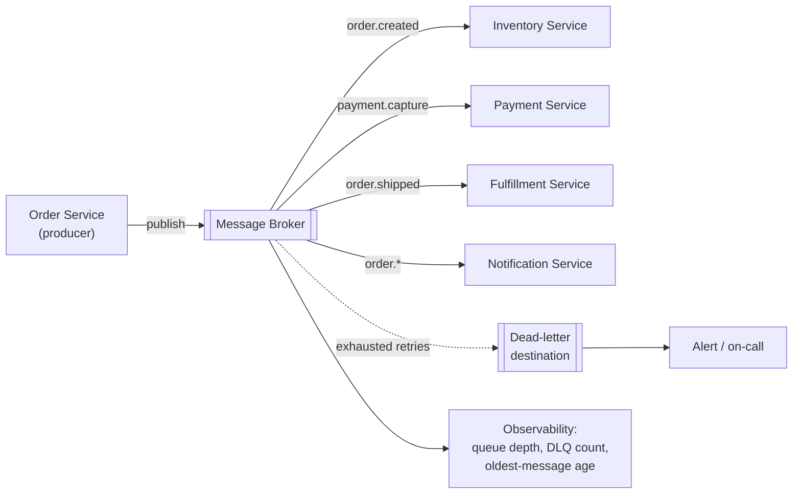
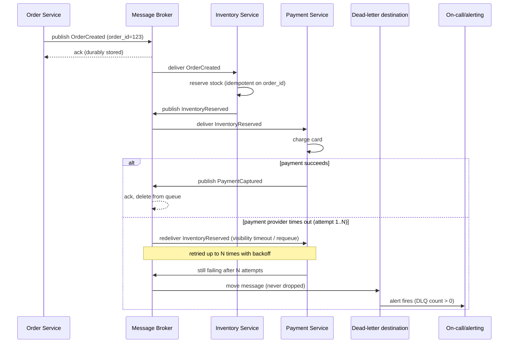

# RFC — Message Queue for the Order-Processing Pipeline

**Status:** Proposed — for team review and decision
**Current working focus:** decision, pending team sign-off

## Related documents

None available. This document has no access to the team's existing architecture diagrams,
runbooks, current-cluster capacity metrics, or ticket history — it was written from the problem
statement alone. Everywhere a real number or a link would normally sit (current cluster headroom,
expected order volume, existing dashboards), this RFC names the gap explicitly instead of guessing.
Before this RFC is approved, whoever owns the existing cluster and whoever owns order-volume
projections should attach the relevant numbers — see **Open questions** at the end.

## Context

The team is building a new order-processing pipeline: order creation will fan out into a sequence
of steps handled by separate services — inventory reservation, payment capture, fulfillment,
customer notification, and whatever else the pipeline ends up needing. Doing this well requires
services to communicate **asynchronously** rather than through direct, blocking calls, so that a
slow or momentarily unavailable downstream step (e.g. a payment provider) doesn't stall order
intake, and so that each step can retry independently on failure. That asynchronous communication
needs a message queue sitting between the producing and consuming services.

Orders are the business — a lost or silently-dropped order message means a customer who paid (or
tried to) and never got their order, or inventory that's reserved and never released. That makes
the message queue **the single component every order in the system will pass through**, and a
component whose failure mode determines whether "we can't lose messages" is actually true or just
a stated intention. Because this component sits underneath the entire pipeline, swapping it out
later means touching every producer and consumer, their retry logic, their dead-letter handling,
and their monitoring — so the choice is expensive to reverse once services are built against it.
That is the decision this RFC exists to make: **which message queue technology the
order-processing pipeline is built on.**

Two options are on the table: **AWS SQS**, a fully managed queue service, and **RabbitMQ**,
self-hosted on the team's existing compute cluster. The fact that AWS SQS is under consideration
is treated here as confirmation the team already operates on AWS; "existing cluster" is assumed
to mean a Kubernetes cluster the team already runs workloads on, since that is the most common
shape of "self-host on our own cluster" — this is an **assumption**, flagged again below, and
should be corrected if wrong before this RFC is approved.

### Out of scope

- **The business logic of each pipeline stage** (how inventory reservation, payment capture, or
  fulfillment actually work) — each is its own service with its own design.
- **The exact message schema/contract** for order events — a follow-up, lower-stakes document once
  the transport is chosen.
- **Any existing synchronous order flow this pipeline might replace** — not described in the task,
  so treated as out of scope; if one exists, its migration plan belongs in a separate document.
- **Complex routing scenarios beyond what's needed for this pipeline today** — see Requirements,
  where "complex routing we might need later" is deliberately *not* treated as a hard requirement
  because it is not yet concretely scoped (no example route, consumer, or trigger was given).

## Requirements

### Functional

1. Producers (starting with the Order Service) must be able to publish order lifecycle
   events/commands (e.g. `OrderCreated`, `PaymentCaptured`, `InventoryReserved`, `OrderShipped`)
   without blocking on how long downstream processing takes.
2. **No order message may ever be silently dropped.** Every message must end in one of exactly
   three states: successfully processed, currently retrying, or parked in a dead-letter
   destination for investigation. "Lost with no trace" must not be a reachable state. This is the
   direct, checkable restatement of "orders are business-critical, we can't lose messages" —
   everything else in this RFC is judged against it.
3. Consumers must tolerate **at-least-once delivery** and de-duplicate by order/event ID. No
   mainstream durable queue (SQS included) guarantees exactly-once delivery under redelivery/retry,
   so idempotent consumers are a requirement of the pipeline, not an implementation detail of the
   broker choice.
4. *(Inference — not confirmed by the task)* Events belonging to the same order likely need to be
   processed in emission order (e.g. `OrderCreated` before `PaymentCaptured` for the same order),
   since out-of-order processing of a single order's own lifecycle would be a correctness bug, not
   just a UX wrinkle. This is flagged as an assumption because it materially changes the broker
   configuration (ordered queues / FIFO / partitioning by order ID) and its throughput ceiling —
   see Open questions.

### Non-functional

1. **Durability.** A message acknowledged as received by the broker must survive a single
   broker-node crash and a single availability-zone failure without being lost.
2. **Availability.** The broker must not be a single point of failure. When the broker is
   degraded, the failure mode must be "orders queue up and get retried," never "orders vanish."
3. **Operability.** Ongoing operational load (upgrades, patching, capacity planning, on-call for
   the broker itself) must fit within the team's actual bandwidth. *(Unconfirmed: team size and
   current on-call load — flagged below; this is the requirement most sensitive to that unknown.)*
4. **Observability.** Queue depth, dead-letter count, and oldest-unprocessed-message age must be
   visible on a dashboard with alerting, so a stuck or backlogged pipeline is caught before it
   reaches customers.
5. **Security.** Messages must be encrypted in transit and at rest; publish/consume access must be
   restricted per service (least privilege), not shared broad credentials.
6. **Cost predictability.** Cost should scale with actual order volume rather than being a large
   fixed cost paid independent of utilization. *(Unconfirmed: expected order volume — flagged
   below; this requirement is read differently at low/variable volume vs. high/steady volume.)*

## Design

The pipeline is the same shape regardless of which broker is chosen — the broker technology is the
one open dimension, resolved in the Tradeoff analysis below. The components:

- **Order Service (producer)** — publishes order lifecycle events. Answers requirement F1.
- **Message broker** — durably holds messages between publish and successful processing; the
  component requirements F2, N1, and N2 are entirely about. Its internal shape (queue vs. exchange
  + queue, FIFO vs. standard) is exactly the tradeoff this RFC resolves.
- **Downstream consumers** — Inventory, Payment, Fulfillment, Notification services, each reading
  from its own queue/binding, each idempotent (F3).
- **Dead-letter destination** — captures messages that exhaust their retry budget instead of
  discarding them. Directly answers F2 ("never silently dropped").
- **Observability** — queue depth / DLQ count / oldest-message-age metrics and alerting, feeding
  whatever the team's existing monitoring stack is. Answers N4.

### Static diagram — components

### Dynamic diagram — one order, happy path and failure path

## Alternatives analysis (Tradeoff)

Dimension being decided: **message queue technology.** Three credible options, all capable of
durable, at-least-once delivery: the two named in the task, plus a middle option (managed
RabbitMQ) that resolves the "control vs. operational burden" tension directly and deserves a seat
at the table before narrowing to two.

| Alternative | Pros | Cons | Risk (description) | Impact | Probability | Mitigation | Contingency |
| --- | --- | --- | --- | --- | --- | --- | --- |
| **AWS SQS (Standard, managed)** | Fully managed — AWS handles multi-AZ replication, patching, scaling; a message is retained until a consumer explicitly deletes it after success, which is the direct mechanism for F2/N1; built-in DLQ via redrive policy; IAM-scoped access + encryption in transit/at rest out of the box; usage-based pricing (no idle cost) | Routing is point-to-point + optional SNS fan-out — no native topic/header routing; approximating RabbitMQ's routing model means composing SNS/EventBridge alongside it; ties the team to AWS for this integration layer | Complex-routing need materializes later, forcing bolt-on AWS services (SNS/EventBridge) instead of one broker | Medium | Medium (explicitly floated as "might," not scoped) | Prototype an SNS→SQS fan-out for the one plausible near-term case (multi-consumer order events) before it's urgent, so the seam exists ahead of need | Introduce EventBridge/SNS alongside SQS for routing-heavy flows without replacing SQS as the durable order-processing backbone |
| | | | Region-wide SQS incident | High | Low (SQS is a mature, multi-AZ, high-SLA managed service) | Idempotent consumers tolerant of delayed delivery; watch AWS Health Dashboard | None practical — cross-region SQS failover is rarely justified for this workload absent a documented business case |
| | | | Strict per-order ordering requires FIFO, whose throughput is capped by default (300/s without batching, 3,000/s with batching, per message group) unless "high throughput mode" is enabled (up to tens of thousands/s, region-dependent) [[AWS docs]](https://docs.aws.amazon.com/AWSSimpleQueueService/latest/SQSDeveloperGuide/enable-high-throughput-fifo.html) | Low–Medium | Low at current unknown/likely-moderate order volume | Confirm actual order volume before committing to FIFO vs. Standard; enable high-throughput mode if needed | Partition by order ID across more message groups, or fall back to Standard + application-level sequencing if FIFO ceiling is ever hit |
| **RabbitMQ, self-hosted on existing cluster** | Native routing (direct/topic/fanout/header exchanges) if a genuinely complex routing need exists; no incremental per-message cloud cost; full control of durability/replication tuning; protocol flexibility (AMQP, MQTT/STOMP plugins) | Team now owns broker operations end-to-end: upgrades, patching, capacity planning, backup/restore, failover testing — on top of building the pipeline itself; durability is opt-in, not default | Misconfigured durability (transient queue, missing publisher confirms, or classic mirrored instead of quorum queues) loses messages on a node crash — quorum queues + publisher confirms only guarantee no loss once a message is confirmed *and* a majority of quorum-queue nodes stay available [[RabbitMQ docs]](https://www.rabbitmq.com/docs/quorum-queues), [[RabbitMQ confirms docs]](https://www.rabbitmq.com/docs/confirms) — this is a direct, silent violation of F2/N1 if missed | High | Medium (this is the most common RabbitMQ production misconfiguration industry-wide) | Mandate durable + quorum queues and mandatory publisher confirms via code review/lint; run a chaos test that kills a broker pod under load and asserts zero message loss before go-live | Producer-side outbox/audit log as a replay source of truth if a gap is ever detected in production |
| | | | Shared-cluster resource contention (CPU/memory/disk pressure from unrelated workloads) degrades broker latency or availability | Medium–High | Medium (unknown current headroom on the existing cluster — flagged below) | Dedicated node pool, resource requests/limits, PodDisruptionBudget for broker pods | Move broker to a dedicated node pool or dedicated cluster if contention recurs |
| | | | Operational-knowledge gap running RabbitMQ well on Kubernetes (StatefulSet + PVs + Cluster Operator + quorum-queue tuning is a real competency, not a checkbox) | Medium | Unknown (team's RabbitMQ/K8s experience not stated — flagged below) | Use the official RabbitMQ Cluster Operator rather than hand-rolled manifests; run a load + failure-injection POC before committing | Fall back to Amazon MQ for RabbitMQ (below) as a middle ground |
| **Amazon MQ for RabbitMQ (managed RabbitMQ, cluster deployment)** | Keeps RabbitMQ's native routing model (relevant if complex routing turns out to be real) while removing day-to-day broker operations from the team; AWS-managed cluster deployment runs 3 nodes across AZs behind a load balancer with automatic mirroring for HA [[AWS docs]](https://docs.aws.amazon.com/amazon-mq/latest/developer-guide/rabbitmq-broker-architecture-cluster.html) | Costs more than self-hosting on already-paid-for cluster capacity (dedicated managed instances, billed regardless of the existing cluster's idle headroom); AWS's managed HA for RabbitMQ clusters currently relies on classic mirrored queues (`ha-mode: all`) rather than quorum queues, which is a materially different (and by RabbitMQ's own newer guidance, less preferred) durability model than a modern self-run quorum-queue setup | AWS's managed configuration doesn't match the durability best-practice (quorum queues) that a self-hosted setup could choose deliberately | Medium | Medium | Confirm with AWS/Amazon MQ docs whether quorum queues are supported in the managed offering before relying on it for the "can't lose messages" requirement | Fall back to self-hosted RabbitMQ with quorum queues, or to SQS |

Other options briefly considered and set aside without a full row: **Kafka** (log-based streaming,
built for replay/fan-out at very high throughput — a heavier operational footprint than any of the
three above, and this pipeline's problem is durable work-queueing, not event replay/streaming, so
it over-shoots the actual requirement); **EventBridge alone** (a routing/bus service, not a durable
work queue with retry/visibility-timeout semantics — it complements SQS, it doesn't replace it).

## The decision

**Recommended: AWS SQS (Standard queues to start, with a redrive policy to a dead-letter queue;
move to FIFO only if the ordering requirement in F4 is confirmed and its throughput ceiling is
checked against real order volume).**

Reasoning, weighed against the requirements above:

- The hard, non-negotiable requirement here is F2/N1 — no message ever silently lost. SQS satisfies
  it by default, with a failure mode (misconfiguration) that is narrow and hard to hit by accident.
  Self-hosted RabbitMQ satisfies it only if durability is configured correctly (quorum queues +
  publisher confirms), and getting that wrong is the single most common RabbitMQ production
  mistake — a real, medium-probability, high-impact risk against the requirement that matters most.
- "Complex routing we might need later" is the stated reason to prefer RabbitMQ, but it does not
  pass this document's own bar for an architecturally-relevant requirement: no concrete route,
  consumer, or trigger was named — it's a maybe, not a scoped need. Building the business-critical
  path around a speculative future requirement, at the cost of taking on full broker operations
  today, is optimizing for a need that may never arrive.
- Operability is the deciding non-functional factor: self-hosting shifts broker upgrades, patching,
  capacity planning, and on-call onto the same team building the pipeline's actual business logic —
  time not spent on inventory/payment/fulfillment correctness. SQS removes that load entirely.
- This is a genuinely close call on one specific axis, not a landslide: if the team already has
  strong RabbitMQ-on-Kubernetes operational experience, if the routing need is concretely scoped
  (not "later"), and if avoiding AWS lock-in for messaging is a real organizational priority, the
  conclusion flips toward RabbitMQ (self-hosted with quorum queues, if operational maturity is
  confirmed, or Amazon MQ for RabbitMQ if it isn't). None of those three conditions are confirmed
  as true today, which is why the recommendation goes the other way — but the team is closer to
  those facts than this document is.

**Decision style:** proposed by this RFC's author, **not yet ratified** — the task that produced
this document is explicitly to give the team something to decide from, so this is a recommendation
for the team (or whoever owns the call) to accept, amend, or override, informed by the Open
questions below. Once ratified, this section should be updated to record who decided and how
(autocratic call vs. team vote) and the Status line at the top changed to "Approved."

## Launch strategy

1. **Phase 1 — backbone.** Stand up SQS (Standard) + DLQ for the first hop: Order Service →
   Inventory Service. Prove idempotent consumption, DLQ alerting, and observability end to end on
   the smallest possible slice before adding more consumers.
2. **Phase 2 — full pipeline.** Add Payment, Fulfillment, and Notification as consumers of their
   respective events, each with its own queue and DLQ.
3. **Phase 3 — ordering, if confirmed.** If F4 (per-order ordering) is confirmed as a real
   requirement, migrate the relevant queues to FIFO with message-group-ID = order ID, after
   checking projected order volume against FIFO's throughput ceiling.
4. **Deferred, not scheduled.** Complex routing (SNS/EventBridge fan-out) is explicitly not part of
   this launch — it's picked back up only if/when a concrete routing requirement is scoped.

## Tasks and roadmap

| Task | Description | Estimate |
| --- | --- | --- |
| Confirm open questions | Order volume, ordering requirement, existing cluster type/headroom, team's RabbitMQ/K8s experience — see below | 2d (coordination, not build) |
| SQS + DLQ provisioning (IaC) | Standard queue + redrive policy, IAM roles per producer/consumer, KMS encryption | 2d |
| Idempotent consumer pattern | Shared library/pattern for dedup-by-order-id, adopted by first consumer (Inventory) | 3d |
| Observability | Queue depth / DLQ count / oldest-message-age dashboards + alert on DLQ > 0 | 2d |
| Chaos/failure test | Kill a consumer mid-processing, verify redelivery and eventual DLQ, zero message loss | 2d |
| Roll out remaining consumers | Payment, Fulfillment, Notification queues + consumers | ~3d each |
| Re-evaluate FIFO/ordering | Only if F4 confirmed; otherwise close as not needed | 1d spike |

## Open questions

These materially affect the recommendation above and could not be resolved from the task
statement alone — they are flagged here rather than guessed at:

1. **Existing cluster type and headroom.** Assumed Kubernetes with unknown spare capacity. If it's
   something else, or if it's already near capacity, the RabbitMQ operational-risk assessment
   changes.
2. **Expected order volume/throughput.** Not stated. Assumed moderate; this affects both the SQS
   FIFO throughput analysis and RabbitMQ cluster sizing, and it's the single number most worth
   getting before this RFC is finalized.
3. **Per-order ordering requirement (F4).** Assumed likely needed but not confirmed — confirm
   before choosing Standard vs. FIFO SQS queues (or the RabbitMQ equivalent).
4. **How concrete is "complex routing we might need later"?** If there's an actual near-term
   use case behind this, name it — it changes the recommendation materially. As stated, it read as
   speculative and was weighted accordingly.
5. **Team's current RabbitMQ/Kubernetes operational experience and on-call capacity.** Unknown;
   directly affects how risky self-hosting actually is for this specific team, versus in the
   abstract.

## Version history

| Version | Date | Author | Description |
| --- | --- | --- | --- |
| 1.0 | 2026-09-08 | Lucas Marques | RFC drafted: SQS vs. self-hosted RabbitMQ vs. Amazon MQ for RabbitMQ, for team review. |
