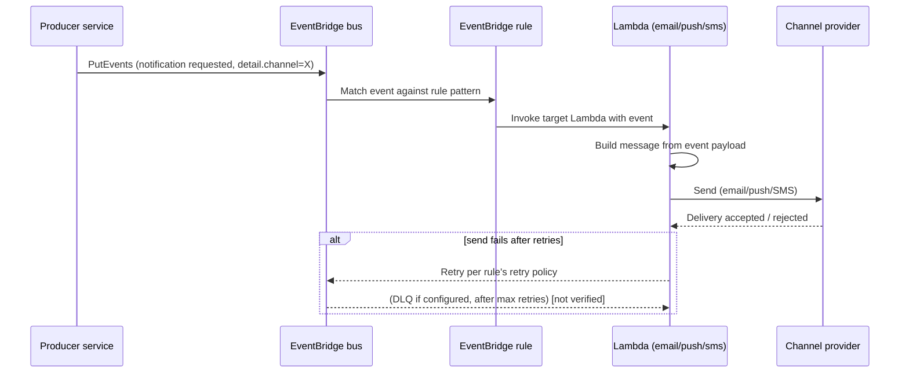

# Notifications Service — From Cron-in-a-Pod to Event-Driven Lambda Fan-Out

**Status:** Draft — pending review by the team that ran the migration (see the flags throughout and
`reply.md` for what needs confirming before this is treated as authoritative).

> **How to read this document.** It was written without access to the actual AWS account, the
> EventBridge rule/Lambda definitions, dashboards, or the team's migration notes — only from a short
> verbal description of the "before" and "after" shape. Anything below that goes beyond that
> description is marked **[inferred]** (a reasonable expectation for this kind of architecture, not a
> confirmed fact) or **[not verified — confirm]** (a genuine unknown a maintainer needs to fill in).
> Treat unmarked statements as the confirmed input; treat marked ones as placeholders to close before
> this doc is relied on for on-call or onboarding.

## Related documents

- EventBridge event bus + rule definitions (IaC/console) — link here. **[not verified — confirm]**
- Lambda function repos: email, push, sms handlers — link here. **[not verified — confirm]**
- Monitoring dashboard(s) and alarms for the notification pipeline — link here. **[not verified — confirm]**
- On-call runbook / escalation path for notification failures — link here. **[not verified — confirm]**
- Original migration ticket(s)/RFC, if one preceded this build — link here. **[not verified — confirm]**

## Context

### Prior situation

The notifications service (email, push, and SMS) previously ran as a single monolithic process,
scheduled by cron, inside one pod. One codebase and one deployment handled all three channels.

Shapes like this typically carry a known set of pains, **[inferred — confirm which of these actually
motivated this migration, and add any that aren't listed]**:

- **Coupled channels.** A slowdown, bug, or provider outage on one channel (say, SMS) can delay or
  block processing for the others, since they share the same process and cron slot.
- **Coarse scaling.** Capacity is bound to the pod's size and the cron cadence, not to per-message
  volume — a spike in one channel can't scale independently of the others.
- **Latency bound by the cron interval.** Notifications wait for the next scheduled run rather than
  firing as soon as the triggering event happens, so "near real-time" isn't possible.
- **All-or-nothing deploys.** Shipping a change to one channel means redeploying and re-testing the
  whole monolith.
- **Manual pod lifecycle.** Restarts, resource limits, and health checks are ops overhead that a
  managed, per-invocation compute model removes.

### Motivations for the change

**[inferred — confirm against the team's actual reasoning]** Moving to an event-driven, per-channel
Lambda model plausibly targeted: decoupling channels so one doesn't block another, independent scaling
and independent deploys per channel, lower idle cost (pay per invocation instead of running an
always-on pod), and reacting to the triggering event directly instead of waiting on a cron tick.

### Scope

**In scope (as described):** delivery of email, push, and SMS notifications, triggered by events on
Amazon EventBridge, each handled by its own AWS Lambda function.

**Out of scope — [inferred, confirm and correct]:**

- The producers that publish the triggering events to EventBridge (the upstream services deciding
  *when* a notification is warranted) — this document covers the notification pipeline itself, not
  every producer's business logic.
- Notification content/template authoring and management, if that lives in a separate system.
- Any channel not named here (e.g., in-app or web-push-via-websocket), if one exists.

## Architecture

### Components

The only confirmed facts are: an EventBridge event bus is the entry point, and three Lambda functions —
one per notification type — are the targets. Everything else below is a standard shape for this pattern,
**not a confirmed inventory** — treat the names as placeholders.

| Component | Responsibility | Status |
| --- | --- | --- |
| Event producer(s) | Emit a "notification requested" event onto the bus when something in the business flow needs to notify a user | **[not verified — confirm which services these are]** |
| EventBridge event bus | Entry point for notification-trigger events | Confirmed to exist; name/account/region **[not verified]** |
| EventBridge rule(s) | Route each event to exactly one target Lambda based on a notification-type attribute (e.g. `detail.channel = email\|push\|sms`) | **[inferred]** — this is the standard way EventBridge fans out by type; confirm the actual match pattern |
| Lambda — email handler | Formats and sends the email (likely via a provider such as Amazon SES) | Function name, repo, and provider **[not verified — confirm]** |
| Lambda — push handler | Formats and sends the push notification (likely via a provider such as Amazon SNS, FCM, or APNs) | Function name, repo, and provider **[not verified — confirm]** |
| Lambda — SMS handler | Formats and sends the SMS (likely via a provider such as Amazon SNS or a carrier gateway like Twilio) | Function name, repo, and provider **[not verified — confirm]** |
| Dead-letter queue(s) | Capture events/invocations that exhaust retries, per rule or per Lambda | **[not verified — confirm whether this is configured at all]** |
| Observability | Logs/metrics/traces for the pipeline (e.g. CloudWatch, Datadog) | **[not verified — confirm the tool and where the dashboards live]** |

### Static diagram

```mermaid
flowchart LR
    subgraph Producers["Producers [not verified — confirm which services]"]
        P1[Business event source]
    end

    P1 -->|PutEvents: "notification requested"| EB[(EventBridge\nevent bus)]

    EB -->|rule: channel = email| L1[Lambda\nemail handler]
    EB -->|rule: channel = push| L2[Lambda\npush handler]
    EB -->|rule: channel = sms| L3[Lambda\nsms handler]

    L1 --> SES[["Email provider\n(e.g. SES) [not verified]"]]
    L2 --> PUSH[["Push provider\n(e.g. SNS/FCM/APNs) [not verified]"]]
    L3 --> SMS[["SMS provider\n(e.g. SNS/Twilio) [not verified]"]]

    L1 -.on exhausted retries.-> DLQ1[[DLQ - email\n not verified]]
    L2 -.on exhausted retries.-> DLQ2[[DLQ - push\n not verified]]
    L3 -.on exhausted retries.-> DLQ3[[DLQ - sms\n not verified]]
```

### Dynamic diagram — one notification, end to end

The three channels are expected to follow the same shape, differing only in which rule matches and
which Lambda/provider is invoked. Shown here for a generic notification; confirm this matches all
three in practice.



Step by step, **[inferred shape — confirm against the real rule and Lambda code]**:

1. A producer service decides a user needs to be notified and publishes an event to the shared
   EventBridge bus, with a payload that identifies the recipient, the channel, and the content/template.
2. An EventBridge rule matches the event by its channel attribute and invokes exactly one of the three
   Lambda functions as the target.
3. The Lambda builds the outbound message (template + recipient data) and calls the channel-specific
   provider's API to send it.
4. On success, the flow ends (whether a delivery receipt/webhook is consumed asynchronously is
   **[not verified]**).
5. On failure, EventBridge/Lambda's built-in retry behavior applies; whether a dead-letter queue and an
   alarm on it are configured is **[not verified — this is the single most important gap to close, see
   Risks below]**.

## Risks and mitigations

These are the risks *structurally implied* by this specific move — a single cron job becoming three
independent, event-triggered functions — not a report of what has actually gone wrong in production. **I
have no incident data or team retro notes; validate each row against reality and prune or extend it.**

| Risk | Impact | Probability | Mitigation | Contingency |
| --- | --- | --- | --- | --- |
| A notification silently fails to send (Lambda errors out, retries exhaust) and nobody notices, because there's no DLQ or no alarm on it | High | Medium | Configure a DLQ per rule/Lambda; alarm on DLQ depth > 0 | Replay from the DLQ once the root cause is fixed (requires idempotent handlers so a replay can't double-send) |
| Loss of cross-channel visibility — three independent Lambdas mean there's no single place to answer "did this user's notification go out at all," unless a correlation ID ties the three log groups together | Medium | Medium | Propagate a correlation/notification ID from the producer through the EventBridge event `detail` into each Lambda's logs; build one dashboard/saved query spanning all three log groups | Manually correlate logs across the three functions by ID when investigating a report |
| Provider-side throttling — Lambda concurrency can burst far faster than the old single-pod cron ever could, hitting the email/push/SMS provider's rate limits | High | Medium | Set reserved/provisioned concurrency per Lambda to match each provider's quota; request quota increases proactively | Let retries + DLQ absorb the burst; replay after the quota issue is resolved |
| No per-channel rollback/kill-switch — the old cron could just be paused as one job; a bad deploy to one channel's Lambda now needs its own rollback path | Medium | Medium | Use Lambda versions/aliases with gradual traffic shifting, or a feature flag per channel | Roll the Lambda alias back to the previous version; replay any events it dropped |
| Duplicate sends — EventBridge/Lambda retries (or a DLQ replay) resend the same event, and the handler isn't idempotent | Medium | Low–Medium | Deduplicate on a stable idempotency key (e.g. event ID) before sending | Accept the duplicate and rely on the provider/user tolerance, or fix and add dedup logic retroactively |

## Lessons learned

**Not filled in.** This section is where a retrospective doc normally records what the team discovered
by actually doing the migration — surprises during cutover, what broke in the first weeks in
production, what they'd do differently. I have no migration notes, incident channel, or retro doc to
draw that from, and I'm not going to invent plausible-sounding "lessons" and present them as fact.

Whoever ran the migration should fill this in directly. Useful prompts:

- What broke (or almost broke) in the first two weeks in production?
- Was a DLQ replay ever needed? What caused it?
- Any provider quota/throttling surprises when traffic patterns changed from batch-cron to
  event-triggered?
- Anything about EventBridge rule patterns, event size limits, or Lambda cold starts that cost time to
  figure out?
- How was the cutover done — big-bang, or dual-write/shadow period comparing old vs. new output?

## Improvement points

Derived from the Risks table above — recommended next steps given the architecture shape, **not a
confirmed backlog**:

- Confirm and, if missing, add a DLQ + depth alarm on every rule/Lambda in this pipeline.
- Add a shared correlation ID from producer through to each channel's logs.
- Confirm each Lambda's concurrency is bounded to what its downstream provider can absorb.
- Confirm handlers are idempotent against replay/duplicate delivery.
- Document the actual rollback procedure per channel (alias revert steps, who owns it).

## Open items before this document is authoritative

See `reply.md` for the full list of questions — in short: real component names, the actual providers
per channel, whether DLQ/retry/alarms are configured, the observability stack in use, and any
production experience since go-live.

## Version history

| Version | Date | Author | Description |
| --- | --- | --- | --- |
| 1.0 | 2026-09-08 | Lucas Marques (drafted with Claude; not yet reviewed by the implementing team) | Initial draft from a verbal description of the migration (cron-in-a-pod → EventBridge + per-type Lambdas). Architecture detail beyond that description is inferred and flagged inline; needs team review before wider circulation. |
