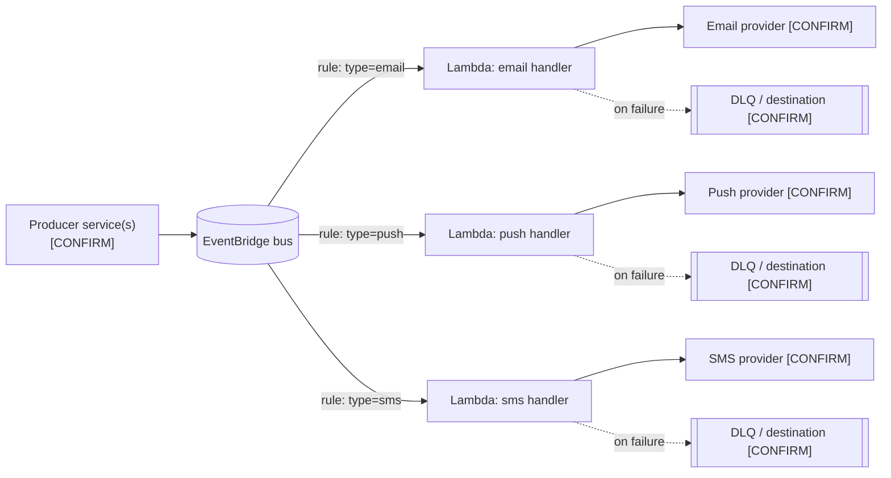

# Notifications Service — From Cron Pod to Event-Driven (EventBridge + per-channel Lambda)

**Status:** documented, post-implementation (already running in production)
**Audience:** engineers onboarding to the notifications service

## Sourcing note

This document was authored from a one-paragraph verbal description of the migration, with no access
to the service's codebase, IaC, AWS console, dashboards, or tickets. Everything traceable to that
description is written as fact. Everything else — component names, providers, retry/DLQ configuration,
actual motivations, actual incidents — is marked **[CONFIRM]** or **[ASSUMED]** and must be corrected
against the real system before this doc is treated as ground truth. Treat it as a scaffold to finish,
not a finished record.

## Related documents

- [CONFIRM] IaC repo / module defining the EventBridge bus, rules, and Lambdas
- [CONFIRM] CloudWatch dashboard(s) for the three Lambdas
- [CONFIRM] On-call runbook for notification delivery failures
- [CONFIRM] Original migration ticket/epic

## Context

### Prior situation

The notifications service ran as a single monolithic process on a fixed **cron schedule inside a pod**
(Kubernetes/ECS — **[CONFIRM]**). One deploy unit was responsible for all three channels — email,
push, and SMS. Presumed characteristics of that shape, to confirm against what actually shipped:

- All channels shared one process and one deploy: a bug or a slow call in one channel's code path
  could delay or break the cron run for the others.
- Notifications went out on the cron's cadence, not the moment the triggering event happened —
  batch latency rather than near-real-time delivery.
- Scaling meant scaling the whole pod, even when only one channel (e.g. SMS at a marketing peak)
  needed more throughput.
- The pod's compute cost did not track actual notification volume — it ran on schedule regardless
  of how many notifications, if any, were due.

### Motivations for the change **[ASSUMED — confirm with the team]**

The description given states *what* changed (cron pod → EventBridge + per-channel Lambda), not *why*.
The drivers below are the ones this shape is normally chosen for; replace with the team's actual
reasons:

- Decouple channels so one channel's failure or latency can't take down the others.
- Move from batch/cron-interval delivery to event-triggered, near-real-time delivery.
- Scale each channel independently against its own load profile.
- Move from an always-on pod to pay-per-invocation compute.
- Let each channel's code deploy independently of the others.

### Scope

- **In scope:** dispatch of email, push, and SMS notifications, triggered by application events
  through EventBridge.
- **Out of scope [ASSUMED — confirm]:** notification preference/opt-out management, template
  authoring, and any digest/batch notification type not covered by this migration, if one still
  exists on the old path.

## Architecture

Everything in this section is the expected shape of an EventBridge → per-type Lambda fan-out on AWS.
**[CONFIRM]** each item against the actual EventBridge rules, Lambda configuration, and IAM policies.

### Components

- **Producer service(s) [CONFIRM which]** — the application(s) that emit the event signaling a
  notification is needed (e.g. an order, auth, or marketing service). Not named in scope; identify
  and list here.
- **EventBridge bus** — central entry point for notification-request events.
- **EventBridge rules** — one rule per notification type, matching on an event attribute (e.g.
  `detail-type` or a `channel` field) and routing to the corresponding Lambda target.
- **Lambda — email handler [CONFIRM name]** — builds and sends email via **[CONFIRM provider —
  e.g. SES / SendGrid]**.
- **Lambda — push handler [CONFIRM name]** — sends push via **[CONFIRM provider — e.g. SNS / FCM /
  APNs]**.
- **Lambda — SMS handler [CONFIRM name]** — sends SMS via **[CONFIRM provider — e.g. SNS / Twilio]**.
- **Failure path [CONFIRM]** — whether each rule/Lambda has an on-failure destination or DLQ (SQS)
  configured, its retention window, and the replay procedure.
- **Observability [CONFIRM]** — CloudWatch log groups, metrics, and alarms per Lambda; link the
  dashboard here once confirmed.

### Static diagram

### Dynamic flow — request to delivery

1. A producer service performs an action that requires notifying a user **[CONFIRM the concrete
   trigger(s), e.g. order placed, password reset, campaign send]**.
2. The producer publishes an event to the EventBridge bus, carrying the notification type
   (email/push/sms) and the recipient/content data.
3. EventBridge evaluates its rules against the event; the rule matching the notification type
   selects the corresponding Lambda as target.
4. EventBridge invokes that Lambda asynchronously with the event payload.
5. The Lambda validates the payload, resolves recipient/template data, and calls the channel's
   provider API.
6. The provider attempts delivery; the Lambda logs the outcome (success/failure) and emits metrics.
7. On error, **[CONFIRM the actual policy]** — by default, an asynchronous Lambda invocation retries
   automatically (twice, by default) before the event is sent to the configured on-failure
   destination/DLQ, if one is configured.
8. **[CONFIRM]** on-call is alerted when items land in the DLQ or a channel's error rate crosses a
   threshold, via **[CONFIRM alerting tool — e.g. CloudWatch Alarms → PagerDuty/Slack]**.

### Alternatives considered during the migration **[UNKNOWN — fill in]**

Not stated in the source description. Worth recording once confirmed, since it's exactly what a new
hire will ask ("why Lambda and not X?"):

- Was a single Lambda handling all three channels considered, instead of one per channel?
- Was SQS + a long-running worker (container) considered instead of Lambda, to avoid cold starts /
  concurrency limits?
- Was Step Functions considered for orchestration (e.g. retries, fan-out) instead of EventBridge
  rules directly targeting Lambdas?
- Why EventBridge as the entry point instead of, e.g., publishing directly to per-channel SQS
  queues?

## Risks and mitigations

These are risks inherent to this *architecture pattern* (EventBridge fan-out to per-type Lambdas on
AWS), not risks pulled from this team's actual incident history — I have no access to that. Confirm
which have actually materialized and which mitigations are actually in place.

| Risk | Impact | Probability | Mitigation | Contingency |
| --- | --- | --- | --- | --- |
| Duplicate delivery — EventBridge/Lambda async invocation is at-least-once, so a retry can invoke a handler twice for the same event | Medium (user gets a duplicate email/push/SMS) | Medium | Make each Lambda idempotent (dedupe on an event id, checked against a store such as DynamoDB) before send | If duplicates are found in production, add/tighten the dedupe table keyed by event id + channel |
| Silent partial failure — channels are now independent, so one can fail without the others being affected or noticed | Medium | Medium | Per-Lambda error-rate alarms and dashboards, not only an aggregate one | On-call runbook checks each channel's alarm individually, not just a combined view |
| Provider outage/throttling (email/push/SMS provider) | High for the affected channel | Low–Medium | Retries with backoff; DLQ configured; monitor the provider's status page | Manual re-drive from the DLQ once the provider recovers |
| Lambda concurrency limits / cold starts under a burst of events | Medium | Low–Medium | Reserved/provisioned concurrency on the channel with the tightest latency SLA; review account-level concurrency limits | Temporarily raise the Lambda's concurrency limit; if bursts recur, add an SQS buffer in front of the Lambda |
| Event schema drift between producers and the per-channel Lambdas | Medium | Low | Version the event schema (`schemaVersion` field) and validate it on entry in each Lambda | Route malformed events to the DLQ for manual triage instead of letting the Lambda fail silently |
| Loss of ordering/batching the old cron pod gave implicitly, if anything downstream relied on it | Low–Medium | Low | Confirm no consumer assumed order or batching from the old cron; document explicitly if none does | If found, add explicit sequencing (e.g. a FIFO queue) for that specific case |

## Lessons learned

This is the section your team's actual experience can fill in best — I have no access to your
incident history, PR discussions, or retro notes for this migration, so nothing here is invented.
Bring these questions to the team and record real answers:

- What broke first in production after the cutover, and why?
- Did duplicate delivery or silent partial failure (above) actually show up for any channel?
- Any surprises with Lambda cold starts, concurrency limits, or cost once real traffic hit?
- What did the cron pod use to give you "for free" that had to be re-implemented explicitly
  (ordering, batching, rate-limiting to a provider)?
- Anything about EventBridge rule pattern-matching, event/payload size limits, or IAM boundaries
  between the bus and the Lambdas that caused rework?

## Improvement points

Candidates worth validating with the team — not a confirmed backlog:

- Idempotency: confirm a dedup mechanism exists per channel; add one if not.
- DLQ alerting: confirm DLQ entries page/alert on-call, not just get logged.
- Schema versioning: add `schemaVersion` + validation at each Lambda's entry, if not already present.
- A single dashboard showing volume, latency, error rate, and cost per channel, if one doesn't exist.
- A written on-call runbook for "notification stuck in DLQ" / "channel error rate spiking."

## Version history

| Version | Date | Author | Description |
| --- | --- | --- | --- |
| 1.0 | 2026-09-08 | Lucas Marques | Document created — retrospective scaffold, authored without direct access to the production system (see Sourcing note). |
