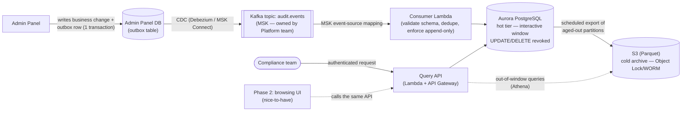
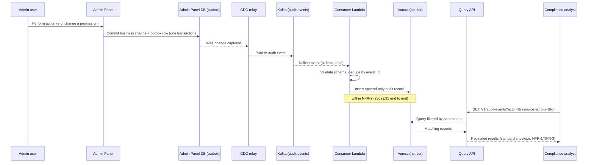

# RFC — Audit Log Service

**Status:** Draft — open for review
**Current working focus:** Concluded (ready for stakeholder comment)

## Related documents

The following are referenced below but were **not available in the environment this RFC was
written in** — they are named as constraints or context by the requester, not verified directly.
Before merging this RFC, confirm each against its real source:

- The company API standard (endpoint naming, pagination, error envelope). This RFC assumes a
  conventional REST shape (§ Requirements, NFR-1) — verify against the actual internal standard doc.
- The platform team's record of the decision to standardize on Kafka (ticket/ADR not available here).
- An inventory of every mutating action the admin panel currently exposes (not available here) —
  needed to size Phase 1 vs. later phases in the roadmap.
- Legal/Compliance's required retention period for audit data (not available here) — a placeholder
  is assumed in NFR-5 and must be confirmed before Phase 1 ships.

## Context

Actions taken in the admin panel today leave a trail only in production logs. When the compliance
team needs to answer "who did what, and when," their only tool is grepping those logs by hand —
unstructured text, no filtering by actor or resource, no guarantee that every action code path even
logs consistently, and no access path that doesn't involve someone with production log access doing
it as a manual favor. That doesn't scale, it's slow to answer a compliance request, and it silently
depends on whichever engineer happens to log the action correctly.

**The problem to solve:** every action taken in the admin panel needs to end up in a durable,
structured, queryable record that the compliance team can search themselves — without shell access
to production and without asking engineering to grep on their behalf.

Two constraints are already fixed by decisions made outside this document: the event transport is
Kafka (platform team decision) and the service runs on AWS (existing platform footprint). This RFC
does not re-litigate either — it designs the audit-log service *within* them, and its Alternatives
analysis focuses on the dimensions that are actually still open.

### Out of scope

- **Provisioning or operating the Kafka cluster itself.** Treated as a given interface (an MSK
  topic) owned and run by the platform team.
- **The browsing UI.** The requester flagged it explicitly as a nice-to-have, not a requirement —
  see Launch strategy. What compliance actually needs (a queryable record) is delivered by the API;
  the UI is a thin, separable layer on top of it.
- **Audit trails for systems other than the admin panel** (e.g., customer-facing actions, other
  services' internal changes). Same pattern would likely apply, but sizing a shared platform for all
  of them is a separate decision.
- **Real-time alerting / SIEM-style anomaly detection** on audit events. This service makes the data
  queryable; alerting on patterns in it is a follow-on capability, not this project.
- **Migrating or parsing historical production logs.** This RFC covers audit events going forward
  from launch, not backfilling history compliance already had to grep by hand.

## Requirements

The requester's list mixed genuine constraints with some items that needed sharpening before they
could drive a design. Below is the reconciled set — what's kept as-is, what was made concrete, and
what was added because the "audit" + "compliance" framing implies it even though it wasn't stated.
Each change is called out inline; see the reply for the short version.

### Functional

- **FR-1 — Completeness.** Every mutating action in the admin panel (create, update, delete,
  permission/config change) produces exactly one durable audit event that eventually reaches the
  queryable store. This is the load-bearing requirement — the whole point of the project is that
  "grep and hope" isn't good enough, so best-effort delivery isn't acceptable here (see Design §A).
- **FR-2 — Self-service query.** The compliance team queries audit events by actor, action type,
  target resource/id, and time range through an API, with no dependency on engineering or shell
  access to production.
- **FR-3 — Minimum viable event content.** Each record answers "who did what, to what, when, from
  where, with what outcome" on its own: actor id/type, action, resource type/id, timestamp, source
  IP, outcome (success/failure), and a correlation id — without needing to cross-reference another
  system for these fields.
- **FR-4 — Restricted access** *(added — not stated by the requester).* Query access is limited to
  an authorized compliance/audit role, not open to every engineer. Audit data is itself sensitive;
  the service must not become a second production-log-grep-equivalent for a wider audience. **Flagged
  for confirmation:** which identity system/role should gate this (not available in this
  environment).
- **FR-5 — Immutability** *(added — not stated by the requester).* Once written, an audit record
  cannot be altered or deleted through any normal application code path. An audit log whose entries
  can be quietly edited doesn't do what compliance needs it to do; this is treated as implied by the
  word "compliance," not as a stretch goal.

### Non-functional

- **NFR-1 — Standardized endpoints.** Endpoints follow the company API standard. **Assumption
  (standard doc unavailable here):** versioned resource path (e.g. `/v1/audit-events`), cursor-based
  pagination, a consistent error envelope, and a correlation-id header — verify against the real
  standard before implementation.
- **NFR-2 — Ingestion lag.** *(Replaces "must be fast," which hides a decision.)* Time from an
  action occurring to its event being queryable ≤ 30s at p95. This is the number that actually
  matters for an audit system — freshness of visibility, not raw throughput. **Assumed target,
  pending confirmation from compliance** on how fresh they actually need it.
- **NFR-3 — Query latency.** *(The other half of "must be fast.")* A filtered query over the
  interactive retention window (see NFR-5) responds ≤ 2s at p95; a query that spans into the cold
  archive responds ≤ 10s at p95. Compliance querying is not a high-QPS, customer-facing path, so this
  is a materially looser budget than e.g. a search service — deliberately, to avoid over-paying for
  latency nobody asked for. **Assumed target, pending confirmation.**
- **NFR-4 — Automated test coverage > 90%.** Kept as stated. **Pushback:** a coverage percentage is
  a weak proxy for what this system actually needs to prove — that no action is ever silently
  dropped. Recommend supplementing the number with (a) a schema/contract test against the event
  producer, (b) a fault-injection test that kills the Kafka consumer mid-batch and asserts no
  duplicate or missing records after recovery, and (c) a reconciliation test comparing admin-panel
  action counts to stored audit-event counts over a window.
- **NFR-5 — Retention.** *(Added — not stated by the requester, but retention is a data-model
  decision that's expensive to change later.)* **Open question, not resolved by this RFC:** the
  compliance-mandated retention period is not available in this environment. Placeholder assumed for
  design purposes: 13 months in the interactive ("hot") store, indefinite in a cheaper archive tier,
  with the tiering boundary configurable so the real number can be dropped in without a redesign.
  Confirm with Legal/Compliance before Phase 1 ships.
- **NFR-6 — Runs on AWS.** Kept as a given constraint (operational consistency with the rest of the
  platform); not re-analyzed against other clouds.
- **NFR-7 — Kafka as transport.** Kept as a given constraint (platform team decision). One concrete
  consequence carried into the design: Kafka's default delivery guarantee is *at-least-once*, so the
  consumer must dedupe by an idempotency key (FR-3's correlation id doubles as this key) — otherwise
  a retried publish becomes a duplicate audit record.

## Design

Scope: the audit-log service is the pipeline from "an admin-panel action happened" to "compliance
can query it" — event capture, transport (given), durable storage, and a query API. Three dimensions
are genuinely open and are decided below; the fourth constraint (Kafka, AWS) is fixed input.

### A — Event capture pattern (admin panel → Kafka)

Nothing today publishes a structured event anywhere — the admin panel only writes to its own
database and to unstructured logs. Something has to change on the producer side for FR-1 to hold at
all. See Alternatives analysis for the chosen pattern: a transactional outbox in the admin panel's
own database, drained to Kafka by a CDC relay, so the audit event is committed atomically with the
business change it describes and its durability never depends on Kafka being reachable at write
time.

### B — Storage and query engine

Chosen: a two-tier store rather than a single engine, because no single option cleanly satisfies
both the query-latency budget (NFR-3) and the retention/cost profile (NFR-5) at once (see
Alternatives analysis). **Hot tier:** Aurora PostgreSQL, holding the interactive retention window,
partitioned by month, with `UPDATE`/`DELETE` revoked from the application's database role to enforce
FR-5 at the database level. **Cold tier:** partitions older than the hot window are exported as
Parquet to S3 with Object Lock (WORM/compliance mode) for the remainder of the retention period,
queryable via Athena for the rare out-of-window request.

### C — Compute platform (consumer + query API)

Chosen: AWS Lambda for both the Kafka consumer (via an MSK event-source mapping) and the query API
(behind API Gateway), with a standing Fargate consumer as the documented fallback if sustained
throughput ever outgrows Lambda's comfortable envelope (see risk table in Alternatives analysis).

### Event schema (baseline, confirm with producer team)

```
event_id        UUID   — idempotency/dedup key
occurred_at     timestamp
actor           { id, type }
action          string   (verb, e.g. "permission.update")
resource        { type, id }
outcome         enum     (success | failure)
source_ip       string
correlation_id  string
detail          object   (optional, bounded-size diff/summary of the change)
```

### Static diagram



### Dynamic diagram — action captured, then queried



## Alternatives analysis (Tradeoff)

Kafka and AWS are given constraints and are not re-analyzed as alternatives here. The three
dimensions below are the ones this RFC actually decides.

| Alternative | Pros | Cons | Risk (description) | Impact | Probability | Mitigation | Contingency |
| --- | --- | --- | --- | --- | --- | --- | --- |
| **[A - Capture] Inline synchronous produce** (app code publishes to Kafka as part of handling the request) | Simple; no new infra; lowest added latency | Couples admin-panel request availability/latency to Kafka's; a failed produce call either drops the event (violates FR-1) or blocks the business action on audit infra | Kafka degradation causes silently dropped or blocked events | High | Medium | Local durable retry buffer before giving up; `acks=all` with bounded retries; alert on producer failures | Reconciliation job diffs admin-panel action counts vs. stored audit events and backfills gaps |
| **[A - Capture] Transactional outbox + CDC** (chosen) | Atomic with the business transaction — the audit event can't be lost independent of Kafka's availability at write time; leverages a guarantee the admin panel's DB already provides | Extra moving part (CDC relay) to operate; small added lag vs. inline; needs the admin-panel DB team's cooperation (WAL access) | CDC connector stalls unnoticed (e.g. replication slot growth) | High | Medium | Connector lag/health monitoring and alarms; replication-slot-size alarm | Data is still safely durable in the outbox table itself — replay once the connector is fixed |
| **[A - Capture] Log-shipping** (parse existing production logs, forward to Kafka) | No admin-panel code changes; fastest to ship | No real completeness guarantee — dropped lines under backpressure, rotation races, and any code path that doesn't log correctly all silently violate FR-1; automates the exact process that's already failing today | Log format drift silently breaks parsing, with no reliable way to notice quickly | High | High | Contract test asserting the log line format doesn't drift | None good — this is the alternative's core weakness, which is why it's rejected |
| **[B - Storage] OpenSearch** | Purpose-built for faceted/free-text search — closest to what "grepping logs" actually feels like; comes with a Kibana-like browsing UI if/when Phase 2's UI is built | Operationally heavier (shard/cluster management, upgrades); expensive to keep years of data hot; not naturally immutable — documents are updatable/deletable unless deliberately locked down | Index/shard bloat degrades query latency as retention grows | Medium | Medium | Index-per-time-window + ILM to roll/close old indices | Reindex/resize, or offload cold indices to S3 |
| **[B - Storage] Aurora PostgreSQL** (chosen, hot tier) | Team already operates Postgres/Aurora — no new operational skill; strong transactional guarantees; FR-5 immutability is cheap (revoke `UPDATE`/`DELETE` on the audit table) | Ad-hoc free-text search across everything is weaker than OpenSearch without deliberate GIN/trigram indexing; a single instance eventually hits a scaling ceiling without partitioning discipline | Table growth degrades query performance without partitioning | Medium | Medium | Monthly time-based partitioning from day one; partition pruning | Detach and export cold partitions to S3+Athena, keep only a rolling hot window |
| **[B - Storage] S3 (Parquet) + Athena** (chosen, cold tier only) | Cheapest by far for multi-year retention; naturally WORM-friendly with Object Lock; serverless, scales without bound | Query latency is seconds-to-tens-of-seconds per scan — not a fit as the primary interactive store; weaker free-text support; needs write batching or performance collapses | Small-file/partition explosion from naive per-event writes tanks Athena scan performance | Medium | High | Batch writes into larger Parquet files on a schedule (size/time-based rotation); periodic compaction job | Backfill/compact historical partitions |
| **[C - Compute] AWS Lambda** (chosen, consumer + API) | No servers to manage; scales to zero when idle, which fits a workload bounded by admin-panel action volume rather than customer traffic; pay-per-invocation | MSK event-source-mapping polling isn't fully "free" even when idle; cold starts add latency variance that interacts with NFR-3 | A burst of admin actions (e.g. a bulk operation) outpaces consumer throughput, causing ingestion lag | Medium | Medium | Tune batch size/parallelization factor on the event-source mapping; alarm on consumer lag against the NFR-2 budget | Temporarily raise reserved concurrency, or fail over to a standing Fargate consumer for the sustained-high-throughput period |
| **[C - Compute] ECS/Fargate** | Full control over consumer-group behavior and backpressure; no cold starts; easier to reason about steady throughput | Always-on cost even at low/no traffic; more operational surface (task defs, autoscaling policies, deployments) | Under-provisioned task count causes lag during spikes | Medium | Low-Medium | CPU/consumer-lag-based autoscaling policy; load test at expected peak | Manually scale task count during an incident |
| **[C - Compute] Managed Kafka Connect sink connector** (e.g. MSK Connect) | Least custom code for ingestion — config-driven instead of a bespoke consumer | Little room for the custom logic this service actually needs (schema validation, dedup, immutability enforcement) without a custom connector plugin, which erodes the "less code" benefit; a new operational component to learn | A required transform isn't supported by off-the-shelf single-message transforms, forcing a custom plugin anyway | Low | Medium | Prototype the required transform against MSK Connect before committing | Fall back to a custom Lambda/Fargate consumer |

## The decision

**Decision:** transactional outbox + CDC from the admin panel's own database into Kafka; a Lambda
consumer validates and dedupes into an Aurora PostgreSQL hot tier (immutable, partitioned monthly),
with aged-out partitions exported to an Object-Locked S3/Parquet cold archive queryable via Athena;
a Lambda + API Gateway query API in front of both tiers, standardized per NFR-1.

**Why:** FR-1 ("every action ends up queryable") is stated as unconditional, and best-effort delivery
undermines the entire reason this project exists — the outbox pattern is the only alternative that
makes completeness a property of the design rather than something monitoring might catch after the
fact. The two-tier store resolves the real tension between NFR-3 (interactive query latency) and
NFR-5 (multi-year retention at reasonable cost) without forcing either requirement to lose. Lambda
keeps operational cost proportional to a workload that's very unlikely to be as heavy as core product
traffic, with Fargate documented as the explicit fallback rather than pretended away.

**Strongest objection to this recommendation:** the outbox pattern is more work than inline
publishing, and it requires the admin-panel team to add a table and cooperate on CDC — it is not
something the audit-log-service team can deliver alone. If that cooperation isn't available in a
reasonable timeframe, the fallback is inline synchronous produce hardened with a local retry buffer
and the reconciliation job pulled forward from "nice to have" to "load-bearing" — which is a real
regression in the completeness guarantee and should be treated as a conscious risk acceptance, not a
free substitution.

**Decision style:** Kafka and AWS were autocratic calls made upstream by the platform team and are
treated as given here. The three dimensions this document owns (event capture, storage, compute) are
an autocratic call by the authoring engineer, informed by the stated requirements and open for
comment from the admin-panel team (who own part of the implementation) and the compliance team (who
should confirm the NFR-2/NFR-3/NFR-5 placeholder numbers) before implementation starts.

## Launch strategy

- **Phase 1 (MVP):** outbox + CDC for the highest-compliance-risk action set first (permission and
  configuration changes — the exact inventory needs the admin-panel action list flagged as
  unavailable above) → Kafka → consumer → Aurora hot tier → query API. No UI; compliance queries
  through the API directly (or a thin internal tool, if that's faster to get in front of them than
  waiting on this RFC's "nice to have").
- **Phase 2:** extend outbox coverage to every remaining mutating admin-panel action; add the
  cold-archive export job and Object Lock; add the reconciliation job comparing admin-panel action
  counts to stored audit-event counts.
- **Phase 3 (nice-to-have, as flagged by the requester):** a browsing UI on top of the already-shipped
  query API. Low incremental cost specifically because the API was designed for this from Phase 1 —
  the UI adds a presentation layer, not a new data path.

## Tasks and roadmap

| Task | Description | Estimate |
| --- | --- | --- |
| Outbox table + migration | Add outbox table to admin-panel DB, in same transaction as business writes | 3d |
| CDC relay | Stand up MSK Connect/Debezium relay from admin-panel DB to `audit.events` topic | 4d |
| Event schema + contract test | Finalize schema (this doc's baseline), publish as a shared contract, add producer-side contract test | 2d |
| Consumer Lambda | MSK event-source mapping, schema validation, dedup by `event_id` | 4d |
| Aurora hot store | Schema, monthly partitioning, revoke UPDATE/DELETE grants | 3d |
| Query API | `/v1/audit-events` per NFR-1, auth-gated to compliance role (FR-4) | 5d |
| Reconciliation job | Diff admin-panel action counts vs. stored audit events, alert on gaps | 3d |
| Cold archive export | Scheduled Aurora → S3 Parquet export, Object Lock config | 3d |
| Load + fault-injection tests | Validate NFR-2/NFR-3 under expected peak; kill consumer mid-batch and assert no gaps/duplicates | 3d |

## Version history

| Version | Date | Author | Description |
| --- | --- | --- | --- |
| 1.0 | 2026-09-08 | Lucas Marques | Document created. |
