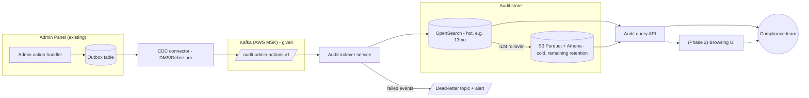
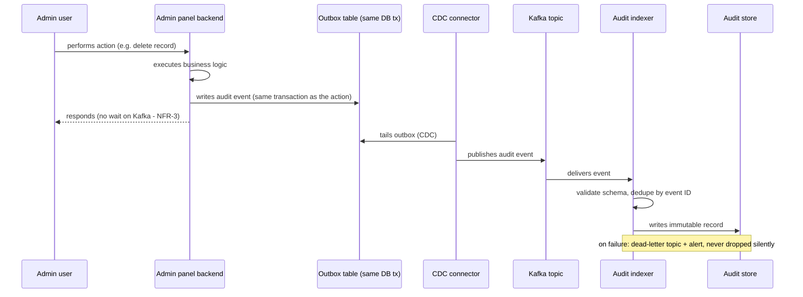
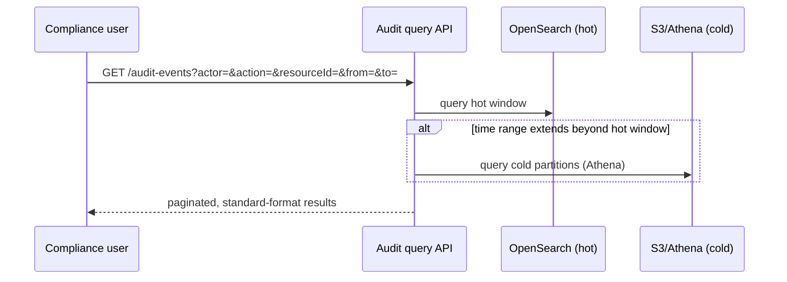

# RFC — Audit Log Service

**Status:** Draft — proposed, pending platform team and compliance review
**Current working focus:** decision drafted, open questions flagged for sign-off

## Related documents

The following would normally be linked here; none were provided as input to this draft, so they are
named as **known gaps**, not assumed away:

- Platform team's decision record mandating Kafka (referenced by the requester; not provided — treated
  here as a fixed constraint, not re-litigated).
- The company API standard (resource naming, pagination, auth, error envelope) — not provided; Section
  "Query API" below states the assumptions made in its absence and must be checked against the real
  standard before implementation.
- Admin panel service repo / request flow — not provided; assumptions about its write path are flagged
  inline.
- Legal/compliance retention policy for audit trails — not provided; flagged as an open question, not
  assumed.

## Context

The admin panel today has no systematic audit trail. When the compliance team needs to know who did
what and when, their only recourse is to grep production logs by hand — logs that were never designed
to be queried, are not indexed for this purpose, are ephemeral (subject to normal log-retention/rotation
policies, not a compliance retention policy), and require engineering involvement to search. This does
not scale, is slow to answer even simple questions ("who deleted this record last Tuesday?"), and
leaves compliance dependent on engineering for something that is their responsibility to self-serve.

**The problem to solve:** every action taken in the admin panel must end up in a durable, structured
record that the compliance team can query themselves — without shell access to production and without
engineering in the loop. That is the actual driver of this document; everything else (Kafka, AWS, the
API standard, a browsing UI) is a constraint or an implementation detail sitting underneath it.

Two constraints are handed down, not decided here:

- **Kafka is mandated** by the platform team as the event transport. This RFC does not evaluate
  alternatives to Kafka; it evaluates what sits around it (topic/schema design, ingestion pattern,
  downstream store).
- **AWS is mandated** as the deployment platform, consistent with the rest of the estate. Alternatives
  are chosen from AWS-native or AWS-compatible services only.

### Out of scope

- **Re-litigating Kafka or AWS.** Both are given; only their surrounding design is decided here.
- **A browsing UI for compliance.** Requested as a "nice to have." Treated as an optional phase‑2
  consumer of the query API defined here, not as a phase‑1 deliverable — see Launch strategy.
- **Redesigning the admin panel's business logic.** This RFC only adds an audit-emission concern to
  existing admin actions; it does not change what those actions do.
- **Retroactive backfill of historical actions.** Only actions taken after this service ships are in
  scope, unless compliance requires backfill from existing logs — flagged as an open question below.

## Requirements

The requester's list mixed hard constraints, a vague quality bar, a code metric, and the actual
functional driver into one flat list. Restated and separated below, with the reclassifications made
explicit:

- **"It should be fast" is not a requirement as stated.** Speed against what budget, for which path
  (ingestion vs. query)? Treated below as two separate, concrete NFRs (NFR-3, NFR-4), stated as
  assumptions pending confirmation from whoever owns the actual SLA expectation.
- **"Test coverage above 90%" is a testing target, not by itself an architectural requirement** — it
  doesn't shape a component or a boundary. It's kept as a stated NFR (NFR-6) because the requester was
  explicit about it, but the requirement that actually drives design decisions here is completeness
  (NFR-5: no admin action is silently dropped) — coverage percentage doesn't guarantee that; a
  reconciliation mechanism does, and it's part of the design.
- **The compliance-queryability requirement, buried as a trailing sentence in the request, is promoted
  to the primary functional requirement (FR-1/FR-2)**, because it is what makes this project exist at
  all — Kafka, AWS, and the API standard are constraints on how it gets built, not reasons it's being
  built.

### Functional

- **FR-1:** Every state-changing action taken in the admin panel (create, update, delete, and any
  action a reasonable compliance reviewer would call "sensitive," e.g. permission changes, data
  exports) produces exactly one durable audit record. *Open question: the requester did not enumerate
  which read-only actions, if any, must also be audited — assumed out of scope for v1, flagged below.*
- **FR-2:** The compliance team can query audit records themselves via an API — filter by actor,
  action type, affected resource, and time range — without engineering involvement and without shell
  access to production systems or logs.
- **FR-3:** Once written, an audit record is immutable — no update or delete path exists anywhere in
  the system. A compliance record that can be quietly edited is worthless as evidence.
- **FR-4:** Query endpoints follow the company API standard (resource naming, pagination, auth, error
  format). *The standard document was not provided; Section "Query API design" states the assumptions
  made in its absence — these must be checked against the real standard before this ships.*

### Non-functional

- **NFR-1 (given):** Kafka is the ingestion transport.
- **NFR-2 (given):** The service runs on AWS.
- **NFR-3 (ingestion latency, assumed):** Emitting an audit event must not add perceptible latency to
  the admin action that triggered it. Assumed budget: **≤ 10ms added to the admin request's critical
  path**, achieved by making emission asynchronous relative to the user-facing response. *Flagged
  assumption — confirm with whoever owns admin-panel latency SLAs.*
- **NFR-4 (query latency, assumed):** Compliance queries are investigative, not real-time dashboards.
  Assumed budget: **p95 ≤ 2s** for a filtered query over the hot retention window, validated under a
  representative load once real volume is known. *Flagged assumption — no traffic numbers were
  provided; see Design for how this shapes the store choice.*
- **NFR-5 (completeness, derived from FR-1):** No admin action is silently dropped between the action
  happening and the record becoming queryable. This is the requirement "test coverage > 90%" was really
  gesturing at, and it drives the ingestion-pattern decision below (dual-write risk) more than any
  coverage percentage would.
- **NFR-6 (given):** Automated test coverage > 90% on the audit-emission and query-API code paths,
  including a contract test that every admin action type has a corresponding audit-event producer
  (catches the "we added an action and forgot to audit it" failure mode that coverage % alone misses).
- **NFR-7 (retention, open question):** Compliance/audit trails typically carry a mandated minimum
  retention period (often multi-year, sometimes regulator-specific). **No retention requirement was
  given.** This RFC assumes a placeholder of 5 years hot+cold retention pending legal/compliance
  confirmation — this number is a placeholder, not a researched figure, and the store/tiering decision
  below is sized around it being "years," not around the specific number.
- **NFR-8 (nice to have, non-binding):** A UI for browsing audit logs. Explicitly scoped as phase 2 —
  see Launch strategy.

## Design

### Sizing assumption

No traffic figures were provided for the admin panel. This design assumes a **moderate volume** —
low thousands of admin actions per day, growing over years of retention into the low millions of
records — typical of an internal admin tool, not a customer-facing system. *This is an unverified
assumption; if real volume is materially higher (e.g., high-frequency automated actions rather than
human admin actions), the store choice in "Audit store" below should be revisited.*

### Components

- **Admin panel backend (existing):** instrumented with an audit-emission concern on every action
  covered by FR-1.
- **Kafka (AWS MSK, given):** transport for audit events. Topic `audit.admin-actions.v1`, partitioned
  by resource/tenant key to preserve per-resource ordering; schema managed via AWS Glue Schema Registry
  (Avro). *Serves NFR-1, FR-3 (append-only transport is a natural fit for immutability).*
- **Outbox table (new, in the admin panel's existing database):** the action and its audit record are
  written in the same local transaction. *Serves NFR-5 — see "Ingestion pattern" below for why this
  exists instead of a direct producer call.*
- **CDC connector (AWS DMS or Debezium on MSK Connect):** tails the outbox table and publishes to
  Kafka, decoupling "the action committed" from "Kafka was reachable." *Serves NFR-5.*
- **Audit indexer (new service):** consumes the Kafka topic, validates against the schema, deduplicates
  by event ID, and writes to the audit store. Failures go to a dead-letter topic with alerting, not
  silently dropped. *Serves FR-1, NFR-5.*
- **Audit store (Amazon OpenSearch Service, hot tier + cold tier — see Tradeoff analysis):** durable,
  append-only, indexed for the filters in FR-2. *Serves FR-2, FR-3, NFR-4, NFR-7.*
- **Audit query API (new service):** REST endpoints per FR-4, backed by the audit store, exposed only
  to the compliance team's role (least-privilege, read-only). *Serves FR-2, FR-4.*
- **(Phase 2, non-binding) Browsing UI:** a thin client over the query API. *Serves NFR-8.*

### Static diagram

### Dynamic diagram — write path

### Dynamic diagram — query path

### Query API design (assumption-flagged)

In the absence of the real company API standard document, this RFC assumes conventional REST practice
(plural resource names, cursor-based pagination, ISO-8601 timestamps, a standard error envelope) and
proposes:

- `GET /audit-events` — filter by `actor`, `action`, `resourceType`, `resourceId`, `from`, `to`;
  cursor-paginated.
- `GET /audit-events/{id}` — single record.

**This must be checked against the actual standard before implementation** — it was not available to
this draft.

## Alternatives analysis (Tradeoff)

Kafka and AWS are given, so they are not re-analyzed here. Three dimensions are actually open:

| Alternative | Pros | Cons | Risk (description) | Impact | Probability | Mitigation | Contingency |
| --- | --- | --- | --- | --- | --- | --- | --- |
| **[Ingestion pattern] Direct Kafka producer call from the admin action handler** | Simple; no extra infrastructure; lower latency to "event exists" | Dual-write problem: the DB transaction can commit while the Kafka publish fails (network blip, broker unavailable), silently violating FR-1/NFR-5 | An admin action is taken but never produces an audit event | High | Medium | Synchronous produce with acks=all + local retry queue | Nightly reconciliation job comparing admin-action counts to audit-event counts; manual backfill from action logs when a gap is found |
| **[Ingestion pattern] Outbox + CDC (recommended)** | Atomicity: the audit event physically cannot be lost if the action's transaction committed; decouples action latency from Kafka availability (serves NFR-3 and NFR-5 directly) | New infra to run and operate (DMS/Debezium connector); adds seconds of lag between action and event visibility; team may lack CDC operational experience | Connector lag or failure delays events reaching compliance (not loses them, but delays) | Medium | Medium | Connector-lag alerting; dedicated on-call runbook | Manual re-trigger of the connector from the last committed offset; outbox rows remain until confirmed published, so nothing is lost, only delayed |
| **[Audit store] Amazon OpenSearch Service (hot) + S3/Parquet + Athena (cold) — recommended** | Meets FR-2's ad hoc filter/search need with good interactivity in the hot window; meets multi-year retention (NFR-7) cheaply by tiering old data to S3; AWS-native | Two systems to keep consistent (ILM rollover); OpenSearch cluster is an operational cost even in the hot tier | ILM rollover misconfigured, silently dropping data instead of tiering it | High | Low | ILM policy tested in staging; alert on unexpected index deletion; cold-tier write verified before hot-tier data is ever purged | Restore from Kafka topic retention window if still available, or from indexer's own write-ahead log if retained |
| **[Audit store] PostgreSQL (RDS), JSONB + GIN indexes** | Team likely already runs Postgres; simpler ops (one engine, already-understood backup/restore); adequate for FR-2 filters at moderate volume | Full-text/ad hoc search degrades as data and retention grow into years of records; scaling read-heavy compliance queries against a single relational engine over a multi-year dataset is the weak point | Query latency (NFR-4) degrades as the table grows past the hot window | Medium | High (given multi-year retention) | Partitioning by month/year, aggressive indexing, read replica dedicated to compliance queries | Migrate to the OpenSearch+S3 design above once growth makes Postgres the bottleneck — more costly to do later than to start with it |
| **[Audit store] S3 (Parquet) + Athena only, no hot tier** | Cheapest by far; serverless; naturally fits "years of retention" | Query latency for an interactive compliance investigation is seconds-to-tens-of-seconds per query even on recent data — a poor fit for FR-2's "self-serve investigation" intent and NFR-4 | Compliance abandons the tool and reverts to asking engineering for help — reproducing the original problem this RFC exists to solve | High | Medium | — (this is a structural fit problem, not something to mitigate around) | Add a hot tier later (converges to the recommended hybrid, at migration cost) |
| **[Schema management] AWS Glue Schema Registry + Avro — recommended** | Enforces a contract between producer (outbox/CDC) and consumer (indexer); safe schema evolution; catches a malformed event before it reaches the store | Added operational piece; requires schema-change discipline from whoever adds new admin action types | A new admin action type ships without updating the shared schema, breaking the indexer | Medium | Medium | Schema-change checklist tied to the "new admin action" dev workflow; indexer fails closed to DLQ, not silently | Fix schema, replay from DLQ |
| **[Schema management] Raw JSON, versioned in application code only** | No extra infra; fastest to start | No enforcement — a producer can publish a shape the consumer doesn't expect and the failure surfaces at consume time, not publish time | Same as above, but caught later and with less diagnostic information | Medium | High | JSON Schema validation library on both ends | Same reconciliation-based recovery as above |

**Note on the vague "it should be fast" requirement:** neither store choice above is meaningfully worse
than another for *ingestion* latency (NFR-3) — the outbox pattern already decouples that from any
downstream choice. Where the store choice actually differs is *query* latency (NFR-4), which is why the
hot/cold hybrid is weighed against the standalone options rather than treated as a wash.

## The decision

**Ingestion pattern:** outbox + CDC, not a direct producer call. Given that FR-1/NFR-5 (no action ever
goes unaudited) is the entire reason this project exists, the dual-write risk of a direct producer call
is not an acceptable trade for its simplicity — a compliance system that can silently lose the record it
exists to keep undermines its own purpose. If the team has no CDC operating experience, that is a
real cost, not a reason to avoid it; it is mitigated with a runbook and reconciliation job, not
designed around.

**Audit store:** OpenSearch (hot) + S3/Parquet + Athena (cold), tiered via ILM. Postgres is a reasonable
fallback if the team judges the operational simplicity worth more than the multi-year query-latency
risk, but given the retention horizon (years, per NFR-7) is expected to dwarf any reasonable hot window,
the hybrid is chosen over building on Postgres and migrating later under pressure.

**Schema management:** Glue Schema Registry + Avro, to make the FR-1 contract ("every admin action type
has a producer") enforceable rather than aspirational.

**Decision style:** autocratic — this is the author's proposed call, made explicit here rather than left
as "it depends," but it is a draft pending review from the platform team (on the CDC connector choice and
schema registry, since they own Kafka operationally) and from compliance/legal (on the retention
placeholder in NFR-7, which is a genuine open question, not a decision made here).

## Open questions requiring sign-off before implementation

These were not answered by the request and are not invented here — each needs an owner:

1. **Retention period** — legal/compliance must confirm the actual mandated retention; NFR-7's 5-year
   placeholder should not be treated as a real number.
2. **Scope of "action"** — does FR-1 include read-only/view actions on sensitive data, or only
   state-changing ones? Assumed state-changing-only for v1.
3. **Backfill** — does compliance need historical actions (pre-launch) migrated in, sourced from
   existing production logs? Assumed out of scope for v1.
4. **The real company API standard document** — Section "Query API design" is built on assumed REST
   conventions; it must be checked against the actual standard.
5. **CDC tooling preference** — AWS DMS vs. self-hosted Debezium on MSK Connect is left open pending
   the platform team's existing Kafka Connect footprint (unknown to this draft).

## Launch strategy

- **Phase 1 (this RFC's scope):** outbox + CDC + Kafka topic + audit indexer + OpenSearch hot tier +
  query API, covering FR-1 through FR-4. Compliance can self-serve queries via the API (or a thin
  internal tool / Postman-style collection) without a dedicated UI.
- **Phase 2:** S3/Athena cold tier + ILM rollover, once hot-tier volume and the real retention number
  (open question 1) are confirmed.
- **Phase 3 (nice to have, non-binding):** browsing UI as a client of the already-stable query API. Not
  gated on anything except phase 1 being live — deliberately kept off the critical path so the "nice to
  have" doesn't delay the compliance team getting a working query API.

## Tasks and roadmap

| Task | Description | Estimate |
| --- | --- | --- |
| Outbox table + write path | Add outbox table and transactional write to admin action handler | 3d |
| CDC connector setup | Stand up DMS/Debezium connector, tail outbox to Kafka topic | 4d |
| Schema registry | Define Avro schema for audit events in Glue Schema Registry | 2d |
| Audit indexer service | Consume, validate, dedupe, write to OpenSearch, DLQ on failure | 5d |
| OpenSearch provisioning | Cluster, index mappings, ILM policy (hot tier only for phase 1) | 3d |
| Audit query API | Endpoints per FR-2/FR-4, auth scoped to compliance role | 4d |
| Reconciliation job | Nightly job comparing admin-action counts to audit-event counts (NFR-5 backstop) | 2d |
| Contract test suite | Every admin action type has a corresponding producer; coverage per NFR-6 | 3d |
| Phase 2: cold tier | S3/Parquet write path, Athena setup, ILM rollover | 5d |
| Phase 3: browsing UI (nice to have) | Thin client over query API | not estimated — phase 3, scope pending |

## Version history

| Version | Date | Author | Description |
| --- | --- | --- | --- |
| 1.0 | 2026-09-08 | Lucas Marques | Document created. |
