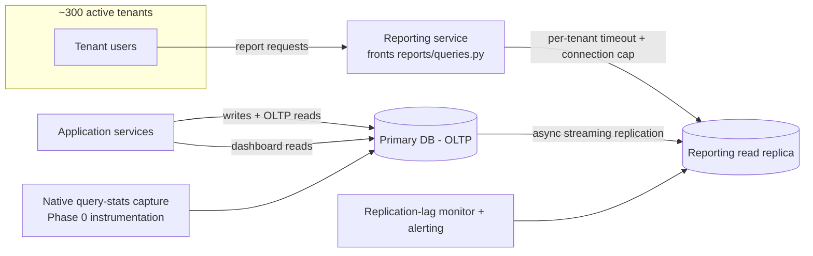
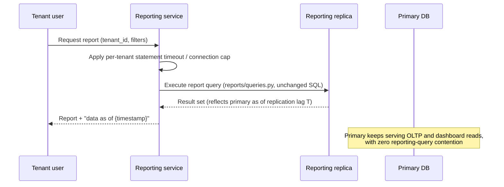

# RFC — Splitting Reporting Queries Off the Primary Database

**Status:** Draft — pending Phase 0 measurement and stakeholder sign-off (see *Launch strategy*)
**Current working focus:** concluded (decision made; execution gated on the measurement spike below)

## Related documents

- **`api-latency` Grafana dashboard** — the source of the ~8s p95 figure quoted below. Not
  independently inspected while writing this RFC (not reachable from this session); treat that number
  as *reported*, not verified, until someone with dashboard access confirms it. See the flag under
  *Context*.
- **`reports/queries.py`** — the module holding all current report queries. Not inspected while
  writing this RFC (not reachable from this session), so this document does not assume anything about
  its specific queries, indexes used, or how it opens connections. Anyone picking this up should read
  it before Phase 1 and correct any assumption below that turns out wrong.
- *(to add once they exist)* the Phase 0 measurement results; a diagram of the chosen solution; the
  replica/ETL provisioning spec.

## Context

The application's data currently lives entirely in one primary database, used both for transactional
(OLTP) traffic and for reporting. Reports are generated by queries in `reports/queries.py`, run against
that same primary database. As the number of tenants grew — currently around 300 active tenants,
approximate — reporting has apparently grown with it, and the primary database now shows signs of
strain: reports are described as slow, and the customer-facing dashboard endpoint, which shares the same
database, has been observed at roughly 8 seconds p95, per the `api-latency` Grafana board, as of last
month's data.

That 8-second figure is the whole reason this RFC exists, so it's worth being precise about what it
is and isn't:

- It is a **single reported data point** (last month, one board), not something this document
  independently verified — flagged per the note in *Related documents*.
- There is **no stated historical baseline** ("what was p95 before it got bad") and **no stated SLO
  target** ("what p95 should be"). Both are assumed later in *Requirements*, explicitly as assumptions.
- It is **not yet established that reporting is the cause**, as opposed to correlated with it. The
  request frames it that way ("reports are slow and they're hurting the app"), which is a reasonable
  hypothesis given both share one database — but nobody has confirmed it with wait-event analysis,
  slow-query logs, or a time-correlation between reporting query concurrency and dashboard latency
  spikes. This RFC treats "reporting contention is a material contributor to dashboard latency" as the
  **working hypothesis to be confirmed**, not a settled fact.
- The claim that reporting is "maybe 40% of database load" is, by the requester's own account,
  **an unmeasured guess, not a measurement.** It is treated that way throughout this document: it is
  enough to justify investigating a split (a multi-tenant system where one workload can take a large,
  unbounded share of a shared database is a real risk regardless of whether the true number is 15% or
  60%), but it is **not treated as a requirement or as an input to sizing any specific alternative**,
  because committing to infrastructure (especially a data-warehouse/ETL build) sized against a number
  nobody has measured is exactly the kind of expensive, hard-to-reverse mistake this document exists to
  avoid. See the *Assumptions and unresolved inputs* table below and the Phase 0 gate in
  *Launch strategy*.

**The problem to solve:** reporting and transactional (OLTP) traffic currently compete for the same
database, and that contention is suspected — plausibly, but not yet confirmed — to be a material cause
of the dashboard endpoint's ~8s p95. We need to decide *how* to physically separate reporting workload
from the primary database, in a way that scales with tenant count without becoming its own maintenance
burden.

### Assumptions and unresolved inputs

The request did not specify several things this design normally depends on. Each is stated here as an
explicit, flagged assumption rather than silently baked into the design. All of them should be
confirmed by the people who own the relevant system before Phase 1 begins.

| Unresolved input | Assumption made here | Why it matters | Who should confirm |
| --- | --- | --- | --- |
| Reporting's actual share of DB load | Unknown; treated as "material enough to warrant isolation," not as a sizing number | Determines which alternative is proportionate (see Phase 0 gate) | DBA / infra owner, via native query stats |
| Database engine | A mainstream relational OLTP engine with native streaming/logical replication (e.g., Postgres- or MySQL-class) | Every alternative below assumes this; a NewSQL/proprietary store would need re-evaluation | Whoever owns the primary DB |
| Acceptable report staleness | Assumed "minutes," not "real-time," since reports are typically read after the fact rather than acted on instantly | Directly decides whether async replication is even viable, or whether synchronous/real-time is required | Report stakeholders / product |
| Dashboard p95 target | No target was given; this document assumes "materially better than 8s," using ≤ 1s p95 as a common default working target | Without a target, "done" is undefined | Product / SLO owner |
| Budget/appetite for a data-warehouse-class solution | Assumed constrained (start cheap, prove the need) given no budget was mentioned | Changes whether Alternative B is in scope now or later | Whoever owns infra spend |

### Out of scope

- **Rewriting or optimizing the report queries themselves.** `reports/queries.py` may well contain
  fixable problems (missing indexes, N+1 patterns, unbounded scans) independent of where it runs. That
  is a valid, cheaper complementary effort, and is called out as an alternative below, but this RFC's
  primary question is the physical separation of the workload, not a query-by-query audit.
- **Non-database contributors to the 8s p95** (application-level serialization, network, N+1 calls to
  other services, frontend rendering). If Phase 0 shows the database isn't the dominant contributor,
  that's a different problem with a different document.
- **Cross-tenant data warehouse / BI platform strategy** beyond what's needed to serve the existing
  reports. If reporting needs eventually grow into ad hoc analytics or a customer-facing BI product,
  that deserves its own RFC.
- **Ranking or business-logic changes to any report.** Report output must remain the same; only where
  it's computed changes.

## Requirements

Architecturally relevant requirements only — the ones that force a component, a boundary, or a
decision, not the long tail of individual report specifics.

### Functional

- Every report currently served out of `reports/queries.py` must keep returning correct results after
  the split — no silent divergence between what a report shows and what the primary transactional data
  says (within the staleness bound below).
- Reporting must remain isolated per tenant: one tenant running a heavy report must not degrade another
  tenant's reports or the shared dashboard endpoint — non-negotiable in a ~300-tenant shared system.
- The transactional (OLTP) paths that back the dashboard endpoint and the rest of the app must not
  depend on reporting infrastructure being healthy — a slow or down reporting path must fail without
  taking OLTP down with it.

### Non-functional

- **Reporting must stop competing with OLTP for primary-database resources** (connections, IO,
  buffer/cache, lock contention) for any query in `reports/queries.py`. This is the core driver of the
  whole RFC.
- **Dashboard endpoint p95 target: materially below the current ~8s, working target ≤ 1s** — flagged
  assumption, no confirmed SLO exists (see *Assumptions* above); must be confirmed and, if different,
  this target is easy to change without touching the architecture.
- **Report freshness: minutes-level staleness acceptable, not real-time** — flagged assumption (see
  above). This one is *not* free to get wrong: if some report actually needs to reflect the primary
  within seconds, several alternatives below (anything replication-based) get materially harder, so it
  must be confirmed, not just assumed, before Phase 1 sign-off.
- **Reporting's real share of primary DB load must be measured, not guessed, before committing to any
  alternative whose cost scales with that share** (i.e., before greenlighting Alternative B below). This
  is itself an architecturally-relevant requirement: building the wrong-sized solution against an
  unmeasured 40% is expensive and hard to reverse.
- **Observability**: replication/pipeline lag must be monitored and alertable, and it must be visible
  per-tenant which reports are consuming the most resource, so the fix doesn't recreate the same
  invisible-hotspot problem one layer down.
- **No regression in report correctness or existing report contracts** (same fields, same filters) as
  perceived by report consumers — the split is invisible to them except for a freshness indicator.

## Design

The design separates the concerns already implied above: **OLTP writes and dashboard reads stay on the
primary; reporting reads move to infrastructure that cannot contend with the primary for resources.**
Since the actual DB engine wasn't specified, the design below assumes a mainstream relational engine
with native async replication (flagged in *Assumptions*); if that assumption is wrong, revisit before
building.

### Components

| Component | Requirement(s) it answers |
| --- | --- |
| Primary DB (unchanged) | Keeps serving OLTP + dashboard reads, now free of reporting contention |
| Reporting read replica (new) | Physically isolates reporting IO/CPU/connections from the primary |
| Reporting service / query router (thin layer in front of `reports/queries.py`) | Routes report queries to the replica; carries the "as of" freshness stamp; enforces per-tenant limits |
| Per-tenant statement timeout + connection cap on the replica | Prevents one tenant's report from starving others (noisy-neighbor requirement) |
| Replication-lag monitor + alert | Observability requirement; also the signal for whether staleness assumption holds in practice |
| Native DB query-stats capture (e.g., `pg_stat_statements`-class tooling) on the primary, pre-cutover | Answers the Phase 0 measurement requirement — this is instrumentation, not new infrastructure |

### Static diagram

### Dynamic diagram — serving a report after the split

Every requirement above traces to a component in this design: isolation → replica; per-tenant fairness
→ statement timeout/connection cap; observability → lag monitor + query-stats capture; "don't guess the
40%" → the Phase 0 instrumentation row, which exists in the design specifically so the tradeoff below
isn't decided on a guess.

## Alternatives analysis (Tradeoff)

Dimension being decided: **where reporting queries physically run.** All four are weighed against the
requirements above, not against each other's elegance.

| Alternative | Pros | Cons | Risk (description) | Impact | Probability | Mitigation | Contingency |
| --- | --- | --- | --- | --- | --- | --- | --- |
| **A — Dedicated streaming read replica** (point `reports/queries.py` at a replica) | Removes reporting IO/CPU/lock contention from primary with no query rewrite; async replication is low-effort with a mainstream engine; fast to build and to roll back (point traffic back at primary) | Doesn't reduce total DB compute if reporting keeps growing — may still need a warehouse later; replica read load still shared across all ~300 tenants, so still needs per-tenant limits; poorly written queries in `reports/queries.py` (unaudited) still run just as slow, just elsewhere | Replication lag spikes under heavy report load, breaching the "minutes" staleness assumption | Medium | Medium | Size the replica for peak reporting IO; alert on lag; keep reports read-only (no lag-sensitive writes) | Temporarily route the heaviest reports back to primary during an incident; scale replica vertically |
| | | | One tenant's heavy/unindexed report starves the replica for everyone else | High | Medium | Per-tenant statement timeout + connection pool cap; slow-query log per tenant | Kill the offending query; rate-limit that tenant's reporting access |
| **B — CDC/ETL to a dedicated analytical store** (e.g., a columnar warehouse), reports rewritten against it | Scales independently of the primary's storage engine; suited to heavy ad hoc/aggregate analytics if reporting keeps growing; decouples reporting schema evolution from OLTP schema | Highest cost and complexity; requires rewriting every query in `reports/queries.py` against a new dialect/engine — a large, semi-irreversible investment; typically higher staleness (usually minutes-to-hours, batch-oriented) | Committing to this before Phase 0 measurement, and discovering reporting was actually a small share of load | High | Medium-High (given the 40% figure is an admitted guess) | Do not start B until Phase 0 confirms both a real load share and real analytical-query needs beyond what a replica serves | Fall back to Alternative A only; treat B as a future RFC if/when the replica saturates |
| | | | ETL pipeline breaks or falls behind, producing stale/wrong reports silently | Medium | Medium | Pipeline monitoring + data-freshness checks surfaced to report consumers | Pause affected reports and show a clear staleness warning until pipeline is fixed |
| **C — Materialized/summary tables**, refreshed on a schedule, colocated with the primary (or on a replica) | Cheapest to build if reports are mostly the same aggregates repeated; can coexist with Alternative A | Doesn't generalize to ad hoc/filtered reports without pre-computing every filter combination; if refreshed on the primary, the refresh job itself becomes the new contention source, undermining the whole point | Refresh job scheduled on primary recreates the exact contention this RFC exists to remove | High | Medium | Run refresh against the replica (combine with Alternative A) rather than the primary; schedule refresh in low-traffic windows | Pause refresh, serve last-known-good snapshot with a staleness flag |
| **D — Status quo + query/index optimization only** (no physical split) | Cheapest and fastest; may fix real problems in `reports/queries.py` regardless (missing indexes, unbounded scans) that would remain even after a split; useful as parallel, low-risk work | Doesn't address the structural issue — reporting still shares the same connections/IO/locks as OLTP; ceiling on how much a single-database query-tuning effort can absorb as tenant count keeps growing | Optimization proves insufficient because the real problem is *contention*, not *query cost*, and the 8s p95 doesn't improve | High | Medium-High (contention and cost are different failure modes; tuning only fixes cost) | Treat D as complementary, not a substitute — run it alongside Phase 0 measurement, not instead of a split decision | If D alone doesn't move the p95 number, proceed to Alternative A regardless |

**Grilling the recommendation (A):** the strongest objection to leading with a replica is that if Phase
0 shows reporting is actually a small share of load (say under 10%, not the guessed 40%), then a replica
is infrastructure for a problem query-tuning (D) could fix more cheaply, and the real cause of the 8s
p95 might not be reporting contention at all. That is exactly why Phase 0 gates the build below instead
of this document declaring victory on an unmeasured number.

## The decision

**Decision:** Build **Alternative A — a dedicated streaming read replica for reporting**, gated by a
**Phase 0 measurement spike** that must confirm (a) reporting's actual share of primary DB load, and
(b) that reporting query concurrency correlates with the observed dashboard latency, before any
replica is provisioned. Alternative D (query/index review of `reports/queries.py`) runs in parallel,
not instead of it, since it's cheap and may reduce absolute load regardless of where queries run.
Alternative B (ETL/warehouse) is explicitly **not** started now — it's the highest-cost, least-reversible
option, sized against a number nobody has measured; it becomes a follow-up RFC only if Phase 0 and the
replica's own metrics show reporting outgrowing what a replica can serve. Alternative C is folded into A
(materialized views can be layered on the replica later if specific reports need it) rather than treated
as a separate initiative.

**Decision style:** Autocratic — this is the author's recommendation as an architecture proposal; the
primary-DB owner and the team owning `reports/queries.py` are the two stakeholders who must sign off
before Phase 1 begins, given they own the two systems this design touches.

**Condition that would flip this decision:** if Phase 0 shows reporting load is low and/or dashboard
latency does not correlate with reporting query concurrency, the right next step is Alternative D
(query/index work) and a renewed investigation into the dashboard endpoint's other dependencies — not
a replica.

## Launch strategy

- **Phase 0 — Measure (before any infrastructure is built).** Capture native query stats on the primary
  (e.g., `pg_stat_statements`-class tooling, adjusted to the actual engine once confirmed) tagged by
  workload (reporting vs. OLTP) to get a real load-share number in place of the ~40% guess. Correlate
  reporting query concurrency against the dashboard endpoint's latency over the same window used for
  the 8s p95 figure, to test the causal hypothesis in *Context*. Confirm the staleness and p95-target
  assumptions with product/report stakeholders. This phase produces the numbers the rest of the plan is
  conditioned on — it is not optional and it is not the same activity as building the replica.
- **Phase 1 — Build and canary.** Provision the replica; point a small subset of tenants' reports at it
  behind a flag; add per-tenant statement timeouts, connection caps, and lag alerting before any
  production traffic relies on it.
- **Phase 2 — Full cutover.** Move all of `reports/queries.py` to the replica; decommission the
  direct-to-primary reporting path; confirm the dashboard p95 target is met.
- **Phase 3 — Conditional, only if triggered.** If replica metrics or continued tenant growth show
  reporting outgrowing what a single replica can serve, open a follow-up RFC for Alternative B (ETL to
  an analytical store), now backed by real usage data instead of a guess.

## Tasks and roadmap

| Task | Description | Estimate |
| --- | --- | --- |
| Phase 0: instrument primary for per-workload query stats | Tag/identify reporting vs. OLTP queries; capture load share | 2d |
| Phase 0: correlate reporting concurrency with dashboard p95 | Confirm or refute the causal hypothesis using the same `api-latency` window | 1d |
| Phase 0: confirm staleness + p95 target with stakeholders | Replace the two flagged assumptions with real, signed-off numbers | 1d (calendar time may be longer, waiting on stakeholders) |
| Provision reporting read replica | Streaming replication from primary; sized against Phase 0 numbers | 2d |
| Reporting service / router layer | Fronts `reports/queries.py`; adds per-tenant timeout + connection cap | 3d |
| Replication-lag monitoring + alerting | Dashboards + alert thresholds | 1d |
| Canary rollout (subset of tenants/reports) | Flag-gated, validate correctness and freshness before full cutover | 2d |
| Full cutover + decommission direct reporting path on primary | Remove `reports/queries.py`'s direct primary access | 2d |
| Parallel: audit `reports/queries.py` for missing indexes / unbounded scans | Alternative D, run regardless of the split's outcome | 3d |

## Version history

| Version | Date | Author | Description |
| --- | --- | --- | --- |
| 1.0 | 2026-09-08 | Lucas Marques | Document created. Recommends a gated read-replica split (Alternative A), conditioned on a Phase 0 measurement spike, given the ~8s p95 and ~40% load-share figures are respectively a single unverified data point and an admitted guess. |
