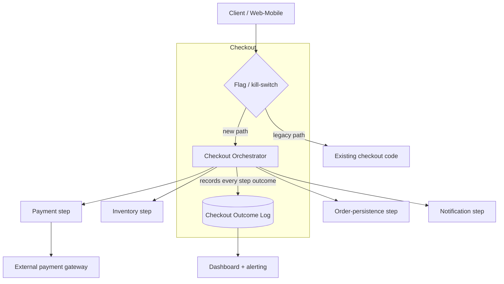
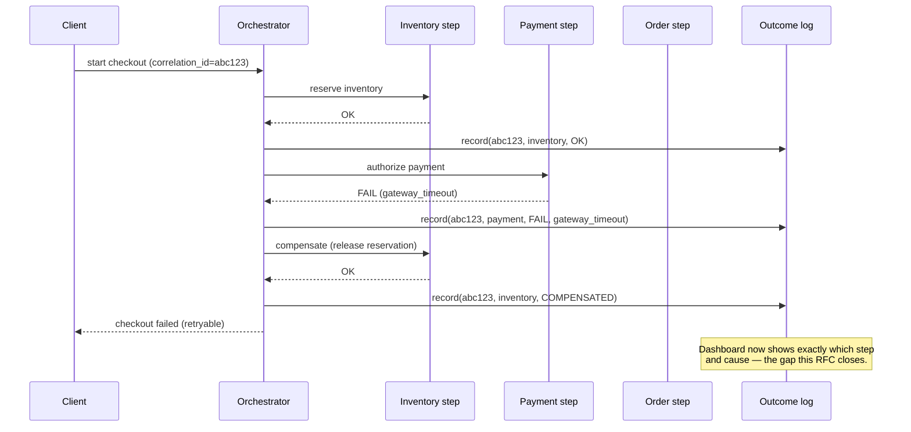

# RFC — Checkout Reliability & Failure Attribution

**Status:** Draft — in review
**Current working focus:** decision drafted, pending validation against real telemetry

## Related documents

- Checkout failure-rate dashboard (referenced by the requester; not available to this analysis — see
  *Context* and *Open questions*).
- Existing checkout service code / architecture diagrams (not available to this analysis).
- Incident/ticket history for checkout failures, if any exist (not available to this analysis).

## Context

Checkout is the step where a customer's cart becomes a paid, confirmed order — it is the single
highest-revenue-risk path in the system: every failure here is an abandoned or retried purchase, and
every unnecessary retry damages trust. Today, checkout fails on roughly 2% of attempts. When a failure
happens, the team cannot currently tell **which step** in the checkout process broke — payment
authorization, inventory reservation, order persistence, notification, or something else. The team can
see *that* checkout failed, not *why* or *where*.

That blind spot is the actual problem this RFC exists to solve. A 2% failure rate is only fixable once
someone can point at the failing step and its cause; right now, every failure requires manual,
after-the-fact investigation with no structured signal to start from. This RFC is written *before* any
of that investigation has happened — deliberately, because committing to a redesign (saga
orchestration, service boundaries, caching, an RPC protocol, a flag system) without first knowing which
step fails and why is exactly the trap this method exists to avoid (see *Requirements* and *A note on
scope*, below).

**A note on scope and how this document was built.** The request that produced this RFC specified five
technologies as "requirements": saga pattern, a microservices split, Redis caching, gRPC between
services, and a feature flag system. Per the architecture method this document follows, a requirement
is a non-negotiable, checkable constraint on the *problem* ("every checkout failure must be
attributable to a step," "no data corruption on partial failure") — not a pre-selected technology.
Naming a technology before the problem is pinned down is the specific failure mode this method is
built to catch: it would make the tradeoff analysis circular (evaluating options only against
themselves) and would risk solving problems the system doesn't actually have. Accordingly, this RFC
treats the five named technologies as **candidate solutions**, evaluated on their merits in the
*Alternatives analysis* section against the real requirements below, alongside other credible
alternatives for the same dimensions. Where a named technology holds up against a requirement, it is
recommended; where it doesn't clearly map to one, that gap is called out explicitly rather than
silently adopted. See `reply.md` for the full list of reclassifications.

**Assumptions made in the absence of system access.** This analysis was produced without access to the
checkout codebase, its current architecture, its telemetry/dashboards, or its incident history — all of
those are named in the request but were not available to inspect. The following are therefore explicit
assumptions, flagged for correction against the real system before any of this is acted on:

- The 2% failure rate and the "we don't know which step" gap are taken as given, as reported by the
  requester — they have not been independently verified against a dashboard or logs.
- Checkout is assumed to be implemented today as a single service/monolith (inferred from the request
  asking to "split into microservices," which implies it is not already split).
- The checkout flow is assumed to involve, at minimum, these logical steps: **inventory reservation →
  payment authorization → order persistence → confirmation/notification.** The real step list, their
  failure modes, and which of them actually produce the 2% failures are unknown and are the first thing
  Phase 1 (below) must establish.
- No current SLO, on-call runbook, or error budget for checkout is known to exist; none is assumed.

### Out of scope

- **Root-causing the specific defect(s) behind the current 2% failure rate.** This RFC proposes how to
  get the data needed to do that (Phase 1); it does not diagnose the failures itself, since the
  diagnostic data doesn't exist yet.
- **The payment provider integration's internal reliability** (e.g., a third-party gateway's own
  uptime) — treated as an external dependency whose failures the design must tolerate and attribute,
  not one it can fix.
- **Cart, catalog, and pricing** — upstream of checkout; unaffected by this decision.
- **A general company-wide feature-flag platform for all product surfaces** — only checkout's use of
  flags is in scope here.

## Requirements

Derived from the stated problem (a 2% failure rate with no step-level attribution), not from the
requested technology list — see *A note on scope* above.

### Functional

- A checkout attempt must either complete fully (payment captured, inventory committed, order
  persisted, confirmation sent) or leave **no partially-applied state** — no charged customer without
  an order, no reserved inventory without a resolution. This is the hard-to-reverse requirement: data
  corruption here means refunds, support tickets, and inventory drift.
- Every failed checkout attempt must produce a durable record identifying **which step failed** and
  the failure reason (e.g., `payment_authorization: gateway_timeout`), automatically — not via manual
  log correlation.
- A failed checkout must leave the system in a state from which it can be **automatically or
  deterministically retried or compensated** (e.g., release the inventory hold, refund an authorized
  but unfulfilled charge) — checkout failures must not require a human to manually reconcile state as
  the default path.
- Changes to the checkout flow must be **deployable and revertible independently of a full release
  cycle**, given checkout's revenue sensitivity — a regression must be retractable in minutes, not by
  waiting for the next deploy.

### Non-functional

- **Observability:** every checkout attempt is traceable end-to-end with a single correlation ID
  across every step it touches, and step-level success/failure is visible on a dashboard within
  seconds of occurring — this is the requirement that most directly closes the stated gap.
- **Reliability target:** checkout failure rate is measured continuously (not estimated after the
  fact) and has an explicit target — proposed **≤ 0.5% p95 weekly**, pending validation once real
  failure causes are known (some fraction of the current 2% may be external, e.g. a card decline,
  which is not a system defect and shouldn't be counted against this target).
- **No latency regression:** whatever changes checkout's shape, end-to-end checkout latency must stay
  at or below its current baseline at p95 — checkout is a conversion-sensitive path; a reliability fix
  that measurably slows checkout down trades one problem for another.
- **Blast radius containment:** a defect or outage in any single checkout step must not require a full
  rollback of the entire checkout flow to recover from — this is the actual requirement behind "we
  need to isolate failures by step," and it is what the *Design* section solves for, technology-agnostic.
- **Rollout safety:** the mechanism used to ship changes to checkout must support progressive exposure
  (a subset of traffic first) and instant kill-switch behavior, because checkout is the highest-cost
  path to regress.

## Design

Two requirements above are the ones that actually shape the architecture: (1) **atomic-or-compensated
multi-step execution with no partial state**, and (2) **step-level observability with a correlation
ID**. Everything else — caching, an RPC protocol, service boundaries — only matters insofar as it
serves those two, or the rollout-safety requirement. That ordering also sets the ordering of work: you
cannot design the transaction-coordination mechanism correctly until you know, from real telemetry,
where the current failures actually occur — so the design below is explicitly staged.

### Components

| Component | Requirement(s) it answers |
| --- | --- |
| **Checkout orchestrator** — a coordinating component that drives the checkout steps in sequence, owns the correlation ID, and records step-level outcomes | Atomicity/compensation; step-level observability; blast-radius containment |
| **Step adapters** (inventory, payment, order, notification) — the existing logic behind each step, wrapped with a uniform "execute + compensate + report outcome" contract | Atomicity/compensation; step-level observability |
| **Checkout event/outcome log** — durable, queryable record of every attempt's step-by-step outcome, keyed by correlation ID | Step-level observability; reliability-rate measurement |
| **Dashboard + alert** on step-level failure rate, sourced from the outcome log | Observability; reliability target |
| **Flag/kill-switch layer** gating the new orchestrator path vs. the legacy path per traffic segment | Rollout safety |

### Static diagram

*Whether `S1`–`S4` are separate services or modules inside one service is exactly the question the
Alternatives analysis below answers — this diagram is deliberately silent on that point, since the
requirement it must satisfy (step-level attribution) doesn't require a particular topology.*

### Dynamic diagram — a failing checkout attempt

This is the concrete behavior change: today, the client sees "checkout failed"; with this design, the
outcome log shows `payment: gateway_timeout` as the cause, at the moment it happens, without anyone
needing to reconstruct it from scattered logs.

## Alternatives analysis (Tradeoff)

Grouped by dimension. Each alternative is weighed against the requirements above, not against the
others in isolation. The five technologies named in the original request appear here as one alternative
per relevant dimension, alongside credible alternatives, per the scope note in *Context*.

| Alternative | Pros | Cons | Risk (description) | Impact | Probability | Mitigation | Contingency |
| --- | --- | --- | --- | --- | --- | --- | --- |
| **[Coordination] Orchestrated saga** — a central orchestrator drives steps and their compensations | Matches the atomicity/compensation requirement directly; centralizes step-outcome recording (serves observability requirement too); easiest to reason about and test end-to-end | Orchestrator becomes a critical, must-be-reliable component; more upfront design than "just add logging" | Orchestrator itself becomes a single point of failure | High | Low–Medium | Keep orchestrator stateless/idempotent, run it replicated, persist step state externally (not in-memory) | Fail checkout attempts safely open (leave retryable state) rather than silently drop them |
| **[Coordination] Choreographed saga** — each step publishes events; the next step reacts, no central coordinator | No single orchestrator to fail; steps stay decoupled | Failure attribution requires stitching events back together across services — works *against* the step-attribution requirement unless every event is correlation-tagged and centrally aggregated anyway | Debugging a multi-hop failure requires reconstructing causality from distributed events | Medium | Medium | Mandate correlation IDs on every event from day one; central aggregator (same outcome log as orchestration) | Fall back to orchestrated saga for the steps that prove hardest to trace |
| **[Coordination] Two-phase commit (2PC) across steps** | Strong consistency, no explicit compensation logic to write | Requires all participants (including the external payment gateway) to support a prepare/commit protocol — the gateway does not; blocks on the slowest participant, hurting the no-latency-regression requirement | External dependency (payment gateway) can't participate in 2PC | High | High | None available — this is a hard blocker, not a mitigable risk | Rule out 2PC; not viable given payment is external |
| **[Coordination] Status quo — synchronous in-process call chain, ad-hoc rollback** | Zero migration cost | Does not meet the atomicity or observability requirement — this is the current state producing the 2% failures with no attribution | Continues to ship failures nobody can diagnose | High | Certain (it's today's state) | — | — |
| **[Topology] Full microservices split** (as named in the request) | Enables independent scaling/deployment per step; matches the "blast radius" requirement *if* done well | Large, essentially irreversible undertaking (network boundary per step, new failure modes: timeouts, partial network partitions, service discovery); does not by itself solve step attribution — a badly-split system loses trace context across the network *more* easily than a monolith unless tracing is built in from the start; cost is front-loaded before any evidence the current monolith's failures are caused by shared-service resource contention | Distributed-systems failure modes (network partition, retries-on-retries) are introduced where they didn't exist before, potentially *raising* the failure rate during migration | High | Medium | Migrate one step at a time behind the flag layer, instrumented, only after Phase 1 data justifies it | Roll traffic back to the monolith path per step via the flag layer |
| **[Topology] Modular monolith** — same orchestrator design, but steps stay as in-process modules with enforced boundaries (no network hop) | Delivers the atomicity, observability, and blast-radius requirements without adding network failure modes; far smaller migration; can still extract a step to its own service later if evidence supports it | Cannot independently scale a single hot step (e.g., payment) without scaling the whole service | Under a sudden load spike on one step, resource contention affects the whole service | Medium | Low–Medium | Track per-step resource usage from the same outcome log; extract only the step that actually saturates | Scale the whole service horizontally as a stopgap while extraction is planned |
| **[Caching] Introduce Redis cache** (as named in the request) | Would reduce latency/DB load for read-heavy lookups *if* such a bottleneck exists | No requirement above calls for a cache — the stated problem is failure attribution and atomicity, not latency or DB load; adding a stateful cache adds a new component that itself needs monitoring and can introduce staleness bugs (e.g., caching inventory counts and over-selling) without addressing the actual 2% | Cache and source of truth diverge (e.g., stale inventory count read during reservation) | High | Medium | Do not cache anything in the write path of checkout (inventory/payment/order); if introduced, scope to read-only, non-authoritative data only | Bypass cache and read-through to source of truth on detected staleness |
| **[Caching] No new cache; keep current data access** | No new component, no new failure mode, matches "no evidence this is the bottleneck" | Leaves any real read-latency issue unaddressed *if one exists* — unverified either way | — | — | — | Re-evaluate once Phase 1 telemetry shows whether any step is DB/latency-bound | — |
| **[Protocol] gRPC between services** (as named in the request) | Efficient binary protocol, strong typing, good fit *if* a microservices split happens and calls are synchronous | Only relevant at all if the Topology decision above lands on microservices — and even then, gRPC is a synchronous call; using synchronous RPC *between saga steps* couples their failure domains together, working against the atomicity/compensation requirement (a downstream gRPC timeout takes the caller down with it) unless paired with strict deadlines, retries, and circuit breaking | A step's synchronous gRPC call hangs or times out, stalling the orchestrator | Medium | Medium | Strict per-call deadlines + circuit breakers; prefer async messaging for the steps that need compensation, reserve gRPC for synchronous read-only queries | Orchestrator treats a timeout as a step failure and runs compensation, per the design above |
| **[Protocol] Async messaging (event bus) between steps** | Naturally fits a saga's compensate-on-failure model; a stalled consumer doesn't block the caller; degrades gracefully | Eventual consistency window; requires idempotent consumers and dead-letter handling | Message gets stuck or duplicated | Medium | Medium | Idempotency keys per correlation ID; dead-letter queue with alerting into the same dashboard | Manual replay from dead-letter queue |
| **[Protocol] REST/HTTP+JSON** | Simple, ubiquitous, easiest to debug with standard tooling (matters for the observability requirement) | Higher payload/latency overhead than gRPC at high volume — not currently evidenced as a problem at checkout's volume | — | — | — | Revisit if Phase 1 shows protocol overhead contributes to timeouts | — |
| **[Rollout] Dedicated feature-flag system** (as named in the request) | Directly satisfies the rollout-safety requirement: progressive exposure and instant kill-switch, independent of deploys | Adds an operational dependency (flag service must itself be highly available — a flag-service outage must not take checkout down with it) | Flag service unavailable at evaluation time | Medium | Low | Default to "legacy path" (known-safe) on flag-evaluation failure, cached last-known flag state locally | Manual override via config deploy if the flag service is down for an extended period |
| **[Rollout] Config-based toggles (deploy-gated)** | No new dependency | Every toggle change requires a deploy — fails the "revertible in minutes, not a release cycle" requirement | — | — | — | Escalate to a real flag system if incident response is ever blocked on a deploy | — |

## The decision

Reading the analysis back against the requirements: the two requirements that actually shape this
system — atomic-or-compensated execution, and step-level observability — are best served by an
**orchestrated saga**, implemented first as a **modular monolith** (not a microservices split), with a
**feature-flag/kill-switch layer** gating the new orchestrator against the legacy path. Redis caching
and gRPC do not map to any stated requirement today and are **not recommended as part of this phase**;
both are explicitly revisited in Phase 2+ only if Phase 1 telemetry produces evidence that justifies
them (see *Launch strategy*). Where inter-step calls need to be decoupled at all (relevant only if/when
a step is later extracted into its own service), async messaging is recommended over gRPC, specifically
because synchronous RPC between saga steps works against the compensation requirement.

This reprioritizes the original ask considerably — it defers a microservices split, drops Redis and
gRPC from the near-term plan, and puts instrumentation ahead of all of it. That reprioritization is
argued from the two requirements that actually trace back to the stated problem (2% failures,
unknown step); see `reply.md` for a plain summary of what changed and why, so it can be checked against
the checkout owner's actual constraints before being finalized.

**Decision style:** Autocratic, as drafted — this RFC states a recommendation for the checkout owner
and reviewers to accept, amend, or reject; it is not yet a ratified decision. It should not be treated
as final until Phase 1 telemetry (below) is available to confirm or revise the assumed step list and
failure causes.

## Launch strategy

- **Phase 0 — Instrumentation only (no coordination-logic changes).** Add the correlation ID, the
  outcome log, and the dashboard around the *existing* checkout code, unchanged. This alone should
  close most of the "we don't know which step broke" gap and starts producing the evidence every later
  phase depends on. Ships behind no flag — it's additive logging, not a behavior change.
- **Phase 1 — Read the data.** With 1–2 weeks of step-level failure data, confirm or revise: which
  step(s) actually produce the 2% failures, whether any failures are external (e.g., card declines,
  which are not defects), and whether any step shows a latency/DB pattern that would justify caching.
  This phase is a gate — Phase 2 does not start until this data exists.
- **Phase 2 — Orchestrated saga, modular monolith, behind a flag.** Wrap the confirmed failing step(s)
  first with compensation logic and orchestrator-driven execution; roll out via the flag layer to a
  small traffic percentage, watch the dashboard, expand gradually.
- **Phase 3 (conditional) — Targeted extraction.** Only if Phase 1/2 data shows a specific step
  genuinely needs independent scaling or deployment cadence, extract *that step alone* into its own
  service, using async messaging for its saga participation. This replaces "split into microservices"
  wholesale with an evidence-driven, incremental version of the same idea.
- **Explicitly deferred, not rejected:** Redis caching and gRPC. Both get a one-line re-evaluation
  checkpoint at the end of Phase 1 (see roadmap) rather than being designed in now.

## Tasks and roadmap

| Task | Description | Estimate |
| --- | --- | --- |
| Correlation ID + outcome log | Thread a correlation ID through the existing checkout call path; persist step outcomes to a queryable log | 3d |
| Dashboard + alert | Step-level failure-rate dashboard and alert sourced from the outcome log | 2d |
| Phase 1 data review | Analyze 1–2 weeks of outcome-log data; confirm failing step(s) and causes; go/no-go on Phase 2 scope | 2d |
| Orchestrator + compensation logic | Wrap confirmed failing step(s) with execute/compensate contract, driven by a central orchestrator | 5–8d (depends on Phase 1 findings) |
| Flag/kill-switch integration | Introduce or extend a feature-flag mechanism; gate new orchestrator path vs. legacy per traffic % | 3d |
| Progressive rollout | Ramp traffic 1% → 100% behind the flag, monitoring the dashboard at each step | 1–2w (rollout calendar time, not eng-days) |
| Redis/gRPC re-evaluation checkpoint | Revisit both against Phase 1 evidence; produce a short addendum if either is now justified | 1d |

## Version history

| Version | Date | Author | Description |
| --- | --- | --- | --- |
| 1.0 | 2026-09-08 | Lucas Marques (lucas.marques@medprevonline.com) | Draft RFC created: reclassified the requested technology list as candidate solutions, derived requirements from the stated failure/observability problem, proposed an instrumentation-first, evidence-gated rollout. |
