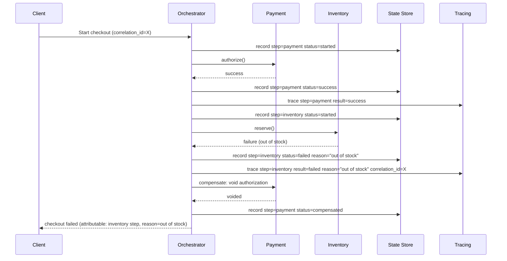

# RFC — Checkout Refactor: Failure Attribution and Reliability

**Status:** Draft — for review
**Current working focus:** decision

## Related documents

None were available to this analysis. Before this RFC is finalized, attach:

- The current checkout service(s) architecture diagram or repository.
- The dashboard/monitor that produces the ~2% failure-rate figure, and a breakdown of that 2% by
  cause (user error such as a declined card vs. system defect vs. timeout vs. unknown).
- Any existing incident tickets tied to checkout failures.

None of the above were reachable from this analysis, so several items below are stated as explicit
assumptions rather than verified facts. They are flagged inline and collected again in
[Assumptions and open questions](#assumptions-and-open-questions).

## Context

Checkout is the step in the purchase flow where the order is actually placed: whatever precedes it
(browsing, cart) is reversible and low-stakes; checkout is where money moves and inventory/order
records are committed. It is presumably the highest-revenue-risk path in the product — every failure
here is a lost or at-risk transaction, not just a bad page load.

Today, checkout fails on roughly 2% of attempts. That number alone is not very actionable: nobody
currently knows **which step** of the checkout flow broke when a given attempt fails — whether it was
payment authorization, inventory reservation, order-record creation, a downstream notification, or
something else. Without that attribution, every failure has to be investigated manually, from scratch,
and there is no way to tell a systemic problem (e.g., one step is unreliable) from noise. This is the
concrete trigger for the refactor: **checkout needs to fail in a way that tells us why**, and it needs
to fail less often for reasons within our control.

The request that prompted this document also named five specific technologies as if they were
requirements: the saga pattern, a split into microservices, Redis caching, gRPC between services, and a
feature flag system. None of these is a requirement in the architectural sense — a requirement is a
constraint on the *problem* (reliability, attribution, data integrity, delivery risk), not a
prescription of the *solution*. Naming a technology up front is exactly the trap this method exists to
avoid: it forecloses cheaper alternatives before the actual need is pinned down, and it bundles five
independent, unrelated architectural decisions (transaction/consistency strategy, service topology,
wire protocol, caching, and progressive delivery) into one "yes/no" ask. This document treats those five
items as **candidate solutions to evaluate**, not as given constraints — each is carried into the
[Design](#design) and [Tradeoff analysis](#alternatives-analysis-tradeoff) sections and judged against
the requirements below, exactly like any other alternative. Where the evaluation disagrees with the
original ask, that disagreement is stated plainly in [The decision](#the-decision).

### Out of scope

- **Payment gateway/provider selection.** Assumed unchanged; this document addresses orchestration
  around payment, not the provider integration itself.
- **Checkout UI/UX.** No changes to the customer-facing flow are proposed.
- **Pricing, promotions, and cart logic upstream of checkout.**
- **Post-order fulfillment** (physical shipping, warehouse systems) beyond the point an order record is
  durably created — that is where this document's notion of "checkout" ends.
- **Root-causing the current 2% failure rate.** That requires the failure-cause breakdown named above,
  which was not available. This RFC designs the capability to attribute *future* failures; it does not
  diagnose the current ones.

## Requirements

Only items that are business-critical, hard to reverse, or force a structural choice are listed here.
Everything else (specific error-message copy, exact retry counts, etc.) is an implementation detail to
settle during build, not an architectural constraint.

### Functional

- **FR1 — Explicit steps.** Checkout must be modeled as an ordered sequence of named, individually
  observable steps (e.g., payment authorization, inventory reservation, order-record creation,
  confirmation). *Assumption: the exact step list is illustrative, pending the real flow — see
  Assumptions.*
- **FR2 — Failure attribution.** Every failed checkout attempt must record which step failed, the
  failure reason, and a correlation ID that ties the whole attempt together, retrievable by support and
  engineering without reading application code.
- **FR3 — No partial, uncompensated side effects.** A failure in one step must never leave an
  irreversible effect from an earlier step stranded (e.g., a customer charged with no order created, or
  inventory reserved with no matching order). Every side-effecting step must have a defined compensating
  action.
- **FR4 — Automatic recovery for transient failures.** Where a step's failure is transient and the step
  is safely retryable (idempotent), the system must retry it automatically rather than surfacing a
  failure to the customer or requiring manual intervention.

### Non-functional

- **NFR1 — 100% attribution.** Of checkout attempts that fail, 100% must be attributable to a specific
  step, within the existing observability toolchain, without a code change or ad hoc log-grepping.
  Today this is effectively 0%; that gap is the primary problem this RFC solves. *Target should be
  validated by deliberately failing each step in a staging environment and confirming attribution
  works, not just estimated.*
- **NFR2 — Reduced defect-driven failure rate.** The share of the ~2% failure rate attributable to
  system defects (as opposed to user error, e.g., a declined card) should drop measurably after this
  refactor ships. *No numeric target is set here because the cause breakdown of the current 2% is not
  available — see Assumptions. Setting a target (e.g., "<0.5% system-caused failures") before that
  breakdown exists would be a number nobody has verified, which this document's own standard rules
  out.*
- **NFR3 — Incremental, reversible delivery.** Because checkout is revenue-critical, no part of this
  refactor may ship as a single irreversible cutover. Each change must be independently rollback-able.
- **NFR4 — No consistency regression.** Whatever is built must preserve at least today's guarantees:
  no lost orders, no double charges, no silently dropped steps.

## Design

The two requirements that actually shape the architecture are FR2/NFR1 (attribution) and FR3/FR4
(no stranded side effects, automatic recovery). Everything below is organized around solving those two,
dimension by dimension — including the five originally-requested technologies, each evaluated on its
merits rather than assumed.

### Dimension 1 — Failure attribution and recovery pattern

This is the direct fix for "we don't know which step broke." The checkout flow is modeled explicitly as
a **step state machine**: each attempt gets a correlation ID, and each step's start/success/failure is
persisted as a durable record before and after execution, alongside a structured trace (step name,
input reference, error, timestamp). This is the essential mechanic of the **saga pattern** —
orchestration-style: a coordinator drives the steps in order and calls a defined compensating action if
a downstream step fails. Whether that coordinator sits inside one process or across several services is
a *separate* decision (Dimension 2) — the saga's state-machine discipline is what answers FR2/FR3/FR4,
not the number of network hops involved. This is why "saga pattern" and "split into microservices" are
evaluated as two different rows in the tradeoff table below, not one.

### Dimension 2 — Service topology

Does checkout need to be physically split into separate deployable services? That question is
orthogonal to attribution and recovery — a single process can implement the step state machine from
Dimension 1 just as well as five processes can. Splitting is justified by requirements like independent
scaling of one step, independent deployment ownership by different teams, or a step needing a different
runtime/language. None of those was stated as a requirement here; they may exist, but this document has
no evidence of them (see Assumptions). Topology is evaluated as its own row below rather than assumed.

### Dimension 3 — Inter-step communication protocol

Only relevant if Dimension 2 results in a split. Candidates: gRPC, REST/JSON, or asynchronous messaging.
Evaluated against FR2 (attribution has to stay easy — whatever crosses the wire has to be inspectable
when debugging a failed step) and NFR1.

### Dimension 4 — State and idempotency store

The step state machine (Dimension 1) needs somewhere durable to record step outcomes and idempotency
keys (so a retried step doesn't double-charge or double-reserve). Candidates: the existing transactional
database vs. a new Redis layer vs. a purpose-built store (e.g., DynamoDB). This is where "Redis caching"
from the original ask is evaluated — not as a blanket cache-everything layer, but against this specific,
narrow need.

### Dimension 5 — Progressive delivery mechanism

NFR3 requires every change to ship incrementally and reversibly. Candidates: a full feature-flag
platform (as requested), a lightweight rollout-percentage config, or blue/green deploys alone.

### Static diagram

Illustrative target shape once the orchestration/state-machine layer exists (topology intentionally
left open — see Dimension 2 and the decision below):

```mermaid
flowchart LR
    Client[Client / Checkout UI] --> Orchestrator[Checkout Orchestrator\n(saga coordinator)]
    Orchestrator --> Payment[Payment Authorization]
    Orchestrator --> Inventory[Inventory Reservation]
    Orchestrator --> OrderRec[Order Record Creation]
    Orchestrator --> Notify[Confirmation / Notification]
    Orchestrator <--> StateStore[(Step State + Idempotency Store)]
    Payment -.compensate.-> Orchestrator
    Inventory -.compensate.-> Orchestrator
    OrderRec -.compensate.-> Orchestrator
    Orchestrator --> Tracing[(Tracing / Structured Logs\ncorrelation ID per attempt)]
    Flag[Progressive delivery / flag check] --> Orchestrator
```

If diagrams don't render, read it as: the client calls a single Checkout Orchestrator; the orchestrator
calls each step in order (Payment → Inventory → Order Record → Notification), persists each step's
outcome to a Step State + Idempotency Store, emits a trace/log per step under one correlation ID, and —
on failure of any step — invokes that step's compensating action and the compensating actions of any
completed prior steps. A progressive-delivery check gates whether a given attempt runs the new
orchestrated path or the legacy path.

### Dynamic diagram — failure and compensation flow



This is the concrete mechanism that turns "checkout failed, cause unknown" into "checkout failed at the
inventory step, reason X, correlation ID Y, payment auth was safely voided" — satisfying FR2/FR3
regardless of which topology or protocol Dimensions 2–3 land on.

## Alternatives analysis (Tradeoff)

Each of the five originally-requested technologies appears below as one alternative among others for
its dimension, weighed against FR1–FR4 and NFR1–NFR4.

| Alternative | Pros | Cons | Risk (description) | Impact | Probability | Mitigation | Contingency |
| --- | --- | --- | --- | --- | --- | --- | --- |
| **[Dim 1 — reliability pattern] Orchestrated saga (state machine + compensations), topology-agnostic** | Directly satisfies FR2/FR3/FR4; centralizes failure attribution in one coordinator, so "which step broke" always has one answer; compensations are explicit and testable | Requires writing a compensating action for every side-effecting step, including ones that don't have one today; eventual consistency during compensation window | A compensating action itself fails or is missing for a step (e.g., a payment provider that can't be reliably voided) | High | Medium | Design compensations first, before the step itself, for every new step; contract-test each compensation in isolation; require a compensation or an explicit "not compensable, use manual reconciliation" note per step | Manual reconciliation runbook + alert when a compensation fails, so it becomes a paged incident instead of silent data drift |
| **[Dim 1] Choreographed saga (steps react to each other's events, no central coordinator)** | Fully decouples steps; no single coordinator to scale | Undermines FR2 directly: attribution requires reconstructing the flow across every service's event log after the fact, which is *harder* than today, not easier, unless a separate tracing layer is bolted on anyway | Failure attribution regresses relative to the stated goal | High | High (by construction, absent extra tooling) | Only viable if paired with the same centralized tracing/correlation-ID layer as the orchestrated option — at which point most of its decoupling benefit is spent on rebuilding what orchestration gives for free | Fall back to orchestrated saga |
| **[Dim 1] Status quo + logging only (no saga, no compensations)** | Cheapest, fastest to ship; no new consistency model to learn | Does not satisfy FR3/FR4 at all — still leaves stranded side effects on failure; only partially satisfies FR2 (you'd know *that* a step logged an error, but no structured, queryable attribution or correlation) | Failures continue to require manual, per-incident investigation | Medium | High | None available within this option's scope | Escalate to the orchestrated-saga option once a second/third checkout incident recurs |
| **[Dim 2 — topology] Keep as a modular monolith; add the orchestrator as an internal module** | Lowest risk and cost; no new network calls, no new failure modes from partial network partitions; satisfies FR1–FR4 and NFR4 without touching NFR3's rollback requirement in a risky way; ships fastest | Doesn't give independent per-step scaling or independent team ownership | None of the stated requirements are put at risk by this option — the risk is organizational (a team-ownership or scaling need surfacing later that this doesn't serve), not technical | Low–Medium | Unknown (no evidence given either way) | Confirm with stakeholders whether an independent-scaling or independent-ownership driver actually exists before ruling this out | Extract to services later (Dimension 2's other row) once that driver is confirmed — the saga/state-machine design from Dimension 1 carries over unchanged |
| **[Dim 2] Split into microservices per step (payment, inventory, order, notification), as requested** | Enables independent scaling and deployment per step; matches the requested end state; can isolate a noisy/heavy step (e.g., inventory) from the rest | Highest cost and blast radius of any option here; introduces partial-failure modes (network timeouts, partial outages) that don't exist in-process, which can themselves become a *new* unattributed-failure source if not built carefully; requires solving Dimensions 3–4 as prerequisites; largest, least reversible commitment of the five requested technologies | A poorly-instrumented split makes attribution *worse*, not better, until tracing (Dimension 1) is fully wired across every new network hop | High | Medium | Do not split before the saga/tracing layer from Dimension 1 is proven inside the current topology; extract one step at a time, each fully instrumented, behind a feature flag (Dimension 5) before the next | Roll the flag back to route that step's traffic through the in-process path |
| **[Dim 3 — protocol, only if split] gRPC between services, as requested** | Strong typed contracts (protobuf) prevent a class of integration bugs; efficient binary framing; native streaming if ever needed | Protobuf payloads are not human-readable in ad hoc log/trace inspection — the exact moment you're debugging "which step broke," you want to eyeball a payload, and gRPC makes that one step harder without extra tooling; requires HTTP/2-aware infra (load balancers, service mesh) that may not exist yet | Debugging a failed step is slowed by binary payloads during incident response, working against NFR1's spirit | Medium | Medium | Ensure trace/log middleware decodes and logs protobuf payloads in human-readable form at each hop, not just raw bytes | Fall back to REST/JSON for the specific step proving hardest to debug |
| **[Dim 3] REST/JSON between services** | Human-readable by default, curl-able, lowest tooling bar for on-call debugging — directly supports NFR1 | Weaker contract enforcement than protobuf; slightly higher payload size/latency at scale | Contract drift between caller/callee versions goes unnoticed until runtime | Medium | Medium | Adopt a schema (OpenAPI/JSON Schema) and contract tests even without protobuf's compiler enforcement | Add gRPC selectively later for the highest-throughput internal hop only, if measured latency data justifies it |
| **[Dim 4 — state/idempotency store] Reuse the existing transactional database for step state + idempotency keys** | No new infrastructure; step-state writes can share a transaction with the step's own side effect, which is the strongest consistency option available; simplest to operate and back up | Adds write load to the primary database; less suited if step volume later grows far beyond current transactional traffic | Step-state writes contend with core transactional load at peak checkout volume | Medium | Low–Medium (no load figures available to confirm) | Monitor primary DB latency/connections after rollout; index step-state tables for the access patterns actually used (by correlation ID, by step, by status) | Move step-state/idempotency writes to a dedicated store (Redis or otherwise) once contention is measured, not before |
| **[Dim 4] Redis as the step-state/idempotency store, as requested** | Very fast reads/writes; well-suited to short-lived idempotency keys with a TTL | Redis is not the transactional side effect's own store, so step-state and the side effect itself can't be written atomically — reintroduces exactly the kind of partial-write inconsistency FR3 exists to prevent, unless carefully reconciled; adds an operational dependency (another datastore to run, monitor, and fail over) with no stated latency/throughput problem driving the need | A Redis outage or eviction loses idempotency keys, causing duplicate side effects (e.g., double payment capture on a retried step) right when the system is under stress | High | Low–Medium | Persist idempotency keys durably (DB) in addition to any Redis cache; treat Redis strictly as an accelerator, never the source of truth for FR3 | Fail closed: if Redis is unreachable, fall back to the durable store directly rather than skipping the idempotency check |
| **[Dim 4] Redis as a general checkout-time read cache (product/pricing lookups), as requested** | Could reduce read latency on hot lookups during checkout | Not connected to FR2/FR3/FR4 (attribution/reliability) at all — solves a latency problem that was never stated as a requirement here | Introduces a cache-invalidation/staleness class of bug (stale price/stock shown at checkout) with no evidence it's needed | Medium | Low (speculative use case) | Only build this if a measured checkout-path latency problem is found; do not include in this refactor's scope by default | Add narrowly, later, scoped to the specific lookup shown to be slow |
| **[Dim 5 — progressive delivery] Full feature-flag platform, as requested** | Enables per-step, per-percentage, instantly-reversible rollout of each new checkout path — directly satisfies NFR3; also useful long-term beyond this refactor | Ongoing cost/complexity of running or subscribing to a flag platform; flags left stale after rollout become their own tech debt if not cleaned up | Flags never removed after full rollout, leaving dead conditional paths | Low | High (common failure mode of flag systems generally) | Set an explicit removal date/owner per flag at creation time; track flag age | Periodic flag-debt cleanup pass |
| **[Dim 5] Lightweight rollout-percentage config (no full flag platform)** | Much cheaper to build/operate; sufficient for a single migration's gradual cutover | No reuse value beyond this migration; less mature tooling (targeting, kill-switch UX) than a real flag platform | Team later wants the same capability for an unrelated feature and rebuilds it | Low | Medium | Scope it clearly as a migration-only tool from the start | Adopt a full platform later if the need recurs |
| **[Dim 5] Blue/green deploy only, no flags** | Simplest possible mechanism; no new abstraction | Cuts over the whole flow at once per environment — weaker granularity than per-step, per-percentage control; harder to isolate a single misbehaving step during rollout | A regression in one step forces rolling back the entire deploy, not just that step | Medium | Medium | None beyond accepting coarser rollback granularity | Combine with fast automated rollback tooling at the deploy level |

## The decision

**Decided:** build the saga-style step state machine (Dimension 1, orchestrated) with durable
attribution and compensations first, inside the current topology — do **not** commit to a physical
microservices split, gRPC, or Redis as part of this phase. Adopt a progressive-delivery mechanism
(Dimension 5) to gate the rollout, starting with the lightweight rollout-percentage option and upgrading
to a full flag platform only if a second migration surfaces the same need.

Reasoning: FR2/FR3/FR4 and NFR1 — the actual stated problem — are fully addressed by Dimension 1
regardless of topology. Dimensions 2–4 (microservices, gRPC, Redis) each carry real cost and risk
(the tradeoff table above) that is justified only by a scaling or team-ownership driver that was
asserted in the original ask but not evidenced anywhere available to this analysis. Committing to the
most expensive, least reversible option (a physical service split, with its protocol and cache
consequences) before the cheaper option (Dimension 1 alone, in place) has even been tried and measured
would violate NFR3 (incremental, reversible delivery) and this method's own standard of tying every
choice to a verified requirement rather than a preference. If, after Phase 1 below ships and is
measured, a genuine scaling or ownership need for splitting checkout into services is confirmed, this
document's Dimension 1 design (the saga/state machine) is built to carry over unchanged into a split
topology — so nothing here is wasted if that need materializes.

**Decision style:** autocratic — this is a single-author architectural recommendation, made explicit so
it can be reviewed and overridden by stakeholders with information this analysis didn't have (in
particular, any organizational scaling/ownership driver behind the original "split into microservices"
ask — see [Assumptions and open questions](#assumptions-and-open-questions)).

## Launch strategy

- **Phase 0 — Instrumentation only, no behavior change.** Add correlation IDs and step-level tracing
  to the existing checkout flow as it stands today. This alone should convert "we don't know which step
  broke" into a known answer for new failures, before anything else changes. Ships behind the rollout
  mechanism at 100% (pure observability addition, no logic change, minimal rollback risk).
- **Phase 1 — Saga discipline in place.** Add the durable step-state store, idempotency keys, and
  compensating actions for each existing step, still in the current topology. Roll out gradually via
  Dimension 5's mechanism, step by step (e.g., payment compensation first, since it's the highest-value
  one to get right).
- **Phase 2 — Measure, then decide on topology.** Using Phase 0/1's data (real step latencies, real
  failure distribution, any confirmed scaling/ownership driver), revisit Dimension 2. Only if a
  split is justified, extract one step at a time behind a flag, each fully instrumented before the next,
  and only then decide Dimension 3 (protocol) per extracted hop based on measured needs.
- **Explicitly not phased in now:** a blanket Redis layer, gRPC, or a full microservices split. These
  remain candidate future work, not part of this rollout, pending the evidence described above.

## Tasks and roadmap

Estimates are rough — no current codebase or team context was available to size them precisely; treat
as planning-order-of-magnitude, not committed estimates.

| Task | Description | Estimate |
| --- | --- | --- |
| Correlation ID + step tracing (Phase 0) | Instrument existing checkout steps with a shared correlation ID and structured trace/log per step, no logic change | 3–5d |
| Step-state durable store (Phase 1) | Schema + writes for step start/success/failure per attempt, reusing existing DB | 3d |
| Idempotency keys per step (Phase 1) | Generate/check idempotency keys so retried steps don't double-execute | 2–3d |
| Compensating action: payment (Phase 1) | Void/refund logic triggered by orchestrator on downstream failure | 3–4d |
| Compensating actions: remaining steps (Phase 1) | One per existing side-effecting step | 2–3d each |
| Rollout-percentage mechanism (Phase 5) | Lightweight config-driven gradual cutover per step | 2d |
| Phase 2 scoping spike | Confirm scaling/ownership driver; measure Phase 0/1 data before any split decision | 2–3d |

## Assumptions and open questions

- **Current checkout architecture is unknown.** No repository or diagram was available. This document
  assumes checkout exists today as some form of single deployable (monolith or modular monolith),
  because the ask to "split into microservices" implies it is not already split; if that's wrong, the
  topology analysis in Dimension 2 needs revisiting.
- **The illustrative step list** (payment authorization, inventory reservation, order-record creation,
  notification) is inferred from how checkout flows typically work, not from the real system. Confirm
  the actual steps before implementing Phase 0's tracing.
- **The cause breakdown of the 2% failure rate is unknown** (system defect vs. user error vs. timeout).
  NFR2 intentionally has no numeric target until this is available — setting one now would be an
  unverified number.
- **No evidence was available for an independent scaling or team-ownership driver** behind the original
  "split into microservices" request. That absence, not a rejection of the idea, is why the split is
  deferred to Phase 2 pending confirmation, rather than ruled out.
- **Compliance considerations (e.g., cardholder-data handling) were not assessable** without the current
  payment integration details; if payment data flows through any new component built here (state store,
  cache), confirm scope against applicable requirements (e.g., PCI DSS) before Phase 1 ships.

## Version history

| Version | Date | Author | Description |
| --- | --- | --- | --- |
| 1.0 | 2026-09-08 | Claude (architecture-design RFC assist) | Document created; reclassified the five originally-requested technologies as candidate solutions and evaluated them against derived requirements. |
