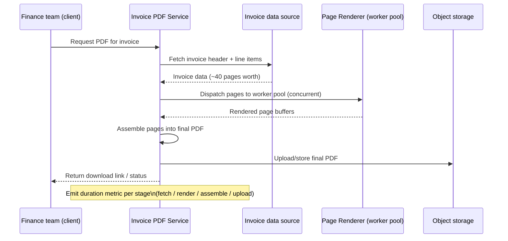

# RFC — Invoice PDF Generation Service: Rewrite Language Selection

**Status:** Draft — decision recorded, verification steps pending
**Current working focus:** Concluded (decision made); Launch strategy includes a diagnostic step that should run before full commitment

## Related documents

The following were named as motivation for this RFC but are **not accessible from this session** — no
repository, APM/dashboard, or ticket system was reachable. Every number and claim drawn from them below
is marked as an assumption and should be confirmed before the roadmap is executed:

- Current PDF generation service source (Python) — not available; architecture, libraries in use, and
  actual profiling breakdown are unknown.
- Latency/APM dashboard for the generation endpoint — not available; the "~12s for a 40-page invoice"
  figure is taken as given, not independently measured, and its p50/p95/p99 shape is unknown.
- Finance team complaint thread / support tickets — not available; frequency, whether complaints are
  about latency alone or also about correctness/formatting, and whether generation is on-demand or
  batch, are unknown.
- Invoice data source (DB/service the PDF step reads from) — not available; whether the 12s includes
  data-fetch time or only rendering is unknown, which matters a great deal for the decision below.

## Context

The invoice PDF generation service is currently implemented in Python. Generating a 40-page invoice
takes roughly 12 seconds end to end, and the finance team — the primary consumer of these invoices —
complains about it regularly. That complaint is the trigger for this RFC. The requester has framed the
fix as a language rewrite and asked specifically to choose between Rust and Go.

Before naming a language, this document briefly checks that premise, because a rewrite is a large,
hard-to-reverse investment and 12 seconds is a symptom, not a diagnosis. It could come from CPU-bound
rendering (font shaping, image processing, page layout math) that a language change would genuinely
fix, or it could come from something a language change would not fix at all — an unindexed query
against the invoice data source, synchronous per-page calls, unbuffered I/O, no template/font caching,
or a single-threaded pipeline that never used the CPU it had. No profiler, trace, or code from the
actual service was available to this session to tell which of those it is (see *Related documents*).

That gap is flagged, not silently assumed away. Given the instruction to proceed unattended and commit
to a Rust-or-Go answer, this RFC does so — but it treats "is a rewrite actually the fix" as the first,
prior question the method requires asking, answers it as best it can without the missing evidence, and
records the profiling work as a same-sprint prerequisite rather than deferring it indefinitely.

**The problem to solve:** a 40-page invoice takes ~12s to generate today, the finance team is
unsatisfied with that, and engineering has been asked to decide whether Go or Rust is the right
language for a rewrite aimed at fixing it.

### Out of scope

- **Invoice content, layout, or template redesign.** This is a performance and implementation decision;
  the visual/data content of the invoice does not change.
- **The finance team's broader billing workflow** beyond the PDF artifact itself (e.g. how invoices are
  sent, approved, or reconciled).
- **Languages other than Rust and Go for the rewrite path.** The requester scoped the language choice to
  these two; candidates like Node.js/TypeScript or Java are not evaluated here. This is an explicit
  scoping decision, not evidence that they are inferior — flagged so it isn't mistaken for an oversight.
- **Migrating the invoice data source itself**, even if the profiling spike (below) finds the bottleneck
  there — that would be a separate RFC.

## Requirements

Architecturally relevant only — each entry below is either business-critical, cross-cutting, or
expensive to reverse; everything else (exact library choices, internal code structure) is left to
implementation.

### Functional

- The rewritten service must produce invoices with **the same data content and visual layout** as the
  current Python output — finance-facing, potentially audited financial documents cannot silently
  change format or numbers as a side effect of a performance rewrite.
- Must support the existing invoice shapes in production, including the 40+ page case (line items,
  totals, multi-page tables, logos/images) — this is the concrete case the complaint is about.
- Must integrate with the existing invoice data source and existing distribution/storage mechanism
  (assumed to be an internal API/DB and an object store or email delivery step — **unverified**, since
  the current code was not available).

### Non-functional

- **Latency:** generation of a representative 40-page invoice should complete in **≤ 3s at p95** on
  production-equivalent hardware, validated under load.
  *(Assumption — no SLA was provided by finance or product. Chosen as "clearly no longer a complaint"
  relative to the reported 12s; must be confirmed with the finance team, and revised if the actual
  pain is really about a different threshold, e.g. an interactive UI timeout.)*
- **Throughput under burst:** the service must not degrade badly during batch periods (e.g. month-end
  close), when many invoices are plausibly generated close together.
  *(Assumption — concurrency profile of real usage is unknown; on-demand single-invoice generation and
  a nightly batch of thousands have very different implications for language/runtime choice and are
  conflated in "12 seconds" as reported.)*
- **Correctness parity:** automated regression tests must confirm the new output matches the old output
  (data and layout) for a representative corpus of real invoices before any traffic cutover — this is
  business-critical for a financial document.
- **Observability:** structured logs with a correlation ID per invoice, a duration metric per
  generation, and tracing across data-fetch vs. render vs. upload — needed both to hit the latency
  target and to finally get the profiling data this RFC could not obtain.
- **Team maintainability:** the team currently operates in Python; whichever language is chosen becomes
  a second production language they must hire for, review, and operate long-term. This is a real,
  ongoing cost and is treated as architecturally relevant, not a "nice to have."
- **Security/compliance:** invoices carry customer and financial PII; the rewrite must preserve
  whatever data-handling boundaries the current service has (assumed to include encryption in transit
  and at rest, and no new third-party egress for rendering — **unverified**, current controls unknown).

## Design

### Approach: rewrite vs. optimize in place

The requester asked to choose a rewrite language, but the prior question — rewrite at all, vs. fix the
existing Python service — is the one that actually determines whether either Rust or Go pays off, so it
is answered explicitly here rather than skipped.

Python's own ceiling is real but bounded: the GIL prevents true intra-process CPU parallelism, so a
single Python worker cannot use multiple cores for one invoice's rendering math, and common fixes
(multiprocessing, moving hot loops into a C extension) recover some of that at the cost of complexity
that starts to resemble a partial rewrite anyway. If the 12s is dominated by *data-fetch* latency or by
an accidentally-serial pipeline rather than by CPU-bound rendering, however, none of Rust, Go, or a
Python rewrite fixes it — only fixing the actual bottleneck does, and that would be true even if the
service were reimplemented in either target language, because both would inherit the same slow
data-fetch or serial structure if it were copied over uninspected.

Because that evidence is unavailable in this session, this RFC does not treat "optimize Python" as
disproven — it is carried into the tradeoff table below as a real alternative, not dismissed — but it
proceeds to answer the language question as asked, on the assumption that a meaningful share of the 12s
is genuinely CPU-bound rendering (fonts, layout, image handling) at 40 pages, which is the scenario
where a rewrite is expected to help. **This assumption is the single most consequential guess in this
document** and is why a profiling spike is placed at the front of the roadmap rather than treated as
optional follow-up.

### Language: Go vs. Rust

Both are compiled, garbage-free-at-the-language-level*(Go still garbage collects; Rust doesn't)*
alternatives to Python with real concurrency and materially better CPU throughput. The deciding factors
given the requirements above are less about raw peak performance — both comfortably clear a 3-second
budget for 40 pages of rendering — and more about **time-to-a-correct, maintained rewrite**:

- **Go**'s simpler language surface and larger hiring pool shorten the path from "decision" to "a
  team that isn't just the original author can safely operate this," which matters because this is a
  financial document generator, not a low-level systems component.
- **Rust** has no GC pauses and a higher raw performance ceiling, which matters more as concurrency and
  scale grow, but its steeper learning curve (ownership/borrowing) and thinner PDF-specific ecosystem
  push out delivery time and raise the defect risk for a team without existing Rust depth.

Both are checked against the requirements in the tradeoff table below; the full reasoning behind the
recommendation is in *The decision*.

### Static diagram — components

```mermaid
flowchart LR
    subgraph Client
        FIN[Finance team UI / batch trigger]
    end

    FIN -->|request invoice #N| API[Invoice PDF Service - Go]

    subgraph "Invoice PDF Service (rewrite target)"
        API --> FETCH[Data Fetcher]
        FETCH --> RENDER[Page Renderer\n(concurrent per-page workers)]
        RENDER --> ASSEMBLE[PDF Assembler]
        ASSEMBLE --> STORE_OUT[Storage/Delivery adapter]
    end

    FETCH -->|invoice line items, totals| DATA[(Invoice data source\n- unverified, current impl unknown)]
    STORE_OUT --> OBJSTORE[(Object storage / email delivery\n- unverified, current impl unknown)]
    API --> OBS[Structured logs + duration metrics + tracing]
```

### Dynamic diagram — single-invoice generation flow



## Alternatives analysis (Tradeoff)

| Alternative | Pros | Cons | Risk (description) | Impact | Probability | Mitigation | Contingency |
| --- | --- | --- | --- | --- | --- | --- | --- |
| **[Approach] Keep Python, optimize in place** | No rewrite risk; output stays byte-identical; fastest to ship; zero ecosystem-migration cost; team stays fully productive on the familiar stack | GIL blocks true intra-process CPU parallelism — multiprocessing/C-extension workarounds add complexity that starts to resemble a rewrite; unclear it can reach the assumed ≤3s target if the bottleneck is genuinely CPU-bound rendering | Root cause of the 12s is unverified — optimizing without profiling risks fixing the wrong thing | High | Medium | Run the profiling spike (below) before investing further engineering here or in a rewrite | If profiling shows CPU-bound rendering dominates, fall back to the rewrite path |
| | | | Even after optimization, may still miss the target under batch/burst load because the GIL still caps one process | Medium | Medium | Multiprocessing worker pool with a process-per-core model | Horizontal scale-out (more worker processes/pods) |
| **[Language] Rewrite in Go** | Goroutines fit a batch/burst rendering workload naturally; large hiring pool and shallower learning curve than Rust shorten time-to-a-safely-maintained-service; mature-enough HTML/PDF rendering options (e.g. headless-Chromium-based or native Go PDF libraries); fast build/iterate loop; strong stdlib for HTTP + observability | Still garbage-collected — rare tail-latency risk under memory pressure; lower raw CPU ceiling than Rust for very heavy rendering math; Go PDF libraries are less feature-rich than the mature Python ones, so some layout logic may need reimplementing | Team has limited production Go experience | Medium | Medium | Pair a Go-experienced engineer/lead on the project; budget ramp-up time explicitly; establish Go code-review guidelines up front | Bring in a short-term Go contractor for the initial architecture |
| | | | Chosen rendering library doesn't match current output fidelity (layout regressions) | High | Medium | Golden-file visual/data regression tests against current Python output, across a representative invoice corpus, before any cutover | Run both services in shadow mode until parity is confirmed |
| | | | GC pause spikes under concurrent batch generation | Low | Low | Tune GC target, use a bounded worker pool with backpressure, load-test at 2× expected peak | Increase pod CPU/memory headroom, or shard the batch run across more instances |
| **[Language] Rewrite in Rust** | No GC — most predictable latency under heavy concurrent load; highest raw CPU throughput ceiling of the candidates; memory safety without GC overhead; removes any future performance-ceiling question entirely | Steepest learning curve of any candidate for a Python-only team (ownership/borrowing/lifetimes) — real risk of slower delivery and more early defects; PDF-specific ecosystem (e.g. printpdf, genpdf) is thinner and lower-level than Go's or Python's, meaning more layout logic built from scratch; smaller hiring pool; slower compile/iterate loop during the period the team most needs fast feedback | Learning curve stalls delivery or produces hidden defects from inexperienced Rust use | High | High | Dedicate a senior engineer (or a contractor with Rust depth) to a timeboxed proof-of-concept; set an explicit go/no-go checkpoint in the roadmap | If the POC's first milestone slips past the checkpoint, fall back to Go rather than absorb further schedule risk |
| | | | Ecosystem gap forces hand-building layout/rendering logic that mature Python libraries provide for free | Medium | Medium | Spike the exact rendering approach against the current invoice's hardest features (multi-page tables, images, totals) before committing further | Adopt a hybrid: Rust owns only the hottest inner loop, orchestrated from a thinner Go or Python shell |
| | | | Long-term maintainability: fewer engineers in the org (and in the hiring market) comfortable owning Rust | Medium | Medium | Keep the codebase deliberately idiomatic and simple; avoid unsafe/exotic patterns; document heavily | Budget for external Rust contractor support on retainer |

Every alternative is checked against the requirements in Section 2: all three could in principle satisfy
the functional/correctness requirements with enough regression testing; where they diverge is on the
non-functional "team maintainability" requirement (favors Go), the "throughput under burst" requirement
(favors Rust, marginally, if burst load turns out to be extreme), and the unresolved root-cause question
(favors "optimize in place" if profiling shows the bottleneck isn't CPU-bound rendering at all).

## The decision

**Decision: rewrite the invoice PDF generation service in Go.**

This is recorded as an **autocratic** decision — the requester asked for a single pick, so one is made
and owned here, rather than left as "it depends." Reasoning: given the team's current stack (Python,
not systems-level languages), the maintainability and hiring-pool requirement carries the most weight
once both languages clear the latency bar. Go gets the team to a correct, safely-maintained rewrite
faster and with lower delivery risk than Rust would, for a workload (rendering a document in low single
digits of seconds) where Rust's GC-free ceiling is not the requirement that's actually failing today.

**Strongest objection, stated plainly:** if the profiling spike (see *Launch strategy*) shows the real
workload is dominated by heavy, sustained CPU-bound rendering at a scale where Go's GC becomes a genuine
tail-latency problem under concurrent batch generation — and tuning, backpressure, and horizontal
scale-out don't resolve it — Rust would have been the better long-term choice, and this decision should
flip. That is the specific condition that would change the recommendation; it is not hypothetical
hedging, it is the actual failure mode to watch for once real load data exists.

## Launch strategy

1. **Profiling spike (before committing further engineering).** Instrument the current Python service
   (or a representative reproduction of it) to break the 12s down into data-fetch, render, and
   assemble/upload time, for the 40-page case. This is the missing evidence flagged throughout this RFC
   and should complete before Phase 2 begins. If it shows the bottleneck is *not* CPU-bound rendering,
   revisit whether a rewrite is the right investment before continuing.
2. **Go service skeleton + golden-file regression harness.** Stand up the new service's skeleton and the
   test harness that compares its output against the current Python output for a representative invoice
   corpus, before porting real rendering logic.
3. **Port the rendering pipeline; run in shadow mode.** New service runs alongside the Python one,
   generating the same invoices for comparison, without serving real traffic yet.
4. **Canary cutover.** Roll traffic over gradually (by customer segment or percentage of invoices), with
   the latency and correctness metrics from Section 2 as the go/no-go gate at each step.
5. **Decommission the Python service** once parity and the latency target are confirmed in production for
   a full batch cycle (e.g. one month-end close).

## Tasks and roadmap

| Task | Description | Estimate |
| --- | --- | --- |
| Profiling spike | Break down current 12s into fetch/render/assemble stages on a representative 40-page invoice | 2d |
| Go service skeleton | Project structure, CI, base observability (logs/metrics/tracing) | 3d |
| Golden-file regression harness | Corpus of representative invoices + automated data/layout diff vs. Python output | 4d |
| Data-fetch integration | Port/adapt the invoice data source client | 3d |
| Page rendering pipeline | Concurrent per-page rendering + PDF assembly | 8d |
| Load test at 2× expected peak | Validate latency target and GC behavior under burst | 3d |
| Shadow-mode rollout | Run both services in parallel, compare outputs on live traffic | 5d |
| Canary cutover + monitoring | Gradual traffic shift with rollback plan | 5d |
| Decommission Python service | Remove old service once parity holds for a full cycle | 2d |

## Version history

| Version | Date | Author | Description |
| --- | --- | --- | --- |
| 1.0 | 2026-09-08 | Lucas Marques | Document created. Rust-vs-Go decision recorded as Go, pending confirmation from the profiling spike in Launch strategy. |
