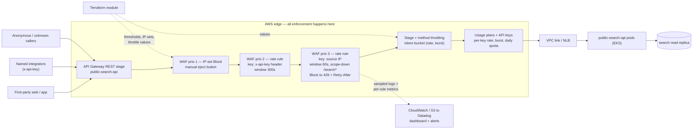

# RFC — Rate limiting for `public-search-api`

**Status:** draft — for decision at the next architecture meeting
**Current working focus:** decision (analysis complete, awaiting ratification)
**Date:** 2026-09-08

## Related documents

None of these exist yet; they are the artifacts this RFC depends on and should be linked here before
the meeting:

- *(to link)* Traffic baseline for `public-search-api` — request volume per source IP, per path, per
  day/night curve. **This is the single biggest gap in the document** (see §Assumptions and §Launch
  strategy, Phase 0).
- *(to link)* Incident notes for the "abuse scares" already seen — what the traffic looked like, how
  many distinct sources, what it cost us.
- *(to link)* Current Terraform for the `public-search-api` edge (API Gateway stage, DNS, any
  CloudFront distribution).
- *(to link)* Search latency dashboard — the p95 the added control must not erode.

---

## Context

`public-search-api` is the internet-facing API that serves search to our web and mobile front ends.
It is *public* in the strong sense: anyone can call it from anywhere, and the majority of its traffic
carries no credential that identifies a caller. It was built to make search fast and cheap, and it
succeeded at that — but it shipped with **no request-rate controls of any kind**. There is no per-caller
limit, no aggregate ceiling, no way to say "this one source is taking too much", and no way to cut a
single abusive source off without changing code or DNS.

That absence has already produced real incidents — the "abuse scares": short periods where a small
number of sources drove far more traffic than any legitimate user could, and where the only thing that
saved us was that the traffic stopped on its own. Nothing about our architecture stopped it, and nothing
about our architecture would stop it next time. Three things make the exposure worse than it looks:

1. **Search is expensive per request.** Every uncached search request reaches application compute and
   then the database. A scraper is not just noise; it is load on the most contended component we have.
2. **The failure mode is shared.** Because there is no per-caller budget, one abusive source degrades
   the experience of *every* legitimate user simultaneously. We have no mechanism that makes abuse hurt
   only the abuser.
3. **The blast radius reaches beyond this service.** API Gateway's throttle quota is
   *per account, per Region, across all APIs* — 10,000 rps steady-state with a 5,000-request burst
   bucket by default ([API Gateway quotas][agw-quotas]). An unbounded flood at `public-search-api` can
   consume that shared budget and start returning `429` on **unrelated APIs in the same account**.
   Today nothing in our configuration prevents one service's abuse from becoming everyone's outage.

**The problem to solve:** we need a rate-limiting control for `public-search-api` — one that rejects
excess traffic from a single caller cheaply, keeps legitimate users unaffected while it does so, and
can be tightened or loosened without a deploy.

The choice was framed to the team as a binary: **AWS API Gateway's native throttling** versus **our own
middleware backed by Redis on the Kubernetes cluster**. Working through it showed the binary is
mis-specified — API Gateway's native throttling cannot express a per-caller limit for anonymous
traffic at all (§Alternatives, [Enforcement point] A), and there is a third managed option the framing
omitted. The analysis below therefore covers five enforcement points, not two.

### Out of scope

- **Authenticating the public API.** Requiring credentials from every caller would be the strongest
  long-term answer to abuse, and it is a product decision with its own document. This RFC takes the
  API's public, mostly-anonymous nature as a given.
- **Bot detection, CAPTCHA and device fingerprinting as a programme.** AWS WAF Bot Control and JA4
  fingerprinting appear here only as a named Phase 3 evaluation, not as part of the decision.
- **Volumetric (L3/L4) DDoS.** Shield Standard already covers the network layer. Whether we buy Shield
  Advanced is a separate, cost-driven decision.
- **Caching.** Caching repeated search queries would shrink the impact of *all* excess traffic, abusive
  or not, and it is complementary to everything below — but it is not a rate-limiting control and it
  deserves its own analysis. Referenced in Phase 3 only.
- **Commercial API tiers / monetization.** No paid plans exist today, so nothing here is designed to
  meter for billing.
- **Internal and private APIs.** This document covers the internet-facing surface only.

### Assumptions — please confirm or correct at the meeting

I had no access to the service or to traffic data while writing this, so the following are stated
assumptions, not findings. Each one is load-bearing; the ones marked **⚠** would change the analysis if
wrong.

| # | Assumption | If wrong |
| --- | --- | --- |
| **A1** | `public-search-api` is internet-facing and the large majority of its traffic is anonymous — no per-caller credential. | If every caller is already identified, per-key limits (API Gateway usage plans) become viable on their own and the decision gets much simpler. |
| **A2 ⚠** | The service sits behind an **API Gateway REST API** (v1) in `sa-east-1`, routing to pods on the EKS cluster. | **WAF cannot be attached to an API Gateway HTTP API (v2)** — the supported targets are CloudFront, API Gateway **REST** API, ALB, AppSync, Cognito, App Runner and a few others ([AWS WAF][waf-chapter]). If it is an HTTP API, the recommendation still holds but must be enforced at a CloudFront distribution or ALB placed in front, which adds a hop and a migration. |
| **A3 ⚠** | Peak aggregate legitimate traffic is in the low hundreds of requests per second with a pronounced day/night curve, and **no legitimate single client needs more than a few requests per second sustained**. | Every threshold in this document is a placeholder to be replaced from the Phase 0 baseline. If a legitimate client genuinely needs high sustained throughput (a partner batch job, for instance), it needs an API key and its own budget. |
| **A4 ⚠** | The abuse seen so far was **concentrated** — high volume from a small number of sources (scraping/enumeration), not spread thinly across thousands of addresses. | A distributed low-and-slow scraper defeats per-IP limiting. This is the primary flip condition for the decision (§The decision). |
| **A5** | We have made no public commitment about rate limits, so we are free to define and publish the first one. | If integrator contracts promise unlimited access, the rollout needs a notice period. |
| **A6** | There is no Redis available for this purpose today; the Redis option means standing up new infrastructure (ElastiCache or in-cluster) and owning it. | If a suitable HA Redis already exists and is already on-call'd, option B's cost drops materially — though its architectural position does not improve. |
| **A7** | No regulatory or contractual requirement to prove exact per-caller counts. | Exact accounting would rule out AWS WAF, whose limiting is explicitly approximate ([rate-based rule caveats][waf-caveats]). |

---

## Requirements

Only requirements that actually shape the structure are listed. Anything that would not change the
design if dropped is deliberately absent.

### Functional

- **F1 — Per-caller enforcement.** Excess traffic from one caller must be rejected *without* degrading
  service to other callers. A control that only caps the aggregate is not sufficient: it converts abuse
  into a shared outage instead of preventing it.
- **F2 — Rejection before application compute and before the database.** A rejected request must not
  consume a pod's CPU, a database connection, or a query. This is the requirement the whole abuse case
  rests on — rate limiting that runs *inside* the thing being protected still pays for the attack.
- **F3 — Distinct budgets per traffic class.** At minimum three classes with independently tunable
  limits: (a) our own front ends, (b) named integrators who can be given a credential, (c) anonymous
  and unknown callers.
- **F4 — A standard, documented rejection contract.** `HTTP 429 Too Many Requests` with a `Retry-After`
  header and a stable body, published in the API documentation, so clients can back off correctly
  rather than retrying in a tight loop and making things worse.
- **F5 — An immediate manual eject button.** An operator must be able to block a named source
  (IP or CIDR) within minutes, through a path that does **not** depend on the rate-counting machinery
  and does not require an application deploy.
- **F6 — Observe-before-enforce.** Any limit must be deployable in a count-only mode first, so we can
  measure what it *would* have blocked against real traffic before it blocks anything. Guessing a
  threshold and enforcing it blind is how a rate limiter takes the site down.
- **F7 — Limits changeable without an application deploy.** Threshold changes are incident-time
  actions; they must be a config change measured in minutes.

### Non-functional

- **N1 — Latency.** Added latency on *allowed* requests must be ≤ 10 ms at p95, and must not measurably
  erode the search p95 budget. AWS does not publish a WAF inspection latency figure, so this is not
  assumed — it is **measured** in Phase 0, where a web ACL in Count mode incurs the full inspection
  cost with zero enforcement risk. That measurement is a gate, not a formality.
- **N2 — No new single point of failure.** The control must not introduce a component whose failure
  takes the API down, and its behaviour when its own state store is unavailable must be a *decided*
  behaviour (fail-open or fail-closed), not an emergent one.
- **N3 — Observability.** Per-rule allowed/blocked counts as metrics; the ability to list the sources
  currently being limited; sampled logs of blocked requests with enough of the request to tell a scraper
  from a broken client; a dashboard and an alert on block-rate anomalies in both directions (a spike
  means abuse or a bad threshold; a drop to zero means the control silently stopped working).
- **N4 — Cost proportional to the risk.** The control's run cost must be a small fraction of the cost of
  the abuse it prevents, and the cost model must be explicit — because the candidates differ in *kind*:
  one scales linearly with request volume, the other is fixed infrastructure plus permanent ownership
  (see §Cost).
- **N5 — Operability.** Configuration lives in Terraform, is peer-reviewed and auditable, and adds no
  bespoke always-on component to the on-call surface unless the analysis shows we genuinely need one.
- **N6 — Time to protection ≤ 2 weeks from approval.** The abuse is current, not hypothetical. An option
  that takes a quarter to deliver loses to a weaker option that protects us next sprint.
- **N7 — Non-forgeable enforcement key.** The primary limit must key on something the client cannot
  freely change. A limit keyed on a client-supplied header is a limit with an opt-out.

### Explicitly *not* requirements (deferred, and named so we notice if they change)

- **Exact, per-second precision.** We need to stop abuse, not to meter it. (A7.)
- **Cost-weighted limits** — charging an expensive endpoint more "tokens" than a cheap one. Desirable,
  not needed to stop the current abuse. This is a flip condition in §The decision.
- **Daily/monthly quotas for anonymous callers.** Only relevant for named integrators, where API
  Gateway usage plans already provide it.

---

## Design

The proposed design is **layered**, and the layering is not hedging — each layer answers a requirement
that the others structurally cannot. The alternatives that lost, including the two the team started
from, are analysed in the next section.

The core insight that drives the shape: **per-caller limiting and aggregate protection are different
controls with different failure modes, and we need both.** A per-caller limit (F1) stops one source from
taking more than its share, but it is approximate and has a detection lag. An aggregate ceiling stops
the service — and the shared account-level quota — from being overwhelmed during that lag, but it cannot
tell one caller from another. Choosing only one leaves a gap that the other closes.

### Components

| # | Component | Requirements served |
| --- | --- | --- |
| **C1** | **AWS WAF web ACL** attached to the API Gateway REST stage — the per-caller enforcement point. | F1, F2, F5, F6, F7, N7 |
| C1.1 | **Rule priority 1 — IP-set block.** A managed `IPSet` referenced by a Block rule. Adding a CIDR to the set blocks it immediately, with no rate counting involved. This is the eject button. | F5, F7 |
| C1.2 | **Rule priority 2 — rate-based rule keyed on the integrator credential.** Custom aggregation key = the `x-api-key` header. Because WAF requires *every* component of an aggregation key to be present for a request to be counted, this rule automatically applies only to credentialed traffic ([aggregation options][waf-agg]). Evaluation window 300 s, per-integrator limit well above the anonymous limit. | F3 |
| C1.3 | **Rule priority 3 — rate-based rule keyed on source IP**, with a scope-down statement narrowing it to the search paths and excluding requests that carried a valid credential. Evaluation window 60 s (the shortest WAF offers). Action Block with a custom response: `429` + `Retry-After`. | F1, F2, F3, F4, N7 |
| C1.4 | *(Phase 3, conditional)* JA4-fingerprint aggregation or Bot Control targeted rules, for abuse that rotates IPs. Deliberately not in the initial scope. | — |
| **C2** | **API Gateway stage-level throttling** (`rate` + `burst`) on the `public-search-api` stage, plus tighter **method-level** throttles on the most database-expensive endpoints. Token bucket; returns `429`. This is the aggregate backstop: it bounds what reaches the pods and the database during WAF's detection lag, and — critically — it stops this one service from draining the account-wide 10,000 rps quota and throttling unrelated APIs. | F2, N2 |
| **C3** | **API keys + usage plans** for named integrators — per-key rate, burst, and a **daily/weekly/monthly quota**, which is a capability WAF does not have at all. | F3 |
| **C4** | **Observability**: WAF logging to S3/CloudWatch and on to Datadog; per-rule `AllowedRequests`/`BlockedRequests` metrics; the WAF API for listing currently rate-limited IP addresses; a dashboard and alerts on block-rate anomaly, `429` rate per traffic class, and the pre/post latency delta. | N3, F6, N1 |
| **C5** | **The `429` contract, documented**: response shape published in the API docs, plus verified back-off behaviour in our own front ends (honour `Retry-After`; no immediate retry). A rate limiter that triggers a client-side retry storm has made the problem worse. | F4 |
| **C6** | **Terraform module** owning the web ACL, rules, thresholds, IP sets and throttle values, with the thresholds as variables so an incident-time change is a small reviewed PR. | N5, F7 |

Every requirement maps to at least one component. Two mappings deserve calling out because they are the
reason this design has the shape it does:

- **F2** is served by C1 and C2 *because both sit in front of the pods*. This is precisely what an
  in-cluster Redis middleware cannot do: it runs inside the blast radius.
- **N7** is served by keying the primary limit (C1.3) on the source IP observed by the AWS edge, not on
  a client-supplied header. We deliberately do **not** key the anonymous limit on `X-Forwarded-For`:
  AWS warns that forwarded-IP headers are handled inconsistently by proxies and can be modified to
  bypass inspection ([aggregation options][waf-agg]).

### Static diagram — components and how they fit together



*If the diagram does not render:* the request path is
`client → API Gateway REST stage → WAF web ACL (rule 1 IP-set block → rule 2 per-credential rate rule →
rule 3 per-IP rate rule) → stage/method token-bucket throttle → usage-plan key check → VPC link/NLB →
EKS pods → search read replica`. WAF emits metrics and sampled logs sideways into CloudWatch/S3 and on
to Datadog. Terraform owns the thresholds, the IP sets and the throttle values. **Nothing in the
enforcement path runs inside the cluster.**

### Dynamic diagram — an abusive burst, end to end

```mermaid
sequenceDiagram
  autonumber
  participant S as Scraper (one IP)
  participant U as Legitimate user
  participant W as WAF web ACL
  participant G as API Gateway stage
  participant P as pods (EKS)
  participant D as read replica
  participant O as On-call

  U->>W: GET /search?term=...
  W->>W: not in block set; IP count under limit
  W->>G: forward
  G->>P: within stage budget
  P->>D: query
  D-->>P: rows
  P-->>U: 200 OK

  S->>W: sustained burst from a single IP
  W->>W: aggregate count for that IP key rises
  Note over W: Detection lag: AWS states traffic can exceed the<br/>rate for up to several minutes before limiting starts,<br/>usually under 30 seconds
  W->>G: excess still forwarded during the lag
  G->>G: token bucket drains
  G-->>S: 429 once the stage budget is exhausted (aggregate backstop)
  W-->>S: 429 + Retry-After once the rate rule engages
  W-->>O: BlockedRequests rises, alert fires
  O->>W: add IP/CIDR to the block IP set (PR or CLI)
  W-->>S: blocked at priority 1 — no counting, no lag
  U->>W: GET /search?term=...
  W->>P: unaffected (different aggregation instance)
  P-->>U: 200 OK
```

The sequence makes the two layers' division of labour concrete. Steps 8–13 are the honest picture of
WAF's weakness: for up to a few minutes the burst is *not* being limited per-caller, and it is the stage
throttle (step 12) that keeps the pods and the database from absorbing it. Steps 15–16 are the eject
button, which exists precisely because steps 8–13 exist.

---

## Alternatives analysis (Tradeoff)

Grouped by the dimension being decided. Options **A** and **B** are the two the team started from;
**C**, **D** and **E** were added because the original framing left the strongest managed option and the
strongest version of the Redis option off the table.

### Dimension 1 — enforcement point

| Alternative | Pros | Cons | Risk (description) | Impact | Probability | Mitigation | Contingency |
| --- | --- | --- | --- | --- | --- | --- | --- |
| **A. API Gateway native throttling only** (stage + method + usage plans) | Already available, zero new infrastructure; no added per-request cost; config in Terraform; token bucket protects the backend and the account-wide quota well; usage plans add real per-key quotas | **Structurally cannot do per-caller limiting for anonymous traffic.** AWS documents exactly four throttle scopes: AWS Regional limits, per-account, per-API/per-stage/per-method, and per-client *"applied to clients that use API keys associated with your usage plan as client identifier"* ([API Gateway throttling][agw-throttle]). There is no per-IP option. So for our mostly-anonymous traffic (A1) the only available limit is aggregate — which turns one abuser's burst into a `429` for every user. Also: no eject button, no count-only mode, and throttles are applied *"on a best-effort basis"*, i.e. targets rather than ceilings | Adopted alone, it converts abuse into a self-inflicted outage: legitimate users get `429` while the abuser keeps its share | High | High | None available within the option — this is the option's definition, not a bug to be mitigated | Add a per-caller layer (C, D or E). Which is the recommendation |
| | | | Everyone reads "throttling is enabled" as "we are protected", and the real gap stays invisible until the next incident | High | Medium | State the limitation in writing (this row) and in the runbook | Post-incident review reopens this RFC |
| **B. Own middleware + Redis on the K8s cluster** *(as framed)* | Total control of algorithm, key and response; exact per-second semantics; can key on anything the app can compute, including a cost-weighted token price per endpoint; no per-request vendor charge; the team knows the language and the cluster | **Runs inside the thing it protects (F2 fails).** A rejected request has already crossed the internet, the edge, the load balancer and landed on a pod; it consumed a connection, a worker and a Redis round trip. We pay for the attack and merely spare the database. Adds a stateful dependency in the hot path of every request; adds a permanent on-call surface (N5); slowest of the viable options to deliver (N6); nothing stops a flood large enough to saturate ingress | Redis becomes a hot-path dependency: an outage or latency spike degrades or breaks all search traffic | High | Medium | HA (replica + automatic failover), tight timeouts (single-digit ms), local in-process fallback counter, explicit **fail-open** decision | Feature-flag the middleware to bypass; fall back to the API Gateway aggregate throttle |
| | | | Build-and-own cost: correct distributed limiting is subtly hard (clock skew, atomicity, hot keys, sliding-window memory) and it becomes ours forever | Medium | High | Use a proven algorithm and library rather than hand-rolling; cap scope to per-IP + per-key | Migrate to E (Envoy + the upstream rate-limit service) rather than keep bespoke code |
| | | | Under a real flood, ingress and pods saturate before the limiter can matter — the control sits behind the bottleneck | High | Medium | Keep the API Gateway aggregate throttle in front regardless | Emergency edge block (WAF/CloudFront) — i.e. adopt C under pressure |
| | | | Hot-key contention: one abused key concentrates every increment on a single Redis shard | Medium | Medium | Local pre-filter before touching Redis; shard the key space | Drop to per-replica local counters for the duration of the incident |
| **C. AWS WAF rate-based rules at the API Gateway stage** *(recommended)* | Per-IP limiting is the **default** aggregation and needs no credential; custom aggregation keys cover header, cookie, query argument, query string, URI path, HTTP method, ASN, JA3/JA4 and combinations ([aggregation options][waf-agg]); enforcement sits in front of the pods (F2); native Count mode gives observe-before-enforce (F6); `IPSet` rules give the eject button (F5); custom responses give `429` + `Retry-After` (F4); scope-down statements let one rule target only the search paths; pure config, Terraform-able, deliverable in days (N6); nothing new to run (N5) | Explicitly **not precise**: AWS states it *"is not intended for precise request-rate limiting"* and *"will apply rate limiting near the limit that you set"* ([caveats][waf-caveats]); the shortest evaluation window is 60 s and the lowest limit setting is 10 ([high-level settings][waf-settings]), so a sub-second burst inside a 60 s budget passes; **detection lag** — traffic *"can be coming in at too high a rate for up to several minutes before AWS WAF detects and rate limits them"*, usually under 30 s; changing any rate setting **resets the counts and can pause limiting for up to a minute**; cost scales with request volume; cannot attach to an API Gateway HTTP API (A2) | Burst inside the window: a scraper sends its whole 60 s budget in two seconds, repeatedly, and stays under the rule | Medium | High | Use the shortest window (60 s) and set the limit from the baseline rather than intuition; keep the API Gateway stage/method throttle as the sub-second smoother (C2) | Tighten the limit; add a second rate rule keyed on IP + URI path for the expensive endpoints |
| | | | Detection lag lets a burst through for up to a few minutes | Medium | High | The aggregate stage throttle bounds what the lag can deliver; alert on `BlockedRequests` so a human can reach the eject button | IP-set block (C1.1) — effective immediately at priority 1, with no counting involved |
| | | | **Per-IP is the wrong key for two populations at once:** it punishes many users behind one CGNAT/corporate egress, and it is evaded by rotating residential proxies | Medium | Medium | Choose thresholds from the observed per-IP distribution, not from per-user intuition; run Count mode for a week and inspect what would have been blocked; allow-list known corporate egress ranges | Move the key to IP + JA4, or adopt Bot Control targeted rules (C1.4) |
| | | | Approximate counting makes a blocked customer's complaint hard to answer precisely ("why was I blocked?") | Low | Medium | Sampled WAF logs plus the rate-limited-IP listing API give evidence even without exact counts | Documented appeal path: allow-list the caller, issue them an API key |
| **D. Ingress-level limiting with per-replica local state** (NGINX Ingress `limit-req`, or Envoy/Istio local rate limit) | No shared state, so no new stateful dependency and no hot-path round trip; very low latency; already available if the ingress controller is in place; cheap | State is **per replica**: the effective limit is `limit × replicas` and it moves every time the deployment scales — a limit that changes under you is not a limit you can publish (F4); still inside the cluster, so F2 fails as in B; blunt configuration surface | Effective limit drifts with replica count and HPA activity, silently loosening protection exactly when traffic is highest | Medium | High | Pin the ingress replica count and derive the per-replica limit from it | Move the limit to a global service (E) or to the edge (C) |
| | | | Under-protects at scale-out and over-blocks at scale-in | Medium | Medium | Alert on `429` rate versus replica count | As above |
| **E. Envoy/Istio + the upstream global rate-limit service, backed by Redis** *(the steelman of B)* | Everything B wanted, without writing the limiter: proven implementation, declarative descriptors, exact shared counters, cost-weighted limits, per-route and per-key limits, no application code in the path; the strongest option if we ever genuinely need precise per-account fairness | Still inside the cluster (F2 fails); adds **two** new components (the rate-limit service and Redis) to run and be paged for; needs a service mesh or an Envoy-based ingress we may not have; longest lead time of all options (N6); the Redis hot-path risks from B apply unchanged | Two new components enter the critical path and the on-call rotation | High | Medium | Fail-open on limiter unavailability; HA Redis; load-test the limiter at 2× peak before enforcing | Bypass at the mesh and fall back to the edge controls |
| | | | Requires a mesh/Envoy investment that is a far larger decision than rate limiting | Medium | High | Do not adopt a mesh *for* rate limiting; revisit only if a mesh arrives for other reasons | Stay on C |
| **F. CloudFront Functions / Lambda@Edge with a KeyValueStore** | Truly at the edge, cheapest place to reject a request, and it would pair naturally with caching | We would be hand-rolling distributed counting on top of an eventually-consistent KV store inside tight function limits — the hardest version of B, in the least forgiving runtime, to reimplement what WAF rate-based rules already do | Bespoke counting logic at the edge is wrong in ways that are very hard to observe | High | Medium | — (rejected before mitigation is worth designing) | — |

### Dimension 2 — the key we limit on

| Alternative | Pros | Cons | Risk (description) | Impact | Probability | Mitigation | Contingency |
| --- | --- | --- | --- | --- | --- | --- | --- |
| **Source IP as seen by the AWS edge** *(recommended for anonymous traffic)* | Available on every request with no cooperation from the client; not forgeable by the caller (N7); WAF's default aggregation; correctly attributes the concentrated abuse we have actually seen (A4) | Over-inclusive behind NAT/CGNAT and IPv6 privacy addressing; under-inclusive against proxy rotation; if a proxy or LB sits in front, it is the proxy's address that is seen, not the client's | Legitimate users behind one shared egress get blocked together | Medium | Medium | Thresholds from the observed distribution; allow-list known corporate ranges; alert on `429` per traffic class | Raise the threshold, allow-list, issue an API key |
| **Client-supplied `X-Forwarded-For`** | Recovers the real client address behind a proxy | AWS explicitly warns that forwarded-IP headers *"can be modified to bypass inspection"* ([aggregation options][waf-agg]) — a header-keyed limit has a built-in opt-out, violating N7 | Trivial bypass by sending a random header value per request | High | High | Only usable if a trusted proxy we control overwrites the header and we key on its position | Do not use as the primary key |
| **API key / credential header** *(recommended for named integrators)* | Stable, meaningful identity; survives IP changes; enables real quotas via usage plans; the only honest basis for per-customer fairness | Only exists for callers we have credentialed — which is not the anonymous majority (A1) | Keys leak and get shared | Medium | Medium | Rotate; per-key limits bound the damage; monitor the source-IP spread per key | Revoke the key |
| **JA3/JA4 TLS fingerprint** | Survives IP rotation; groups a scraper's clients even across addresses; available as a WAF aggregation key | Coarse — a fingerprint is shared by everyone on the same client stack version, so a popular browser fingerprint is not a caller; needs evaluation against real traffic | Blocking a fingerprint blocks a whole class of legitimate clients | High | Medium | Count mode first, always; never use as the sole key | Combine with IP; revert to IP-only |
| **Session / user token** | Closest available thing to "a user" | Absent for anonymous traffic, and freely re-obtainable — so it is not a scarce resource | Attacker mints a new session per request | High | High | Only meaningful once sessions are costly to obtain | Not applicable to a public API |

### Dimension 3 — algorithm, state and failure behaviour

| Alternative | Pros | Cons | Risk (description) | Impact | Probability | Mitigation | Contingency |
| --- | --- | --- | --- | --- | --- | --- | --- |
| **WAF's decaying rate estimate over a 60–600 s window** *(recommended)* | Managed, no state to run, weights recent requests more heavily, effective against sustained abuse | Approximate by design; window ≥ 60 s; counts reset when settings change | Documented above under [Enforcement point] C | — | — | — | — |
| **Token bucket at API Gateway** *(recommended as the aggregate backstop)* | Smooths sub-second bursts, which is exactly WAF's blind spot; already built in; protects the account-wide quota | Aggregate only; best-effort, not a hard ceiling | Legitimate traffic hits the aggregate ceiling during a genuine peak | Medium | Medium | Set from measured peak with headroom (~2×) and validate with a load test; alert on stage-level `429` | Raise the stage limit — the per-caller rule is what should be biting instead |
| **Centralized sliding window / token bucket in Redis** | Exact, per-second, cost-weightable, key-agnostic | Needs the infrastructure and the ownership of B/E | See B | — | — | — | — |
| **Fail-open when limiter state is unavailable** *(recommended)* | Availability preserved; a limiter outage does not become a search outage | A limiter outage is an open window for abuse | Abuse coincides with a limiter outage | Medium | Low | The aggregate stage throttle is a *separate* mechanism with no shared state, so it still holds | Manual IP-set block; temporarily lower the stage throttle |
| **Fail-closed** | Never an open window | A limiter outage becomes a full outage of a public API — trading a probable small loss for an improbable total one | Self-inflicted outage from a dependency failure | High | Medium | — | Rejected |

### How each alternative scores against the requirements

`✔` meets it, `~` partially, `✘` fails.

| Requirement | A. API GW only | B. Redis middleware | **C. WAF rate rules** | D. Ingress local | E. Envoy + global RL |
| --- | --- | --- | --- | --- | --- |
| F1 per-caller limit for anonymous traffic | ✘ (API keys only) | ✔ | ✔ | ✔ | ✔ |
| F2 reject before compute and DB | ✔ | ✘ | ✔ | ✘ | ✘ |
| F3 distinct budgets per traffic class | ~ (keyed classes only) | ✔ | ✔ | ~ | ✔ |
| F4 documented `429` + `Retry-After` | ~ (body not customizable) | ✔ | ✔ | ✔ | ✔ |
| F5 immediate manual eject button | ✘ | ~ (needs a deploy or a flag) | ✔ (`IPSet`) | ~ | ~ |
| F6 count-only mode before enforcing | ✘ | ~ (build it yourself) | ✔ (native) | ✘ | ~ |
| F7 change limits without a deploy | ✔ | ~ | ✔ | ~ | ✔ |
| N1 ≤ 10 ms added p95 | ✔ | ~ (Redis round trip + tail) | ~ (**to be measured**) | ✔ | ~ |
| N2 no new single point of failure | ✔ | ✘ | ✔ | ✔ | ✘ |
| N3 observability | ~ | ~ (build it) | ✔ | ~ | ✔ |
| N4 cost proportional | ✔ (no extra cost) | ~ (fixed + ownership) | ~ (scales with volume) | ✔ | ✘ |
| N5 operability, nothing new on-call | ✔ | ✘ | ✔ | ~ | ✘ |
| N6 protection within 2 weeks | ✔ | ✘ | ✔ | ~ | ✘ |
| N7 non-forgeable key | ✔ | ✔ | ✔ | ✔ | ✔ |

Read the columns that matter side by side. **A fails the requirement that motivated the whole exercise**
(F1) and cannot be fixed from within itself — but it is the only option that is *already there*, and it
is genuinely good at bounding aggregate load. **C meets every functional requirement**, at the price of
an imprecision we have explicitly declared acceptable (A7, and the deferred non-requirements).
**B and E are the only options that give exact per-caller semantics, and both fail F2, N2, N5 and N6** —
they buy precision we do not need with position, availability and time we cannot spare.

### Cost

The options differ in kind, which is why N4 asks for the model rather than a single number.

**Option C (WAF)** — published pricing: **$5.00 per web ACL per month, $1.00 per rule per month,
$0.60 per million requests** ([AWS WAF pricing][waf-pricing]). With one web ACL and five rules the fixed
part is $10/month, and the variable part is linear in inspected requests:

| Inspected requests / month | Request charge | + fixed | **Total / month** |
| --- | --- | --- | --- |
| 10 M | $6 | $10 | **$16** |
| 100 M | $60 | $10 | **$70** |
| 400 M | $240 | $10 | **$250** |

Web capacity units are not a cost factor at this rule count: a rate-based rule costs 2 WCU plus 30 WCU
per custom aggregation key, and the default allocation is 1,500 WCU per web ACL before the
$0.20-per-million overage applies — our rule set lands in the low tens.

**Option B/E (Redis)** — cost is essentially fixed: an HA ElastiCache pair (price to confirm) plus the
part that dominates and never ends, engineering and on-call ownership. On pure infrastructure the
crossover is `V ≈ F / 0.60` million requests per month, where `F` is the Redis option's fixed monthly
infrastructure cost in USD — at `F = $100`, WAF becomes the more expensive line item above roughly
**167 M requests/month**. That comparison is real and worth revisiting annually, but it is not the
deciding factor at our assumed volume (A3), and it ignores both the build cost (~8–13 days for B against
~2 days for C's Terraform module) and the permanent ownership cost.

---

## The decision

**Recommendation: adopt Option C as the per-caller control and Option A as the aggregate backstop —
that is, AWS WAF rate-based rules on the API Gateway REST stage, plus API Gateway stage and method
throttling, plus API keys and usage plans for named integrators. Do not build the Redis middleware.**

The reasoning, in the order it actually decided the question:

1. **The original binary was mis-specified.** API Gateway's native throttling has no per-IP scope; its
   per-client scope requires API keys ([API Gateway throttling][agw-throttle]). For a mostly-anonymous
   public API that means "native throttling" is an *aggregate* control. Adopting it alone would have
   left us believing we were protected while one abuser could still `429` the entire user base. That
   finding, on its own, reframes the meeting.
2. **F2 decides between the remaining candidates.** Rate limiting whose purpose is to make abuse cheap
   for us must sit *in front of* the expensive part. Every in-cluster option — the proposed Redis
   middleware, the ingress-local variant, and the Envoy global limiter — rejects requests only after
   they have consumed the network path, the load balancer, a pod and a connection. They protect the
   database, which is worth something, but they do not protect the system.
3. **The precision the Redis option buys is precision we do not need.** We are stopping scraping and
   enumeration, not metering a billed product (A7). WAF's approximation and its sub-minute detection lag
   are acceptable *given* the aggregate backstop that covers exactly that gap.
4. **Time and ownership break the tie decisively.** C is a Terraform module and a threshold, enforceable
   in days (N6), with nothing new on-call (N5). B is a new stateful dependency in the hot path of a
   public API, ours to run forever, delivering in a month at best — while the abuse is happening now.
5. **The layers are complementary, not redundant.** WAF gives per-caller fairness and the eject button;
   the stage throttle gives sub-second smoothing and protects the shared account-level quota; usage
   plans give integrator quotas that WAF cannot express. Each closes a gap the others structurally
   cannot.

### The strongest objection to this recommendation

Not a strawman — this is the argument I would make against my own proposal, and it deserves airtime at
the meeting:

> AWS's own documentation says rate-based rules are *"not intended for precise request-rate limiting"*
> and that traffic can run over the limit *"for up to several minutes"* before limiting engages. The
> floor on the evaluation window is 60 seconds. Per-IP is simultaneously too broad (one CGNAT egress is
> thousands of real users) and too narrow (a cheap residential proxy pool defeats it entirely). We are
> choosing a control that is approximate, laggy, and keyed on the one identifier an attacker can most
> cheaply change. A Redis limiter is exact, keyed on whatever we choose, per-second, and lets us price
> expensive endpoints higher than cheap ones — a capability WAF simply does not have.

Everything in that objection is true. It does not carry the decision, for two reasons: the aggregate
backstop covers both the lag and the sub-window burst, and *no* option in this document survives proxy
rotation — the answer to a distributed low-and-slow scraper is identity and bot detection, not a bigger
limiter. But if the Phase 0 baseline shows the abuse is already distributed, the objection wins and the
decision changes. Which is exactly why Phase 0 comes before Phase 1.

### Conditions that would flip this decision

Written down now so that reversing is a planned move rather than a rewrite. Any one of these triggers a
revisit, with **Option E** (Envoy + the upstream global rate-limit service) as the target, not a
hand-rolled middleware:

1. **The Phase 0 baseline shows distributed abuse** — the offending volume is spread across many sources,
   each individually below any threshold we could set without blocking real users. (Then the answer is
   bot detection and identity, and per-IP limiting of any flavour is the wrong tool.)
2. **We need per-account fairness tied to billing** — paid tiers, contractual quotas, or per-customer
   accounting we must be able to defend to the customer number by number.
3. **We need cost-weighted limits** — endpoints whose database cost differs by an order of magnitude,
   where one "request" is the wrong unit and we need to charge tokens by cost.
4. **Measured collateral damage is too high** — `429`s on legitimate shared-egress users exceed the
   threshold we set in Phase 1, and no combination of allow-list and threshold fixes it.
5. **A service mesh arrives for other reasons**, making E's marginal cost small.

### Decision style

**Autocratic with consultation, ratified democratically.** The recommendation is the service owner's and
the service owner owns the outcome. Because the two options were already framed as a team choice, it
goes to the architecture meeting for ratification: if the room is split, we vote, and the owner breaks a
tie. Two things are wanted from the meeting rather than agreement-in-principle: **confirmation or
correction of assumptions A2, A3 and A4** (the ones that would change the analysis), and a decision on
the Phase 1 threshold-setting rule, which is where this control will succeed or fail in practice.

---

## Launch strategy

Phased, with an exit criterion per phase, and no phase that can become permanent by accident.

**Phase 0 — observe (2–3 days to deploy, then 7 days of data).**
Terraform the web ACL with every rate rule set to **Count**, logging on, dashboard up. Nothing is
blocked. This phase produces the three things we do not have: the per-IP request distribution
(p50/p99/p99.9), a classified list of top talkers, and — because Count mode pays the full inspection
cost — the **measured latency delta** that N1 asks for.
*Exit criteria:* 7 days of baseline; thresholds chosen from data; measured added p95 ≤ 10 ms; the
Count-mode rule would have blocked nothing we recognize as legitimate.

**Phase 1 — enforce the essentials (week 2).**
Flip the anonymous per-IP rule to **Block** with a `429` + `Retry-After` custom response, at a threshold
derived from the baseline (proposal: a healthy multiple of observed legitimate p99.9 per-IP volume over
a 60 s window — the multiple to be agreed at the meeting, not guessed here). Ship the `IPSet` eject
button and its runbook. Set the stage throttle to roughly 2× measured aggregate peak, and add tighter
method-level throttles on the expensive endpoints. Alerts live.
*Exit criteria:* eject button rehearsed in a game day; `429` rate on legitimate traffic within the
agreed threshold; a load test at 2× peak confirms the stage throttle behaves as intended.

**Phase 2 — identify the callers who can be identified (weeks 3–4).**
API keys and usage plans for the named integrators, with per-key rate, burst and daily quota. Publish
the rate-limit contract in the API documentation. Verify our own front ends honour `Retry-After` and do
not retry-storm.
*Exit criteria:* every known integrator on a key with its own budget; the anonymous rule's scope-down
excludes credentialed traffic; the published contract matches what the edge actually returns.

**Phase 3 — conditional, not scheduled.**
Evaluate moving the web ACL to a CloudFront distribution (rejects further out, costs less per rejected
request, and opens the door to caching repeated queries); evaluate JA4 aggregation or Bot Control
against real abuse patterns; revisit Option E **only** if a flip condition above has actually triggered.

## Tasks and roadmap

| Task | Description | Estimate |
| --- | --- | --- |
| Terraform module — web ACL in Count mode | Web ACL, 3 rate rules, IP set, logging destination, association to the REST stage | 2 d |
| Observability | Per-rule metric dashboard, `429`-by-class panel, latency-delta panel, block-rate anomaly alerts | 1 d |
| Baseline analysis | Per-IP distribution, top-talker classification, threshold proposal from the data (elapsed: 7 days of collection) | 2 d |
| Rejection contract | `429` custom response + `Retry-After`, stable body, API docs page | 1 d |
| Enforcement + runbook | Flip to Block; eject-button procedure; game-day rehearsal | 1 d |
| Stage and method throttles | Values from measured peak; k6 load test at 2× peak to validate | 2 d |
| API keys and usage plans | Keys, per-key limits and daily quotas for named integrators; scope-down exclusion in the anonymous rule | 3 d |
| Client back-off verification | Front ends and any SDK honour `Retry-After`; no retry storm under sustained `429` | 2 d |
| **Total** | ~2 sprints elapsed, including the 7-day baseline wait | **14 d** |

For comparison, Option B's equivalent scope — limiter middleware, HA Redis provisioning, algorithm
implementation and load testing, a count-only mode, an admin path for thresholds, runbooks, on-call
onboarding — is an estimated **8–13 days of build** *plus* permanent ownership, and it still would not
satisfy F2.

## Version history

| Version | Date | Author | Description |
| --- | --- | --- | --- |
| 1.0 | 2026-09-08 | Lucas Marques | Document created for the next architecture meeting. AWS behaviour, quotas and pricing verified against the AWS documentation linked below; all traffic figures and thresholds are assumptions pending the Phase 0 baseline. |

---

### Sources

Claims about AWS behaviour, quotas and pricing in this document were checked against the AWS
documentation on 2026-09-08:

- [Throttle requests to your REST APIs — API Gateway][agw-throttle]
- [Amazon API Gateway quotas][agw-quotas]
- [AWS WAF — protected resource types][waf-chapter]
- [Rate-based rule high-level settings][waf-settings]
- [Rate-based rule caveats][waf-caveats]
- [Aggregating rate-based rules][waf-agg]
- [AWS WAF pricing][waf-pricing]

Note on the account-level quota quoted in Context: the 10,000 rps / 5,000-burst default applies to most
Regions, but a documented list of Regions (including Africa (Cape Town), Europe (Milan), several Asia
Pacific Regions, Israel (Tel Aviv), Canada West and Mexico (Central)) defaults to 2,500 rps / 1,250
burst instead. `sa-east-1` is not on that list. Confirm the account's *current* quota in Service Quotas
before setting the stage throttle, since the account default may already have been raised or consumed.

[agw-throttle]: https://docs.aws.amazon.com/apigateway/latest/developerguide/api-gateway-request-throttling.html
[agw-quotas]: https://docs.aws.amazon.com/apigateway/latest/developerguide/limits.html
[waf-chapter]: https://docs.aws.amazon.com/waf/latest/developerguide/waf-chapter.html
[waf-settings]: https://docs.aws.amazon.com/waf/latest/developerguide/waf-rule-statement-type-rate-based-high-level-settings.html
[waf-caveats]: https://docs.aws.amazon.com/waf/latest/developerguide/waf-rule-statement-type-rate-based-caveats.html
[waf-agg]: https://docs.aws.amazon.com/waf/latest/developerguide/waf-rule-statement-type-rate-based-aggregation-options.html
[waf-pricing]: https://aws.amazon.com/waf/pricing/
