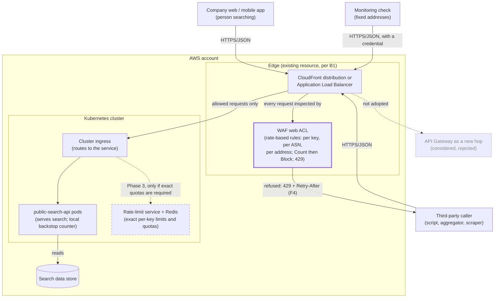
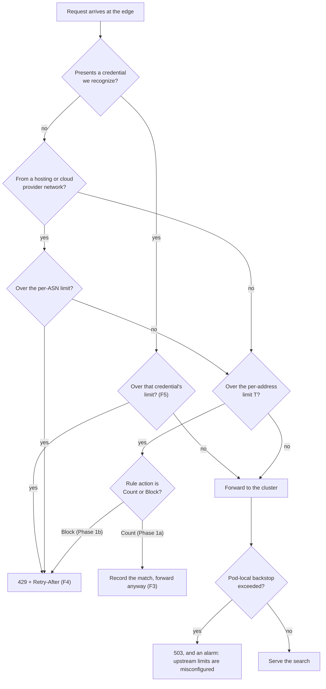

# RFC: Stopping one caller from taking the public search API away from everyone else

**Status:** proposed (three blocking questions open; see *Assumptions and open questions*)
**Decider:** owner of `public-search-api` · **Reviewers:** platform/infrastructure (who owns the load
balancer and the cluster ingress), security, the person who owns third-party API agreements
**Current working focus:** decision
**Date:** 2026-09-08

> **Read this first.** Every internal fact in the Context below is a *claim* carried over from the
> request, not a measurement. Nobody has yet read the access logs, the request-rate graphs or the cost
> report for this endpoint, and this document was written without access to them. That is not a
> stylistic caveat: it is the single biggest weakness in the decision, and Phase 0 of the launch plan
> exists to remove it before anything is enforced. The external facts (what AWS WAF and API Gateway
> actually do, and what they cost) *were* verified against the vendor documentation on 2026-09-08 and
> are cited inline.

## Reversibility

This is two decisions wearing one coat, and they have opposite reversibility. Separating them is the
main thing this document does.

**One-way door — the client-visible contract.** Which caller identity gets limited, what a refused
caller receives, and whether presenting a credential ever becomes mandatory. Once external clients
depend on being anonymous, or on a limit we published, tightening either breaks them, and un-breaking
them means breaking them again. A mandatory API key is the extreme case: every current caller stops
working the day it turns on.

**Two-way door — where the check runs and what holds the counters.** Edge, gateway, cluster ingress or
in-process; Redis, a managed counter, or no shared state at all. To a well-behaved client these are
indistinguishable, provided the contract above is settled first. Moving the check later is a
configuration and deployment change, not a migration.

The question as it was asked — *AWS API Gateway throttling or our own Redis middleware?* — sits
entirely inside the two-way door. The expensive, hard-to-undo half is the half nobody asked about, so
this document spends its requirements on that half and treats the enforcement point as the cheaper
choice it is.

## Context

`public-search-api` is a publicly reachable HTTP API. Anyone who knows the URL can call it, as often
as they like, with no credential, and nothing in the request path counts how often they do it or
refuses them when they do it too much. On at least two occasions someone has hammered it hard enough
that the team noticed and worried; each time the episode was handled by hand and by looking, because
those are the only tools that exist.

Everything in that paragraph comes from the request itself. Each claim, and what would confirm it:

| Claim | Label | What would confirm it, and roughly what that costs |
| --- | --- | --- |
| The endpoint is publicly reachable with no rate limit, quota or per-caller control | *assumed* (source: the requester) | Read the load balancer / ingress configuration and the service's middleware chain; under an hour |
| There have been "a few abuse scares" | *assumed* (source: the requester) | The incident channel or incident log for the dates, plus access logs for those windows: what the rate was, how long it lasted, whether users were affected; half a day |
| The service runs on the company's Kubernetes cluster | *assumed* (implied by "our Kubernetes cluster") | `kubectl` and the deployment manifests; minutes |
| The cloud account is AWS | *assumed* (implied by "AWS API Gateway") | The console; minutes |
| Redis is a store the team already runs and knows | *assumed* (implied by "our own middleware with Redis") | Ask the team; minutes |

And the numbers this decision needs, none of which exists yet. All of them come from one week of
access logs plus the request-rate and cost dashboards, which is why Phase 0 is two days of reading
rather than two weeks of building:

- requests per second at the daily peak and at the overnight trough;
- requests per source IP over a 5-minute window: median, 99th percentile, maximum;
- the share of all traffic coming from the ten largest source IPs, and from the ten largest ASNs
  (autonomous system numbers — the network operator a range of IP addresses belongs to);
- the share of traffic that carries a recognizable first-party marker (the company's own web or mobile
  client in the user-agent, or its own `Origin`) against the share that carries nothing identifying;
- whether any named third-party integration calls the endpoint today, and from what addresses;
- what the abuse episodes actually cost: response times and error rates during them, extra compute and
  database load, extra data-transfer on the bill;
- **what AWS resource sits directly in front of the service** — a CloudFront distribution, an
  Application Load Balancer, an existing API Gateway, or a Network Load Balancer.

That last one is not a detail. AWS WAF (the AWS web application firewall) can be attached to a
CloudFront distribution, an Application Load Balancer, an API Gateway REST API, an AppSync GraphQL
API, a Cognito user pool, an App Runner service, a Bedrock AgentCore Gateway, a Verified Access
instance or an Amplify app — and to nothing else, a Network Load Balancer included (AWS WAF developer
guide, *Associating or disassociating protection with an AWS resource*, read 2026-09-08). Whether the
recommended first step is a two-day configuration change or a two-week piece of work turns on the
answer.

### Current usage

Filled out honestly: the roles are known, the volumes are not.

| Role (what they do with the system) | What they do today | Through what | How often or how much (source) |
| --- | --- | --- | --- |
| Person searching from the company's own web or mobile app | Types a term, reads the results | The app, which calls `public-search-api` | Not measured; the request-rate graph for the endpoint, split by client marker, would answer it (*assumed*) |
| Third-party developer calling the endpoint programmatically | Calls it directly, from their own servers or scripts, with no credential and no agreement in place | Direct HTTP | Not measured, and their existence is unconfirmed; access logs grouped by IP and user-agent would answer it (*assumed*; blocking question B3) |
| Unattributed high-volume caller (scraper, aggregator, a competitor's crawler) | Enumerates queries at whatever rate it likes | Direct HTTP | Not measured; the ten largest source IPs by volume over a week would answer it (*assumed*) |
| Monitoring or synthetic check | Calls the endpoint on a schedule from a small fixed set of addresses | Whatever the monitoring tool uses | Not measured; the monitoring configuration would answer it (*assumed*) |
| On-call engineer during an abuse episode | Notices high load, guesses at the source, scales up or blocks an address by hand at the load balancer | Dashboards, the AWS console | At least twice (the "abuse scares"; *assumed*, source: the requester) |
| Budget owner | Pays for the compute and data transfer the traffic caused, without knowing which share was wanted | The monthly cost report | Not measured; the cost report filtered to this endpoint's resources would answer it (*assumed*) |

**The problem.** Two gaps, and they have to be closed in this order.

*Nobody can name a caller.* There is no per-caller view of this traffic, so no threshold can be chosen
and no refusal can be justified. Any limit set today would be a guess, and a guessed limit on a public
search endpoint refuses real users. This is the first problem, and it is not the one the question was
about.

*Nobody can refuse a caller.* The controls that exist are whole-service controls: scale the deployment
up and pay, or block an address by hand and hope it is the right one. Both trade one caller's abuse
against every other caller's service, and both need a human awake. So an abuse episode's outcome
depends on who is on call and how fast they notice.

### Goals

| Goal | Who benefits | How we will know |
| --- | --- | --- |
| A person searching in the app gets their answer while someone else is hammering the same endpoint | People searching; the product that depends on search working | No search-facing degradation attributable to a single caller in the quarter after enforcement starts (incident log) |
| Whoever is on call can stop one abusive caller without taking the endpoint away from everyone else | On-call engineers; everyone else using the endpoint | Timed abuse drill, and the next real episode: how long from noticing to contained, and whether any legitimate caller was refused |
| Third-party callers learn what usage is acceptable from the API itself, before an incident | Third-party developers; the on-call engineer who would otherwise have to email them | Published limits, and the share of refused callers that back off rather than retry immediately (refusal logs) |
| The team stops paying for traffic it did not want | The budget owner | Monthly compute and data-transfer cost attributable to the endpoint, on the cost report |

### Stakeholders

| Role (what they do with the system) | What they need from this decision | Who speaks for them |
| --- | --- | --- |
| Person searching from the app | Never to be refused because of somebody else's behaviour | Product owner for search |
| Third-party developer calling the endpoint | A stated limit, a clear refusal they can back off from, and notice before it tightens | Owner of third-party API agreements |
| Monitoring or synthetic check | Not to be silently blocked and turn a green dashboard into a lie | On-call lead |
| On-call engineer | To see who the callers are and refuse one of them within minutes, without a deploy | On-call lead |
| Security / abuse responder | A durable control rather than a manual block per episode, and a record of what was refused and why | Security |
| Platform engineer owning the load balancer and ingress | No new component on the request path that they did not agree to operate | Platform lead |
| Budget owner | The control to cost visibly less than the abuse | Engineering manager |
| Unattributed high-volume caller (negative stakeholder) | Nothing; this decision deliberately takes capacity away from them above a threshold | Nobody — which is why the count-only window exists, to catch the ones who turn out to be legitimate |

### Constraints

| Constraint | Source (outside the organization, or a signed commitment) | What it excludes, and the clause |
| --- | --- | --- |
| An IP address is personal data, so counters and refusal logs keyed on IP have a stated purpose and a bounded retention | The data-protection law applicable to this API's users. Both the GDPR and Brazil's LGPD treat an IP address as personal data; which instrument governs here has not been confirmed (*assumed*) | Excludes no option. It caps how long IP-keyed logs may be kept and may require the stored key to be a salted hash rather than the address. Legal names the instrument and the retention period (question B4) |
| Nothing else identified | — | No option in this document is excluded by an external constraint. If a signed third-party agreement promises a rate, an uptime level or unauthenticated access, it becomes a constraint and it changes the limits — see blocking question B3 |

### Prior decisions

Each of these was made by someone inside the organization. None of them excludes an option; each one's
incumbent gets a row in the tradeoff table with an alternative beside it.

| Prior decision | Who made it, when | Incumbent it implies | Cost to reverse |
| --- | --- | --- | --- |
| The search API is public and unauthenticated | Unknown, inside the organization; predates this request (*assumed*) | Limiting by source address, because there is no other identity to limit by | High if a credential becomes mandatory: every current caller breaks until it ships one, and the company's own web and mobile clients need releases. Low if the credential is additive — anonymous callers keep a modest limit, credentialed callers get a larger one |
| Compute runs on the company's Kubernetes cluster | Platform, before this request (*assumed*) | Enforcement inside the cluster, at the ingress or in the application | Not reversed by this decision; the workload stays. It biases the choice toward the ingress, which is why the edge option is compared against it explicitly |
| Redis is the store the team reaches for when it needs shared counters | The team (*assumed*, from the framing of the request) | Redis-backed counters | Low: nothing has been built yet |
| AWS is the cloud | The organization, years ago (*assumed*) | AWS-native controls (WAF, API Gateway, CloudFront) | Out of proportion to this decision. Recorded here rather than given a row in the tradeoff table |

### Assumptions and open questions

**Blocking.** The status stays *proposed* while any of these is open, because each has an answer that
changes the recommendation.

| Question | Owner | Date | If yes | If no |
| --- | --- | --- | --- | --- |
| **B1.** Is the resource directly in front of `public-search-api` one that a WAF web ACL can attach to — a CloudFront distribution, an Application Load Balancer, or an existing API Gateway REST API? | Platform lead | 2026-09-12 | Phase 1 is a configuration change: a web ACL, two or three rules, logging and a dashboard, in about four engineer-days | No attachment point exists (a Network Load Balancer, or a bare Service). Phase 1 becomes "put an Application Load Balancer or CloudFront in front first", or moves into the cluster ingress. Effort roughly triples and the platform team owns the change |
| **B2.** Is legitimate traffic separable from abusive traffic by source address? Stated as a proof of concept below | Owner of `public-search-api` | 2026-09-15 | Per-address limiting at the edge is the Phase 1 control, at the threshold the analysis produces | Legitimate traffic is concentrated behind a few large shared addresses (mobile carrier NAT, a corporate proxy, a partner's egress). Per-address limiting is then unsafe as the primary control: Phase 1 ships count-only plus an allowlist for those addresses, and credential-based identity moves ahead of enforcement in the plan |
| **B3.** Does any signed third-party agreement promise a caller a request rate, an availability level, or continued unauthenticated access? | Owner of third-party API agreements | 2026-09-12 | That clause is a constraint. The limit for that caller is fixed by contract, requirement F5 becomes urgent rather than preparatory, and API Gateway usage plans become a serious contender for that one dimension because they are the only option here with real per-key quotas | Limits are ours to set. We publish them with notice and enforce them on our own schedule |

**The B2 proof of concept, contracted before it runs.**

| Before it runs | |
| --- | --- |
| **The question** | Over one week of access logs for this endpoint, does a single per-address request threshold separate first-party traffic from the heaviest unattributed callers? |
| **The pass criterion** | There exists a threshold *T*, in requests per address per 5 minutes, such that (a) fewer than 0.1% of requests carrying a first-party client marker would have been refused at *T*, and (b) at least 80% of the volume of the three largest bursts in the window would have been refused at *T* |
| **If it passes** | Per-address rate limiting at the edge is the Phase 1 control, with *T* as the starting threshold and the count-only window as the check |
| **If it fails** | Per-address limiting cannot be the primary control. Phase 1 ships in count-only mode with the large shared addresses allowlisted, and the optional-credential work (F5) is pulled forward ahead of enforcement |
| **Cost** | Under a day, on logs that already exist |

**Non-blocking.**

- Every claim in the Context table above. Each is *assumed* with the instrument that would confirm it
  named beside it; all of them are closed by the Phase 0 log read.
- **B4.** Which data-protection instrument governs this endpoint's traffic, and what retention it
  allows for IP-keyed counters and refusal logs. Owner: legal. Non-blocking because the answer changes
  how the logs are stored (raw address or salted hash, 30 days or 90), not which enforcement point is
  chosen.
- AWS Shield Standard protects every AWS account against network- and transport-layer volumetric
  attacks at no charge, so this decision is about application-layer per-caller volume only
  (*assumed*: standard AWS behaviour, not verified for this account).
- The abuse episodes have so far not caused a user-facing outage (*assumed*, source: the requester's
  word "scares"). If the log read shows otherwise, driver 1 below and driver 3 swap places, and a
  cruder control shipped faster becomes the right answer.
- No managed CDN or API-management product is already in use elsewhere in the organization
  (*assumed*). If one is, option H in the tradeoff table gets much cheaper and deserves a second look.

### Out of scope

- **Telling a human from a well-behaved bot.** A caller that stays under every threshold is not
  addressed here. Bot fingerprinting, CAPTCHA and challenge flows are a different problem with a
  different cost and a different false-positive story.
- **Charging for API access, or tiering it commercially.** A product decision. This document gives it
  the mechanism it would need, and stops there.
- **Authenticating the end users of the app.** Unrelated; the credential discussed here identifies a
  calling program, not a person.
- **Network- and transport-layer volumetric attack.** Covered by the cloud provider's baseline
  protection.

## Requirements

**What was reclassified.** The request contained no requirements as stated, and saying so is the point
of this section. "AWS API Gateway's native throttling" and "our own middleware with Redis" are design
choices; both are in the tradeoff table, along with five options nobody proposed. "Rate limiting" is
itself a mechanism, not a requirement — the requirements underneath it are that one caller cannot
degrade the endpoint for the others (N3), that an operator can attribute traffic to a caller (F1) and
refuse one without a deploy (F2), and that a refused caller is told enough to back off (F4). "It has
no controls at all" and "a few abuse scares" are Context.

**One requirement was deliberately not written, and its absence decides part of the analysis.** Nothing
here asks for a *precise* limit. Precision would matter if a limit were a billed or contracted
quota — and blocking question B3 is what would establish that. Until it does, the accuracy advantage of
a shared-counter implementation over an approximate edge counter buys nothing against this requirement
set. That is the strongest argument for the Redis option, and today it argues for nothing.

**On the targets.** No baseline measurement of this endpoint exists, so most non-functional targets
below are *assumed*, with the requester and the decider as their origin. The Confirmation section
measures each one before enforcement starts and re-derives the target from what it finds. A target
labelled *assumed* is a placeholder with a date on it, not a number to defend.

### Functional

| ID | Goal (a row of the Goals table) | Requirement (the role, and what the system does for it) | Proof (the scenario, and how it is run) | Source |
| --- | --- | --- | --- | --- |
| **F1** | On call can stop one caller without taking the endpoint away from everyone | An on-call engineer or abuse responder can see, for any chosen time window, requests grouped by caller identity — source address, network operator (ASN), and credential where one was presented — with allowed and refused requests counted separately | Given a burst from one source, when the responder opens the traffic view for that window, then the largest callers are listed with allowed and refused counts, and the responder can name the largest one; run as the timed abuse drill | The problem: no threshold can be chosen and no refusal justified without this |
| **F2** | On call can stop one caller without taking the endpoint away from everyone | An abuse responder can lower the limit for, or block, one caller identity, and can undo it, without a code deploy or a service restart; the change applies to subsequent requests | Given an identified abusive caller, when the responder applies the change through the control's own configuration, then that caller is refused and every other caller continues to be served; run as the abuse drill, and as an infrastructure-code change reviewed like any other | The problem: today's only levers are scaling up or a manual block |
| **F3** | A searcher gets their answer while someone else is hammering the endpoint | The control can count and report what it *would* refuse, at a candidate threshold, without refusing anything | Given a candidate threshold, when the control runs in count-only mode for seven days, then a report lists the caller identities and request counts that would have been refused; run as the Phase 1 count-only window, which gates enforcement | Driver 1: a threshold guessed from no data refuses real searchers |
| **F4** | Third-party callers learn what is acceptable from the API itself | A caller that exceeds its limit receives HTTP 429 (Too Many Requests) with a `Retry-After` header, and the endpoint's documentation states the limits and the refusal behaviour | Given a caller over its limit, when it sends the next request, then the response status is 429 and carries `Retry-After`, and a retry after the indicated delay is served; run as a contract test against the deployed endpoint | Goal: callers back off instead of retrying immediately and making it worse. **This is the one-way door**: the refusal contract is public |
| **F5** | On call can stop one caller without taking the endpoint away from everyone | A caller the organization chooses to treat differently — its own server-side clients, a monitoring check, a named third party — is limited by a credential it presents rather than by its address, independently of the anonymous limit | Given a credentialed caller with its own limit and the anonymous limit reduced to A, when that caller exceeds A but stays under its own limit, then its requests are served; run as an end-to-end test with two callers | The monitoring role in the usage table (a fixed-address caller that a per-address limit would silently break) and, pending B3, third-party integrations |

### Non-functional

| ID | Goal | Requirement (metric, target, condition) | Derived from | Proof (measurement) | Source |
| --- | --- | --- | --- | --- | --- |
| **N1** | A searcher gets their answer while someone else is hammering the endpoint | The limit check adds at most 5 ms at p95 and 20 ms at p99 to the time a caller waits, measured at the daily peak the Phase 0 log read establishes | Nothing measured. 5 ms is roughly an order of magnitude below the smallest response-time budget a search endpoint would notice, and is *assumed* — the decider's number, not a derived one. Confirmation measures the endpoint's current p95 first and re-derives the target from it | Load run at the measured peak, with the control attached and detached; the difference is the number | *assumed* (decider) |
| **N2** | A searcher gets their answer while someone else is hammering the endpoint | With the control's state store or decision service unreachable, requests that would otherwise be served are still served: refusals attributable to the control being unavailable stay at or below 0.1% of requests over the failure window. Condition: the state store fully unreachable for 10 minutes at the measured peak | Nothing measured; 0.1% is *assumed*, pending the endpoint's current error rate. The requirement itself is derived from a hard rule — the control must not become the outage it was built to prevent | Fault-injection drill: make the store unreachable in staging before enforcement, and repeat in production during a maintenance window | Driver 2 |
| **N3** | A searcher gets their answer while someone else is hammering the endpoint | With one caller identity sending 20× the measured peak rate, the p95 wait for all other callers stays within 20% of its no-abuse value and their error rate stays inside the endpoint's error budget | The 20× multiplier is *assumed*; the actual rates of the three largest episodes, from the Phase 0 log read, replace it. The 20% band is *assumed* (decider) | Load run with an abuse generator against one identity and normal traffic against others, before enforcement and after each threshold change | The abuse episodes (*assumed*, source: the requester) |
| **N4** | On call can stop one caller without taking the endpoint away from everyone | Median time from an abuse alert firing to the abusive caller being refused: at most 15 minutes, with no deploy. Covers detection and alerting, which F2 does not | No current value exists, because there is no alert today; 15 minutes is *assumed* (on-call lead's number to confirm) | Quarterly abuse drill, timed from alert to containment; first one within 30 days of enforcement starting | The problem: today's response time depends on who notices |
| **N5** | The team stops paying for traffic it did not want | The control's monthly run cost is at most 10% of the endpoint's current monthly infrastructure cost | The endpoint's current cost has not been read; 10% is a stated posture (*assumed*, decider), which becomes a number the moment the cost report is filtered. The candidate options' unit prices are in Design, so the comparison can be made as soon as request volume is known | Cost report one month after enforcement starts, filtered to the control's resources | Goal: the control costs visibly less than the abuse |

## Design

Five dimensions, decided one at a time. Every component below names the requirement it answers, and
every requirement above appears here.

### Which identity gets limited (the one-way-door dimension: F1, F4, F5)

Three layers, applied in order of precedence:

1. **Credential, where one is presented.** A caller sending a key header is limited by that key, not by
   its address (F5). The credential is **additive, never mandatory**: anonymous callers keep working
   under a modest limit, and a caller that wants more headroom asks for a key. This is what keeps the
   prior decision "the API is public" intact and keeps us out of the one-way door of breaking every
   existing caller.
2. **Network operator (ASN).** One abuser rotating through addresses inside a hosting provider is still
   one aggregate. AWS WAF supports the ASN derived from the request's originating or forwarded address
   as an aggregation key (AWS WAF developer guide, *Aggregating rate-based rules*, read 2026-09-08).
   Applied only to hosting and cloud providers, never to consumer or mobile networks, where it would
   sweep up real users.
3. **Source address**, read from the trusted position in the forwarded-for chain. The default, and the
   only identity most callers have.

Requests missing the component a rule aggregates on are omitted from that rule's evaluation (same
source), so each layer needs its own rule rather than one clever rule.

### Where the check runs (F2, N1, N2, N3)

**At the outermost AWS resource a web ACL can attach to** — the CloudFront distribution or the
Application Load Balancer already in front of the service, per blocking question B1.

The reason is a point both proposed options miss. A refused request is only cheap if it is refused
before it costs anything. Middleware inside the service, whether bespoke or off-the-shelf, decides
*after* the request has already crossed the load balancer, occupied an ingress connection, been routed
to a pod and taken a worker and a connection from the pool. Under exactly the load the control exists
to survive, that is where the cost is. Deciding at the edge means the pods, the connection pool and the
database never see the traffic at all — which is what N3 asks for, and it is the reason the edge option
also satisfies N1 and N2 almost by construction: there is no new component of ours on the path to add
latency to, or to fall over.

### The algorithm and where counters live (N1, N2)

At the edge this is not ours to choose, and the shape of what we get matters. WAF estimates the current
request rate with an algorithm weighted toward recent requests; it limits *near* the configured number
without matching it exactly; requests can arrive above the rate for up to several minutes before it
reacts, though the delay is usually under 30 seconds; and changing any rate-limit setting on a live
rule resets its counts and can pause limiting for up to a minute (AWS WAF developer guide, *Rate-based
rule caveats*, read 2026-09-08). The rate limit can be as low as 10 requests, and the evaluation window
is 60, 120, 300 or 600 seconds, default 300 (same guide, *Rate-based rule high-level settings*). We use
a 60-second window on the volumetric rule, trading a little noise for the fastest reaction available.

For anything needing exact counts or a per-day quota — which nothing does today, and which blocking
question B3 might change — counters must be shared across replicas. Per-replica counters are not an
option there: with *R* replicas the effective limit is *R* × the configured number and it moves with
every scale event, which is precisely why Envoy delegates rate-limit decisions to an external service
backed by a shared store rather than counting locally (Envoy Gateway rate-limiting documentation). A
limit whose real value depends on the current replica count cannot be published, which breaks the
meaning of F4.

Per-replica local counters keep one narrow job: a **backstop**, set far above any legitimate caller, so
that no single pod can be driven over on its own if everything upstream is misconfigured.

### What a refused caller receives (F4 — the public contract)

429 with `Retry-After`, and documentation stating the limits.

WAF's default response to a blocked request is 403 Forbidden, so 429 has to be configured explicitly:
a Block action can carry a custom status code, custom headers (any name except `content-type`) and a
custom body, and 429 Too Many Requests is on the supported list (AWS WAF developer guide, *Sending
custom responses for Block actions* and *Supported status codes for custom responses*, read
2026-09-08). One limitation follows from the same pages and it is recorded as a gap rather than
smoothed over: those custom headers carry **static** values configured on the rule. `Retry-After` can
be set to a fixed number of seconds matching the evaluation window, which is enough for a client to
back off correctly. Per-request fields such as a remaining-request count cannot be emitted from the
edge; a caller that needs those needs the decision made where the request is served, which is the
Phase 3 shape.

### Rolling it out, and seeing it (F1, F3)

Count-only first. A WAF rule action can be Count, which records matches and takes no action, and the
vendor's own guidance is to tune in count mode against production traffic before enabling blocking
(AWS WAF developer guide, *How AWS WAF works*; *Associating or disassociating protection*). Seven days
of it, reviewed against the B2 log analysis, is the gate on enforcement.

Visibility for F1: WAF request logs to a log destination, per-rule allowed and blocked counts as
metrics, a dashboard of the largest caller identities, and the API that lists the addresses currently
being rate-limited by a rule (same guide, *Listing IP addresses that are being rate limited*). Per-key
attribution comes from the service's own access logs, keyed by credential id. Retention follows the
data-protection answer in B4, with a salted hash instead of the raw address if that is what it requires.

### Static view



*Figure 1. C4 container diagram of the target state. Solid heavy outline is added in Phase 1; dashed is
Phase 3, conditional on blocking question B3; faint dashed is considered and rejected. Answers F1, F2,
F4, F5, N1, N2, N3.*

### Dynamic view

```mermaid
sequenceDiagram
    actor S as Person searching
    actor A as Abusive caller
    participant E as Edge (CloudFront / ALB)
    participant W as WAF web ACL
    participant I as Cluster ingress
    participant P as public-search-api

    Note over W: Phase 1a — action Count (F3)
    A->>E: 400 requests in 60 s from one address
    E->>W: inspect
    W->>W: aggregate by address; over threshold T
    W-->>E: count the match, take no action
    E->>I: request forwarded anyway
    I->>P: served (the abuse still lands)
    Note over W: seven days later, reviewed against the log analysis (B2)

    Note over W: Phase 1b — action Block
    A->>E: 400 requests in 60 s from one address
    E->>W: inspect
    W->>W: over threshold T
    W-->>A: 429 Too Many Requests + Retry-After: 60 (F4)
    Note over I,P: the pods never see these requests (N3)
    S->>E: one search request
    E->>W: inspect
    W-->>E: under every threshold, allow
    E->>I: forward
    I->>P: serve
    P-->>S: results (N1 measured here)
```

*Figure 2. Sequence for "one caller floods the endpoint while another searches", container level, shown
in both count-only and blocking mode. Answers F3, F4, N1, N3.*

### The limit decision, one request at a time



*Figure 3. Flowchart of one request through the layered limits. Answers F3, F4, F5, N3.*

### What the options cost, per month, at three volumes

Unit prices verified 2026-09-08. Volumes are *illustrative* — the real one comes from Phase 0 — and the
table exists so the cost driver can be settled without waiting for it.

| Option | Unit prices (verified 2026-09-08) | 10M requests/mo | 100M requests/mo | 1,000M requests/mo |
| --- | --- | --- | --- | --- |
| WAF rate-based rules on the existing edge resource | USD 5.00 per web ACL/mo + USD 1.00 per rule/mo + USD 0.60 per million requests (AWS WAF pricing page) | USD 15 (4 rules) | USD 69 | USD 609 |
| API Gateway REST API as a new hop | USD 3.50 per million calls, plus USD 0.09/GB data transfer out (API Gateway pricing page, us-east-1) | USD 35+ | USD 350+ | USD 3,500+ |
| API Gateway HTTP API as a new hop | USD 1.00 per million for the first 300M/mo, USD 0.90 per million for the next 200M (same page) | USD 10 | USD 100 | ≥ USD 480 for the first 500M alone, plus the remainder at the next tier |
| Rate-limit service + Redis at the ingress | Flat: one small managed cache node plus two proxy-side pods, independent of request count (not priced here against the current price list; *assumed* to be tens of dollars per month, which Phase 3 confirms) | flat | flat | flat |
| Bespoke middleware + Redis | The same infrastructure, plus the engineering cost of building and maintaining a distributed limiter | flat + build | flat + build | flat + build |

Two things fall out. Per-request pricing makes the API Gateway hop the most expensive option at every
volume, and increasingly so; and the flat-cost options only win on infrastructure spend somewhere well
above a billion requests a month, at which point their build and operating cost has to be counted
against the difference.

## Alternatives analysis (Tradeoff)

### Decision drivers, in priority order

1. **Do not refuse legitimate traffic** (F3, F4, N3). A veto criterion. A control that returns 429 to
   people searching in the app is worse than the abuse it prevents, because it is *us* causing it, at
   scale, silently. This driver assumes the episodes so far have not caused a user-facing outage
   (*assumed*; if the Phase 0 log read says otherwise, this driver and driver 3 swap places).
2. **The control must not become the outage** (N2), and must not be a new component on the critical
   path unless it earns its place there.
3. **Time to first protection.** There is nothing in the path today. Weeks spent building is weeks
   spent exposed. A risk posture, taken from the urgency in the request.
4. **Attribution before enforcement** (F1). No threshold can be chosen from no data. This is why the
   first phase reads logs instead of shipping code.
5. **Operational load on the team.** A new datastore on the request path is a new thing to be paged
   about, at 3 a.m., for a service whose only job is to say yes or no quickly.
6. **Cost of the control** (N5), against the volume Phase 0 measures.
7. **Reversibility.** The refusal contract and any mandatory credential are one-way doors and get the
   evidence. The enforcement point is a two-way door and gets less.

Note what is *not* a driver: the platform team's preference for in-cluster components, and the team's
familiarity with Redis. Both are prior decisions with a cost, and they appear as costs in the rows
below.

### What every option shares

- **All of them leave the endpoint publicly reachable with no mandatory credential.** That is a prior
  decision, not a law, so its alternative — a mandatory API key — is option F in the table.
- **All of them assume the answer is to refuse excess traffic.** The alternative is to absorb it so
  cheaply that the rate stops mattering, which is option G (edge caching). It addresses two of the four
  goals with no refusals at all, so it belongs in the comparison rather than in the background.
- **All of them run on AWS with the workload on the existing cluster.** AWS is a prior decision from
  years ago; reversing it is out of proportion to this decision, so it is recorded here rather than
  given a row.
- **All of them count requests, not the cost of serving them.** One expensive search can cost more
  than a hundred cheap ones, and no option in this table notices. That is a real gap shared by
  everything on offer, including the recommendation, and it is recorded as a residual risk.

### The table

| Alternative | Requirements (met / partial / missed, by ID) | Pros | Cons | Risk | Impact | Probability | Mitigation | Contingency |
| --- | --- | --- | --- | --- | --- | --- | --- | --- |
| **[Enforcement point] A. WAF rate-based rules on the existing edge resource** *(recommended)* | met: F1, F2, F3, N1, N2, N3, N5; partial: F4 (429 and a fixed `Retry-After` yes; per-request remaining-count headers no, because WAF custom response headers are static), F5 (a header can be a custom aggregation key, but each custom key costs 30 WCU on top of the rule's 2 and a distinct limit per key needs its own rule, so this scales to a few tiers, not to hundreds of keys); missed: none, though no per-day or per-month quota exists | No code, no new datastore, no new hop. Refused requests never reach the cluster, the pods or the database. Count-only mode is built in and is the vendor's own recommended rollout. Aggregates on address, ASN, header or combinations. Cheapest at every volume (USD 15–609/mo across 10M–1,000M requests). Days of work, not weeks | Limits are approximate by design and there is no quota concept. Detection can lag several minutes, usually under 30 s. Changing a rule's settings resets its counts and can pause limiting for up to a minute. Needs an attachable resource (B1). The per-request charge applies to all traffic, not just what is refused | B1 comes back "Network Load Balancer": no attachment point | High — the phasing changes and the platform team owns the work | Medium — an ALB-fronted ingress is the common shape, but nobody has looked | Answer B1 before the meeting; it is a five-minute check | Put CloudFront or an ALB in front, or fall back to option C |
| | | | | A short sharp burst runs inside the detection lag | Medium — some abuse gets through and is recorded rather than prevented | High — documented vendor behaviour, not a maybe | 60-second evaluation window on the volumetric rule; alarm on the blocked-request metric | Add option C for the shapes the edge misses |
| | | | | The threshold is set wrong and legitimate callers are refused | High — driver 1 inverted, and at scale | Medium — no traffic data exists today, which is exactly what B2 and the count-only window are for | Seven days in Count mode reviewed against the B2 analysis; allowlist the largest legitimate addresses; alarm if any first-party request is ever refused | Set the rule action back to Count in one API call; no deploy, no rollback |
| **[Enforcement point] B. API Gateway in front of the service, native stage or method throttling** *(the requester's first option, as stated)* | met: F2; partial: F1 (access logs only, no per-caller aggregation); **missed: N3, F3, F5** | Fully managed, no code, no datastore. Token-bucket throttling and a documented 429. Brings authorizers, logging and a WAF attachment point along with it | **Stage and method throttling is a single shared bucket for all callers, so it cannot isolate one caller — an abuser empties the bucket and every searcher gets 429. The abuser has converted a rate limit into an outage.** A new hop on the critical path, with its own quotas, timeouts and payload limits to learn. Most expensive option per request (USD 3.50/million for REST). The account-level throttle — 10,000 rps with a 5,000-request burst bucket by default — is shared across every HTTP, REST and WebSocket API in the account per Region, so an abuse burst here can throttle unrelated APIs (API Gateway quotas, read 2026-09-08). API Gateway's own documentation calls throttles and quotas "best-effort… targets rather than guaranteed request ceilings" | Abuse trips the shared stage bucket and every searcher is refused | High — this is the outage the decision exists to prevent, delivered by the control | High — consuming the shared bucket is precisely what a flood does | None available inside this option; the bucket is shared by design | Fall back to option A |
| **[Enforcement point] B2. API Gateway with usage plans and API keys** | met: F2, F4, F5; partial: F1 (per-key usage data and access logs, no address-level view), F3 (no count-only mode for a throttle; observing means setting an absurdly high limit and reading logs); **missed: N3 for anonymous traffic** — a caller with no key falls back to the shared stage bucket, so the reported problem is untouched; missed N5 at volume | The only option here with real quotas (per day, week, month) as well as rate and burst per key, plus key management and per-key usage reporting for free. Stated at its best: **if B3 comes back "we have contracted partners with agreed volumes", this is the right home for F5** and that dimension should be reopened | Does nothing about anonymous abuse, which is the problem that prompted the request. Usage plans and API keys are a REST API feature, so the cheaper HTTP API tier cannot be used. Highest per-request cost. New hop | Adopted for the wrong problem: keys are issued, anonymous abuse continues | High — effort spent, exposure unchanged | Medium — it is the natural-looking answer to "API Gateway can rate limit per client" | Keep the anonymous and credentialed dimensions separate in the decision, as this document does | Option A for anonymous traffic regardless of what happens with keys |
| **[Enforcement point] C. Rate-limit service + Redis at the cluster ingress, off the shelf** *(the requester's second option, bought rather than built)* | met: F1, F2, F4, F5, N5; partial: N1 (adds a synchronous call to the limit service and a Redis round trip on every request — single-digit milliseconds inside the VPC, but on the critical path and it must be measured), N2 (met only with fail-open configured explicitly: the proxy's own setting decides whether an unreachable limit service means "serve" or "refuse"), F3 (shadow/dry-run mode exists in the common implementations; to be verified against the one chosen); missed: nothing outright, but refused requests still traverse the edge and the ingress, so they still consume connections and edge cost | Exact counts, arbitrary identity descriptors, per-key limits at any cardinality, full control of status and headers including per-request remaining counts. No per-request vendor charge, so flat cost at high volume. Runs where the team already operates, with no new hop outside the cluster. This is the correct home for exact per-key limits and quotas when a requirement finally asks for them | Two new components on the request path and a new on-call surface. Weeks, not days. Abuse still reaches the cluster ingress. Solves a precision problem that no current requirement states | Redis unavailable: fail open and the abuse gets through, or fail closed and the endpoint is down | High either way | Medium — a single cache node, any maintenance window, any network blip | Configure fail-open explicitly and prove it in the N2 drill; run the cache with a replica; keep the edge rule as the outer control | Fall back to option A as the outer control |
| | | | | The limit check's latency is charged to every request, including the 99.9% that are fine | Medium | Medium — depends on placement and network path, and is measurable | Coarse limits locally in the proxy, the shared store only for the fine-grained per-key case; measure in the N1 load run | Raise N1's target with the evidence, or move the check to the edge |
| **[Enforcement point] D. Bespoke middleware inside `public-search-api` + Redis** *(the requester's second option, as stated)* | met: F1, F2, F3, F4, F5 in principle; partial: N1, N2 (same as C, but now on our own code); missed: nothing on paper | Stated at its best: it is the only option that can limit on something **only the application knows** — the identity resolved after authentication, or the cost of the query it is about to run. If cost-weighted limiting ever becomes a requirement, this is where it has to live | Everything C costs, plus the team writes and maintains a distributed rate limiter: window-boundary bursts, races between read and increment, clock skew, hot keys, and a connection pool to the counter store that exhausts under exactly the load the limiter exists to control. The check happens *after* the request has taken a pod, a worker and a connection. It protects this one service and nothing else. Weeks of build, then permanent ownership | The limiter is itself the bottleneck under abuse | High — the control fails at its one job, in the one condition it was built for | Medium — a store round trip on the hot path, from pods that are already saturating | A local pre-filter in front of the shared counter; asynchronous counter updates | Revert to the edge control; the middleware becomes a backstop |
| **[Enforcement point] E. Per-replica local counters, no shared store** *(the smallest change that touches code)* | met: F3, F4, N1, N2, N5; partial: F1, F2, F5; **missed: N3** — the effective limit is replicas × the configured number and it moves with every scale event, so the limit is not a number anyone can publish, which hollows out F4 | Hours of work, no new infrastructure, no cost. It does bound the worst case *per pod*, which is genuinely useful | The limit cannot be stated to a caller or reasoned about. Two pods and ten pods enforce different things | A published limit turns out to be wrong by a factor of the replica count | Medium — a credibility and support problem more than an outage | High — it is arithmetic, not chance | Do not publish a limit derived from it | **Adopt as a backstop behind another control, never as the control.** Included in the recommendation in that role |
| **[Identity] F. Mandatory API key for every caller** *(reverses the prior decision that the API is public)* | met: F1, F2, F5 strongly, and makes every other option sharper because identity becomes real; **missed: F4's spirit** — the refusal that matters becomes 401 for everyone who has not migrated | The only option that gives durable identity rather than an address that changes. Makes limits precise, publishable and enforceable per caller, and is the precondition for quotas | Breaks every current caller, the company's own web and mobile clients included, until each ships a release. And a key embedded in a public web client is not a secret: an abuser reads it out of the bundle and uses the app's own key, so it identifies without authenticating and moves the problem rather than solving it. One-way door with a high reversal cost | Migration window during which callers we never knew about simply stop working | High | High — an undocumented caller is the normal state of an open API | A long deprecation window, and count-only telemetry first to find out who exists | Rejected for now. The **additive** credential in the Design is the part worth keeping; revisit the mandatory form if B3 finds contracted partners |
| **[Load absorption] G. Cache search responses at the edge instead of refusing anything** *(nobody proposed this)* | partial: N3, N5 (a caller replaying identical queries costs nothing to serve); **missed: F1, F2, F4, F5** — no attribution, no ability to refuse, no contract | Satisfies driver 1 trivially: nothing is ever refused. Helps response time for every caller. Independent of this decision, so it can proceed in parallel | Bounds nothing an abuser controls. A scraper enumerating distinct queries — the likely shape against a *search* API — has a near-zero hit rate. Raises staleness questions about search results | Adopted as the answer, and the next episode looks exactly like the last | High | Medium — cache hit rates on high-cardinality search traffic are usually poor, and nobody has measured this one | Measure the repeated-query share in the Phase 0 log read before spending anything on it | Complementary work if the hit rate is real; never the control |
| **[Buy] H. A managed CDN or API-management product in front** *(nobody proposed this)* | met: potentially F1–F5, with per-key policy, bot scoring and analytics in one product | Stated at its best: it would deliver everything in this document, plus bot detection that is explicitly out of scope here, in one purchase | A second edge vendor beside AWS, a procurement cycle, and a DNS cutover on a public endpoint. Duplicates capability the AWS account already has and already pays the request charge for | Procurement and cutover outlast the exposure they were meant to end | Medium | High — vendor onboarding measured against a control that ships in days | None; the timeline is the problem | Rejected as out of proportion. Reopen if the organization already runs such a product elsewhere (*assumed* not; unverified) |
| **Baseline: do nothing** | met: nothing; missed: F1, F2, F3, F4, F5, N1–N5 | Zero effort, zero risk of refusing a legitimate caller by mistake, and the endpoint keeps working until it doesn't | The next episode goes exactly like the last: nobody can name the caller, the only levers are scaling up or a manual block, the response time depends on who is awake, and the cost of unwanted traffic stays unbounded. Every goal in this document stays unmet | An abuse burst becomes a user-facing outage | High — the endpoint is on the path of everyone who searches | Medium to high — the precondition has occurred at least twice already (*assumed*, source: the requester) | None available without the work this document proposes | A manual address block at the load balancer, which is what happens today |

## The decision

**Enforce at the edge, with AWS WAF rate-based rules on the resource already fronting the service:
count-only first, then block with a 429 and a `Retry-After`; add an optional credential with its own
tier; keep an off-the-shelf rate-limit service with Redis in reserve for the day a requirement asks for
exact per-key limits or quotas. Both options as originally framed are rejected for the first phase.**

The drivers decided it in order. Driver 1 rules out option B outright: a shared stage bucket turns one
abuser into 429s for every searcher, which is the outage the work exists to prevent. Drivers 2 and 3
rule out options C and D for the first phase: both put new components of ours on the critical path and
cost weeks, to buy a precision no requirement asks for, and both decide *after* the request has already
consumed the pod capacity that abuse threatens. Driver 4 is why the first phase reads logs. Option A
wins on the remaining drivers without a close call: it is the only candidate that refuses traffic before
it costs anything, adds nothing of ours to the request path, ships in days, and is the cheapest at every
volume in the cost table.

The requester's Redis option is not discarded. It is deferred, and changed: **off the shelf at the
ingress rather than bespoke in the application**, because a distributed rate limiter is a solved problem
with well-known failure modes, and the two weeks it takes to write one are better spent elsewhere.

**Decision style: autocratic.** The owner of `public-search-api` decides, having consulted the platform
lead (B1), security, and the owner of third-party agreements (B3). If the architecture meeting prefers
to vote, the tiebreaker should be driver 1: prefer the option less likely to refuse a legitimate caller.

**Status stays *proposed* until B1, B2 and B3 are closed.** B1 can change the first phase's shape, B2
can change its order, and B3 can promote F5 from preparatory to contractual. Recommending against an
open B1 would be guessing about the architecture of our own request path.

### Stakeholder conflicts

- **The requester's framing was rejected for Phase 1.** Both proposed options lost, on drivers 1 to 3
  and on N3. Redis returns in Phase 3, off the shelf; API Gateway returns only if B3 turns up
  contracted quotas, and then only for that dimension.
- **Anyone who wants something turned on this week is asked to spend the first days reading logs.**
  Overridden by driver 1 and requirement F1: a threshold guessed from no data refuses real searchers,
  and that is a worse incident than the one being prevented because we cause it deliberately and at
  scale. The count-only mode is the compromise — the control is live and learning within days, it just
  is not refusing anything yet.
- **The platform team's preference for in-cluster components is overridden** by driver 2 and N3.
  Recorded as a prior decision with its cost, not as a constraint. The trade is explicit: they operate
  one more piece of infrastructure code (a web ACL) and one less piece of infrastructure (no Redis, no
  limit service).
- **The high-volume unattributed caller loses access above the threshold, deliberately.** If some of
  that traffic turns out to be a third party nobody documented, B3 and the seven-day count-only window
  are what surface them before anything breaks. Nobody speaks for this role, which is exactly why the
  count-only window is not optional.

### Consequences

- **Easier:** naming a caller, refusing one, and undoing it — minutes, through configuration, with no
  deploy. Publishing a limit becomes possible because there is a limit to publish.
- **Harder:** anything requiring an exact count or a calendar quota. The edge control limits *near* the
  configured number, not at it, and has no notion of a daily allowance. If a commercial API tier ever
  needs one, that is Phase 3 and a different component.
- **New to maintain:** a web ACL and its rules as infrastructure code, a WAF log destination with a
  retention rule that answers to B4, an abuse dashboard and alert, and a quarterly abuse drill that
  someone has to actually run.
- **Not taken on:** a new datastore on the request path, a new hop in front of the service, a second
  edge vendor, and a bespoke distributed rate limiter to own forever.
- **A new failure mode we are choosing:** the control can refuse a legitimate caller. The alarm that
  fires when a first-party request is ever refused (below) exists because of it.

### Residual risks

- **Approximate limiting is the deal.** A burst can run for up to several minutes before the edge
  reacts, usually under 30 seconds (AWS WAF developer guide, *Rate-based rule caveats*, read
  2026-09-08). Inside that window abuse is recorded, not prevented. Nothing in this decision changes
  that; a shared-counter implementation would, at the cost of everything in the C and D rows.
- **A patient distributed abuser wins.** Traffic spread thinly across many addresses and many networks
  stays under every threshold. Detecting that is bot detection, which is out of scope, so this decision
  does not address it and should not be described as if it did.
- **All limits count requests, not the cost of serving them.** One expensive query per second may hurt
  more than a hundred cheap ones. Shared by every option in the table, unaddressed by the
  recommendation, and a candidate for its own document if the load data points that way.
- **Every non-functional target here is *assumed*.** N1 through N5 are placeholders with dates. If the
  log read contradicts them, the requirements change before the design does.
- **B2 may fail.** If legitimate traffic sits behind a few large shared addresses, per-address limiting
  is not a safe primary control, and the phasing in the launch plan changes rather than the enforcement
  point.

### Confirmation

- **The gate on enforcement:** seven days in count-only mode, with a report of exactly which caller
  identities and how many requests would have been refused, reviewed against the B2 log analysis.
  Blocking does not turn on until someone has read that report and signed it.
- **The fitness function:** an alarm when the count of refused requests carrying a first-party client
  marker exceeds zero over any five-minute window. The control refusing our own app is an incident, not
  a statistic.
- **N1:** a load run at the measured peak with the rules attached and detached; the difference is the
  number, and it replaces the assumed 5 ms with a measured one.
- **N3:** an abuse-generator load run before enforcement and after every threshold change.
- **N4:** a timed abuse drill, quarterly, first one within 30 days of enforcement starting.
- **N2:** mostly satisfied by construction in Phase 1 — there is no new component of ours to fail — and
  it becomes a real gate at Phase 3, as a fault-injection drill against the limit service and its store.
- **N5:** the cost report one month after enforcement starts, against 10% of the endpoint's own
  infrastructure cost, both figures read for the first time in Phase 0.
- **Review date:** 90 days after enforcement starts, and immediately if B3 turns up a contracted
  caller, if measured peak volume doubles, or if an episode gets through the control.

## Launch strategy

Four phases, each of which delivers something on its own, and none of which is a migration.

**Phase 0 — measure (2 days, no production change).** Answer B1 and B3 by asking. Run the B2 log
analysis over one week of access logs. Read the endpoint's current response times, request rates and
cost. Every *assumed* label in this document either becomes *measured* or gets a reason for staying
assumed. If B2 fails, stop and re-plan before Phase 1.

**Phase 1a — see, without refusing (about 4 days plus 7 days of watching).** A web ACL on the edge
resource, with rate-based rules per address, per hosting-provider ASN and per credential header, all
with action **Count**, a 60-second evaluation window, and the threshold *T* from Phase 0. Logging, a
dashboard of the largest callers, and the alarms. This satisfies F1 and F3 and closes the attribution
gap, which is the first half of the problem, without any risk of refusing anyone.

**Phase 1b — refuse (1 day, after the count-only report is signed).** Flip the rule actions to Block
with a custom 429 response and a fixed `Retry-After`. Publish the limits in the endpoint's
documentation. Add the pod-local backstop, set far above any legitimate caller, with its own alarm.
This satisfies F2, F4 and N3.

**Phase 2 — the optional credential (about 3 days, ordered by B3).** Issue keys to the monitoring
check, the organization's own server-side callers, and any third party B3 turns up. Their own rule tier
gives them headroom above the anonymous limit. F5. Anonymous access is unchanged, which is the whole
point.

**Phase 3 — only on a requirement (10 to 15 days, not scheduled).** If a caller needs an exact limit, a
per-day quota, or per-request remaining-count headers, add an off-the-shelf rate-limit service with
Redis at the ingress for those keys, with fail-open configured and drilled. This phase does not start
without a requirement naming the caller and the quota.

Effort figures are *estimated* from the number of moving parts in each phase; there is no comparable
past piece of work in this codebase to scale from, so treat them as the decider's estimate and not as a
measurement.

## Tasks and roadmap

| Task | Description | Estimate |
| --- | --- | --- |
| Answer B1 and B3 | Read the load balancer / ingress configuration; ask the owner of third-party agreements about signed rate or availability clauses | 0.5d |
| B2 log analysis | One week of access logs: per-address rate distribution, top addresses and ASNs, first-party marker share, the three largest bursts; produce the threshold *T* and the pass/fail verdict | 1.5d |
| Baseline measurement | Current p95 and p99, peak and trough request rate, monthly cost of the endpoint's resources; re-derive N1, N3 and N5 from what is found | 1d |
| Web ACL as infrastructure code | Rules per address, per hosting ASN and per credential header; Count action; 60 s window; reviewed like any other infrastructure change | 2d |
| Logging, dashboard, alarms | WAF log destination with the retention B4 allows; dashboard of the largest caller identities with allowed and refused counts; alarm on any refused first-party request; alarm on blocked-request rate | 2d |
| Count-only window and report | Seven calendar days; the report of what would have been refused, and the sign-off that gates blocking | 0.5d + 7 calendar days |
| Custom 429 response and published limits | Custom response body, status 429, fixed `Retry-After`; the limits written into the endpoint's public documentation; contract test for F4 | 1d |
| Pod-local backstop | A per-replica ceiling far above any legitimate caller, with an alarm that means "the upstream limits are misconfigured" | 1d |
| N1 and N3 load runs | Load run at the measured peak with rules attached and detached; abuse-generator run against one identity | 2d |
| Abuse drill and runbook | The on-call runbook for identifying and refusing a caller; the first timed drill, for N4 | 1d |
| Credential tier | Key header, its own rule tier, key issuance for the monitoring check and internal server-side callers | 3d |
| Repeated-query analysis | From the Phase 0 logs: what share of requests are identical queries, which decides whether edge caching (option G) is worth anything here | 0.5d |
| Data-protection answer (B4) | Legal names the instrument and the retention; the log configuration follows, hashing the address if required | 0.5d + legal's time |

## Glossary

| Term | Meaning |
| --- | --- |
| `public-search-api` | The publicly reachable search API this document is about |
| Rate limiting | Refusing a caller's requests once they arrive faster than a stated rate |
| Quota | A total allowance over a calendar period (a day, a month), as opposed to a rate. No option here except API Gateway usage plans and a self-hosted limit service offers one |
| Throttling | Used in this document only where a vendor uses it, and meaning the same thing as rate limiting |
| Caller identity | The thing a limit is counted against: a source address, a network operator (ASN), or a credential |
| ASN (autonomous system number) | The identifier of the network operator that an address range belongs to; the unit that groups "all addresses in one hosting provider" |
| Edge | The outermost AWS resource in front of the service — a CloudFront distribution or an Application Load Balancer — where a request is first inspected |
| Web ACL | An AWS WAF web access control list: the set of rules attached to a protected resource |
| Rate-based rule | A WAF rule that counts requests per aggregation key over an evaluation window and acts when the count exceeds a limit |
| Count-only mode | A rule action that records matches and takes no action, used to see what a limit would refuse before it refuses anything |
| Usage plan | An API Gateway construct pairing API keys with per-key rate, burst and quota |
| Fail-open / fail-closed | What happens when the component that decides a limit is unreachable: serve the request anyway, or refuse it |
| Backstop | A limit set far above any legitimate caller, whose purpose is to bound the worst case rather than to shape traffic |

## Sources

External facts, all read on 2026-09-08:

- AWS WAF developer guide, *Using rate-based rule statements* — base cost of 2 WCU per rule and 30 WCU
  per custom aggregation key.
- AWS WAF developer guide, *Rate-based rule high-level settings* — evaluation windows of 60, 120, 300
  and 600 seconds with 300 as default; lowest rate limit setting of 10; forwarded-IP configuration.
- AWS WAF developer guide, *Rate-based rule caveats* — rate estimated with more weight on recent
  requests, limiting near but not at the configured limit, up to several minutes of detection delay and
  usually under 30 seconds, and counts reset when settings change.
- AWS WAF developer guide, *Aggregating rate-based rules* — custom aggregation keys, including ASN and
  headers, and combinations; requests missing a key component are omitted.
- AWS WAF developer guide, *Associating or disassociating protection with an AWS resource* — the
  attachable resource types: CloudFront distribution, Application Load Balancer, API Gateway REST API,
  AppSync GraphQL API, Cognito user pool, App Runner service, Bedrock AgentCore Gateway, Verified
  Access instance, Amplify.
- AWS WAF developer guide, *Sending custom responses for Block actions* and *Supported status codes for
  custom responses* — default block response 403; custom status codes including 429; custom headers of
  any name except `content-type`; custom bodies.
- AWS WAF developer guide, *How AWS WAF works* and *Listing IP addresses that are being rate limited* —
  rule actions allow, block, count, CAPTCHA, challenge; the API listing currently limited addresses.
- AWS WAF pricing page — USD 5.00 per web ACL per month, USD 1.00 per rule per month, USD 0.60 per
  million requests.
- Amazon API Gateway developer guide, *Throttle requests to your REST APIs* — account, stage, method
  and per-client throttling levels; per-client throttling requires API keys in a usage plan; throttles
  and quotas applied best-effort as targets rather than guaranteed ceilings.
- Amazon API Gateway developer guide, *Usage plans and API keys for REST APIs* — usage plans and API
  keys are a REST API feature.
- Amazon API Gateway quotas — 10,000 requests per second with a 5,000-request burst bucket by default,
  per account per Region, shared across HTTP, REST and WebSocket APIs.
- Amazon API Gateway pricing page (us-east-1) — REST APIs USD 3.50 per million calls plus USD 0.09/GB
  data transfer out; HTTP APIs USD 1.00 per million for the first 300 million per month and USD 0.90
  per million for the next 200 million.
- Envoy Gateway rate-limiting documentation — local rate limiting applies per proxy instance; global
  limits are delegated to an external rate-limit service with a shared store, which is why per-replica
  counters cannot enforce a stated global limit.

Internal instruments this document needs and **has not read** — Phase 0 exists to read them, and every
*assumed* label above points at one of these:

- The endpoint's access logs (one week): per-address rate distribution, top addresses and ASNs,
  first-party client marker share, the three largest bursts.
- The load balancer and cluster ingress configuration: what fronts the service (B1).
- The request-rate and response-time dashboards for the endpoint: peak, trough, current p95 and p99.
- The cost report filtered to the endpoint's resources: current monthly cost, for N5.
- The incident log or channel for the abuse episodes: what happened, how long, and what it cost.
- The monitoring configuration: which checks call this endpoint, from which addresses.
- Third-party API agreements: any signed rate, availability or unauthenticated-access clause (B3).

## Version history

| Version | Date | Author | Description |
| --- | --- | --- | --- |
| 1.0 | 2026-09-08 | Owner of `public-search-api` | Document created for the architecture meeting. Status proposed: B1, B2 and B3 open. Context written from the request's claims only; no internal instrument had been read at the time of writing. |
