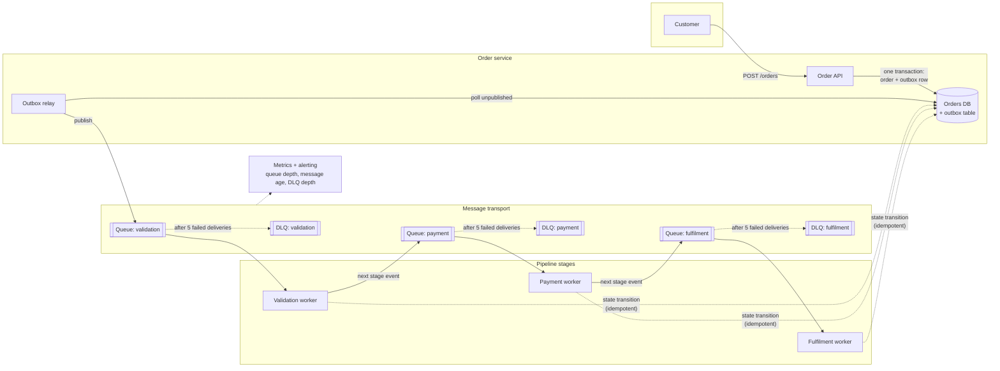

# RFC — Message transport for the order-processing pipeline

**Status:** draft — open for comment
**Current working focus:** decision (analysis complete, awaiting team review)
**Author:** Lucas Marques
**Date:** 2026-09-08

## Related documents

To be attached before review closes; the analysis below stands on its own but these are the artifacts
it should be checked against:

- Order-pipeline stage map (which service consumes which step) — *to be produced, see Task R1.*
- Order volume dashboard: orders/day, peak orders/minute, payload sizes — *needed to confirm A2/A9.*
- AWS SQS quotas and pricing for our region ([quotas](https://docs.aws.amazon.com/AWSSimpleQueueService/latest/SQSDeveloperGuide/quotas-messages.html),
  [pricing](https://aws.amazon.com/sqs/pricing/)).
- RabbitMQ quorum-queue documentation ([quorum queues](https://www.rabbitmq.com/docs/quorum-queues),
  [classic-mirroring removal in 4.0](https://www.rabbitmq.com/blog/2025/07/29/latest-benefits-of-rmq-and-migrating-to-qq-along-the-way)).

### Assumptions this document rests on

This RFC was drafted without a discovery round, so the following are **stated assumptions, not
findings**. Each one is load-bearing: if an assumption is wrong, the section that depends on it has to
be re-run. Please correct them in review — that is the cheapest possible moment to do it.

| # | Assumption | If it's wrong |
| --- | --- | --- |
| **A1** | The pipeline runs in AWS, and "our existing cluster" is a Kubernetes cluster inside the same AWS account/region. | If the cluster is on-prem or in another cloud, SQS adds a network egress and latency penalty and the analysis shifts materially toward RabbitMQ. |
| **A2** | Peak load is under ~100 orders/second, and each order emits fewer than ~10 pipeline messages. | Above roughly 1,000 messages/second sustained, SQS FIFO regional throughput quotas and per-request cost need a real calculation (see *Cost* below). |
| **A3** | Ordering is required **per order** (an order's events must not be processed out of sequence); global ordering across all orders is not required. | If no ordering at all is required, SQS Standard becomes the cheaper, simpler pick. If cross-order (global) ordering is required, no option here fits well and we need to re-open the design. |
| **A4** | "Complex routing we might need later" is a hypothesis, not a committed requirement — no named downstream consumer needs it this quarter. | If a concrete routing requirement exists with a date, re-weigh the Routing dimension; it is the one place RabbitMQ genuinely wins. |
| **A5** | All consumers are our own services and can use an AWS SDK; nothing external requires AMQP 0-9-1 or STOMP. | A partner or legacy system that speaks only AMQP forces a RabbitMQ-family option (or a protocol bridge). |
| **A6** | We have no team member currently on-call for a stateful clustered broker, and no existing RabbitMQ operational experience. | If we already run RabbitMQ in production with an owner and a runbook, the operational-cost argument against self-hosting weakens substantially. |
| **A7** | Single-region durability is acceptable; there is no regulatory or DR requirement for cross-region queue replication. | A cross-region RPO requirement changes the durability design for *both* options and needs its own section. |
| **A8** | Order messages carry a stable order identifier and downstream state transitions can be made idempotent. | If consumers cannot be made idempotent, at-least-once delivery becomes a correctness problem and the design needs a deduplication store regardless of broker. |
| **A9** | Message payloads are order *events* (identifiers plus small state), comfortably under 64 KB. | Payloads over 1 MiB cannot go in an SQS message body at all and need a claim-check pattern (pointer to S3). |

## Context

We are building a pipeline that processes orders. An order arrives, and a sequence of steps has to
happen to it — validation, payment, fulfilment, notification — each owned by a different piece of the
system, each able to fail and need retrying independently. That is the shape the pipeline has to
support: work handed from stage to stage, asynchronously, with each stage able to be slow or down for
a while without the order being dropped.

Right now that hand-off mechanism does not exist. We have to pick one, and it has to be picked before
the pipeline is built, because the choice reaches into every stage: how a stage receives work, how it
signals failure, how it retries, how we observe a stuck order, and how we recover after an incident.
Changing it later means touching every consumer and migrating in-flight messages while orders are
flowing — expensive and risky. That is why this is worth an RFC rather than a Slack thread.

Two candidates are already on the table, and they were framed as a straight trade of simplicity
against control:

- **AWS SQS** — a fully managed queue. No servers, no upgrades, no clustering. Deliberately minimal:
  a queue is a queue, and everything else (routing, fan-out, filtering) is somebody else's job.
- **Self-hosted RabbitMQ on our existing cluster** — a broker we would run ourselves. Rich routing
  (exchanges, topic patterns, per-message priority), full control over configuration, and full
  ownership of its failure modes, upgrades, and 3am pages.

The requirement that makes this decision non-trivial is the one stated up front: **orders are
business-critical and we cannot lose messages.** A lost order is not a degraded experience, it is a
customer who paid and received nothing, or a customer who was never charged for goods we shipped.

One thing to name immediately, because it reframes the whole comparison: **"we can't lose messages" is
mostly not a property of the broker.** Both candidates can be configured to not lose an acknowledged
message — SQS replicates synchronously across availability zones by design, and RabbitMQ quorum queues
plus publisher confirms get you to a comparable place. Real message loss in pipelines like this one
overwhelmingly happens at the two seams *around* the broker:

1. **The producer seam.** The service commits the order to its database and then publishes to the
   queue. If it crashes between the two, the order exists and no downstream stage will ever hear about
   it. No broker in the world prevents this. It is the single most common cause of lost orders, and it
   is solved with a transactional outbox (Design D1), not with a broker choice.
2. **The consumer seam.** A consumer acknowledges the message and then does the work — or dies
   mid-work with the message already acknowledged. Solved by acknowledging only after the work is
   durably committed, and by making the work idempotent so redelivery is safe (Design D3).

So the honest framing of this decision is: *the broker choice is mostly an operability and
routing-flexibility decision; the "cannot lose messages" requirement is met by the pattern we wrap
around whichever broker we pick.* This document decides both, and treats the seams as first-class parts
of the design rather than implementation detail.

### Out of scope

- **The pipeline's business logic** — what validation, payment, and fulfilment actually do. This
  document decides only how work moves between them.
- **Event streaming / analytics.** If we later want a replayable log of all order events for
  analytics or rebuilding read models, that is a different problem (and a different tool — see the
  Kafka row in the tradeoff table, rejected here for *this* use case, not forever).
- **The order API and its synchronous request path.** We assume the order is durably persisted by the
  API before the pipeline is involved.
- **Cross-region disaster recovery** (assumption A7).
- **The observability platform choice.** We assume we have metrics, logging, and alerting already and
  will emit into it.

## Requirements

Only the requirements that actually shape this decision are listed. The filter applied: does getting
this wrong cost us real money or force a redesign, and would a different answer produce a genuinely
different architecture? Feature-level details of individual pipeline stages are excluded — they do not
constrain the transport.

### Functional

- **F1 — No acknowledged order is ever lost.** Once the order API returns success to the customer,
  every pipeline stage that should see that order eventually sees it, including across broker failover,
  consumer crashes, and deploys. This is the requirement that dominates everything else.
- **F2 — Per-order processing is serialized.** Two events for the *same* order are never processed
  concurrently or out of sequence (assumption A3). Events for *different* orders may be processed in
  any order and in parallel.
- **F3 — A failing message is retried, then quarantined, never dropped and never retried forever.**
  Transient failures (a downstream 503) retry with backoff. A message that fails repeatedly moves to a
  dead-letter destination where it is visible, inspectable, and can be replayed after a fix.
- **F4 — At-least-once delivery with idempotent consumption.** We accept that a message may be
  delivered more than once and require that processing it twice has the same effect as processing it
  once. We explicitly do *not* require the broker to guarantee exactly-once delivery, because no broker
  can guarantee exactly-once *processing* — that is an application-side property.
- **F5 — Independent stage failure.** One stage being down or slow must not block the others, and must
  not lose the work queued for it.
- **F6 — An operator can answer "where is order X?"** and "what is stuck right now?" without reading
  application logs line by line.

### Non-functional

- **N1 — Durability: zero acknowledged-message loss, surviving the loss of one availability zone.**
  The transport must replicate an accepted message to more than one AZ before acknowledging the
  producer.
- **N2 — Availability of the enqueue path ≥ the availability of the order API.** The customer-facing
  order path must not be made *less* reliable by the pipeline behind it. Concretely: if the transport
  is unavailable, the order API still accepts the order (this is a design consequence of D1, and it is
  a hard requirement, not a nice-to-have).
- **N3 — Enqueue latency p95 ≤ 100 ms**, measured from the producer's publish call, because it sits
  inside (or adjacent to) a synchronous customer request. End-to-end pipeline latency is *not*
  constrained here: an order that completes in 30 seconds is fine.
- **N4 — Operability within the team we actually have.** No new full-time operational commitment, and
  no component whose recovery procedure only one person understands (assumption A6). Recovery from any
  single-component failure must be documented and rehearsable.
- **N5 — Observability: queue depth, message age, redelivery count, and DLQ depth are all metrics we
  can alert on**, per queue, without building a custom exporter.
- **N6 — Cost is proportional to volume and small relative to the pipeline's business value at our
  scale** (assumption A2). Explicitly: we would rather pay per-message than pay for idle capacity.
- **N7 — Evolvable routing.** Adding a new consumer of an existing order event must not require
  changing the producer. This is the *real* requirement behind "supports complex routing we might need
  later" — see the reframing in the Design section.

**Deliberately not requirements** (and therefore not scored): message priority; broker-level message
browsing; sub-millisecond enqueue; message TTL semantics; global ordering across orders; exactly-once
delivery. If anyone believes one of these belongs above, that is the highest-value comment they can
leave on this RFC, because adding one could change the outcome.

## Design

The design has three parts. Only the second is the "which queue" question — and it is deliberately
placed second, because the first part is what actually satisfies F1/N1/N2, and it is broker-independent.

### D1 — Transactional outbox at the producer (satisfies F1, N2)

The order service writes the order row **and** an `outbox` row in the **same database transaction**.
A separate relay process reads unpublished outbox rows and publishes them to the queue, marking them
published only after the broker acknowledges.

Why this and not a direct publish: it collapses the two-writes-can't-be-atomic problem into one
transaction. If the relay is down, or the broker is down, or the process is killed between the two,
nothing is lost — the outbox row is still there and gets published when the relay comes back. This is
what makes N2 achievable: the order API's availability no longer depends on the broker's.

The cost is honest and worth stating: an extra table, a relay process to run and monitor, added
publish latency (the relay's poll interval), and the outbox becomes a thing that can lag and needs its
own alert. We accept all of that, because the alternative is a known, well-documented way to lose
orders. (See the *Producer durability* rows in the tradeoff table for the alternatives we rejected.)

### D2 — Broker: one queue per pipeline stage, FIFO, keyed by order

Each stage owns its own queue, so F5 holds: fulfilment being down backs up the fulfilment queue and
nothing else. Ordering is per-order, not global — each message carries a group key equal to the order
id, and the broker serializes delivery within a group while parallelizing across groups (F2).

The chosen technology is argued in *Alternatives analysis* and named in *The decision*.

### D3 — Consumer contract (satisfies F3, F4, F6)

Every consumer, uniformly:

1. Receives a message and processes it **before** acknowledging. The acknowledgement deadline (SQS
   "visibility timeout", RabbitMQ delivery ack) is set to comfortably exceed the stage's p99 processing
   time, and is extended by heartbeat for long-running work.
2. Is **idempotent**, guarded by the order's state machine: a transition is applied only if the order
   is in a state where that transition is legal, and the check-and-transition is a single atomic
   database operation. This is what makes at-least-once delivery safe (F4, A8), and it is required
   regardless of which broker we pick.
3. Retries transient failures via redelivery with backoff, and after **N failed deliveries the message
   is routed to that stage's dead-letter queue** (F3). N starts at 5; the DLQ is monitored and
   alerted on at depth ≥ 1, because in a critical pipeline a single dead-lettered order is an incident,
   not a statistic.
4. Emits the order id and a correlation id on every log line and span, so F6 is answerable by query.

### D4 — Routing: keep it in front of the queue, not inside the broker (satisfies N7)

This is the part of the design that responds to "RabbitMQ supports complex routing we might need
later", and it deserves a direct answer rather than a dismissal.

The underlying need (N7) is *"add a consumer without touching the producer."* Broker-level topic
exchanges are one way to get that. The other is a **publish-subscribe layer in front of the queues**:
the producer publishes an order event once to a topic; each interested stage owns a subscription with a
filter, delivering into that stage's own queue. On AWS that is SNS or EventBridge in front of SQS; the
producer is unchanged when a fourth consumer appears — you add a subscription.

Both satisfy N7. The difference is *where* the routing table lives (broker configuration vs. cloud
resource definitions in our infrastructure-as-code) and how expressive it is. RabbitMQ topic exchanges
are more expressive for hierarchical routing keys; EventBridge rules are more expressive for
content-based filtering on the message body. Neither is obviously better, which is precisely why "we
might need complex routing later" does not by itself select RabbitMQ.

We do **not** build the pub/sub layer now (A4). We build direct producer-to-queue publishing, and we
keep the option open by having producers publish semantic *order events* rather than
stage-specific *commands* — so inserting a topic in front later is an infrastructure change, not a
rewrite of every producer. That is the cheapest possible way to buy the option.

### Static diagram



Described in words, in case the diagram does not render: the customer calls the Order API, which writes
the order row and an outbox row in a single database transaction. An outbox relay polls the database
for unpublished rows and publishes them to the first stage's queue. Each stage has exactly one input
queue and one dead-letter queue; each worker consumes from its input queue, applies an idempotent state
transition to the orders database, and publishes an event to the next stage's queue. After five failed
deliveries a message moves to that stage's dead-letter queue. All queues export depth, oldest-message
age, and dead-letter depth to the metrics platform.

### Dynamic diagram — happy path plus the two failure modes that matter

```mermaid
sequenceDiagram
  participant C as Customer
  participant API as Order API
  participant DB as Orders DB (+outbox)
  participant R as Outbox relay
  participant Q as Stage queue
  participant W as Stage worker

  C->>API: POST /orders
  API->>DB: BEGIN; insert order; insert outbox row; COMMIT
  API-->>C: 201 Created
  Note over API,DB: Order is durable here.<br/>Broker availability is irrelevant to the customer (N2).

  R->>DB: SELECT unpublished outbox rows
  R->>Q: publish(order.created, group=order_id)
  Q-->>R: ack (replicated across AZs, N1)
  R->>DB: mark outbox row published

  Q->>W: deliver(order.created)
  W->>DB: atomic state transition (idempotent, F4)
  W->>Q: ack — only after commit (F1)

  rect rgb(245, 235, 235)
    Note over W,Q: Failure mode 1 — worker dies mid-processing
    Q->>W: deliver(order.created)
    W--xW: crash before ack
    Note over Q: ack deadline expires; message becomes visible again
    Q->>W: redeliver (attempt 2)
    W->>DB: transition already applied → no-op, ack
  end

  rect rgb(235, 240, 245)
    Note over W,Q: Failure mode 2 — poison message
    loop attempts 1..5
      Q->>W: deliver(bad message)
      W-->>Q: nack / no ack
    end
    Q->>Q: route to DLQ (F3)
    Q->>DB: (operator alerted on DLQ depth ≥ 1)
  end
```

### Traceability check

Every requirement maps to something in the design, and every design element earns its place:

| Requirement | Met by |
| --- | --- |
| F1 no lost orders | D1 outbox + D3 ack-after-commit + N1 broker replication |
| F2 per-order serialization | D2 group key = order id |
| F3 retry then quarantine | D3.3 redelivery + per-stage DLQ |
| F4 at-least-once + idempotent | D3.1, D3.2 |
| F5 independent stage failure | D2 one queue per stage |
| F6 "where is order X" | D3.4 correlation ids + D2 per-stage queues + N5 metrics |
| N1 multi-AZ durability | Broker choice (all shortlisted options satisfy it *when correctly configured*) |
| N2 enqueue availability | D1 — the API never calls the broker synchronously |
| N3 enqueue p95 ≤ 100 ms | Relay publishes off the request path; the customer path only writes to the DB |
| N4 operability | Broker choice — this is the dimension where the options genuinely diverge |
| N5 observability | Broker choice — managed metrics vs. self-built exporters |
| N6 cost | Broker choice |
| N7 evolvable routing | D4 — semantic events now, pub/sub layer insertable later |

Note what this table shows: **F1–F6, N2, and N3 are satisfied by the pattern, not by the broker.** The
broker choice is decided by N1, N4, N5, N6, and N7. That is the actual scope of the argument.

## Alternatives analysis (Tradeoff)

Grouped by the dimension being decided. Each risk carries impact, probability, a mitigation (stop it
happening) and a contingency (what we do if it happens anyway).

### Dimension 1 — Broker

| Alternative | Pros | Cons | Risk (description) | Impact | Probability | Mitigation | Contingency |
| --- | --- | --- | --- | --- | --- | --- | --- |
| **SQS FIFO** (per-order message group) | Zero operational surface: no nodes, upgrades, clustering, or capacity planning. Messages replicated across multiple AZs on accept (N1). Per-message-group ordering plus 5-minute content deduplication gives F2 for free. Native DLQ with `maxReceiveCount` and a console redrive (F3). Queue depth, oldest-message age, and DLQ depth are CloudWatch metrics with no exporter to build (N5). Cost is pure per-request with no idle floor (N6). IAM for authorization — no broker credentials to rotate. | No broker-level routing: fan-out needs SNS/EventBridge in front (D4). Retention capped at 14 days — a DLQ left unattended silently expires. Max payload 1 MiB (64 KB per billed request unit). No message browsing, no priority, no per-message TTL. AWS-specific API: consumers are coupled to SQS, and local development needs a fake or LocalStack. Regional FIFO throughput quotas need checking before high-volume launches. | A poison message blocks its message group's head; every later event for **that order** stalls until it dead-letters | Medium | Medium | `maxReceiveCount` = 5 so a poison message quarantines in minutes, not hours; alert on DLQ depth ≥ 1; per-order blocking is *desired* behaviour under F2 — the blast radius is one order, not the queue | Manually delete or redrive the offending message; ship a consumer fix and redrive the DLQ |
| | | | An unattended DLQ message hits the 14-day retention ceiling and the order is lost — defeating F1 by the back door | High | Low | Set DLQ retention to the 14-day maximum; alert on DLQ depth ≥ 1 **and** on DLQ oldest-message-age > 24h; treat any DLQ arrival as an incident | Reprocess from the outbox table, which is our real system of record and is not subject to broker retention |
| | | | Vendor lock-in: a future move off AWS means rewriting every producer and consumer | Medium | Low | Wrap send/receive in a thin internal port so business logic never imports the AWS SDK; keep messages as plain JSON with no SQS-specific fields | Reimplement the port for the new transport; the pattern (outbox, idempotent consumers, DLQ) is broker-agnostic and survives the move |
| | | | Regional FIFO throughput quota is hit as volume grows | Medium | Low | Distribute across many message groups (order id gives natural spread); verify the region's quota against projected peak before launch; request an increase via Service Quotas | Enable high-throughput FIFO mode; if still insufficient, shard across multiple queues by order-id hash |
| **SQS Standard** | Everything above, plus effectively unlimited throughput and ~20% lower per-request cost. | **Does not satisfy F2** — ordering is best-effort only, so two events for the same order can be processed out of sequence or concurrently. Duplicates are more frequent than with FIFO. | Out-of-order processing corrupts order state (e.g. `cancelled` applied before `paid`) | High | High | Would require an application-level sequencing/version guard on every consumer — real complexity pushed onto every stage | Reject the alternative — this is why it is not chosen |
| **Self-hosted RabbitMQ on our cluster** (quorum queues) | Genuinely powerful routing today, not later: topic/direct/fanout/headers exchanges, so a new consumer is a binding (N7). Quorum queues (Raft) with publisher confirms give strong durability (N1) when correctly configured. AMQP 0-9-1 is portable and vendor-neutral; consumers are not tied to a cloud API. Per-message priority, TTL, and management-UI message browsing. No per-message cost — marginal cost of message #10,000,001 is zero. Runs beside our services with in-cluster latency and no egress. | We become the operator of a stateful, clustered, Erlang-based system: version upgrades, Erlang/OTP compatibility, disk and memory alarms, network-partition handling, quorum membership changes, backup/restore of definitions. Correct durability is **configuration we must get and keep right** (durable exchanges/queues, quorum queue type, publisher confirms, `delivery-limit` and a dead-letter exchange) — the defaults are not the safe settings. Kubernetes is a hostile home for a quorum-based broker: pod eviction, node drain, and rescheduling are routine there and are exactly the events a Raft cluster is sensitive to. Observability is ours to build (Prometheus plugin, dashboards, alert rules). Classic mirrored queues were removed in RabbitMQ 4.0, so quorum queues are the only replicated option and their operational characteristics differ from the older material most tutorials describe. | Misconfiguration loses acknowledged messages — a non-durable queue, a missing publisher confirm, or a `delivery-limit` that silently drops | **High** | **Medium** | Define queues/policies exclusively as code, never by hand or via the management UI; a startup assertion that rejects a non-quorum or non-durable queue; a chaos test that kills the quorum leader mid-publish and asserts zero loss, run in CI | The outbox table lets us replay everything published in the affected window — but only if we detect the loss, which is the hard part |
| | | | Cluster-node churn (eviction, node drain, upgrade) causes quorum loss or split-brain and the pipeline stalls | High | Medium | 3 or 5 nodes across distinct AZs with anti-affinity, pod disruption budgets, dedicated node group with taints, `pause_minority` partition handling, persistent volumes that survive rescheduling | Failover to a single-node emergency broker with the outbox replaying; accept a degraded window |
| | | | Nobody owns it — knowledge stays with whoever set it up, and an incident lands on someone who has never operated it (A6, violates N4) | **High** | **High** | Named owner plus a documented, *rehearsed* runbook; two people trained; a scheduled game day before go-live | Emergency AWS support or a managed-RabbitMQ vendor migration under incident pressure — the worst possible time to do it |
| | | | Ongoing operational time exceeds its budget and quietly consumes pipeline delivery capacity | Medium | High | Time-box the operational commitment explicitly and track it; review at 90 days | Migrate to Amazon MQ for RabbitMQ (the same broker, managed — a config change, not a rewrite) |
| **Amazon MQ for RabbitMQ** (managed RabbitMQ) | RabbitMQ's routing model *and* its AMQP portability, without us operating the cluster: AWS handles provisioning, patching, and multi-AZ cluster deployment. Quorum queues supported from RabbitMQ 3.13. This is the honest steelman of "we want RabbitMQ" — it keeps almost every advantage the routing argument depends on. | Priced per broker-instance-hour plus storage — an always-on floor, unlike SQS's per-request model (tension with N6). Still requires us to understand and correctly configure RabbitMQ durability semantics; managed hosting removes the operator burden, not the design burden. Broker version upgrades are our scheduling responsibility. Less operationally invisible than SQS: there are still instances, and they have sizes. | We pay for and reason about a broker we did not need, because the routing requirement (N7) never materializes (A4) | Medium | **High** | Only choose it if a routing requirement is named and dated; otherwise revisit when one appears | Migrate to SQS — but that means rewriting consumers, so this is the expensive direction to be wrong in |
| | | | Instance sizing is wrong under peak load | Medium | Low | Load-test at 2× projected peak before launch | Resize the broker (brief failover window) |
| **Amazon MSK / Kafka** | Replayable log — reprocess history by resetting an offset, which none of the queue options give. Strong per-partition ordering. Excellent for the analytics/event-sourcing use case we deliberately deferred. | Wrong shape for this problem: no per-message acknowledgement, no native per-message redelivery with backoff, no built-in DLQ — all of F3 becomes application code. Head-of-line blocking is per *partition*, so one stuck order stalls every order sharing its partition. Consumer-group rebalancing is its own operational discipline. Highest complexity of every option, for capabilities we listed as out of scope. | We adopt streaming complexity to solve a queueing problem, and F3 becomes bespoke code we maintain | High | High | — | Reject the alternative. Revisit only if the analytics/replay requirement becomes real, and then as an *addition* alongside the pipeline queue, not a replacement |

**Requirements check, broker dimension** (✅ met, ⚠️ met with added work, ❌ not met):

| | N1 durability | N4 operability | N5 observability | N6 cost | N7 routing | F2 ordering | F3 DLQ |
| --- | --- | --- | --- | --- | --- | --- | --- |
| SQS FIFO | ✅ by default | ✅ nothing to operate | ✅ CloudWatch native | ✅ per-request, no floor | ⚠️ needs SNS/EventBridge | ✅ message groups | ✅ native |
| SQS Standard | ✅ | ✅ | ✅ | ✅ cheapest | ⚠️ | ❌ best-effort only | ✅ |
| Self-hosted RabbitMQ | ⚠️ correct config required | ❌ violates N4 under A6 | ⚠️ we build it | ✅ no per-message cost | ✅ native | ✅ per-queue consumer | ✅ via DLX |
| Amazon MQ RabbitMQ | ⚠️ correct config required | ✅ | ⚠️ partly ours | ⚠️ hourly floor | ✅ native | ✅ | ✅ via DLX |
| MSK / Kafka | ✅ | ❌ | ⚠️ | ⚠️ | ⚠️ | ⚠️ per-partition | ❌ application code |

Self-hosted RabbitMQ fails N4 outright under assumption A6, and that is decisive rather than a matter
of weighting: N4 was written as a hard requirement because a broker only one person can recover is a
liability on a business-critical path. **If A6 is wrong — if we already run RabbitMQ with a named owner
and a rehearsed runbook — that ❌ becomes a ⚠️ and this table no longer settles the question.** That is
the single most important thing to challenge in review.

### Dimension 2 — Producer durability (how we guarantee F1 at the write seam)

| Alternative | Pros | Cons | Risk (description) | Impact | Probability | Mitigation | Contingency |
| --- | --- | --- | --- | --- | --- | --- | --- |
| **Transactional outbox + relay** (chosen) | Atomic with the business write, so no crash window can lose an order. Order API availability is independent of the broker (N2). The outbox doubles as an audit log and a replay source that outlives broker retention. | Extra table, extra process, extra alert. Adds relay-poll latency before the message reaches the queue. Requires deduplication downstream, since the relay may publish twice (it is at-least-once by construction). | Relay lags or dies and the pipeline silently stops while orders keep being accepted | High | Medium | Alert on oldest unpublished outbox row age > 60s; run the relay with more than one replica using leader election or `SKIP LOCKED` | Manual relay run; the backlog drains once it recovers — nothing is lost, only delayed |
| | | | Outbox table grows unbounded and degrades the orders database | Medium | Medium | Archive/delete published rows on a schedule; index on `(published_at IS NULL)` | Move the outbox to its own table space or database |
| **Direct publish with confirms, inside the request** | Simplest possible thing; no relay, no table, lowest latency to queue. | Breaks N2: if the broker is unavailable the order API fails, so the pipeline's availability becomes the customer path's availability. Leaves a crash window between the DB commit and the publish — the classic lost-order bug. | An order is committed and never published; nobody notices until the customer complains | **High** | **Medium** | None that actually closes the window — this is a structural flaw, not a tuning problem | Reject the alternative |
| **Publish first, then write the DB** | No lost *message*. | Now the inverse bug: a message exists for an order that was never persisted, and consumers fail on a missing order id. Turns a lost order into a stream of poison messages. | Consumers dead-letter en masse on phantom orders | High | Medium | Consumers would need to tolerate and retry unknown order ids for an unbounded window | Reject the alternative |
| **Change-data-capture off the database log** (e.g. Debezium) | No application-side outbox logic; captures every committed change with no relay to write. | A whole new infrastructure component (connector plus, typically, Kafka) — far more operational weight than the relay it replaces. Couples message schemas to the database schema unless an outbox table is used anyway. | We adopt streaming infrastructure to avoid writing a small relay | Medium | Medium | — | Reject for now; reconsider if CDC arrives for other reasons, at which point the outbox table feeds it directly |

### Dimension 3 — Routing evolution (how we satisfy N7)

| Alternative | Pros | Cons | Risk (description) | Impact | Probability | Mitigation | Contingency |
| --- | --- | --- | --- | --- | --- | --- | --- |
| **Direct producer→queue now, semantic events, pub/sub insertable later** (chosen) | No speculative infrastructure (A4). Publishing *order events* rather than *stage commands* means a topic can be inserted in front of the queues without changing producers. Cheapest way to hold the option. | If routing needs arrive sooner than expected there is a migration to do, small but real. | The "insertable later" claim proves false because producers drifted into publishing stage-specific commands | Medium | Medium | Enforce event-shaped payloads in code review and in the message schema; one schema per order event, versioned | Add the topic and translate at the edge — contained work, one adapter per producer |
| **SNS or EventBridge in front of SQS from day one** | N7 satisfied immediately; adding a consumer is a subscription. Content-based filtering on the message body (EventBridge). | Infrastructure and mental overhead for a need nobody has named. Another hop to observe, and another place a message can be filtered into oblivion by a wrong rule. | A filter-rule mistake silently drops order events | High | Medium | Rules as code with tests; alert if a stage's inbound rate deviates from the order rate | Redrive from the outbox once the rule is fixed |
| **RabbitMQ topic exchanges** | The most expressive hierarchical routing of the options, all inside one component. | Only available with a RabbitMQ-family broker, so it cannot be chosen independently of Dimension 1. | Selects the broker by the back door, on the strength of a hypothetical requirement | Medium | Medium | Decide Dimension 1 on N1/N4/N5/N6 first, then check N7 is still satisfiable — which D4 shows it is | Revisit Dimension 1 if a hard routing requirement lands |
| **Application-level fan-out** (producer publishes to each stage queue) | No new infrastructure at all. | Directly violates N7: every new consumer edits and redeploys the producer. Fan-out consistency becomes application logic — publish to three queues, second one fails, now what? | Partial fan-out leaves the pipeline in an inconsistent state | High | Medium | Would need per-destination outbox rows | Reject as the long-term shape; acceptable only transitionally while a single consumer exists |

### Cost note

At the volume in A2, the arithmetic strongly favours per-request pricing. Worked example, using AWS
list price for SQS FIFO of $0.50 per million requests with the first 1M requests/month free (verify
against the [pricing page](https://aws.amazon.com/sqs/pricing/) for our region before quoting this to
finance):

- 1,000,000 orders/month × 5 pipeline messages/order = 5,000,000 messages
- Each message costs 3 requests without batching (send + receive + delete) = 15,000,000 requests
- (15,000,000 − 1,000,000 free) × $0.50/M ≈ **$7/month**, plus empty long-poll receives; batching sends
  and receives in groups of 10 reduces this further. Messages under 64 KB (A9) bill as one request each.

Even off by an order of magnitude, this is a rounding error against the engineering time of running a
broker. **The self-hosted comparison is deliberately left unquantified** — its dominant cost is
engineering and on-call time, not instances, and I have not measured our instance pricing or the hours
this team would actually spend. Someone should fill that in; I have flagged it as an open question
rather than invent a number. The qualitative claim I will defend is only this: at A2 volumes, message
volume is nowhere near the point where per-request pricing loses to running your own broker.

## The decision

**Chosen: AWS SQS FIFO queues — one queue plus one dead-letter queue per pipeline stage,
`MessageGroupId` = order id — fronted by a transactional outbox at the producer and idempotent,
ack-after-commit consumers.** Routing stays outside the broker: producers publish semantic order
events, and SNS/EventBridge is inserted in front of the queues if and when a real routing requirement
appears.

The reasoning, in the order that actually drove it:

1. **The "cannot lose messages" requirement does not discriminate between the candidates, and
   recognizing that is the crux of this RFC.** SQS replicates across AZs by default; RabbitMQ quorum
   queues with publisher confirms get to a comparable place *when configured correctly*. Both then lose
   orders identically at the producer seam without an outbox. So F1/N1 is won by D1 and D3, not by the
   broker — and once that is clear, the framing of "managed and simple vs. control and complex" loses
   most of its force. What remains to decide is operability, observability, cost, and routing.
2. **On operability (N4), the gap is not close, and it points the same way that durability does.**
   Self-hosting means owning a Raft-based clustered broker on Kubernetes — an environment whose normal
   behaviour (evictions, drains, rescheduling) is precisely what quorum systems are sensitive to — with
   nobody currently on-call for it (A6). The pipeline is business-critical; adding a component whose
   recovery only its installer understands works directly against the requirement that motivated the
   RFC. Note the direction of the irony: the option that *feels* safer because we control it is the one
   whose durability depends on configuration we have to get right and keep right.
3. **The routing argument is real but does not select RabbitMQ.** "We might need complex routing later"
   is a genuine requirement (N7), and it would be wrong to wave it away. But it is satisfiable on either
   side — broker exchanges, or a pub/sub layer in front of the queues (D4). Given that, paying an
   operational cost today for routing flexibility we can also buy later, cheaply, is paying too early.
4. **FIFO over Standard because F2 is a real requirement.** Per-order serialization via message groups
   costs about 20% more per request and removes an entire class of application-level sequencing
   complexity from every consumer. Distinct orders still process in parallel, so throughput is not
   meaningfully constrained at A2 volumes.
5. **Amazon MQ for RabbitMQ is the runner-up, and it is a respectable option**, not a strawman: it
   keeps RabbitMQ's routing model and AMQP portability while removing the operator burden. It loses
   here only on the always-on cost floor and on having a real broker to configure and version — a price
   worth paying the moment N7 becomes concrete, and not before.

**The strongest objection to this decision**, stated plainly because the decision should be judged
against its best counter-argument: *we are optimizing for the requirements we can see, and the
requirement the team actually flagged is the one we are deferring.* If complex routing lands in six
months, we will pay a migration that choosing Amazon MQ for RabbitMQ today would have avoided — and
migrating a live order pipeline between brokers is exactly the kind of work nobody wants. My answer is
that D4 makes that migration additive (insert a topic, do not replace the transport) and that A4 says
the requirement is currently a hypothesis. **But that answer is only as good as A4.** If anyone can
name a routing requirement with a date attached, say so in review and this decision should change to
Amazon MQ for RabbitMQ.

**Conditions that would flip the decision** — recorded now so we recognize them later rather than
arguing from scratch:

- A **named, dated** requirement for broker-level routing that a pub/sub layer cannot serve → Amazon MQ
  for RabbitMQ.
- A consumer that can only speak AMQP or STOMP (A5 wrong) → Amazon MQ for RabbitMQ.
- The cluster is not in AWS (A1 wrong) → re-run Dimension 1 entirely; the calculus changes.
- We already operate RabbitMQ with a named owner and rehearsed runbook (A6 wrong) → self-hosting
  returns to genuine contention.
- Sustained volume an order of magnitude above A2, where FIFO quotas or per-request cost start to bite →
  re-run the cost and quota analysis.
- A hard requirement for message replay or an event log → this is not a broker swap but an addition;
  see the Kafka row.

**Decision style: autocratic, pending review.** This is my recommendation as the person accountable for
the pipeline's reliability, and I am making the call rather than putting it to a vote — but it is
explicitly open for comment until the review closes, and the assumptions table plus the flip conditions
above are what I most want challenged. If review shows A4 or A6 is wrong, the decision changes on the
evidence, not on the vote.

## Launch strategy

Phased so each phase is independently valuable and the risky parts are proven before order volume
depends on them.

**Phase 0 — Prove durability before building on it (before any pipeline code).**
Stand up one SQS FIFO queue plus its DLQ in a non-production account. Write a harness that publishes
through the outbox relay, kills the consumer mid-processing, kills the relay mid-publish, and asserts
zero loss and correct redelivery. Confirm the region's FIFO throughput quota against 2× projected peak.
This phase de-risks the irreversible part and its result is recorded in this document.

**Phase 1 — One stage, end to end.** Outbox table and relay in the order service; the validation stage
consuming from its queue with idempotent transitions and a DLQ. Dashboards and alerts (queue depth,
oldest-message age, DLQ depth, outbox lag) go in *with* this phase, not after — an unobserved queue on a
critical path is worse than no queue.

**Phase 2 — Remaining stages**, one per deploy, reusing the Phase 1 pattern. Each new stage is a queue,
a DLQ, a worker, and four alerts.

**Phase 3 — Shadow, then cut over.** Run the pipeline alongside whatever handles orders today (or
against replayed traffic) and reconcile counts: orders accepted vs. orders that reached the final stage.
Reconciliation must show zero divergence for a sustained window before the pipeline owns real orders.

**Phase 4 — Game day.** Rehearse: DLQ redrive after a bad deploy, relay outage recovery, replay from the
outbox. If we cannot recover from these in a drill, we cannot recover from them at 3am.

**Explicitly not in the plan:** the SNS/EventBridge routing layer. It is added when a second consumer
of the same event exists, and not before.

## Tasks and roadmap

Estimates are rough sizing for sequencing, not commitments; they assume one engineer per task and
should be re-estimated by whoever picks them up.

| Task | Description | Estimate |
| --- | --- | --- |
| R1 | Write the pipeline stage map: stages, their events, and their payload schemas. Confirms A2/A9 and unblocks everything else | 1d |
| R2 | Confirm the assumptions table with the team; correct and re-run any affected section | 0.5d |
| P0-1 | Terraform module: FIFO queue + DLQ + IAM + `maxReceiveCount` + retention, reusable per stage | 1d |
| P0-2 | Durability harness: kill-consumer and kill-relay tests asserting zero loss; run in CI | 2d |
| P0-3 | Verify the region's FIFO throughput quota vs. 2× projected peak; request an increase if needed | 0.5d |
| P1-1 | Outbox table, migration, and the relay process (leader election or `SKIP LOCKED`, publish, mark, archive) | 3d |
| P1-2 | Internal messaging port (send/receive/ack) so business logic never imports the AWS SDK | 1d |
| P1-3 | Validation-stage consumer: ack-after-commit, idempotent state transition, correlation ids | 2d |
| P1-4 | Dashboards and alerts: queue depth, oldest-message age, DLQ depth ≥ 1, DLQ age > 24h, outbox lag > 60s | 1.5d |
| P1-5 | Runbook: DLQ inspection and redrive, relay recovery, replay from outbox | 1d |
| P2-n | Each remaining stage (queue + DLQ + worker + alerts), per stage | 2d |
| P3-1 | Shadow-run reconciliation: orders accepted vs. orders completed, with a divergence alert | 2d |
| P4-1 | Game day: rehearse DLQ redrive, relay outage, outbox replay | 1d |

## Open questions for review

These are unresolved and would change parts of this document. They are listed here rather than
answered speculatively.

1. **Is A4 right?** Does anyone have a routing requirement with a date? This is the one that could flip
   the decision to Amazon MQ for RabbitMQ.
2. **Is A6 right?** Do we already run RabbitMQ anywhere in production, with an owner?
3. **What is our actual peak order volume and messages-per-order?** A2 is a guess; it gates the cost
   and quota analysis.
4. **What does an hour of platform on-call and a 3-node broker actually cost us?** The self-hosted side
   of the cost comparison is deliberately unquantified and should be filled in by someone with our
   instance pricing and a realistic hours estimate.
5. **Is 5 delivery attempts before dead-lettering right for each stage?** Payment may want a different
   retry profile than notification.
6. **Who owns the DLQ alert?** A dead-lettered order is an incident under F1; incidents need an owner
   before launch, not after.

## Version history

| Version | Date | Author | Description |
| --- | --- | --- | --- |
| 1.0 | 2026-09-08 | Lucas Marques | Document created. Analysis run without a discovery round; assumptions A1–A9 stated explicitly and open questions recorded for review. |
