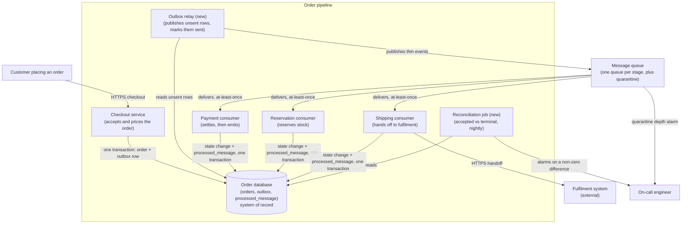
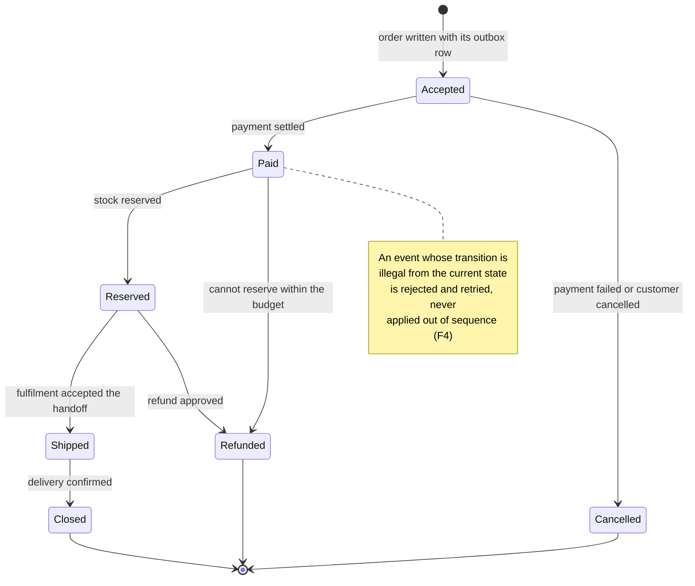
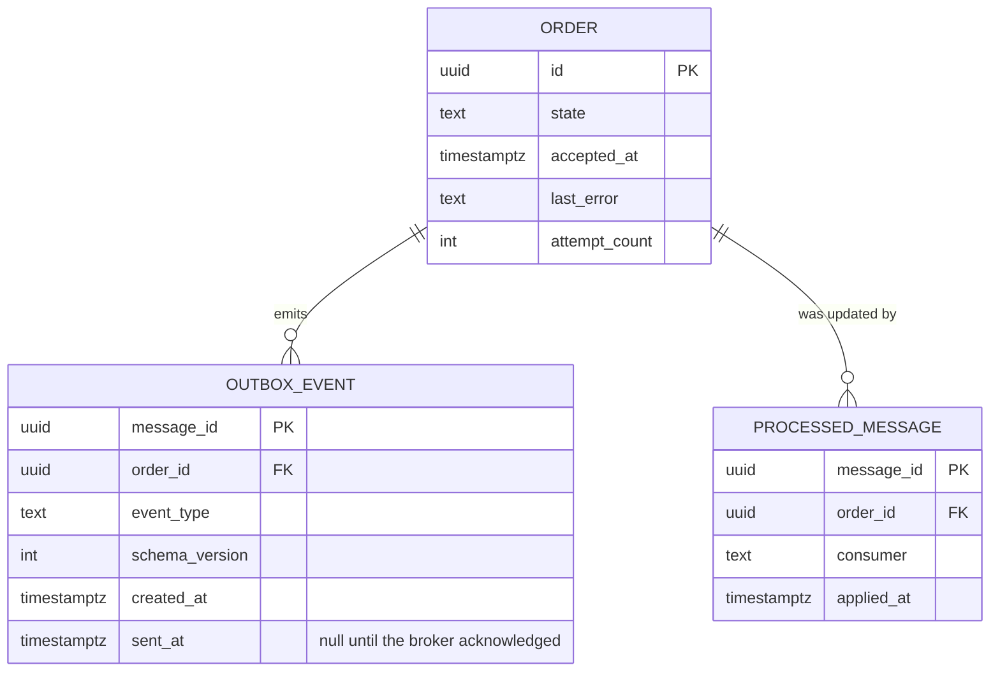

# RFC: Handing orders between pipeline stages without losing them

**Status:** proposed (three blocking questions open, listed in Context and repeated in the Decision)
**Decider:** the engineer accountable for the order pipeline · **Reviewers:** platform operator (whoever owns the existing cluster), security/compliance reviewer, budget owner, support lead
**Current working focus:** decision

## Evidence status, read this first

Nothing in this document was measured. No codebase, dashboard, cost report, incident log or ticket
queue was available while writing it, so every figure below is labelled ***assumed*** with the
requester as its origin and a named way to confirm it. Where a vendor's documented behaviour is cited
(a retention cap, a delivery guarantee, a quota) it is labelled ***vendor-documented, to re-confirm***:
those are stated from knowledge of the products rather than read off a console today, and the roadmap
carries the task of re-reading them for the regions and versions actually in play. Two of them —
per-request prices and the per-queue FIFO throughput quota — carry real decision weight, so they are
called out again in the Decision as the numbers to check before anyone commits.

A document whose numbers are all assumed is not worthless, but it is a different object from one whose
numbers are measured: it identifies which five measurements would settle the argument rather than
settling it. Those five are the first five tasks in the roadmap.

## Reversibility

**The delivery contract is a one-way door. The broker product is a two-way door.**

Choosing at-least-once delivery with idempotent consumers puts an idempotency key in the data model
and a "have I already applied this?" check at the entry of every consumer the pipeline will ever have.
Reversing that later means revisiting every consumer and backfilling a table. Likewise, deciding
whether ordering is guaranteed by the transport or enforced by guards in the order's state machine
shapes how every consumer is written. Those are expensive to undo, so most of the depth below is spent
on them.

Which broker moves the bytes is comparatively cheap to change, *provided* two things hold: the order
database, not the queue, is the system of record; and publish and consume sit behind a narrow
interface with one adapter per broker. The design below makes both hold, which is what demotes the
question the requester asked ("SQS or RabbitMQ?") from a one-way door to a two-way one. That demotion
is the most useful thing this document does, because it means the routing capability nobody needs yet
does not have to be bought today in order to be available later.

One qualifier: a two-way door still has a price. Swapping brokers after launch costs the adapter, a
re-run of the durability drills, and a dual-run window — 5 to 8 engineer-days (*assumed*, derived from
the adapter and drill lines in the roadmap), against roughly 15 to 25 for getting the delivery
contract wrong in a way that reaches the data model.

## Context

The team is building a pipeline that processes orders in stages rather than doing the work inside the
checkout request. Orders are business-critical: the requester's words are that we "can't lose
messages". The question brought to this document is which message queue to use, framed as AWS SQS
(managed, simple) against RabbitMQ self-hosted on the cluster the team already runs (more control,
richer routing that might be needed later).

**What exists today.** Order processing happens inside the checkout request, or does not exist yet
because the pipeline is greenfield (*assumed*; nobody has checked. Reading the checkout handler and
the order table's schema would settle it in under an hour). The team runs an existing cluster, which
is why self-hosting is on the table at all, and is on AWS, which is why SQS is (*assumed*, both
inferred from the requester's framing; the infrastructure repository would confirm both). There is an
order database holding order state (*assumed*; implied by "orders", and the design below leans on it,
so this is the one to confirm first).

**The gap.** Whichever it is, work that must happen for every paid order is currently coupled to the
lifetime of a single process: the request handler, or a cron job, or nothing at all. When that process
dies mid-order there is no record of what was left undone, so recovery is a human reading logs and
repairing rows. The pipeline exists to remove that failure mode.

Note what that means for the question asked. The failure mode is at the *handoff*, not inside the
broker. Both candidates replicate what they have been given; neither can persist a message the
producer never successfully handed over, and in pipelines of this shape that is where order loss
actually comes from. The design section spends its first dimension there, before it spends a word on
either product.

**Numbers that do not exist yet.** Orders per day at peak, messages per order, the tolerable delay
between "customer paid" and "warehouse notified", today's rate of orders needing manual repair, and
the budget for this. Each is *assumed* below where the argument needs one, and each appears in the
roadmap as a measurement.

### Current usage

Every cell here is *assumed* from the request; the confirming source is named in the last column.

| Role (what they do with the system) | What they do today | Through what | How often or how much (source) |
| --- | --- | --- | --- |
| Customer placing and paying for an order | Completes checkout and waits for confirmation | The storefront's checkout request | Volume unknown; 30 days of order-table rows, or the load balancer's counts, would give it (*assumed*) |
| Fulfilment operator picking and shipping | Acts on the orders that reach them | Whatever the current path pushes, or a manual list | Unknown; the fulfilment tool's own record would give it (*assumed*) |
| Support agent answering "where is my order?" | Looks the order up and, when it is stuck, escalates to an engineer | Admin panel plus a request to engineering | Unknown; the ticket queue tagged for order status would give it (*assumed*) |
| On-call engineer recovering a half-processed order | Reads logs, works out which steps ran, repairs rows by hand | Log search and a database console | Unknown; the incident log and any manual-fix runbook would give it (*assumed*) |
| Finance analyst matching charges to fulfilment | Compares what was charged against what shipped | Reports over the order database | Unknown; ask the analyst (*assumed*) |

### Goals

| Goal | Who benefits | How we will know |
| --- | --- | --- |
| G1: Every order a customer pays for is eventually fulfilled, and none disappears quietly | Customer placing an order; the finance analyst matching charges to shipments | A daily reconciliation of orders accepted against orders in a terminal or in-flight state closes with nothing unexplained |
| G2: A customer is charged once and receives their goods once, however many times the system retries | Customer placing an order; the support agent handling the complaint | Count of duplicate charges and duplicate shipments attributable to retries |
| G3: When an order gets stuck, someone finds out before the customer does, and can restart it without editing the database | Support agent; on-call engineer | Share of stuck orders found by an alert rather than by a customer contact; share of recoveries needing a database edit |
| G4: The people who build order features spend their week on order features, not on keeping the handoff mechanism alive | The engineers on the team; the budget owner | Engineer-hours per quarter of unplanned upkeep on the handoff mechanism; incidents whose root cause is the mechanism itself |

None of these names a queue, and that is deliberate: all four survive a change of broker, which is
what makes them usable as the yardstick in the tradeoff table.

### Stakeholders

| Role (what they do with the system) | What they need from this decision | Who speaks for them |
| --- | --- | --- |
| Customer placing an order | Their paid order gets fulfilled, once, without them having to chase it | Product owner for checkout |
| Fulfilment operator | Each order arrives once, and out-of-sequence updates do not corrupt what they see | Fulfilment lead |
| Support agent answering order questions | An order's current state and last failure, visible without an engineer | Support lead |
| On-call engineer | A bounded number of failure modes to learn, a runbook, and a replay that does not involve SQL | The engineer accountable for the pipeline |
| Platform operator running the existing cluster | Not to inherit an unowned stateful workload with a quorum and an upgrade dance (*negative stakeholder*: self-hosting is a cost they pay) | Whoever owns the cluster |
| Security/compliance reviewer | To know what order data leaves the cluster, to where, and encrypted how (*negative stakeholder*: a managed queue widens their review surface) | Security/compliance reviewer |
| Developer adding the next consumer | To subscribe to order events without editing the producer | The engineer accountable for the pipeline |
| Budget owner | A monthly cost that scales with orders, and no surprise floor | Finance |

### Constraints

| Constraint | Source (outside the organization, or a signed commitment) | What it excludes, and the clause |
| --- | --- | --- |
| None established at the time of writing | — | Nothing. No law, regulation, contract clause, signed budget or regulator's date was supplied, and none was found, because no repository or contract was available to search |

This table being empty is a finding, not an omission. Two candidate constraints are plausible and
would change the analysis if they exist: card-data scope rules that would put order messages inside an
audited boundary, and a data-residency or processor-approval clause in a customer or supplier contract.
Both are raised as blocking question B2 rather than invented here. Until someone produces a clause, no
option is excluded by a constraint — and in particular neither "we are an AWS shop" nor "the platform
team runs the cluster" is one. Those are prior decisions, and they appear as such.

### Prior decisions

| Prior decision | Who made it, when | Incumbent it implies | Cost to reverse |
| --- | --- | --- | --- |
| The cloud provider is AWS | Before this decision, author unknown (*assumed*, inferred from SQS being a candidate) | AWS-native managed services | High, and out of proportion to this decision; recorded as a cost inside each row rather than given a row of its own |
| Compute runs on the existing cluster | The platform operator, date unknown (*assumed*) | RabbitMQ self-hosted on that cluster | Low *for this decision*: declining to put one more workload on the cluster does not reverse the standard, it just does not use it here |
| Order state lives in the order database | Whoever built the order model (*assumed*) | The order database as system of record, and as the host of the outbox in the design below | High: it is the data model |
| The choice is between SQS and self-hosted RabbitMQ | The requester, in the request that produced this document | Those two options and no others | Low, and this document spends it: two further options are added, and the requester's two are then answered on their merits in the tradeoff table |

That last row is the one to argue with first. "It's between X and Y" describes where the requester had
got to, not the option space. Asking what goal makes those two the candidates gives, from the
requester's own words, one goal and one wish: do not lose orders (G1), and keep the option of richer
routing (a wish — see Requirements). Held against those, two options were missing. A managed broker
speaking the same protocol as RabbitMQ gets the routing without the operational load, which dissolves
the dichotomy the framing rests on. And no broker at all — the order database itself as the queue — is
the smallest thing that would work. Both are in the table.

### Assumptions and open questions

**Blocking.** Any answer changes the decision, so the status stays *proposed* until all three close.

| Question | Owner | Date | If yes | If no |
| --- | --- | --- | --- | --- |
| B1: Does the organization already run RabbitMQ somewhere, with a named operator on call for it? | Engineering manager | before the decision meeting | Self-hosting's marginal operational cost collapses to near zero and the routing capability comes free; RabbitMQ becomes the front-runner and the recommendation below is withdrawn | Self-hosting means being the first team to learn quorum queues, disk alarms and cluster partitions, and the recommendation stands |
| B2: Is there a compliance rule, contract clause or approval requirement governing order data held by a third-party managed queue? | Security/compliance reviewer | before the decision meeting | Both managed options need that approval first; if it cannot be obtained, self-hosting is the only option that keeps the data inside the cluster, and the decision inverts | No option is excluded; the thin-message design below keeps personal and payment data out of the queue regardless, which is the cheap way to shrink this surface |
| B3: What is the peak accepted-order rate, how many messages does one order produce, and does any stage need strict per-order ordering at that rate? | Requester, with the product owner | before the decision meeting | At the assumed scale below, SQS sits well inside its quotas and is cheaper on every count | Above roughly a thousand ordered messages per second on a single ordered stream, the FIFO quota and the per-request cost both need re-checking, and N5's arithmetic may invert |

**Non-blocking.** Proceeding on these; each names what would close it.

- One order produces about five messages across the pipeline — accepted, payment settled, reserved,
  shipped, closed (*assumed*). A sketch of the intended stages closes it, and only N5's cost
  arithmetic depends on it.
- There is one consumer per stage today and no content-based routing anywhere (*assumed*, from the
  requester describing routing as something "we might need later"). A list of intended consumers
  closes it. If three or more independent consumers need content-based routing *at launch*, the
  routing driver gains weight, though the design still covers it without changing broker.
- Per-request prices and the per-queue FIFO throughput quota are stated from product knowledge, not
  read today (*vendor-documented, to re-confirm*). The pricing page and the service-quota console
  close it in ten minutes; the Decision names this as a pre-commit check.
- Long-term audit retention of order history is served by the order database, not by the queue
  (*assumed*). Asking the finance analyst how far back they must reconstruct closes it. This one
  matters more than it looks: it is what keeps a broker's retention cap out of the critical path.
  See N6.

### Out of scope

Problems, not options. Every option considered is in the tradeoff table, including the losers.

- **What the order stages are, and their business rules.** This document decides how work is handed
  between stages, not what the stages do.
- **Payment authorization and capture semantics.** Owned by whoever owns payments; the pipeline reads
  the outcome.
- **The fulfilment or third-party-logistics integration contract.** A downstream consumer's problem.
- **Cross-region disaster recovery for the whole system.** A larger decision this one should not
  pre-empt; the design notes where it would attach.

## Requirements

Four items from the request were reclassified, and the reader should see the surgery.

*"We can't lose messages"* is not a requirement as stated: it is an absolute with no measurement, and
taken literally nothing satisfies it. It became **N1**, whose measurement is a reconciliation that
closes at zero and whose failure level is named, plus **F1** for the handoff and **F2** for the
duplicates that at-least-once delivery necessarily creates. *"Managed, dead simple"* is a preference
over one dimension, not a requirement; it became a decision driver and **N4**, which measures
operational load rather than asserting simplicity. *"Supports complex routing we might need later"* is
anticipation — a requirement for a problem that has not arrived. It leaves the requirements and
reappears as a **pro** for the options that deliver it and as a driver with its reason; **F6** keeps
the part that is real today, which is that adding a consumer must not mean editing the producer.
*"On our existing cluster"* and *"AWS"* are prior decisions, moved to that table with their incumbents
given rows in the tradeoff analysis.

One requirement was added that the requester did not ask for: **F3**, quarantine and replay. It serves
the on-call engineer and the support agent, whose goal is G3, and it is here because a pipeline that
cannot replay a failed order converts every bug into a manual database repair. Nobody has objected to
it, so it is not recorded as a stakeholder conflict, but the addition is flagged so the requester can
strike it if they disagree.

### Functional

| ID | Goal | Requirement (the role, and what the system does for it) | Proof (the scenario, and how it is run) | Source |
| --- | --- | --- | --- | --- |
| F1 | G1 | A customer's accepted order is still processed when the handoff mechanism is unavailable at the moment of acceptance | Given the broker is unreachable, when 1,000 orders are accepted and paid, then checkout succeeds for all 1,000 and all 1,000 reach a terminal state once the broker recovers, with no operator action; run as a fault-injection test that blocks broker egress for 10 minutes under load, in CI before each release | The requester's "can't lose messages", read as covering the handoff and not only the broker |
| F2 | G2 | A customer is charged once and shipped once even when a message is delivered more than once | Given a message already applied to an order, when it is delivered twice more, then the order's state and its external side effects are unchanged; run as a replay suite that redelivers every stage's message three times and diffs order state plus the recorded outbound calls | At-least-once is the strongest guarantee either candidate offers in practice, so duplicates are a certainty rather than a risk |
| F3 | G3 | An on-call engineer can list, inspect and restart an order that failed its retry budget, without editing the database | Given a message that fails every attempt, when the retry budget is exhausted, then it is held in a quarantine the on-call can list and re-drive after deploying a fix, and an alert has already fired; run as a game-day drill before launch and quarterly after | Added by the architect for the on-call and support roles (G3) |
| F4 | G1, G2 | The fulfilment operator sees an order whose state matches the causal order of its stage events, whatever order those events were delivered in | Given two stage events for the same order delivered in reverse order, when both are processed, then the final state equals the state under causal order; run as a property test over shuffled event orders per order id | Best-effort ordering is what a non-FIFO queue offers, and per-order serialization is not free in either candidate |
| F5 | G3 | A support agent can see an order's current stage, its last attempt and its failure reason without an engineer | Given an order stuck at any stage, when the agent opens it, then stage, attempt count and last error are shown; run as an end-to-end test per stage | The support agent's row in the stakeholder table |
| F6 | G1 | A developer can add a consumer of order events without changing the producer or its deployment | Given a new consumer subscribing to an existing event type, when it is deployed, then it receives subsequent events and the producer is unchanged; run as an integration test that adds a throwaway consumer | The real, present part of the requester's routing wish |

### Non-functional

| ID | Goal | Requirement (metric, target, condition) | Derived from | Proof (measurement) | Source |
| --- | --- | --- | --- | --- | --- |
| N1 | G1 | The daily reconciliation of orders accepted against orders in a terminal or in-flight state closes with zero unexplained differences for 30 consecutive days after launch, including days on which a broker or consumer failure occurred. One unexplained difference is a Sev-1 | No current rate of lost orders is measured (*assumed*: nobody has counted; the reconciliation job is itself what produces the first number). Zero unexplained is the requester's own commitment, restated as something checkable instead of as "never" | The reconciliation job, nightly, alarming on a non-zero result | The requester's statement (*assumed*, requester as origin) |
| N2 | G3 | A message that exhausts its retry budget raises an alert within 5 minutes of doing so, and an operator can re-drive it without a code change or a database edit | No incident-response commitment was supplied (*assumed*: 5 minutes is this document's proposal, chosen so the alert beats the customer's first support contact; the support lead should confirm it or move it) | Game-day drill: poison one message, time the alert and the recovery | Added with F3, for the on-call and support roles |
| N3 | G1 | p95 delay from "order accepted" to "first stage started" stays at or below 60 seconds at twice the measured peak order rate | No current latency is measured (*assumed*). 60 s is proposed as the point at which a customer refreshing their order page still sees progress; the product owner should confirm. The peak depends on B3 | Load run at twice the measured peak in a pre-production environment, in CI before each release | The customer's row in the stakeholder table; B3 |
| N4 | G4 | Unplanned engineer-hours keeping the handoff mechanism healthy stay at or below 8 per quarter, and no Sev-1 or Sev-2 incident in the two quarters after launch has the mechanism's own infrastructure as root cause | No baseline exists (*assumed*: 8 hours is one engineer-day a quarter, proposed as the ceiling at which G4 is still true for a team that is not a platform team). Depends on B1 | Board labels or timesheets for the hours; the incident log for the root causes; reviewed each quarter end | The requester's "dead simple", converted from an adjective into a measurement |
| N5 | G4 | Monthly run cost of the handoff mechanism stays at or below USD 250 at the launch order volume, and grows sub-linearly with order volume | No budget was supplied (*assumed*: USD 250 is proposed as the level below which cost stops being a decision driver at all; the budget owner should confirm it or replace it). The arithmetic is worked in the tradeoff section | The cloud cost report, tagged, one month after launch | The budget owner's row in the stakeholder table |
| N6 | G1, G3 | Any order's full event history is reconstructible from the order database for as long as the finance analyst must reconcile, and an unprocessed message stays recoverable for at least 14 days without operator action | 14 days is the retention ceiling SQS offers (*vendor-documented, to re-confirm*), so the requirement deliberately sits at or below it: the queue is a transport, the database is the record. The long-term horizon depends on the retention assumption above | Restore drill: reconstruct one order's history from the database alone, with the queue emptied | The retention assumption; N1's reconciliation depends on it |

N6 is doing quiet but heavy work. Written the other way round — "the queue must retain order events
for seven years" — it would exclude SQS by a clause that does not exist, and would turn the broker into
a one-way door. Keeping the record in the database and the transport in the queue is what makes the
broker replaceable, and it is why the Reversibility section can call the broker a two-way door.

## Design

Six dimensions, decided one at a time. The broker, the only one the requester asked about, is the
fourth and the least consequential.

### 1. Handoff: an outbox, not a direct publish (F1, N1)

When an order is accepted, one database transaction writes both the order row and a row in an `outbox`
table in the same database. A relay process reads unsent outbox rows, publishes them to the broker, and
marks each sent only after the broker acknowledges receipt. Nothing publishes to the broker inside the
checkout request.

This exists because the alternative — write the order, then publish — is two writes to two systems with
no transaction across them, and every interleaving where the second fails leaves an order nobody will
ever process. That is the actual mechanism by which order pipelines lose messages, and no choice of
broker repairs it: a broker that replicates a message to three availability zones cannot replicate one
it never received. The outbox converts "did the publish succeed?" into "is the row still unsent?",
which is a question the database can answer forever. The relay is at-least-once by construction — a
crash after the broker acknowledges but before the row is marked sent republishes — which is why F2
exists.

The relay needs its own alarm on the age of the oldest unsent row, because it is a component whose
silent failure stops the pipeline while everything else looks healthy. Its poll interval, plus the
queue's own delivery latency, is what **N3**'s 60-second budget is spent on, and the poll interval is
the tunable if the budget is missed.

### 2. Delivery semantics: at-least-once with idempotent consumers (F2, F4)

Each message carries a stable `message_id` and its `order_id`. Before applying a message, a consumer
inserts `message_id` into a `processed_message` table in the same transaction as its own state change;
a primary-key violation means "already applied", so the consumer acknowledges and moves on. Order state
changes go through a state machine that rejects transitions illegal from the current state, which is
what makes F4 hold without asking the transport for ordering: a "shipped" event arriving before
"reserved" is rejected and retried rather than applied out of sequence.

This is the one-way door named at the top. It is chosen over exactly-once transport semantics because
exactly-once at the transport is either unavailable or narrowly scoped in both candidates (SQS FIFO's
deduplication window is 5 minutes; *vendor-documented, to re-confirm*), whereas an idempotency key in
the consumer holds for any window and survives a change of broker.

### 3. Failure handling and visibility: bounded retries, quarantine, replay (F3, F5, N2)

A failed message is retried with exponential backoff up to a fixed budget, then moved to a dead-letter
destination — the quarantine. Two alarms watch it: quarantine depth above zero, and the age of the
oldest message on any live queue. Recovery is a re-drive command that moves quarantined messages back
to their queue, so the fix path is "deploy the fix, re-drive", never "UPDATE orders SET".

The attempt count and the last error are written onto the order row itself, not left implicit in what
is sitting on a queue, so the support agent's view (**F5**) is a database read that works while the
broker is down and does not require queue access to answer "where is this order and why is it stuck?".

### 4. Broker: thin messages over SQS, one queue per stage (F6, N3, N4, N5)

A message carries the `message_id`, the `order_id`, the event type and a schema version, and nothing
else; consumers read the order's data from the database. This keeps personal and payment data out of
the queue, which shrinks B2's review surface to almost nothing; it sidesteps the 256 KiB message-size
cap (*vendor-documented, to re-confirm*); and it means a broker migration moves no payloads.

One standard queue per stage. Standard queues are at-least-once with best-effort ordering
(*vendor-documented, to re-confirm*), which is exactly what dimension 2 already assumes. A FIFO queue
is introduced for a stage only if per-order serialization there proves cheaper than its state-machine
guard, and that is a per-stage decision taken later, not part of this one.

### 5. Routing: application-side today, a topic in front of the queues if needed (F6)

Adding a consumer today means adding a queue and having the relay publish to it, which satisfies F6.
If fan-out grows past a handful of consumers, or content-based routing becomes real, a topic with
subscription filters goes between the relay and the queues, and the relay's publish port does not
change. If routing needs outgrow what filters express — wildcard routing keys, header-based routing,
per-message priority — the contingency is a managed AMQP broker, which is a row in the tradeoff table
rather than a rewrite. What is deliberately *not* done is buying that capability now, because no
consumer needs it (the non-blocking assumption above).

### 6. Ports: one interface per direction (reversibility)

Publishing goes through an `OrderEventPublisher` interface; consuming goes through a handler
registration that receives a decoded event and returns success or failure. Broker-specific code lives
in one adapter per direction. This is the mechanism by which the broker stays a two-way door, and it is
cheap: the adapter for either candidate is on the order of a hundred lines.

### Static view



*Figure 1. C4 container diagram of the target state. Answers F1, F2, F3, F5, F6, N1, N2, N6.*

### Dynamic view

```mermaid
sequenceDiagram
    actor C as Customer
    participant K as Checkout service
    participant D as Order database
    participant R as Outbox relay
    participant Q as Message queue
    participant P as Payment consumer
    C->>K: submits and pays for the order
    K->>D: BEGIN; insert order; insert outbox row; COMMIT (F1)
    K-->>C: order accepted
    Note over K,Q: the broker was never on the checkout path (F1, N1)
    R->>D: select unsent outbox rows
    R->>Q: publish thin event (order_id, type, version)
    Q-->>R: acknowledged
    R->>D: mark row sent
    Q->>P: deliver event
    P->>D: BEGIN; insert processed_message; apply state change; COMMIT (F2)
    P-->>Q: acknowledge (delete)
    Q->>P: deliver the same event again (redelivery happens)
    P->>D: insert processed_message: primary key violation
    P-->>Q: acknowledge without re-applying (F2)
```

*Figure 2. Sequence for "an order is accepted and its first stage runs, with one redelivery",
container level. Answers F1, F2, N1, N3.*

### Lifecycle view

The decision hinges on this lifecycle, because it is what enforces ordering in place of the transport.



*Figure 3. State diagram of an order. Answers F4, F5.*

### Data view



*Figure 4. Entity-relationship diagram of the tables this decision adds. Answers F1, F2, F5, N1, N6.*

Three tables are the whole of the durability story, and none of them is broker-specific. That is the
design's central claim: the properties the requester cares about are bought here, not at the broker.

## Alternatives analysis (Tradeoff)

### Decision drivers

1. **N1 and F1** — no accepted order is lost. Effectively a veto criterion: an option that cannot meet
   these does not proceed regardless of its other merits.
2. **N4** — operational load, weighted by B1's answer. This is where the two brokers genuinely differ,
   and it is what the requester's "dead simple" was pointing at.
3. **F2, F3, F4** — duplicates, quarantine and ordering. All three are met in the consumer rather than
   the transport, so they discriminate between the options less than they look like they should. That
   is itself a finding.
4. **N5** — cost, including the fully-loaded cost of engineer time, not only the invoice.
5. **Reversibility** — the broker is a two-way door under this design, so evidence about the broker
   matters *less* than evidence about the handoff, and effort was allocated accordingly.
6. **Routing capability** — the requester's wish, carried as a driver rather than a requirement, with
   its reason: unproven, and with a cheap escape hatch, so it ranks last.

Naming the drivers before the options is what keeps "the requester leaned RabbitMQ" out of the
analysis. That is not a driver; it is a prior decision with a row in the table.

### The cost arithmetic behind N5

Worth showing, because cost is the driver most often asserted and least often calculated, and because
the crossover turns out to be far away. Every input is labelled.

At 10,000 orders a day (*assumed*, a placeholder until B3) and 5 messages per order (*assumed*), the
pipeline carries about 1.5M messages a month. Unbatched, each message costs three API calls — send,
receive, delete — so 4.5M requests a month. At an *assumed* list price of USD 0.40 per million standard
requests, that is roughly **USD 1.80 a month** (*estimated*: 4.5 × 0.40), and batching ten messages per
call cuts the request count further. FIFO's price per million is higher, but of the same order.

Against that, a self-hosted three-node quorum cluster costs its compute and storage on the existing
cluster — call it USD 100 to 250 a month (*assumed*) — plus the part that actually matters: setup
(hardening, quorum configuration, monitoring, runbook, an upgrade rehearsal) at an *assumed* 10 to 15
engineer-days, and upkeep at an *assumed* one engineer-day a quarter, which at an *assumed* fully
loaded USD 500 a day is about USD 167 a month.

So the crossover, on invoice plus upkeep: SQS at roughly USD 1.20 per million messages would have to
carry about 139M messages a month to reach USD 167 (*estimated*: 167 ÷ 1.20), which at 5 messages per
order is about 28M orders a month, or roughly **930,000 orders a day** (*estimated*: 27.8M ÷ 30). Below
that order of magnitude, per-request pricing wins on cost and there is no version of this argument
where self-hosting is chosen to save money. Above it, the arithmetic genuinely inverts and this
paragraph should be redone with measured numbers.

The load-bearing input is the per-request list price, which is *assumed*. If it is off by a factor of
five the conclusion does not move; if the real volume is off by two orders of magnitude, it does. That
is why B3 is blocking and the price check is a pre-commit task.

### What every option shares

Every option below keeps the order database as the system of record, writes an outbox row in the
accepting transaction, and applies messages through idempotent consumers behind a state machine. That
shared part is not a decision smuggled past the reader: it is dimensions 1 to 3 of the design, and it
has its own row in the table so it can be argued with — the "publish directly at request time" row is
precisely the option of *not* doing it, and it is the row where N1 fails. Every option also stays on
AWS, a prior decision whose reversal is out of proportion here and which is recorded as a cost inside
the rows rather than given a row. Nothing else is shared: the "no broker at all" row declines even the
broker.

| Alternative | Requirements (met / partial / missed, by ID) | Pros | Cons | Risk | Impact | Probability | Mitigation | Contingency |
| --- | --- | --- | --- | --- | --- | --- | --- | --- |
| **[Broker] SQS, standard queues, FIFO per stage only where needed** | met: F1, F2, F3, F4, F5, F6, N1, N2, N3, N5, N6; partial: N4 (a managed queue is not zero ops — quotas, visibility timeouts and access policies are still surface to learn) | Nothing stateful to run, so the durability-critical machinery (replication, disk alarms, quorum membership) is not the team's to get wrong; dead-letter queues, redrive and multi-availability-zone replication are built in; per-request pricing with no floor, so cost tracks orders; small adapter | No broker-side topic routing, wildcards, header routing or per-message priority; standard queues do not order, so F4 leans entirely on the state machine; 14-day retention ceiling; ties the pipeline to one cloud's API, inside an adapter | The idempotency check has a bug and a customer is charged twice | High: it is the failure G2 exists to prevent | Medium: it is application code on the critical path, and at-least-once makes duplicates routine rather than rare | F2's replay suite in CI; uniqueness enforced by a database constraint rather than by application logic; a duplicate-charge alarm on the payment consumer | Reverse the second charge using the recorded `processed_message` trail, which is what makes the reversal possible at all |
| | | | | Ordering assumptions creep back into a consumer written by someone who expected order | Medium: corrupted state on the affected orders | Medium: the absence of the guarantee is invisible in the code unless someone is looking | F4's shuffled-order property test runs per consumer in CI | Introduce a FIFO queue with the order id as message group for that stage only |
| | | | | A stage turns out to need strict ordering at a rate above the per-queue FIFO quota | Medium: that stage backs up | Low at the assumed volume; unknown until B3 | Confirm the quota in the console before committing; keep standard-plus-guards as the default | High-throughput FIFO mode, or shard the message-group key |
| **[Broker] RabbitMQ self-hosted on the existing cluster (incumbent of the cluster prior decision)** | met: F1, F2, F3, F4, F5, F6, N1, N2, N3, N6; partial: N5 (a floor cost regardless of volume); missed: N4 if B1 answers "no" | Exchanges give topic, header and fanout routing today, and priority and delayed delivery through plugins, so the requester's later routing need is already covered; order data never leaves the cluster, which answers B2 without an approval; no per-message cost, so it is the cheapest option at very high volume; full control of version and configuration | Durability depends on the team configuring it correctly: quorum queues, publisher confirms, persistent messages, majority availability, and memory and disk alarms that throttle publishers; upgrading a stateful clustered service on the cluster; network partitions are a real operational mode; the queue becomes something on-call must understand | The cluster is configured in a way that loses messages on a node failure — non-durable classic queues, no confirms, auto-ack | High: exactly the failure the requester ruled out | Medium if this is the team's first RabbitMQ (B1 = no); Low if an experienced operator already owns one (B1 = yes) | Quorum queues with publisher confirms as the only permitted configuration, asserted by a startup check; a kill-a-node drill gating launch | Fall back to the SQS row; the design's ports make it an adapter change |
| | | | | Nobody owns it at 03:00, so it decays | High: an unowned broker sits in the order path | Medium, pending B1 | A named owner and a runbook before launch, or do not launch on it | Migrate to a managed broker |
| | | | | Disk fills, publishers get throttled, checkout slows | Medium: the outbox absorbs it, which is why F1 matters under this option too | Medium: disk alarms are among the most common RabbitMQ incidents | Disk headroom alarm; the relay is the only publisher, so throttling is contained | Drain to quarantine and expand the volume |
| **[Broker] Managed RabbitMQ (Amazon MQ for RabbitMQ) — option nobody proposed** | met: F1, F2, F3, F4, F5, F6, N1, N2, N3, N6; partial: N4 (version upgrades still land in a maintenance window the team plans around), N5 (broker-hour pricing has a floor of a few hundred USD a month for a multi-node cluster; *assumed*) | Dissolves the requester's dichotomy: full AMQP routing semantics *and* someone else operating replication, storage and failover; a multi-node, multi-availability-zone deployment is a configuration choice rather than a project; moving between it and self-hosting is close to a connection-string change | Costs money at zero volume, unlike SQS; the supported version and plugin set is the vendor's, not the team's (*vendor-documented, to re-confirm* which plugins are available); still an AMQP broker to understand, just not to run | Paying a monthly floor for routing capability no consumer uses | Low: money only | High: it follows directly from the non-blocking routing assumption | None; this is the honest cost of buying the option early | Adopt it later, when a routing need is real, at the cost of one adapter |
| | | | | The vendor's maintenance window disrupts the pipeline | Low: the outbox absorbs a broker outage | Medium: maintenance windows are scheduled and unavoidable | Schedule the window off-peak; the relay retries | Pause the relay for the window |
| **[Broker] Durable log (Kafka or Kinesis) — option nobody proposed** | met: F1, F2, F4, F5, F6, N1, N3, N6; partial: F3 (a log has no native dead-letter destination, so quarantine becomes application code); missed: N4, N5 at this scale | Retention and replay from an offset make reprocessing a first-class operation; per-partition ordering is genuine rather than emulated; one event stream serves consumers that do not exist yet, which answers the routing wish a different way | The heaviest operational and cognitive load of the four, self-hosted or managed; consumer-group rebalancing and offset management are new failure modes; no per-message dead-lettering or redrive; costs more than either queue at the assumed volume | Adopting stream infrastructure for a five-stage pipeline that a queue serves | Medium: the team carries complexity that buys nothing yet | High at the assumed volume | None; this is the wrong scale for it | Revisit if replaying a stream across many consumers becomes a first-order need |
| **[Handoff] Publish directly to the broker at request time, no outbox** | met: F6; partial: F2, F4; missed: F1, N1 | The simplest thing to write; no relay to run or monitor; one fewer table | Order acceptance and publish are two writes to two systems with no transaction across them, so every failure between them loses an order silently, and no broker on this list can prevent it | An order is accepted, the publish fails, nobody ever finds out | High: the requester's stated unacceptable outcome | High: it needs no outage, only a process restart at the wrong moment | None available; the failure is structural | Not applicable; rejected. It is in the table because it is the shape most pipelines are built in, and the reason for rejecting it belongs on the record |
| **[Routing] Buy broker-side topic routing now** | met: F6; nothing else changes | Available the day a routing need appears, with no migration | Pays a floor cost, or an operational cost, against an unproven need; and it pulls business routing rules into broker configuration, where they are invisible to tests | Routing logic accumulates in broker configuration, outside version control and review | Medium: rules nobody can test | Medium: it is what exchanges invite | Routing rules stay in code and reviewed configuration, whatever the broker | Move the rules back into the relay |
| **Baseline: no broker at all — the outbox table *is* the queue, polled by workers** | met: F1, F2, F3, F4, F5, N1, N2, N5, N6; partial: N3 (the poll interval sets the latency floor), F6 (a new consumer means new polling code rather than a subscription) | The smallest thing that would work, and it genuinely works: one system to operate, one transaction, no delivery semantics to reason about, no cost beyond the database; strictly fewer moving parts than any row above | Polling load on the order database, which becomes the contention point as consumers multiply; fan-out, backoff, visibility and quarantine are all hand-written; latency floor equal to the poll interval; scaling consumers means getting row-level locking right | The order database becomes the bottleneck as stages and volume grow | Medium: it constrains the pipeline's growth | Medium at the assumed volume; high if volume grows an order of magnitude | Index the unsent predicate; `SKIP LOCKED` for concurrent workers; a poll-lag alarm | Introduce a broker later: the outbox already exists, so this row is a strict subset of the recommendation and the migration is additive |

The baseline deserves a second look before the decision, because it is stronger than it usually gets
credit for. Read its row honestly: it meets every functional requirement, it is the cheapest option on
N5, and its only clear losses are the latency floor and the hand-written machinery. It loses to SQS on
N4 in the medium term, because hand-written backoff, quarantine and fan-out is code the team owns
forever — the same kind of cost as running a broker, only spread through the application instead of
concentrated in one place. That is why it is not the recommendation. It is close enough, though, that
if B3 comes back with a very low order rate and one consumer per stage, someone should say so out loud
in the decision meeting.

## The decision

**Adopt the outbox handoff, at-least-once delivery with idempotent consumers, and SQS standard queues
behind a publisher port, with FIFO reserved for a stage that proves it needs serialization. Do not
self-host RabbitMQ. If a routing need becomes real, buy managed RabbitMQ rather than running it.**

The drivers decided it in this order. N1 and F1 are met by the outbox, which every option needs anyway,
so they do not separate the two brokers — and recognising that is what stopped this from becoming a
broker-durability comparison, which is the comparison the framing invited and the wrong one to run.
What does separate them is N4: self-hosting puts the durability-critical configuration (quorum
membership, publisher confirms, disk alarms, partition behaviour) in the hands of a team whose goal G4
is not to be doing that, and a misconfiguration there produces precisely the outcome the requester
ruled out. SQS moves that surface to the vendor. On N5, SQS has no floor cost and managed RabbitMQ does.
On the routing driver, which ranks last because the need is unproven, the escape hatch is cheap:
subscription filters cover common fan-out, and managed RabbitMQ is one adapter away if they do not.

**The recommendation is conditional and the status stays *proposed*,** because all three blocking
questions are open and B1 in particular can invert it: if the organization already runs RabbitMQ with a
named operator on call, self-hosting's cost on N4 largely disappears, the routing capability comes
free, and RabbitMQ becomes the better answer. B2 can invert it in the other direction. Two numbers must
also be checked before anyone commits: the current per-request prices for standard and FIFO queues, and
the per-queue FIFO throughput quota in the region in use. Both are stated here from product knowledge
rather than read from a console, and both carry weight in N5 and B3.

**Decision style: democratic, and deliberately so** — the requester asked for a document "so the team
can decide". One vote each among the reviewers and the engineers who will run the pipeline, with the
engineer accountable for the order pipeline as tiebreaker, since they carry the on-call consequence.
That is the fair tiebreaker precisely because N4, the driver that decides it, is a cost they pay.

### Stakeholder conflicts

- The requester leaned toward RabbitMQ for routing they might need later. Overridden on two grounds:
  the need is anticipation rather than a requirement, and the capability has a cheap late-purchase
  path, so buying it now spends N4 and N5 against an unproven benefit. The preference is recorded here
  rather than argued away, and B1's answer may still carry it.
- The requester framed the choice as managed versus self-hosted. This document declined the framing and
  added two options. If the team wants the original two-way comparison on its own terms, the rows are
  there to support it.
- The platform operator would inherit a stateful quorum workload under the RabbitMQ option and is not
  being asked to; they lose nothing under the recommendation. Recorded because if B1 answers "yes",
  someone else's cluster gains this pipeline's queues, and they should be asked before that happens.
- The security and compliance reviewer's surface widens under any managed option. Met partway by thin
  messages: the queue carries an order id and an event type, so the review is about identifiers rather
  than about customer or payment data. B2 remains theirs to answer.

### Consequences

- The team now maintains three things it did not have: an outbox relay with its own lag alarm, an
  idempotency table on the write path of every consumer, and a re-drive tool. That is real added
  surface, and it is the price of N1 under any broker on the list.
- Ordering is enforced by the order state machine rather than by the transport. Every consumer must
  reject illegal transitions, and a consumer author who assumes sequence introduces a bug that testing
  has to catch rather than the platform.
- Correctness on G2 now depends on application code — the idempotency check — rather than on a vendor's
  guarantee. That is the sharpest downside of this recommendation and the honest reading of the
  strongest objection to it.
- Broker-side routing, priority and delayed delivery are not available. If one is needed, the answer is
  a topic with filters, then managed RabbitMQ, and not a rewrite.
- The pipeline gains a dependency on one cloud's queue API, contained in one adapter of roughly a
  hundred lines. Cheap to move; not free.
- Nothing stateful is added to the existing cluster, so its capacity, upgrade cadence and on-call
  rotation are unaffected.

### Residual risks

- At-least-once delivery makes duplicates routine, so an idempotency bug is a double charge rather than
  a rare edge case. The mitigations lower its probability; they do not remove the exposure.
- The outbox relay is a new component whose silent failure stalls the pipeline while every dashboard
  stays green. Its lag alarm is the only thing between that and a customer noticing.
- Every number in this document is assumed. If the real order rate is orders of magnitude above the
  assumption, N5's arithmetic and B3's quota check both need redoing before launch rather than after.
- The recommendation rests on B1 answering "no". It is the single fact most likely to overturn it.

### Confirmation

- **The fitness function** is the nightly reconciliation behind N1: orders accepted against orders in a
  terminal or in-flight state, alarming on any unexplained difference. If that alarm stays quiet for 30
  days including a day with a broker or consumer failure, this decision is holding.
- Alarms on quarantine depth, oldest-message age per queue, and outbox relay lag, each with a named
  runbook step.
- The N3 load run stays in CI as a release gate at twice the measured peak, once B3 gives a peak to
  double.
- Assumed targets get measured first: N1's baseline (the reconciliation's own first month), N5's cost
  (the tagged cost report a month after launch), N4's upkeep hours (board labels, at the first quarter
  end).
- A game-day drill before launch and quarterly after: block broker egress for ten minutes under load
  (F1), poison one message and time the alert and the re-drive (F3, N2).
- **Revisit this document** if B1 or B2 answers against the recommendation, if a consumer needs
  content-based routing that subscription filters cannot express, if the peak order rate grows tenfold,
  or in six months, whichever comes first.

## Launch strategy

Three phases, with the end of the migration defined so it cannot become permanent.

1. **One stage, end to end.** Outbox table and relay, one queue, one consumer, the idempotency table,
   the quarantine, the alarms and the reconciliation job. The stage runs behind a flag with the old
   synchronous path still in place, and the reconciliation compares the two. Exit criterion: the F1
   fault-injection drill and the F3 game day both pass.
2. **The remaining stages,** one at a time, each with its state-machine guards and its shuffled-order
   property test. Exit criterion: N1's reconciliation closes at zero for 30 consecutive days.
3. **Retire the synchronous path,** delete the flag, delete the old manual-repair runbook. Exit
   criterion: no code path writes an order without an outbox row, asserted by a test.

The routing decision is explicitly deferred, with its trigger named: the first consumer that needs
content-based routing beyond what subscription filters express reopens the broker dimension, and the
first candidate then is managed RabbitMQ.

## Tasks and roadmap

The first five tasks are measurements, because five assumed numbers are load-bearing above.

| Task | Description | Estimate |
| --- | --- | --- |
| Measure the order volume | Orders per day and per peak minute over 30 days, from the order table or the load balancer; closes half of B3 | 0.5d |
| Sketch the stages and their consumers | Stage list, messages per order, and which stages need ordering; closes the rest of B3 and the fan-out assumption | 1d |
| Confirm prices and quotas | Current per-request price for standard and FIFO queues, retention cap, per-queue FIFO throughput quota, in the region in use; closes N5's pricing assumption | 0.5d |
| Answer B1 | Whether RabbitMQ already runs anywhere with a named operator: ask the engineering manager, search the infrastructure repository | 0.5d |
| Answer B2 | Compliance and contract review of order identifiers held by a managed queue, given thin messages | 2d, mostly waiting |
| Outbox table and relay | Migration, relay process, lag alarm, publisher port and adapter | 4d |
| Idempotency and state machine | `processed_message` table, guarded transitions, F2's replay suite and F4's property test in CI | 4d |
| Quarantine, alarms and re-drive tool | Dead-letter destination, depth and age alarms, re-drive command, runbook | 3d |
| Reconciliation job | Nightly accepted-versus-terminal comparison with its alarm; this is the fitness function | 2d |
| Drills | F1's egress-block drill and F3's poison-message game day, scripted so they repeat quarterly | 2d |
| First stage behind a flag | One consumer end to end, with the old path still running and compared | 3d |
| Message contract and runbook | Event schema with its version field, and the on-call runbook; produced by this decision, kept in the service repository | 2d |

## Glossary

| Term | Meaning |
| --- | --- |
| Outbox | A table in the order database holding events to be published, written in the same transaction as the order itself, so a publish failure cannot lose an order |
| Outbox relay | The process that reads unsent outbox rows, publishes them, and marks them sent |
| At-least-once delivery | The transport may deliver a message more than once but will not silently drop it; the guarantee both candidate brokers offer in practice |
| Idempotency key | The `message_id` a consumer records before applying a message, so a redelivery is recognised and skipped |
| Quarantine | The dead-letter destination holding messages that exhausted their retry budget, listable and re-drivable by an operator |
| Re-drive | Moving quarantined messages back to their queue after a fix, without editing the database |
| Poison message | A message that fails every attempt, usually from a bug or bad data rather than a transient fault |
| Quorum queue | RabbitMQ's replicated queue type, which acknowledges a publish once a majority of replicas hold it |
| Publisher confirm | The broker telling a publisher it has durably accepted a message; without it, a publish is fire-and-forget |
| Message group | The key by which a FIFO queue serializes delivery; the order id, if it is used here |
| Visibility timeout | How long a received SQS message is hidden from other consumers before becoming available again |
| Standard and FIFO queue | SQS's two queue types: at-least-once with best-effort ordering, and ordered per message group with a deduplication window |
| System of record | The store whose contents are authoritative. Here, the order database, never the queue |

## Sources

No instrument was read while writing this document. Provenance is listed so the reader knows exactly
what stands behind each claim, and the roadmap's first five tasks exist to replace this list with real
ones.

- The requester's message, for the framing, the two candidate brokers, the business criticality of
  orders, the no-loss commitment and the possible future routing need. Origin of every *assumed* figure
  attributed to the requester.
- Product knowledge of SQS behaviour, labelled *vendor-documented, to re-confirm* at each use: the
  at-least-once and best-effort-ordering semantics of standard queues, the per-message-group ordering
  and 5-minute deduplication window of FIFO queues, the 14-day retention ceiling, the 256 KiB message
  size cap, built-in dead-letter queues with a redrive policy, and per-queue FIFO throughput quotas.
- Product knowledge of RabbitMQ behaviour, same label: quorum queues as the durable replicated queue
  type, publisher confirms and persistent messages as durability prerequisites, majority availability,
  memory and disk alarms throttling publishers, exchange types for topic, header and fanout routing,
  dead-letter exchanges, and per-message priority and delayed delivery through plugins.
- Product knowledge of managed RabbitMQ behaviour, same label: multi-node, multi-availability-zone
  cluster deployment, vendor-managed version upgrades in maintenance windows, a vendor-defined supported
  plugin set, and broker-hour rather than per-request pricing.
- The transactional outbox pattern, and idempotent consumers with a deduplication table, as the standard
  answers to the dual-write problem F1 and F2 describe.

## Version history

| Version | Date | Author | Description |
| --- | --- | --- | --- |
| 1.0 | 2026-09-08 | Architecture pair for the order pipeline | Document created. Status proposed; B1, B2 and B3 open. |
