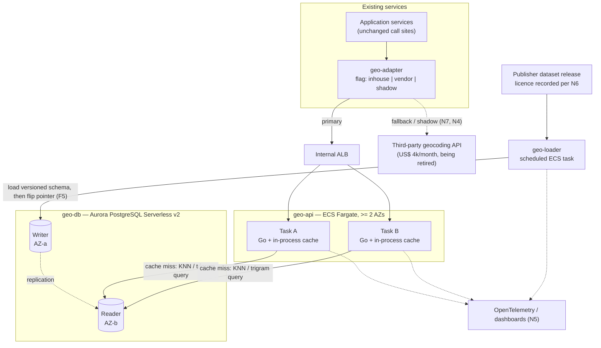
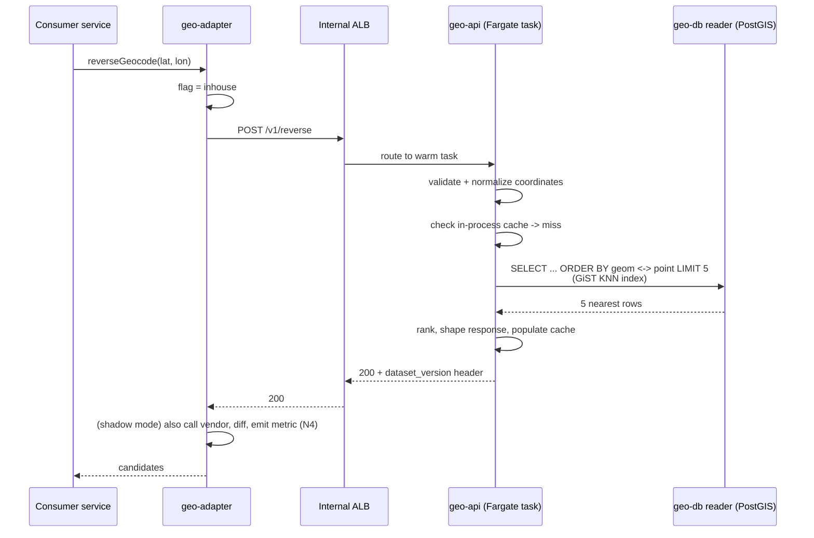

# RFC — In-house address lookup and geocoding service

**Status:** draft — awaiting review
**Current working focus:** concluded (recommendation stated; blocked on one external gate, see R-LEGAL)
**Author:** Lucas Marques
**Date:** 2026-09-08

> **Read this first.** Two things about the framing of the request changed the shape of this document,
> and both are called out where they bite:
>
> 1. **Go is not one of the decisions.** All three candidate options were "… in Go", so the language is
>    a settled constraint, not an alternative. It is recorded in *Constraints already settled* rather
>    than analysed in the tradeoff table — see the note there for why it still gets written down.
> 2. **The dataset licensing question is not a caveat, it is the gate.** A service that geocodes has
>    no reason to exist without data it is allowed to serve. Legal clearance is therefore promoted from
>    a footnote to a hard requirement (**N6**) and a blocking phase (**Phase 0**), and the recommended
>    architecture is deliberately chosen so that the compute/storage decision survives whichever way
>    legal lands.

## Related documents

Nothing was supplied with the request. These need to exist before this RFC can be approved, and each
one is owned by a task in *Tasks and roadmap*:

- Current vendor invoice and contract (term, notice period, per-request rate, any minimum commitment).
- Vendor request volume and endpoint breakdown for the last 90 days (from the API gateway / vendor
  dashboard).
- The written legal opinion on commercial use of the postcode dataset (blocking — see N6).
- Golden query set: a sample of real historical queries with the vendor's answers, for quality
  comparison.

---

## Context

Today, address lookup and geocoding are bought. When a user types an address, or when the system needs
to turn an address into coordinates (or coordinates back into an address), the application calls a
third-party HTTP API and pays per request. That bill is now around **US$ 4,000/month**, and it is pure
variable cost that grows with traffic.

The data underneath those calls is not exotic. Postcode-to-address and postcode-to-coordinate data is
published as a public dataset in most countries, and the query patterns — look up a key, match a
misspelled string, find the nearest point — are things a database has done well for twenty years. That
is what makes the vendor bill feel like rent rather than value: **we are paying a per-request price for
a static, publicly published dataset.**

So the proposal on the table is to run the service ourselves: a small Go service over our own copy of
the dataset, replacing the vendor behind the same call sites. Three stacks were suggested — Lambda +
Aurora Serverless, Lambda + DynamoDB, or Fargate + Aurora Serverless — with a target of **p95 under
100 ms**.

**Why it matters now:** the cost is recurring and compounding, and the migration only gets more
expensive the more call sites accumulate against the vendor's response shape.

**And one thing stands in the way.** Legal has not confirmed that the public postcode dataset can be
used commercially. "Public" and "free to use in a commercial product" are different things — open data
licences range from fully permissive to share-alike to research-only, and some national postcode
products are explicitly licensed per-seat or per-lookup precisely to prevent this substitution. Until
that answer arrives, the input to the whole service is unconfirmed, which is why this RFC treats it as
a gate and not a risk to be mitigated later.

**The problem to solve:** decide the architecture of an in-house address and geocoding service that
meets the latency target and costs materially less than US$ 4,000/month — and decide it in a way that
does not collapse if the dataset licence comes back restricted.

### Out of scope

- **Whether to build at all versus renegotiating the vendor contract.** The request is to recommend one
  of the build options. Renegotiation appears in the tradeoff analysis as the honest baseline
  (alternative **S3**), because a decision to build is not trustworthy without it, but the business
  case for build-vs-buy is not re-litigated here.
- **The dataset licensing determination itself.** This RFC records it as a requirement and a blocking
  gate. It does not offer a legal opinion, and nothing in it should be read as one.
- **Client-side changes.** The service is designed to slot in behind existing call sites via an
  adapter; consumers are not modified beyond a configuration flag.
- **Address data written or corrected by users.** The dataset is treated as read-only and
  vendor-published. A user-contributed address-correction workflow is a separate, later problem.
- **Non-postcode-country coverage.** See assumption **A2** — international coverage, if it is in scope,
  changes the data-sourcing analysis substantially and needs its own pass.

### Constraints already settled

These are inputs, not decisions. They are recorded so a future reader does not mistake them for
options that were weighed here.

- **Language: Go.** All three candidate options in the request were "in Go", so the language question
  was decided before this RFC opened. Recording the reasoning anyway, because an unwritten constraint
  becomes a mystery in eighteen months: Go fits this workload well — a compiled single binary with
  fast startup (which matters for both a Lambda cold start and a Fargate rolling deploy), a small
  memory footprint, mature PostGIS/Postgres and DynamoDB drivers, and cheap concurrency for an
  I/O-bound request/response service. No part of the analysis below pushes back on it. *If Go is in
  fact still open, say so — it does not change the recommendation, but it would add a dimension to the
  tradeoff table.*
- **Cloud: AWS.** Implied by every option offered (Lambda, Fargate, Aurora, DynamoDB).
- **Replacement, not extension.** The service replaces the vendor for the endpoints it covers; the
  target is parity, not new capability.

### Assumptions

Nothing was available to verify these against — no codebase, no dashboards, no invoice. Each one is
labelled with how much the recommendation moves if it turns out wrong, and each has a matching question
raised back to the requester.

| # | Assumption | Basis | If wrong |
| --- | --- | --- | --- |
| **A1** | Scope is the four workloads in *Functional requirements*: postcode lookup, free-text address autocomplete/validation, forward geocoding, reverse geocoding. | Inferred from "address **and** geocoding APIs" (plural, two capabilities). | **Decisive.** If only exact postcode lookup is in scope, DynamoDB — or no database at all — becomes the better answer and this recommendation flips. This is the single highest-leverage unknown. |
| **A2** | Single country, single postcode dataset. | "*the* public postcode dataset", singular. | Multi-country multiplies dataset size, licensing surface (one clearance per country), and normalization work. Compute/store shape survives; effort estimate and N6 do not. |
| **A3** | Request volume is modest — order 10⁵–10⁶ requests/month, average well under 10 req/s, spiky within that. | Inference from the bill: at commodity geocoding list rates of roughly US$ 4–5 per 1,000 requests, US$ 4,000/month implies ≈ 0.8–1M requests/month ≈ 0.3–0.4 req/s average. **Unverified — the US$ 4,000 could equally be a flat enterprise licence, in which case volume is unconstrained by this arithmetic.** | Low volume is what makes always-warm compute cheap and makes the DB hop the dominant cost in the latency budget. At 100× the volume, both the cost model and the cold-start analysis need redoing. |
| **A4** | The dataset is small enough to hold in memory on a commodity container — order 10⁶ rows and a few hundred MB for postcode-centroid data. | National postcode-centroid datasets are typically in this range; full address-point datasets are not. | Kills the in-process-index option (**D3**) and the caching path in the recommendation. Aurora/PostGIS core recommendation survives. |
| **A5** | p95 ≤ 100 ms is **server-side, measured at the service boundary**, not client-observed end-to-end. | Standard reading of a latency target stated for a service. | If it means client-observed, the internet round-trip consumes most of the budget and the answer becomes edge caching (CloudFront in front of the service), which no offered option provides. |
| **A6** | The dataset refreshes on a slow cadence — monthly or quarterly publisher releases — with no user-driven writes. | How national postcode datasets are published. | A high-frequency write path would make the read-only optimizations in the design invalid. |
| **A7** | Availability must at least match the vendor's SLA, i.e. ≥ 99.9%. | An in-house replacement that is less reliable than what it replaces is a regression, not a saving. | A stricter target (99.99%) forces multi-region and changes the cost model. |

---

## Requirements

Only the requirements that actually shape the structure. Feature-level detail (exact response fields,
pagination style) is deliberately left out; it does not change which stack wins.

### Functional

| # | Requirement | Why it is architecturally relevant |
| --- | --- | --- |
| **F1** | **Postcode lookup:** given a full postcode, return the canonical address components (street, locality, region). Exact-key access. | Shapes the data model — this one is a plain key/value read and is satisfied by every candidate store. |
| **F2** | **Free-text address autocomplete and validation:** given partial, abbreviated, or misspelled user input, return ranked candidate addresses. Must tolerate typos and word reordering. | **Forces a text-search capability to exist** — prefix matching, trigram similarity, or a search index. This is the requirement that eliminates a candidate. |
| **F3** | **Forward geocoding:** address or postcode → latitude/longitude. | Key access plus a stored coordinate; satisfied broadly. |
| **F4** | **Reverse geocoding:** latitude/longitude → nearest address/postcode, k-nearest-neighbour over the whole dataset. | **Forces a geospatial index to exist.** A nearest-neighbour query over millions of points without a spatial index is a full scan and cannot meet N1. Second requirement that eliminates a candidate. |
| **F5** | **Atomic dataset refresh:** ingest a new publisher release with no downtime, never serving a half-loaded dataset, and with the ability to roll back to the previous release. | Forces versioned data and a swap mechanism (index alias, table swap, or artifact version) into the design. Hard to bolt on later. |
| **F6** | **Drop-in replacement:** expose the capability behind an internal adapter so existing call sites switch by configuration, with the vendor reachable as a fallback for the whole rollout. | Makes the migration reversible, which is the only reason this can be rolled out safely at all. Cross-cutting and expensive to retrofit. |

### Non-functional

| # | Requirement | Target |
| --- | --- | --- |
| **N1** | **Latency** | p95 ≤ 100 ms and **p99 ≤ 250 ms**, server-side at the service boundary, measured under 2× observed peak, **with cold starts and cache misses included in the sample.** A p95-only target is gameable by an architecture with a bad tail — hence the companion p99. |
| **N2** | **Availability** | ≥ 99.9% monthly, multi-AZ. No single-AZ dependency in the request path (A7). |
| **N3** | **Cost** | Steady-state infrastructure ≤ US$ 500/month — an order of magnitude below the US$ 4,000 it replaces, so the saving is not eaten by infrastructure. Plus a named maintenance ceiling: ≤ 4 engineer-days per quarter for dataset refresh and upkeep. |
| **N4** | **Result quality** | Match rate and geocode accuracy **no worse than the vendor** on the golden query set, verified in shadow mode before any traffic cutover. Threshold agreed with the product owner before Phase 2 starts. This is the requirement a cost-driven project is most likely to skip and most likely to regret. |
| **N5** | **Observability** | Structured logs with a correlation ID; OpenTelemetry traces spanning request → data store; dashboards for p50/p95/p99, error rate, match rate, cache hit rate, **and the dataset version currently being served**. |
| **N6** | **Data licensing** | **Every dataset in production is covered by a written, recorded commercial-use clearance.** No production traffic is served from a dataset without one. Non-negotiable, business-critical, and irreversible in the bad direction — serving unlicensed data creates legal exposure that dwarfs a US$ 48,000/year saving. |
| **N7** | **Reversibility** | Vendor fallback behind a flag, exercised (not merely present) throughout rollout. The vendor contract is not cancelled until the in-house service has held 100% of traffic at quality parity for 30 days. |

Note the shape of this list: **N6 and N1 are the two requirements that decide the outcome**, and they
pull in different directions from the ones the request emphasised (cost). Cost turns out not to
discriminate between the options at all — see *Cost model*.

---

## Design

The recommended design, stated first so the tradeoff analysis has something concrete to argue against.

### Components

| Component | Responsibility | Requirements served |
| --- | --- | --- |
| **`geo-api`** — Go service on **ECS Fargate**, ≥ 2 tasks across ≥ 2 AZs behind an internal ALB | HTTP request handling, input normalization and sanitization, query planning, response shaping | F1–F4, N1, N2 |
| **In-process hot cache** inside `geo-api` | LRU cache of resolved postcodes plus a preloaded postcode-centroid table; removes the network hop for the common case | N1 |
| **`geo-db`** — Aurora PostgreSQL Serverless v2, writer + reader across AZs, with **PostGIS** and **pg_trgm** | Canonical dataset; `GiST` spatial index for KNN reverse geocoding; trigram + full-text indexes for fuzzy matching | F1–F4, F5, N2 |
| **`geo-loader`** — scheduled ECS task (Go, same repo) | Downloads a publisher release, normalizes it, loads into a **versioned schema**, validates row counts and spot-checks, then flips a pointer to activate | F5, N4, N5 |
| **`geo-adapter`** — client library in each consuming service | One interface, two implementations (in-house / vendor), selected by a flag; emits both results in shadow mode for comparison | F6, N4, N7 |
| **Dataset registry** — a table plus a field in the RFC | Records dataset version, source URL, licence, and the clearance reference for each release in production | N6, N5 |

Every component above names a requirement. Nothing else is proposed — notably **no OpenSearch, no
Redis, no API Gateway, no separate read cluster**. Each was considered and cut: OpenSearch because
PostGIS+pg_trgm already covers F2/F4 and OpenSearch would reintroduce the cost this project exists to
remove; Redis because the in-process cache serves the same purpose at zero extra infrastructure for a
read-only dataset; API Gateway because the callers are internal and an ALB is cheaper per request.

### Static diagram

### Dynamic diagram — reverse geocoding on a cache miss (the worst realistic path for N1)

Numbered, in case the diagram does not render:

1. Consumer calls `geo-adapter`; the adapter reads the rollout flag and picks the in-house path.
2. Request reaches the internal ALB and is routed to one of ≥ 2 always-warm Fargate tasks.
3. The task validates and normalizes the input (sanitization is part of F2's handling of arbitrary
   user text).
4. The task checks its in-process cache. **Hit → respond, no network hop.** Miss → continue.
5. The task issues a PostGIS KNN query (`ORDER BY geom <-> point LIMIT k`, served by a GiST index)
   against the Aurora **reader**, in the same region, one hop.
6. The task ranks candidates, shapes the response, stamps the `dataset_version` header, and populates
   the cache.
7. In shadow mode the adapter also calls the vendor, diffs the two answers, and emits a match metric
   (N4). The consumer still gets exactly one answer.

### Dataset refresh flow (F5)

1. `geo-loader` runs on schedule, fetches the publisher release, and records source URL + version +
   licence reference in the dataset registry (N6).
2. It loads into a **new versioned schema** (`geo_v2026_09`), building all indexes there. Live traffic
   is untouched throughout.
3. It validates: row count within an expected delta of the previous release, a fixed set of spot-check
   postcodes resolving correctly, no null coordinates above a threshold.
4. On pass, it flips a pointer (a `search_path` update or view swap) inside one transaction. Tasks pick
   up the new version and flush their caches.
5. On fail, it aborts and alerts; the previous schema is still live. Rollback is flipping the pointer
   back, and the previous schema is retained for one cycle.

### Cost model

**All figures below are order-of-magnitude estimates from AWS us-east-1 list prices as I recall them,
and they are NOT verified.** They must be re-run in the AWS Pricing Calculator against the real region
and the real volume (A3) before approval — that is a task in the roadmap. The conclusion they support
is robust to being wrong by several multiples, which is the only reason they are useful here.

| Line item | Estimated basis | Estimated monthly |
| --- | --- | --- |
| Fargate compute | 2 tasks × 0.5 vCPU × 730 h × ~$0.04/vCPU-h | ≈ $30 |
| Fargate memory | 2 tasks × 1 GB × 730 h × ~$0.0044/GB-h | ≈ $7 |
| Aurora Serverless v2 | 2 instances × 0.5 ACU (minimum) × 730 h × ~$0.12/ACU-h | ≈ $88 |
| Aurora storage + I/O | a few GB, low request volume (A3) | ≈ $5–20 |
| Internal ALB | base + low LCU | ≈ $20 |
| Data transfer, logs, traces | low volume | ≈ $10–30 |
| **Estimated total** | | **≈ $160–195/month** |

Three conclusions follow, and they matter more than the arithmetic:

1. **Cost does not discriminate between the three offered options.** Every one of them lands in the
   low hundreds of dollars against a US$ 4,000 bill. Choosing on infrastructure cost would be choosing
   on noise. **N1 (latency), F2/F4 (query capability), and N6 (licensing) are the real deciders.**
2. **The genuine cost of building is engineering time, not infrastructure** — roughly 6–8 engineer-weeks
   to build (estimated; see roadmap) plus the N3 maintenance ceiling of ≤ 4 days/quarter, forever. That
   is the number the business case turns on, and it is the number a "save $4k/month" framing tends to
   leave out. At typical loaded engineering cost, payback on the initial build lands within the first
   year, and the recurring maintenance is a permanent tax the vendor currently absorbs.
3. **Aurora Serverless v2's headline feature is largely wasted here.** Scale-to-zero has a resume
   latency measured in seconds, which is incompatible with N1, so the cluster must stay at its minimum
   capacity 24/7. We are effectively paying for a small provisioned instance with an autoscaling
   feature we cannot use. That observation opens an unlisted alternative — see **D4**.

---

## Alternatives analysis (Tradeoff)

Grouped by the dimension being decided. Note first what the three offered options actually are: a
subset of a **2 × 2** (Lambda | Fargate) × (Aurora | DynamoDB). The fourth cell was not offered and is
included below (**C3**), along with two options nobody listed that turned out to matter (**D3**,
**D4**) and the honest do-not-build baseline (**S3**). Go is absent from this table on purpose — it is
a settled constraint, not an alternative (see *Constraints already settled*).

### Dimension 1 — Compute

| Alternative | Pros | Cons | Risk (description) | Impact | Probability | Mitigation | Contingency |
| --- | --- | --- | --- | --- | --- | --- | --- |
| **C1 — AWS Lambda** | No idle cost; scales to zero and to spikes without capacity planning; least operational surface; Go's fast init makes it a reasonable Lambda language | Cold starts land directly in the N1 budget; VPC + connection management to Aurora needs RDS Proxy; **an in-process cache is nearly useless because the execution environment is not stable** — which removes the design's main latency lever | **Bursty concurrency causes cold starts inside the p95, not just the p99.** Autocomplete (F2) fires several requests per keystroke; concurrent requests each need their own execution environment, so a typing user generates a burst of cold starts. Counterintuitively, low average traffic (A3) makes this *worse*, not better — there is no steady stream keeping a pool warm | High | **High** | Provisioned Concurrency sized to peak burst; ARM64; keep the binary small; debounce autocomplete client-side | Move to Fargate — i.e. accept now that the mitigation converges on always-warm compute anyway |
| | | | Provisioned Concurrency to fix the above costs the same as always-on compute while keeping Lambda's constraints | Medium | High | Model the cost of Provisioned Concurrency against Fargate before committing | Same — move to Fargate |
| | | | Aurora connection exhaustion under burst without pooling | Medium | Medium | RDS Proxy in front of Aurora; reserved concurrency ceiling | Raise proxy capacity; add per-caller rate limiting |
| **C2 — ECS Fargate** ✅ | **Always warm — no cold start in the request path, which is the single biggest N1 lever**; a long-lived process makes the in-process cache and preloaded dataset actually work; ordinary connection pooling, no RDS Proxy needed; trivial to load-test and profile because the process is stable | Pay for idle capacity (≈ $37/month estimated — immaterial against $4,000); you own task sizing, autoscaling policy, and rolling deploys; slightly more infrastructure to define | Over-provisioned or under-provisioned task sizing | Low | Medium | Right-size from the Phase 1 load test; target-tracking autoscaling on CPU and ALB request count | Resize tasks; it is a config change, not an architecture change |
| | | | A rolling deploy briefly serves from cold caches, causing a latency blip | Low | Medium | Warm the cache in the container start-up probe before the task reports healthy | Increase minimum healthy percent; deploy in low-traffic windows |
| **C3 — Fargate + DynamoDB** (the unoffered fourth cell) | Combines always-warm compute with a store that has no capacity floor | Inherits every DynamoDB query-model problem below (**D2**) without solving anything C2 does not | Same as D2 | High | High | — | — |
| **C4 — EKS / Kubernetes** | Consistent with a broader platform if one already exists | Enormous operational surface for one small read-only service; not among the options offered | Operational cost dwarfs the service | Medium | High | — | Rejected: fails the "simplify ruthlessly" test |

**Against the requirements:** C1 is the only compute option with a credible path to *missing* N1, and
it does so exactly under the workload shape F2 implies. C2 meets N1, N2, and N3 without novelty.

### Dimension 2 — Data store

| Alternative | Pros | Cons | Risk (description) | Impact | Probability | Mitigation | Contingency |
| --- | --- | --- | --- | --- | --- | --- | --- |
| **D1 — Aurora PostgreSQL Serverless v2 (PostGIS + pg_trgm)** ✅ | **The only offered store that satisfies F2 and F4 natively**: GiST KNN for nearest-neighbour, `pg_trgm`/FTS for typo-tolerant matching, both mature and well documented; relational model fits a normalized address hierarchy; versioned-schema swap gives F5 cleanly; ad-hoc SQL makes quality analysis (N4) and data debugging easy; team almost certainly already runs Postgres | Autoscaling value is wasted (cannot scale to zero under N1) so it is a provisioned cost in disguise; a network hop per cache miss; index tuning is real work; single writer | **PostGIS/trigram query latency exceeds the N1 budget on the largest queries** (broad prefix + KNN on millions of rows) | High | Medium | Measure in Phase 1 **before building**; GiST/GIN indexes sized and `ANALYZE`d; cap `k`; in-process cache to absorb the common case; route reads to the reader | Precompute a materialized candidate table; fall back to the in-process index (**D3**) for the hot path |
| | | | Serverless v2 minimum-capacity cost creeps as the dataset and index grow | Low | Medium | Alarm on ACU utilization; review capacity floor quarterly | Move to a right-sized provisioned instance (**D4**) |
| | | | Writer AZ failure interrupts `geo-loader`, not reads | Low | Low | Multi-AZ cluster; reads served from the reader | Failover; refresh reruns on schedule |
| **D2 — DynamoDB** | Genuinely excellent for **F1 and F3**: single-digit-millisecond point reads on a partition key, no capacity floor, no connection management, on-demand billing that truly goes to near-zero at low volume, effortlessly scalable | **Cannot satisfy F2 or F4 as a query engine.** No full-text or fuzzy matching — a misspelled address cannot be matched without scanning. No native geospatial index; KNN requires hand-rolled geohash sort keys (the awslabs pattern) with multi-cell fan-out queries and client-side distance ranking. Ad-hoc quality analysis (N4) is painful | **The workarounds needed for F2/F4 reintroduce the cost and complexity this project exists to remove.** The standard fix is DynamoDB + OpenSearch, which adds a cluster costing more than the entire Aurora option and a second store to keep in sync | High | **High** | None that preserves the premise — the mitigation *is* adding a second system | Use Aurora/PostGIS (D1) |
| | | | Hand-rolled geohash KNN is subtly wrong near cell boundaries and at varying densities — the failure mode is "returns a slightly wrong nearest address", which is silent and customer-facing | High | Medium | Extensive boundary test cases; adaptive precision; diff against vendor in shadow mode (N4) | Abandon in favour of PostGIS |
| | | | Access patterns must be fixed up front; a new query shape means a new GSI or a backfill | Medium | High | Model all access patterns before building | Add GSIs; migrate the table |
| **D3 — In-process read-only index, no database in the request path** (unoffered) | **Fastest possible option — zero network hops, so the N1 budget is spent entirely on compute**; removes the store from the availability chain (N2); cheapest by a wide margin (N3); the dataset is read-only and small (A4, A6), which is exactly the shape this suits; refresh becomes "ship a new artifact", which is F5 for free | Memory footprint scales with the dataset and dies if A4 is wrong; refresh requires a deploy; **we would own the spatial and fuzzy-match index code** instead of using PostGIS; no ad-hoc querying for N4; every task holds a full copy | Dataset outgrows container memory (full address points rather than postcode centroids, or multi-country per A2) | High | Medium | Confirm real dataset size in Phase 0; measure resident memory in Phase 1 | Fall back to D1; the service interface does not change |
| | | | Hand-rolled KNN/fuzzy ranking is less accurate than PostGIS, risking N4 | Medium | Medium | Use a maintained Go spatial library rather than writing one; diff against vendor in shadow mode | Move the hot path back to D1 |
| **D4 — Right-sized provisioned Aurora / RDS Postgres** (unoffered) | Same capability as D1 (PostGIS + pg_trgm) at a predictable, possibly lower price for a steady tiny workload; no ACU model to reason about | No burst headroom without manual resize; a reserved-instance commitment is a bet on volume we have not measured (A3) | Traffic grows past the instance and needs a resize window | Medium | Low | Alarm on CPU/connections; keep headroom | Scale up (brief failover) or move to Serverless v2 |

**Against the requirements:** D2 fails F2 and F4 outright — that is not a close call, and it is the
clearest finding in this document. D1, D3, and D4 all satisfy F1–F5. D1 does so with the least novel
code; D3 with the least latency and cost but the most owned code; D4 is D1 with a different billing
model.

### Dimension 3 — Data sourcing (the gate, N6)

This dimension was not in the request. It should have been, because it can invalidate the other two.

| Alternative | Pros | Cons | Risk (description) | Impact | Probability | Mitigation | Contingency |
| --- | --- | --- | --- | --- | --- | --- | --- |
| **S1 — Public postcode dataset** (the assumed plan) | Free; no per-request cost; the entire premise of the ~$48k/year saving | **Commercial-use rights unconfirmed.** Open-data licences vary from permissive to share-alike to non-commercial, and some national postcode products are licensed specifically to prevent this kind of substitution; attribution or share-alike terms may carry obligations of their own | **Legal returns "no commercial use" (or "yes, with conditions we cannot accept") after the build has started** — the service then has no data to serve and the spend is written off | **High** | **Medium** | **Do not start the build. Get the written opinion first (Phase 0, blocking, N6).** Have legal rule on the specific named release and licence version, not "postcode data" in general; record the clearance in the dataset registry | Switch to **S2** — the architecture is deliberately dataset-agnostic, so only the loader and the cost model change, not the service |
| | | | Licence permits use but requires public attribution or share-alike terms that conflict with product or contractual constraints | Medium | Medium | Ask legal to enumerate obligations, not just yes/no; design an attribution surface if needed | Renegotiate the obligation, or move to S2 |
| | | | Public data quality is worse than the vendor's (stale, sparse, poorly normalized) — a silent N4 failure | Medium | Medium | Shadow-mode diff on the golden set before any cutover (N4); publish a match-rate dashboard | Hybrid: in-house for the clean majority, vendor for low-confidence queries; or S2 |
| **S2 — Licensed commercial dataset (bulk licence)** | Legally unambiguous; usually better quality, normalization, and support than open data; **still a flat annual fee rather than per-request, so a saving against $4,000/month is plausible even after paying for it**; keeps the whole in-house architecture intact | Costs money, shrinking the saving; procurement takes time; may carry redistribution or caching restrictions that constrain the design | Licence cost erodes the business case | Medium | Medium | Get quotes **in parallel with Phase 0**, so the decision is informed rather than sequential | If a licence costs near $4,000/month, do not build — fall back to S3 |
| **S3 — Keep the vendor / renegotiate** (the honest baseline) | Zero engineering cost; zero legal exposure; no dataset maintenance forever; **$4,000/month is a plausible negotiating position, especially with a credible in-house alternative costed** | The recurring cost stays and grows with traffic; the dependency stays | We build for 8 weeks and discover a renegotiation would have captured much of the saving for a week of effort | Medium | Medium | **Request a revised quote in Phase 0 — in parallel, at no cost.** A costed in-house plan is the strongest leverage available | Accept the new rate and stop; this RFC then becomes the record of why not to build |

---

## The decision

**Recommendation: Fargate + Aurora Serverless v2 (PostgreSQL with PostGIS and pg_trgm), in Go — one of
the three options offered — gated on written legal clearance of the dataset (N6) before any build work
starts.**

**Decision style: autocratic.** The technical recommendation is mine to make and I own it. Two parts of
it are explicitly *not* mine: the **N6 licensing determination is legal's call and is a hard gate**, and
the **N4 quality-parity threshold is the product owner's call**. Both are recorded as blocking inputs
rather than quietly absorbed into an engineering decision.

Reading the whole analysis back, the reasoning reduces to three findings:

1. **DynamoDB is out on capability, not on cost.** F2 (typo-tolerant free-text matching) and F4
   (nearest-neighbour search) are the two requirements that shape this system, and DynamoDB satisfies
   neither as a query engine. Making it work means hand-rolled geohash fan-out plus, realistically, an
   OpenSearch cluster — which costs more than the entire Aurora option and adds a second store to keep
   in sync. That eliminates both Lambda + DynamoDB and the unoffered Fargate + DynamoDB. If scope
   turns out to be exact postcode lookup only (**A1** wrong), DynamoDB becomes an excellent answer and
   this conclusion reverses — which is why A1 is the first question in the reply.
2. **Lambda is out on the tail, and the argument is the opposite of the intuitive one.** Serverless is
   usually justified by low, spiky traffic — and this workload has exactly that (**A3**). But at low
   average volume nothing keeps a warm pool alive, while autocomplete produces bursts of *concurrent*
   requests, each needing its own execution environment. Cold starts therefore land inside the p95, not
   safely out in the p99. Worse, Lambda's unstable execution environment neuters the in-process cache,
   which is the design's main latency lever. Provisioned Concurrency fixes the symptom by paying for
   always-warm capacity — at which point we have Fargate's cost with Lambda's constraints. Choose
   always-warm compute directly.
3. **Cost is not the discriminator, and that reframes the project.** Every option lands in the low
   hundreds of dollars against a US$ 4,000 bill (see *Cost model*). The real price of building is
   engineering time — roughly 6–8 engineer-weeks up front, plus a permanent ≤ 4 days/quarter of dataset
   maintenance the vendor currently absorbs. So the recommendation is not "the cheapest stack"; it is
   **the stack that needs the least novel code**, because engineering time is the scarce resource here.
   Aurora/PostGIS wins on precisely that: PostGIS KNN and `pg_trgm` are mature, well-documented
   solutions to F2 and F4 that we do not have to write, test, or debug.

**Two deliberate deviations from a literal reading of the request:**

- **Go was not analysed as a choice.** It was common to all three options, so it was already settled;
  it is recorded as a constraint with the reasoning that supports it, so the next reader knows it was
  seen and not skipped.
- **The legal caveat was promoted to a hard gate (N6, Phase 0).** Not because process demands it, but
  because it is the only failure mode in this document that can write off the entire project. It is
  also cheap to close: a written opinion on a named dataset release, requested in parallel with two
  other zero-cost Phase 0 activities.

### The strongest objection to this recommendation

*Fargate + Aurora keeps a database in the request path that this workload does not obviously need.* The
dataset is read-only, refreshed monthly, and (per **A4**) small enough to fit in a container's memory.
An in-process index (**D3**) would be faster, cheaper, and would remove the store from the availability
chain entirely — a strictly better fit for the data's actual shape.

The objection is correct on the merits, and I still reject D3 as the *initial* choice, because it trades
mature PostGIS ranking for spatial and fuzzy-match index code we would own, and it stakes the whole
design on an unverified assumption about dataset size. Given that engineering time is the scarce
resource (finding 3), buying PostGIS's correctness with one network hop is the right trade *at the
start*. So D3 is not discarded: it is the documented Phase 2 escape hatch. The in-process cache in the
design is deliberately the first step toward it, and moving further costs no interface change.

### What would flip this decision

Written down so a reviewer can attack the decision at its weak points rather than at a strawman:

| Condition | New answer |
| --- | --- |
| **A1 wrong** — scope is exact postcode lookup only, no fuzzy matching, no reverse geocoding | **DynamoDB, or D3 with no database at all.** The requirements that eliminate DynamoDB disappear |
| **A3 wrong** — traffic is genuinely high and sustained (not bursty-low) | Lambda's cold-start objection weakens considerably; reconsider **C1**, and re-run the cost model |
| **A5 wrong** — 100 ms is client-observed, not server-side | None of the three options suffices; the answer becomes edge caching (CloudFront) in front of whichever compute is chosen |
| **Phase 1 shows PostGIS misses p95** | **D3** — in-process index for the hot path, Aurora demoted to source-of-truth and analysis |
| **Legal returns "no commercial use"** | **S2** (licensed dataset) with the same architecture, or **S3** (stay with vendor) if licence cost approaches the current bill |
| **The vendor offers a large discount in Phase 0** | **S3.** Do not build. This RFC becomes the record of why |
| **A2 wrong** — multi-country coverage in scope | Recommendation holds structurally, but N6 multiplies (one clearance per dataset) and effort roughly doubles |

---

## Launch strategy

Phased so the expensive, irreversible work happens *after* the cheap questions are answered. Phase 0 is
blocking and costs almost nothing.

**Phase 0 — Close the gates (≈ 1 week, blocking, three tracks in parallel).**
Nothing is built in this phase.
- **Legal (N6):** written opinion on commercial use of the *specific named dataset release and licence
  version*, including any attribution or share-alike obligations. **Nothing proceeds without this.**
- **Scope and volume:** confirm **A1** (which of F1–F4 are actually in scope) and **A3** (90 days of
  real request volume and endpoint mix from the vendor dashboard). A1 can reverse the recommendation.
- **Baseline (S2/S3):** request a revised vendor quote and a bulk-dataset licence quote. Both are free
  to ask, and a costed in-house plan is the strongest negotiating position available. If the vendor
  discount is large enough, the correct outcome of this RFC is not to build.

**Phase 1 — Latency spike (2–3 days, go/no-go on N1).**
Load the real dataset into Aurora with PostGIS + pg_trgm, replay the real query mix from Phase 0, and
measure p50/p95/p99 for each of F1–F4 at 2× peak. Measure resident memory for the full dataset to test
**A4** and keep **D3** viable. **Gate: if p95 misses 100 ms, switch to D3 before building anything
else.** This is the axe-sharpening — it de-risks the one requirement that could invalidate the design.

**Phase 2 — Build and shadow (≈ 4–5 weeks).**
Build `geo-api`, `geo-loader`, `geo-adapter`, and the dataset registry. Run in **shadow mode**: every
consumer call goes to both the in-house service and the vendor, the consumer receives the vendor's
answer, and the two are diffed. **Gate: N4 quality parity on the golden set** before any real traffic.

**Phase 3 — Canary (≈ 2 weeks).**
Flag-driven cutover: 1% → 10% → 50% → 100%, each step held long enough to observe p95, p99, error rate,
and match rate. Vendor fallback stays armed and exercised (N7). Roll back by flipping the flag.

**Phase 4 — Decommission (after 30 days at 100%).**
Only after 30 days at full traffic and quality parity: give notice on the vendor contract. Keep the
adapter's vendor implementation in the codebase for one further quarter. **Do not cancel the contract
during Phase 3** — the fallback is the whole reason the rollout is safe.

---

## Tasks and roadmap

Estimates are for one engineer, and they are **estimates, not commitments** — they were made without
sight of the codebase, the dataset, or the team's Go and PostGIS experience.

| Task | Description | Estimate |
| --- | --- | --- |
| **Legal clearance (N6)** | Written opinion on commercial use of the named dataset release; record in the dataset registry. **Blocking** | 1w (elapsed, not effort) |
| Scope + volume baseline | Confirm A1/A3 from the vendor dashboard and product owner; assemble the golden query set | 2d |
| Vendor + licence quotes | Revised vendor quote (S3) and bulk dataset licence quote (S2) | 2d (elapsed) |
| **Latency spike (N1)** | Dataset into Aurora + PostGIS/pg_trgm; replay real query mix; p50/p95/p99 per endpoint at 2× peak; measure memory for A4. **Go/no-go gate** | 3d |
| Project setup | Go repo, hexagonal layout, CI, IaC skeleton for Fargate + Aurora | 2d |
| `geo-loader` + versioned schema swap (F5) | Download, normalize, load into versioned schema, validate, flip pointer, rollback path | 5d |
| Schema, indexes, migrations | Address tables, GiST spatial index, trigram/FTS indexes, `ANALYZE`, tuning | 4d |
| `geo-api` — F1/F3 | Postcode lookup and forward geocoding endpoints, in-process cache, tests | 3d |
| `geo-api` — F2 | Free-text autocomplete/validation, trigram ranking, input sanitization, tests | 5d |
| `geo-api` — F4 | Reverse geocoding, PostGIS KNN, boundary tests | 3d |
| `geo-adapter` + shadow mode (F6, N7) | Interface, both implementations, flag, shadow diffing and match metric | 4d |
| Observability (N5) | Structured logs + correlation ID, OTel traces, dashboards incl. dataset version and match rate | 3d |
| Quality validation (N4) | Golden-set comparison harness, agreed parity threshold, report | 3d |
| Load test (N1) | k6 at 2× peak against the deployed service, cold caches and deploys included | 2d |
| Canary rollout | Staged flag cutover with observation windows | 2w (elapsed) |
| Vendor decommission | Notice, adapter cleanup after one further quarter | 1d |

**Roughly 6–8 engineer-weeks of effort** across Phases 1–3, plus elapsed time for gates and canary
windows. That figure — not the ≈ $170/month of infrastructure — is what the business case should be
judged against.

---

## Open questions

Recorded here because they could not be answered from the request. Every one has a labelled assumption
covering it above, so the document is usable as it stands, but the first two can change the outcome.

1. **(A1 — can reverse the recommendation) Which capabilities are actually in scope?** Postcode lookup
   only, or also free-text autocomplete and reverse geocoding? If it is only exact lookup, DynamoDB or
   an in-process index is the better answer.
2. **(A3 — changes the cost model and the Lambda analysis) What is the real request volume and endpoint
   mix?** The ≈ 1M requests/month inference is derived from the bill at assumed list rates and is
   unverified.
3. **(N6) Who owns the legal question, and when will the written opinion land?** Which dataset,
   publisher, and licence version specifically?
4. **(A5) Is the 100 ms p95 server-side or client-observed?** If client-observed, none of the three
   options is sufficient on its own.
5. **(A2) One country or several?**
6. **Is Go genuinely settled?** It was common to all three options so it was treated as a constraint.
   The recommendation does not depend on it.
7. **(S3) Has the vendor been asked for a better price?** It is free to ask and it is the cheapest
   possible outcome.
8. **(N4) What quality-parity threshold makes the cutover acceptable to the product owner?**

---

## Version history

| Version | Date | Author | Description |
| --- | --- | --- | --- |
| 1.0 | 2026-09-08 | Lucas Marques | Document created. Recommends Fargate + Aurora Serverless v2 (PostGIS + pg_trgm) in Go, gated on legal clearance (N6). Go recorded as a settled constraint rather than an alternative; dataset licensing promoted to a hard requirement and blocking Phase 0. |
