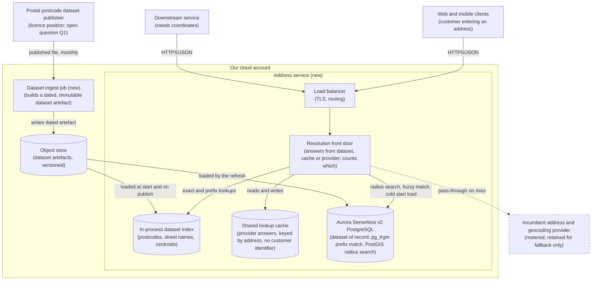
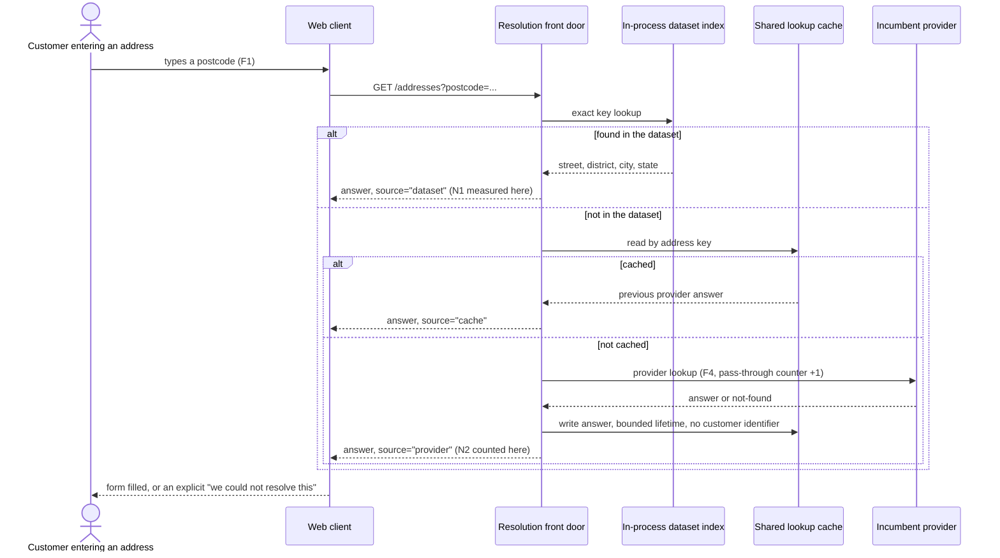
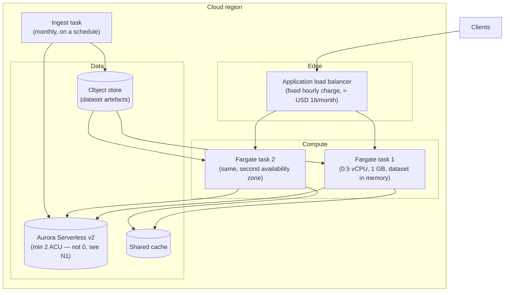

# RFC: How the company resolves addresses and coordinates

**Status:** proposed — three blocking questions are open (see *Assumptions and open questions*), and the
status cannot move to accepted while any of them is.
**Decider:** the engineering lead who owns the address entry path (*assumed* — nobody was named; see
open question Q4)  ·  **Reviewers:** legal counsel, the budget owner for third-party services, the
product owner for address entry, the on-call lead
**Current working focus:** decision

> **Read this first.** No number in this document is measured. There was no bill, no latency board, no
> request log and no code to read while writing it. Every figure below is labelled *assumed* (nobody
> checked, with the check that would settle it) or *estimated* (arithmetic shown, on top of an assumed
> or a published input). Two figures are firmer: cloud list prices, read from the vendors' public
> pricing material on 2026-09-08. The recommendation holds only as far as the assumptions do, and the
> Decision section says exactly which assumption would flip it.

---

## Reversibility

Two decisions of very different sizes were folded into one request, and separating them is most of the
value here.

**Two-way door — the runtime and the store.** Lambda versus Fargate, Aurora versus DynamoDB: each is a
few weeks of work to swap while the service keeps one HTTP contract, and none of them is visible to a
caller. Reversible, so they get proportionate space below.

**One-way door — where the address data comes from, and who is allowed to use it.** Building on a
dataset the company turns out not to be licensed to use commercially is not a rollback, it is a legal
exposure plus a rewrite of ingest, coverage and cost at once. The same is true of the data model that
the callers' contracts get written against. That is where the depth of this document goes.

The compute-and-store question the request asked (*"Lambda + Aurora, Lambda + DynamoDB, or Fargate +
Aurora?"*) is the reversible half. The unresolved half — whether we may use the dataset at all, and
whether our own dataset can even answer the questions the paid providers answer today — is the one
that decides whether any of the three gets built.

## Context

The company pays a third-party provider (or providers) for address lookup and geocoding, at
**USD 4,000/month** (*assumed*: stated in the request with no invoice attached; three months of the
provider invoice, split by endpoint, would confirm it and would also give the request volume that
everything below needs). Every address a customer types, every coordinate a downstream service needs,
is a metered call to somebody else's API.

Two capabilities are bundled inside "address and geocoding APIs", and they are not the same problem:

- **Address lookup.** Given a postcode, return the street, district, city and state. Given a partial
  street name, suggest completions. This is a lookup over a national reference dataset that changes
  slowly.
- **Geocoding.** Given a free-text address, return coordinates; given coordinates, return the nearest
  address (reverse geocoding). This is a matching-and-interpolation problem over a dataset that
  includes building-level geometry, and a national postcode file does not contain it.

The distinction matters more than the choice of database, because the request proposes to replace both
with a service built on a postcode dataset. A postcode dataset can replace the first outright. It can
only approximate the second, at postcode-centroid accuracy rather than rooftop accuracy — in a dense
urban postcode the centroid can be a few hundred metres from the door, and in a rural one, kilometres
(*assumed*: no accuracy comparison has been run; the check is in the proof-of-concept contract for Q2
below).

**The problem.** Address resolution is priced per request, so its cost grows with traffic while its
value per request stays flat, and the terms are set by a supplier the company does not control. Nobody
has yet established which share of that spend buys the part we can build ourselves (postcode lookup)
and which buys the part we cannot (rooftop geocoding).

### Current usage

Every row of this table is *assumed*. It is written from the shape of the request, not from
instrumentation, and it is the single most valuable thing to replace with measurement — the phase-1
work committed at the end of this document produces it within two weeks.

| Role (what they do with the system) | What they do today | Through what | How often or how much (source) |
| --- | --- | --- | --- |
| Customer entering an address at registration or checkout | Types a postcode, gets the street and city filled in, corrects the number | The web and mobile clients, which call the paid provider (directly or through our backend — unknown, and it changes the migration cost) | Unknown (*assumed*; the provider invoice's per-endpoint request count settles it) |
| Customer whose address the postcode cannot resolve | Types the full address by hand | The same forms | Unknown (*assumed*; the provider's not-found response rate settles it) |
| A downstream service needing coordinates for an address (routing, coverage, service-area checks) | Calls the geocoding endpoint per address | Server-to-server calls to the paid provider | Unknown (*assumed*) |
| Support agent fixing a customer's wrong address | Re-runs the lookup and edits the record by hand | The admin interface | Unknown (*assumed*) |
| On-call engineer when address lookup fails | Reads the provider's status page and waits | The provider's status page | Unknown (*assumed*; the incident log settles it) |

### Goals

| Goal | Who benefits | How we will know |
| --- | --- | --- |
| A customer who knows their address can finish entering it on the first attempt | Customers entering an address; the support agents who fix the failures | Share of address forms abandoned or submitted with an address that later needs correction |
| Resolving an address stops being priced per request, so growth in traffic no longer buys growth in supplier spend | The budget owner for third-party services | Monthly address-resolution spend, and its slope against request volume |
| The company keeps resolving addresses on terms it sets, when a supplier changes price or terms | Every role above; the company | Time to keep serving lookups after a hypothetical supplier cut-off, exercised as a drill |
| The company can show, on request, that the address data it uses is data it is entitled to use | Legal counsel; the company | A written licence position on file for every dataset in production |

### Stakeholders

| Role (what they do with the system) | What they need from this decision | Who speaks for them |
| --- | --- | --- |
| Customer entering an address | Lookups that resolve at least as often as today, and no slower than they notice | Product owner, address entry |
| Downstream service consuming coordinates | Coordinates accurate enough for whatever it decides with them (a service-area check tolerates far more error than a courier hand-off) | The owning team of each consumer — not yet identified (Q2) |
| Support agent fixing addresses | No increase in wrong addresses reaching records | Head of support |
| On-call engineer | One service to diagnose, and a documented behaviour when the dataset or the fallback provider is unavailable | On-call lead |
| Budget owner for third-party services | Spend that stops scaling with requests, and a payback they can check | Finance |
| Legal counsel approving data use | A licence position on the dataset before it reaches production, not after | Legal counsel |
| Maintainer of the dataset refresh (a role that does not exist today and that this decision creates) | A refresh that is automated, verifiable and reversible | The team that would own the new service |
| The incumbent provider (negative stakeholder) | Nothing this decision owes them, beyond honouring the contract's exit terms | The contract owner (Q3) |

### Constraints

Externally imposed limitations only. A person inside the company cannot be the source of a constraint,
and a constraint excludes an option only by citing the clause that does it.

| Constraint | Source (outside the organization, or a signed commitment) | What it excludes, and the clause |
| --- | --- | --- |
| Query logs that tie a resolved address to an identified person are personal data and may be retained only as long as the stated purpose needs | Personal-data law in the jurisdiction of operation (assumed Brazil, LGPD Law 13.709/2018 Art. 6, principles of purpose and necessity; the EU equivalent is GDPR Art. 5(1)(c)) | Excludes nothing in this analysis. It constrains the design: the lookup cache is keyed by address, holds no customer identifier, and request logs carrying identifiers get a bounded retention |
| The incumbent provider contract's exit terms | The signed contract — **not read for this document** | Unknown until Q3 closes. If the contract carries an unexpired minimum commitment, it excludes nothing but it postpones every saving to the renewal date, which changes the payback in every row below |
| Whether the public postcode dataset may be used commercially | The dataset's licence, and the postal operator that publishes it | **Unknown.** This is *not yet a constraint*: an unanswered question excludes nothing. It is blocking question Q1 and it holds this document at *proposed*. If legal returns "no", it becomes a constraint and it excludes every option built on that dataset |

### Prior decisions

Decided inside the company. None of these excludes an option; each incumbent gets a row in the tradeoff
table with an alternative beside it, and the cost of reversing it is a cost in that row.

| Prior decision | Who made it, when | Incumbent it implies | Cost to reverse |
| --- | --- | --- | --- |
| Replace the paid providers with a service we build and run | The requester, in this request (*assumed* date: this quarter) | Build in-house | Low today, because nothing is built. This is the decision most worth reversing on evidence, so options D, E and F below are the alternatives beside it |
| The service is written in Go | The team, before this request (*assumed*: stated in the request as settled) | Go | Low for a new service; the row is in the table because "all three options are in Go" is a decision with no row of its own |
| The service runs on the current cloud provider (AWS, inferred from Lambda, Aurora, DynamoDB and Fargate being the only candidates) | Not stated (*assumed*: a standing platform decision predating this request) | AWS-managed compute and storage | High, and out of proportion to this decision. Recorded here rather than given a row |
| Serverless-first for new services (inferred: two of the three proposed options are Lambda) | Not stated (*assumed*) | Lambda | Low. It is contested in the tradeoff table, and the recommendation goes against it |

### Assumptions and open questions

**Blocking.** Any answer to any of these changes the decision, so the status stays *proposed* until all
three are closed. All three are closable inside two weeks, and the phase-1 work committed in the
Decision section closes Q2 by itself.

| Question | Owner | Date | If yes | If no |
| --- | --- | --- | --- | --- |
| **Q1. May the public postcode dataset be used commercially, in a service we operate for our own customers?** The postal operator that publishes the national postcode file licenses a commercial product from the same data (in Brazil, the Correios DNE, licensed commercially with no published price list; postal-operator material, read 2026-09-08). Whether the freely redistributed copies inherit that restriction is exactly the question legal has not answered | Legal counsel | 2026-09-22 | Options A, B, C and G stay on the table as written | Every option built on that dataset is excluded. The decision falls back to option E (license the operator's dataset — same design, unknown licence fee), to option F (an openly licensed dataset, which needs its own licence reading) or to option D (keep the providers behind our own cache and proxy). The cost case is rewritten, because a licence fee is a fixed cost the build was meant to remove |
| **Q2. What is the monthly request volume, and how does it split between postcode lookup, forward geocoding and reverse geocoding — and what coordinate accuracy does each consumer actually need?** | The engineering lead who owns address entry | 2026-09-22 (phase 1 produces it) | A postcode-lookup-dominated mix (*assumed* likely) means the in-house service covers most of the spend and the residual geocoding stays with a paid provider | A geocoding-dominated mix means a postcode dataset replaces little, the saving shrinks to the lookup share, and the honest answer is option D plus a re-scoped geocoding project (option F, an openly licensed geometry dataset, becomes the lead candidate) |
| **Q3. Does the incumbent contract allow us to reduce or exit spend before renewal, and when is renewal?** | The contract owner in finance | 2026-09-22 | The saving starts when the service ships, and the payback below holds | The saving starts at renewal. Building now spends engineering time months before it returns anything, and deferring the build while running phase 1 is the better decision |

**Non-blocking.** Proceeding on these without proof, each with what would close it:

- **The USD 4,000/month is all address and geocoding, and it is one provider, not several** (*assumed*).
  The invoice closes it. If part of that spend is bundled with something else (mapping tiles, routing),
  the saving is smaller than the headline.
- **The p95 target of 100 ms is a server-side target under our own peak, not an end-to-end target
  including the customer's network** (*assumed*: the request said "p95 under 100 ms" with no condition).
  It matters because today's number is almost certainly worse — a cross-internet call to a provider's
  API rarely lands under 100 ms at p95 — so the target may be an improvement being asked for rather
  than a parity being defended. One week of client-side timing on the current calls closes it, and it is
  the first thing phase 1 measures.
- **The national postcode dataset is of the order of 10^6 records** and therefore of the order of
  200 MB as a flat structure (*estimated* from an assumed record count at roughly 200 bytes each; the
  published file's size closes it in minutes). The number decides whether option F — no database at all
  — is viable, so it is cheap and worth settling early.
- **Peak request concurrency is unknown**, so N1's load condition below is written against the volume
  Q2 returns rather than against a number invented here.
- **Callers can tolerate a fallback.** The design assumes a lookup our dataset cannot resolve may be
  passed through to a paid provider rather than failing (*assumed*). If a caller cannot tolerate the
  extra latency of a fallback, N1 needs a per-endpoint target.

### Out of scope

Problems, not options. Every option considered is in the tradeoff table, including the ones that lose.

- **Cleaning up addresses already stored on customer records.** A data-remediation problem that this
  service makes possible and does not solve.
- **Route optimization and distance calculation.** Consumers of coordinates, not producers of them.
- **Addresses outside the country of operation.** Today's provider may cover them; a national postcode
  dataset will not, and whether that matters is part of Q2.

## Requirements

Six items in the request were reclassified before any requirement was written. "Replace the paid APIs
with our own service" is a prior decision by the requester, so its alternatives (D, E, F) are in the
tradeoff table rather than assumed away. "Lambda + Aurora", "Lambda + DynamoDB" and "Fargate + Aurora"
are design choices and became rows in that table. "All in Go" is a prior decision and got its own row,
because a shared choice with no row is a choice nobody reviewed. "p95 under 100 ms" was an unfinished
non-functional requirement — no condition, no derivation, no measurement — and is now N1 with its
target labelled *assumed*. "Legal hasn't confirmed the dataset" is a blocking question and sits in the
Decision, not in an appendix. "Recommend one" is what this document does, not something the system does.

Only architecturally-relevant requirements are listed: hard to reverse, structure-shaping, or a
cross-cutting quality with a target.

### Functional

| ID | Goal (a row of the Goals table) | Requirement (the role, and what the system does for it) | Proof (the scenario, and how it is run) | Source |
| --- | --- | --- | --- | --- |
| F1 | A customer finishes entering their address on the first attempt | A customer entering an address gets the street, district, city and state for a valid postcode | Given a set of 10,000 postcodes sampled across every state and weighted by the production request log, when each is looked up against the incumbent provider and against the new service, then the returned street, district, city and state match on at least 99.5% of them and every mismatch is listed for review; run as a comparison suite in CI against a snapshot of both | Context: postcode lookup is the capability a postcode dataset can replace outright |
| F2 | A customer finishes entering their address on the first attempt | A customer typing a partial street name in a known city sees candidate streets to pick from | Given 500 partial street inputs sampled from the production log, when each is submitted, then the street the customer eventually chose is among the first ten candidates in at least 95% of cases; run as a fixture test | Assumed: autocomplete is in use today (Q2 confirms whether the incumbent's autocomplete endpoint is called) |
| F3 | A customer finishes entering their address on the first attempt | A downstream service asking for the coordinates of an address receives coordinates, or an explicit "not resolvable at the accuracy you asked for" | Given 2,000 addresses with coordinates from the incumbent provider held as the reference, when each is resolved by the new service, then the response either carries coordinates within the accuracy stated in N4 or declares the address unresolved; no silent low-accuracy answer; run as a comparison suite | Context: a postcode dataset approximates geocoding at centroid accuracy; the requirement is that the caller is told which it got |
| F4 | The company keeps resolving addresses on terms it sets | A customer or downstream service whose lookup the in-house dataset cannot resolve still gets an answer, because the service passes that lookup through to a paid provider; the on-call engineer sees the pass-through rate per endpoint | Given a lookup for a postcode absent from the dataset, when a customer requests it, then the answer comes back from the fallback provider and the pass-through counter the on-call engineer watches increases; run as an integration test with the provider's sandbox, and watched in production | Assumed coverage gap; it is what makes a coverage shortfall survivable instead of a customer-facing regression |
| F5 | The company can show the address data it uses is data it may use | The maintainer of the dataset refresh can publish a new dataset version and roll back to the previous one, without a customer-visible interruption | Given a new dataset version, when it is published, then lookups continue served from the previous version until the new one passes the F1 comparison suite, and a rollback restores the previous version within 15 minutes; run as a rehearsal before launch and at each refresh | The refresh is a role this decision creates; an unversioned refresh is how a reference-data service goes wrong |

### Non-functional

| ID | Goal | Requirement (metric, target, condition) | Derived from | Proof (measurement) | Source |
| --- | --- | --- | --- | --- | --- |
| N1 | A customer finishes entering their address on the first attempt | p95 of the postcode-lookup endpoint at or below 100 ms, measured server-side at our own edge, at the peak request rate Q2 returns | **Assumed.** The request stated 100 ms with no condition and no current value. Today's number is unmeasured and probably worse, since it includes a cross-internet call to the provider. Until phase 1 measures the current p95, 100 ms is a stated preference, not a derived target, and this row is the first thing the confirmation step measures | Load run against production-sized data at the measured peak, in CI before each release; and the p95 panel on the service dashboard after cutover | The request (*assumed*); condition to be supplied by Q2 |
| N2 | A customer finishes entering their address on the first attempt | Share of lookups answered successfully (from our dataset or the fallback) no lower than the incumbent's current success rate, measured over any rolling 7 days | The incumbent's current not-found and error rate — *unmeasured*; phase 1 records it and it becomes this row's baseline. Parity, not improvement, is the target, because a coverage regression is the main way this project harms a customer | The success-rate panel, compared against the recorded pre-cutover baseline | Context: the coverage gap between a postcode dataset and a commercial provider |
| N3 | Resolving an address stops being priced per request | Monthly run cost of address resolution at or below USD 400, at the volume Q2 returns, with no per-request term that grows with traffic | USD 4,000/month today (*assumed*, from the request). USD 400 is 10% of it and is above every architecture's estimated floor in the cost table below (the highest is ≈ USD 228), so it leaves room for the fallback provider's residual spend. The binding part of this row is the second clause: no per-request term | Cloud cost report, tagged to the service, one month after cutover, plus the residual provider invoice | Context: money |
| N4 | A customer finishes entering their address on the first attempt | For each consumer of coordinates, the median positional error is within that consumer's stated tolerance, and the 95th-percentile error is reported to it per response | **Assumed and unset.** No consumer has stated a tolerance (Q2). Postcode-centroid accuracy is materially worse than the rooftop accuracy a commercial geocoder returns; the number here has to come from the consumer, not from this document | Measured against 2,000 provider-geocoded addresses held as reference, per accuracy class, before cutover | Context: geocoding is not postcode lookup |
| N5 | The company can show the address data it uses is data it may use | The dataset in production is no more than 45 days behind the published source, and the version and licence position of the loaded dataset are readable from the service | The postal dataset is republished monthly (*assumed*; the publication cadence closes it). 45 days is one cycle plus a fortnight of slack for the F1 comparison run | A staleness check that alerts at 45 days; the version endpoint asserted in the smoke suite | F5; Q1 |

## Design

The design is written for the recommended option and names the requirement each part answers. Where a
prior decision shaped a choice, the row says so, so a reader who finds that decision gone knows the
choice is reopenable.

### Dimension 1 — where the address data comes from

The service loads a **versioned dataset artefact**: an immutable, dated build of the postcode dataset,
produced by an ingest job and stored as an object, with the previous versions kept (F5, N5). The
service never queries the publisher at request time and never writes to the dataset at request time.
This is what makes the data a build input rather than a runtime dependency, and it is why a licence
answer (Q1) changes the ingest job and nothing else: switching from a freely redistributed copy to the
operator's licensed product, or to an openly licensed geometry dataset, replaces the job that builds
the artefact and leaves the service, the contract and the callers untouched.

### Dimension 2 — the store

The query shapes decide this, not the price. The service has to answer an exact key lookup (postcode →
address, F1), a prefix-and-typo-tolerant text match (partial street → candidates, F2) and a
nearest-point-in-a-radius search (coordinates → address, F3). Aurora PostgreSQL answers all three with
`pg_trgm` for the fuzzy prefix match and PostGIS for the radius search. DynamoDB answers the first one
excellently and neither of the other two without either a hand-rolled geohash key design plus a
tokenized inverted index maintained in application code, or a second search system beside it.

Aurora Serverless v2 is configured with a **minimum capacity above zero**. Setting the minimum to 0 ACU
lets the cluster pause after an idle period (default 300 s) and resume takes up to 15 seconds, or 30
seconds and more if it has been paused over a day (Aurora user guide, read 2026-09-08). A 15-second
first request is incompatible with N1, so scale-to-zero is excluded by N1 and the floor cost in the
table below is a real floor, not an avoidable one.

### Dimension 3 — the runtime

Fargate, against the serverless-first prior decision. Three reasons, in order. The dataset is small
enough to hold in the process (of the order of 200 MB, *estimated*), and a long-lived process loads it
once while N concurrent Lambda execution environments each load their own copy and pay for it at every
cold start — which is the difference between N1 being easy and N1 being a tuning exercise. Second,
Aurora needs connection pooling at concurrency; a long-lived process pools in-process, while Lambda
needs RDS Proxy, an extra priced component and an extra failure mode. Third, the cost difference is
noise: ≈ USD 52/month of Fargate and load balancer against ≈ USD 1.40/month of Lambda and API Gateway
at an assumed 1M lookups, both against an Aurora floor of ≈ USD 175 (arithmetic in the cost table).
Choosing per-invocation billing to save USD 50 on a USD 4,000 problem is optimizing the wrong term.

### Dimension 4 — the language

Go, as the team decided. This is a prior decision, not a requirement; it is in the tradeoff table with
an alternative beside it. Nothing in N1 or N3 needs Go specifically once the dataset is in memory, so
the row exists to be visible rather than to be argued.

### Dimension 5 — the fallback and the cache

A **resolution front door** sits in front of both the in-house dataset and the incumbent provider
(F4). It answers from the in-process dataset when it can, from a shared cache when the answer came from
the provider before, and from the provider when neither has it — recording which of the three answered
so the pass-through rate is a number on a dashboard rather than a guess (N2). This component is
deliberately the first thing built, because it is useful before any of the rest exists: it is option D
in the tradeoff table, it is independent of Q1, and it is what produces the measurements Q2 needs.

### Static view

*Figure 1. C4 container diagram of the target state. Answers F1, F2, F3, F4, F5, N1, N2, N5. Dashed:
the provider, kept for fallback and no longer on the request path for lookups it does not need to serve.*

### Dynamic view

*Figure 2. Sequence for the postcode-lookup scenario, container level. Answers F1, F4, N1, N2.*

### Deployment view

Included because this decision is about runtime and cost, and the cost floor is a property of the
deployment rather than of the code.

*Figure 3. Deployment diagram. Answers N1, N3, N5.*

## Alternatives analysis (Tradeoff)

### Decision drivers

1. **Q1's answer** (may we use the dataset commercially). It is not a driver we can weigh; it is a gate.
   Until it closes, no option built on that dataset can be more than a proposal.
2. **N2** (no coverage regression for a customer) and **N4** (coordinate accuracy the consumer can
   live with). These are veto criteria: a cheaper service that resolves fewer addresses, or silently
   returns coordinates hundreds of metres out, is a worse system at any price.
3. **N3** (cost stops scaling with requests) — and note the finding below, that every candidate meets
   it, so it does not discriminate between them.
4. **N1** (p95 100 ms), which discriminates strongly between stores and mildly between runtimes.
5. Operational load: how many new things the team has to run, patch and be paged for.
6. Reversibility: the data source is a one-way door, the runtime and store are two-way doors, so
   evidence is worth paying for on the first and not on the others.

### What every option shares

All three options in the request are *build an internal service, in Go, on AWS, on the public postcode
dataset, with a managed database behind it*. Five decisions, none of them with a row of its own, and
the load-bearing one is the dataset — the very thing legal has not confirmed. Each is accounted for
here:

- **Build in-house** is a prior decision by the requester. Its alternatives are on the table: **D**
  (keep the providers, put our own cache and proxy in front of them) and **E** (license the postal
  operator's own dataset product instead of the redistributed copy).
- **Go** is a prior decision and has a row with an alternative beside it.
- **AWS** is a standing prior decision whose reversal is out of proportion to this decision. Recorded
  in the prior-decisions table, not given a row.
- **The public postcode dataset** is the open question. **F** (build on an openly licensed dataset with
  building-level geometry, such as OpenStreetMap data served by a self-hosted geocoder — the ODbL
  permits commercial use subject to attribution and share-alike obligations on derived databases;
  *assumed* reading, and Q1's owner should rule on it in the same pass) is added as an option nobody
  proposed, because it is the only candidate that addresses both the licence question and the
  rooftop-accuracy gap.
- **A managed database at all** is the fifth shared assumption, and the least noticed: all three
  options pair a runtime with a database, when the data in question is a read-only reference file that
  changes monthly. **G** (hold the dataset in the process, run no database) is added for that reason,
  and it is the cheapest and fastest row in the table.
- **The option of doing nothing** is the baseline row.

### The cost finding, before the table

All prices are vendor list prices for US East (N. Virginia), read 2026-09-08; every total is *estimated*
arithmetic on top of them and on top of an assumed 1,000,000 lookups/month (Q2 replaces that input).
Aurora Serverless v2 is USD 0.12 per ACU-hour, so one ACU held for a 730-hour month is USD 87.60.
Fargate is USD 0.04048 per vCPU-hour and USD 0.004445 per GB-hour. Lambda is USD 0.20 per million
requests plus USD 0.0000166667 per GB-second. DynamoDB on-demand is USD 0.125 per million read request
units. A load balancer's fixed hourly charge and an HTTP API's per-million charge are included at
approximate list rates and should be confirmed on the pricing page before anyone plans against them.

| Option | Fixed monthly floor (estimated) | Per 1M lookups (estimated) | Total at 1M lookups/month |
| --- | --- | --- | --- |
| **A. Lambda + Aurora Serverless v2** | Aurora at a 2-ACU floor: 2 × 87.60 = **175.20**, plus RDS Proxy (priced per capacity-hour; not confirmed) | Lambda at 256 MB and 50 ms: 0.20 + (1M × 0.05 s × 0.25 GB × 0.0000166667) = 0.41; HTTP API ≈ 1.00 | **≈ 177** plus proxy |
| **B. Lambda + DynamoDB on-demand** | Storage only: 10 GB ≈ **2.50** | 0.5 RRU per eventually-consistent read: 0.5M × 0.125/M = 0.06; Lambda 0.41; HTTP API 1.00 | **≈ 4** |
| **C. Fargate + Aurora Serverless v2** | Aurora **175.20** + two tasks at 0.5 vCPU and 1 GB: 2 × 730 × (0.5×0.04048 + 1×0.004445) = **36.04** + load balancer ≈ **16.43** | ≈ 0 (no per-request term) | **≈ 228** |
| **G. Fargate + dataset in memory, no database** | Fargate **36.04** + load balancer **16.43** + object storage, cents | ≈ 0 | **≈ 53** |
| **D. Cache and proxy over the incumbents** | Fargate **36.04** + load balancer **16.43** + cache | The residual provider spend on cache misses | **≈ 52 + (miss rate × 4,000)** |
| **Baseline: do nothing** | — | — | **4,000** (*assumed*) |

Every candidate lands between 0.1% and 6% of the assumed USD 4,000. **Cost does not discriminate
between the three options in the request.** The saving comes from ceasing to pay per request, and any
of them delivers it; N3's real content is the "no per-request term" clause, not the ceiling. Against
that USD 3,750/month saving, a 50-engineer-day build pays back inside a year unless the loaded day rate
exceeds about USD 900 (3,750 × 12 ÷ 50). What actually discriminates is query shapes, the latency floor,
coverage and the licence — which is what the table below is for.

| Alternative | Requirements (met / partial / missed, by ID) | Pros | Cons | Risk | Impact | Probability | Mitigation | Contingency |
| --- | --- | --- | --- | --- | --- | --- | --- | --- |
| **[Store] Aurora Serverless v2 PostgreSQL** | met: F1, F2, F3, N3; partial: N1 (met only with a non-zero capacity floor); partial: N4 (centroid accuracy, whatever the store) | One store answers exact, fuzzy-prefix and radius queries (`pg_trgm`, PostGIS); SQL the team already reads; the dataset refresh is a transaction | A capacity floor that is paid whether or not anyone looks up an address; a database to patch, monitor and back up | Scale-to-zero looks like free idle capacity and breaks N1: resume takes up to 15 s, over 30 s after a day paused (Aurora user guide, read 2026-09-08) | High: a 15-second first lookup is a broken form | High if anyone sets minimum capacity to 0, which is the default temptation on a low-traffic service | Minimum capacity fixed above zero in the infrastructure definition, with a test that fails if it is 0 | Raise the floor and accept the cost; the ≈ USD 175 is 4% of the assumed spend |
| | | | | I/O-priced storage makes the bill move with query volume in a way the "no per-request term" clause of N3 was meant to prevent | Low: the amounts are small at this volume | Medium: I/O is USD 0.20 per million requests on the standard configuration | Watch the I/O line for the first quarter; the in-memory index removes most read I/O anyway | Switch the cluster to the I/O-optimized configuration |
| **[Store] DynamoDB on-demand** | met: F1, N1, N3; **missed: F2, F3**; partial: N2 (only for exact lookups) | No idle floor at all (≈ USD 4/month at 1M lookups); single-digit-millisecond point reads; nothing to patch | Answers exact key lookup only. Prefix-and-typo matching and radius search have to be built in application code over hand-designed keys, or delegated to a second search system | A tokenized index and geohash key design maintained by us becomes the project, and it is the part the paid provider was good at | High: it is F2 and F3, two of the five functional requirements | High: this is not a tuning risk, it is the data model | None available; the query shapes are the requirement | Add a search system beside it, at which point the cost and operational advantage over Aurora is gone |
| **[Store] G. Dataset held in the process, no database (nobody proposed this)** | met: F1, F2, N1, N3; partial: F3 (radius search over centroids in memory is feasible with a k-d tree or a geohash index, but nothing here has been built or measured); partial: F5 | Cheapest and fastest of everything on the table (≈ USD 53/month, sub-millisecond lookups); one fewer system to run; the dataset is read-only reference data, which is exactly the shape this suits | Every instance holds the whole dataset, so memory scales with instance count; a refresh means a rolling restart or a hot-swap of the index; no ad-hoc SQL for support questions | The dataset turns out too large or too dynamic to hold in memory, after the design has been built around it | Medium: it becomes option C | Medium: the 200 MB estimate rests on an assumed record count | Settle the dataset size before committing (minutes of work, listed in phase 2) | Fall back to option C; the front door's interface does not change |
| **[Runtime] Fargate** | met: N1, N3 | Long-lived process loads the dataset once and pools database connections in-process; no cold start on an interactive form; ≈ USD 52/month of fixed cost, noise against the saving | Idle capacity is paid overnight; container images to patch; an autoscaling policy to get right; reverses the serverless-first prior decision | Paying for two tasks around the clock on a service with a quiet night | Low: ≈ USD 36/month | High: the traffic shape certainly has a trough | Scale the task count on request rate with a floor of two for availability | Accept it; the amount is inside the noise of this decision |
| **[Runtime] Lambda (the serverless-first incumbent)** | met: N3; partial: N1 (cold start plus per-environment dataset load) | Per-invocation billing; no capacity to plan; the platform's default path, so no exception to argue | Each execution environment loads the dataset separately and pays for it at every cold start; Aurora needs RDS Proxy for pooling, an extra priced component and failure mode | Cold-start latency lands on interactive address entry once the dataset load is inside the init path | Medium: p95 survives a low cold-start rate; p99 does not | Medium: Go binaries start fast, but a 200 MB dataset load does not | Provisioned concurrency in business hours, or keep the dataset out of the function and in the database | Move the interactive endpoint to a long-lived runtime — which is option C |
| **[Language] Go (the team's prior decision)** | met: N1, N3 | Low memory per instance; a single binary to ship; the team chose it | Nothing that this decision turns on | The choice is never reviewed because it was never on anyone's table | Low: it is a defensible fit | Medium: shared choices go unreviewed by default | This row, which is the review | Any compiled runtime the team can operate; the requirements do not name a language |
| **[Build vs buy] D. Keep the providers, put our own cache and proxy in front (the smallest change that would work)** | met: F4, N2, N3 (partially: cost falls by the cache hit rate rather than to a floor); partial: F1, F2, F3 (behaviour unchanged, which is the point); missed: none of the goals outright | Independent of Q1, so it can start today; produces the volume, mix, hit rate, current p95 and current success rate that Q2, N1 and N2 all need; captures a share of the spend within weeks; two-way door | Leaves us on the provider's terms and price; the saving is bounded by the repeat-lookup rate, which is unmeasured; a cache is a system to run | The hit rate turns out low, so the saving is small | Medium: it changes the payback of everything else | Medium: address lookups repeat heavily in most catalogues, but nobody has measured ours (*assumed*) | Measure the hit rate in the first fortnight, before sizing the build | Proceed to the build with the measurement in hand — which is the point of doing this first |
| **[Data source] E. License the postal operator's own dataset product** | met: F1, F2, F5, N2, N5; partial: N3 (a licence fee is a fixed cost, and no price is published) | Removes Q1 entirely: a licence is the answer to "may we use this"; the operator's data is the authority the redistributed copies derive from | An unknown, negotiated fee; a procurement cycle before any engineering; still no building-level geometry, so N4's gap remains | The fee turns out to be a large fraction of the USD 4,000, and the build's case evaporates | High: it decides build versus buy | Unknown, and "unknown" is the gap: the operator publishes no price list (postal-operator material, read 2026-09-08) | Request a quote in the same week Q1 is asked, so both answers arrive together | Stay on option D permanently, and treat the provider spend as the price of not licensing |
| **[Data source] F. Build on an openly licensed dataset with building-level geometry (nobody proposed this)** | met: F1, F3, N3; partial: F2, N2 (coverage varies by region and is unmeasured); partial: N4 (better than centroids, uneven by area) | The only candidate that addresses the accuracy gap rather than accepting it; a licence that explicitly permits commercial use, subject to attribution and share-alike on derived databases (*assumed* reading; legal to confirm in the same pass as Q1) | Coverage is uneven and needs measuring per region; running a geocoder is a heavier operational commitment than serving a postcode table; share-alike obligations need a legal reading before anything derived is published | We adopt it, then find coverage is poor exactly where our customers are | High: it is N2 | Medium: coverage correlates with urban density, and it is measurable in days | Measure coverage against 2,000 of our own addresses before committing | Keep the paid provider as the fallback for the uncovered regions, which is F4 doing its job |
| **Baseline: do nothing** | met: F1, F2, F3, N2; missed: N3; unknown: N1 (nobody has measured today's p95) | Zero effort, zero migration risk, no coverage regression, no licence exposure | USD 4,000/month (*assumed*) that grows with traffic, on terms a supplier sets; no fallback if that supplier changes price or withdraws | A price increase or a terms change lands with no alternative in place, at whatever notice the contract gives | High: address entry is on the registration and checkout path | Unknown, and it is unknowable from here: the contract has not been read (Q3) | None available without the work this document proposes | None |

## The decision

Two decisions, of two different sizes, and conflating them was the main defect in the request.

### Decided now — the phase-1 front door (a two-way door, in the light shape)

In the context of paying an *assumed* USD 4,000/month for address and geocoding calls with no
measurement of what that spend buys, facing a build proposal that depends on an unanswered legal
question, we decided to **build the resolution front door — our own cache and proxy in front of the
incumbent providers, with per-endpoint counters** (option D) to capture the repeat-lookup share of the
spend immediately and to produce the volume, endpoint mix, cache hit rate, current p95 and current
success rate that every requirement above is missing, accepting that it leaves us on the provider's
terms for now and that a cache is one more thing to run.

Drivers: it is independent of Q1; it closes Q2; it is reversible in days. Decider: the engineering lead
who owns address entry, autocratically. Consequence: two weeks of one engineer's time, and the next
decision gets made on measurements instead of assumptions. Confirmation: the hit rate, the endpoint mix
and the residual invoice, reviewed at 2026-09-22 — the same date as the blocking questions.

### Recommended, at status *proposed* — the build

**Of the three options in the request: Fargate + Aurora Serverless v2, in Go.** Not Lambda, and not
DynamoDB, for reasons that survive the cost table being nearly flat:

- **Aurora over DynamoDB** because the requirement set is three query shapes, not one. F2 (prefix and
  typo-tolerant street matching) and F3 (nearest point within a radius) are missed by DynamoDB unless we
  write and maintain an inverted index and a geohash key design ourselves, or run a second search
  system — at which point its cost and operational advantage is gone. DynamoDB would be the right answer
  if postcode → address were the whole job; Q2 is what would tell us that, and it is open.
- **Fargate over Lambda** because a 200-MB-class read-only dataset wants a long-lived process that
  loads it once and pools database connections in-process, and because the cost difference (≈ USD 52
  against ≈ USD 1.40 per month) is noise against an Aurora floor of ≈ USD 175 and a saving of
  ≈ USD 3,750. This reverses the serverless-first prior decision, and the reversal's cost — an exception
  to argue with whoever owns that decision — is in the Fargate row.
- **Go** as the team decided; nothing in the requirements turns on it.
- **Option G is inside option C, not against it.** The design holds the dataset in the process
  (Figure 1) and keeps Aurora as the record of the dataset and the home of the radius and fuzzy
  queries. If the dataset-sizing spike shows the whole dataset fits comfortably in memory and the
  radius search over centroids performs in an in-process index, the database can be dropped later and
  the run cost falls from ≈ USD 228 to ≈ USD 53 — a two-way door taken with measurements in hand, not a
  bet taken now.

**The build is not approved by this document, and the status is *proposed*.** Recommending a build on
top of an unresolved licence question is not deciding, it is hoping. Q1, Q2 and Q3 all have owners and
the date 2026-09-22, and the status moves only when all three are closed.

**Decision style: autocratic.** The engineering lead who owns address entry makes the call, having
consulted legal (Q1), finance (Q3), the product owner for address entry (N2, N4) and the on-call lead.
The lead has not been named to this document (Q4 in the reply accompanying it).

### What each blocking answer changes

| If | Then |
| --- | --- |
| Q1 = yes, Q2 shows a lookup-dominated mix, Q3 shows an exit before renewal | Build option C as designed. This is the case the recommendation above is written for |
| Q1 = no | Options A, B, C and G are excluded outright. The decision becomes E (license the operator's product, same design, unknown fee), F (an openly licensed dataset, on its own licence reading) or D permanently. The engineering design does not change; only the ingest job and the cost case do |
| Q2 shows a geocoding-dominated mix, or a consumer needing rooftop accuracy | The postcode dataset replaces a minority of the spend. Option F leads, with the paid provider retained as the fallback under F4, and the project is re-scoped and re-estimated |
| Q3 shows a minimum commitment running past the build | Keep phase 1, defer the build to the renewal date, and re-run this table with the measurements phase 1 produced |

### Stakeholder conflicts

- **The requester framed this as a choice between three build options.** Overridden by the licence
  question and by the absence of any volume measurement: two of the alternatives in the table (D and E)
  are not builds at all, and one of them is committed above as phase 1. The requester's three options
  are all still on the table and one of them is recommended.
- **The serverless-first prior decision** (inferred from two of three options being Lambda) is
  overridden by N1 and the dataset-load argument, at the cost of an exception to argue.
- **The requester did not ask for a licence position on file, a dataset version endpoint, or a
  staleness alert** (F5, N5). They are here because they serve two roles who were not in the request:
  legal counsel, who has to answer for the data in production, and the dataset-refresh maintainer, a
  role this decision creates and nobody has yet volunteered for. If either role's owner says the rows
  are not worth their cost, that is their call to make, on the record.
- **No consumer of coordinates has been consulted** on N4's tolerance, and N4 is unset because of it.
  Committing to postcode-centroid accuracy without asking them would be deciding on their behalf.

### Consequences

- The company gains a reference-data pipeline to own: a monthly ingest, a versioned artefact, a
  comparison suite that gates each refresh, and someone whose job it is when the publisher changes the
  file format.
- Address resolution stops being priced per request, so growth stops buying supplier spend. It starts
  being priced per month whether or not anyone looks anything up.
- Coordinate accuracy becomes our problem and our number, where today it is the provider's. That is a
  downgrade in accuracy and an upgrade in visibility.
- The incumbent provider stays, on a much smaller invoice, as the fallback (F4). "Replace the provider"
  becomes "stop paying the provider for the 90-odd percent of lookups we can answer ourselves"
  (*assumed* share, from Q2).
- The team runs a container service and a database it did not run before, and gains an exception to the
  serverless-first decision to maintain.

### Residual risks

- **Coverage.** N2 defends parity against a baseline nobody has measured yet. If the in-house dataset
  resolves materially fewer addresses than the provider and the fallback rate is high, the saving
  shrinks toward option D's and the build's case weakens after it has been paid for.
- **Accuracy.** N4 is unset. A consumer of coordinates may discover its tolerance only after receiving
  centroids, which is the worst moment to discover it.
- **The licence answer may be "it depends".** Legal may return a qualified answer rather than yes or
  no. A qualified answer is not a closed question, and the status stays at *proposed*.
- **Every requirement's target rests on assumed inputs.** N1's 100 ms, N3's USD 400 and the 1M-lookup
  volume in the cost table are all assumptions this document labels rather than hides. Phase 1 replaces
  them, and this table should be re-read once it has.

### Confirmation

- **The gate.** The F1 comparison suite (10,000 postcodes against the provider, 99.5% agreement) runs in
  CI and blocks the release. It is the fitness function for the whole decision, and it runs again at
  every dataset refresh, so the day the publisher changes something, CI says so rather than a customer.
- **N1** is measured by the load run in CI at the peak Q2 returns, and by the p95 panel after cutover.
  It is the first target measured, because it is the one labelled *assumed*.
- **N2** is compared weekly against the pre-cutover success rate that phase 1 records, for the first
  quarter, with the pass-through rate beside it.
- **N3** is checked on the tagged cost report one month after cutover, against the residual provider
  invoice.
- **N5** alerts when the loaded dataset passes 45 days.
- **Review date 2026-12-01**, or immediately if the licence position changes, if a consumer states a
  coordinate tolerance the centroid design cannot meet, or if the pass-through rate exceeds 20%.

## Launch strategy

Four phases, each with something to show and nothing eternal about it.

1. **The front door, over the incumbents** (committed above, independent of Q1). Cache, proxy,
   per-endpoint counters, current-p95 and success-rate baselines recorded. Two weeks.
2. **Answer the three questions.** Legal on Q1 and on option F's licence in the same pass; finance on
   the contract; the phase-1 dashboard on the mix. Also settle the dataset's actual size, which decides
   whether the database is needed at all. Same two weeks, in parallel.
3. **The in-house dataset behind the front door, one endpoint at a time**, postcode lookup first,
   behind a flag, with the F1 comparison suite running against live traffic shapes. Each endpoint moves
   only when its comparison passes.
4. **Reduce the provider to the fallback**, and take the contract down at the first date Q3 allows.
   Anything the dataset cannot answer keeps going to the provider, visibly and counted.

## Tasks and roadmap

| Task | Description | Estimate |
| --- | --- | --- |
| Resolution front door | Cache, proxy, per-endpoint counters, dashboards for volume, mix, hit rate, p95, success rate | 8d |
| Licence position | Legal's written answer on the public dataset and on the open-geometry alternative; a quote request to the postal operator in the same week | 0d engineering |
| Contract read | Exit terms and renewal date, from finance | 0d engineering |
| Dataset sizing spike | Download the published file, count records, measure the in-memory footprint. Answers whether the database is needed | 1d |
| Ingest job and versioned artefact | Parse, normalize, build a dated immutable artefact, publish, keep the previous versions | 8d |
| F1 comparison suite | 10,000-postcode comparison against the provider, wired into CI as the release gate and the refresh gate | 5d |
| Address service on Fargate + Aurora | Service, in-memory index, `pg_trgm` prefix match, PostGIS radius search, infrastructure definition with the non-zero capacity floor and a test that asserts it | 15d |
| Coordinate accuracy measurement | 2,000 provider-geocoded addresses as reference; per-consumer accuracy report; N4's targets agreed with each consumer | 4d |
| Refresh rehearsal and rollback | F5's scenario run end to end, including the 15-minute rollback | 2d |
| API contract and runbook | The HTTP contract and the on-call runbook, produced by this decision and kept in the service repository | 3d |

## Glossary

| Term | Meaning |
| --- | --- |
| Address lookup | Postcode in, street and locality out; or partial street in, candidate streets out. A read over a reference dataset |
| Geocoding | Free-text address in, coordinates out |
| Reverse geocoding | Coordinates in, nearest address out |
| Postcode centroid | One coordinate representing a whole postcode area. Cheap, and as accurate as that area is small |
| Rooftop accuracy | Coordinates on the building itself, which needs building-level geometry a postcode file does not contain |
| Dataset artefact | An immutable, dated build of the address dataset, produced by the ingest job and loaded by the service |
| Resolution front door | The component that answers a lookup from the in-process dataset, the cache, or the paid provider, and records which |
| Pass-through rate | Share of lookups the in-house dataset could not answer and that went to the paid provider |
| ACU | Aurora Capacity Unit, the billing and sizing unit of Aurora Serverless v2 (≈ 2 GiB of memory with matching CPU) |
| p95 | The latency 95% of requests come in under |
| DNE | The postal operator's commercially licensed national address dataset product (in Brazil, the Correios *Diretório Nacional de Endereços*) |
| ODbL | Open Database License: permits commercial use, with attribution and share-alike obligations on derived databases |

## Sources

Provenance for facts stated above. Nothing in the argument requires opening one of these.

- The request itself, for the USD 4,000/month, the p95 target of 100 ms, the three candidate
  architectures, Go, and the unresolved legal question. Every figure originating here is labelled
  *assumed*, with the user as its origin.
- Aurora Serverless v2 automatic pause and resume behaviour (minimum 0 ACU, 300 s default idle timeout,
  resume up to 15 s and 30 s or more after a day paused; supported from Aurora PostgreSQL 13.15, 14.12,
  15.7 and 16.3): [AWS Aurora User Guide, scaling to zero ACUs](https://docs.aws.amazon.com/AmazonRDS/latest/AuroraUserGuide/aurora-serverless-v2-auto-pause.html), read 2026-09-08.
- Aurora Serverless v2 list price, USD 0.12 per ACU-hour (Aurora Standard, US East, N. Virginia), and
  storage and I/O rates: public pricing summaries of the AWS Aurora pricing page,
  [Usage.ai Aurora Serverless v2 guide](https://www.usage.ai/blogs/aws/rds/aurora-serverless-v2/) and
  [Bytebase Aurora pricing](https://www.bytebase.com/blog/understanding-aws-aurora-pricing/), read
  2026-09-08. Confirm on the vendor's pricing page before planning against them.
- AWS Fargate list price, USD 0.04048 per vCPU-hour and USD 0.004445 per GB-hour (US East):
  [AWS Fargate pricing](https://aws.amazon.com/fargate/pricing/) and
  [Vantage Fargate pricing](https://www.vantage.sh/blog/fargate-pricing), read 2026-09-08.
- AWS Lambda list price, USD 0.20 per million requests and USD 0.0000166667 per GB-second:
  [CloudZero Lambda pricing](https://www.cloudzero.com/blog/lambda-pricing/), read 2026-09-08.
- DynamoDB on-demand list price, USD 0.125 per million read request units and USD 0.625 per million
  write request units (US East): [CloudZero DynamoDB pricing](https://www.cloudzero.com/blog/dynamodb-pricing/),
  read 2026-09-08.
- The postal operator's national address dataset is licensed commercially, with no published price
  list: [Correios API Busca CEP manual](https://www.correios.com.br/atendimento/developers/manuais/manual-api-busca-cep)
  and coverage of the DNE product's commercial licensing,
  [Portal ClienteSA](https://portal.clientesa.com.br/correios-lancam-diretorio-nacional-de-enderecos/),
  read 2026-09-08. Jurisdiction assumed Brazil; the operator and the dataset are Q1's subject.
- Personal-data law: LGPD (Law 13.709/2018) Art. 6, principles of purpose and necessity; GDPR Art.
  5(1)(c) as the equivalent. Cited from the statutes; legal counsel to confirm applicability.

## Version history

| Version | Date | Author | Description |
| --- | --- | --- | --- |
| 1.0 | 2026-09-08 | Architecture pair, on the requester's brief | Document created. Status *proposed*: Q1, Q2 and Q3 open. |
