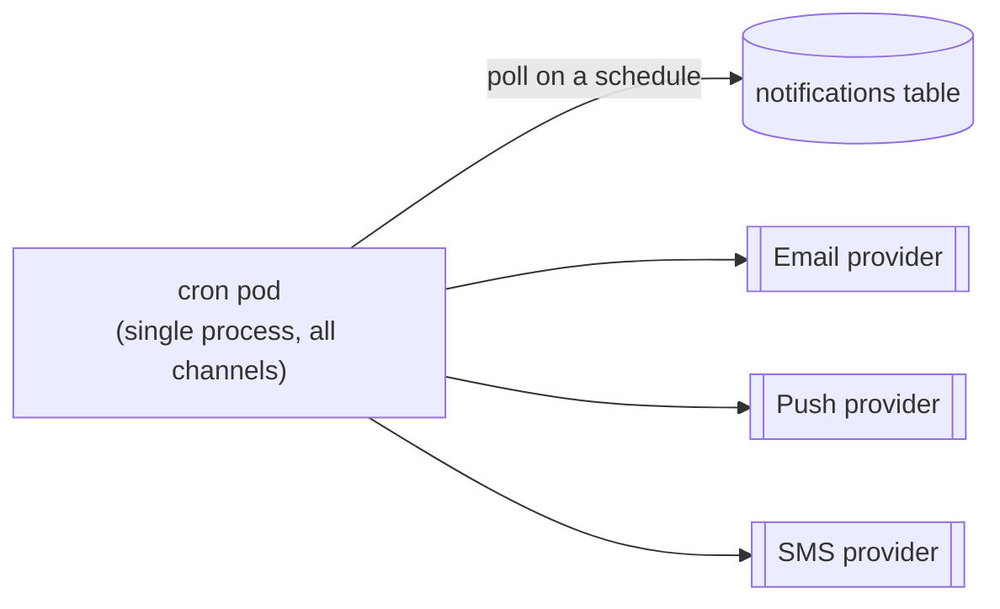
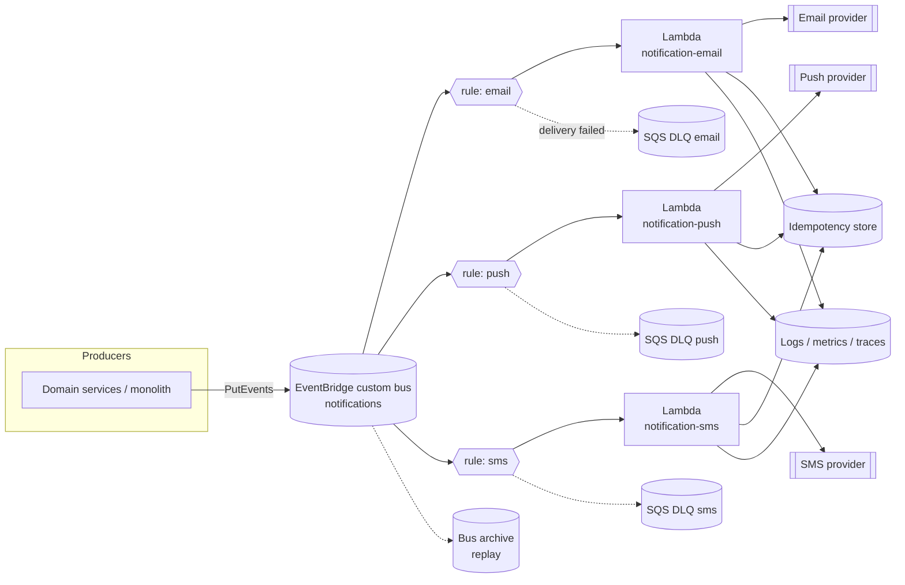
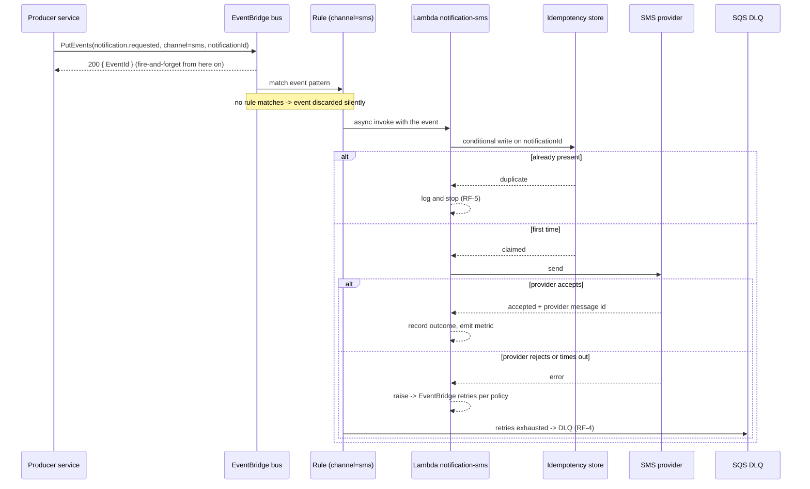

# Notifications Service — Event-Driven Architecture (EventBridge + Lambda per Channel)

**Type:** retrospective technical documentation (ADR-style record of an implementation already in production)
**Status:** draft — pending confirmation of the assumptions marked `[A-n]`
**Audience:** engineers joining the team who need to understand and maintain the notifications service

## How to read this document

This document was written from a verbal description of the migration, without access to the
repository, the infrastructure-as-code, or the dashboards. Everything that could not be verified is
tagged inline as `[A-n]` and listed in **[Assumptions register](#assumptions-register)**. Before this
document is treated as the team's reference, walk the register and either confirm each item or correct
it — an assumption left unchecked in an onboarding document is worse than a gap, because a newcomer
cannot tell the two apart.

Claims about AWS behavior (quotas, retry ranges, delivery semantics) are checked against the AWS
documentation and cited in **[References](#references)**. Claims about *our* system are not, unless
stated.

## Related documents

Fill these in — a technical document without links to the live system goes stale in a sprint:

- Infrastructure-as-code for the bus, rules, and functions: `<repo / path>`
- Channel function source: `<repo(s)>`
- Notification event contract / schema: `<link>`
- Operational dashboard (invocations, errors, DLQ depth, provider latency): `<link>`
- Alert definitions and on-call runbook: `<link>`
- The original migration proposal or discussion thread, if one exists: `<link>`

---

## 1. Context

### 1.1 Prior situation

Notifications used to be sent by a **single cron process running in a long-lived pod**. One process
owned all three channels — email, push, and SMS. On each tick it looked for work that was due
(pending rows in the database `[A-1]`), built the message content, and called the delivery provider
for every channel in the same run, in the same process.



That shape had four structural problems, and they are the reason the migration happened:

1. **Latency was bounded below by the tick interval.** A notification produced just after a run had to
   wait for the next one. Nothing could be *immediate*, however urgent it was.
2. **No failure isolation.** All three channels shared one process, one deploy, and one runtime. A slow
   or failing SMS provider consumed the run's time budget and delayed email and push behind it; an
   unhandled error anywhere could abort the run, including work already queued behind it in the same
   batch.
3. **Scaling was coarse and always-on.** The pod was sized for the worst tick and paid for around the
   clock, including the hours with no notifications at all. Absorbing a spike meant resizing the pod —
   one dial for three workloads with different shapes.
4. **One deploy surface for unrelated logic.** A change to SMS formatting was shipped by redeploying the
   process that also sends every email. The blast radius of any change was the whole notification
   system.

### 1.2 Motivation for the change

- Send a notification **as a reaction to something happening**, not on the next poll — removing the
  latency floor.
- **Isolate the channels** so one provider's bad day is contained to its own channel.
- Make **cost track volume** instead of tracking uptime.
- Let each channel be **deployed, scaled, and owned independently**.

### 1.3 What was built

Producers publish a notification event to an **Amazon EventBridge** custom bus. One **rule per
notification type** matches on the channel and routes the event to a **dedicated AWS Lambda function**
for that channel — `email`, `push`, `sms` — which renders and dispatches through the channel's
provider. This is live in production.

### 1.4 Scope

**In scope:** the transport and dispatch path — how a notification request travels from the producer
to the provider, and how it is retried, observed, and recovered.

**Out of scope (deliberately, and noted here so nobody assumes otherwise):**

- **Content and templating rules** — what a notification says, and its copy or localization, is a
  product concern documented separately `[A-2]`.
- **User notification preferences and opt-outs** — where consent lives and who enforces it is
  unresolved in this document; see [Open questions](#open-questions).
- **Provider selection** — which vendor sends email, push, and SMS is treated as a given here `[A-3]`.
- **In-app / websocket notifications** — not one of the three channels migrated.

---

## 2. Requirements the architecture answers

These are the **architecturally-relevant** requirements — the ones that shaped the structure. They are
reconstructed after the fact from the motivations above, which is a legitimate thing to do in a
retrospective document, but it means they should be validated by whoever ran the migration `[A-4]`.
Everything downstream (components, tradeoffs, risks) is judged against this list.

### 2.1 Functional

| ID | Requirement |
| --- | --- |
| **RF-1** | A notification is dispatched as a consequence of a domain event, not on a polling interval. |
| **RF-2** | Each channel (email, push, SMS) is dispatched by an independently deployable unit. |
| **RF-3** | A producer emits an intent to notify without knowing which channels exist or how they are implemented. Adding a channel must not require changing a producer. |
| **RF-4** | Delivery is attempted at least once; a request that exhausts its retries is **retained and recoverable**, never silently dropped. |
| **RF-5** | A duplicate delivery of the same event must not produce a second user-visible notification. |

### 2.2 Non-functional

| ID | Requirement | Target |
| --- | --- | --- |
| **RNF-1** | **Failure isolation** — an outage or throttle in one channel or provider must not degrade the others. | No shared runtime, deploy, or concurrency pool between channels. |
| **RNF-2** | **Elastic cost** — spend tracks volume, with no idle capacity. | Charged per invocation and duration. |
| **RNF-3** | **Traceability** — for any single notification, an engineer can reconstruct event → routing → dispatch → provider response. | A correlation identifier present on every hop `[A-5]`. Target: answer "was this sent?" in under 5 minutes with no code changes. |
| **RNF-4** | **Bounded blast radius on deploy** — shipping one channel cannot break another. | Separate function, separate deploy artifact. |
| **RNF-5** | **Time to dispatch** — the latency floor the cron imposed is gone. | *No numeric target is on record.* Set one: p95 from event publication to provider acceptance. See [Open questions](#open-questions). |
| **RNF-6** | **Operability** — a failed notification is visible without reading logs, and replayable by a documented procedure. | Alarm on failure and on DLQ depth; a written redrive runbook. Present state: `[A-6]`. |

> **Traceability check.** RF-1→§3.2, RF-2→§3.4, RF-3→§3.2/§3.3, RF-4→§3.5, RF-5→§3.6, RNF-1→§3.3/§3.4,
> RNF-2→§3.4, RNF-3→§3.7, RNF-4→§3.4, RNF-5→§3.2, RNF-6→§3.5/§6. Every requirement lands on a
> component, and every component below names the requirement that justifies it. The weakest links are
> RF-5 and RNF-6, which depend on assumptions rather than confirmed components — flagged as risks in §5.

---

## 3. Architecture

### 3.1 Static view



Solid arrows are the happy path; dotted arrows are failure and recovery paths.

### 3.2 Component: the event and the bus

A producer calls `PutEvents` on a **custom event bus** dedicated to notifications. The producer's
responsibility ends there: it has stated that a notification is wanted, and does not know which
functions run or how many channels exist.

**Requirements served:** RF-1 (dispatch is triggered by the event, not a clock), RF-3 (producers are
decoupled from channels), RNF-5 (no polling interval to wait for).

**Why a custom bus and not the account default bus:** the default bus also receives every AWS service
event in the account, so a notifications-only bus keeps the rule set small, makes the pattern space
ours, and lets bus-level permissions, archiving, and encryption be scoped to notifications alone.
`[A-7]`

**The event envelope.** The contract below is the shape this document assumes; it must be reconciled
with what production actually publishes `[A-8]`. Whatever the real shape is, the routing key and the
idempotency key are the two fields with architectural weight, because rules match on the first and
RF-5 depends on the second.

```json
{
  "Source": "<producing-service>",
  "DetailType": "notification.requested",
  "EventBusName": "notifications",
  "Detail": {
    "notificationId": "<uuid — idempotency key, stable across retries>",
    "channel": "email | push | sms",
    "template": "<template identifier>",
    "recipient": { "userId": "<id>" },
    "payload": { "<template variables>": "..." },
    "correlationId": "<propagated from the originating request>",
    "occurredAt": "<ISO-8601>"
  }
}
```

**Two contract rules that are not obvious and cost real incidents when broken:**

- **Reference, don't embed.** A `PutEvents` request must total **under 1 MB**, with at most 10 entries
  per request [1]. Send identifiers and let the function fetch what it needs; never put rendered HTML
  or an attachment in the event.
- **The routing field is a public API.** Rules match on it. Renaming or adding a value to `channel`
  without adding the matching rule first means events that match no rule — and a bus delivers each
  event to "zero or more" targets [2], so an event nobody matches is **discarded with no error**.
  That is the single most surprising failure mode in this architecture; see R-1 in §5.

### 3.3 Component: rules, one per notification type

Each channel has its own rule, whose event pattern selects that channel's events and whose single
target is that channel's function.

**Requirements served:** RF-3 (routing is the broker's job, not the producer's), RNF-1 (a channel's
routing is independent of the others).

**Consequences a maintainer needs to know:**

- Rules are **independent subscriptions to the same event**, not a chain. Adding a rule adds a
  consumer without touching anything that already works — this is what makes new channels cheap.
- The routing decision lives in **infrastructure code**, not application code. When a notification did
  not arrive, the pattern is the first place to look, not the function.
- Relevant quotas: **300 rules per bus** in most Regions and **5 targets per rule** [3]. One rule per
  channel keeps us orders of magnitude away from both.

### 3.4 Component: one Lambda per channel

Each channel function receives the matched event and owns dispatch end to end: validate the payload,
resolve the recipient's address or device token, render the content, call the provider, interpret the
provider's response, and record the outcome.

**Requirements served:** RF-2 and RNF-4 (separate deploy artifact per channel), RNF-1 (separate
runtime and separate concurrency pool per channel), RNF-2 (billed per invocation and duration, nothing
at idle).

**Why per-channel functions rather than one dispatcher function:** the three channels differ in exactly
the dimensions that Lambda configures per function — provider SDK and dependency weight, timeout,
memory, retry appetite, and rate limit. Splitting them lets each be tuned and, more importantly, makes
the isolation in RNF-1 structural rather than a matter of careful coding.

**What is shared, and the tension in it:** the three functions inevitably repeat envelope validation,
logging setup, the idempotency check, and the outcome record. Whether that lives in a shared library, a
Lambda layer, or copy-paste is unresolved here `[A-9]` and matters: a shared library re-couples the
deploys that RNF-4 separated (one library bump, three functions to release), while duplication drifts.
The defensible line is to share the *envelope and observability* contract and keep everything
provider-specific local to its function.

### 3.5 Component: dead-letter queues and the archive

Two distinct recovery mechanisms, for two distinct failures — a newcomer should not conflate them:

| Mechanism | Catches | Does not catch |
| --- | --- | --- |
| **Target DLQ** (SQS standard queue per rule target) | Events EventBridge could not deliver to the function: permissions, missing target, throttling, timeout, exhausted retries [4] | Events the function *accepted* and then failed to process; events that matched no rule |
| **Bus archive + replay** | Anything that reached the bus, replayable to the rules over a chosen time window | Anything never published |

**Requirements served:** RF-4, RNF-6.

Notes that matter in an incident:

- Retry before the DLQ is the **target's retry policy**, configurable as `MaximumEventAgeInSeconds`
  (60–86,400) and `MaximumRetryAttempts` (0–185) [5]. The values our rules actually set are an open
  question `[A-10]` — and they are the difference between "a provider blip self-heals" and "a provider
  blip fills the DLQ".
- Some failures **bypass retry entirely** and go straight to the DLQ — notably missing permissions or a
  target that does not exist [4]. So a full DLQ is not proof of a provider problem; read the
  `ERROR_CODE` and `EXHAUSTED_RETRY_CONDITION` attributes EventBridge attaches to each message [4].
- A DLQ only helps if **something watches its depth**. An unalarmed DLQ is a silent data-loss buffer
  with a 14-day fuse. Confirm the alarm exists `[A-6]`.
- **Failure inside the function** (a provider rejecting the message, a template blowing up) is *not*
  EventBridge's problem and does not reach the target DLQ. Each function needs its own answer — a
  Lambda destination or its own DLQ `[A-11]`. This is the most common gap in this architecture.

### 3.6 Component: idempotency

RF-5 exists because EventBridge gives **no exactly-once and no ordering guarantee**: the same event can
be delivered to a target more than once, and two events can arrive out of the order they were
published. In the cron design this problem was hidden by a single process reading rows under a
transaction; distributing the dispatch surfaced it.

The mechanism is a **first-writer-wins check on the event's `notificationId`** before contacting the
provider — a conditional write to a store with a TTL, so a duplicate invocation short-circuits. Whether
this exists in production, and where it lives, is the assumption in this document with the highest
consequence `[A-12]`: without it, an EventBridge retry sends a second SMS to a real person, and the
duplicate is charged and seen.

### 3.7 Component: observability

**Requirement served:** RNF-3.

What has to be true for RNF-3 to hold, stated as a checklist because it is easy to half-do:

- A **correlation identifier travels from the originating request into the event and into every log
  line** the function writes, including the provider's response identifier. Without it, three
  independent function log streams cannot be stitched back into one notification's story `[A-5]`.
- **Per-channel** dashboards and alarms, not aggregate ones — an aggregate error rate hides one channel
  failing completely while the other two carry the volume, which is exactly the failure RNF-1 was
  meant to make survivable.
- The signals that actually answer "did it send?": bus `PutEvents` count, rule `TriggeredRules`,
  target `Invocations` / `FailedInvocations`, `InvocationsSentToDLQ` [4], function errors and
  throttles, DLQ depth, and provider acceptance latency and rejections.

### 3.8 Dynamic view — dispatch of one notification



Step by step, in words — the numbered form is what to walk through with a newcomer:

1. **A domain thing happens** (an order ships, a password reset is requested) and the producer publishes
   `notification.requested` to the `notifications` bus with a `notificationId` and a `channel`.
2. **The bus acknowledges** with an `EventId`. The producer is done and does not learn whether the
   notification was ultimately delivered — this is the decoupling working as designed, and it is also
   why §3.7 matters: the producer's success log is *not* evidence of delivery.
3. **Rules evaluate the event.** Every matching rule fires; a non-matching event is dropped.
4. **The channel's function is invoked asynchronously** by EventBridge.
5. **The function claims the `notificationId`.** An already-claimed id means this is a duplicate
   delivery; the function stops without contacting the provider.
6. **The function renders and dispatches** through the provider and records the provider's response.
7. **On a retryable failure it raises**, and EventBridge retries per the target's retry policy.
8. **On exhaustion the event lands in the channel's DLQ** with `ERROR_CODE`,
   `EXHAUSTED_RETRY_CONDITION`, and `RETRY_ATTEMPTS` attached — the input to the redrive procedure in
   §6.2.

---

## 4. Alternatives considered

**Read this section with its provenance in mind:** the migration is already shipped, and this table is
reconstructed from the shape of the result, not transcribed from the decision meeting. If a written
record of that discussion exists, it supersedes this table `[A-13]`. It is kept here because a
newcomer's real question is not "what is deployed" — the diagrams answer that — but "why not something
simpler, and what will bite us."

Risk attributes: **Impact** and **Probability** are low / medium / high; **Mitigation** prevents the
risk, **Contingency** is the response if it happens anyway.

| Alternative | Pros | Cons | Risk | Impact | Prob. | Mitigation | Contingency |
| --- | --- | --- | --- | --- | --- | --- | --- |
| **Keep the cron, optimize it** (shard the poll, parallelize per channel, shorten the interval) | Nothing new to learn or operate; keeps ordering and batching for free; smallest change; provider rate limiting is trivial in one process | Latency floor stays; channels still share a runtime and a deploy; idle cost stays; scaling stays coarse — fails RF-1, RNF-1, RNF-2, RNF-4 | Optimization work buys a year and the same migration is needed later, at higher volume | Medium | High | Only viable with an explicit sunset date and a volume trigger | Migrate then, at a worse moment |
| **One Lambda for all channels, triggered by the event** | Removes the latency floor and idle cost; one deploy, one shared codebase; simple mental model | Channels share a function's concurrency, timeout, and deploy — one channel's throttling or bad release still hits the others; fails RNF-1, RNF-4 | A push-provider hang consumes the function's timeout budget and delays email and SMS | High | Medium | Per-channel circuit breakers inside the function | Split the function per channel — i.e. do the chosen design later |
| **EventBridge → one Lambda per channel** *(chosen)* | Meets RF-1..RF-3, RNF-1, RNF-2, RNF-4 structurally rather than by discipline; a new channel is a new rule plus a new function, with no producer change; per-channel tuning; managed retry and DLQ | Distributed debugging across hops; no ordering or exactly-once, so idempotency becomes application work (RF-5); silent drop when nothing matches; concurrency is not backpressure against a rate-limited provider | Unmatched events discarded with no error (R-1, §5) | High | Medium | Catch-all rule and alarm on published-vs-triggered divergence | Replay from the archive once the rule is fixed |
| | | | Duplicate delivery becomes a duplicate SMS/email (R-2, §5) | High | Medium | Idempotency key checked before dispatch | Cancel/recall where the provider allows; notify support |
| | | | Lambda concurrency stampedes a provider's rate limit (R-3, §5) | Medium | Medium | Reserved concurrency per function, tuned under the provider's limit | Throttle down; drain via DLQ redrive |
| **SQS queue per channel + long-lived consumers** (ECS/K8s workers) | A queue is real backpressure and a real buffer against provider limits; batching; visible depth; FIFO available if ordering is ever needed | Consumers are always-on infrastructure to size and patch — the very thing the migration was leaving; producers must know the queues, or need a broker in front anyway | Reintroduces the always-on cost and operational surface | Medium | High | — | — |
| **EventBridge → SQS per channel → Lambda** | Keeps the routing decoupling *and* gains a buffer, batching, and real backpressure | One more hop to operate, monitor, and reason about; slightly higher latency | Added complexity is not repaid if provider throttling never materializes | Low | Medium | Adopt per channel, only where the provider's limit is actually binding | Add the queue for that one channel — this is a strict extension of the current design, not a rewrite (see §8) |
| **Step Functions per notification** | Explicit retry, wait, and fallback-channel orchestration; per-execution visibility | Cost and complexity per notification are high for a single dispatch step; overkill unless multi-step escalation is a requirement | Paying orchestration cost for a one-step workflow | Low | High | — | — |
| **Kafka / MSK topic per channel** | Ordering, replay, and high throughput; strong fit if an event backbone already exists for other domains | A cluster to run and tune; consumer-group operations; heaviest option by far at notification volumes | Operating a cluster for one use case | High | Medium | Only justified as a shared org-wide backbone | — |
| **Managed third-party notification platform** (single vendor across channels) | Templating, preferences, and per-channel delivery handled for us; least code to own | Vendor lock-in on a core user-facing path; per-message cost at volume; less control over data residency and retry semantics | Not on record as evaluated | — | — | — | — |

**Weighed against §2:** the two options that fail a hard requirement are the optimized cron (RF-1,
RNF-1, RNF-2, RNF-4) and the single shared Lambda (RNF-1, RNF-4). Of the rest, the chosen design is the
lightest one that satisfies every requirement — the queue variants and Step Functions add machinery no
stated requirement demands, and Kafka adds an operational burden with no requirement behind it.

**The strongest argument against what we chose,** stated at its best rather than as a strawman: the
cron's single-process design gave ordering, natural batching, and trivial provider rate limiting *for
free*, and turned failures into loud crashes. The event-driven design trades all four away — ordering
and exactly-once are gone, rate limiting becomes a concurrency-tuning exercise, and the characteristic
failure changes from a loud crash to a **silent discard**. That trade is worth it for RNF-1 and RF-1,
but only if idempotency (§3.6) and the drop alarm (R-1) are actually in place. If they are not, this
architecture is strictly *less* reliable than the cron it replaced, and closing them is the top
priority in §8.

**The conditions that would flip the decision:** a hard per-recipient ordering requirement (→ FIFO
queues or Kafka), a provider whose rate limit is routinely the binding constraint (→ the SQS variant),
or multi-step escalation across channels with waits and fallbacks (→ Step Functions).

---

## 5. Risks in the deployed architecture, and how they are managed

| # | Risk | Impact | Prob. | Mitigation | Contingency |
| --- | --- | --- | --- | --- | --- |
| **R-1** | **Silent drop.** An event whose `channel` matches no rule — a typo, a new channel added before its rule, a pattern edited wrongly — is discarded with no error anywhere [2]. | High | Medium | Catch-all rule on the bus logging every unmatched event; alarm on divergence between events published and rules triggered; treat the routing field as a versioned contract (§3.2). | Fix the rule, then replay the window from the bus archive (§6.3). |
| **R-2** | **Duplicate notification.** No exactly-once guarantee, so a retry can send a second real message to a real person. | High | Medium | Idempotency check before dispatch (§3.6), keyed on `notificationId` with a TTL past the maximum retry window. | Recall where the provider supports it; notify support; report affected recipients from the outcome records. |
| **R-3** | **Concurrency stampede against a provider rate limit.** Lambda scales with the event burst; the provider does not, and returns 429s that then consume the retry budget. | Medium | Medium | Reserved concurrency per function, set under the provider's documented limit; alarm on provider 429s. | Lower reserved concurrency; put an SQS buffer in front of the affected channel (§8). |
| **R-4** | **Distributed debugging cost.** Three functions, a bus, and provider APIs mean no single place shows one notification's life; incident response slows down. | Medium | High | Correlation id on every hop; one dashboard per channel; a triage path written down (§6.1). | Escalate to whoever owns the channel; reconstruct from the archive. |
| **R-5** | **DLQ as a silent data-loss buffer.** Failed events accumulate unnoticed and expire after the queue's retention (14 days maximum on SQS). | High | Medium | Alarm on DLQ depth > 0 and on message age; document the redrive procedure (§6.2). | Redrive before retention expires; if expired, re-derive the pending set from the source data. |
| **R-6** | **Cold start latency** on a low-traffic channel — plausibly SMS — adds noticeable delay to a user-facing message. | Low | Medium | Keep deployment packages small; measure p95 per channel before deciding it is a problem. | Provisioned concurrency on the affected channel. |
| **R-7** | **Producer fire-and-forget mistaken for delivery.** A producer's successful `PutEvents` is not evidence the user was notified; support and product read it as one. | Medium | High | Document explicitly (§3.8 step 2); expose delivery outcome, not publication, in any support-facing view. | Correct the tooling that reports publication as delivery. |
| **R-8** | **Envelope schema drift.** Producers and functions evolve independently with no enforced contract, and a field rename breaks a channel at runtime. | Medium | Medium | Version the `DetailType`; validate the envelope at the function boundary and fail loudly; consider a schema registry (§8). | Roll back the producer; drain the DLQ after the fix. |
| **R-9** | **Payload growth against the 1 MB request limit** [1] as templates get richer. | Low | Low | Reference-not-embed as a contract rule (§3.2); alarm on `PutEvents` failures. | Move the content to object storage and pass a reference. |

---

## 6. Operating the service

The part a maintainer opens during an incident. Confirm each procedure against the live system before
relying on it `[A-6]`.

### 6.1 "A notification was not sent" — triage order

Work outside-in; each step eliminates one component:

1. **Was the event published?** Producer logs plus the bus `PutEvents` metric. If not, it is a producer
   problem and nothing downstream is at fault.
2. **Did a rule match?** Compare published events against `TriggeredRules` for the channel. A published
   event with no triggered rule is **R-1** — the silent drop — and the answer is fix the pattern, then
   replay.
3. **Was the function invoked?** Target `Invocations` / `FailedInvocations`. Invocation failures with no
   function logs point at permissions, throttling, or the target itself.
4. **Did the function run and stop early?** Look for the idempotency short-circuit before assuming a
   bug — a "missing" notification is often a correctly-suppressed duplicate.
5. **Did the provider accept it?** The provider's response id in the function's logs is the boundary of
   our responsibility; past it, the question belongs to the provider's own delivery reporting.
6. **Is it in a DLQ?** Read `ERROR_CODE` and `EXHAUSTED_RETRY_CONDITION` on the message [4] before
   redriving — redriving into an unfixed cause just refills the queue.

### 6.2 Redriving a DLQ

Fix the cause first, then move messages back. Two supported routes: point a Lambda event source at the
DLQ to drain it, or consume it with the SQS API [4]. Two cautions specific to notifications: redriving
old messages can send notifications whose moment has passed (check `occurredAt` and drop the stale
ones), and the idempotency store's TTL may have expired, which means a redrive can legitimately
re-send. Confirm the redrive path and the age cutoff we use `[A-6]`.

### 6.3 Replaying from the archive

Used after R-1 (nothing matched) or after a fix that must be applied to a past window: replay the bus
archive over the affected time range to the relevant rule. Replay re-invokes the functions, so
idempotency (§3.6) is what makes it safe — verify it before replaying a large window, and prefer a
narrow window first.

### 6.4 Adding a new notification type

The design's main payoff, and the reason RF-3 was worth having — no producer changes:

1. Add the channel's function.
2. Add its rule and target, with retry policy and DLQ configured **at the same time**, not later.
3. Add the channel's dashboard and alarms, including DLQ depth.
4. Only then start publishing the new `channel` value. **In this order** — publishing before the rule
   exists is precisely R-1.

---

## 7. Lessons learned

The lessons that follow are the ones this architecture *implies*, derived from its structure rather
than collected from the team. Treat them as a starting draft: replace them with what actually went
wrong during the migration, because the specifics of what a team tripped over are the most valuable
thing a retrospective document carries, and they cannot be inferred `[A-14]`.

- **The failure mode changed shape, not just size.** A cron fails loudly — a crash, a stuck pod, an
  obvious gap. An event bus fails *quietly*: a non-matching event vanishes with no error. Moving to
  event-driven means the monitoring must be built for absence, not just for errors, and it must be
  built at migration time rather than after the first silent incident.
- **Guarantees the single process gave away for free became explicit work.** Ordering, exactly-once,
  batching, and provider rate limiting were all implicit properties of "one loop in one process." None
  survive distribution. Each has to be re-established deliberately (idempotency keys, reserved
  concurrency) or consciously given up — and that cost belongs in the migration estimate, because it is
  where the schedule usually slips.
- **Decoupling relocates the coupling into the event contract.** Producers no longer know about
  channels, but everyone now depends on the envelope, and the routing field in particular is a public
  API with no compiler enforcing it. It needs versioning and validation from day one.
- **Fire-and-forget changes what "success" means for everyone downstream.** The producer's 200 stops
  meaning "the user was notified." Any tooling, support script, or dashboard built on the old
  assumption is now wrong, and the people using it will not know.
- **Retry and DLQ configuration is part of the feature, not a follow-up.** A rule shipped without a DLQ
  is a rule that loses notifications, and the loss is invisible. It has to land in the same change as
  the function.
- **Per-channel isolation only pays off if the observability is also per-channel.** Aggregate metrics
  hide exactly the single-channel failure the isolation was bought to survive.

---

## 8. Improvement points

Ordered by value over effort. The first two close gaps in requirements that are currently satisfied
only by assumption, and should be treated as correctness work rather than enhancement:

1. **Confirm or build the idempotency check (RF-5, R-2).** Without it, every EventBridge retry is a
   possible duplicate message to a real user. Highest priority.
2. **Alarm on the silent drop (R-1).** A catch-all rule plus an alarm on published-vs-triggered
   divergence turns the architecture's worst failure mode from invisible into paged.
3. **Confirm retry policy and DLQ on every rule target, plus a DLQ depth alarm (RF-4, RNF-6, R-5).**
   Cheap, and the difference between recoverable and lost.
4. **Handle in-function failures explicitly (§3.5, `[A-11]`).** The target DLQ does not catch them; a
   Lambda destination or function-level DLQ does.
5. **Set a numeric target for RNF-5** — p95 event-to-provider-acceptance per channel — and measure it.
   An unstated latency requirement cannot be regressed against, which is how a "fast" system slowly
   stops being one.
6. **Reserved concurrency per function, tuned against each provider's documented rate limit (R-3).**
7. **Version and validate the event envelope (R-8):** versioned `DetailType`, validation at the
   function boundary, and a schema registry if producers multiply.
8. **Insert SQS between rule and function for any channel whose provider limit is actually binding.**
   Deliberately deferred: it is a strict, per-channel extension of the current design, so it costs
   nothing to wait for evidence that a channel needs it.
9. **Drill the replay procedure (§6.3) in a non-production environment.** An untested recovery
   procedure is a hypothesis, and an incident is a poor time to test it.

---

## Assumptions register

Every item is unverified. Confirm or correct before this document is treated as authoritative.

| ID | Assumption | Why it matters |
| --- | --- | --- |
| A-1 | The old cron polled a database table for due notifications. | Only affects the accuracy of the "before" narrative. |
| A-2 | Templating and content rules are documented elsewhere. | Otherwise a real documentation gap for newcomers. |
| A-3 | Providers per channel are fixed and documented elsewhere. | Fill in the names; a maintainer needs to know whose API they are calling. |
| A-4 | The requirements in §2 are reconstructed, not the team's original list. | Everything downstream is judged against this list; a wrong requirement invalidates the analysis. |
| A-5 | A correlation identifier is propagated producer → event → function → provider. | RNF-3 is unmet without it. |
| A-6 | Alarms, dashboards, and a written runbook exist for DLQ depth and per-channel failures. | RNF-6 and §6 depend on it. |
| A-7 | A dedicated custom bus is used, not the account default bus. | Changes the rule-quota and permission story. |
| A-8 | The event envelope resembles §3.2. | The real field names are what a maintainer will actually work with. |
| A-9 | Shared logic across the three functions has no agreed home. | Determines whether RNF-4's deploy independence is real. |
| A-10 | Target retry policies are at AWS defaults rather than deliberately chosen. | Governs whether provider blips self-heal or fill the DLQ. |
| A-11 | In-function failures may not be captured anywhere. | A gap in RF-4 that the target DLQ does not cover. |
| A-12 | An idempotency mechanism exists. **The highest-consequence assumption here.** | RF-5 and R-2 rest entirely on it. |
| A-13 | No written record of the original migration decision exists. | If one does, §4 should be replaced by it. |
| A-14 | The lessons in §7 are derived from the architecture, not reported by the team. | The team's real lessons are more valuable and cannot be inferred. |

## Open questions

Raised for the team; the answers belong in this document, not in a chat thread:

1. **What is the target dispatch latency per channel** (p95 from publication to provider acceptance),
   and is it measured today? RNF-5 has no number.
2. **Where do notification preferences and opt-outs get enforced** — producer, function, or provider?
   Nothing in §3 owns them, which means either they live outside this system or nothing enforces them.
3. **What volume does the service handle** — average and peak per channel? Several risks (R-3, R-6, R-9)
   are unrated without it, and cost cannot be compared against the old pod.
4. **Did the migration deliver the expected cost change?** The before/after number is the most
   persuasive evidence this document could carry.
5. **Is there any per-recipient ordering requirement** (a "cancelled" notification overtaking a
   "confirmed" one)? If yes, the chosen design does not satisfy it and §4's conclusion changes.
6. **Was the migration cut over big-bang or gradually, and is the old cron fully decommissioned?** A
   dormant cron pod is a real risk of double sends.
7. **Who owns each channel** — on-call, provider account, and cost? §6 assumes someone is named.

## References

1. AWS — EventBridge API Reference, `PutEvents`: "the total entry size must be less than 1MB"; maximum
   10 entries per request. https://docs.aws.amazon.com/eventbridge/latest/APIReference/API_PutEvents.html
2. AWS — Events Reference: an event bus "receives events and delivers them to zero or more
   destinations, or *targets*"; a rule fires only when the event matches its pattern.
   https://docs.aws.amazon.com/eventbridge/latest/ref/welcome.html
3. AWS — EventBridge quotas: 300 rules per event bus in most Regions (100 in `af-south-1`,
   `eu-south-1`); 5 targets per rule (not adjustable).
   https://docs.aws.amazon.com/eventbridge/latest/userguide/eb-quota.html
4. AWS — Using dead-letter queues to process undelivered events: DLQs are SQS **standard** queues (FIFO
   not supported); messages carry `RULE_ARN`, `TARGET_ARN`, `ERROR_CODE`, `ERROR_MESSAGE`,
   `EXHAUSTED_RETRY_CONDITION`, `RETRY_ATTEMPTS`; some errors (missing permissions, non-existent
   target) go straight to the DLQ with no retry; `InvocationsSentToDLQ` and
   `InvocationsFailedToBeSentToDLQ` are published to CloudWatch; redrive via a Lambda event source or
   the SQS API. https://docs.aws.amazon.com/eventbridge/latest/userguide/eb-rule-dlq.html
5. AWS — EventBridge API Reference, `RetryPolicy`: `MaximumEventAgeInSeconds` valid range 60–86,400;
   `MaximumRetryAttempts` valid range 0–185.
   https://docs.aws.amazon.com/eventbridge/latest/APIReference/API_RetryPolicy.html

*Checked 2026-09-08. AWS quotas and limits change — the 1 MB `PutEvents` limit, for instance, is a
raise from the widely-cited 256 KB, so re-verify rather than trusting older blog posts.*

## Version history

| Version | Date | Author | Description |
| --- | --- | --- | --- |
| 1.0 | 2026-09-08 | `<author>` | Document created from a verbal description of the migration; assumptions and open questions marked for team confirmation. |
