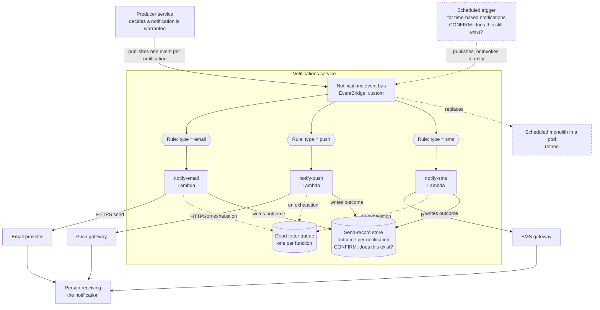
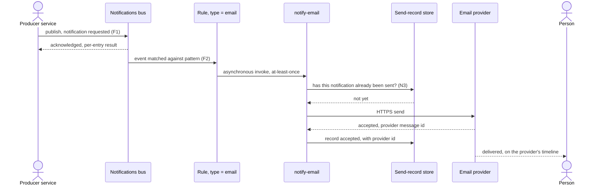
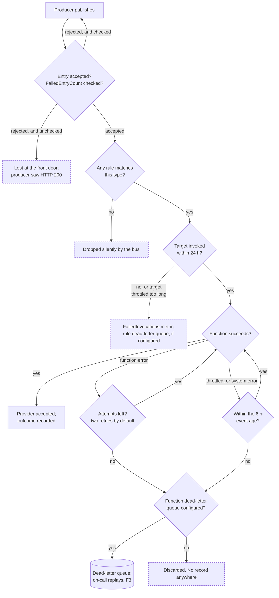

# Notifications: from a scheduled monolith to per-channel event handlers

**Shape:** retrospective technical documentation. The system is already in production, so this records
what was built, how it behaves, and what a maintainer has to know to change it safely.

**Status:** accepted, in production. Cutover date not supplied (Q1 below).

**Audience:** an engineer joining the team who will go on call for notifications and make their first
change to them.

**Reversibility.** The migration was two doors, not one. The one-way door is the event contract between
producers and the bus, and the at-least-once delivery semantics that come with it: every producer now
depends on the event shape, and every consumer has to tolerate duplicates, which is application code
that cannot be un-written by a redeploy. The two-way door is the split into one function per channel:
merging the three or sliding a queue in front of each is a contained change, one channel at a time.
This document treats the first with the depth it deserves, in "Delivery semantics", and the second as a
comparison a maintainer can act on.

## How to read this, and what is not verified

This was written from a one-paragraph description of the migration. There was no access to the
repository, the infrastructure code, the dashboards, or the incident history. So the *shape* of the
architecture below comes from that description, and every other claim is one of four things. Each is
labelled inline, every time:

| Label | Meaning |
| --- | --- |
| **[platform]** | A documented behaviour of Amazon EventBridge or AWS Lambda, read from AWS documentation on 2026-09-08. The pages are listed under Sources. These hold whatever this team built. |
| **[inferred]** | A consequence that follows from the topology as described, not something observed. Cheap to confirm, and worth confirming. |
| **[assumed]** | Nobody checked. The text says what would confirm it. |
| **[measured]** | Someone observed it, with the instrument and the date named. |

**No claim in this document is labelled [measured] yet.** That is the honest state of it: the
structure is right, the numbers are missing, and the missing numbers are enumerated in
[Open questions](#open-questions) with the exact place that closes each one. Work that list once,
replace the labels, and this becomes a document a newcomer can trust. Handed over as-is, it is still
better than folklore, but it is not finished.

## Contents

1. [What the service does](#what-the-service-does)
2. [Context](#context)
3. [What the architecture has to hold](#what-the-architecture-has-to-hold)
4. [Architecture](#architecture)
5. [Risks and mitigations](#risks-and-mitigations)
6. [What this shape costs and what it buys](#what-this-shape-costs-and-what-it-buys)
7. [Lessons the platform teaches](#lessons-the-platform-teaches)
8. [Improvement points](#improvement-points)
9. [Open questions](#open-questions)
10. [Glossary](#glossary)
11. [Sources](#sources)
12. [First week for a new maintainer](#first-week-for-a-new-maintainer)
13. [Version history](#version-history)

## What the service does

The notifications service turns a fact that happened somewhere else in the product into a message that
reaches a person, over one of three channels: email, push, or SMS. It owns the routing and the sending.
It does not own the decision that a notification is warranted; a producer service makes that decision
and announces it.

It is built on Amazon EventBridge and AWS Lambda: a producer publishes an event, an EventBridge rule
matches it by notification type, and the rule invokes the Lambda function for that type, which calls
the channel's delivery provider.

## Context

### The situation before: one scheduled process

A single process ran on a schedule inside a Kubernetes pod, described by the team as a "monolithic
cron". On each tick it looked for work that was due and sent everything it found, across all three
channels, in one process and one deployment unit.

Five properties of that shape matter, because they are the reasons the migration happened and the
things a newcomer should check are actually gone:

- **A latency floor equal to the schedule interval.** Nothing could be delivered sooner than the next
  tick, however urgent. [inferred]
- **Channels shared a fate.** One slow or failing provider held up, or brought down, the run that was
  also sending the other two channels. [inferred]
- **Scaling was per process, not per channel.** A spike in one channel's volume was absorbed, or not,
  by the same pod that served the others. [inferred]
- **Retry granularity was the run, not the message.** A run that died partway through either repeated
  work already done or dropped what it had not reached, depending on how it tracked progress; which
  one it did is unknown here. [assumed — the previous implementation's progress tracking would settle
  it; see Q2]
- **One deploy unit for three channels.** A change to SMS templating was shipped by redeploying the
  process that also sends email and push. [inferred]

Nobody supplied the volume, the schedule interval, the failure rate, or the delivery latency of the old
system, so none of them appear here as numbers. Q2 and Q3 say where to find them, and they are worth
finding: a retrospective with no before-numbers cannot show that the migration worked.

### Who uses it

| Role, by what they do with the system | Before | After |
| --- | --- | --- |
| Person receiving a notification | Received email, push, or SMS at the granularity of the schedule tick | Receives it once the producer announces the fact, subject to per-channel provider latency |
| Producer service announcing something happened | Wrote a row, or set a flag, that the scheduled process would later find [assumed — Q4 asks what the producer's side of the old contract was] | Publishes an event to the notifications bus and does not wait for delivery |
| Product engineer changing one channel's content or rules | Changed the shared process; redeployed all three channels | Changes and deploys the function for that channel only |
| On-call engineer during a delivery failure | Read the pod's logs; restarted or re-ran the schedule | Reads the failing function's logs and metrics; drains or replays its dead-letter queue |
| Platform or cost owner | One pod's cost, constant whether or not anything was sent | Per-invocation cost across three functions plus bus and delivery charges, varying with volume |

### Why it changed

Stated by the team: to move from a monolithic scheduled run to an event-driven flow. Reconstructing the
motivations from the properties above, in the order a new maintainer will find them useful:

- Deliver on the event rather than on the tick, removing the schedule-interval latency floor.
- Isolate the channels, so one provider's bad day is one channel's bad day.
- Scale and deploy each channel independently.

These three are consistent with what was built. They are a reconstruction, not the team's written
motivation, and the difference matters if someone later argues the migration missed its target: the
target as recorded here was inferred after the fact. [assumed — Q5]

### Scope

In scope: routing a notification-worthy event to a channel, and sending it. Three channels: email,
push, SMS.

Out of scope, as problems rather than as rejected designs:

- Deciding *whether* a person should be notified about something. That lives in the producer.
- Notification content authoring and translation, unless the functions hold the templates, which is
  unknown here (Q6).
- In-app or web notification surfaces, if any exist.
- Whatever the old scheduled process did *besides* notifications. A long-lived cron usually accretes
  neighbours: report generation, cleanup, reconciliation. If the pod is gone, those went somewhere, and
  this document does not cover where (Q7). If the pod is still running for them, say so, because a
  newcomer reading "we migrated off the cron" will assume it is gone.

### Prior decisions

Everything here was decided by someone inside the organization. None of it excludes an alternative;
each row names what undoing it would cost, so a future reader who wants to change one knows the price.

| Prior decision | Who decided, when | What it implies | Cost to reverse |
| --- | --- | --- | --- |
| AWS as the cloud | Predates this migration [assumed — Q8] | EventBridge, Lambda, CloudWatch as the default building blocks | High. Out of scope for this decision |
| EventBridge as the bus | This team, during the migration | Rule-based routing, at-least-once delivery, no consumer-owned backlog | Medium. Swapping to SNS or SQS changes the producer call and every rule, but the function code barely moves |
| Lambda as the runtime | This team, during the migration | Per-invocation scaling and cost, cold starts, and asynchronous retry semantics owned by the platform | Medium. A container per channel keeps the split and changes the delivery mechanics |
| One function per notification type | This team, during the migration | Three deploy units, three sets of permissions, three dead-letter queues, three sets of alarms | Low to medium in either direction. The functions are independent by construction, which is the point |
| Kubernetes for the rest of the platform | Predates this migration [assumed] | Notifications now runs on a second runtime, with its own deploy path and its own operational habits | This is the cost the migration already paid |

### Constraints

A constraint is imposed from outside the organization, and it is the only kind of item that can rule an
option out. **This table cannot be completed from the information given, and it is the most important
gap in the document**, because messaging is one of the few areas where the law reaches into the
architecture.

| Constraint | Source outside the organization | What it excludes |
| --- | --- | --- |
| Consent and opt-out rules for the jurisdictions we send to | A data-protection or anti-spam regime, plus carrier rules for SMS. Which ones apply is not known here | Potentially: sending without a recorded consent check, sending without a working unsubscribe path, sending SMS outside permitted hours. Each of those is a check that has to live somewhere in the flow below |
| Delivery provider terms: throughput ceilings, sender reputation rules, retry etiquette | The email, push, and SMS providers' contracts | Potentially: unbounded retry on a soft bounce, unbounded concurrency against a rate-limited API |

Q9 and Q10 close these. Until they are closed, treat every claim in this document about retry
behaviour as an engineering statement, not a compliance statement.

## What the architecture has to hold

This section exists because "the architecture" is not the code; it is the set of properties the code has
to keep true while people change it. Each row is a property with a metric, the condition it holds
under, and how it is checked. **The target column is deliberately mostly empty**: setting a target
requires the current value, and the current value has not been read. Filling in the metric and the
condition without the number is the useful half that can be done from here.

Two of these rows, N3 and F4, were not asked for. They are in because the roles they serve, the person
receiving a notification and the on-call engineer, are the ones who pay when they are missing, and
because the platform semantics below make them load-bearing rather than optional.

| ID | Goal it serves | Metric, target, condition | Derived from | How it is checked |
| --- | --- | --- | --- | --- |
| N1 | A person hears about something in time to act on it | End-to-end latency from the producer's publish call to the provider accepting the message, p95, at the daily peak. Target not set | The old system's floor was the schedule interval, value unknown (Q3) | A trace, or a timestamp pair per notification, aggregated per channel |
| N2 | A person is not silently left uninformed | Count of notifications accepted by the bus and never delivered nor recorded as failed, per day. Target: zero unaccounted-for | Lambda discards events that expire or exhaust their attempts, and can drop events from its queue under sustained overload [platform] | Reconciliation between events published and terminal outcomes recorded, plus an alarm on dead-letter queue depth |
| N3 | A person is not sent the same message twice | Duplicate deliveries per 10,000 notifications. Target not set; it will not be zero without an idempotency key | EventBridge may invoke a target more than once for one event, and Lambda's asynchronous queue is eventually consistent, so the same event can arrive repeatedly [platform] | A uniqueness check on the send-record store, counted per day |
| N4 | A person waiting on an email still gets it while the SMS provider is down | Correlation between one channel's error rate and the other two channels' delivery latency. Target: no propagation | The old shape shared one process across three channels [inferred] | Per-function error and duration metrics, read side by side during a provider incident |
| N5 | On-call finds the cause without reproducing it | Time from alarm to identifying the failing notification and its cause. Target not set | No baseline; the old system's diagnosis path was pod logs [inferred] | A correlation identifier carried from the producer's event into every log line and provider call, exercised in a game-day drill |
| N6 | The person who owns the platform bill can defend what notifications cost | Monthly cost of bus, functions, and providers, against the pod's monthly cost. Target not set | Pod cost not supplied (Q11) | The cost report, filtered to the notifications tag |
| F1 | A producer announces a fact once and is done with it | A producer publishes one event and gets a success response without waiting for delivery. Scenario: given a producer that has just committed a domain change, when it publishes the notification event, then it receives a synchronous acknowledgement from the bus and the delivery happens outside its request | The event-driven shape as described | An integration test that publishes and asserts the acknowledgement, with delivery asserted separately |
| F2 | A product engineer ships a change to one channel without touching the other two | An event of type *email* reaches only the email function. Scenario: given an event whose type is push, when it is published, then the push function is invoked and the other two are not | Rule-per-type routing as described | One test per type, asserting invocation counts across all three functions |
| F3 | A failed notification is recoverable by a person, not lost | Every notification that exhausts its attempts is retrievable and replayable by an on-call engineer. Scenario: given a provider outage that fails a batch of sends, when the provider recovers, then the on-call engineer replays them from the dead-letter queue and each one is delivered | Lambda discards on expiry or exhaustion unless a dead-letter queue is configured [platform] | A drill: force failures, confirm they land in the queue, replay them |
| F4 | A person receives only what they agreed to receive | Before sending, the flow checks the recipient's consent and channel preference for that notification type, and records the check. Scenario: given a recipient who has opted out of SMS for a type, when an event of that type is published for them, then no SMS is sent and the suppression is recorded | The constraints table above, and the fact that at-least-once delivery puts repeat messages in front of real people | A test per suppression rule, plus a production count of suppressed sends |

## Architecture

### Components

- **Producer service.** Owns the decision that a notification is warranted. Publishes one event per
  notification to the notifications event bus and does not wait for the outcome. Which services are
  producers is not known here (Q4).
- **Notifications event bus.** A custom EventBridge bus carrying notification requests. [assumed: a
  custom bus rather than the account's default bus. Confirm in the EventBridge console; it matters,
  because rules on the default bus also see every AWS service event and are noisier to reason about]
- **One rule per notification type.** Matches on the event's type field and invokes the function for
  that channel. Three rules: email, push, SMS.
- **`notify-email`, `notify-push`, `notify-sms`.** One Lambda function per channel. Each parses the
  event, builds the message, calls its provider, and records the outcome. Real function names not
  supplied; these are placeholders (Q12).
- **Delivery providers.** One external service per channel: an email sender, a push gateway, an SMS
  gateway. Named in Q13.
- **Dead-letter queues.** One SQS queue per function, holding what the platform would otherwise
  discard. [assumed — Q14. If these do not exist, that is the most urgent gap in the system, for the
  reason set out in "Lessons the platform teaches"]
- **Send-record store.** Where a notification's outcome is written, so a person can be asked "did she
  get it?" and so a retry can tell whether it is a retry. Existence and location unknown (Q15).
- **The retired scheduled pod.** Gone, or partly gone; see Q7.

*Figure 1. Container-level view of the notifications service. Answers F1, F2, F3, N4.* The two dashed
boxes inside the service are unconfirmed: the scheduled trigger and the send-record store may or may
not exist as drawn.

### The send flow, step by step

1. **A fact happens.** The producer commits a domain change that warrants telling someone.
2. **The producer publishes.** One `PutEvents` call to the notifications bus, one entry per
   notification, with a source, a detail type, and a detail payload carrying the notification type, the
   recipient, and whatever the channel needs in order to render the message. Up to 10 entries per call,
   total request under 1 MB. [platform]
3. **The bus acknowledges.** The producer's work is finished. If the bus rejects an individual entry,
   the response carries an error code for that entry while the others succeed, so the producer has to
   inspect `FailedEntryCount` and resend the failures itself. [platform] Whether the producer does this
   is Q16, and if it does not, notifications are being dropped at the front door with an HTTP 200 in
   hand.
4. **Rules match.** Each rule tests the event against its pattern. A notification type that matches no
   rule is dropped silently: matching is not delivery, and there is no error for "nothing wanted this".
   [platform]
5. **The function is invoked asynchronously.** EventBridge places the event on Lambda's asynchronous
   queue and Lambda reads from it.
6. **The function sends.** It builds the message and calls the provider over HTTPS.
7. **The outcome is recorded**, so that a support question can be answered and a retry can recognise
   itself.
8. **The provider delivers**, on its own timeline, which for SMS and email is neither immediate nor
   certain. A provider accepting a message is not a person receiving it; the gap between those two is
   where bounces and carrier rejections live, and closing it needs the provider's callbacks (Q17).

*Figure 2. Sequence for one email notification, container level. Answers F1, F2, N1, N3.* The
idempotency check against the send-record store is what N3 requires; whether it exists in the code is
Q15.

### Delivery semantics, and where a notification can be lost

This is the part of the document a maintainer will come back to, so it is stated in the platform's own
terms rather than in reassurances. All of it is [platform], read from AWS documentation on 2026-09-08.

**The path is at-least-once, in two places.** EventBridge can, in rare cases, run the same rule more
than once for a single event, or invoke the same target more than once for one triggered rule. Lambda's
asynchronous queue is eventually consistent, so a function can receive the same event more than once
even when it never returns an error. A notification with no idempotency key will therefore reach a
person twice sometimes. Not often; the question is only whether twice is acceptable for a payment alert
or a one-time code.

**Retries are automatic, generous, and finite.** EventBridge tries to deliver an event to its target for
up to 24 hours, publishing the `FailedInvocations` metric when it gives up. Once the event reaches
Lambda, a function error, including a timeout, is retried twice by default: one minute after the first
attempt, two minutes after the second. Throttling and system errors are handled differently. The event
goes back on the queue and is retried for up to 6 hours by default, with the interval growing
exponentially from one second to a ceiling of five minutes.

**Three ways a notification disappears without anyone being told.**

1. *No rule matches it.* A new notification type shipped by a producer, with no rule for it, is dropped
   by the bus with no error anywhere.
2. *The target is throttled for a prolonged period.* EventBridge may stop retrying if the target is
   persistently throttling the calls it makes on your behalf. Retries are not unconditional.
3. *Lambda gives up, or never tries.* When an event expires or fails every attempt, Lambda discards it.
   And when a function cannot keep up with incoming events, events can be deleted from the queue
   without ever being sent to the function. A dead-letter queue is what turns all of that from silence
   into a queue depth someone can alarm on.

*Figure 3. Flowchart of where one notification can end its life, from publish to delivery. Answers N2,
F3.* Every dashed outcome is a notification a person expected and did not get, with nobody informed. N2
exists to keep the count of those at zero, and it can only be kept at zero by reconciling what was
published against what reached a terminal state.

### What replaced the scheduling

The old system was a cron: it ran on a clock. The new one runs on events. Those are different triggers,
and a notification that is inherently time-based, an appointment reminder 24 hours ahead or a payment
due in three days, has no event to react to at the moment it needs to be sent.

So one of these is true, and a new maintainer needs to know which:

- **All notifications are reactive.** Every one of them follows a fact that just happened, and the clock
  is genuinely gone.
- **Something still runs on a clock.** A scheduled EventBridge rule, EventBridge Scheduler, or a
  surviving job scans for what is due and publishes events for it. In that case the cron did not
  disappear, it moved and got smaller, and the scanner is now a component with its own failure modes,
  its own idempotency problem, and its own place in Figure 1.

This document assumes the second, because most notification systems have at least one time-based type,
and it is drawn as the dashed `Scheduled trigger` node in Figure 1. [assumed — Q18, and it is the
question most worth answering before anyone else reads this]

## Risks and mitigations

Probability is stated with its reason. Where the reason would be a number nobody has read, the row says
so and names the metric, rather than guessing a likelihood.

| Risk | Impact | Probability | Mitigation | Contingency |
| --- | --- | --- | --- | --- |
| A person receives the same notification twice | Medium for a marketing message, high for a one-time code or a payment alert | Low but structural: both EventBridge and Lambda's asynchronous queue are at-least-once by design [platform], so this happens eventually, not never | An idempotency key per notification, checked against the send-record store before the provider call (N3) | Deduplicate at the provider where it supports it; for the highest-impact types, block the second send outright |
| A notification is discarded with no record | High: the person is silently uninformed and support cannot tell why | Depends entirely on whether dead-letter queues exist. Unmeasured (Q14): check each function's asynchronous invocation config, then alarm on `FailedInvocations` and queue depth | A dead-letter queue per function plus one on the rules, alarmed on depth (N2, F3) | Replay from the queue once the cause is fixed; where the queue was missing, reconstruct from producer-side records if any exist |
| A provider outage exhausts every retry inside the retry window | High for the affected channel; the other two are unaffected, which is what the split bought | Unmeasured (Q19): count provider incidents from their status pages over the last twelve months | The dead-letter queue holds what the window could not deliver; per-channel alarms so on-call knows which channel is down | Replay after recovery; for one channel, fall back to another where the notification type permits it, which is a product decision, not a technical one |
| A new notification type ships with no matching rule | Medium: that type is silently never delivered | Medium, and it rises with the number of producers: adding a type means changing code in one repository and a rule in another [inferred] | A catch-all rule that logs and alarms on any unmatched notification type, so silence becomes a signal | Add the rule, then replay from the catch-all's target |
| A volume spike throttles a function, and events are dropped from the asynchronous queue before the function sees them | High: silent loss precisely when volume is highest | Unmeasured (Q20): read the `Throttles` sum per function over 30 days and compare it against the account's concurrency | Reserved concurrency per function, so one channel cannot eat the account's budget; a queue in front of the function converts a spike into a backlog instead of a drop | Raise the limit and replay; adopt the queue variant described in the next section |
| A payload outgrows the bus | Low per notification, high for the one type that carries an attachment or a long rendered body | Low: the limit is 1 MB per publish request, generous for a notification [platform] | Keep rendering inside the function and pass identifiers, not rendered content, on the bus | Put the payload in object storage and publish its URL, which is what AWS recommends for oversized entries |
| Sending without a consent or preference check | High: regulatory exposure and recipient trust, and it is the kind of finding that arrives as a complaint rather than an alarm | Cannot be assessed here: the constraints table is empty (Q9, Q10) | The check inside the flow before the provider call, with the suppression recorded (F4) | If the check is missing, the recovery is an audit of what was already sent, not a code change |
| Notifications now run on a second runtime, with its own deploy path, permissions model, and habits | Medium, and it is paid continuously rather than once: three functions, three roles, three sets of alarms, and Kubernetes knowledge that no longer applies | Certain: it is a consequence of the choice, not a possibility | Infrastructure as code covering all three functions identically, so the third one is not the one nobody updated (Q21) | Consolidate to one function with internal routing, described in the next section, if the operational cost outgrows the isolation benefit |

## What this shape costs and what it buys

The decision has been made and shipped, so this is not a proposal. It is here because a maintainer who
inherits an architecture without knowing what it was chosen over cannot tell which parts are
load-bearing and which are habit, and because the nearest alternative is the most likely direction of
the next change.

**Reconstructed, not recovered.** The comparison below was written after the fact from the topology. If
the team ran its own analysis, that document supersedes this section and this section should be replaced
by a pointer to it (Q22). Risks are not repeated per row; they are in the table above.

**What every option here shares:** AWS, a managed runtime, and three logical channels. AWS is a prior
decision that predates this work and is not reopened here. "Three logical channels" is the product's
shape, not a technical choice. Everything else was genuinely open.

| Alternative | Against the targets | Pros | Cons |
| --- | --- | --- | --- |
| **Baseline: keep the scheduled monolith** | N1 missed, latency floored at the schedule interval. N4 missed, shared fate. F1 missed | Nothing to build. One deploy unit, one runtime, one mental model. Progress tracking already existed | Every property listed in "the situation before". Latency cannot go below the tick, and the three channels stay entangled |
| **Smallest change: keep the pod, add an internal queue per channel** | N1 partial, still tick-bound unless the producer writes directly. N4 met inside one process. F1 partial | Small diff. Keeps one runtime and one deploy path. Channel isolation without a distributed system | Isolation is only as good as the process boundary: one out-of-memory kill still takes all three channels down. Scaling is still per pod |
| **What was built: bus, rule per type, function per type** | N1, N4, F1, F2 met. N2, N3, F3, F4 met only if dead-letter queues, an idempotency key, and a consent check were actually built | Per-channel deploy, scale, and blast radius. Producers decoupled from delivery. Retries and backoff come from the platform. Adding a channel is a rule and a function, touching nothing that exists | No consumer-owned backlog: a spike becomes throttling, and possibly silent drops, rather than a queue. Three of everything to operate. A second runtime beside Kubernetes. At-least-once pushed into application code |
| **Bus, then a queue per type, then a function** | Same as built, and N2 becomes structural rather than a matter of discipline | Everything the built shape has, plus a real buffer: spikes become backlog with a visible depth and age, retries and redrive belong to the queue, and per-recipient ordering becomes reachable with a FIFO queue | One more component per channel. Slightly more end-to-end latency. Two retry regimes to understand instead of one |
| **One function, internal routing by type** | N1, F1, F2 met. N4 partial: one runtime shared by three channels again | One deploy, one set of permissions, one set of alarms. Shared code without a shared library | A poison payload or a memory leak in the SMS path throttles email. Concurrency is shared. The isolation the migration was for is given back |
| **A topic with per-channel queue subscriptions** | Comparable to the queue variant | Fan-out and filtering are mature and cheap; a queue per channel comes naturally | Message filtering is less expressive than EventBridge patterns, and there is no schema registry or event archive; the bus is the better fit if routing rules grow |
| **A state machine per notification** | N1, N2, F3 met, with retries and waits visible per notification | Retries, waits, and multi-step escalation are explicit and inspectable; a stuck notification shows up as a stuck execution | Cost and overhead per notification are far higher than a function call. Justified for escalation chains, not for a single send |
| **Buy: a managed notification platform** (nobody proposed this) | N1, N2, N3, F1, F2, F3, F4 largely met by the vendor | Preferences, unsubscribe, templates, per-recipient rate limiting, deduplication, and delivery tracking are the product rather than a backlog item. F4 and half the risk table stop being ours | Recipient data leaves our boundary, which reopens the empty constraints table. Vendor lock-in on a path that touches every user. A migration cost, having just paid for one migration |

Read as a whole, the table says the built shape is sound on the properties the migration was for, and
thin on the properties the platform delegates to application code: exactly-once behaviour,
backpressure, and the recipient's consent. The nearest cheap improvement is the queue variant, and it
does not require undoing anything: a queue can be slid between a rule and its function one channel at a
time.

## Lessons the platform teaches

The team's own lessons, what surprised them, what cost a week, what they would not repeat, cannot be
written by anyone who was not there. Q23 lists the questions that produce them, and this section should
be replaced by their answers.

What can be asserted, because it is documented behaviour rather than experience, is the set of things
EventBridge and Lambda do *not* do for you. These are the four that most often get discovered during an
incident instead of during design. All [platform].

- **The platform's retries are not delivery guarantees.** EventBridge tries for 24 hours and may stop
  early if the target is persistently throttled. Lambda retries a function error twice, then discards.
  Every one of those endings is silent unless a dead-letter queue is attached and alarmed. Attaching
  them is not hardening; it is the difference between a bounded failure and an unbounded one.
- **At-least-once is a property of the path, not a warning about bugs.** A duplicate arrives even when
  the code is correct, because a rule can run twice and the asynchronous queue is eventually consistent.
  So idempotency belongs in the send path from the first commit, not in a follow-up ticket.
- **An HTTP 200 from the publish call is not an accepted event.** Individual entries fail inside a
  successful request, and an event published to a bus that does not exist is dropped with a 200 and a
  `FailedEntryCount` of zero. Producer code that does not inspect the per-entry results is losing
  notifications invisibly.
- **Asynchronous Lambda has no backpressure you can see.** Under sustained overload, events can be
  deleted from the queue without reaching the function. There is no growing backlog to notice, which is
  why the queue variant above earns its extra component: it makes overload visible as depth and age
  instead of as absence.

## Improvement points

In the order they reduce the chance of a person silently not being told something.

1. **Confirm or attach a dead-letter queue per function, and alarm on its depth.** Without it, the three
   silent-loss paths in Figure 3 are unobservable. Everything else on this list is secondary.
2. **Make the producer inspect `FailedEntryCount`** and resend failed entries. Cheap, and it closes the
   front-door loss.
3. **Add an idempotency key per notification**, checked before the provider call, so N3 stops depending
   on luck.
4. **Add a catch-all rule** that logs and alarms on any notification type no rule matched, so a new type
   shipped without a rule fails loudly.
5. **Set reserved concurrency per function**, so one channel's spike cannot starve the other two of the
   account's concurrency and hand back the isolation the migration bought.
6. **Reconcile published against terminal, daily**: events accepted by the bus versus notifications that
   reached a recorded outcome. This is the only check that actually proves N2.
7. **Fill in the constraints table**, then put the consent and preference check in the flow if it is not
   already there, with suppressions recorded.
8. **Consider the queue variant for the highest-volume channel first**, one channel at a time.

Items 1 to 5 are configuration and small code changes. Items 6 to 8 are project-sized.

## Open questions

None of these blocks the system, which is already running. All of them block this document from being
trustworthy. The first four change what the document *says*, not just what it cites.

| # | Question | Where the answer is | What it changes |
| --- | --- | --- | --- |
| Q1 | When did the cutover happen, and was it phased or a switch? | Deploy history; the migration ticket | The status line, and whether a rollback path still exists |
| Q7 | Is the old pod gone, and if not, what still runs in it? | The cluster's workloads | The scope section. A newcomer will otherwise assume it is gone |
| Q14 | Does each function have a dead-letter queue, and is it alarmed? | Each function's asynchronous invocation config | Whether the top risk in the table is mitigated or open, and whether improvement 1 is already done |
| Q18 | What triggers time-based notifications now? | The infrastructure code: scheduled rules, EventBridge Scheduler, surviving jobs | Figure 1 gains or loses a component, and with it a set of failure modes |
| Q2 | What did the old system's volume, latency, and failure rate look like? | The pod's logs and metrics, if retained; the old progress-tracking table | Turns the before-state from inference into measurement, and lets N1 get a target |
| Q3 | What was the schedule interval? | The old cron expression | The size of the latency improvement, which is the migration's headline result |
| Q4 | Which services publish notification events, and what was their side of the old contract? | The producers' code; the bus's rules | The producer role's row, and the blast radius of a schema change |
| Q5 | What did the team write down as the motivation at the time, and who owned the call? | The migration ticket; any design note | Replaces a reconstruction with the real thing, and gives the document a named decider a newcomer can go and ask |
| Q6 | Where do templates and content live? | The function code | Whether a content change is a deploy, and who can make one |
| Q8 | Is there anything to record about how AWS and Kubernetes were chosen? | Earlier decision records | Only the prior-decisions table |
| Q9 | Which jurisdictions do we send to, and which consent and anti-spam regimes apply? | Legal or compliance | The constraints table, and whether F4 is a requirement or a nice-to-have. This is the highest-consequence gap |
| Q10 | What are the providers' throughput ceilings and retry terms? | The provider contracts and dashboards | Concurrency limits, and whether current retry behaviour is within terms |
| Q11 | What did the pod cost per month, and what do bus, functions, and providers cost now? | The cost report | N6's target, and whether the migration paid for itself |
| Q12 | What are the real function, bus, and rule names? | The infrastructure code | Every placeholder name in this document |
| Q13 | Which providers, per channel? | The function code and its secrets | The provider components, and Q10 |
| Q15 | Is there a send-record store, and is there an idempotency check before sending? | The function code | Whether N3 is met or aspirational, and whether Figure 2 is accurate |
| Q16 | Does the producer inspect `FailedEntryCount` and resend? | The producer's publishing code | Whether the front-door loss path is open |
| Q17 | Do we consume provider delivery callbacks, bounces, and complaints? | The provider config, and any webhook endpoint | Whether "sent" in our records means "delivered", which is what support and N1 depend on |
| Q19 | How many provider incidents in the last twelve months, per channel? | Provider status pages | A probability with a reason, in place of "unmeasured" |
| Q20 | What are the `Throttles` and concurrency numbers per function over 30 days? | CloudWatch metrics | Whether the throttling risk is theoretical or current |
| Q21 | Are all three functions defined in infrastructure as code, identically? | The repository | Whether configuration drift is a live risk |
| Q22 | Was a design document or RFC written before the migration? | The team's documentation | Replaces the comparison section with the real analysis |
| Q23 | What surprised the team? What cost the most time? What would they not repeat? Which incident taught the most? | The people who did it, in a 30-minute conversation | Writes "Lessons learned", the section a newcomer will get the most out of and the one that cannot be reconstructed |

## Glossary

| Term | Meaning as used in this document |
| --- | --- |
| Notification | One message to one person over one channel, in response to one fact |
| Notification type | The kind of notification, which is also the routing key. Email, push, and SMS here, though a type is usually finer-grained than a channel; Q4 will say which this system uses |
| Channel | The medium: email, push, or SMS |
| Event | The message a producer publishes to the bus to say a notification is warranted |
| Producer | A service that decides a notification is warranted and publishes the event |
| Event bus | The EventBridge bus events are published to, and where rules match them |
| Rule | An EventBridge pattern plus a target. Matching an event causes the target to be invoked |
| Target | What a rule invokes. Here, a Lambda function |
| Asynchronous invocation | Lambda's fire-and-forget mode: the event goes on a Lambda-managed queue, the caller gets an acknowledgement, and retries are the platform's business |
| Dead-letter queue | An SQS queue holding events the platform would otherwise discard, so a person can inspect and replay them |
| At-least-once | Every event is delivered one or more times. Duplicates are possible and have to be handled by the receiver |
| Idempotency key | A value identifying one notification, used to recognise a repeat and not send twice |
| Scheduled monolith | The single scheduled process in a pod that this architecture replaced |

## Sources

Platform behaviour, all read 2026-09-08:

- AWS Lambda Developer Guide, *How Lambda handles errors and retries with asynchronous invocation*: two
  retries on function errors, with one- and two-minute waits; up to 6 hours by default for throttling
  and system errors, with backoff from 1 second to 5 minutes; the same event can arrive more than once
  because the queue is eventually consistent; events can be deleted from the queue without reaching the
  function when it cannot keep up; expired or exhausted events are discarded; dead-letter queues and
  on-failure destinations capture them.
- AWS Lambda Developer Guide, *Understanding retry behavior in Lambda*: asynchronous retry logic is the
  same regardless of the invocation source.
- Amazon EventBridge User Guide, *Troubleshooting Amazon EventBridge*: delivery attempted for up to 24
  hours; `FailedInvocations` published when it gives up; retries may stop if the target is constrained
  for a prolonged period; in rare cases a rule runs more than once for one event, or a target is invoked
  more than once; dead-letter queues recommended; the `FailedInvocations` alarm recipe.
- Amazon EventBridge User Guide, *Sending events with PutEvents*: up to 10 entries per request, total
  request under 1 MB; per-entry failures inside a successful request must be detected via
  `FailedEntryCount` and resent; an event published to a non-existent bus is dropped with an HTTP 200
  and no failure count; oversized payloads should go to object storage with the URL in the entry.

Everything else in this document traces to the team's description of the migration, or to the
[assumed] and [inferred] labels and the questions above. There is deliberately no third category of
unsourced claim.

## First week for a new maintainer

1. Read this document end to end, then answer Q14 and Q18 yourself from the infrastructure code. Those
   two shape everything else, and finding them is the fastest way to learn the repository.
2. Open the three functions' metrics side by side: invocations, errors, throttles, duration, and the
   dead-letter queue depths if they exist. That view is what on-call looks at first.
3. Trace one real notification end to end, from the producer's publish call to the provider's
   acceptance, against Figure 2. Note every point where the code differs from the diagram, and fix the
   diagram.
4. Find out what happens today when a notification is not delivered: who notices, how, and what they
   do. If the answer is "the recipient tells support", that is Figure 3's dashed outcomes showing up in
   real life, and improvement 1 is your first change.
5. Ask the people who did the migration the Q23 questions, and write the answers into "Lessons the
   platform teaches", renaming it "Lessons learned". You will be the last person who can still get
   those answers cheaply.

## Version history

| Version | Date | Author | Description |
| --- | --- | --- | --- |
| 0.1 | 2026-09-08 | Drafted from the team's description | Created. Structure and platform semantics complete; all system-specific numbers and names, and the team's own lessons, are open questions Q1 to Q23. Document status: draft, not yet reviewed by anyone who worked on the migration |
