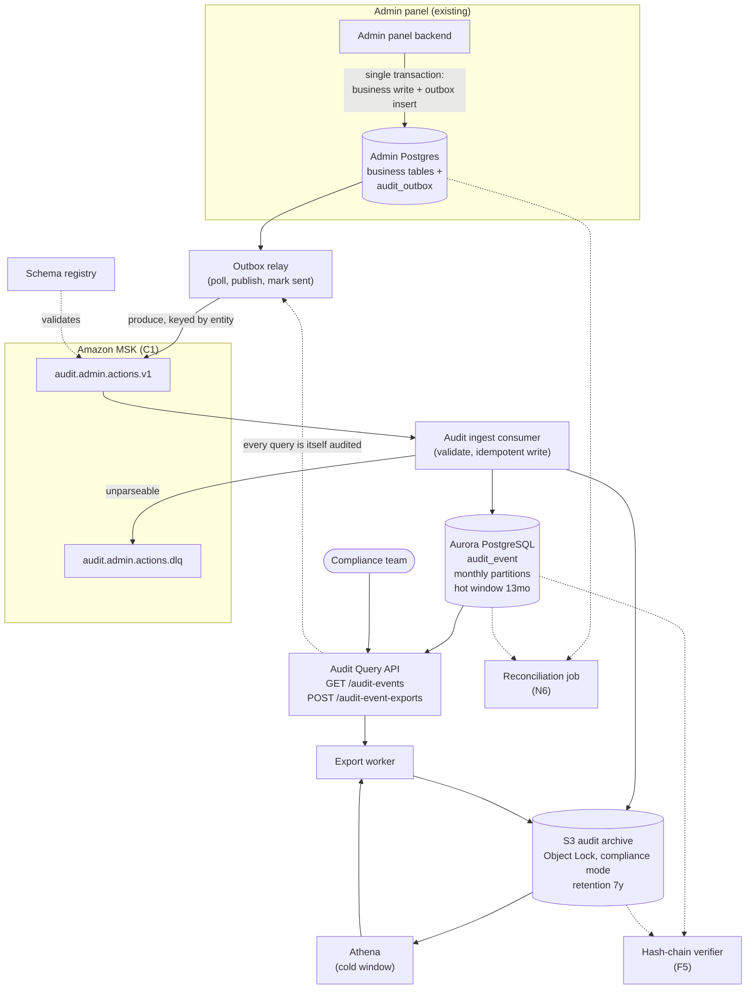
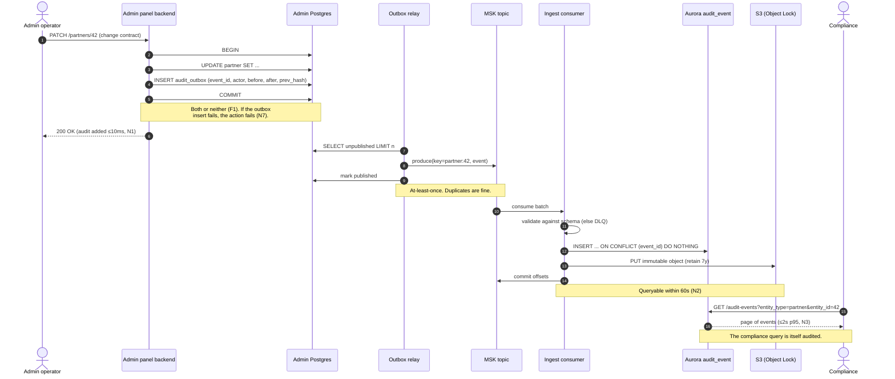

# RFC — Audit Log Service

**Status:** draft (open for comment)
**Current working focus:** decision
**Author:** Lucas Marques
**Date:** 2026-09-08

> **Reading note on evidence.** This RFC was written without access to the admin panel codebase,
> production metrics, or the company API standard document. Everything that would normally be a
> measured fact is therefore carried as a **labelled assumption (A1…A9)**, and the design is built so
> that the assumptions that matter most are cheap to check before we commit code. Assumptions are
> listed in one place (§3) and referenced inline. **Do not treat any number in this document as
> measured.** The open questions that would replace them are listed in §11.

---

## 1. Related documents

To be attached before review closes — none of these exist as links in this draft:

- Company API standard (resource naming, pagination, error envelope, auth) — **needed, see Q2**.
- Platform team's Kafka/MSK decision record and topic-onboarding guide — **needed, see Q1**.
- Compliance team's actual request: what they ask for today, in their words, and the retention period
  they are held to — **needed, see Q3**.
- Admin panel action inventory (the list of things a user can do that must be audited).
- Data retention and PII policy for internal records.

---

## 2. Context

### What happens today

The admin panel is the internal tool through which staff act on production data — the exact surface
where a mistaken or malicious action does the most damage. When something needs to be reconstructed
after the fact ("who changed this partner's contract on the 14th, and what did it look like
before?"), there is no system of record for it. What exists is application logging: lines emitted by
the admin panel for operational debugging, shipped to the production log store.

So the compliance team's current workflow is to ask engineering to **grep production logs by hand**.
That has four failure modes, and all four are why we are here:

1. **It is not complete.** Application logs are written for debugging, not for evidence. An action
   that no developer thought worth logging simply has no record. Nobody can tell the difference
   between "it did not happen" and "it was not logged".
2. **It is not durable.** Log retention is set for operational needs (days to weeks), not for the
   multi-year window compliance is held to. Evidence expires quietly.
3. **It is not queryable.** "All actions by this operator, on this entity, in this period" is a
   structured query. Free-text grep over unstructured lines cannot answer it reliably, and cannot
   prove the answer is exhaustive.
4. **It is not trustworthy as evidence.** Logs are mutable by anyone with access to the log store,
   and the people being audited include people with that access. There is no separation between the
   audited and the auditors.

On top of that, every request costs an engineer hours of manual work and gives compliance an answer
they cannot verify themselves.

### Why now

Two things force the decision. First, the manual grep workflow is a recurring, growing tax on
engineering with no ceiling — it scales with compliance's activity, not with ours. Second, and more
seriously, the current setup does not actually satisfy an audit: we cannot demonstrate that the
record of admin actions is complete or unaltered. That is a finding waiting to happen, and it is not
fixable retroactively — **audit data that was never captured cannot be recovered later.** Every week
we wait is a week of evidence permanently lost.

### The problem to solve

**Every action taken in the admin panel must land in a durable, tamper-evident store that the
compliance team can query themselves, without engineering in the loop.**

### Out of scope

- **A browsing UI.** The user named it as a nice-to-have; it is deferred deliberately (§9, Phase 4).
  The query API is designed so a UI is additive, not a rewrite. Compliance is served in v1 by API
  access plus an export endpoint.
- **Audit sources other than the admin panel.** Actions from the public API, mobile clients,
  background jobs, and direct database access are *not* captured by this service in v1. This is a
  real gap and it must be stated to compliance explicitly, because "queryable audit log" will be
  heard as "everything". The event contract is designed to accept other producers later.
- **Real-time detection and alerting.** This is a system of record, not a SIEM. No anomaly
  detection, no "alert when an operator exports 10,000 records".
- **Retrofilling history.** We cannot reconstruct actions that were never captured. The log starts on
  the day capture ships.
- **Replacing application logging.** Operational logs stay exactly as they are; they serve a
  different purpose and a different audience.
- **Access review / permissions management.** Who *may* act in the admin panel is a separate concern
  from recording what they *did*.

---

## 3. What was asked, and how it is classified

The request arrived as six numbered items plus a closing sentence. The closing sentence is the actual
requirement; several of the numbered items are not requirements at all. Sorting this out is the first
piece of architectural work, because everything downstream is judged against the list, and three of
the six items would otherwise silently decide the design for us.

| # | As stated | Classified as | Why |
| --- | --- | --- | --- |
| — | "Every admin panel action queryable by compliance; they grep production logs by hand" | **The requirement** (F1–F4, N1–N4) | This is the business-critical driver. It was stated last and unnumbered, but it is the only item that would still matter if all the others were withdrawn. |
| 1 | Must use Kafka — platform team decided | **Constraint C1**, not a requirement | Kafka is a *mechanism*. The requirement underneath it is "the event reaches the store without loss". Recorded as a given because the platform team owns it — but its cost is stated, and §7 records what would reopen it. |
| 2 | Endpoints follow the company API standard | **Requirement N5** (architecturally relevant) | A public contract is expensive to change once compliance and a future UI depend on it. Passes the *hard to reverse* test. |
| 3 | It should be fast | **Not a requirement as stated** — replaced by N1, N2, N3, N4 | "Fast" hides the decision instead of making it. It also conflates four unrelated budgets that pull the design in different directions: write-path overhead, ingest freshness, query latency, and export duration. Split and given numbers (assumed — see A4). |
| 4 | Test coverage above 90% | **Not architecturally relevant** — an engineering standard, tracked in CI | It does not force a component, a boundary, or an integration to exist; the design is identical at 90% and at 70%. Kept as a delivery gate in §9, out of the drivers. Ranking-style behaviour that *does* need proving is covered by N6 (reconciliation), which is a runtime property, not a coverage number. |
| 5 | Must run on AWS | **Constraint C2** | Correctly a given, not a requirement. It genuinely shapes the option set (which managed services are on the table), so it is recorded rather than dropped. |
| 6 | Nice to have: a UI for browsing logs | **Non-goal for v1**, with a design obligation | Explicitly deprioritized by the requester. It leaves one obligation on the design: the query API must be shaped for a UI (filtering, stable pagination) so the UI is additive later. |

### Constraints (given, not decided here)

- **C1 — Kafka is the event transport.** Decided by the platform team. Accepted. See §7 for the cost
  this carries and the conditions under which it should be revisited.
- **C2 — Runs on AWS.** Everything else runs there; a second cloud would add a network boundary, a
  second security model, and a second on-call surface for no benefit.

### Assumptions

Every one of these is a guess made in the absence of data. Each is labelled so a reviewer can attack
it directly, and §11 lists the question that would settle it.

| ID | Assumption | Why it matters | Confidence |
| --- | --- | --- | --- |
| A1 | ≤ 500,000 audited admin actions per day; average event ≈ 2 KB serialized | Sizes the store and decides whether Postgres is viable at all | **Low** — order-of-magnitude guess. If the true figure is 50× higher the store decision changes. |
| A2 | Peak burst ≈ 100 events/second (bulk operations, batch imports) | Sizes the consumer and partition count | Low |
| A3 | The admin panel is backed by PostgreSQL and its writes run in transactions the application controls | The transactional-outbox design depends entirely on this | **Medium** — plausible for a system on AWS, but unverified. If false, §6 dimension A changes. |
| A4 | Latency targets: write overhead ≤ 10 ms p95; queryable within 60 s p95; interactive query ≤ 2 s p95 | Replaces "should be fast" | Low — these are *proposed* budgets for compliance to confirm, not measured or agreed ones |
| A5 | Retention obligation is 7 years, of which the most recent 13 months need interactive query | Drives the hot/cold tiering; the single biggest cost lever | **Low** — pure guess. Must come from compliance/legal. |
| A6 | The compliance team can consume a REST API with a token, or a CSV export; they are not blocked on a UI | Justifies deferring the UI | Low — the requester said UI is nice-to-have, but that is an engineering read of compliance's tolerance |
| A7 | Audited actions may reference personal data, and audit records may be subject to deletion requests that conflict with immutable retention | Forces the field allowlist and the crypto-shredding note in §5 | Medium |
| A8 | An MSK cluster (or MSK Serverless) already exists and is operated by the platform team, with an onboarding path for a new topic | If we must stand up and operate Kafka ourselves, the effort and risk in §6 dimension D roughly double | Medium |
| A9 | Concurrent compliance users are few (single digits), doing investigative queries, not dashboard traffic | Lets us size the query path modestly and skip a caching layer | Medium |

---

## 4. Requirements

Only the architecturally-relevant ones. Each is stated so that it can be checked, not just agreed
with.

### Functional

- **F1 — Completeness.** Every state-changing action performed through the admin panel produces
  exactly one audit event. A successful admin action with no corresponding audit event is a defect of
  the same severity as data loss. Reads are audited only for actions the policy names as sensitive
  (bulk export, viewing full documents) — a decision to confirm (Q4).
- **F2 — Self-describing events.** An event answers, without joining to anything else that may have
  since changed: **who** (actor id, actor identity at the time, source IP, session), **what** (action
  type, entity type, entity id), **when** (server-side event time, UTC, plus ingest time),
  **from where** (request/correlation id, admin panel release), and **what changed** (before/after
  for the fields the action touched, on the allowlist). Denormalizing the actor's identity into the
  event is deliberate: an audit record must not change meaning because someone was later renamed or
  deprovisioned.
- **F3 — Structured query by the compliance team.** They must be able to filter by actor, action
  type, entity type + entity id, and time range, in any combination, and page through the results —
  without engineering assistance and without writing SQL.
- **F4 — Bulk export.** A filtered result set must be exportable as a file (CSV and JSONL) so
  compliance can attach it to a case file or hand it to an external auditor.
- **F5 — Tamper evidence.** It must be demonstrable that a stored event has not been altered or
  removed since it was written. Nobody, including engineers with production access, may modify or
  delete an audit event within its retention window through any normal path.

### Non-functional

- **N1 — Write-path overhead ≤ 10 ms p95** added to an admin action (A4). Auditing must not make the
  admin panel feel slower.
- **N2 — Freshness: an event is queryable within 60 s p95** of the action (A4). Compliance
  investigates in hours and days; seconds of lag are irrelevant, minutes are fine, an hour is not.
- **N3 — Interactive query ≤ 2 s p95** for a filtered query over the hot window returning ≤ 100 rows
  (A4, A5). Cold-window queries are explicitly *not* interactive: asynchronous, ≤ 15 min.
- **N4 — Export: 1,000,000 rows in ≤ 15 min**, delivered asynchronously (A4).
- **N5 — Endpoints follow the company API standard** (C2/item 2): resource naming, pagination shape,
  filter syntax, error envelope, auth. Blocked on Q2 — the standard document.
- **N6 — Provable completeness.** A scheduled reconciliation proves that captured events and stored
  events agree, and alarms on any divergence. F1 is worthless as a promise; it has to be a measured,
  alarmed number. This is the requirement that most shapes the design, and it is the one nobody
  asked for.
- **N7 — Durability over availability, on the write path.** If the audit record cannot be captured,
  the admin action fails. This is a deliberate inversion of the usual preference and it is argued in
  §5; it is stated here because it is a requirement, not an implementation detail.
- **N8 — Retention: 7 years, immutable** (A5), with the most recent 13 months interactively
  queryable.
- **N9 — Least privilege and separation of duties.** The compliance team reads; the service writes;
  nobody updates or deletes. Application credentials have no `UPDATE` or `DELETE` grant on the audit
  tables.
- **N10 — Observability.** Structured logs with correlation id, OpenTelemetry traces across producer
  → Kafka → consumer → store, and alarms on: outbox backlog age, consumer lag, DLQ depth, and the N6
  reconciliation gap.

**Dropped from the drivers:** 90% test coverage (an engineering standard, enforced in CI — §9), and
the browsing UI (§2, out of scope). Neither changes the structure of the system.

---

## 5. Design

The shape of the system follows from three decisions, each of which is argued against a requirement,
and each of which is put to the tradeoff analysis in §6.

### 5.1 Capture: a transactional outbox, in the admin panel's own database

F1 (completeness) is the hardest requirement in the document, and it is hard for one specific
reason: **the action and the record of the action live in two different systems.** Any design where
the admin panel does its work and *then* publishes an event has a window in which the work succeeded
and the event was lost — a process death, a network partition, a broker unavailability. Nothing
downstream can repair that; the event never existed.

So the audit event is written **into the same database transaction as the business change**, as a row
in an `audit_outbox` table (A3). The transaction either commits both or neither. A separate **outbox
relay** then moves committed rows to Kafka and marks them published, retrying until it succeeds. The
relay can crash, double-send, or lag; none of that loses an event, and duplicates are handled by
idempotent writes downstream (5.3).

This is what makes N7 explicit rather than accidental: because the outbox insert is inside the
business transaction, a failure to record the audit event *fails the admin action*. That is the
correct tradeoff for an internal admin tool — an unrecorded privileged action is worse than a
retried one — but it is a real cost, and it is not obviously right, so it is steelmanned in §6
dimension A.

### 5.2 Transport: Kafka (C1)

The relay produces to a single topic, `audit.admin.actions.v1`, keyed by `entity_type:entity_id` so
that all events about one entity land in one partition and stay ordered relative to each other. The
payload is a versioned schema in the schema registry; the consumer rejects anything that does not
validate, to the DLQ. Kafka retention on this topic is **transport retention (7 days), not archival
retention** — the archive is S3 (5.4). Conflating the two is a common and expensive mistake: Kafka
is not a compliance store, and paying to keep 7 years in a broker would be absurd.

### 5.3 Ingest: an idempotent consumer

The consumer reads the topic, validates the schema, and writes each event to the audit store with
`INSERT … ON CONFLICT (event_id) DO NOTHING`, where `event_id` is a UUID generated by the producer at
outbox-insert time. This is what converts Kafka's at-least-once delivery into exactly-once *effect* —
the property F1 actually needs. Poison messages go to a DLQ topic with an alarm; the DLQ is drained
by hand, deliberately, because a message we cannot parse is an incident, not a routine event.

### 5.4 Storage: hot in Aurora PostgreSQL, cold and immutable in S3

Every event is written to both:

- **Aurora PostgreSQL — the query store.** Table `audit_event`, range-partitioned by month, holding
  the hot window (13 months, A5). Indexed for exactly the access patterns F3 names:
  `(occurred_at)`, `(actor_id, occurred_at)`, `(entity_type, entity_id, occurred_at)`,
  `(action_type, occurred_at)`, plus a GIN index on the `changes` JSONB column. Partitioning by month
  means retention is a `DETACH PARTITION`, not a seven-hour `DELETE`.
  Sizing from A1: ~1 GB/day raw → ~350 GB/year → **~380 GB for the hot window**, before index
  overhead (assume roughly 2× with the GIN index, so ~750 GB provisioned). Comfortable for Aurora,
  and the reason the store decision is not forced to a search cluster.
- **S3 with Object Lock in compliance mode — the archive and the evidence.** The raw validated event
  is written as an immutable object, partitioned by date, with a retention period matching N8. Object
  Lock in compliance mode means *no principal, including the account root, can delete or overwrite
  the object before its retention expires* — which is the only honest way to satisfy F5. This is
  also the replay source: if the Aurora store is ever lost or found to be wrong, it is rebuilt from
  S3, not from Kafka.

Cold-window queries (older than the hot window) run over the S3 archive through Athena, asynchronously
— which is why N3 splits interactive from cold.

**Tamper evidence (F5)** comes from two independent mechanisms, because one is not enough: Object Lock
prevents deletion, and a **hash chain** links each event to the previous one per partition
(`prev_hash`), so a *modified* record breaks the chain verifiably. A daily job verifies the chain and
alarms on a break.

> Note on a rejected option: a purpose-built immutable ledger database was considered for F5 and
> excluded. **Inference, needs verification before review closes (Q6):** Amazon QLDB was placed on an
> end-of-support path, which would disqualify it as the foundation of a seven-year retention
> obligation. The Object Lock + hash chain combination reaches the same property with services we
> already depend on.

### 5.5 Access: the query API (N5, F3, F4)

A read-only service exposing, in the company API standard (Q2):

- `GET /audit-events` — filters (`actor_id`, `action_type`, `entity_type`, `entity_id`,
  `occurred_at` range), cursor pagination, stable sort. Serves the hot window synchronously.
- `GET /audit-events/{event_id}` — one event in full.
- `POST /audit-event-exports` → `GET /audit-event-exports/{id}` — asynchronous export job returning a
  presigned S3 URL (F4, N4). Same endpoint transparently handles cold-window queries, since both are
  "a big asynchronous scan".
- Every compliance query is itself audited. The auditors are audited too; this is not optional in a
  system whose purpose is accountability.

The API is shaped for a future UI (filters + stable cursors are exactly what a table view needs), so
Phase 4 is additive.

### 5.6 Component-to-requirement traceability

Every component earns its place, and every requirement has a home. Both directions.

| Component | Requirements it serves |
| --- | --- |
| `audit_outbox` table + in-transaction insert | F1, N1, N7 |
| Outbox relay | F1, N2 |
| Kafka topic `audit.admin.actions.v1` (MSK) | C1, F1, future fan-out |
| Schema registry + versioned event contract | F2, extensibility to other producers |
| Idempotent ingest consumer | F1, F2, N2 |
| Aurora PostgreSQL `audit_event` (partitioned) | F3, N3, N8 |
| S3 archive + Object Lock (compliance mode) | F5, N8, disaster recovery |
| Hash chain + daily verifier | F5 |
| Query API (`/audit-events`) | F3, N3, N5, N9 |
| Export worker (`/audit-event-exports`) | F4, N4, cold-window queries |
| Reconciliation job (outbox vs. store counts) | N6, F1 |
| DLQ + alarms, OTel tracing, structured logs | N10 |
| Field allowlist + redaction at emit time | A7, N9 |

| Requirement | Met by |
| --- | --- |
| F1 completeness | Outbox in-transaction + relay retry + idempotent consumer + reconciliation |
| F2 self-describing | Event contract in schema registry; actor identity denormalized at emit |
| F3 structured query | Query API + Aurora indexes |
| F4 bulk export | Export worker + presigned S3 |
| F5 tamper evidence | Object Lock compliance mode + hash chain + verifier |
| N1 write overhead | Single indexed INSERT in the existing transaction; no network call on the hot path |
| N2 freshness | Relay poll interval + consumer lag alarm |
| N3 query latency | Purpose-built indexes; hot/cold split so cold scans never sit on the interactive path |
| N4 export | Asynchronous job, streamed to S3 |
| N5 API standard | Query API design (pending Q2) |
| N6 provable completeness | Reconciliation job + alarm |
| N7 durability > availability | Outbox inside the business transaction (deliberate) |
| N8 retention | Monthly partitions + `DETACH`; S3 lifecycle to Glacier; Object Lock |
| N9 least privilege | No UPDATE/DELETE grants; separate read role for compliance |
| N10 observability | OTel across all four hops; four named alarms |

### 5.7 Static diagram

### 5.8 Dynamic diagram — capture and query

### 5.9 Flow in words

1. An operator performs an action in the admin panel.
2. The backend opens a transaction, applies the business change, and inserts one `audit_outbox` row
   carrying the full event (F2) plus `prev_hash` for the chain.
3. The transaction commits — both rows or neither (F1). If the outbox insert fails, the whole action
   fails and the operator sees an error (N7). Nothing has been sent anywhere yet, so N1 costs one
   indexed insert.
4. The outbox relay polls for unpublished rows, produces them to the Kafka topic keyed by entity, and
   marks them published. A crash between produce and mark causes a duplicate, never a loss.
5. The ingest consumer validates each event against the registered schema. Anything invalid goes to
   the DLQ and raises an alarm — it is never silently dropped.
6. Valid events are inserted into Aurora idempotently on `event_id`, and written to S3 under Object
   Lock. Offsets commit only after both succeed.
7. Compliance queries the API directly, filtering by actor, action, entity, and period; large or
   cold-window requests become asynchronous export jobs returning a presigned URL.
8. Nightly: the reconciliation job compares outbox and store counts per hour and alarms on any gap
   (N6); the verifier walks the hash chain and alarms on a break (F5).

---

## 6. Alternatives analysis (tradeoff)

Grouped by the dimension being decided. Multiple risks per alternative occupy extra rows.

### Dimension A — how the event is captured

| Alternative | Pros | Cons | Risk (description) | Impact | Probability | Mitigation | Contingency |
| --- | --- | --- | --- | --- | --- | --- | --- |
| **A1 — Transactional outbox in the admin DB** *(chosen)* | Only option that makes F1 a property rather than a hope: action and record commit atomically. Survives broker outages without loss. No network call on the request path (N1). Duplicates, not gaps, are the failure mode — and duplicates are cheap to absorb. | Requires the admin panel to control its transactions (A3). Adds write load and a relay component. Couples audit capture to the admin panel's DB availability — an audit failure fails the business action. | Outbox table growth degrades admin DB write performance | Medium | Medium | Delete published rows aggressively (they are already durable in S3); keep the table small and index-light; monitor bloat and autovacuum | Move the outbox to its own tablespace or a dedicated schema; partition it |
| | | | Relay lags or stalls, breaking N2 | Medium | Medium | Alarm on oldest-unpublished age, not just on backlog depth; run ≥ 2 relay instances with advisory locking | Manual relay run; N2 is a soft target, F1 is unaffected by lag |
| | | | A3 is false — the panel cannot write in the same transaction | High | Low | Verify against the codebase before any commitment (Q5) — this is a 30-minute check | Fall back to A2 with an accepted, documented loss window |
| **A2 — Produce to Kafka directly from the request path** *(steelmanned: simplest thing that satisfies C1, no new tables, no relay, lowest code volume, and the platform team's own onboarding docs almost certainly describe exactly this)* | Fewest moving parts. No admin DB write amplification. Direct fit to the Kafka mandate. | Loses events whenever the broker is unreachable or the process dies mid-request — precisely the window F1 forbids. Adds broker latency to the request (N1) unless fire-and-forget, and fire-and-forget makes loss silent. Forces a choice between failing admin actions on broker trouble and losing evidence. | Silent evidence loss during a broker incident | **High** | Medium | Local disk spooling on produce failure — which is a worse outbox | None. Lost events are unrecoverable; this is why it is rejected. |
| **A3 — CDC from the admin DB's WAL (Debezium)** *(steelmanned: captures changes made by *any* path, including direct SQL — which is the one thing the outbox misses, and arguably the strongest completeness story available)* | Zero changes to admin panel application code. Catches out-of-band database writes. Naturally produces before/after images. | Emits *row changes*, not *business actions* — no actor, no intent, no session. Reconstructing "who did what and why" from a WAL stream requires reintroducing exactly the application context CDC was supposed to avoid, so F2 is not met. Adds Debezium/Kafka Connect as a new operational surface. Schema migrations become audit incidents. | Cannot attribute an action to an actor (F2 unmet) | High | High | Application must stamp actor onto every row anyway — at which point the outbox is simpler | Use CDC as a *supplementary* control for out-of-band writes only (a genuine future improvement, §10) |
| **A4 — Emit from the frontend / API gateway** | No backend changes; captures the request as the user made it | Trivially bypassable; sees the request but not whether it succeeded or what changed. Not evidence. | Records intent, not effect | High | High | — | — |

### Dimension B — where the queryable data lives

| Alternative | Pros | Cons | Risk (description) | Impact | Probability | Mitigation | Contingency |
| --- | --- | --- | --- | --- | --- | --- | --- |
| **B1 — Aurora PostgreSQL, partitioned by month** *(chosen)* | Team knows it; already operated. Handles the assumed volume comfortably (~380 GB hot, A1/A5). Exact indexes for F3's access patterns. Retention is a partition detach. Strong consistency, so N2 is bounded by ingest, not by index refresh. Enforcing N9 (no UPDATE/DELETE grants) is native. | Not a full-text engine — free-text search across `changes` is limited to what GIN + tsvector give. Scaling past ~10× A1 means real work. Storage cost per GB above object storage. | A1 is wrong by an order of magnitude or more | High | **Medium** | Measure actual admin action volume before building (Q1/Q5) — cheap and decisive | Shorten the hot window (13mo → 3mo) and push more to S3/Athena; the hot/cold split already exists so this is a config change, not a redesign |
| | | | Compliance turns out to need free-text search over payloads | Medium | Medium | Confirm the access patterns with compliance up front (Q3) | Add OpenSearch as a secondary index fed from the same topic — the fan-out is already there |
| **B2 — OpenSearch Service** *(steelmanned: this is what "queryable audit log" usually means in practice; ad-hoc investigation over semi-structured events with free-text is exactly its job, and it comes with Dashboards, which would deliver the nice-to-have UI for free)* | Excellent ad-hoc and free-text query. Aggregations for free. Dashboards would satisfy item 6 at near-zero extra cost. Scales to far more than A1. | A cluster running 24/7 for single-digit users (A9) — cost is driven by retention, not by query load. Eventual consistency complicates N2's definition. Immutability and least-privilege are weaker and more awkward to enforce than SQL grants. New operational surface (shards, mappings, version upgrades). Another datastore for the team to learn. | Cost scales with retained volume regardless of usage | Medium | High | Index-lifecycle management, hot/warm/cold tiers, UltraWarm | Shrink retention in the cluster; keep S3 as the archive of record |
| | | | Cluster becomes the system of record and is not immutable | High | Medium | Keep S3 + Object Lock as the record regardless of query store | Rebuild the index from S3 |
| **B3 — S3 + Athena only (no hot store)** *(steelmanned: cheapest by a wide margin, immutable by construction, one storage system instead of two, and compliance investigations are not interactive work — a 30-second query may be entirely acceptable)* | Lowest cost. Immutability is inherent. No database to operate or scale. Retention is a lifecycle rule. | Query latency in seconds to minutes — N3 unmet for interactive use. Small-file problem needs compaction. Per-query cost and no useful concurrency story for exploratory clicking. | N3 unmet; compliance experience stays frustrating | Medium | High | Iceberg tables + compaction + partition pruning | Add the hot store back — i.e. arrive at B1 |
| **B4 — DynamoDB** | Fast key lookups; serverless; cheap at low volume | F3 wants arbitrary combinations of four filters plus ranges. That is either many GSIs or a scan. Wrong access pattern for investigative query. | Query flexibility structurally insufficient | High | High | — | — |

### Dimension C — what runs the consumer and the API

| Alternative | Pros | Cons | Risk (description) | Impact | Probability | Mitigation | Contingency |
| --- | --- | --- | --- | --- | --- | --- | --- |
| **C1 — Lambda with an MSK event source for ingest; Lambda behind API Gateway for the query API** *(chosen)* | No idle cost; admin panel traffic is business-hours-shaped, so a 24/7 consumer is mostly idle. Event-source mapping handles polling, batching, and offset commits. Fits the assumed volume (A1/A2) with room to spare. | Cold starts on the query path. Connection management against Aurora needs RDS Proxy. 15-minute ceiling forces exports to be chunked. Batch failure semantics need care to avoid reprocessing whole batches. | Lambda concurrency exhausts Aurora connections | Medium | Medium | RDS Proxy (assumed already in use); reserved concurrency on the consumer | Move the consumer to Fargate; the consumer is a small, portable component |
| | | | Cold start breaks N3 for the first query of a session | Low | Medium | Provisioned concurrency during business hours if measured to matter | Accept — a compliance investigator's first query taking 3 s is not a real problem |
| **C2 — ECS Fargate long-running consumer + service** *(steelmanned: a Kafka consumer is a long-running process by nature; running it as one avoids fighting the event-source abstraction, gives real connection pooling, no duration ceiling, and simpler local reproduction of consumer-group behaviour)* | Natural fit for streaming. Persistent pooled connections. No timeout ceiling — exports can be simple. Easier to reason about lag and rebalancing. | Pays for idle capacity around the clock. More infrastructure to define and patch. | Over-provisioned for A1's volume | Low | High | Small task sizes; scale on lag | Accept the cost — it is small in absolute terms |
| **C3 — Kubernetes** | Consistent with a platform standard if one exists | Heaviest operational overhead for two small components | Effort disproportionate to the problem | Medium | Medium | Reuse existing platform charts if the org already runs EKS | Fall back to C1/C2 |

### Dimension D — Kafka flavour (within C1)

| Alternative | Pros | Cons | Risk (description) | Impact | Probability | Mitigation | Contingency |
| --- | --- | --- | --- | --- | --- | --- | --- |
| **D1 — Reuse the platform team's existing MSK cluster** *(chosen, contingent on A8)* | No new infrastructure; platform team owns operations, patching, and on-call. Fastest path. Consistent with C1's intent. | Shared blast radius with other tenants. Topic configuration, ACLs, and quotas are someone else's process, so our schedule depends on theirs. | Topic onboarding is slower than the project timeline | Low | Medium | Raise the topic request in week 1, before any code (Q1) | Phase 1 (capture to outbox + S3) does not need the topic at all — see §9 |
| | | | Noisy-neighbour throttling delays ingest (N2) | Low | Low | Request a quota; alarm on produce latency | Outbox absorbs it; no loss |
| **D2 — Dedicated MSK Serverless cluster for audit** | Isolation; scales to zero-ish administration | A fixed per-cluster-hour charge applies regardless of traffic (**pricing unverified — check before deciding**), which is poor value for A1's volume. Duplicates what the platform team already runs. | Cost with no corresponding benefit | Medium | High | — | — |
| **D3 — Provisioned MSK we operate ourselves** | Full control over configuration and retention | We become Kafka operators for one low-volume topic. Doubles the operational surface of this project. | Operational burden disproportionate to the problem | High | High | — | — |

---

## 7. On the Kafka constraint

C1 is accepted, and this section exists so that acceptance is *informed* rather than silent. A
constraint recorded without its cost becomes folklore, and the next team inherits a decision nobody
can explain.

**The strongest case for Kafka here** — and it is a real one: audit events are the canonical example
of data multiple consumers eventually want. A SIEM, a security-analytics pipeline, a data warehouse,
an anomaly detector, and a future "recent activity" widget in the admin panel are all plausible, and
each one is nearly free once the topic exists and enormously annoying to retrofit if it does not.
Kafka also gives the platform team one operational model to support instead of N bespoke pipelines,
and it decouples our ingest deployment schedule from the admin panel's. Those are good reasons, and
they are why this RFC does not fight the constraint.

**What it costs us on this specific problem.** With an outbox on one side and an idempotent
database write on the other, Kafka is transport between two components we own — and the delivery
guarantee F1 needs is supplied by the outbox and the idempotent write, not by the broker. What Kafka
adds is a schema contract, a DLQ, a consumer group, offset semantics, a partitioning-key decision,
and a second team's onboarding process, for a stream assumed at roughly 6 events/second average
(A1). For a single-producer, single-consumer path, the simplest design that meets every requirement
in §4 is outbox → worker → Aurora + S3, with no broker at all.

**What would reopen it:** if topic onboarding blocks Phase 2 for more than about two weeks, or if the
platform team confirms that no second consumer is planned within a year, the *cost* of the hop
exceeds its option value and it is worth asking them to reconsider — cheaply, because Phase 1 ships
without the topic and §9 is sequenced so the broker is not on the critical path for the compliance
outcome.

**What we should not do:** quietly satisfy C1 by producing to Kafka *only* and skipping the outbox
(alternative A2). That is the one shape that trades away F1 to honour a mechanism.

---

## 8. The decision

**Decision style: autocratic.** This is the audit service's owning team's call, made by me as author
after review, with two explicit deferrals to other owners: **C1 (Kafka) belongs to the platform team
and is taken as given**, and **N8 (retention) and the F1 read-auditing scope belong to
compliance/legal, not to engineering.** Reviewers are invited to attack the assumptions in §3
directly — that is where this document is weakest.

**We will build:**

1. **Capture** via a **transactional outbox** in the admin panel's PostgreSQL, inserted in the same
   transaction as the business change (A1 in dimension A). This is the load-bearing decision: it is
   the only alternative that makes completeness a property of the system rather than a hope, and
   completeness is the entire point of an audit log.
2. **Transport** over the platform team's **existing MSK cluster** (D1), single topic
   `audit.admin.actions.v1`, keyed by entity, with a registered versioned schema and a DLQ — honouring
   C1 while keeping the guarantee in the outbox where it belongs.
3. **Ingest** through an **idempotent consumer on Lambda** via an MSK event-source mapping (C1),
   writing to both stores before committing offsets.
4. **Storage** split: **Aurora PostgreSQL**, monthly partitions, 13-month hot window (B1) for
   interactive query, and **S3 with Object Lock in compliance mode** as the immutable
   seven-year record and replay source. S3 is the system of record; Aurora is an index over it. That
   distinction is what lets us change the query store later without touching the evidence.
5. **Tamper evidence** from two independent mechanisms: Object Lock against deletion, a per-partition
   hash chain against modification, both verified nightly.
6. **Access** through a read-only query API in the company API standard, with asynchronous export for
   bulk and cold-window requests. Compliance queries are themselves audited.
7. **Provable completeness** through a nightly reconciliation of outbox against store, alarmed. F1 is
   not a claim we make; it is a number we watch.

**The strongest objection to this decision**, stated plainly: it puts the audit write inside the
admin panel's business transaction, which means a problem in the audit path can fail a legitimate
admin action, and it adds write load to a production transactional database. Both are real. It is
accepted because an internal admin tool briefly refusing a privileged action is recoverable — the
operator retries — while an unrecorded privileged action is not recoverable at all, and the cost of
the write is one indexed insert on a row we delete as soon as it is durable elsewhere.

**What would flip it:** if A3 is false (the admin panel cannot control its transactions), dimension A
is reopened and the answer is probably A2 with a documented, measured loss window. If A1 is wrong by
one to two orders of magnitude, dimension B is reopened in favour of B2 (OpenSearch). If compliance
turns out to need free-text search across event payloads rather than structured filters (Q3), B1 is
the wrong store and B2 is right. **All three are settled by questions in §11, not by more argument —
and all three are cheap to answer.**

---

## 9. Launch strategy

Sequenced so that the irreversible thing happens first. Capture is the only phase whose delay
destroys value permanently: **every day without capture is a day of evidence that cannot be
recovered.** Query, export, and UI can all be added later over data we already hold. Note that
Phase 1 deliberately does not depend on Kafka topic onboarding, so a platform-team delay cannot stop
the clock on evidence loss.

| Phase | Ships | Why here | Gate to the next phase |
| --- | --- | --- | --- |
| **0 — Sharpen** (before code) | Measure actual admin action volume and event size (A1/A2); confirm A3 against the codebase; get retention from compliance (A5); get the API standard (N5); agree the audited-action inventory and read-audit scope (F1); request the Kafka topic | Four of these can invalidate a design decision in §8. All are days of work, not weeks, and each one is cheaper now than after the code exists | Assumptions replaced by facts, or explicitly accepted as risks by name |
| **1 — Capture and archive** | Outbox + relay + consumer + S3 with Object Lock. Highest-value actions first, then the full inventory. **No query API yet.** | Stops the permanent loss of evidence at the earliest possible date. Compliance is still on manual grep, but the record is now being kept properly | Reconciliation (N6) green for 2 weeks; the audited-action inventory fully covered |
| **2 — Make it queryable** | Aurora store + `GET /audit-events` + `/audit-events/{id}`; compliance onboarded with credentials and a short walkthrough | The point at which manual grep stops. This is the phase the requester actually asked for | Compliance answers a real historical question without engineering help |
| **3 — Bulk and cold** | Export jobs, Athena over the archive, retention automation (partition detach, S3 lifecycle to Glacier) | Needed for case files and external auditors, and before the hot window fills | N4 met on a realistic export |
| **4 — UI** *(nice-to-have)* | A browsing UI over the existing API | Explicitly deprioritized; additive by construction. Reassess after compliance has used the API for a quarter — they may not want it, or may want something quite different from what we would have guessed | — |

**Delivery gates applied throughout** (from item 4, kept out of the drivers): automated test coverage
above 90% enforced in CI, with the completeness path — outbox atomicity, relay retry, consumer
idempotency — covered by integration tests against real Postgres and a real broker rather than mocks.
Coverage percentage is the cheap signal here; the integration tests are the one that matters, because
a mocked broker cannot demonstrate F1.

---

## 10. Tasks and roadmap

Estimates are engineering-days for one engineer and are rough; they assume no unfamiliar technology
beyond MSK onboarding.

| Task | Description | Estimate |
| --- | --- | --- |
| Phase 0 — volume and codebase spike | Instrument or sample admin action volume; verify transaction control (A3); confirm RDS Proxy | 3d |
| Phase 0 — compliance and standards intake | Retention, access patterns, read-audit scope, audited-action inventory, API standard | 3d |
| Phase 0 — Kafka topic request | Topic, partitions, retention, ACLs, schema registry subject with the platform team | 1d + their lead time |
| Event contract v1 | Schema, field allowlist, redaction rules, hash-chain definition | 3d |
| Outbox + emit helper in the admin panel | Migration, insert-in-transaction helper, wire the top ~10 highest-risk actions | 5d |
| Outbox relay | Poll, produce, mark, advisory locking, backlog-age alarm | 4d |
| Ingest consumer | MSK event-source Lambda, schema validation, idempotent write, DLQ, S3 put | 5d |
| S3 archive + Object Lock | Bucket, compliance-mode retention, lifecycle to Glacier, replay tooling | 3d |
| Aurora audit store | Partitioned schema, indexes, pg_partman, read role with no UPDATE/DELETE | 4d |
| Query API | `GET /audit-events`, `GET /audit-events/{id}`, auth, company-standard conformance | 6d |
| Export worker | Async job, CSV/JSONL, presigned URLs, Athena path for the cold window | 6d |
| Reconciliation + hash-chain verifier | Nightly jobs, alarms, runbook | 4d |
| Observability | OTel across four hops, dashboards, four alarms, runbooks | 4d |
| Backfill the remaining audited actions | Wire the rest of the inventory | 8d |
| Compliance onboarding | Credentials, walkthrough, a worked example of a real question | 2d |

### Improvement points (deliberately not in v1)

- CDC as a supplementary control for out-of-band database writes — the one completeness gap the
  outbox does not close (dimension A, alternative A3).
- Extending the event contract to other producers (public API, background jobs) so "queryable audit
  log" eventually means all of them.
- OpenSearch as a secondary index if free-text search over payloads turns out to be needed (the topic
  fan-out makes this additive).
- Anomaly detection over the topic — a SIEM concern, and the clearest payoff of honouring C1.

---

## 11. Open questions

These block or could invalidate parts of §8. Answers are worth more than further analysis, and none
takes more than a few days to get.

| # | Question | Owner | Blocks |
| --- | --- | --- | --- |
| Q1 | What is the actual volume of audited admin actions per day and at peak (A1, A2)? | Engineering (measurement) | Dimension B; could flip B1 → B2 |
| Q2 | Where is the company API standard, and does it prescribe pagination, filtering, and error envelopes? | API governance | N5, query API design |
| Q3 | What does compliance actually ask for today, in their words? Structured filters, or free-text search over payloads? How do they want results delivered? | Compliance | Dimension B; F3/F4 shape; whether the UI matters sooner |
| Q4 | Which actions must be audited — all state changes only, or also sensitive reads (bulk export, viewing full documents)? Is there an existing regulatory list? | Compliance / legal | F1 scope, event inventory, volume |
| Q5 | Does the admin panel control its own database transactions (A3), and is it PostgreSQL? | Engineering | Dimension A — the load-bearing decision |
| Q6 | Is there an existing corporate standard or precedent for immutable/WORM audit storage we should conform to, and is the immutable-ledger option genuinely off the table? | Platform / security | F5 mechanism (§5.4) |
| Q7 | What is the retention obligation (A5), and how does it interact with data-deletion requests (A7)? | Legal | N8, storage sizing, cost |
| Q8 | Is a second consumer of the audit topic actually planned (SIEM, warehouse, analytics)? | Platform / security | Whether C1's cost buys anything on this project (§7) |

---

## 12. Version history

| Version | Date | Author | Description |
| --- | --- | --- | --- |
| 1.0 | 2026-09-08 | Lucas Marques | Document created. Requirements reclassified from the original request; capture, transport, ingest, storage, and access decided; eight open questions raised. |
