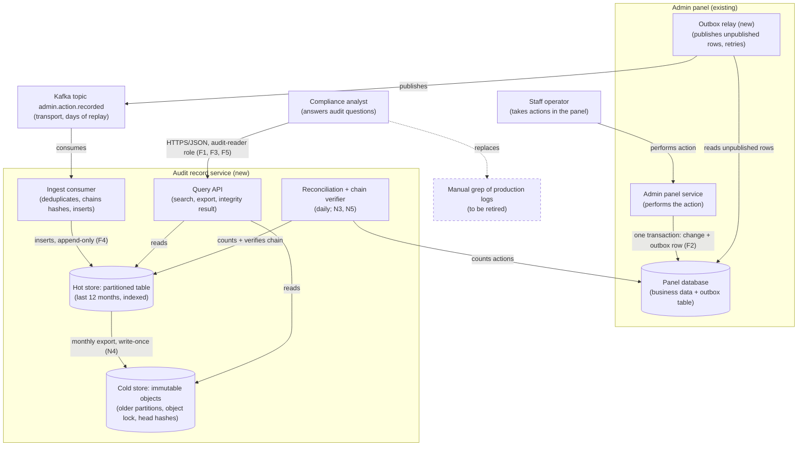
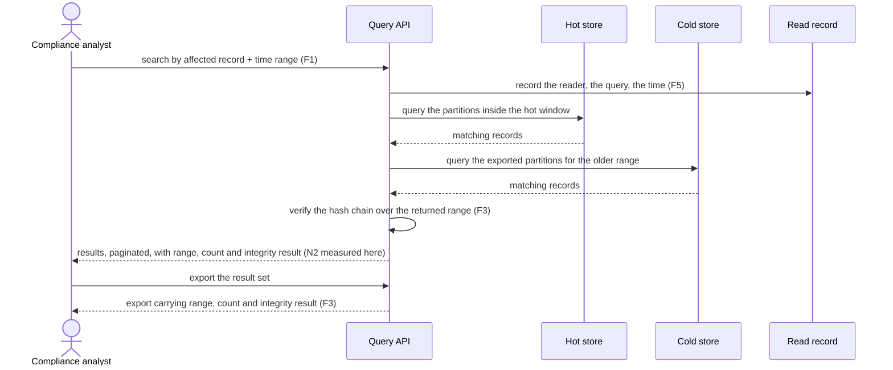
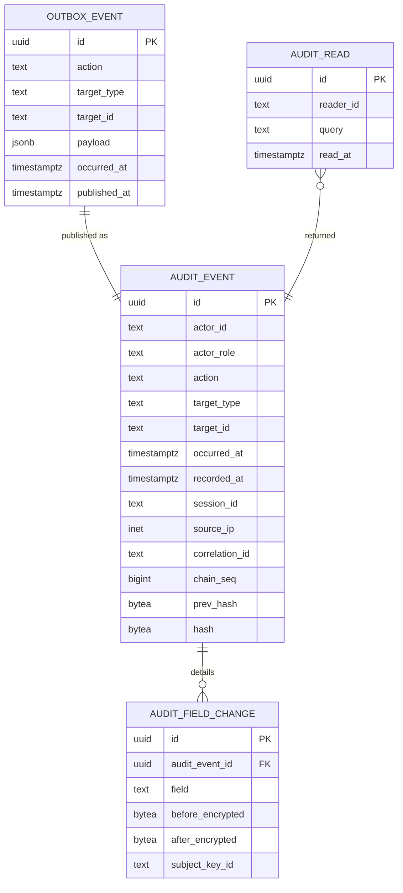

# RFC: Making admin panel actions answerable to compliance

**Status:** proposed (three blocking questions open: B1, B2, B3)
**Decider:** Engineering lead, admin panel  ·  **Reviewers:** Head of compliance, platform team lead, data protection officer
**Current working focus:** decision

> **A note on evidence, before anything else.** This document contains no *measured* numbers. No
> codebase, dashboard, cost report or ticket queue was available to this analysis, so every figure
> below is labeled *assumed* with the requester as its origin, and each one names the query, board or
> log that would replace it. That is a defect of this draft, not a property of the problem: the first
> task in the roadmap is a measurement pass, and the targets in the non-functional table are the ones
> the confirmation step measures first. A reviewer who has access to the admin panel's routes, its
> latency board and the compliance request queue can close most of this in an afternoon.

## Reversibility

**One-way door on two things: the record schema and the moment capture starts.** An action that
happens today and is not recorded cannot be reconstructed tomorrow, so the day capture begins is the
day the evidence base begins, and a field left out of the record is missing for every action already
written. Once compliance answers audit questions from this store, its schema and its completeness
guarantee are load-bearing and cannot be revised retroactively.

Everything else here is a two-way door and gets proportionally less space: the transport, the store
for the hot window, the query surface and the browsing interface can all be replaced later by
re-reading the record stream into a new shape, because the records themselves are the durable asset.

## Context

Every state-changing action a staff member takes in the admin panel — editing a record, refunding,
changing a permission, acting on behalf of a user — is currently observable only as a side effect in
the application's production logs. When the compliance team needs to answer a question about one of
those actions, they cannot answer it themselves. They file a request with engineering, an engineer
greps production logs by hand, and the answer comes back as an excerpt pasted into a reply
(requester's description, 2026-09-08; *assumed* — the compliance request queue and the on-call
handover notes would confirm the volume and the turnaround).

That arrangement fails in four ways, and the four are what the requirements below are derived from.

The answer is not self-service. A compliance question costs an engineer's time, which means questions
get rationed and answers arrive on engineering's schedule rather than the auditor's.

The answer is not complete. A grep finds what was logged, in the retention window the logging
platform happens to keep, in whatever format the code emitted that quarter. Nobody can state, for a
given time range, that the result is every matching action — and an audit answer that cannot claim
completeness is an anecdote.

The answer is not durable. Application logs are sized and retained for debugging, not for evidence.
Whatever retention they have today was chosen for a different purpose and can be changed by whoever
operates the logging platform.

The record is not independent of the people it records. The engineers who can grep the logs can also
write to them, and the same production access that answers the question could alter the answer.
Nobody is alleging that; the point is that the record cannot demonstrate otherwise.

### Current usage

| Role (what they do with the system) | What they do today | Through what | How often or how much (source) |
| --- | --- | --- | --- |
| Compliance analyst answering an audit question about a staff action | Describes the question to engineering and waits for an excerpt | A request to an engineer; no direct access | Volume unknown (requester's description, 2026-09-08; *assumed*. The compliance request queue would give requests per month) |
| Engineer answering on compliance's behalf | Greps production logs by hand, pastes the result into the reply | Log platform search, production shell access | Unknown; each request costs an interrupt (*assumed*. On-call handover notes and the request queue would give the count and the hours) |
| Staff operator taking an action in the admin panel | Edits, refunds, changes permissions, acts on behalf of a user | The admin panel | Action volume unknown (*assumed*. The panel's access log grouped by route, over 30 days, would give actions per day and its daily peak) |
| Auditor asking the compliance team for evidence | Receives excerpts assembled by hand | The compliance team | Unknown; the audit calendar would give the cadence (*assumed*) |

**The problem.** The roles above need a complete, durable, independently trustworthy record of staff
actions that a non-engineer can query. What they have is a manual search over logs kept for a
different purpose, whose completeness nobody can attest to and whose integrity depends on the same
access that performs the actions.

### Goals

| Goal | Who benefits | How we will know |
| --- | --- | --- |
| A compliance analyst answers a question about a staff action the same day it is asked, without an engineer | Compliance analysts; the engineers no longer interrupted | Share of compliance questions closed with no engineering request rises from 0% (all requests go through engineering today; *assumed*) toward 100%; time from question to answer, from the request queue |
| An auditor can rely on the record of staff actions as evidence | The compliance function; the company under audit | An audit accepts an export with no finding about completeness or integrity of the record |
| Staff work at the same pace while their actions are recorded | Staff operators in the admin panel | The panel's action latency at its daily peak, before and after rollout |
| Engineers stop being the search interface for compliance | On-call engineers | Engineering interrupts tagged as compliance requests fall to zero, from the request queue |

### Stakeholders

| Role (what they do with the system) | What they need from this decision | Who speaks for them |
| --- | --- | --- |
| Compliance analyst answering an audit question | Query by actor, by affected record, by action type and by time range, over the whole retention window, unaided | Head of compliance |
| Auditor relying on the record | A record that is complete for a stated range, and demonstrably unaltered | Head of compliance |
| Staff operator in the admin panel | No perceptible slowdown, and no action failing because a logging system is down | Admin panel product owner |
| On-call engineer running the panel | One new failure mode at most on the panel's write path, with a runbook | Engineering lead, admin panel |
| Platform engineer operating the broker | A producer that behaves: bounded throughput, a schema that versions, no unbounded topic growth | Platform team lead |
| Data protection officer | Personal data inside audit payloads is minimized, access to it is restricted and recorded, and erasure obligations remain satisfiable | Data protection officer |
| Engineer with production access (negative stakeholder) | Loses the ability to write to, and eventually to freely read, the record of actions — by design | Engineering lead, admin panel |
| Staff operator whose actions become attributable (negative stakeholder) | Knows what is recorded about them and why; no surveillance beyond the audit purpose | Admin panel product owner; works council or HR where one applies |

### Constraints

Externally imposed limitations only. **One row is honest here, and the emptiness of this table is
itself a finding**: the retention obligation everyone assumes exists has not been cited to a
regulation or a contract, which is blocking question B1 below. Until it is, nothing in this analysis
is externally excluded, and the Kafka, AWS and API-standard items the request called requirements are
prior decisions, in the next table.

| Constraint | Source (outside the organization, or a signed commitment) | What it excludes, and the clause |
| --- | --- | --- |
| An action that was not recorded when it happened cannot be recovered later | The nature of the data: there is no second copy of a past event to reconstruct from | Excludes any option that defers capture until after the query surface is built. It does not exclude a store choice; capture and query can ship separately, and capture ships first |
| *(Retention obligation)* | Not established. B1 owns it | Unknown until B1 closes. If a retention floor exists it may exclude a store whose cost or query path cannot carry the window (see N4) |

### Prior decisions

Decided by people inside the organization. None of these excludes an option. Each incumbent has a row
in the tradeoff table with at least one alternative beside it, and the cost of reversing it is a cost
in that row.

| Prior decision | Who made it, when | Incumbent it implies | Cost to reverse |
| --- | --- | --- | --- |
| Kafka is the company's event transport | Platform team, date not stated (requester's description; *assumed*) | A Kafka topic between the admin panel and the audit store | Low **for this service**: not publishing to Kafka costs the platform team nothing operationally and costs this service one consumer's worth of code. High company-wide, but that reversal is not on the table here — the question is only whether *this* record path goes through Kafka |
| Public endpoints follow the company API standard | The guild or team that wrote the standard (author not stated; *assumed*) | Standard-shaped HTTP endpoints on the query surface | Low: this is a new surface with no existing clients. It would be high for an endpoint an app already consumes |
| The platform is AWS, because everything else is there | Not stated; predates this decision (*assumed*) | AWS-managed services for compute and storage | High, and out of proportion to this decision. Recorded under "what every option shares" rather than given a row |
| Merges are gated on test coverage above 90% | Not stated; presumably the team, in CI (*assumed*: the CI workflow file would confirm whether the gate is enforced or aspirational) | The coverage gate stays | Low: a team practice, changeable in a pull request |

Two items in the request went somewhere other than the requirements. "It should be fast" is an
unfinished non-functional requirement and became N1 and N2 — see the note under Requirements, because
"fast" was hiding a choice between two targets that pull in opposite directions. "Nice to have: a UI
for browsing the logs" is a wish: nothing fails if it never ships, so it left the requirements, became
a pro for the options that deliver it, and sits in the roadmap as phase 3.

### Assumptions and open questions

**Blocking.** Any answer changes the decision. The status stays *proposed* while one is open.

| Question | Owner | Date | If yes | If no |
| --- | --- | --- | --- | --- |
| **B1.** Which regulation, contract or internal policy sets how long a staff-action record must be kept, and what is the period? | Head of compliance | 2026-09-19 | A cited period fills N4's target and fixes the cold-storage cost model. A period beyond about three years makes the two-tier store (hot database plus immutable object storage) clearly cheaper than a single hot store | No obligation exists: N4's target becomes an internal choice, the cold tier can be deferred, and the smallest-change option in the tradeoff table becomes competitive |
| **B2.** Does compliance require the record to be tamper-evident *against engineering and administrator access*, or is an append-only table in the admin panel's own database, with write grants revoked, acceptable? | Head of compliance, with the data protection officer | 2026-09-19 | Tamper-evidence is required: a store outside the admin panel's database, with a hash chain and write-once cold storage, and F4/N5 stay as written | Not required: the smallest-change option (an append-only table beside the application data, with a read-only view for compliance) meets the goals at a fraction of the effort, and this RFC should be replaced by that one-page decision |
| **B3.** Does "every action" include *reads* of personal data in the admin panel, or only state-changing actions? | Head of compliance | 2026-09-19 | Reads included: action volume rises by an order of magnitude or more (*assumed*; the panel's access log would size it), which moves the store choice and re-opens N2's cost model | Only state changes: the volumes assumed below stand, and F2's scope is the panel's mutating routes |

**Non-blocking.** Proceeding on these, labeled, with what would close each.

- Action volume is *assumed* to be in the low thousands per day with a business-hours peak, the shape
  a staff-operated panel usually has. Thirty days of the panel's access log grouped by route and hour
  would replace the assumption. If the real figure is two orders of magnitude higher, the store row in
  the tradeoff table changes and N2 is re-tested.
- The admin panel is *assumed* to write to a single transactional database that supports committing an
  extra row in the same transaction as the business change. The schema and the framework's transaction
  handling would confirm it in minutes. The design depends on this; if it is false, the ingestion row
  in the tradeoff table changes and the fail-closed variant becomes the only complete option.
- The inventory of state-changing actions is *assumed* to be enumerable from the panel's routes. A
  route listing would confirm it, and the enumeration is task 2 in the roadmap. Anything not
  enumerated is not recorded, which is the most likely way F2 quietly fails.
- Erasure obligations and an immutable audit record are in tension: a subject's data inside a
  before/after payload cannot be deleted from a write-once store. The design answers this with
  per-subject encryption of personal fields so that discarding a key removes the readable content
  without breaking the record chain, but whether that satisfies the obligation is a legal question
  (*assumed* that it does, on the common reading). The data protection officer should confirm before
  the cold tier is switched on; it does not block capture.

### Out of scope

Problems, not options. Every option considered is in the tradeoff table, including the rejected ones.

- **Actions taken outside the admin panel** — direct database changes, deploys, support tooling, the
  public API. They are the same class of problem and the same store should eventually hold them, but
  each has its own capture path and its own inventory.
- **Application and infrastructure logging**, its retention and its cost. The audit record is a
  separate artifact with a different purpose; the debug logs stay as they are.
- **Security alerting and detection** over the action stream. A real use for the same data, and a
  separate decision with a different reviewer set.
- **The admin panel's authentication and authorization model.** This decision records what was done
  and by whom; it does not change who may do it.

## Requirements

Only the architecturally relevant ones. Four items from the request were reclassified, and one
requirement was added that nobody asked for.

Kafka, the company API standard and AWS moved to the prior decisions table: each was decided by
someone inside the organization, so none of them excludes an option, and each incumbent is weighed in
section 4 beside an alternative. Coverage above 90% moved there too, and it is worth saying why more
plainly: line coverage is a delivery practice, not a quality of the running system, and on this
service in particular it measures the wrong thing. A test suite can execute every line of the
recording path and still not prove that an action performed during a broker outage ends up in the
store. The gate that matters is F2's fault-injection proof, and it is a stronger gate than the
coverage number.

"It should be fast" became two requirements, because it was hiding a choice. Fast to *record* (the
latency the recording adds to a staff operator's click, N1) and fast to *query* (how long a compliance
analyst waits for an answer, N2) pull in opposite directions: a store optimized for cheap ten-year
retention answers queries slowly, and a store optimized for interactive queries costs the most
exactly where the data is oldest. Naming one number would have decided that quietly.

**F4 and F5 were added by the architect, not requested.** F4, that records cannot be altered by the
people whose actions they record, serves the auditor who relies on the record; without it the store is
a convenience for compliance rather than evidence, and the fourth failure in Context stays unfixed.
F5, that reads of audit data are restricted and recorded, serves the data protection officer, because
before/after payloads of user records are personal data and an audit store is an attractive place to
read it from. Both are subject to B2: if compliance says tamper-evidence is not required, F4's target
weakens and this document should shrink to a one-page decision.

### Functional

| ID | Goal (a row of the Goals table) | Requirement (the role, and what the system does for it) | Proof (the scenario, and how it is run) | Source |
| --- | --- | --- | --- | --- |
| F1 | A compliance analyst answers a question the same day, without an engineer | A compliance analyst can retrieve staff actions by actor, by affected record, by action type and by time range, in any combination, over the whole retention window | Given 200 actions seeded across the retention window, when the analyst queries each of the four shapes and their pairwise combinations, then every matching action is returned with actor, action, affected record, before and after values, timestamp and session origin; run as a query suite in CI, plus a quarterly drill where a compliance analyst answers a real question with no engineer present | Context: the answer is not self-service |
| F2 | An auditor can rely on the record as evidence | An auditor asking about a time range gets a set the compliance analyst can call complete: every state-changing action a staff operator takes in the admin panel produces exactly one record, committed atomically with the change itself, and an action whose record cannot be committed does not succeed | Given the broker, the relay and the store are each killed in turn during a run of 10,000 mixed actions, when the systems recover, then the count of records equals the count of committed actions, no record is duplicated, and every action performed during the outage is present; run as a fault-injection test in CI before each release | Context: the answer is not complete |
| F3 | An auditor can rely on the record as evidence | A compliance analyst can export a result set with a statement of what it contains: the range covered, the record count, and the result of the integrity check over that range | Given a query over a month with a known number of actions, when the analyst exports it, then the export carries the range, the count matching the known number, and a passing integrity result; run as a scenario test, and exercised in the quarterly drill | Context: the answer is not complete |
| F4 | An auditor can rely on the record as evidence | The roles whose actions are recorded — staff operators, and engineers with production access — cannot alter or delete a record through any path available to them, and an attempt is itself recorded | Given each production role in turn, when it attempts update and delete against the store, the object storage and the ingestion path, then every attempt fails and appears as a recorded attempt; run as a permission test in CI against a production-shaped environment, plus a quarterly access review | Added by the architect; serves the auditor. Subject to B2 |
| F5 | An auditor can rely on the record as evidence | Only named roles can read audit records, and each read is recorded with the reader, the query and the time | Given a reader without the audit-reader role, when they call the query surface, then the call is refused and recorded; given a reader with it, when they query, then the query appears in the read record within a minute | Added by the architect; serves the data protection officer |

### Non-functional

Every target below is *assumed*. None has a measured baseline, because none was available; each row
names what would derive it, and the confirmation step measures the baselines before the targets are
treated as commitments.

| ID | Goal | Requirement (metric, target, condition) | Derived from | Proof (measurement) | Source |
| --- | --- | --- | --- | --- | --- |
| N1 | Staff work at the same pace while their actions are recorded | p95 of a state-changing admin panel action grows by at most 10% over its pre-rollout baseline, measured at the panel's daily peak | No baseline exists (*assumed*). The baseline is measured in task 1, before any capture ships. 10% is the band below which an interactive action is not perceived as slower (*assumed*; an operator survey or an A/B on the panel would confirm, and the number is negotiable — it exists to stop the recording path from being a free-for-all) | The panel's latency board, p95 by route, for the two weeks before and after rollout; and a load run at the assumed peak as a release gate | Stakeholder need: staff operator |
| N2 | A compliance analyst answers a question the same day | p95 of each of F1's four query shapes at or below 5 s, over a store holding the full retention window at the assumed volume | Today the same question goes through an engineer and a manual grep, with a turnaround of hours to days (requester's description; *assumed*, and the request queue would measure it). 5 s is the threshold under which an analyst iterates within one sitting instead of filing a request (*assumed*) | Query run against a store seeded with the retention window at the assumed volume, in CI; and the p95 of real analyst queries once the surface is live | Context: the answer is not self-service |
| N3 | An auditor can rely on the record as evidence | A daily reconciliation of committed state-changing actions against stored records reports a discrepancy of zero; a non-zero discrepancy alerts the same day and every missing record is accounted for individually | F2. A record with unexplained gaps is not evidence (*assumed* until B2 confirms the standard compliance holds it to). Stated as a daily reconciliation rather than "no message is ever lost", because the second cannot be measured and the first can | The reconciliation job's own output, on a dashboard, plus the F2 fault-injection drill each release | Context: the answer is not complete |
| N4 | An auditor can rely on the record as evidence | Records stay queryable for the window B1 sets, and extending that window to ten years is a configuration change with storage cost rising linearly, not a change of store | B1 is open (*assumed* ten years as the upper bound of periods seen in record-keeping rules, pending B1's citation). Written as a property of the design rather than a number so that B1's answer does not invalidate the design | A cost model at the assumed volume for one, three, seven and ten years, reviewed when B1 closes; and a quarterly restore-and-query drill against the oldest partition | Context: the answer is not durable; B1 |
| N5 | An auditor can rely on the record as evidence | A modification or deletion of a stored record is detected within 24 hours | F4. 24 hours follows from a daily verification cycle, which is the cheapest cadence that bounds the exposure to one business day (*assumed*) | A verification job over each partition daily, and a drill that alters a record in a copy of the store to confirm the verifier flags it | Context: the record is not independent of the people it records; subject to B2 |

## Design

Solving the requirements above, dimension by dimension, and nothing more.

### Where the record is created

The record is written by the admin panel itself, as an extra row committed in the same database
transaction as the business change. This is the load-bearing choice in the whole document, and it is
where the Kafka prior decision needed the most care.

A broker between the action and the record introduces a window in which the change is committed and
the record is not. If the panel publishes to Kafka after committing — the obvious reading of "must use
Kafka" — then a crash, a network partition or a broker outage in that window produces a committed
action with no record, silently, and F2 and N3 fail in exactly the circumstances an auditor cares
about. Publishing *before* committing is worse: it produces records for actions that never happened.
There is no ordering of two independent writes that is atomic.

So the panel writes the record into an **outbox** table in its own database, in the action's
transaction. Either both rows commit or neither does (F2). A separate **relay** reads unpublished
outbox rows and publishes them to Kafka, retrying until the broker acknowledges; a duplicate
publication is harmless because the consumer deduplicates on the record's identifier. The outbox is
also what makes N1 achievable: the cost added to the operator's click is one local insert, not a
network round trip to a broker.

This keeps the Kafka prior decision intact while removing its failure mode. Kafka becomes the
transport and the fan-out point for future consumers — security detection, analytics — rather than the
thing standing between an action and its record. The alternative, dropping the broker and having the
relay write straight to the audit store, is a row in the tradeoff table; it is simpler, and it is
rejected on the platform-team relationship and future consumers rather than on the requirements.

### The transport

One Kafka topic, `admin.action.recorded`, keyed by the affected record's identifier so that actions on
one record keep their order, with a versioned schema in the platform's registry. Topic retention is a
replay buffer measured in days, not the retention window: the topic is not the system of record, and
N4 is met by the store, not by the broker. Deliberate, and worth stating because "we have Kafka, use
its retention" is the shortcut that would collapse N4 and F1 together into something that cannot serve
either.

### The store

The record has two jobs that pull apart: answer F1's queries interactively over recent history, and
survive for B1's window at a cost that does not grow with the query surface. So two tiers, one record
format.

The **hot window** — the most recent period, sized when B1 closes, provisionally the last twelve
months — lives in a PostgreSQL table on the managed database service, partitioned by month, with
indexes on actor, affected record, action type and time. At the assumed volume of a few thousand
actions a day this is a small table, and the honest reading of that number is that a search cluster or
a document store would be answering a query load that a partitioned relational table handles without
effort. Both are in the tradeoff table; both are rejected as premature at the assumed volume, and both
come back if B3 answers that reads are in scope.

The **cold window** — everything older — is exported monthly as one immutable object per partition in
the columnar format the query-over-object-storage service reads, with object-lock retention set to
B1's period so that neither an engineer nor an administrator can delete it before it expires (F4).
Cold queries run through the same query surface, which routes by time range; a cold query is slower
than a hot one, and N2's 5 s target applies to both, which the seeded query run tests.

The service role that writes has insert permission and nothing else: no update, no delete, on any
partition (F4). Migration and retention operations run under a separate role whose use is itself
recorded.

### Tamper-evidence

Revoked permissions stop the accidental case, not the determined one — someone with the migration role
can still rewrite a row. So each record carries the hash of the previous record in its partition,
forming a chain, and each partition's head hash is written to the append-only cold store when the
partition closes. Altering or removing a record breaks the chain from that point, and a daily
verification job walks each partition and compares (N5). This is cheap, needs no external service, and
gives the auditor a claim they can check themselves rather than a claim about our access controls.

### The query surface

HTTP endpoints shaped by the company API standard (the prior decision): a search endpoint over F1's
four dimensions with pagination, a single-record endpoint, and an export endpoint returning the result
set with its range, count and integrity result (F3). The audit-reader role gates every call, and each
call is recorded (F5).

The requested browsing UI is not here. It is a wish, so it ships in phase 3 against these endpoints,
and until then compliance queries through them directly. What the phasing buys is real, though: if the
UI is what makes F1 self-service in practice for the analysts who will use it, phase 3 is not optional
in spirit, only in sequence — and the tradeoff table records that as a pro of the options that deliver
it earlier.

### Personal data

Records are minimized to what an audit question needs: the actor, the action, the affected record's
identifier, the changed fields' before and after values, the timestamp and the session origin. Where a
changed field holds personal data, the value is stored encrypted under a per-subject key, so that
discarding the key satisfies an erasure obligation without deleting the record or breaking its chain.
Whether that satisfies the obligation is a legal question in the non-blocking list, and it does not
hold up capture.

### Static view



*Figure 1. C4 container diagram of the target state. Answers F1, F2, F3, F4, F5, N3, N4, N5.*

### Dynamic view: recording an action

```mermaid
sequenceDiagram
    actor O as Staff operator
    participant A as Admin panel service
    participant D as Panel database
    participant R as Outbox relay
    participant K as Kafka topic
    participant C as Ingest consumer
    participant H as Hot store
    O->>A: changes a record in the panel
    A->>D: BEGIN
    A->>D: write the business change
    A->>D: write the outbox row (actor, action, target, before/after) (F2)
    A->>D: COMMIT
    D-->>A: committed, or nothing committed (F2 fails closed)
    A-->>O: action confirmed (N1 measured here: one local insert added)
    R->>D: poll unpublished outbox rows
    R->>K: publish, retry until acknowledged
    K->>C: deliver (at least once)
    C->>H: insert if record id unseen, chaining the previous hash (F4, N5)
    Note over R,C: a duplicate delivery is discarded on record id;<br/>an outage delays the record, it does not lose it (N3)
```

*Figure 2. Sequence diagram, container level, for "a staff operator changes a record". Answers F2, N1, N3.*

### Dynamic view: answering an audit question



*Figure 3. Sequence diagram, container level, for "an analyst answers an audit question". Answers F1, F3, F5, N2.*

### Data view

The record schema is the one-way door named in Reversibility, so it is drawn rather than described.



*Figure 4. Entity-relationship diagram of the record schema. Answers F1, F3, F4, F5, N5.*

## Alternatives analysis (Tradeoff)

### Decision drivers

1. **F2 and N3, completeness.** A veto criterion. A record with unexplained gaps cannot serve the
   auditor goal at all, so an option that cannot state its completeness loses regardless of its other
   properties.
2. **F4 and N5, independence from the recorded roles.** The second veto, conditional on B2. If B2 says
   tamper-evidence is not required, this driver drops to third and the ranking changes.
3. **F1 and N2, self-service query by a non-engineer.** The goal the request was actually about.
4. **Cost over B1's retention window**, and whether that cost grows linearly or by re-architecture.
5. **Operational load on the panel's write path.** One new failure mode at most, with a runbook. The
   panel is a working system and this decision is not allowed to make it fragile.
6. **Reversibility.** The record schema and the start of capture are one-way doors, so evidence matters
   more there than on the store and the transport, which can be re-derived from the records.

### What every option shares

Every option below runs on AWS. That is a prior decision whose reversal is out of all proportion to
this decision, so it is recorded here rather than given a row; the practical effect is that the
managed database, object storage and query-over-storage services named are the AWS ones, and a
comparable stack elsewhere would not change the ranking. Every option also treats the admin panel as
the only source of actions, which is the scope in Out of scope, and every option records the same
record shape from Figure 4, because the schema is the one-way door and it is deliberately held constant
across the alternatives.

Two things are *not* shared, and they are on the table because of it: building rather than buying is a
choice, so a bought audit product has a row; and going through Kafka is a prior decision, not a given,
so the no-broker variant has a row beside it.

| Alternative | Requirements (met / partial / missed, by ID) | Pros | Cons | Risk | Impact | Probability | Mitigation | Contingency |
| --- | --- | --- | --- | --- | --- | --- | --- | --- |
| **[Ingestion] Transactional outbox in the panel database, relay publishes to Kafka** *(recommended)* | met: F2, N1, N3 | Atomic with the action, so completeness is a property of the transaction rather than of uptime; adds one local insert to the operator's click; the relay absorbs broker outages | A new moving part (the relay) with its own lag to monitor; outbox table grows and needs pruning after publication | Relay stalls unnoticed and records arrive hours late | Medium: queries over recent hours come back incomplete, without saying so | Medium: a single-process poller is easy to leave unmonitored | Alarm on oldest unpublished outbox row above 5 minutes; the query surface reports the lag alongside results | Publish inline from the panel process as a temporary measure while the relay is fixed |
| | | | | Outbox rows accumulate and bloat the panel database | Low | Medium: pruning jobs are commonly forgotten | Prune published rows daily; alarm on table size | One-off cleanup; partition the outbox table |
| **[Ingestion] Panel publishes to Kafka directly after commit** (the plain reading of "must use Kafka") | met: F1, N1; **missed: F2, N3** | The least code; no relay; the shape the platform team probably pictured | Loses actions in the window between commit and publish, silently, exactly during the incidents an auditor asks about; completeness can never be attested | An action is committed with no record and nobody knows | High: the record's core claim fails | Medium over a year of ordinary crashes and broker maintenance | None available: two independent writes cannot be made atomic | Reconciliation would detect the gap but cannot recover the record. Rejected on driver 1 |
| **[Ingestion] Panel writes synchronously to the audit store, failing the action if the write fails** | met: F2, N3; partial: N1 (adds a network round trip to every action) | Simplest completeness story; no outbox, no relay, no broker | Couples the panel's availability to the audit store's; a staff operator cannot work when the audit store is down | Audit store outage blocks staff work | High: the panel stops | Low to medium: a managed database is reliable, but not more reliable than a local transaction | Retry with a short timeout, then queue locally — which is the outbox, arrived at by another road | Fall back to the outbox variant |
| **[Transport] Kafka (incumbent, prior decision)** | met: F2 with the outbox; no requirement depends on the broker itself | No reversal cost with the platform team; one fan-out point for future consumers (security detection, analytics) without touching the panel again; the platform team already operates it | One more system in the path for a single-consumer flow today; schema versioning to maintain in the registry; consumer lag to monitor | Broker outage delays records | Low with the outbox in place: delayed, not lost | Medium: brokers get maintenance windows | Outbox retains until acknowledged; lag alarm; the query surface reports lag | Relay writes to the store directly until the broker returns |
| **[Transport] No broker: the relay writes straight to the audit store** | met: F2, N3, N1 | Fewer parts, fewer failure modes, less to operate for a team that has no other consumer today | Reverses the Kafka prior decision for this service; a second consumer later means either adding the broker then or building fan-out by hand | Platform team declines the exception, costing a review cycle | Low | Medium: the standard exists precisely to prevent one-off paths | Raise it as an exception request early, with this row as the argument | Adopt the Kafka variant; the relay's publish target is one line of configuration |
| **[Transport] Managed queue (SQS FIFO or Kinesis) instead of Kafka** | met: F2, N3 | Nothing to operate; ordering per key available; fits the AWS prior decision | Also reverses the Kafka prior decision, and gains nothing over it that this service needs | Two messaging technologies in the company | Low | High if adopted: it is a second standard by construction | None worth building | Adopt the Kafka variant |
| **[Store] Partitioned relational table (hot) plus immutable object storage (cold)** *(recommended)* | met: F1, F3, F4, N2, N4, N5 | Interactive queries on recent history with ordinary indexes; long retention at object-storage prices; object lock puts the cold copy beyond engineering and administrator reach; one record format across both tiers | Two storage paths and a monthly export job; cold queries are slower and the query surface must route by range | Cold queries miss N2's 5 s target at the oldest ranges | Medium: an analyst waits, or the target moves | Medium: unmeasured until the seeded query run | Partition and sort the exports by time and actor; run the seeded query test at full window size before launch | Keep a longer hot window; move N2's target for cold ranges and say so |
| | | | | Monthly export job fails quietly and the cold tier develops holes | High: N4 fails where nobody is looking | Low to medium | Verify each export by re-reading it and comparing counts and head hash before deleting the hot partition | Re-export from the hot partition, which is retained until the verification passes |
| **[Store] Search cluster or managed search service** | met: F1, F3, N2; partial: F4, N5 (mutable by design; immutability has to be bolted on); partial: N4 (retention cost) | Best query experience; text search over payloads for free; a browsing UI is trivial on top | Costs the most exactly where data is oldest and least queried; a cluster to operate or a usage bill to predict; append-only is a convention there, not a permission | Retention cost forces a shorter window than B1 requires | Medium to high | Medium, and unknown until B1 closes | Tier old indexes to cheaper storage | Fall back to the recommended two-tier store |
| **[Store] Object storage plus query-over-storage only, no hot tier** | met: F3, F4, N4, N5; **missed: N2** (single-record lookups scan objects) | Cheapest possible retention; immutable from the start; nothing to operate | Every query is a scan with seconds-to-minutes latency and a per-query cost; poor fit for the "what happened to this record" question, which is the common one | Analysts go back to asking engineers because the surface is too slow to iterate on | High: the self-service goal fails | Medium to high at interactive use | None that keeps the option: a hot tier is the mitigation, which is the recommended option | Add the hot tier |
| **[Store] Document store keyed for point lookups** | met: F1 partially (by actor and record, awkward by time range and action type), F4 with conditional writes; met: N2, N4 | Predictable latency and cost; no partition management | Query flexibility is the requirement, and this is the dimension it is weakest on; F1's combinations need secondary indexes that multiply cost | F1's ad-hoc combinations arrive after launch and do not fit the key design | Medium | High: audit questions are ad hoc by nature | Design indexes from F1's four dimensions up front | Export to the relational hot store; the record format is unchanged |
| **[Build vs buy] A commercial audit-trail or SIEM product** *(nobody proposed this)* | met: F1, F3, F4, F5, N2, N5; partial: F2 (their agent still publishes after commit unless we keep the outbox); partial: N4 (retention priced per volume) | Query surface and browsing UI on day one, which is the wish delivered immediately; tamper-evidence and read auditing are their selling points; no store to operate | Per-volume pricing over a decade of retention, and the retention window is the cost driver B1 has not sized yet; audit evidence sitting in a third party's system, with its own contract and exit problem; procurement and a data processing agreement before any code | Cost per record over B1's window exceeds building it | Medium | Medium to high, and unknowable until B1 closes | Price it for one, three, seven and ten years at the assumed volume when B1 closes | The recommended option; the outbox and the record schema are unchanged, so this stays reversible |
| **[Query surface] Company-standard HTTP endpoints (incumbent, prior decision)** | met: F1, F3, F5 | No reversal cost; auth, pagination and error shapes already solved; the phase-3 UI has an API to build on | Analysts cannot use it unaided until the UI ships, so the self-service goal lands in phase 3 rather than phase 2 | Compliance keeps asking engineers because raw endpoints are not usable by them | Medium: the goal slips, it does not fail | High before the UI ships | Ship a saved-query page or a notebook in phase 2 as a stopgap; put the UI in phase 3 rather than "later" | Pull the UI forward ahead of the cold tier |
| **[Query surface] Read-only database access for compliance through the existing reporting tool** | met: F1 partially (SQL literacy required), N2; **missed: F5** (reads unrecorded, access ungoverned) | Available in days; analysts who write SQL are unblocked immediately; no surface to build | Couples compliance to the schema, which then cannot change; no read record; personal data readable by whoever holds the credential | Schema becomes frozen by an undocumented dependency | Medium | Medium | Expose a view rather than the tables | Build the endpoints; keep the view for power users |
| **[Verification gate] 90% line coverage (incumbent, prior decision)** | no requirement depends on it | Already in CI; costs nothing to keep; catches ordinary regressions | Says nothing about F2: a suite can cover every line of the recording path and still not prove an action survives a broker outage | The team reads a green coverage number as evidence of completeness | High: false confidence in the one property that matters | Medium | Keep the gate, and make F2's fault-injection run a required check beside it | Treat the fault-injection result as the release gate and let coverage be advisory |
| **[Smallest change] Append-only table beside the business data, with write grants revoked and a read-only view for compliance** | met: F1, N1, N2, N3, F2; **partial: F4, N5** (engineering and administrator access still reaches it); partial: N4 (retention grows inside the transactional database) | Days of work, not weeks; no broker, no consumer, no second store, no new service to operate; meets the goal the request actually described | Tamper-evidence rests on revoked grants alone, which the auditor cannot verify independently; retention grows inside the transactional database, where it competes with the business workload | B2 answers that engineering-independent tamper-evidence is required, after this has shipped | Medium: the work is not wasted, since the record format and the outbox carry over | Medium, and knowable now by asking B2 | Ask B2 before building anything; the record schema is identical either way, so this is a genuine stepping stone | Add the consumer, the cold tier and the hash chain; the records already written are re-chained on migration |
| **Baseline: do nothing** | met: none; **missed: F1, F2, F3, F4, F5, N1 (trivially), N2, N3, N4, N5** | Zero effort; the panel gains no new failure mode | All four failures in Context persist: engineers stay the search interface, completeness stays unattestable, retention stays incidental, and the record stays alterable by those it records | An audit asks a question the logs cannot answer | High: an audit finding, and no way to remediate retroactively, since the missing actions are already unrecorded | Medium: the compliance team is already asking, which is why this document exists | None available without the work this RFC proposes | None. This is the row that makes the one-way door in Reversibility concrete |

## The decision

**Record each admin panel action in an outbox row committed with the action, publish it to Kafka
through a relay, and store it in a partitioned relational hot store with monthly export to immutable
object storage, hash-chained, queried through company-standard endpoints.** In the tradeoff table's
terms: the outbox ingestion row, the Kafka transport row, the two-tier store row, and the incumbent
query surface.

Driver 1 decided the ingestion path on its own. The direct-publish shape misses F2 and N3 with no
mitigation available, and no other property compensates, because completeness is what the record is
for. Driver 2 decided the store: the cold tier's object lock and the hash chain give the auditor
something they can check without trusting our access controls. Driver 4 decided against the bought
product and against the search cluster, both of which price the retention window as their main cost
exactly where the data is least queried. Driver 5 is why the synchronous-write option lost: it trades
the panel's availability for a completeness property the outbox provides for free.

**Decision style: autocratic.** The engineering lead for the admin panel owns the call, having
consulted the head of compliance (B1, B2, B3, and the F4 addition), the platform team lead (Kafka, the
relay) and the data protection officer (F5 and the erasure tension). Recorded so the basis is visible.

**Status stays proposed.** B1, B2 and B3 are open, and B2 in particular can change the answer: if
compliance does not require tamper-evidence independent of engineering access, the smallest-change row
wins on effort and this document should be replaced by a one-page decision recording that. What can
start before the questions close is the part no answer changes: measuring the panel's current latency
(N1's baseline), enumerating the state-changing actions, and writing the outbox — because of the
constraint that an action not recorded today cannot be recovered later, and because the record schema
is identical across every surviving option.

### Stakeholder conflicts

- The request named Kafka as a requirement. It is a prior decision, and this document weighed the
  no-broker alternative beside it: for a single consumer, no broker is simpler and cheaper to operate.
  Kafka is kept anyway, on the platform relationship and on the fan-out value for consumers this
  decision does not own. What was *not* kept is the shape the requirement implied — publishing after
  commit — because it misses F2. The prior decision survives; the ingestion path it suggested does not.
- The request named coverage above 90% as a requirement. It stays as a CI practice and it is not a
  requirement of this system, and the release gate that matters is F2's fault-injection run. The
  team's coverage gate was not removed; it was demoted from evidence to hygiene.
- F4 and F5 were not asked for and constrain engineers who currently have production access — the
  negative stakeholder in the stakeholder table. Overridden by the auditor's need for a record
  independent of the roles it records, and conditional on B2: if compliance does not need it, F4's
  target weakens and those engineers keep their access.
- The requested browsing UI is a wish and lands in phase 3. The compliance analyst's stated need is
  self-service, and raw endpoints are self-service only for analysts who will call them; a saved-query
  stopgap in phase 2 is the compromise, and if it does not hold, the UI moves ahead of the cold tier.

### Consequences

- The admin panel gains a write-path dependency on its own database only — one extra insert inside an
  existing transaction — and a new background process, the relay, that the on-call runbook must cover.
- Actions performed while the broker or the consumer is down arrive late rather than not at all, so
  "the record is complete" becomes "the record is complete as of the reported lag". The query surface
  has to say so, and analysts have to understand it.
- The team now operates a consumer, two storage tiers, a monthly export with verification, a daily
  reconciliation and a daily chain verifier. Five scheduled jobs whose silent failure is the main way
  this design decays, which is why each has an alarm rather than a dashboard.
- Ranking, search and browsing over audit data become the team's problem rather than a product's. A
  text search over payloads, if it is ever wanted, is work here.
- Engineering loses the ability to alter the record and, in phase 2, unrecorded read access to it.
  That is the point, and it will be inconvenient during incidents.
- Records written from day one cannot be improved retroactively, so the schema in Figure 4 is the one
  the next decade of audit answers is shaped by.

### Residual risks

- Every target in the non-functional table is assumed. If the real action volume is two orders of
  magnitude above the assumption, or B3 puts reads in scope, the store row is re-opened and N2 is
  re-tested. The design survives that; the store choice may not.
- The enumeration of state-changing actions is the quiet failure mode. An action nobody listed is an
  action nobody records, and the reconciliation job cannot detect what was never in scope. A route-level
  check that fails CI when a mutating route has no recording is the only real defense, and it is task 2.
- Crypto-shredding for erasure is assumed to satisfy the obligation. If the data protection officer
  disagrees, the cold tier's object-lock period and the erasure obligation collide, and that collision
  has no clean answer inside this design.
- Kafka is retained partly on relationship grounds. If the platform team's own broker plans change,
  this service inherits that change for no requirement's sake.

### Confirmation

- **F2's fault-injection run is the fitness function.** It kills the relay, the broker and the consumer
  in turn during a run of mixed actions and fails the build if the record count diverges from the
  committed action count. If one check survives from this document, it is that one.
- The daily reconciliation's discrepancy count and the chain verifier's result go on a dashboard with
  an alarm at any non-zero, and they are reviewed weekly for the first quarter (N3, N5).
- N1's baseline is measured before capture ships and the p95 comparison runs two weeks after rollout.
  The assumed targets are the first thing measured, in the order N1, then the action volume behind N2
  and N4.
- N4's cost model is rebuilt when B1 closes, at one, three, seven and ten years, and compared against
  the bought product priced over the same window. That comparison is what would reopen the build-versus-buy
  row.
- A quarterly drill: a compliance analyst answers a real audit question with no engineer present, and
  the oldest cold partition is restored and queried.
- Revisit this document when B1, B2 or B3 closes, when the measured action volume lands more than
  tenfold from the assumption, or when a second consumer of the action stream appears.

## Launch strategy

Four phases, each of which leaves something usable, and none of which waits on a blocking question it
does not depend on.

**Phase 1, capture.** The outbox, the relay, the Kafka topic, the consumer, the hot store, the hash
chain, the reconciliation and the route-level check that fails CI on an unrecorded mutating route. This
phase starts now, before B1, B2 and B3 close, because the record schema is the same under every
surviving option and every day without capture is a day that cannot be recovered.

**Phase 2, answers.** The query endpoints, the read record, the audit-reader role, the export with its
integrity result, and a saved-query page as the stopgap for analysts who do not call APIs. Compliance
stops going through engineering here, which is the goal.

**Phase 3, the retention tier and the UI.** The monthly export with verification, object lock at B1's
period, cold routing in the query surface, and the browsing interface the request asked for. Ordered
after phase 2 because an answer today is worth more than an answer about 2019, and re-ordered if the
saved-query stopgap fails the analysts.

**Phase 4, retire the manual path.** Engineering stops answering compliance questions by grep, and the
runbook says so. The phase exists so the old path is closed rather than left running beside the new one.

## Tasks and roadmap

| Task | Description | Estimate |
| --- | --- | --- |
| Measure the baselines | Panel action p95 by route from the latency board (N1's baseline), action volume per day and peak from the access log, compliance request count and turnaround from the request queue. Replaces the assumed figures in Context | 2d |
| Enumerate the state-changing actions | Inventory from the panel's routes; the CI check that fails when a mutating route has no recording | 3d |
| Record schema and migration | The tables in Figure 4, monthly partitioning, indexes, hash chain, insert-only grants | 3d |
| Outbox and relay | Outbox write inside the action transaction, relay with retry and lag alarm, published-row pruning | 4d |
| Kafka topic and schema | Topic, key, retention, versioned schema in the registry, with the platform team | 2d |
| Ingest consumer | Deduplication on record id, chain construction, insert, consumer lag alarm | 3d |
| Reconciliation and chain verifier | Two daily jobs, their dashboard, their alarms (N3, N5) | 3d |
| Fault-injection suite | F2's proof: kill relay, broker and consumer during a mixed run; the release gate | 3d |
| Query endpoints and read record | Search, single record, export with integrity result, audit-reader role, read recording (F1, F3, F5) | 5d |
| Seeded query run | Store seeded to the full retention window at measured volume; N2's proof in CI | 2d |
| Cold export and object lock | Monthly Parquet export, verification before hot deletion, object lock at B1's period, cold routing in the query surface | 5d |
| Per-subject encryption of personal fields | Key per subject, crypto-shredding path, review with the data protection officer | 3d |
| Browsing UI | The requested wish, phase 3, against the phase-2 endpoints | 8d |
| API contract and runbook | The endpoint specification and the on-call runbook for the relay, consumer and jobs; produced by this decision, kept in the service repository | 2d |

## Glossary

| Term | Meaning |
| --- | --- |
| Admin panel | The existing internal application where staff take actions on business records |
| Staff action | One state-changing operation a staff operator performs in the admin panel; the unit this decision records |
| Audit record | The stored, immutable representation of one staff action: actor, action, affected record, changed fields, time, session origin |
| Outbox | A table in the admin panel's own database holding audit records written in the same transaction as the action, before they are published |
| Relay | The background process that publishes unpublished outbox rows to Kafka and retries until acknowledged |
| Hot window | The recent period of records held in the partitioned relational store, indexed for interactive queries |
| Cold window | Records older than the hot window, exported as immutable objects with an object-lock retention period |
| Object lock | The storage service's write-once retention setting: an object cannot be deleted or replaced before its period expires, by anyone |
| Hash chain | Each record carries the hash of the previous record in its partition, so removing or altering one breaks the chain from that point |
| Reconciliation | The daily comparison of committed state-changing actions against stored audit records (N3) |
| Retention window | How long a record stays queryable; its length is blocking question B1 |
| Audit-reader role | The only role permitted to read audit records through the query surface; its reads are themselves recorded |

## Sources

Provenance for facts stated above. The list is short because the evidence base is thin, and that is the
point of the note at the top of this document.

- The requester's description of the current situation, 2026-09-08: compliance asks engineering to grep
  production logs by hand; Kafka is the platform team's decision; endpoints follow the company API
  standard; coverage above 90%; AWS is where everything else runs; a browsing UI is a nice-to-have.
- No board, query, cost report, ticket queue or code reference was available to this analysis. Each
  place where one is needed names it inline: the panel's latency board and access log, the compliance
  request queue, the CI workflow file, the panel's route listing, the storage cost model.

## Version history

| Version | Date | Author | Description |
| --- | --- | --- | --- |
| 1.0 | 2026-09-08 | RFC author | Document created. Six items from the request reclassified: Kafka, the API standard, AWS and the coverage gate to prior decisions; "it should be fast" split into N1 and N2; the browsing UI to a wish and a roadmap phase. F4 and F5 added by the architect. B1, B2 and B3 opened; status held at proposed. |
