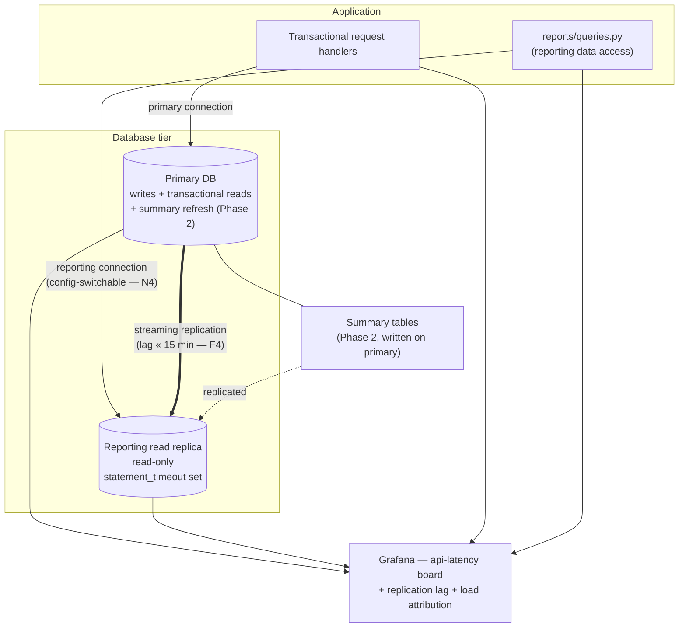
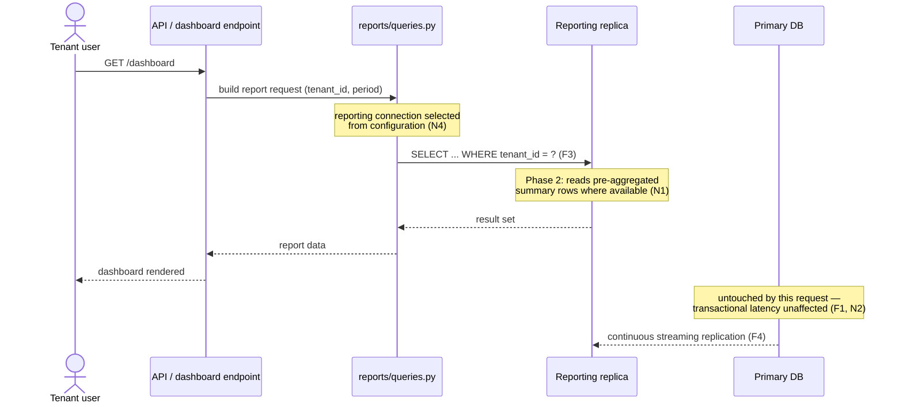

# RFC — Splitting reporting queries off the main database

**Status:** draft
**Current working focus:** decision (full pass complete; blocked on the Phase 0 measurements and the open questions in §Open questions before it can move to *in review*)
**Author:** *TBD — assign before circulating*
**Date:** 2026-09-08

---

## Related documents

These are the sources this RFC leans on. Everything below is what was *reported* to the author; none
of it was independently opened or re-measured while writing this document, and the table in
§Evidence and its provenance says exactly which is which.

- **`api-latency` Grafana board** — the source of the dashboard-endpoint p95 figure. *Link needed.*
- **`reports/queries.py`** — the module holding the report queries. *Not inspected for this draft.*
- Source of the "reporting is 40% of database load" figure — **unidentified**; needs naming (see
  §Open questions, Q2).
- *Missing and needed:* current database topology / instance sizing, the migration history for the
  reporting tables, and any prior attempt at report tuning.

---

## Context

We run a multi-tenant application backed by a single main database. That database serves two very
different kinds of work at the same time, from the same instance:

1. **Transactional work** — the interactive requests users make while using the product. Short,
   indexed, latency-sensitive; a user is sitting there waiting.
2. **Reporting work** — aggregate queries that scan and summarize large slices of a tenant's history
   to render dashboards and reports. Long, scan-heavy, and by nature touching far more rows than a
   transactional request does. These queries live in **`reports/queries.py`**.

Those two workloads want opposite things from a database. Transactional queries want a warm buffer
cache full of recently-touched rows and a CPU that is free the moment they arrive. Reporting queries
sweep large volumes of older rows through that same cache and occupy that same CPU for seconds at a
time. Running both on one instance means the reports and the app are continuously competing for the
same finite CPU, disk I/O, and memory — and the interactive requests, being the short ones, are the
ones that visibly suffer when they have to queue behind a scan.

What has been reported as the consequence: **the dashboard endpoint's p95 was around 8 seconds last
month** (`api-latency` Grafana board), and **reporting accounts for roughly 40% of database load**.
We have **~300 active tenants**.

**Why this matters now:** an 8-second p95 is well past the point where a page reads as broken rather
than slow, and the load share means reporting is not a rounding error we can tune away at the margins
— it is a structural half of what the database does. Both numbers point the same direction: the two
workloads need to stop sharing one instance. And because tenant count and per-tenant history only
grow, the pressure compounds; a fix chosen now is cheaper than the same fix chosen at 3× the data.

### An important distinction the framing hides

The request treats this as one problem — "reports are slow and they're hurting the app" — but the
evidence describes **two problems with different fixes**, and conflating them is the main way this
project could deliver infrastructure and not deliver the outcome:

- **Problem A — contention.** Reporting consumes ~40% of the database and thereby degrades
  *transactional* endpoints. The fix is **isolation**: get reporting reads off the instance the app
  depends on. This is well-understood and cheap.
- **Problem B — the reports themselves are slow.** The dashboard endpoint takes ~8s at p95. Moving an
  8-second query to a different machine gives it a quieter machine; it does **not** make it fast. If
  most of those 8 seconds is real work (rows scanned, aggregates computed) rather than time spent
  waiting on a contended instance, then isolation alone leaves the dashboard slow, and the fix is
  **less work per request**: pre-aggregation, better indexes, or a store that does aggregates
  cheaply.

We do not currently know how the 8 seconds splits between "waiting for a busy database" and "doing
work". That split is the single most decision-relevant unknown in this document, and §Phase 0 exists
to resolve it. The design below deliberately addresses **both** problems, in that order, because
Problem A's fix is cheap and reversible and Problem B's fix depends on a measurement we do not yet
have.

### Evidence and its provenance

Every number in this RFC comes from the request that prompted it. The author had no access to the
Grafana board, the repository, or the database while writing, so nothing here is independently
verified. Stating that plainly matters, because two of these figures are load-bearing for the
decision and one of them is an inference rather than a measurement.

| # | Claim | Source | Status |
| --- | --- | --- | --- |
| E1 | Dashboard endpoint p95 ≈ **8s** last month | `api-latency` Grafana board, as reported by the requester | **Reported, not verified.** Which endpoint and which panel is unconfirmed; "around 8 seconds" is a recollection, not a read-off. |
| E2 | Reporting is **~40%** of database load | Reported by the requester; underlying source not named | **Reported, not verified, and the metric is undefined** — 40% of CPU time? Of total statement execution time? Of query count? These imply very different things (see Q2). |
| E3 | Report queries live in **`reports/queries.py`** | Reported by the requester | **Reported, file not inspected.** Whether that module is the *only* source of reporting queries is unconfirmed (Q3). |
| E4 | **~300** active tenants | Reported by the requester | **Reported, not verified.** Sufficient for order-of-magnitude reasoning. |
| E5 | Reporting contention *causes* the 8s dashboard p95 | — | **Inference, not evidence.** E1 and E2 are each consistent with this and also consistent with the dashboard simply being an expensive query on a quiet database. Neither number establishes the causal link. |
| E6 | Data volume, growth rate, per-tenant skew | — | **Absent.** The most important missing input; see Q1. |

The design below is built so that being wrong about **E5** is survivable: Phase 1 helps regardless
(it protects transactional endpoints even if the dashboard was never contention-bound), and Phase 2
is only committed to after Phase 0 measures the split.

### Assumptions

These are stated as assumptions because they were not given. Each one is cheap to confirm and any of
them being wrong changes specific parts of the design, so they are flagged individually rather than
buried.

- **A1 — The main database is PostgreSQL.** Not stated in the request. This assumption shapes the
  concrete mechanisms named below (streaming replicas, materialized views, `pg_stat_statements`,
  logical replication). If it is **MySQL**, the shape of the decision is unchanged but materialized
  views do not exist and Phase 2 must use plain summary tables refreshed by a job; if it is
  **Aurora**, read replicas are cheaper and share storage, which removes the recovery-conflict risk
  class (R2 below) more or less entirely.
- **A2 — The application is Python, and `reports/queries.py` is the reporting data-access layer.**
  Inferred from the filename. Whether it uses an ORM (SQLAlchemy, Django ORM) or raw SQL affects
  Phase 1's effort estimate materially, not its design.
- **A3 — The database is a managed service** (RDS / Cloud SQL / equivalent), so adding a read replica
  is a configuration change rather than a build-and-operate project. If the database is
  self-managed, Phase 1's effort roughly doubles and its operational risk rises.
- **A4 — No read replica exists today**, or if one exists it is reserved for failover and is not
  serving queries.
- **A5 — Reports may be up to 15 minutes behind the primary** without breaking their purpose. This is
  the assumption most likely to be wrong and most consequential (Q4): if any report feeds an
  invoicing, audit, or checkout decision, it needs a stricter contract and must be excluded from the
  move.
- **A6 — Report definitions and business logic are frozen.** We are moving where they run, not
  changing what they compute.
- **A7 — Tenant scoping is enforced inside the queries** in `reports/queries.py` (a `tenant_id`
  predicate or equivalent), not by connecting to per-tenant databases.

### Out of scope

- **Changing what the reports compute.** Numeric parity with today is a requirement (F2), not a
  nice-to-have. Report redesign is a separate conversation.
- **A company-wide data warehouse / self-serve BI.** A warehouse may eventually be the right home for
  this workload (see §Alternatives, D4), but building an analytics platform is a much larger program
  than unblocking the app, and bundling them would delay both.
- **Changing the transactional schema.** Additive objects (indexes, summary tables) are in scope;
  reshaping the tables the app writes to is not.
- **Tenant-facing data exports / API access to raw data.**
- **Front-end work on the dashboard.** Pagination, lazy-loading panels, and skeleton states could
  each improve perceived latency and are worth doing, but they do not address either problem here.
- **Multi-region or DR strategy.** A reporting replica is not a DR plan and this RFC does not make
  one.

---

## Requirements

Only the architecturally-relevant ones — the requirements that force a component to exist, are
expensive to reverse, or are cross-cutting qualities with a real target. Feature-level report details
are deliberately absent.

Targets marked **(assumed)** were not given and need sign-off; they are stated concretely anyway,
because a target you can argue with is more useful than "should be fast".

### Functional

- **F1 — Reporting reads must not execute on the database instance serving interactive transactional
  requests.** This is the requirement the whole RFC exists for; it forces a second execution target
  to exist.
- **F2 — Every report currently in `reports/queries.py` must produce results identical to today**,
  demonstrated by a comparison harness run against both the old and new paths over a representative
  set of tenants and date ranges. Silent numeric drift in a customer-facing report is worse than a
  slow report.
- **F3 — Tenant isolation must survive the move.** No reporting query may return rows belonging to a
  tenant other than the requesting one. This is a security boundary and therefore the least
  reversible item on this list — a leak cannot be un-leaked.
- **F4 — Report data must be no more than 15 minutes behind the primary (assumed, per A5), and the
  actual lag must be observable and alertable.** Any report that cannot tolerate this bound must be
  explicitly listed and excluded from the move (see Q4).
- **F5 — One tenant's report must not be able to degrade another tenant's reports.** A bounded
  execution budget per reporting query, enforced server-side (`statement_timeout`), so a pathological
  query fails fast instead of occupying the reporting instance indefinitely.

### Non-functional

- **N1 — Dashboard endpoint p95 ≤ 1.5s and p99 ≤ 3s (assumed target), measured on the `api-latency`
  Grafana board** so the before/after comparison uses the same instrument that produced E1. This is
  the requirement that Phase 1 alone may not satisfy — see §Design.
- **N2 — Transactional endpoint p95 must improve or stay flat, and reporting's share of primary
  database load must fall to ≤ 10%** (from the reported ~40%), measured by whatever metric turns out
  to underlie E2 once Q2 is answered.
- **N3 — Observability before cutover, not after:** replication lag exported as a metric with an
  alert at half the F4 budget; database load attributable to reporting vs transactional work; a
  reporting panel added to the `api-latency` board. We cannot verify N1 or N2 without this, and its
  absence is part of why E5 is currently an inference.
- **N4 — Reversible within a single deploy, with no code change.** Where reporting queries execute
  must be controlled by configuration, so that if the replica misbehaves we point reporting back at
  the primary in minutes. This is what makes Phase 1 a safe bet under the uncertainty in E5.
- **N5 — Incremental infrastructure spend ≤ 1× the current primary instance cost (assumed budget).**
  Reporting isolation should not require a second full-price platform.
- **N6 — No new language, runtime, or data platform for the team to operate in Phase 1.** Operational
  capacity is a real constraint and an unstated one; adding a system nobody has run before, during an
  active latency incident, trades a latency problem for an availability problem.
- **N7 — Automated coverage for the reporting path**, including the F2 parity check running in CI
  against a seeded dataset, so later changes cannot silently break parity.

---

## Design

The design decides three dimensions, in order: **where reporting reads execute**, **how the
application routes them there**, and **how the dashboard's per-query cost comes down**. Each
component below names the requirement it serves; nothing is here for elegance.

### Sizing note — and what we cannot size

Honest statement of a gap: with ~300 tenants (E4) but no request rate, no data volume, and no
per-tenant skew (E6), **this design cannot be sized quantitatively.** 300 tenants where the largest
holds 500k rows and 300 tenants where the largest holds 200M rows call for different answers — the
first is comfortably a single read replica for years, the second is on the path to needing a
columnar store. The staged design below is a direct response to that gap: it commits only to the
step that is right under either scenario, and puts an explicit, measured trigger on the step that
depends on the answer.

### Dimension 1 — Where reporting reads execute: a read replica

**Chosen: a streaming read replica of the main database, dedicated to reporting.** (Alternatives and
why they lost are in §Alternatives analysis.)

The replica is a physical copy of the primary kept current by streaming replication, running on its
own instance with its own CPU, its own disk, and — critically — its own buffer cache. Reporting
queries run there and nowhere else.

- Serves **F1** (separate instance ⇒ separate resources ⇒ reporting cannot consume the primary's CPU
  or evict the primary's cache) and **N2** (reporting load leaves the primary almost entirely; what
  remains is the replication overhead, which is write-side and small).
- Serves **F2** for free: the replica has a byte-identical schema, so the queries in
  `reports/queries.py` run **unmodified**. No dialect translation, no re-modelling, no rewrite. This
  is the single biggest reason it beats the more ambitious options for a first step — the cheapest
  correctness guarantee available is "the same query against the same schema".
- Serves **F4** with replication lag typically well under a second, orders of magnitude inside the
  15-minute budget, and exposed as a native lag metric (**N3**).
- Serves **N5**: one additional instance, and it need not match the primary's size — a reporting
  replica can be sized for scans rather than for transactional concurrency.
- Serves **N6**: it is the same database engine the team already operates.

Two consequences are worth naming up front rather than discovering later:

- **The replica is read-only.** No summary tables, no materialized views, no temp-table staging can
  be created on it. Any pre-aggregation must therefore live on the primary (and replicate over) or in
  a separate writable database. This constraint is what shapes Phase 2 below, and it is easy to miss
  when planning.
- **Long-running queries on a replica can conflict with replay.** Under PostgreSQL, a scan that runs
  while the primary vacuums rows the scan needs is either cancelled on the replica or held off by
  `hot_standby_feedback`, which in turn allows bloat on the primary. This is a genuine tradeoff, not
  a misconfiguration, and it is risk **R2**.

Configuration serving **F5** and **N4**: `statement_timeout` set on the reporting database role
(fail fast rather than hog), `hot_standby_feedback` chosen deliberately per R2, and the reporting
connection string supplied by configuration so it can be pointed back at the primary without a
deploy.

### Dimension 2 — How the application routes reporting reads: an explicit second connection

**Chosen: a second, separately-configured database connection used explicitly by
`reports/queries.py`.**

- Serves **F1** precisely: it routes *reporting* reads and only reporting reads. A blanket
  "send all reads to the replica" router would also send the app's own transactional reads there,
  which introduces read-your-writes bugs across the entire product — a much larger blast radius than
  the problem we are fixing.
- Serves **N4**: the replica's location is one configuration value.
- Serves **F3**: the tenant predicate lives inside the queries (A7) and is untouched by moving the
  connection, so the isolation boundary is not re-implemented and cannot be re-implemented wrongly.
  Worth stating explicitly because "we moved the reports and lost the tenant filter" is exactly the
  kind of mistake this class of migration produces.
- Serves **N7**: an explicit, greppable boundary is testable — CI can assert that reporting code
  paths hold no primary-bound session, and that the transactional path holds no replica-bound one.

The cost, stated honestly: this relies on discipline. A future report written against the default
connection would silently land back on the primary. That is mitigated by the CI assertion above, not
by hope.

### Dimension 3 — How the dashboard gets fast: pre-aggregated summaries (Phase 2, trigger-gated)

Dimension 1 solves Problem A. It does **not** necessarily solve Problem B, and **N1 is the
requirement most at risk of going unmet** — which is precisely why it is called out here rather than
assumed away.

If Phase 0 shows the 8 seconds is mostly queueing behind a contended primary, Phase 1 alone brings
the dashboard inside N1 and Phase 2 is unnecessary. If Phase 0 shows the 8 seconds is mostly real
work, the dashboard on a replica will still take ~8 seconds and we need to reduce the work:

- **Summary tables on the primary**, maintained incrementally (or refreshed on a schedule), holding
  the aggregates the dashboard actually renders — per tenant, per period. They are written on the
  primary because the replica cannot be written to, and they replicate to the replica automatically,
  so the dashboard continues to read only from the replica.
- Serves **N1** by turning a multi-second scan into an indexed lookup of pre-computed rows, and
  additionally serves **N2**, because pre-aggregation *reduces* total reporting work rather than
  relocating it.
- Serves **F4** by bounding staleness at the refresh cadence — which must be set inside the 15-minute
  budget, and which is why A5 needs confirming.
- The refresh cost lands on the primary. It is small relative to the ad-hoc scans it replaces and it
  is *schedulable*, which is the important difference: predictable load in a chosen window rather
  than unpredictable load whenever a user opens a page.
- Its real limitation: aggregates only serve the query shapes they were built for. Arbitrary
  user-chosen date ranges and dimension combinations may not pre-aggregate cleanly, and any panel
  that cannot be served from a summary falls back to a live query on the replica (still isolated,
  still slow). Which panels those are is a per-report design question for Phase 2, informed by
  Phase 0.

Deliberately **not** chosen now: a dedicated columnar/analytical store. It is the strongest answer to
Problem B and the honest end state if the data grows — see D4 in §Alternatives for the steelman and
the explicit conditions that would flip this.

### Requirement → component traceability

Both directions, as the method demands: every component traces to a requirement, and every
requirement is met by something.

| Requirement | Met by |
| --- | --- |
| F1 — reporting off the transactional instance | Read replica (D1) + explicit reporting connection (D2) |
| F2 — identical results | Unmodified queries on an identical schema (D1); parity harness (Phase 1 tasks, N7) |
| F3 — tenant isolation preserved | Tenant predicate untouched inside `reports/queries.py` (D2, A7); parity harness includes a cross-tenant leak check |
| F4 — ≤ 15 min staleness, observable | Streaming replication (sub-second) + lag metric and alert (N3); Phase 2 refresh cadence bounded by the same budget |
| F5 — no cross-tenant report interference | `statement_timeout` on the reporting role (D1) |
| N1 — dashboard p95 ≤ 1.5s | Phase 1 if contention-bound; otherwise summary tables (D3). **Gated on Phase 0 — see R1.** |
| N2 — reporting ≤ 10% of primary load | Read replica (D1); further reduced by pre-aggregation (D3) |
| N3 — observability | Lag metric + alert; reporting panel on the `api-latency` board; `pg_stat_statements` attribution (Phase 0) |
| N4 — reversible in one deploy | Reporting connection string as configuration (D1, D2) |
| N5 — cost ≤ 1× primary | Single additional right-sized instance (D1) |
| N6 — no new platform | Same engine, same language (D1, D2) |
| N7 — automated coverage | Parity check in CI; connection-boundary assertion (D2) |

### Static diagram

*The two application paths reach two different instances. The only coupling between them is
one-directional replication, which is write-side work on the primary and cheap compared to serving
the scans.*

### Dynamic diagram — a dashboard request after Phase 1 (+ Phase 2 where it applies)

**Step by step, in words** (so the flow survives without the diagram renderer):

1. A tenant user requests the dashboard.
2. The endpoint asks `reports/queries.py` for the report, passing the tenant and period.
3. `reports/queries.py` uses the **reporting** connection, whose target comes from configuration.
4. The query executes **on the replica**, with the tenant predicate intact and a server-side
   statement timeout in force.
5. After Phase 2, the query reads pre-computed summary rows rather than scanning history; panels with
   shapes no summary covers fall back to a live scan on the replica.
6. Results return; the dashboard renders.
7. Throughout, the primary served no part of this request — its only related work is streaming
   replication (and, in Phase 2, the scheduled summary refresh).

---

## Alternatives analysis (Tradeoff)

Grouped by dimension. Each alternative is stated at its best before its downsides, and every risk
carries impact, probability, mitigation, and contingency.

### Dimension 1 — Where reporting reads execute

| Alternative | Pros | Cons | Risk (description) | Impact | Probability | Mitigation | Contingency |
| --- | --- | --- | --- | --- | --- | --- | --- |
| **D1 — Tune in place on the primary** (indexes, query rewrites, timeouts, `work_mem`) | Cheapest possible; no new infrastructure and no new failure domain; if the reports are simply badly written this addresses the *root* cause instead of relocating it; single source of truth, zero staleness, so F4 is trivially met; often finds a 10× win in an afternoon | Provides **no isolation** — reporting still competes for the primary's CPU, I/O and buffer cache, so F1 is not met at all; there is a ceiling, and one heavy report can still stall the app; new reporting indexes slow every write on the primary; gains get consumed by data growth | Tuning yields real improvement, the incident is declared closed, and the same problem returns at 2× data with the cheap wins already spent | Medium | **High** | Treat tuning as complementary (it is folded into Phase 0/2), never as the isolation answer; set N2 as the exit criterion, which tuning structurally cannot satisfy | Proceed to the replica, having lost the time |
| | | | Reporting indexes added to the primary degrade transactional write latency | Medium | Medium | Add indexes only on the replica-side path or in Phase 2 summaries; measure write latency before/after each index | Drop the index |
| **D2 — Dedicated streaming read replica ← CHOSEN** | Real resource isolation: separate CPU, disk and buffer cache (F1, N2); queries run **unmodified** on an identical schema, which is the cheapest possible route to F2; sub-second lag, far inside F4; one config flip to revert (N4); a checkbox on managed platforms (A3), no new platform to operate (N6); one right-sized instance fits N5 | Adds ~1× instance cost; the replica is **read-only**, so no summary tables or MVs can live on it (this shapes Phase 2); replication lag makes read-your-writes visible for a report run immediately after a write; **does not make a slow query fast** — N1 may remain unmet; the workload is still a row store with transactional indexes | **R2** — long reporting scans conflict with replay: either the query is cancelled on the replica, or `hot_standby_feedback` prevents that and instead permits bloat on the primary | Medium | **High** (this is the normal behaviour of the mechanism, not a defect) | Choose deliberately per report class: raise `max_standby_streaming_delay` for the reporting replica and keep `hot_standby_feedback` off, accepting occasional cancellation; retry cancelled reports once; keep scans short via Phase 2 | Enable `hot_standby_feedback` and monitor primary bloat with aggressive autovacuum; if both ends prove untenable, move to D3 (independent reporting DB, no replay coupling) |
| | | | **R3** — reports silently read stale data and a tenant acts on a wrong number | High | Low–Medium | Lag metric with an alert at half the F4 budget (N3); surface "data as of HH:MM" in the dashboard UI so staleness is visible rather than implicit | Fail the report closed when lag exceeds budget, rather than serving a stale number silently |
| | | | **R4** — replica falls behind during heavy write bursts or a bulk migration | Medium | Low | Pre-flight large migrations with the replica in mind; alert on lag; size the replica's I/O for replay, not just for reads | Temporarily route reporting back to the primary (N4) and accept degraded app latency until caught up |
| | | | **R5** — the replica becomes a silent single point of failure for reporting (no failover of its own) | Low–Medium | Medium | Health-check the reporting connection; degrade the dashboard to an explicit error rather than a hang | Config-flip reporting back to the primary (N4) |
| **D3 — Separate reporting database fed by logical replication / CDC** | Full isolation *and* index freedom — reporting-only indexes that never touch the primary's write path; **writable**, so summaries and denormalized tables can live beside the data (Phase 2 without touching the primary); no replay-conflict class at all (R2 disappears); can hold longer history than the primary needs to; can be sized and versioned independently | Substantially more moving parts than a replica; **logical replication does not carry DDL** in PostgreSQL, so every migration needs coordinated, ordered application on both sides — a permanent process tax; initial sync is expensive on a large dataset; still a row store, so aggregate cost is unchanged unless we also invest in modelling; instance *plus* pipeline to operate (pushes against N6) | **A replication slot stalls and the primary retains WAL until its disk fills — taking the whole application down.** The classic and severe PostgreSQL logical-replication foot-gun | **High** | Medium | Alert on slot lag and on `max_slot_wal_keep_size`; cap WAL retention so the slot is dropped before the disk fills; runbook for slot recovery | Drop the slot, take reporting offline, re-sync from scratch |
| | | | Schema drift: a migration lands on the primary and breaks reporting queries silently | High | **High** without process | Migration checklist covering the reporting side; CI runs the F2 parity harness against the reporting DB on every migration | Re-sync affected tables; block deploys on parity failure |
| **D4 — Dedicated analytical (columnar) store — ClickHouse / BigQuery / Snowflake — fed by CDC or ELT** | **The strongest answer to Problem B**: columnar storage plus vectorized execution makes the aggregates the dashboard needs orders of magnitude cheaper, so N1 is met with room to spare and stays met as data grows; solves arbitrary date ranges and dimension slicing that pre-aggregation cannot; scales past any plausible tenant growth; unlocks the analytics capability the company will eventually want anyway; complete isolation from the primary | The **largest** option by cost and risk: every query in `reports/queries.py` must be rewritten in a different SQL dialect, so F2 becomes a genuine verification project rather than a property we get for free; a new pipeline, a new schema model, and a new operational skill set (squarely against N6); no joins to live transactional data; staleness is inherent and coarser; for ~300 tenants at unknown-but-probably-modest volume it is likely oversized **today** | The rewrite and re-modelling substantially overrun their estimate, and the latency problem stays live for months | High | **High** | Do not attempt it as the fix for a live latency problem; if adopted later, migrate report by report behind a flag, never big-bang | Keep the replica path serving production throughout; abandon partial migration without user impact |
| | | | Numbers disagree between the old and new paths during migration, and a tenant sees two different answers | Medium | High | Dual-run with automated diffing (F2 harness) before any report is switched; per-report cutover | Revert that report to the replica path |
| | | | Consumption-priced warehouse costs escalate unpredictably under per-tenant dashboard traffic (interactive dashboards are a poor fit for per-scan billing) | Medium | Medium | Model cost against real query volume before committing; prefer a fixed-cost deployment for interactive traffic; cache aggressively | Move interactive panels back to summaries; keep the warehouse for ad-hoc analysis |
| | | | Team has not operated a warehouse or CDC pipeline before (N6) | Medium | Medium | Training and a POC ahead of any commitment; adopt a managed offering | Fall back to D3 |
| **D5 — Pre-aggregation only, on the existing primary** (materialized views / summary tables, no new instance) | Attacks **Problem B directly** and is the only option here that *reduces* total work rather than relocating it, so it helps N2 as well as N1; no new infrastructure, no new failure domain, no staleness beyond the refresh cadence; adoptable one report at a time; composes with every other option | Refresh work still lands on the primary, so isolation (F1) is **not** achieved — the primary keeps doing reporting work, merely at a chosen time; `REFRESH MATERIALIZED VIEW` locks readers unless run `CONCURRENTLY` (which needs a unique index and costs more); aggregates serve only the shapes they were designed for, so arbitrary filters fall through to live queries; a genuine per-report modelling cost | Refresh window grows with data until it no longer fits its slot and starts overlapping interactive traffic | Medium | Medium | Prefer incremental refresh over full rebuild; monitor refresh duration as a first-class metric with a trend alert | Move the refresh into the reporting DB (D3) or shorten retention in the aggregate |
| | | | Aggregate logic drifts from the source query and the dashboard shows wrong numbers | High | Medium | Derive summaries from the same SQL as the live query wherever possible; the F2 parity harness compares summary output against a live recomputation on a schedule | Invalidate and rebuild the summary; fall back to the live query path |

**Weighed against the requirements:** D1 fails F1 and N2 outright — it cannot isolate, whatever it
achieves on latency. D5 also fails F1 (the primary keeps doing the work) but is the strongest single
lever on N1, which is why it appears as Phase 2 rather than as a rejected option. D4 meets F1, N1 and
N2 most emphatically of all, and fails N6 and — for now — N5, while making F2 expensive to prove; it
is the right *destination* and the wrong *next step*. D3 meets F1 and beats D2 on index freedom, but
its schema-drift tax and its WAL-retention failure mode buy operational risk we do not need until
the replica's ceiling is actually reached. **D2 is the only option that meets F1 and F2 and N4 and N6
simultaneously, at one instance of cost** — and it is reversible, which is what makes it the correct
choice while E5 remains an inference.

### Dimension 2 — How the application routes reporting reads

| Alternative | Pros | Cons | Risk (description) | Impact | Probability | Mitigation | Contingency |
| --- | --- | --- | --- | --- | --- | --- | --- |
| **Explicit second connection in `reports/queries.py` ← CHOSEN** | Smallest possible blast radius — only reporting moves; explicit and greppable, so a reviewer can see where a query runs; trivially testable (N7); one config value to revert (N4) | Relies on developer discipline: a new report written against the default connection lands back on the primary | Reporting drifts back onto the primary over time, unnoticed | Medium | Medium | CI assertion that reporting modules use only the reporting session; the N3 load-attribution panel makes drift visible | Fix the offending query; treat a load-attribution regression as a release blocker |
| **Framework-level automatic read/write splitting** (e.g. ORM database router) | Automatic and comprehensive; nothing for a developer to remember | Routes **all** reads to the replica, not just reporting, so replica lag becomes a correctness question for the entire product; read-your-writes bugs appear in flows unrelated to reporting; far harder to reason about | Subtle, intermittent stale-read bugs across the app after cutover, hard to attribute | **High** | **High** | — (the mitigation is not choosing this) | Disable the router; revert to explicit routing |
| **Proxy-level routing** (connection pooler / managed proxy read-write split) | No application change at all; centralized | Routing by statement heuristics cannot distinguish a reporting `SELECT` from a checkout `SELECT` — precisely the distinction F1 is about; adds a hop and a failure domain | Misrouting sends latency-critical reads to a lagging replica, or reports to the primary | High | Medium | — (wrong tool for this distinction) | Remove the proxy from the read path |

### Dimension 3 — Freshness contract

| Alternative | Pros | Cons | Risk (description) | Impact | Probability | Mitigation | Contingency |
| --- | --- | --- | --- | --- | --- | --- | --- |
| **Near-real-time (replica lag, sub-second) ← CHOSEN for Phase 1** | No behavioural change from today, so nothing product-facing to negotiate; comfortably satisfies F4 | Constrains us to replication-based options; no freedom to batch | A report run immediately after a write misses it | Low | Medium | Surface "data as of" in the UI; route the few write-then-read report flows (if any exist — Q4) to the primary explicitly | Whitelist those specific reports back onto the primary |
| **Bounded staleness ≤ 15 min (Phase 2 summaries)** | Enables pre-aggregation, which is what actually delivers N1; refresh cost becomes schedulable | Requires product sign-off that 15 minutes is acceptable (A5, Q4); staleness becomes user-visible | A report feeding an invoice, audit, or checkout decision silently uses stale data | **High** | Medium | Enumerate reports by freshness need **before** Phase 2 and exclude the strict ones by name | Serve strict reports live from the replica; keep summaries for the rest |
| **Daily batch** | Cheapest to build and operate; largest possible aggregation win | Almost certainly unacceptable for an operational dashboard users check during the day | Users lose trust in the dashboard and stop using it | Medium | High | — | Not recommended |

---

## The decision

**Decision style: autocratic** — as the author of this RFC I am making the call and own the outcome,
having taken input from the reported evidence. Two caveats on that, stated rather than hidden:
Phase 2's scope is explicitly *deferred* to the Phase 0 measurement rather than decided here, and
the freshness contract (A5 / Q4) is **not** mine to decide — it is a product call, and this RFC
records it as an assumption pending sign-off, not as a settled requirement.

**The decision, in three parts:**

1. **Phase 0 — measure before building.** Before any infrastructure changes, spend a short, bounded
   effort establishing (a) how the dashboard's ~8s p95 splits between waiting on a contended database
   and doing real work, (b) what metric underlies the 40% figure and which queries in
   `reports/queries.py` account for it, and (c) data volume, growth, and per-tenant skew. This is
   days of work, not weeks, and it is the difference between building the right Phase 2 and guessing
   at it. **E5 is currently an inference; Phase 0 turns it into evidence.**
2. **Phase 1 — route reporting to a dedicated streaming read replica** (D2), via an **explicit
   second connection** in `reports/queries.py` (Dimension 2), with `statement_timeout`, lag
   alerting, and config-switchable reversibility. This is committed to **regardless of what Phase 0
   finds**, because it is right under every scenario: it meets F1, F2, F3, F4, N2, N4, N5 and N6, it
   is the cheapest correct isolation available (queries run unmodified), and it is reversible in one
   deploy. Even in the world where the dashboard was never contention-bound, Phase 1 still protects
   every *transactional* endpoint from reporting — which is half the stated problem.
3. **Phase 2 — pre-aggregate the dashboard's dominant queries into summary tables** (D5, written on
   the primary, read from the replica), **scoped by Phase 0's findings and triggered only if Phase 1
   leaves N1 unmet.** If Phase 1 brings the dashboard inside p95 ≤ 1.5s, Phase 2 does not happen and
   we have saved the work.

**Why this and not the more ambitious options.** The reasoning that carried it is
**cost-of-being-wrong under acknowledged uncertainty.** Two of the three numbers driving this
decision are unverified (E1, E2) and the causal claim is an inference (E5). Under that uncertainty
the right move is the one that helps in every scenario, is cheap, and can be undone — not the one
that is optimal in the scenario we happen to be guessing at. D4 (a columnar store) is the best answer
to Problem B and quite possibly where this system ends up; committing to it now would mean a full
rewrite of `reports/queries.py`, a new platform to operate, and months of exposure — on the strength
of an inference. D3 buys index freedom we have no evidence of needing yet, at the price of a
permanent migration-coordination tax and a WAL-retention failure mode that can take the primary down.

**Explicitly recorded triggers to revisit — the conditions that flip this decision:**

- **→ D3 (separate reporting database)** if R2 proves untenable at both settings (cancellations too
  frequent *and* `hot_standby_feedback` bloat unacceptable), **or** if Phase 2 needs reporting-only
  indexes badly enough to justify adding them to the primary's write path.
- **→ D4 (columnar store)** if, after Phase 2, N1 is still unmet for query shapes that cannot be
  pre-aggregated; **or** if data volume grows to the point where summary refresh no longer fits its
  window; **or** when genuine ad-hoc analytics demand appears (at which point D4 is justified on its
  own merits, not as a latency fix).

**The strongest objection to this decision, stated fairly:** if Phase 0 shows the dashboard is
almost entirely work-bound rather than contention-bound, then Phase 1 spends an instance's cost and
several days without moving N1 at all, and we will have taken the scenic route to the pre-aggregation
work (D5) or to D4. That is a real cost. It is accepted because (a) Phase 1 still delivers F1 and N2
— the app stops being hurt by reporting, which is the stated complaint — and (b) Phase 0 comes first
precisely so this is known before Phase 1 ships, and Phase 1's scope can be reordered if Phase 0 says
so. What would *not* be acceptable is skipping Phase 0 and discovering it afterwards.

---

## Launch strategy

Phased so there is no eternal migration, and so each phase is independently reversible.

**Phase 0 — Measurement (days, no production change)**
Enable/read `pg_stat_statements` and attribute execution time to the queries in
`reports/queries.py`; break down the dashboard endpoint's latency into database time vs application
time on the `api-latency` board; capture table sizes, growth rate, and per-tenant skew; answer Q1–Q5.
Exit criterion: E5 is either confirmed or refuted, and Phase 2's scope is known.

**Phase 1 — Isolation (reversible at every step)**

1. Provision the reporting replica; add lag metric and alert; add the reporting panel to the
   `api-latency` board (**N3 lands before cutover, not after** — otherwise we cannot verify N1/N2).
2. Add the reporting connection as configuration, defaulting to the **primary**, so the code change
   ships with no behavioural change at all.
3. Point `reports/queries.py` at the reporting connection; build the F2 parity harness (same tenants,
   same periods, old path vs new path, plus a cross-tenant leak check for F3) and get it green in CI.
4. Flip the configuration to the replica for internal tenants first, then progressively; set
   `statement_timeout` on the reporting role.
5. Verify N1 and N2 on the `api-latency` board over a full week, against the same instrument that
   produced E1.

**Phase 2 — Pre-aggregation (only if N1 is unmet after Phase 1; scope from Phase 0)**
Take the dashboard's dominant panels in Phase 0's ranked order; for each, build a summary table on
the primary, verify against a live recomputation (F2), switch the panel to the summary, measure.
Report by report, never big-bang. Stop when N1 is met — remaining panels stay on the live replica
path, which is already isolated.

**Communication.** This RFC circulates for comment before Phase 1 ships; the freshness contract
(A5/Q4) needs an explicit product decision recorded here before Phase 2 starts; the on-call rotation
needs the replica's runbook (lag alert response, cancellation retries, config-flip reversion)
*before* cutover, not after; and the N1/N2 verification result gets posted back into this document so
the record shows whether the decision worked. A decision nobody hears about is not really made.

---

## Tasks and roadmap

Estimates are **unvalidated** — they assume A1–A4 and no ORM surprises in `reports/queries.py`, a
file this draft has not opened. Re-estimate at the end of Phase 0.

| Task | Description | Estimate |
| --- | --- | --- |
| P0.1 Load attribution | `pg_stat_statements` analysis; rank reporting queries by total execution time; define what "40% of load" actually measures (Q2) | 1–2d |
| P0.2 Latency decomposition | Split the dashboard endpoint's p95 into database wait vs database work vs application time on the `api-latency` board | 1–2d |
| P0.3 Data sizing | Table sizes, growth rate, per-tenant skew (E6/Q1) | 0.5d |
| P0.4 Freshness inventory | Classify each report by freshness need; identify any that cannot tolerate 15 min (Q4) | 1d |
| P1.1 Provision replica | Replica + parameter group + reporting role with `statement_timeout` | 1d |
| P1.2 Observability | Lag metric + alert; reporting panel on the `api-latency` board; load attribution dashboard (N3) | 2d |
| P1.3 Reporting connection | Second configured connection, defaulting to primary; CI assertion on connection boundaries (N7) | 1–2d |
| P1.4 Parity harness | Old-path vs new-path numeric diff across representative tenants and periods, plus cross-tenant leak check; wired into CI (F2, F3) | 3d |
| P1.5 Progressive cutover | Internal tenants → all tenants; monitor at each step | 1–2d |
| P1.6 Runbook | Lag alerts, query cancellation retries, config-flip reversion; hand to on-call | 0.5d |
| P1.7 Verification | One week of N1/N2 measurement; write results back into this document | 0.5d + elapsed |
| P2.x Summary tables | Per dominant panel: model, build, refresh, verify against live recomputation, cut over. Scope and count set by P0.1/P0.2 | 2–4d per panel |

---

## Open questions

Blocking or scope-shaping. Q1, Q2 and Q4 should be answered before Phase 1 ships; Q4 is blocking for
Phase 2.

- **Q1 — Data volume, growth rate, and per-tenant skew?** (E6) The most important missing input. It
  determines whether one replica plus summaries carries us for years or whether D4 is closer than
  this RFC assumes.
- **Q2 — What does "40% of database load" measure, and where does the number come from?** (E2) CPU
  time, total statement execution time, and query count imply materially different situations, and
  N2's exit criterion has to be expressed in the same metric.
- **Q3 — Is `reports/queries.py` the only place reporting queries live?** (E3) Any reporting query
  outside that module will not be routed by Phase 1 and will keep loading the primary.
- **Q4 — What staleness can each report tolerate?** (A5) **Blocking for Phase 2.** Specifically:
  does any report feed invoicing, an audit trail, or a checkout/eligibility decision?
- **Q5 — Which exact endpoint and panel produced the 8s p95, and is that number stable or was last
  month unusual?** (E1) The before/after comparison needs the same instrument and the same panel.
- **Q6 — Is the database PostgreSQL, and is it managed?** (A1, A3) Confirming this validates the
  concrete mechanisms named throughout; MySQL or self-managed changes Phase 2's mechanism and
  Phase 1's effort respectively.
- **Q7 — Is there a budget ceiling for the additional instance?** (N5) Stated as ≤ 1× the primary,
  assumed, not confirmed.
- **Q8 — Who owns the reporting replica operationally?** No new system should go into production
  without a named owner and the runbook from P1.6.

---

## Version history

| Version | Date | Author | Description |
| --- | --- | --- | --- |
| 0.1 | 2026-09-08 | *TBD* | Document created. Drafted from reported evidence only — no dashboard, repository, or database access; all figures marked in §Evidence and its provenance. |
