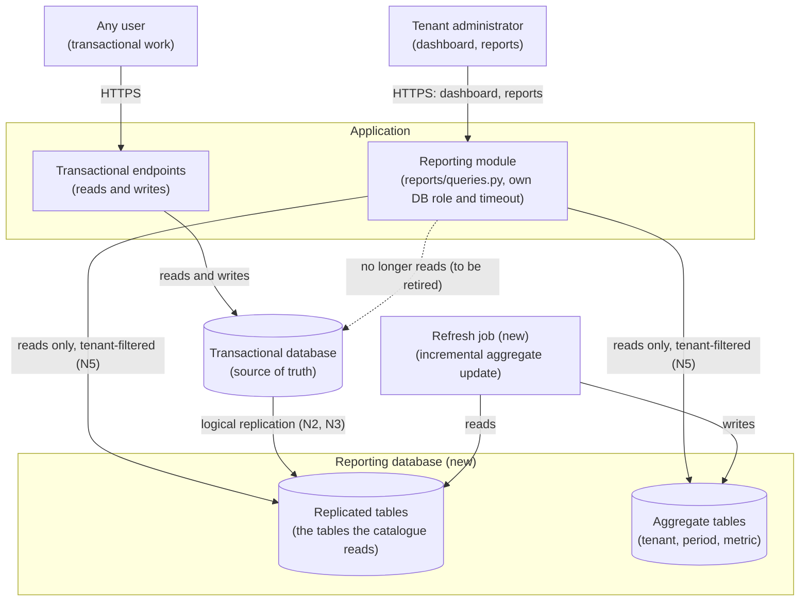
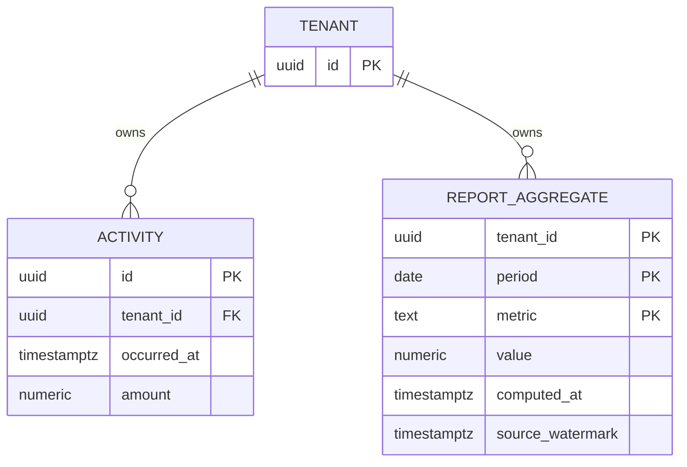

# RFC: Keeping reporting work from consuming the transactional database

**Status:** proposed (two blocking questions open, B1 and B2)
**Decider:** Engineering lead owning the application  ·  **Reviewers:** database owner, product owner for reporting, on-call rota
**Current working focus:** decision

## How to read the evidence labels in this document

Every number below carries its source inline and one of three labels. **Measured** means an instrument
produced it; when the instrument was named by the requester but not opened for this document, the label
says so and a task reads it first-hand. **Estimated** means it was derived from something measured, and
the arithmetic is shown. **Assumed** means nobody has checked, and the row says what would confirm it.

Four inputs arrived with the request. Their labels are the starting point of the whole argument, so
they are stated before anything else:

| Input as given | Label | Why | What would confirm it, and its cost |
| --- | --- | --- | --- |
| "p95 on the dashboard endpoint was around 8 seconds last month, on the 'api-latency' Grafana board" | *measured, second-hand* | A named instrument and a named window (2026-08) produced it, but the board was not opened for this document, and "around 8 seconds" is not a figure a target can be derived from | Read the `api-latency` board for 2026-08 and record the endpoint path, the exact p95, the request rate and whether the window contains an incident. About 15 minutes (task T1) |
| "Reporting is 40% of our database load" | *assumed* | No instrument is named and "load" is not a metric: CPU time, total query time, IOPS, connections and lock waits give different answers, and the choice changes what "40%" means for the design | One query against the database's cumulative statement statistics, grouped by query fingerprint, over a week. About one hour (task T2) |
| "We have around 300 active tenants" | *assumed* | No source, and "active" is undefined (signed up, logged in during the last 30 days, generated a report during the last 30 days) | One count against the tenants table with the definition stated. About 15 minutes (task T2) |
| "The report queries are all in `reports/queries.py`" | *assumed* | A claim about the code that was not verified; the word "all" is the load-bearing part, because it defines the scope of everything below | Grep the repository for query construction outside that module: raw SQL, ORM aggregate calls, admin pages, export endpoints, scheduled jobs. About one hour (task T2) |

Neither the repository nor the Grafana instance was available while this document was written, so the
lookups above were not performed here. They are cheap, they are all in tasks T1 and T2, and they are
the first work this document asks for. Until they land, every target that depends on them is labeled
*assumed* and the confirmation step measures it before the target is enforced.

## Reversibility

**Mixed, and the mix sets the depth below.** Routing report reads to a second copy of the same schema
is a **two-way door**: the routing is a configuration change and the copy can be dropped. Introducing a
reporting store with its own schema, its own load pipeline and a freshness guarantee visible to tenants
is a **one-way door**: the schema becomes a contract for report definitions, the "as of" semantics
become a product promise, and reversing means rewriting the report catalogue and taking a user-visible
promise back. So the isolation decision is made now on thin evidence and cheaply revisited; the
store-and-model decision gets the blocking questions, the measurements and the phasing.

## Context

The application serves multiple tenants from one relational database. That database carries both the
transactional work (the day-to-day writes and reads of the product) and the reporting work: aggregate
queries over history, run from `reports/queries.py` inside the application process, synchronously, in
the web request that asked for them (*assumed*: the file is the requester's claim, and the synchronous
in-request execution is inferred from the endpoint latency being visible on an HTTP latency board at
all; task T2 confirms both).

Two costs are visible today, and they are two different problems that the request states as one.

- **The interactive path is slow for the person looking at it.** p95 of the dashboard endpoint sat at
  approximately 8,000 ms over 2026-08 (`api-latency` board, as reported by the requester;
  *measured, second-hand*).
- **The reporting work competes with the transactional work.** Reporting is claimed to account for 40%
  of database load (requester, no instrument named; *assumed*). If that share is real as a share of
  database time, then the transactional workload is being served by a database with roughly 60% of its
  capacity available to it (*estimated*, and only as good as the 40%).

The distinction matters more than anything else in this document. "Reports are slow" is a complaint
from the person waiting for a report. "Reports are hurting the app" is a complaint from everyone else
using the product while a report runs. A change that separates the two workloads fixes the second and
may do nothing for the first: if the dashboard's 8 seconds is mostly its own query cost rather than
time spent waiting behind other work, then running the same query on a second database returns the same
8 seconds. That is blocking question B2, and the recommendation below is staged around it.

### Technical context

What is known, and what is not:

- Report queries are constructed in `reports/queries.py` (*assumed*, per the requester). The module's
  size, the number of report definitions in it, and whether any query construction lives outside it are
  unknown.
- The dashboard endpoint appears on an HTTP latency board, so it is served in a request/response cycle
  rather than as a background job (*estimated* from that fact).
- The database engine is not stated. The mechanisms named in the Design section (physical streaming
  replication, logical replication, materialized views) are described as PostgreSQL provides them
  (*assumed*, from `reports/queries.py` being Python and Grafana being in use, neither of which implies
  the engine). If the engine is MySQL or SQL Server the option set below is unchanged and only the
  mechanism names change: a read replica stays a read replica, and a materialized view becomes a
  summary table refreshed by a job. Reading the application's settings module settles it in one minute
  (task T2).
- The multi-tenant model is not stated. This document assumes one shared schema with a tenant
  identifier column on the tenant-scoped tables (*assumed*; it is the common shape, and it is what
  makes requirement N5 necessary). A schema-per-tenant or database-per-tenant model would change the
  shape of the aggregate tables, and it is given its own row in the tradeoff table.
- Nothing is known about the request rate on the dashboard endpoint, the number of report definitions,
  the size of the largest tenant's history, or the current database instance class and its cost. Each
  is needed to size the target state, and none of them changes which option wins.

### Current usage

| Role (what they do with the system) | What they do today | Through what | How often or how much (source) |
| --- | --- | --- | --- |
| Tenant administrator checking their numbers | Opens the dashboard and waits for the aggregates to render | The dashboard endpoint, served in-request from the main database | p95 ≈8,000 ms over 2026-08 (`api-latency` board, per the requester; *measured, second-hand*). Request rate unknown (task T1) |
| Tenant administrator pulling a specific report | Chooses a report and a period and waits | Report endpoints, queries built in `reports/queries.py` (*assumed*) | Volume, per-report latency and the number of report definitions are unmeasured (task T3) |
| Any user doing transactional work in the product | Ordinary reads and writes, while report queries run on the same database | The application's other endpoints | Reporting claimed at 40% of database load (requester; *assumed*). The latency these users see is on the same board and was not read (task T1) |
| On-call engineer during a slow-application alert | Cannot attribute database pressure to a report query or to a tenant | The latency board; no query-level attribution exists (*assumed*) | Unknown; no incident record was supplied |
| Engineer changing a report | Edits `reports/queries.py`, where a mistake executes against the transactional database | The application repository | Unknown; `git log` on that path would give the change rate (task T2) |

**The problem.** One database serves two workloads with different shapes: short transactional
statements that users wait on interactively, and long aggregate scans over history. They share CPU,
memory, buffer cache and I/O. The measured consequence is a dashboard at 8 seconds; the claimed
consequence is 40% of the database's capacity spent on work nobody is transacting against. The gap is
between what the roles need, a product whose speed does not depend on who else is running a report, and
what they get, a product where it does.

### Goals

| Goal | Who benefits | How we will know |
| --- | --- | --- |
| Tenant administrators get the numbers they came for during the visit in which they asked | Tenant administrators | Dashboard endpoint p95 on the `api-latency` board (see N1) |
| Nobody's day-to-day work in the product slows down because someone else is running a report | Every user of the product; the on-call rota | Share of database time on the transactional database attributable to report queries (see N2); the latency of non-report endpoints on the same board |
| A tenant's numbers stay that tenant's numbers wherever they are computed | Tenant administrators; the tenants' own data-protection contacts | Zero cross-tenant rows in the report comparison suite (see N5) |
| Changing a report stops being a way to endanger the product | The engineer changing a report; the on-call rota | No product-availability incident with a report query as root cause, in the two quarters after cutover (incident log) |
| The reporting workload costs what the budget owner agreed to pay for it | The budget owner | The database lines on the monthly cost report (see N4) |

### Stakeholders

| Role (what they do with the system) | What they need from this decision | Who speaks for them |
| --- | --- | --- |
| Tenant administrator checking the dashboard | Aggregates that arrive during the visit, and a way to tell how current they are | Product owner for reporting |
| Tenant administrator pulling a longer report | A bounded wait, and figures that agree with the ones they saw before the change | Product owner for reporting |
| Any user doing transactional work | Their own pages unaffected by another tenant's report; they bear the contention today and asked for nothing | Engineering lead (no user advocate was named) |
| On-call engineer | To attribute database pressure to a query, a report and a tenant during an alert | On-call rota lead |
| Engineer maintaining the report queries | One place where report queries live, and a blast radius that stops at the reporting path | Engineering lead |
| Database owner | A ceiling on what the reporting workload may take from the transactional database, and no replication mechanism nobody owns | Database owner |
| Budget owner | The added monthly run cost stated and approved before it is incurred; they gain nothing from this change and pay for it | Budget owner |
| Tenant whose data must not appear in another tenant's report | Every new copy of the data enforcing the tenant boundary the current queries enforce | Whoever holds the security function |

### Constraints

No externally imposed constraint was supplied with the request, and none was found, because neither the
tenant contracts nor any regulatory commitment was available to read. The table records the one
candidate and its status, so a reader does not mistake silence for absence.

| Constraint | Source (outside the organization, or a signed commitment) | What it excludes, and the clause |
| --- | --- | --- |
| Possible limits on where tenant data may be stored or processed | Tenant contracts and applicable data-protection law; neither was read | **Unconfirmed, so it excludes nothing today.** If such a clause exists it would exclude any option that copies tenant data to a managed service in another jurisdiction: the rows "columnar analytical store" and "managed reporting product". Open question B3 |

### Prior decisions

Decided inside the organization. None of these excludes an option; each incumbent has a row in the
tradeoff table with an alternative beside it, and the cost of reversing it is a cost in that row.

| Prior decision | Who made it, when | Incumbent it implies | Cost to reverse |
| --- | --- | --- | --- |
| One database serves both the transactional and the reporting workload | The team, by accretion; no date available (*assumed*, from the current state) | Reporting stays on the transactional database | Low to medium: adding a second copy of the data is a provisioning and routing change, but the operational load it adds is permanent |
| Report queries are built in application code, in `reports/queries.py`, and executed synchronously in the request that asked for them | Whoever wrote the module; `git log` on that path would give the author and date (*assumed*) | In-request, synchronous reporting | Medium: moving to asynchronous jobs changes the report endpoints' contract and the product's interaction for long reports |
| One shared schema for all tenants, with a tenant identifier on the tenant-scoped tables | Unknown, at the product's start (*assumed*; task T2 confirms) | Shared-schema aggregates keyed by tenant identifier | High: a per-tenant model changes migrations, connection handling and every query |
| The `api-latency` Grafana board is where endpoint latency is judged | The team; no date available | Grafana stays the latency instrument | Low, and no reason to reverse it. The gap is that it cannot attribute database time to a query, which is why task T2 adds statement-level attribution rather than replacing the board |

### Assumptions and open questions

**Blocking.** Any answer changes the decision, so the status stays *proposed* while one is open.

| Question | Owner | Date | If yes | If no |
| --- | --- | --- | --- | --- |
| **B1.** What staleness may each report in the catalogue show? Specifically: is there any report whose figures must include a write that committed seconds earlier, such as a balance, a reconciliation, or a just-submitted record the user expects to see? | Product owner for reporting | 2026-09-19 | Those reports cannot move to any replicated or pre-aggregated copy and stay on the transactional database with their own ceiling; N3's bound applies only to the rest, and the split saves less than 40% | Every report can move; N3's staleness bound becomes a product-visible promise for the whole catalogue |
| **B2.** Of the dashboard endpoint's ≈8,000 ms at p95, how much is the query's own execution cost and how much is time waiting on a database contended by other work? | Engineering lead, with the database owner | 2026-09-26 | Contention dominates: isolating the workload also fixes N1, and the aggregate-table phase can be deferred | The query's own cost dominates: isolation alone leaves N1 missed, and pre-aggregated tables move from "phase 3, conditional" to "required in phase 2" |

B2 is closed by a measurement, not by an opinion, and the measurement is cheap enough to state as a
proof-of-concept contract before it runs:

| Before it runs | Commitment |
| --- | --- |
| The question it answers | B2: is the dashboard endpoint's latency contention or query cost? |
| How it is run | Take the dashboard endpoint's queries from `reports/queries.py` and run each with the engine's execution-plan-with-timing output against a restored copy of production-sized data on an otherwise idle instance of the same class, for the three largest tenants and the median tenant. In parallel, read the cumulative statement statistics on the production database for the same query fingerprints and record mean execution time against total elapsed time |
| The pass criterion | "Contention dominates" is recorded if the idle-instance execution time is at or below 40% of the production p95 for the same queries. Otherwise "query cost dominates" |
| What each outcome changes | Contention dominates: the decision below is executed as written, and the aggregate-table phase waits for the post-cutover measurement. Query cost dominates: the aggregate tables become part of phase 2, and N1 is not claimed as met by isolation alone |

**Non-blocking.**

- The four figures in the request are labeled at the top of this document: *measured, second-hand* for
  the p95, and *assumed* for the 40%, the 300 tenants and the claim that all report queries live in one
  module. Tasks T1 and T2 close all four in about two hours of work, and they run before anything is
  built.
- Reporting being 40% of database load is treated as "a large enough share to be worth isolating"
  rather than as a number any target depends on. If the measured share is under about 10%, the case for
  a second database weakens and the "optimize in place" row becomes the likely decision. That threshold
  is the architect's judgement (*assumed*), not a measured break-even.
- Team size and who would operate a replication pipeline are unknown. This document assumes no
  dedicated database administrator and a small application team (*assumed*), which is why operational
  load is a high-priority driver and why the columnar-store and managed-product rows are penalized for
  the pipeline they add. If a database administrator owns the platform, those rows improve.
- The number of report definitions and their individual latencies are unmeasured (task T3). N6's target
  is therefore *assumed*, and it is measured before it is enforced.
- **B3.** Whether the tenant contracts or an applicable data-protection regime restrict where tenant
  data may be stored or processed is unknown (*assumed*: no such clause). It is non-blocking because it
  would exclude only the two options already rejected, the columnar analytical store and the managed
  reporting product, both of which would place tenant data outside the current perimeter. Owner:
  whoever holds the security function; closed by reading the standard tenant contract and the
  organization's data-processing commitments. It becomes blocking if either rejected option is
  reconsidered.

### Out of scope

- **Analytics beyond the current report catalogue**: exploratory querying, data science, a company-wide
  warehouse. A separate problem with separate roles; deciding it here would size the store for users who
  have not been named.
- **Transactional slowness that has nothing to do with reporting.** If task T2 shows that transactional
  statements are themselves the bulk of database time, that is a different document.
- **Charging tenants for the cost of their reports.** A pricing problem.

## Requirements

Only what is architecturally relevant: hard to reverse, structure-shaping, business-critical, or a
cross-cutting quality with a target. Three items from the request were reclassified. "Split the
reporting queries off the main database" is a design choice, not a requirement; it is evaluated as three
separate rows in the tradeoff table, physical replica, writable replicated database and columnar store,
against what it is meant to achieve, which is N1 and N2. "Reports are slow" was split into two
requirements with two different roles and two different measurements: N1 for the interactive dashboard
and N6 for the rest of the catalogue. "Reporting is 40% of our database load" is not a requirement at
all; it is the evidence N2 derives from, and it is *assumed* until task T2 runs. Two requirements were
added that nobody asked for, N5 and F2, and each names the role it serves; the Decision section records
them as additions.

### Functional

| ID | Goal (a row of the Goals table) | Requirement (the role, and what the system does for it) | Proof (the scenario, and how it is run) | Source |
| --- | --- | --- | --- | --- |
| F1 | Tenant administrators get the numbers they came for during the visit | A tenant administrator sees the same figures for a closed period after the change as before it, for every report in the catalogue | Given the full report catalogue and a tenant sample of the three largest tenants plus ten random tenants, when each report is run for the same closed period against the current path and the new path, then every figure is identical; run as a comparison suite before cutover and kept in the test suite afterwards | The report catalogue is claimed to live in `reports/queries.py` (*assumed*); parity is what makes the change invisible to the role |
| F2 | Tenant administrators get the numbers they came for during the visit | A tenant administrator can see the time at which the figures they are looking at were computed, and is told when those figures are older than the bound in N3 | Given a dashboard load, when the aggregates were last computed at time T, then the page states T; and given aggregates older than N3's bound, when the page renders, then it says so. Run as an interface test, plus a check that the staleness indicator fires when the refresh job is stopped | Added by the architect. Role: the tenant administrator who acts on the figures. Without it, this design moves a hidden change onto the person making the decision |

### Non-functional

| ID | Goal | Requirement (metric, target, condition) | Derived from | Proof (measurement) | Source |
| --- | --- | --- | --- | --- | --- |
| N1 | Tenant administrators get the numbers they came for during the visit | p95 of the dashboard endpoint at or below 1,500 ms, at the peak request rate recorded on the `api-latency` board for 2026-08 | Today ≈8,000 ms (`api-latency` board, 2026-08, per the requester; *measured, second-hand*). The 1,500 ms is *assumed*: no abandonment figure and no contractual figure were supplied. It is proposed as the ceiling that keeps the dashboard in the same latency class as the application's other authenticated pages, whose p95 sits on the same board and has not been read. Task T1 reads it and sets the final number | The `api-latency` board, read weekly against the target, plus a load run at the recorded peak before cutover | The requester's p95 figure |
| N2 | Nobody's day-to-day work slows down because someone else is running a report | Report queries account for at most 5% of total database time on the transactional database, at the monthly peak | Claimed 40% today (requester, no instrument; *assumed*, task T2 measures it). The ceiling is not zero because two things still touch the transactional database after cutover: the replication apparatus that streams row changes out of it, and any report B1 finds cannot leave it. 5% is the headroom *estimated* for both; the figure is reset by the first measurement after T2, and it rises if B1 finds reports that must stay | Cumulative statement statistics grouped by query fingerprint and database role, read weekly by the database owner | The 40% claim |
| N3 | Tenant administrators get the numbers they came for during the visit | Figures shown on the dashboard are computed from data no more than 5 minutes old, measured as the interval between the newest committed transaction included and the moment of display, at the monthly peak | *Assumed.* No product statement about staleness was supplied; blocking question B1 owns the number, and per-report exceptions from B1 override it. 5 minutes is proposed as the interval under which a dashboard shows today's activity for figures that aggregate a day or more | A pipeline-lag metric on the reporting path, alerting above the bound; the F2 staleness indicator as the user-visible check | B1 |
| N4 | The reporting workload costs what the budget owner agreed to pay | The added monthly run cost of the reporting path is at most the cost of one additional database instance of the transactional database's current class and storage, and it is approved by the budget owner before cutover | The transactional instance's class and its line on the monthly cost report were not read (task T2). Expressing the ceiling relative to that line rather than as a currency figure avoids inventing a budget nobody stated | The monthly cost report, tagged for the reporting path, one month after cutover | Added by the architect for the budget owner, who gains nothing from this change |
| N5 | A tenant's numbers stay that tenant's numbers wherever they are computed | Every read of reporting data is filtered by exactly one tenant identifier, and no report response contains a row belonging to another tenant, across the whole catalogue | The shared-schema model puts the tenant boundary inside the query (prior decision, *assumed*), so any second copy of the data duplicates that boundary, and a duplicated boundary is where cross-tenant leaks come from. With roughly 300 tenants (*assumed*) the blast radius of one unfiltered aggregate is the whole customer base | A static check in the build that every reporting query and every aggregate read is parameterised by a tenant identifier, plus a two-tenant end-to-end test asserting zero foreign rows, run in the F1 comparison suite | Added by the architect. Role: the tenant whose data must not appear in another tenant's report |
| N6 | Tenant administrators get the numbers they came for during the visit | p95 wall-clock time to produce any report in the catalogue at or below 30 seconds, at the monthly peak | *Assumed.* No per-report measurement exists: the only measured report path is the dashboard endpoint at ≈8,000 ms. The 30 seconds is a placeholder for the longest wait the product owner will accept in a synchronous request; task T3 measures the catalogue and the product owner sets the number before this target is enforced | Per-report timing recorded on the reporting path and reviewed against the target monthly | The requester's statement that reports are slow |

## Design

The design has four dimensions, decided one at a time: where report reads execute, what they read, how
the data gets there, and how a report is delivered to the role waiting for it. Every choice names the
requirement it answers, and the alternatives to each are in the tradeoff table.

### Where report reads execute

A **reporting database**: a separate database instance that holds a copy of the tenant data the report
catalogue needs, and serves every report read. No report query executes against the transactional
database (N2). The application keeps one module for report queries, pointed at a second connection with
its own database role and its own statement timeout, so a slow report cannot hold a connection the
transactional workload needs (N2, and the maintenance goal).

Two shapes were considered for that copy, and the difference decides the next dimension. A **physical
streaming replica** is byte-identical to the transactional database and read-only, which means it can
serve report queries but cannot hold anything the reports do not already have: no aggregate tables, no
reporting-specific indexes. A **writable database maintained by logical replication** subscribes to the
tables the catalogue needs and is otherwise an ordinary database, so it can hold aggregate tables and
its own indexes. The design takes the writable shape, because the aggregate tables in the next dimension
have nowhere else to live that does not put write load back on the transactional database. This choice
touches the "one database serves both workloads" prior decision, and its reversal cost is low: the
routing is a configuration change.

### What report reads read

For the dashboard, **aggregate tables**: one row per tenant, period and metric, maintained
incrementally on the reporting database (N1, N3). The dashboard endpoint then reads a bounded number of
pre-computed rows instead of scanning history, which is the only mechanism here that reduces the query's
own execution cost rather than moving it. Whether this is required in phase 2 or deferred to phase 3 is
what blocking question B2 decides.

For the rest of the catalogue, the report queries run against the replicated tables as they do today,
with reporting-specific indexes added on the reporting database where the measurements from task T3
justify them (N6). Every read carries a tenant identifier, enforced by a static check on the query
builders (N5).

### How the data gets there

Logical replication from the transactional database for the tables the catalogue reads, and an
incremental refresh job on the reporting database that updates the aggregate tables from those
replicated tables. The refresh reads the reporting database, not the transactional one, so its cost does
not count against N2. Replication lag plus refresh interval is the staleness in N3, and it is the metric
the N3 alert watches. The reporting database is a derived store: it is never written by a user action,
which keeps the transactional database the single source of truth and keeps the reporting database
rebuildable from it.

### How a report reaches the role waiting for it

Reports stay in the request/response path for now, which keeps the "in-request, synchronous reporting"
prior decision in place, and N6's 30-second target is what makes that tenable. If task T3 finds reports
whose production time exceeds the request timeout, the asynchronous-job row in the tradeoff table is the
answer for those reports specifically, taken per report rather than for the catalogue.

### Static view



*Figure 1. C4 container diagram of the target state; new components labelled "new", the retired read
path dashed. Answers F1, F2, N1, N2, N3, N5.*

### Dynamic view

```mermaid
sequenceDiagram
    actor A as Tenant administrator
    participant R as Reporting module
    participant G as Aggregate tables
    participant C as Replicated tables
    participant J as Refresh job
    J->>C: read rows changed since last watermark
    J->>G: write aggregate rows, stamp computed_at (N3)
    A->>R: open dashboard for their tenant
    R->>G: read aggregates WHERE tenant_id = :tenant (N5)
    G-->>R: pre-computed rows and computed_at
    R-->>A: figures, with "as of computed_at" and a staleness flag (F2; N1 measured here)
    A->>R: run a catalogue report for a period
    R->>C: tenant-filtered aggregate query, under a statement timeout (N5, N6)
    C-->>R: rows
    R-->>A: report, with the same as-of stamp (F1; N6 measured here)
```

*Figure 2. Sequence diagram, container level, for the dashboard load and one catalogue report. Answers
F1, F2, N1, N3, N5, N6.*

### Data view



*Figure 3. Entity-relationship diagram of the aggregate table against the replicated transactional
tables it derives from; `ACTIVITY` stands for the tenant-scoped history tables the catalogue reads.
`source_watermark` is the newest committed transaction included, which is what N3 measures and F2
displays. Answers F2, N1, N3, N5.*

## Alternatives analysis (Tradeoff)

### Decision drivers

1. **N2 and N5 are veto criteria.** An option that leaves report queries competing with transactional
   work, or that duplicates the tenant boundary without enforcing it, does not qualify however well it
   scores elsewhere.
2. **N1, then N6.** Latency for the roles waiting, in that order, because the dashboard is the one
   measured case.
3. **Operational load on a small team with no named database administrator** (*assumed*). Every
   pipeline added here is carried indefinitely by the people who also ship features.
4. **Reversibility.** Routing is a two-way door and gets decided on the evidence available now. A store
   with its own schema and its own freshness promise is a one-way door and waits for B1 and B2.
5. **Time to first relief.** The transactional workload is being harmed today, so an option that
   delivers isolation in days outranks one that delivers more in months.
6. **N4, cost.** Last of the drivers, because no budget was supplied: the ceiling is relative, and the
   budget owner approves it.

### What every option shares

Every option below keeps reporting a feature of this product, served by this application from the
organization's own tenant data, with the transactional database as the single source of truth and the
existing shared-schema multi-tenant model. Three of those shared elements are prior decisions rather
than settled facts, and each has a row in the table: the shared schema has the per-tenant-store row, the
single-database status quo is the baseline row, and in-request synchronous reporting has the
asynchronous-jobs row beside its incumbent. The database engine and the cloud provider are also shared;
neither was stated, and reversing either is out of proportion to this decision, so they are recorded
here rather than given rows. Two options nobody proposed are in the table: doing nothing, and fixing the
queries in place without a second database.

| Alternative | Requirements (met / partial / missed, by ID) | Pros | Cons | Risk | Impact | Probability | Mitigation | Contingency |
| --- | --- | --- | --- | --- | --- | --- | --- | --- |
| **[Isolation] Writable reporting database via logical replication, with aggregate tables** (recommended) | met: F1, F2, N2, N3, N4, N5; partial: N1 (met only if the aggregate tables cover the dashboard's queries; B2 decides whether that is phase 2), N6 (per-report indexes decided by task T3) | Removes report reads from the transactional database, so N2 is met by construction; the only shape that can hold aggregate tables and reporting indexes without putting write load back on the database being relieved; the report catalogue keeps one home; the store is rebuildable from the source of truth | Logical replication is a pipeline the team owns: it does not carry schema changes, so every migration on a replicated table needs a matching step; it needs a replica identity on each replicated table; it adds a second instance to operate and to pay for | A schema change on the transactional database breaks replication and reports go stale | High: figures frozen while F2 still shows an as-of time | Medium: it depends on migration discipline the team does not have today | The N3 lag alert fires on staleness rather than on replication state, so a broken pipeline pages someone; a build check fails a migration touching a replicated table without a matching reporting step | Rebuild the subscription from a fresh copy; serve the dashboard from the transactional database behind a flag while it rebuilds |
| | | | | Aggregate tables and the source of truth diverge through a refresh bug | High: wrong figures are worse than slow ones | Medium: incremental aggregation is where off-by-one watermarks live | The F1 comparison suite runs nightly against closed periods, not only at cutover | Recompute the affected periods from the replicated tables; the aggregates are derived, so a full rebuild is always available |
| | | | | The measured share of report load turns out far below the claimed 40%, making a second instance disproportionate | Medium: cost and operational load bought for little | Medium: the 40% is *assumed* | Task T2 measures the share before the instance is provisioned | Fall back to the "optimize in place" row |
| **[Isolation] Physical streaming read replica, same schema, reporting reads routed to it** | met: N2, N4, N5; partial: N1 (only if B2 answers "contention dominates"), F1 (parity holds, but there is no place for reporting indexes), F2 (replication lag is displayable, but with nothing pre-computed there is no computed-at, so the as-of is approximate); missed: N3 as a bound anyone can hold, since lag is observable but not controllable without a place to pre-compute | The cheapest and fastest isolation available: no schema work, no pipeline to write, and replication is a managed feature; a genuine two-way door, droppable in an afternoon | Read-only, so no aggregate tables and no reporting-specific indexes: if the dashboard's own query cost dominates, its 8 seconds move but do not shrink; long report queries can be cancelled by replication conflicts | Reports fail during periods of replication conflict | Medium: intermittent report errors | Medium: it depends on engine settings for long-running queries on a replica | Configure the replica to favour long queries over lag, and set statement timeouts | Retry the report; route the affected reports to the writable reporting database |
| **[Query cost] Aggregate tables maintained on the transactional database** | met: F1, F2, N1; partial: N2 (removes the dashboard's read cost but adds refresh write cost to the transactional database), N3 | No second instance to pay for or to operate; attacks the query cost directly, which is the half of the problem isolation does not touch; the smallest change that could meet N1 | Puts new write load on the database this decision is trying to relieve, and at N3's 5-minute freshness that write load is continuous; the rest of the catalogue still competes with transactional work | Refresh writes cost more than the report reads they replace | Medium: N2 gets worse rather than better | Medium: it depends on the aggregate's fan-in and on the refresh interval | Measure the refresh cost in the same statement statistics as task T2 before adopting it | Move the aggregates to the reporting database, which is the recommended row |
| **[Query cost] Optimize the queries and indexes in place, plus cached results, no second database** (nobody proposed this) | partial: N1, N2 (a faster query still competes for the same database), N6; missed: F2, N3 (caching introduces staleness with nothing to display it) | Cheapest by a wide margin: no new component, no pipeline, no freshness semantics, no added cost. If B2 says query cost dominates, a missing index may be most of the 8 seconds. It is the honest first move if task T2 shows the reporting share is small | Leaves the two workloads on one database, so the coupling that caused the complaint remains; the gains are bounded by whatever the execution plans reveal | The team spends weeks tuning and the coupling reasserts itself as volume grows | Medium: the same complaint returns | Medium to high: growth in tenants and in history is the direction of travel | Time-box the tuning to the B2 measurement window and record what it bought | Proceed with the recommended row, with better-understood queries |
| **[Data store] Columnar analytical store fed by change-data capture** | met: N2, N6; partial: F1 (aggregation semantics and type handling differ, so parity needs proving report by report), N1 (fast for scans, and the aggregate layer still has to be built), N4 (a new engine plus a capture pipeline), N5 (the tenant boundary is re-implemented in a second engine) | The right answer for scans over years of history; compresses history hard; scales past what one relational instance will do | A second engine and a capture pipeline for a small team; a one-way door on the report definitions, which get rewritten against a different dialect and different aggregation semantics; no evidence yet that this workload needs it | The team owns a pipeline and an engine nobody has run in production | High: a broken pipeline is silently wrong figures | Medium to high with no database administrator (*assumed*) | Not attempted at this evidence level | Revisit when the recommended row's aggregate refresh becomes the bottleneck, which is the stated condition that reopens this row |
| **[Buy] Managed reporting or business-intelligence product over a replica** | met: N2, N6; partial: F1 (report definitions are rebuilt in the product's own language), N3, N4 (per-seat or per-query pricing at roughly 300 tenants is hard to predict), N5 (the tenant boundary moves into the product's access model); missed: F2 as specified (the as-of display becomes the product's, not ours) | No pipeline and no query engine to build; it also serves the exploration the current catalogue does not do | The reports are an in-product feature for tenants rather than an internal analyst tool, so embedding a third-party product changes the product surface; tenant data leaves the perimeter, which is where open question B3 bites | Cost scales with tenants rather than with load | Medium to high: N4 breached after growth | Medium: pricing models vary and none was quoted | A metered trial before committing, priced at 300 tenants (*assumed* count, confirmed by task T2) | Fall back to the recommended row; the replica it reads from is the same component |
| **[Delivery] Asynchronous report jobs with stored results** | met: N6 (by removing the wait from the request); partial: N2 (with a worker pool bounded separately), F1, N1 (a dashboard that arrives later is not a dashboard) | Removes the request timeout as a ceiling on report size; bounds reporting concurrency explicitly; composes with any store choice | Changes the product interaction for every report; adds a queue, workers and a result store; does nothing about which database the work runs on, which is the actual complaint | Effort spent on delivery while the contention stays | Medium: the original problem persists | Medium: it is an appealing change that misses the driver | Adopt it per report, only where task T3 shows production time near the request timeout | Keep those reports synchronous and cap their period range |
| **[Delivery] In-request synchronous reporting (incumbent)** | met: F1; partial: N1 (the interaction model is right and the latency is not), N6 (bounded by the request timeout) | No change to make; the dashboard is inherently interactive and belongs in a request | A report that outgrows the request timeout has no path; concurrency is bounded only by the web server's workers | A large tenant's report exceeds the timeout and the role has no way to get it | Medium: one class of report unavailable to the largest tenants | Medium: unmeasured, and it is the direction growth pushes | Task T3 measures the catalogue against the timeout | Move the affected reports to the asynchronous row |
| **[Data model] A reporting store per tenant, schema or database** | met: N5 (isolation by construction); missed: N4, and disproportionate at the operational level | The tenant boundary is enforced by the topology rather than by a filter in every query, which is the strongest available answer to N5 | Roughly 300 replication pipelines, 300 aggregate refreshes and 300 sets of migrations (*assumed* tenant count); reverses the shared-schema prior decision at high cost; internal cross-tenant reporting becomes a fan-out | Operational load grows linearly with sales | High: the reporting path becomes the constraint on onboarding | High at 300 tenants and rising | Not attempted | Rejected; N5 is met by the static tenant-filter check instead |
| **Baseline: do nothing** | met: F1 (today's figures are the reference); missed: F2, N1, N2, N3, N5 as an enforced check, N6 | Zero effort, zero migration risk, zero added cost, and no new component to operate | Leaves the dashboard at ≈8,000 ms and reporting at a claimed 40% of database load; the coupling grows with tenants and with history, so the same complaint returns louder | Reporting load takes the transactional workload down under a peak | High: product-wide outage | Medium: unmeasured, and the trend is toward more history per tenant | None available without the work this document proposes | None |

Every incumbent from the prior decisions table has a row: the single database is the baseline,
in-request reporting has its own row beside the asynchronous alternative, and the shared schema has the
per-tenant row beside it. Each rejected option is stated at its strongest: the columnar store is the
right answer for a workload this one may become, buying is the right answer for exploration this
catalogue does not do, and optimizing in place may be most of the fix if B2 finds the queries are simply
missing an index.

## The decision

**Move every report read off the transactional database and onto a dedicated reporting database
maintained by logical replication, and hold the aggregate-table layer pending B2.** The drivers decided
it. N2 is a veto criterion, and only the isolation rows meet it. Between the two isolation shapes, the
physical replica is cheaper and faster to land but is read-only, and the aggregate tables that N1 needs
have nowhere to live on it that does not put write load back on the database being relieved, which is
the same objection that disqualifies the "aggregate tables on the transactional database" row. The
columnar store and the managed product are rejected at this evidence level rather than on principle:
neither is justified by a 40% figure that is still *assumed*, and both are one-way doors on the report
definitions.

**What is firm regardless of B1 and B2**: report reads stop executing against the transactional
database, the reporting path gets its own database role and statement timeout, tenant filtering is
enforced by a build-time check (N5), and tasks T1 to T3 run first. **What B2 decides**: whether the
aggregate tables are phase 2 (query cost dominates) or deferred to phase 3 (contention dominates).
**What B1 decides**: which reports, if any, cannot leave the transactional database at all, and
therefore how much of the claimed 40% actually moves.

**Decision style: autocratic.** The engineering lead owning the application makes the call, after
consulting the database owner on N2 and on the replication mechanism, and the product owner for
reporting on B1 and on N1's and N6's targets. Recorded here so the basis is visible.

**Status: proposed.** B1 and B2 are open, and both change the design. The status moves to accepted when
both are closed. Tasks T1 to T3 do not wait for that: they are needed under every option in the table,
including doing nothing.

### Stakeholder conflicts

- The request was framed as splitting the reporting queries off the main database. That framing is
  accepted for the isolation dimension and refused as a complete answer: on the evidence available,
  moving the same query to another database may leave the dashboard at 8 seconds, which is why N1 is
  recorded as only partially met by isolation and why B2 gates the aggregate layer. If the requester
  reaffirms that isolation alone is the whole scope, that becomes a prior decision with the requester as
  its author, and N1 is recorded as missed.
- Two requirements were added that nobody asked for. **N5**, tenant filtering enforced across the whole
  reporting path, serves the tenant whose data must not appear in another tenant's report: a second copy
  of the data duplicates the tenant boundary, and at roughly 300 tenants one unfiltered aggregate
  exposes the customer base. **F2**, the as-of time shown to the user, serves the tenant administrator
  acting on the figures: this design introduces staleness where there was none, and hiding that changes
  what the numbers mean. Neither was objected to, because neither was discussed; both are open for the
  reviewers to strike, with the reason recorded here if they do.
- The budget owner gains nothing from this change and pays for a second database instance. N4 caps the
  increment and gives them the approval, which is the most this decision can offer them.

### Consequences

- Reporting becomes a derived-data problem. The team gains a replication pipeline and a refresh job to
  operate, and gains staleness as a permanent property of reports that had none.
- Migrations get a second step. A schema change on a replicated table is no longer complete when it
  lands on the transactional database, and the build enforces that.
- The transactional database gets capacity back, to the extent the 40% claim is real, and the on-call
  rota gets query-level attribution it does not have today, which is useful under every future database
  alert.
- The report catalogue keeps one home in the application, so the maintenance goal is served without
  splitting report logic across two engines.
- Reversing the isolation is cheap. Reversing the freshness promise to tenants is not.

### Residual risks

- Silent staleness is reduced rather than removed: the F2 indicator and the N3 alert both depend on the
  pipeline reporting its own lag honestly, and a subscription that stops advancing while still reporting
  a lag would defeat both. The nightly F1 comparison against the source of truth is the backstop, and it
  is a detection delay, not a prevention.
- Every target in this document except F1's parity rests on figures that are *assumed* or
  *measured, second-hand*. If task T2 shows the reporting share is under about 10% of database time, the
  recommendation above is the wrong shape and the "optimize in place" row wins; this document should be
  re-read at that point rather than executed.
- B1 may find reports that must read the transactional database. Those reports keep the coupling, and
  N2's 5% ceiling then has to absorb them or move.

### Confirmation

- **Measured first, before anything is built**: the dashboard endpoint's real p95, its path and its peak
  request rate (T1); the reporting share of database time, the tenant count and the true scope of the
  report queries (T2); the per-report latencies (T3). N1's, N2's, N3's and N6's targets are set from
  those readings, because all four are currently *assumed*.
- **The fitness function**: the F1 comparison suite runs nightly against closed periods and fails the
  build on any figure difference, and the N5 static check fails the build on any reporting query without
  a tenant parameter.
- **Watched weekly for the first quarter**: report-query share of database time on the transactional
  database against N2's ceiling; dashboard p95 against N1; reporting-path lag against N3.
- **Checked one month after cutover**: the cost report against N4.
- **Review date**: 2026-12-08, or earlier if task T2 contradicts the 40% claim, if B1 finds reports that
  cannot move, or if the aggregate refresh becomes the reporting database's own bottleneck, which is the
  condition that reopens the columnar-store row.

## Launch strategy

Four phases, each ending in something that can be judged, and none of them open-ended.

1. **Measure**, before any change: tasks T1 to T3. Ends with the four request figures replaced by
   measured ones and B2 answered. If the reporting share is small, stop here and re-read this document.
2. **Isolate**: provision the reporting database, replicate the tables the catalogue reads, give the
   reporting module its own role and statement timeout, and route report reads to it behind a flag with
   the F1 comparison suite comparing both paths on live traffic. Ends when no report query appears in the
   transactional database's statement statistics for a full week (N2). If B2 answered "query cost
   dominates", the aggregate tables ship in this phase.
3. **Pre-aggregate**, if deferred by B2: aggregate tables and the refresh job for the dashboard's
   metrics, the as-of display and the staleness alert (F2, N1, N3). Ends when the dashboard's p95 meets
   N1 at the recorded peak.
4. **Trim**: per-report indexes on the reporting database where task T3 justifies them, and asynchronous
   delivery for any report still near the request timeout (N6). Ends with the retired read path deleted
   from the reporting module, so the transactional connection is no longer reachable from report code.

## Tasks and roadmap

Estimates are the architect's, in engineer-days, and they are *assumed*: neither the team's size nor its
familiarity with the replication mechanism is known.

| Task | Description | Estimate |
| --- | --- | --- |
| T1 | Read the `api-latency` board for 2026-08: dashboard endpoint path, exact p95, peak request rate, non-report endpoint p95, and whether the window contains an incident. Record the figures in this document | 0.5d |
| T2 | Enable and read statement-level attribution on the transactional database: report-query share of database time by fingerprint, over a week. Count active tenants with the definition stated. Grep the repository for query construction outside `reports/queries.py`. Read the database engine and version from the settings module, and the instance class with its cost line | 1d |
| T3 | Time every report definition in the catalogue at the largest tenant and at the median tenant, and list those near the request timeout | 1d |
| B2 | Run the B2 proof of concept as contracted above, and record the outcome and what it changes | 1d |
| B1 | Walk the report catalogue with the product owner and record the staleness each report tolerates, and any report that tolerates none | 0.5d |
| Provision | Reporting database instance, logical replication for the catalogue's tables, replica identity where missing, lag metric and alert | 3d |
| Route | Second connection with its own database role and statement timeout; report reads behind a flag; the N5 static check in the build | 2d |
| Parity | F1 comparison suite over the catalogue and the tenant sample, wired into CI nightly | 3d |
| Aggregate | Aggregate table, incremental refresh job with a watermark, as-of display and staleness flag (F2) | 5d |
| Migration guard | Build check failing a migration on a replicated table without a matching reporting step | 1d |
| Runbook | On-call runbook for replication lag, a stalled refresh and a rebuild from the source of truth; produced by this decision and kept with the service | 1d |

## Glossary

| Term | Meaning |
| --- | --- |
| Transactional database | The single database serving the product's day-to-day reads and writes today; the source of truth in the target state |
| Reporting database | The new instance holding a replicated copy of the tables the report catalogue reads, plus the aggregate tables; never written by a user action |
| Report catalogue | The set of report definitions the product offers tenants, claimed to be built in `reports/queries.py` |
| Aggregate table | A table of pre-computed figures keyed by tenant, period and metric, refreshed incrementally |
| Logical replication | Replication that copies row changes for selected tables into an otherwise ordinary, writable database; it does not carry schema changes |
| Physical streaming replica | A byte-identical, read-only copy of a whole database |
| Staleness | The interval between the newest committed transaction included in a figure and the moment that figure is displayed |
| Tenant | One customer organization on the shared schema; roughly 300 of them (*assumed*) |
| Database time | Cumulative time the database spends executing statements, as reported by its own statement statistics; the metric N2 uses for "load" |

## Sources

- `api-latency` Grafana board, window 2026-08: dashboard endpoint p95 of approximately 8,000 ms, as
  reported by the requester. Not opened for this document; task T1 reads it.
- The requester, 2026-09-08: reporting is 40% of database load; approximately 300 active tenants; the
  report queries are all in `reports/queries.py`. No instrument was named for any of the three; task T2
  closes all three.
- `reports/queries.py`, application repository: the claimed home of the report catalogue. Not read for
  this document; task T2 verifies the claim and its scope.

## Version history

| Version | Date | Author | Description |
| --- | --- | --- | --- |
| 1.0 | 2026-09-08 | Architecture pair, from the requester's brief | Document created. Status proposed: B1 and B2 open, and the four input figures unverified pending tasks T1 to T3. |
