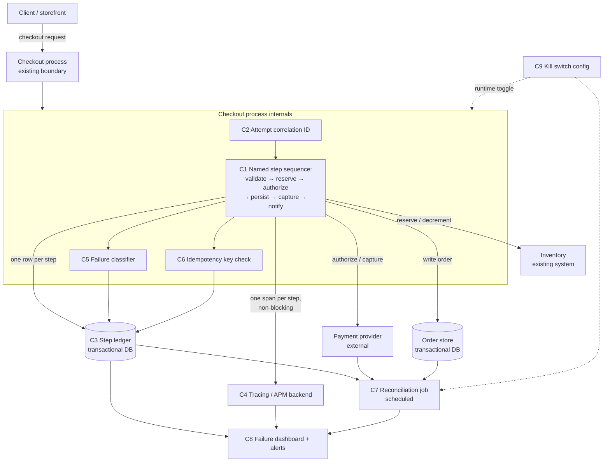
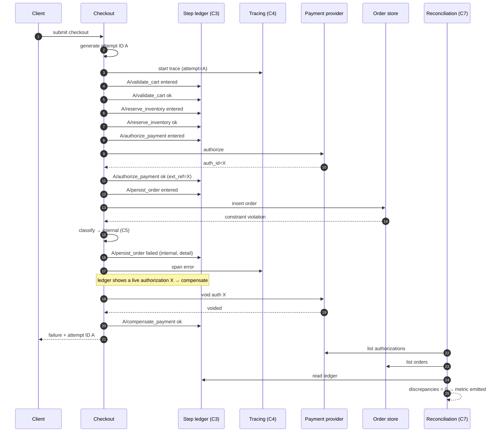

# RFC — Checkout reliability: making failures diagnosable before refactoring

**Status:** draft — awaiting review
**Current working focus:** decision (document worked end to end; blocked on the open questions in §9)
**Author:** Lucas Marques
**Date:** 2026-09-08

## Related documents

None yet. This RFC was written without access to the checkout codebase, to a dashboard, or to any
failure data — every factual gap is marked as an explicit assumption (`A-n`) and every question that
would change the analysis is listed in §9. Before this document is approved, the following should be
attached:

- Current checkout flow diagram (as-built), or a link to the code entrypoint.
- The measurement or query behind the "≈2% failure" number, with its time window and denominator.
- Payment provider and any other third-party dependencies in the flow, with their SLAs.
- Existing observability stack (APM/tracing vendor, log platform, retention).

---

## 1. Context

Checkout is the step where a customer's intent becomes money and an order. It is the last thing in the
funnel and the most expensive place to fail: a failure here is not a degraded experience, it is a lost
sale plus a support ticket plus, potentially, a customer whose card was charged for something they did
not get.

Today, roughly **2% of checkout attempts fail** (assumption `A-1`: this is a rate of attempts, not of
sessions or users, and it is measured over a recent representative window). That number on its own is
not the problem this RFC exists to solve. The problem is the second half of the observation: **when a
checkout fails, nobody can say which step broke.** The team sees an aggregate failure rate and cannot
decompose it.

That single fact has three consequences, and they are what makes this urgent now:

1. **Every fix is a guess.** Without knowing whether the 2% is card declines (a business outcome, not a
   bug), a flaky payment gateway, a race on inventory, a timeout, or an unhandled exception, any
   engineering effort aimed at the 2% is aimed at an unknown target. The expected value of that effort
   is close to zero, and we cannot tell afterwards whether it worked.
2. **We cannot rule out silent money-state damage.** A checkout that "fails" after a payment
   authorization but before an order is persisted looks identical, from the outside, to a checkout that
   failed at step one. We do not currently know whether any portion of the 2% leaves a customer charged
   without an order, or an order without a charge (assumption `A-2`: no reconciliation process today
   proves otherwise). If that class of failure exists, it is the most severe thing in this document and
   it is currently invisible.
3. **We cannot size any redesign.** A proposal to restructure checkout has to be justified against a
   failure profile. We do not have one.

Alongside the problem, a set of solutions has been proposed: adopt the **saga pattern**, **split
checkout into microservices**, add **Redis caching**, use **gRPC between services**, and introduce a
**feature flag system**. These arrived framed as requirements. They are not requirements — they are
candidate designs, and §2.1 handles that reclassification explicitly, because the entire method of this
document depends on requirements and solutions being kept apart. Several of them may well end up being
built; none of them can be evaluated until we can state what problem they are solving.

### 1.1 Out of scope

- **Conversion-rate optimization of the checkout UX.** Cart abandonment, form design, and payment-method
  mix are a product concern. This RFC is about attempts that the system fails to complete.
- **Repricing, tax, or catalogue logic.** Untouched.
- **A general org-wide service-decomposition strategy.** If the company has an independent mandate to
  split its monolith for team-autonomy or deploy-throughput reasons, that is a legitimate decision with
  its own drivers — but it is a different document with different requirements, and it should not be
  smuggled in as a fix for a 2% failure rate. This RFC evaluates decomposition *only* as a candidate
  answer to the stated problem.
- **Choice of observability vendor.** The design below needs distributed tracing, structured logs, and
  metrics; whether that is Datadog, Grafana/Tempo, Honeycomb, or an existing in-house stack is an
  implementation detail this RFC deliberately leaves open (see `A-5`).

---

## 2. Requirements

A requirement here is something **non-negotiable** and **architecturally relevant** — hard to reverse,
structure-shaping, business-critical, or a cross-cutting quality target. Everything else is a feature
detail and belongs on a ticket, not in this analysis.

### 2.1 First: the proposed items, reclassified

The five items in the request describe *how*, not *what must be true*. Each is restated below as the
requirement it implies, if any, so that it can be evaluated in §4 instead of assumed.

| Proposed item | Classification | The requirement it actually implies | Where it is evaluated |
| --- | --- | --- | --- |
| Saga pattern | **Candidate solution** to an unconfirmed problem | *If* checkout spans multiple systems that cannot share one transaction, then no attempt may leave money and order state inconsistent → **R3** | §4, dimension B |
| Split into microservices | **Candidate solution**, no requirement traced to it | None identified from the stated problem. Decomposition is a means to team autonomy / independent scaling / independent deploys — none of which were stated as constraints | §4, dimension B (B3) and §4.4 |
| Redis caching | **Candidate solution**, no requirement traced to it | None. Caching addresses latency or load; the stated problem is correctness/diagnosability. No latency target or load ceiling was given | §4.4 |
| gRPC between services | **Candidate solution**, dependent on another candidate | None. It presupposes the microservices split, and is a transport choice inside it | §4.4 |
| Feature flag system | **Partly a real requirement** | Any change to checkout must be reversible in minutes without a deploy → **NFR2**. That is a genuine constraint; a full flag *platform* is one of several ways to satisfy it | §4, dimension C |
| *(from the problem statement)* "we don't know which step broke" | **Requirement** | **R1, R2** below | §4, dimension A |

The point of this table is not to reject ideas. It is that a design tied to unstated requirements cannot
be reviewed: nobody can argue against "use a saga" on its merits, only on taste. Tied to `R3`, it becomes
a checkable claim.

### 2.2 Functional requirements

- **R1 — Per-step attribution.** For every checkout attempt, the system records which steps were
  entered, which completed, and which one failed, under a single identifier that ties the whole attempt
  together. Verifiable: given any failed attempt ID from the last 30 days, an engineer can name the
  failing step and its error in under 2 minutes, without reading raw application logs.
- **R2 — Failure taxonomy.** Every terminal checkout failure is classified into an explicit, enumerated
  category — at minimum: *customer-caused* (card declined, invalid data, insufficient funds),
  *dependency* (third-party timeout, 5xx, rate limit), *internal* (unhandled exception, bug),
  *conflict* (inventory or concurrency), *abandoned/timeout*. Verifiable: the sum of categories equals
  the total failure count, with an "unclassified" bucket that is itself alerted on and must trend to
  under 5% of failures.
- **R3 — No inconsistent terminal state.** No checkout attempt may end with money captured and no
  order, or an order with no captured payment, or an order with stock never decremented. Verifiable: a
  reconciliation job compares payment-provider records against order records and reports a discrepancy
  count; the target is zero, and any non-zero result pages someone.
- **R4 — Idempotent retry.** A checkout attempt that is retried (by the customer, the client, or a
  worker) must not double-charge or double-order. Verifiable: replaying the same attempt identifier
  produces the original outcome, proven by an automated test and by a load test that fires duplicate
  submits.
- **R5 — Retrospective diagnosis.** The per-step record survives long enough to investigate a report
  that arrives days later. Minimum 30 days queryable (assumption `A-3`; longer if a finance or
  compliance retention rule applies).

### 2.3 Non-functional requirements

- **NFR1 — Instrumentation must not degrade checkout.** Added p95 latency from instrumentation ≤ 20ms
  and ≤ 5% of current checkout p95, validated under a load test at 2× observed peak. Instrumentation
  must never fail the transaction: an observability backend outage cannot cause a checkout failure
  (fire-and-forget or bounded-buffer emission, never a blocking synchronous write to an external
  collector on the request path).
- **NFR2 — Reversibility.** Every change introduced by this work is reversible in under 5 minutes
  without a code deploy. This is the real requirement behind "feature flag system".
- **NFR3 — Time to attribute.** Median time from "a failure alert fires" to "we know which step and
  which category" ≤ 5 minutes, using a dashboard rather than an investigation.
- **NFR4 — No sensitive data in telemetry.** No full card numbers, CVV, or track data in traces, logs,
  or the step ledger; PII minimized to identifiers. Assumption `A-4`: the system is in PCI-DSS scope,
  which makes this non-negotiable rather than good hygiene.
- **NFR5 — Bounded cost.** Telemetry and ledger storage cost is estimated and approved before rollout;
  high-cardinality per-attempt data must be sampled or capped so cost scales sub-linearly with traffic.
  No target number is given here because the current traffic volume is unknown (`A-6`).

### 2.4 Deliberately not requirements

Stated so reviewers can see what was *not* assumed: no latency target for checkout itself (none was
given), no throughput or scaling ceiling, no team-autonomy or deploy-frequency constraint, no
multi-region requirement. If any of these exist, they change §4 materially — see §9.

---

## 3. Design

The design principle is that **the first deliverable is a measurement, not a rewrite.** Every component
below traces to a requirement, and every requirement above maps to a component; the traceability table
in §3.4 makes both directions checkable.

The shape of the change is: keep the existing checkout process boundary as it is, name its steps
explicitly in code, and make every step transition observable in two places — an ephemeral trace for
debugging, and a durable ledger row for correctness and retrospective analysis.

### 3.1 Components

- **C1 — Checkout step model.** The checkout flow is refactored (mechanically, no behavior change) so
  that each phase is a named, explicitly-sequenced step — e.g. `validate_cart`, `reserve_inventory`,
  `authorize_payment`, `persist_order`, `capture_payment`, `notify`. Assumption `A-7`: these are
  placeholder names; the real list comes from reading the code. This exists because you cannot attribute
  a failure to a step that has no name. → **R1**
- **C2 — Attempt correlation ID.** A single identifier generated at the entry of a checkout attempt,
  propagated through every step, every outbound call, every log line, and returned to the client so a
  support ticket can carry it. → **R1, R5**
- **C3 — Step ledger (durable).** A table in the existing transactional database, one row per
  (attempt, step) with: entered-at, finished-at, outcome, failure category, failure detail, external
  reference (e.g. payment authorization ID). Written in the same database as the order so it is
  transactionally trustworthy, and durable so it survives past telemetry retention. This is what makes
  `R3` checkable, and it is deliberately *not* the trace: traces are sampled and expire, money is
  neither. → **R1, R2, R3, R5**
- **C4 — Distributed tracing spans.** One span per step (OpenTelemetry or the existing APM equivalent),
  with the attempt ID as an attribute, plus spans around each outbound dependency call. This gives
  latency and dependency-level detail that the ledger deliberately does not carry. Emission is
  non-blocking per `NFR1`. → **R1, NFR3**
- **C5 — Failure classifier.** A single place that maps an error (exception type, provider response
  code, timeout) onto the `R2` taxonomy. Centralized rather than scattered so the taxonomy stays
  enumerable and the "unclassified" bucket is real and visible. → **R2**
- **C6 — Idempotency key store.** Attempt-scoped keys, checked before any side-effecting call to
  payment or order creation, so a retry short-circuits to the original result. → **R4, R3**
- **C7 — Reconciliation job.** Scheduled comparison of payment-provider transactions against orders and
  the step ledger, emitting a discrepancy metric and alerting on any non-zero value. This is the
  component that answers the currently-unanswerable question "is the 2% costing customers money?" →
  **R3**
- **C8 — Checkout failure dashboard + alerts.** Failure rate broken down by step and by category, with
  dependency latency and error rates alongside; alerts on total failure rate, on any single step's
  failure rate, on unclassified-rate, and on reconciliation discrepancies. → **NFR3, R2**
- **C9 — Kill switch / rollout toggles.** Runtime-readable configuration that lets each new behavior
  (ledger writes, instrumentation, classifier, reconciliation enforcement) be turned off without a
  deploy. Minimal by design; §4 dimension C weighs this against a full flag platform. → **NFR2**

### 3.2 Static diagram

Diagram to be produced as a real image before approval; the precise structure is below so it can be
drawn unambiguously.

The thing to notice: **no new service, no new network hop, no new datastore.** The only new
infrastructure is a table, a scheduled job, and dashboards. That is a deliberate consequence of §2 —
nothing in the requirements forces a component boundary to exist.

### 3.3 Dynamic diagram — a failing attempt, instrumented

Numbered flow (accompanies the sequence diagram below), showing the case that matters: a checkout that
fails after payment authorization.

1. Client submits checkout. Checkout generates attempt ID `A` (**C2**) and returns it in the response
   envelope regardless of outcome.
2. Step `validate_cart` opens: ledger row (`A`, `validate_cart`, `entered`) written (**C3**), span opened
   (**C4**). Succeeds → row updated to `ok`.
3. Step `reserve_inventory` opens, calls inventory, succeeds → ledger row `ok`, external ref recorded.
4. Step `authorize_payment` opens. **C6** checks the idempotency key for (`A`, `authorize_payment`) — no
   prior record, so it proceeds. Provider returns an authorization ID. Ledger row `ok`, with the
   authorization ID stored as the external reference. **This is the row that makes the difference:** from
   here on, the system knows money is at stake for attempt `A`.
5. Step `persist_order` opens and fails — say a database constraint violation.
6. **C5** classifies the error as `internal`. Ledger row (`A`, `persist_order`) → `failed`, category
   `internal`, detail = exception class + message (sanitized per `NFR4`). Span marked error.
7. Compensation: because step 4's ledger row shows a live authorization, checkout voids or refunds it and
   records that as its own ledger outcome. If the void itself fails, the row is left in a state
   `C7` will catch.
8. Client receives a failure with attempt ID `A` and a customer-safe message.
9. **C8** shows the failure immediately attributed to `persist_order` / `internal` — satisfying `NFR3`
   without an investigation.
10. On its next run, **C7** compares provider authorizations against orders, finds authorization from
    step 4 correctly voided, and reports no discrepancy. Had step 7 failed silently, `C7` would have
    raised it — which is exactly the failure class that is invisible today.

### 3.4 Traceability

Both directions, as the method requires — no orphan components, no unmet requirements.

| Requirement | Met by |
| --- | --- |
| R1 per-step attribution | C1, C2, C3, C4 |
| R2 failure taxonomy | C5, C3, C8 |
| R3 no inconsistent terminal state | C3, C6, C7 |
| R4 idempotent retry | C6, C3 |
| R5 retrospective diagnosis | C3, C2 |
| NFR1 no degradation | C4 (non-blocking emission), C3 (same-transaction write, no extra network hop) |
| NFR2 reversibility | C9 |
| NFR3 time to attribute | C8, C4 |
| NFR4 no sensitive data | C5 (sanitization at the single classification point), C3 schema |
| NFR5 bounded cost | C4 sampling policy, C3 retention policy |

| Component | Exists because |
| --- | --- |
| C1–C4 | R1, R5, NFR3 |
| C5 | R2, NFR4 |
| C6 | R4, R3 |
| C7 | R3 |
| C8 | NFR3, R2 |
| C9 | NFR2 |

No component in §3.1 lacks a requirement. Conversely, note what is absent: there is no cache, no RPC
transport, no service split, and no saga orchestrator, because no requirement in §2 calls for one.

---

## 4. Alternatives analysis (tradeoff)

Grouped by the dimension being decided. Every alternative is checked against §2; an option that misses
a hard requirement does not win on elegance.

### 4.1 Dimension A — how to obtain per-step visibility (`R1`, `R2`, `R5`, `NFR1`, `NFR3`)

| Alternative | Pros | Cons | Risk (description) | Impact | Probability | Mitigation | Contingency |
| --- | --- | --- | --- | --- | --- | --- | --- |
| **A1 — Structured logs + correlation ID only** | Cheapest and fastest to ship; no schema change; works with whatever log platform exists | Aggregating "failure rate by step" from logs is fragile and query-heavy; log retention is usually shorter than `R5` needs; no transactional guarantee, so it cannot support `R3` | Log-derived step attribution silently drifts from reality as code changes (a renamed step disappears from the dashboard) | Medium | High | Assert on step names in tests; alert on a step's volume dropping to zero | Fall back to A2's durable ledger |
| | | | Log volume cost spikes with per-step verbosity | Medium | Medium | Sample non-error steps; cap fields | Reduce to error-only logging and rely on A2/A3 |
| **A2 — Durable step ledger in the transactional DB** | Transactionally consistent with the order, so it can prove `R3`; retention fully under our control (`R5`); queryable with plain SQL by anyone; no new infrastructure | Adds writes to the hot checkout path; a schema to maintain; needs a retention/partitioning plan | Extra writes add latency or lock contention on the checkout path, breaching `NFR1` | High | Medium | Append-only table, no FK to hot tables, narrow indexes; batch the non-critical rows; validate against `NFR1` in a 2× load test before enabling | Kill switch (C9) disables ledger writes; keep only entry/exit rows for money-touching steps |
| | | | Ledger table grows unbounded and degrades the primary DB | Medium | High | Monthly partitioning + a retention job from day one, not later | Move to a separate database/schema for the ledger |
| | | | Sensitive data leaks into the ledger, breaching `NFR4` | High | Medium | Allowlist columns; sanitize centrally in C5; review the schema with whoever owns PCI scope | Purge and rotate; restrict table access |
| **A3 — Distributed tracing (OTel/APM) only** | Purpose-built for exactly "which step, how long, what failed"; gives dependency latency for free; low marginal effort if an APM already exists | Sampled and short-retention by default, so it fails `R5` and cannot be the source of truth for `R3`; per-attempt cardinality is expensive; querying it is vendor-shaped | Head sampling drops precisely the rare failures we are chasing | High | High | Tail-based or error-biased sampling: retain 100% of failed attempts | Log/ledger the failures separately (A1/A2) |
| | | | Vendor cost grows with attempt-level cardinality, breaching `NFR5` | Medium | Medium | Cap attributes; keep the attempt ID as the only high-cardinality field; budget approved before rollout | Reduce span granularity to money-touching steps only |
| **A4 — Rebuild checkout as microservices with a saga orchestrator, and read the orchestrator's log for step state** | The saga log genuinely is a per-step record; forces explicit step and compensation modeling; aligns with the original proposal | Enormous effort and risk to obtain a measurement; introduces network partitions, partial failures, and distributed-transaction complexity as *new* failure sources — plausibly raising the 2%, not lowering it; nothing in §2 requires a service boundary; no way to know it helped, since we would lose the pre-change baseline | The refactor's own new failure modes exceed the ones it fixed, and the 2% gets worse with no baseline to compare against | High | High | Do not attempt before a failure profile exists; if pursued later, instrument first and migrate step by step behind C9 | Roll back to the monolithic path — expensive and slow once data ownership has been split |
| | | | Months of engineering spent on a problem that turns out to be, say, one flaky provider endpoint | High | Medium | Measure first (this RFC) | — |
| | | | Distributed state makes `R3` *harder*, not easier: money and order state now live in different databases | High | Medium | Saga compensations + outbox + reconciliation | The reconciliation job (C7) becomes mandatory rather than a safety net |

**Against the requirements:** A1 alone fails `R3` and `R5`. A3 alone fails `R3` and `R5`. A4 fails the
implicit constraint that a diagnosis should cost less than the redesign it informs, and takes on
`NFR2`/`NFR1` risk for no traced requirement. **A2 + A3 together** satisfy all of `R1`–`R5` and
`NFR1`–`NFR5`: the ledger is the durable source of truth, the traces give latency and dependency depth.
A1 comes along free as a byproduct of C2.

### 4.2 Dimension B — guaranteeing consistent terminal state (`R3`, `R4`)

| Alternative | Pros | Cons | Risk (description) | Impact | Probability | Mitigation | Contingency |
| --- | --- | --- | --- | --- | --- | --- | --- |
| **B1 — Keep one local transaction where possible + idempotency keys + reconciliation** | Smallest change; a single ACID transaction is a stronger guarantee than any compensation-based scheme; reconciliation catches what the transaction cannot (the external payment call); directly satisfies `R3`/`R4` | Does not help if checkout *already* spans systems that cannot share a transaction; the payment call is inherently outside the transaction, so compensation logic is still needed for it | Compensation for a failed post-authorization step is itself unreliable (void call fails) | High | Medium | Persist the authorization reference before the risky step (C3), retry voids from a worker | C7 flags it and a human or job refunds; alert pages on non-zero discrepancies |
| | | | Assumption `A-8` (checkout is mostly one process against one database) turns out false | Medium | Medium | Verify in week 1 by reading the code — this is the single highest-value unknown | Escalate to B2 for the genuinely-distributed portion only |
| **B2 — Saga pattern with explicit compensations (within the current process, or across services)** | Makes every step's undo explicit and testable, which is real value if steps genuinely span systems; the step/compensation model composes well with C1/C3; can be adopted *without* splitting services | Meaningful complexity: every step needs a correct, idempotent, retryable compensation; eventual consistency becomes visible to customers ("order pending"); over-engineered if `A-8` holds and one transaction already covers most steps | Compensations are written but never exercised, so they are broken when first needed | High | High | Test every compensation explicitly, including fault injection; run them in staging on purpose | Manual runbook + reconciliation-driven refunds |
| | | | Partial compensation leaves a third state neither committed nor undone | High | Medium | Idempotent compensations + a durable saga/step log (C3) + a retry worker | C7 discrepancy alert → manual resolution |
| **B3 — Split checkout into microservices (as originally proposed), saga across them** | Real benefits *if* the drivers exist: independent deploys, independent scaling of a hot step, clear ownership boundaries | None of those drivers appear in §2. Converts in-process calls that cannot half-fail into network calls that can. Makes `R3` structurally harder. Multiplies the surface that must be instrumented before it can be understood | Failure rate rises after the split because of new network/partial-failure modes | High | High | Don't split until instrumented and a baseline exists; if split, one boundary at a time behind C9 with the failure dashboard watched per boundary | Recombine — very costly once databases are separated |
| | | | Team spends its reliability budget on decomposition while the actual 2% cause remains unaddressed | High | Medium | Sequence: measure → fix the top cause → then consider structure | — |

**Against the requirements:** `R3` and `R4` are satisfiable by B1 today *if* `A-8` holds; B2 is
required only for the genuinely cross-system parts and can be adopted inside the current process
without B3. B3 traces to no requirement in §2 and is therefore rejected *as a solution to this
problem* — explicitly not rejected as a future organizational decision with its own drivers.

### 4.3 Dimension C — reversibility (`NFR2`)

| Alternative | Pros | Cons | Risk (description) | Impact | Probability | Mitigation | Contingency |
| --- | --- | --- | --- | --- | --- | --- | --- |
| **C-i — Minimal runtime kill switches (config/env/DB-backed booleans)** | Days of work, not weeks; satisfies `NFR2` fully for this project; no vendor, no new dependency on the checkout path | No percentage rollouts, targeting, or experimentation; will not scale to org-wide flag usage; risks becoming an unmanaged sprawl of booleans | Flags accumulate and are never removed, becoming permanent hidden branches | Medium | High | Every flag gets an owner and a removal date in the same PR; a task to remove them in the roadmap | Periodic flag audit |
| | | | A config change is fetched on the request path and its store becomes a checkout dependency | High | Low | Cache in-process with a short TTL, fail-open to the last known value; never block on the config store | Bake defaults into the deploy and revert by deploy |
| **C-ii — Full feature-flag platform (as originally proposed; vendor or self-hosted)** | Percentage rollouts, targeting, audit trail, kill switches, and experimentation for the whole org; the right answer *if* the org needs flags broadly | Weeks of integration plus procurement/cost for a need this project does not have; adds a runtime dependency in front of checkout — the most availability-sensitive path we own | The flag service degrades and takes checkout with it | High | Medium | Local evaluation with a streamed ruleset; fail-open defaults; never a synchronous network call per request | Kill-switch the flag SDK itself; fall back to baked defaults |
| | | | Bought for one project, so nobody owns it and it rots | Medium | Medium | Only adopt with an explicit org-level owner and mandate | Revert to C-i |
| **C-iii — Deploy and revert (no toggles)** | Nothing to build | Revert time is bounded by pipeline duration, which likely breaches `NFR2`'s 5 minutes (assumption `A-9`); a bad instrumentation change stays live meanwhile | An instrumentation bug degrades checkout for the length of a deploy cycle | High | Medium | Measure actual revert time; if under 5 minutes, this genuinely satisfies `NFR2` | Adopt C-i |

**Against the requirements:** C-i satisfies `NFR2` at the lowest cost and risk. C-ii satisfies it too,
but its cost and its new runtime dependency are justified by an org-wide need that this RFC has no
evidence for — so it is a separate decision, on its own merits, and should not be bundled here. C-iii is
acceptable only if measured revert time is under 5 minutes.

### 4.4 Dimension D — proposals with no traceable requirement

Recorded rather than silently dropped, so a reader who favors them sees they were considered.

| Alternative | Steelman (its strongest case) | Why it is not adopted now | Risk of adopting it now | Impact | Probability | Mitigation | Contingency |
| --- | --- | --- | --- | --- | --- | --- | --- |
| **D1 — Redis caching in checkout** | If checkout failures are actually *timeouts* caused by a slow dependency or a hot read, caching could reduce them — a latency fix that shows up as a reliability fix. Redis is also the natural home for the C6 idempotency keys and for rate limiting | The premise is untested: no latency data, no timeout breakdown, no load ceiling, and no NFR in §2 that caching serves. Adopting it now means adding a stateful dependency and a cache-invalidation problem to the most correctness-sensitive path we own, to fix a problem we have not confirmed exists | Stale cached pricing, inventory, or cart data produces *wrong* orders — a worse failure than a failed one | High | Medium | If adopted later, cache only immutable or explicitly-versioned data; never cache money or stock | Disable the cache via C9 |
| | | | Redis becomes a new single point of failure on the checkout path | High | Medium | Fail-open on cache errors; never treat a cache miss/error as a checkout failure | Bypass cache |
| **D2 — gRPC between services** | If the split happens, gRPC's schema-first contracts, streaming, and lower serialization overhead are a genuinely good default over ad-hoc JSON/HTTP, and its generated clients reduce a class of integration bug | It is a transport choice *inside* dimension B3, which is not adopted. With no service split, there is nothing between which to speak gRPC | Introducing an RPC layer creates network failure modes where in-process calls had none | High | Medium | Revisit only if and when B3 is adopted, as part of that decision | — |
| **D3 — Split into microservices** | Covered as B3 in §4.2. Strongest case: if the real driver is deploy contention or team ownership rather than the 2%, it may be the right call — on those grounds, in a different document | No requirement in §2 traces to it; it makes `R3` harder and delays the measurement that would justify it | See B3 | High | High | Sequence after measurement | Recombine (costly) |

If the measurement phase shows that the failure profile *is* dominated by dependency timeouts, D1
returns as a serious candidate with a requirement behind it. That is the point of measuring first: it
converts these from preferences into decidable options.

### 4.5 The strongest objection to the recommendation

Stated deliberately, because a tradeoff table where everything favors the author's pick is a warning
sign.

**The objection:** "Instrumentation is a delay dressed up as diligence. A 2% checkout failure rate is
bleeding revenue *now*. Any competent engineer looking at the code for a day could tell you the likely
causes, and the saga/decomposition work will be needed eventually anyway — so start it, and instrument
as you go."

**Where it is right:** a two-week measurement window is not free, and if the cause is obvious on
inspection, some of the ceremony above is wasted. The recommendation below therefore does *not* forbid
fixing anything found in week 1 by reading the code; it forbids committing to a large structural change
before there is a failure profile. If the code review in week 1 surfaces an obvious, low-risk fix, ship
it behind C9 and keep measuring.

**Where it is wrong:** "eventually anyway" is exactly the assumption this document exists to test.
Without a baseline, a post-refactor failure rate of 2% is uninterpretable — it could mean the refactor
fixed the old causes and introduced equally-costly new ones. Instrumenting first is what makes any later
refactor *verifiable*, which is worth far more than two weeks.

**What would flip the decision:** the conditions are listed explicitly in §5.2, so that this is a
falsifiable position rather than a preference.

---

## 5. The decision

**Read end to end before committing:** the requirements in §2 hold given the assumptions, every
component in §3 traces to one, and the analysis in §4 points where the decision below goes.

### 5.1 Decided

1. **Instrument before restructuring.** Adopt **A2 + A3**: a durable step ledger in the transactional
   database as the source of truth, plus per-step tracing spans for latency and dependency detail. Ship
   a checkout failure dashboard broken down by step and by category.
2. **Consistency via B1 now.** One local transaction wherever the flow already permits it, plus
   idempotency keys (C6) and a reconciliation job (C7). Adopt **B2 (saga-style explicit
   compensations)** only for the steps that genuinely cross a system boundary — and inside the current
   process, not as a driver for splitting services.
3. **Reversibility via C-i.** Minimal runtime kill switches, each with an owner and a removal date. Not
   a feature-flag platform — that is a separate decision needing an org-level driver and owner.
4. **Defer, do not reject: microservices (B3), gRPC (D2), Redis (D1).** Each is revisited when the
   failure profile exists, with the requirement it would serve stated first.
5. **Time-box the measurement.** Two weeks of production data after the dashboard is live (assumption
   `A-10`: two weeks covers a representative traffic cycle), then a follow-up decision document that
   ranks the actual failure causes and proposes fixes against them.

**Decision style: autocratic, pending review.** Written as the author's call, on the reasoning that the
proposals as received had no requirements attached and could not be evaluated as they stood. This is
explicitly open to being overturned by anyone who supplies the missing context in §9 — in particular, an
organizational mandate for decomposition, or evidence that checkout already spans systems in a way that
makes B2/B3 a present necessity rather than a deferred option.

### 5.2 What would change this decision

Named up front so the position is falsifiable:

- **Checkout already spans multiple services with separate databases** (`A-8` false) → B2 becomes
  mandatory immediately, not conditional, and the step ledger has to be designed as a distributed saga
  log with an outbox rather than a local table.
- **The 2% is already known to include money-state inconsistencies** → C7 and the compensation work
  jump ahead of the dashboard in priority; this becomes an incident, not an RFC.
- **A latency or throughput requirement exists that checkout is missing** → D1 gets a requirement and
  returns to the table.
- **There is an org-level mandate and owner for feature flags** → C-ii replaces C-i, on that mandate's
  merits rather than this project's.
- **Deploy contention or team ownership is the real driver behind the microservices proposal** → that is
  a legitimate decision, and it needs its own RFC with its own requirements. Nothing here argues against
  it; this document argues only that it is not a fix for an unmeasured 2%.

---

## 6. Launch strategy

Phased so each phase produces something usable on its own, and so no phase is a long-lived migration.

- **Phase 0 — Read the code and confirm the assumptions (2–3 days).** Enumerate the real checkout steps
  (replacing `A-7`), confirm or refute `A-8` (single process/database), find any existing partial
  instrumentation, get the real 2% measurement and its window. **Gate:** if `A-8` is false, revise §3
  and §5 before continuing. Any obvious low-risk bug found here is fixed immediately behind C9.
- **Phase 1 — Correlation and traces (1 week).** C2 + C4 + C1's naming, all behind C9, in a
  read-only-observation sense: no behavior change, no ledger writes yet. Validate `NFR1` under a 2× load
  test before enabling in production. **Gate:** p95 impact within `NFR1`.
- **Phase 2 — Step ledger and classifier (1–1.5 weeks).** C3 + C5, partitioned and with a retention job
  from the first migration. Schema reviewed against `NFR4`. **Gate:** for a sample of 20 real failed
  attempts, an engineer names the failing step and category in under 2 minutes (`R1`, `NFR3`).
- **Phase 3 — Dashboard and alerts (3–4 days).** C8. **Gate:** unclassified failures under 5% of total;
  the dashboard is the artifact the follow-up decision is made from.
- **Phase 4 — Idempotency and reconciliation (1–1.5 weeks).** C6 + C7. **Gate:** reconciliation runs
  clean, or reports a real discrepancy count — either outcome is a win, because the second one is the
  answer to a question we currently cannot ask.
- **Phase 5 — Measure (2 weeks, in parallel with other work).** Collect the failure profile. Ends with
  the follow-up decision document.
- **Phase 6 — Fix the top causes, then revisit structure.** Scoped by Phase 5's data, not by this
  document.

Flag removal is part of the definition of done for each phase, not a later cleanup.

---

## 7. Tasks and roadmap

Estimates are rough and unvalidated — they assume one engineer familiar with the codebase and no
existing instrumentation (`A-5`, `A-11`). They should be re-estimated after Phase 0.

| Task | Description | Estimate |
| --- | --- | --- |
| Checkout flow audit | Read the code; enumerate real steps; confirm/refute single-process-single-DB (`A-8`); document the as-built flow | 3d |
| Baseline measurement | Reproduce the 2% figure; record its query, window, and denominator | 1d |
| Attempt correlation ID | Generate, propagate through all steps and outbound calls, return to client, add to all log lines | 2d |
| Named step sequence | Mechanical refactor to explicit named steps, no behavior change | 3d |
| Tracing spans per step | OTel/APM spans per step and per dependency call; error-biased sampling; non-blocking emission | 3d |
| Load test for `NFR1` | 2× peak load test comparing p95 with and without instrumentation | 2d |
| Step ledger schema + migration | Append-only table, monthly partitions, retention job, `NFR4` review | 3d |
| Ledger writes on the checkout path | Wire C3 into every step, behind C9 | 3d |
| Failure classifier | Central error → taxonomy mapping, sanitization, unclassified bucket + metric | 3d |
| Failure dashboard + alerts | Failure rate by step and category, dependency latency/errors, unclassified alert | 3d |
| Idempotency keys | Attempt-scoped keys checked before every side-effecting call; duplicate-submit test | 4d |
| Reconciliation job | Provider vs. order vs. ledger comparison; discrepancy metric; paging alert | 5d |
| Compensation review | For each money-touching step, verify an idempotent, retryable undo exists; fault-injection tests | 4d |
| Kill switches | Runtime toggles for each new behavior; owner + removal date per flag | 2d |
| Measurement window + follow-up document | 2 weeks of data collection, then the ranked-causes decision doc | 3d (+2 weeks elapsed) |

---

## 8. Assumptions

Every one of these is a guess made because there was no codebase, data, or stakeholder to check with.
Each should be confirmed or corrected in Phase 0; the ones that can change the design are marked.

| ID | Assumption | Changes the design if wrong? |
| --- | --- | --- |
| `A-1` | The ~2% is a share of checkout *attempts*, measured over a recent representative window | No, but it changes the baseline |
| `A-2` | No reconciliation process exists today, so money/order inconsistency cannot currently be ruled out | **Yes** — if one exists, C7 is already partly built |
| `A-3` | 30 days of retrospective diagnosis is sufficient; no longer finance/compliance retention rule applies | Yes — retention and storage plan |
| `A-4` | Checkout is in PCI-DSS scope | Yes — `NFR4` strictness and schema review |
| `A-5` | Some APM/log platform already exists; no per-step instrumentation exists yet | Yes — effort estimates |
| `A-6` | Traffic volume is unknown, so no telemetry cost number is given | Yes — `NFR5` targets and sampling policy |
| `A-7` | The step names in C1 are placeholders | No — names come from Phase 0 |
| `A-8` | Checkout today runs largely as one process against one transactional database | **Yes — most consequential.** If false, B2 becomes mandatory and C3 becomes a distributed saga log |
| `A-9` | Current deploy/revert time exceeds 5 minutes, so C-iii fails `NFR2` | Yes — if revert is fast, C9 may be unnecessary |
| `A-10` | Two weeks of data covers a representative traffic cycle (no strong monthly/seasonal skew) | Yes — measurement window length |
| `A-11` | One engineer, familiar with the codebase, available | No — estimates only |

---

## 9. Open questions for reviewers

Answers to these were not available when this document was written. The first three can change the
decision in §5, not merely refine it.

1. **Is checkout one process against one database today, or does it already span services?** (`A-8`)
2. **Do we have any evidence about whether the 2% includes charged-but-no-order cases?** Any support
   tickets, refunds, or chargebacks that look like this?
3. **Is there an independent mandate to decompose the monolith — deploy contention, team ownership,
   scaling?** If so, the microservices question belongs in its own RFC with those drivers as
   requirements, and should not be judged here.
4. What are the actual steps in the checkout flow, and which external providers does each call?
5. What observability stack exists, with what retention and what budget?
6. What is the current checkout p95 latency, and is there any latency target or SLO?
7. What is the current deploy-to-revert time?
8. Is checkout in PCI scope, and who owns that review? (`A-4`)
9. Does any feature-flag tooling already exist, or is there an org-level plan for it?
10. What traffic volume and seasonality should the measurement window and cost estimates assume?

---

## 10. Version history

| Version | Date | Author | Description |
| --- | --- | --- | --- |
| 1.0 | 2026-09-08 | Lucas Marques | Document created. Reclassifies the five proposed solutions as candidate designs, derives requirements from the stated problem (unattributable checkout failures), and recommends instrumentation before restructuring. |
