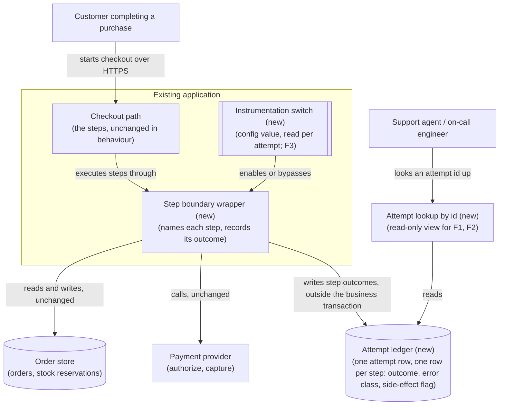
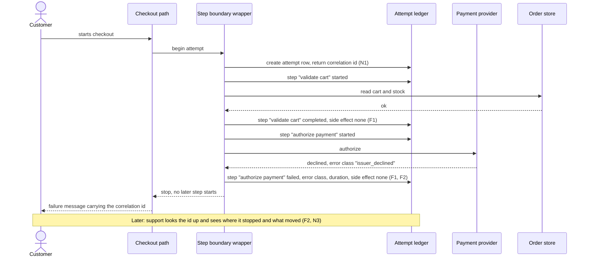
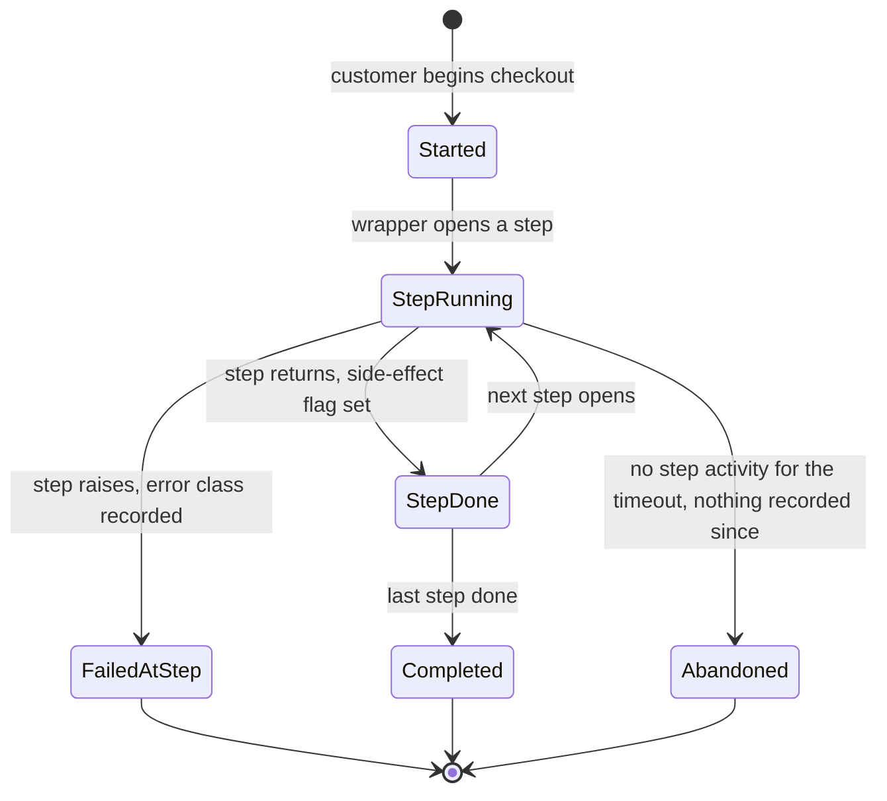

# RFC: Finding out why checkout fails, before changing its shape

**Status:** proposed (three blocking questions open, listed in Context and repeated in the Decision)
**Decider:** the engineer or lead who owns checkout · **Reviewers:** on-call rotation for checkout, the role that owns payment reconciliation, the requester of this RFC
**Current working focus:** decision

> A note on how this document treats its input. The request arrived as five requirements: use the saga
> pattern, split checkout into microservices, add Redis caching, use gRPC between the services, and
> introduce a feature flag system. None of the five is a requirement. Each is a design choice, a way of
> meeting a requirement, and each is evaluated as an option in section "Alternatives analysis" rather
> than assumed in the Design. The two facts in the request that are not solutions — checkout fails in
> about 2% of attempts, and when it fails nobody can tell which step broke — are the whole basis of the
> requirements below. The reclassification table is at the top of the Requirements section.

## Reversibility

This RFC decides a **two-way door**, deliberately, in order not to walk through four one-way doors
without evidence.

The decision taken here is to instrument the existing checkout path so that every attempt records what
each step did and how it ended. That is reversible: the instrumentation is additive, it is behind a
switch (F3), and removing it costs a revert.

Four of the five requested items are one-way doors or lead to one, which is why they are not taken
today:

- **Splitting checkout into separate services** fixes service boundaries. Boundaries drawn in the wrong
  place are paid for in every later change, and moving them back means re-merging deployables, data and
  ownership.
- **A saga** fixes the consistency model: local transactions plus compensations, with no global
  rollback. Once callers, data and operations depend on eventually-consistent repair, going back to a
  single transaction is a rewrite.
- **gRPC between the services** fixes an inter-service contract and its toolchain. Contracts other
  teams' clients depend on are expensive to change.
- **A feature flag platform** adds a dependency in the request path of the most business-critical flow
  the company has. Removing such a dependency later means touching every call site.

The order matters more than the individual sizing. All four are answers to the question "what shape
should checkout have?", and that question cannot be answered while the failure taxonomy is unknown. So
this document decides the reversible thing that produces the evidence, and names the gate at which the
irreversible ones are decided in their own RFC.

## Context

What the requester told us is short, and it is worth stating exactly, because everything below rests on
it: checkout fails in roughly 2% of attempts, and when it fails the team cannot tell which step of
checkout broke.

Both statements carry labels. The 2% is *assumed*: it came from the requester with no board, query or
date attached, and this RFC does not upgrade it (a query counting checkout attempts by terminal outcome
over the last 30 days would confirm or replace it; blocking question Q2). The second statement is a
description of the team's own tooling, so it is *measured* in the weak sense that the people who work
the incidents report it, and it is the more actionable of the two: a failure rate you cannot decompose
is a failure rate you cannot fix, because every candidate fix is a guess about which step is failing.

No codebase, schema, dashboard or ticket was available while writing this document. That is unusual and
it is a real weakness of what follows: the method this RFC uses expects the numbers in Context to be
looked up rather than asked for. Everything that would normally be first-hand is therefore labelled
*assumed* with the lookup that would settle it. The three cheapest lookups are the blocking questions.

### Current usage

| Role (what they do with the system) | What they do today | Through what | How often or how much (source) |
| --- | --- | --- | --- |
| Customer completing a purchase | Fills a cart, enters payment details, expects an order confirmation | The checkout flow in the storefront client | About 2% of attempts end in failure (requester, no source; *assumed* — a query over checkout attempts by terminal outcome for 30 days would confirm it) |
| On-call engineer answering "checkout is broken" | Reads application logs and the payment provider's dashboard, tries to reproduce the failure | Log search, provider dashboard | Frequency and time-to-diagnosis are not recorded anywhere (*assumed*: nobody has checked; the incident channel history for one quarter would give both) |
| Support agent handling "I was charged and got no order" | Looks the customer up, checks with payment, refunds or creates the order by hand | Admin tooling and the payment provider's console | Volume unknown (*assumed*: a count of support contacts tagged for checkout would give it) |
| Whoever reconciles payments against orders | Compares captured payments with created orders, chases the differences | Finance reporting | Unknown whether differences occur at all (*assumed*: this is blocking question Q1) |
| Release engineer shipping a change to checkout | Deploys and watches error rates | The deployment pipeline | Deploy frequency unknown (*assumed*) |

**The problem.** Two gaps, and only the second one is understood well enough to act on today.

The first gap is the failure rate itself: about 1 in 50 customers who start checkout does not finish,
for a reason inside the system. Nobody in this document can say what that costs, because the value of a
checkout and the volume of attempts are both unknown (*assumed*; blocking question Q2 supplies both).

The second gap is diagnostic, and it is the reason the first one has stayed open: a failed checkout
leaves no record that says which step it failed at. So the failure rate cannot be decomposed into
causes, the causes cannot be ranked by frequency, and any structural change made now is aimed at a
target nobody has seen. A redesign chosen under those conditions can plausibly leave the 2% exactly
where it is, having spent a quarter.

### Goals

| Goal | Who benefits | How we will know |
| --- | --- | --- |
| G1. Customers who start checkout end up with the purchase they intended, or are told the reason it did not go through | Customers; whoever owns purchase revenue | The share of checkout attempts ending in failure, once it is being counted at all |
| G2. Whoever is on call can explain a failed checkout without reproducing it and without asking the customer | On-call engineers; support agents | Time from a failure being raised to the failing step being named |
| G3. A customer who fails part-way through checkout ends in a state someone can account for, rather than money moved without goods or goods reserved without money | Customers; whoever reconciles payments against orders | Count of attempts whose per-step outcomes do not reconcile, once those outcomes are recorded |

G3 is the goal the requested saga pattern serves. It is stated here as a goal rather than dropped,
because it is a real outcome for a real role — but note that nobody has yet shown the problem exists.
Whether inconsistent checkout outcomes actually occur is blocking question Q1, and the answer changes
which options in section "Alternatives analysis" are worth anything.

### Stakeholders

| Role (what they do with the system) | What they need from this decision | Who speaks for them |
| --- | --- | --- |
| Customer completing a purchase | That the fix does not make checkout worse or slower while it is being investigated | The role that owns purchase conversion |
| On-call engineer diagnosing checkout | For a failed attempt id to be enough to name the failing step and its error | The on-call rotation for checkout |
| Support agent handling a charged-but-no-order contact | To see what actually happened to the money and the stock for one customer's attempt | Support lead |
| Whoever reconciles payments against orders | A record they can join against payments, per attempt | Finance systems owner |
| Release engineer shipping checkout changes | A way to take a change out of the checkout path without waiting for a deploy | The engineer who owns checkout |
| The requester of this RFC | The refactor they asked for, or a stated reason it is not being done yet | Themselves; this document is the reason |
| Negative stakeholder: whoever maintains checkout after this | Not to inherit more moving parts than the evidence justifies | The engineer who owns checkout |

The requester is listed as a stakeholder on purpose. This document declines four of their five items for
now, and section "Stakeholder conflicts" records that as a conflict rather than hiding it in the design.

### Constraints

| Constraint | Source (outside the organization, or a signed commitment) | What it excludes, and the clause |
| --- | --- | --- |
| None identified | — | Nothing in this analysis is excluded by an external constraint |

Nothing in the request came from outside the organization: no regulation, contract, budget line or
regulator's date was cited, so the constraints table is empty rather than padded. One candidate is
pending: if checkout handles cardholder data inside the application rather than delegating it to the
payment provider, then the payment-card security standard governs what the per-step records in the
Design may contain, and a row appears here. That is blocking question Q3.

### Prior decisions

| Prior decision | Who made it, when | Incumbent it implies | Cost to reverse |
| --- | --- | --- | --- |
| Checkout is implemented as one synchronous request path inside the existing application | Unknown author, before this RFC (*assumed*: the request to "split into microservices" only makes sense against a non-split incumbent; reading the checkout entry point would confirm it) | The existing in-process checkout path | High: splitting it is the change items 2 and 4 of the request propose, and its cost is the subject of the deferred RFC |
| The payment provider currently integrated | Unknown author, before this RFC (*assumed*) | The current provider's API and its failure modes | High, and out of scope here |
| The five items in the request | The requester, at the time of the request | The saga, the service split, Redis, gRPC and a flag platform | Low today: none is built yet, which is exactly why this is the cheap moment to challenge them |

The last row is the honest place for the request itself. The method this document follows says to push
back once with evidence and an alternative, and to record the outcome: if the requester reaffirms an
item, that item becomes a prior decision authored by the requester and the document says so, and its
incumbent stays in the tradeoff table. This RFC pushes back below and could not collect the answer, so
each of the five appears as an option evaluated on its merits, and the reply accompanying this document
asks the question.

### Assumptions and open questions

**Blocking.** The status stays *proposed* while any of these is open. Each one changes the decision, not
merely its wording.

| Question | Owner | Date | If yes | If no |
| --- | --- | --- | --- | --- |
| Q1. Do failed checkouts leave inconsistent outcomes today — money captured with no order, or stock reserved with no payment? Establish it by sampling: take the last 50 failed attempts, and for each check the payment provider and the order store by hand | The engineer who owns checkout, with the support lead | Before phase 0 ends | G3 is a live goal, the outcome ledger in the Design is the mechanism that surfaces it, and the compensation options in the tradeoff table stay on the table for the deferred RFC | G3 drops to a watch item, and the saga option loses the only requirement it answers |
| Q2. What are the checkout attempt volume, the terminal-outcome breakdown, and the value of a completed checkout? Establish it by one query over the last 30 days plus one figure from finance | The engineer who owns checkout | Before phase 0 ends | The 2% becomes *measured*, the cost of the failures becomes stateable, and the effort budget for the deferred RFC can be justified against it | The 2% stays *assumed*, and phase 0's first output is this number rather than the taxonomy |
| Q3. Does checkout handle cardholder data inside the application, rather than delegating entry and storage to the payment provider? Establish it by reading the payment step's request construction | The engineer who owns checkout | Before the ledger schema is written | The payment-card standard governs the per-step records: payloads are excluded from them, only outcome codes are stored, and a constraint row is added | Per-step records may carry request and response payloads with secrets redacted, which makes diagnosis materially easier |

**Non-blocking.**

- The step sequence used in the Design's diagrams is *assumed*, drawn from a generic purchase flow. The
  real sequence comes out of phase 0's first task, and the diagrams are redrawn from it. Nothing in the
  decision depends on the specific list; it depends on there being one.
- That the ~2% failures are concentrated in a small number of steps rather than spread evenly is
  *assumed*. It is the usual shape, and it is what makes the phased approach worthwhile. If the failures
  turn out to be spread evenly across every step, the deferred RFC's option set changes and this
  document should be revisited.
- That no distributed tracing or step-level metrics already exist in this system is *assumed*, taken
  from the requester's statement that the failing step cannot be identified. If an APM agent is already
  deployed, the buy option in the tradeoff table gets substantially cheaper and may win.
- That checkout latency is acceptable today is *assumed*, from the absence of any complaint about it in
  the request. This is what removes the caching option's only possible requirement; a p95 measurement of
  the checkout endpoint would confirm or overturn it.

### Out of scope

Problems this document does not try to solve:

- Customer-side abandonment: someone changing their mind, or leaving because of price or delivery
  options. This RFC is about attempts that fail for a reason inside the system.
- Payment provider outages as such. They will appear in the taxonomy as a cause; deciding whether to add
  a second provider is a separate decision with its own evidence.
- Checkout latency and throughput, because no evidence of a problem with either was offered. It returns
  the moment a measurement says otherwise.

No option is listed here. Options are rejected in the tradeoff table or not at all.

## Requirements

### What was reclassified, and why

| Item as given | Bucket it actually belongs to | Where it went |
| --- | --- | --- |
| "Use the saga pattern" | Design choice: a coordination pattern, that is, a means of meeting a requirement | An option in the tradeoff table, under dimension [Consistency]. The requirement it would serve is G3, whose existence is blocking question Q1 |
| "Split into microservices" | Design choice: a topology | An option in the tradeoff table, under dimension [Topology] |
| "Add Redis caching" | Design choice: a technology. It answers no requirement in this document, because no latency or load problem was reported | An option in the tradeoff table, under dimension [Caching], where it is rejected for want of a requirement rather than on its merits |
| "Use gRPC between services" | Design choice: a transport and contract format, and one that only exists if the split happens | An option in the tradeoff table, under dimension [Transport], dependent on the topology row |
| "Introduce a feature flag system" | Design choice, and part of it is a delivery practice rather than a system quality. Underneath it there is a real capability: taking a change out of the checkout path without a deploy | The capability became requirement F3. The platform-sized version of it is an option in the tradeoff table, under dimension [Rollout], beside a configuration kill switch |
| "Checkout fails about 2% of the time" | A measurement of the current state (unsourced, so *assumed*) | Context, and the derivation of N2's guardrail |
| "When it fails we don't know which step broke" | The problem statement | Context, and the source of goals G1 and G2 and of every requirement below |

Two requirements below were added by the architect rather than requested, and each names the role it
serves so the addition can be argued with: **F2** serves the support agent and the reconciliation role,
and **N2** serves the customer, who must not be made worse off by an investigation. The requester's
preference for building the refactor now is recorded as a stakeholder conflict in the Decision.

The requirements are only the architecturally-relevant ones: what a step record must contain shapes the
data model and is expensive to change afterwards, and the guardrail governs whether the change may ship
at all.

### Functional

| ID | Goal | Requirement (the role, and what the system does for it) | Proof (the scenario, and how it is run) | Source |
| --- | --- | --- | --- | --- |
| F1 | G2 | An on-call engineer, given only a checkout attempt id, sees the ordered list of steps that attempt executed, and for the step that failed its error class, its timestamp and its duration | Given a checkout attempt that failed at the payment step, when the on-call engineer looks the attempt id up, then they see the steps before it marked completed, the payment step marked failed with its error class and duration, and no later step started. Run as an end-to-end test that injects a failure at each step in turn and asserts the record, plus the drill in N1 | The requester's statement that the failing step cannot be identified today |
| F2 | G3 | A support agent or the reconciliation role, given a checkout attempt id, sees for each step whether its side effect happened: payment authorized, payment captured, stock reserved, order created | Given an attempt that failed after payment was captured but before the order was created, when the support agent looks the attempt id up, then the record shows payment captured and order not created. Run as the same fault-injection suite as F1, asserting the side-effect flags | Added by the architect for the support agent and the reconciliation role; its premise is blocking question Q1 |
| F3 | G1 | A release engineer returns checkout to its pre-change behaviour without deploying, by changing one setting | Given the instrumented checkout path in production, when the release engineer sets the checkout instrumentation switch to off, then within one minute new attempts run the pre-change path and no attempt fails because of the change. Run as a staging drill, then exercised once in production during phase 1 | The residue of the requester's fifth item, sized to what N2 needs |

### Non-functional

| ID | Goal | Requirement (metric, target, condition) | Derived from | Proof (measurement) | Source |
| --- | --- | --- | --- | --- | --- |
| N1 | G2 | Step attribution coverage: for at least 99% of checkout attempts that end in failure, the persisted record names the step that failed and its error class, measured over a rolling 7 days in production | Today the coverage is effectively zero: the requester reports the failing step cannot be identified (*assumed*, from the request; sampling 20 recent failures would put a number on it). 99% rather than 100% because a process killed between the attempt's start and its first step write leaves nothing to attribute, and that residue is what the 1% pays for | One query over the attempt records, on a weekly schedule, counting failed attempts with a non-null failing step over all failed attempts | The problem statement in Context |
| N2 | G1 | Guardrail: after the instrumented path is enabled, the checkout failure rate is no higher than the phase-0 baseline, and p95 of the checkout flow rises by no more than 30 ms | The baseline is the ~2% the requester reports, which phase 0 replaces with a measured value (blocking question Q2). The 30 ms is *assumed*: it is the on-call rotation's tolerance rather than a derived figure, and phase 0 measures the current p95 first so the number can be re-set against it | The same dashboard that carries the phase-0 baseline, compared for the two weeks after enabling; F3's switch is the response if either figure moves | Added by the architect for the customer role |
| N3 | G2 | Diagnosis time: an on-call engineer names the failing step for at least 9 of 10 recorded failures within 15 minutes each, from the attempt id alone | There is no current value to derive from: the step is not identifiable at all today, so the target is a commitment by the on-call rotation rather than a delta, and it is labelled *assumed*. It is measured first, in the drill, before it is treated as met | A drill: 10 failed attempts drawn from the previous week are handed to an engineer who did not instrument the flow, and the time to name each failing step is recorded | G2, and the on-call role in the stakeholder table |
| N4 | G2 | Retention: attempt records, including the per-step outcomes, are queryable for 90 days | A failure mode occurring in 1 attempt per 10,000 needs on the order of 100,000 attempts in the window to appear about 10 times and be recognisable as a pattern rather than a one-off. Whether 90 days delivers 100,000 attempts depends on checkout volume, which is unknown (*estimated* from an assumed rate; blocking question Q2 supplies the volume and the window is then re-derived) | A query for the oldest retrievable attempt record, checked monthly against the 90-day floor | The taxonomy the deferred RFC depends on |

## Design

The Design solves F1, F2, F3 and N1 to N4, and nothing else. It adds no service, no transport and no
cache, because no requirement here calls for one.

**One dimension is being decided: where the record of a checkout attempt lives, and what it contains.**
Everything else in this section follows from that.

**The checkout attempt becomes a first-class, persisted thing.** Today (as far as the *assumed* prior
decision above says) a checkout is a request that either returns success or does not. In the target
state, an attempt is a row created when the customer starts checkout and updated as each step
completes, with a child row per step recording the step name, its start and end time, its outcome, its
error class on failure, and a flag for whether its side effect happened. That last part is what
separates this from ordinary logging and is what F2 needs: logs say what the code thought; the
side-effect flags say what the world outside the process now contains.

**Step boundaries are declared in one place.** The checkout path is wrapped so that each step announces
its name on entry and its outcome on exit, in a single mechanism rather than sprinkled per step. This is
what makes N1's 99% achievable: coverage is a property of the wrapper, not of each developer remembering
to log.

**The record is written outside the customer's transaction.** A step record that is rolled back with the
failing step is worthless, which is the trap the obvious implementation falls into. Step records are
committed independently of the business transaction they describe, so a rolled-back step still leaves
its failure recorded. Where a record is not needed before the next step runs, it is written
asynchronously, which is how N2's latency ceiling is protected: the wrapper's cost to the customer's
request is one enqueue rather than one commit.

**One correlation id spans the attempt**, returned to the client and shown to the customer in the error
message, so a support contact starts from an id rather than a description of the screen. That is what
makes F2 usable by a support agent instead of only by an engineer.

**The switch of F3 is a configuration value read per attempt**, not a build flag and not a platform
client. It has one job: disable the instrumented path. Sizing it that way is a decision, and the
platform-sized alternative is row [Rollout] in the tradeoff table.

Both remaining unknowns are visible in this design: the step list comes from phase 0, and what a step
record may contain comes from blocking question Q3.

### Static view

*Figure 1. C4 container diagram of the target state, with the four new elements marked "new". Answers
F1, F2, F3, N1, N4.*

### Dynamic view

*Figure 2. Sequence diagram, container level, for one attempt failing at the payment step. The step
names are assumed and come from phase 0's first task; the shape does not depend on them. Answers F1,
F2, N1, N3.*

### Data view: the attempt lifecycle

The decision turns on this lifecycle, because it is what a reader has to be able to query later.

*Figure 3. State diagram of one checkout attempt. `FailedAtStep` is the state that does not exist today
and is the whole point of the change; `Abandoned` is the residue that N1's 99% target allows for.
Answers F1, N1, N4.*

## Alternatives analysis (Tradeoff)

### Decision drivers

1. **N1 and F1** — the failing step must become knowable. Everything else is subordinate, because
   nothing else can be evaluated without it. This is effectively a veto criterion.
2. **N2** — the investigation must not make checkout worse. Checkout is the revenue path; a diagnostic
   change that raises the failure rate is a self-inflicted incident.
3. **Reversibility**, as sized in section "Reversibility": while the taxonomy is unknown, options that
   close one-way doors are penalised, and the penalty is not a matter of taste but of the cost of being
   wrong about a boundary nobody has evidence for.
4. **Requirement coverage per unit of effort**, in a team whose size is unknown (*assumed* small, since
   one person is asking for a five-part refactor). An option that answers no requirement in this
   document scores zero on this driver regardless of its merits elsewhere.
5. **Operational surface added**: every new deployable, protocol and store is something the on-call
   rotation carries afterwards.

Note what is not a driver. "The requester asked for it" is not a driver; it is the prior decision in the
last row of the prior-decisions table, and it appears as a cost or a pro inside the rows below.

### What every option shares

Every option below leaves the checkout steps' business behaviour unchanged: none of them changes what
checkout does, only how it is arranged, observed or coordinated. That shared element is deliberate and
is a consequence of driver 1 — you cannot compare a fix against a baseline whose behaviour you also
changed — and it means no option in this table can, on its own, be the thing that fixes the 2%. Fixing
the 2% is the deferred RFC's job, and it is why "do nothing structural yet" is a coherent position
rather than an evasion.

Every option also shares the current payment provider and the current order store, both *assumed* prior
decisions whose reversal is out of proportion to this decision. They are recorded here rather than
given rows.

The one prior decision that does get rows is the in-process checkout path. It is the incumbent in the
baseline row and in the two [Diagnosis] rows, all three of which keep it, and the [Topology] row is the
alternative beside it. Its reversal cost — the split itself — is therefore priced inside that row rather
than assumed away.

One option nobody proposed is added, [Diagnosis] hosted APM, because "buy the observability rather than
build it" is the standard alternative to the recommendation and it deserves to be beaten rather than
ignored. A second, [Consistency] idempotency plus a reconciliation job, is added because it is the
cheapest thing that would address G3 and it is the honest competitor to the saga.

| Alternative | Requirements (met / partial / missed, by ID) | Pros | Cons | Risk | Impact | Probability | Mitigation | Contingency |
| --- | --- | --- | --- | --- | --- | --- | --- | --- |
| **[Diagnosis] Step boundary wrapper plus a persisted attempt ledger** (the Design above) | met: F1, F2, F3, N1, N3, N4; partial: N2 (it adds writes to the checkout path, so the guardrail is real work rather than a formality) | The only option that answers F2, because side-effect flags are business facts an agent-based tool does not know about; records survive the rollback of the step they describe; produces exactly the taxonomy the deferred RFC needs; reversible via F3 | Real code in the highest-risk path in the system; a schema and its retention to own; slower to first insight than switching an agent on | The added writes raise checkout latency or, worse, its failure rate | High: it is the revenue path | Medium: writes outside the business transaction are a well-understood pattern, but this path is not understood yet | Write asynchronously where the record is not needed for the next step; N2 measured for two weeks; F3's switch as the response | Turn the switch off, move the writes fully off the request path, re-enable |
| | | | | The wrapper misses steps that were never identified as steps, so N1's coverage sits well below 99% | Medium: partial taxonomy, and a false sense of coverage | Medium: phase 0's step enumeration is the only defence, and it is done by hand | Enumerate steps from the code before wrapping; fault-injection test per step; the N1 query is the check that catches the gap | Add the missing steps; the ledger's shape does not change |
| **[Diagnosis] Hosted APM with distributed tracing, no ledger** (nobody proposed this) | met: F1, N3; partial: N1 (traces are sampled and retained for weeks, not the 90 days N4 asks for), N4 (retention is a pricing tier); missed: F2 | Fastest to first insight: an agent and a deploy; no schema to own; brings latency and dependency views for free; may already be in use, which would make it nearly free (*assumed* not to be, see Context) | Cannot answer F2: an agent sees a call, not whether money moved; sampling means the rare failure is the one you lose; per-attempt retention becomes a cost line | Sampling drops exactly the rare failures the taxonomy needs | High: the long tail is where the unknown causes are | Medium to high: tail-based sampling helps but is not free | Configure sampling to keep all errored traces | Combine: the agent for latency, the ledger for outcomes, which is the recommendation plus a cost |
| **[Topology] Split checkout into separate services** | met: none in this document; missed: F1, F2, N1, N3 (a split does not by itself record anything) | Independent scaling and deployment per step; forces explicit step boundaries as a side effect; the step boundary becomes a network call and so is harder to leave unrecorded | Turns in-process calls into network calls, which adds new failure modes to a flow whose existing failure modes are still unknown; boundaries drawn without the taxonomy are drawn blind; needs an inter-service contract, deployment, and on-call surface per service | Boundaries are drawn in the wrong place, and the taxonomy later shows the failures cluster inside one of them | High: re-drawing boundaries is the expensive change this document exists to defer | Medium to high: no evidence exists today on which to draw them | None available before the taxonomy exists; that is the point of the deferral | Decide it in the deferred RFC, against phase 0's evidence |
| | | | | The failure rate rises, because network calls fail in ways in-process calls do not | High: it is the revenue path | Medium: retries and timeouts are solvable, but they are new work in the riskiest place | Idempotency per step before any split; the split behind F3-style switching | Roll back to the in-process path |
| **[Consistency] Saga with orchestrated compensations** | met: none in this document; partial: F2 (a saga log records step outcomes, though for its own coordination rather than for a support agent); missed: F1, N1, N3 | The correct answer to G3 if the split happens and if Q1 says inconsistent outcomes occur; explicit compensations turn a silent inconsistency into a modelled one | Only meaningful once there is more than one transactional boundary, so it presupposes the split; replaces atomic rollback with eventual repair, and every caller then lives with intermediate states; a compensation is code that runs on the worst day and is therefore the least-tested code you own | Built for a problem that does not exist: Q1 comes back "no inconsistent outcomes found" | Medium: a quarter of work carrying permanent complexity | Medium: the requester offered no evidence of inconsistency, and the failures may all be pre-payment | Answer Q1 by sampling 50 failures before committing | Drop it; the idempotency row below covers the residual case |
| | | | | Compensations themselves fail, leaving a state that is neither the original nor the compensated one | High: the case G3 exists to prevent | Medium: this is the standard failure mode of compensation logic | A reconciliation job as the backstop, whichever coordination pattern wins | Manual repair with the ledger as the source of truth |
| **[Consistency] Idempotency keys per step plus a nightly reconciliation job** (nobody proposed this) | met: none in this document; partial: F2 (reconciliation finds the mismatches the ledger records) | The smallest thing that addresses G3: safe retries and a job that finds money-without-order; no coordination framework, no new deployable; useful whether or not the split ever happens; strictly less code than compensations | Repairs after the fact rather than preventing, so a customer can be briefly inconsistent; needs an idempotency key discipline at every external call | The reconciliation job's own definition of "mismatch" is wrong, so it reports noise or hides real cases | Medium | Medium: the definition depends on the ledger's side-effect flags, which are new | Build it on the ledger's flags, and validate it against the 50 attempts sampled for Q1 | Tighten the definition; the ledger keeps the raw facts either way |
| **[Transport] gRPC between the services** | met: none; missed: all. It presupposes the [Topology] row | Efficient binary transport; generated clients; a schema that is checked at build time rather than hoped for | Only exists if the split happens; adds a toolchain, a code-generation step and a proxy story for browser clients; a published contract other clients depend on is a one-way door | Adopted along with a split that is later reversed, leaving the toolchain behind | Low to medium: mostly wasted effort rather than damage | Medium, conditional on the split happening at all | Decide it inside the deferred RFC, beside plain HTTP with a schema, not before | Not applicable; nothing is built |
| **[Caching] Redis in front of checkout reads** | met: none; missed: none, because there is no requirement to miss. It answers no requirement in this document | Would reduce read load and latency if either were a problem; a cache is well-understood work | No latency or load problem was reported or measured, so this is a fix in search of a fault; adds a store to operate, and a stale-cache class of bug to a flow where correctness is money; caching in a flow that must not serve stale prices or stale stock is precisely the wrong place to start | Cached stock or price is served stale, and a customer buys something unavailable or at the wrong price | High: it creates new checkout failures, working against G1 | Medium: invalidation in a multi-step flow with external side effects is genuinely hard | None worth taking, since there is no requirement on the other side of the trade | Revisit if a p95 measurement of the checkout flow shows a latency problem, with the measurement as the requirement's derivation |
| **[Rollout] Feature flag platform** | met: F3; partial: none | Percentage rollouts, targeting, an audit trail of who turned what on; useful across the whole organization rather than this flow only | A third-party dependency evaluated in the request path of checkout; an outage or a slow flag evaluation becomes a checkout outage; procurement and integration effort for one switch today | The flag service becomes a dependency of the revenue path | High: an outage in it is an outage in checkout | Low to medium: clients cache flags locally, which limits but does not remove the exposure | Local cache with a safe default; the switch's default must be the pre-change behaviour | Fall back to the configuration switch below |
| **[Rollout] One configuration kill switch** (the Design above) | met: F3 | No new dependency; effect within one minute; the only capability N2 actually needs today | No percentage rollout, no targeting, no audit trail; a second switch means a second setting, which does not scale past a handful | Switches accumulate and nobody removes them | Low | Medium: this is the normal fate of flags of every kind | One switch, named in this document, removed when the deferred RFC closes | Adopt the platform then, with the flags it would manage actually enumerated |
| **Baseline: do nothing** | met: none; missed: F1, F2, F3, N1, N3, N4 | Zero effort, zero risk to the checkout path today, and it is genuinely the right answer if the 2% turns out to be customer abandonment rather than system failure | The ~2% stays, unexplained; each new failure costs another manual investigation with no residue; the structural refactor, if it ever happens, is decided on no evidence | The rate drifts upward and nobody notices, because there is nothing counting | High: it is the revenue path | Medium: nothing today would surface a drift | None available without the counting this RFC proposes | None |

Every option in the table is stated at its best, including the four this document declines. The Redis
row is the only one rejected outright, and it is rejected for having no requirement rather than for
being a bad piece of technology: if a measurement produces a latency requirement, the row is re-run with
that requirement in it and may well win.

## The decision

**Instrument the existing checkout path: a step boundary wrapper, a persisted attempt ledger with
per-step outcomes and side-effect flags, one configuration kill switch, and a 90-day retention window.
Do not split checkout, do not build a saga, do not add gRPC, do not add caching, and do not adopt a
flag platform today.** Phase 0 produces the failure taxonomy; the structural decision is then made in
its own RFC against that taxonomy, at the gate defined in Confirmation below.

The drivers decided it. Driver 1 is a veto and only two options clear it, the ledger and the hosted APM;
of those, only the ledger answers F2, and the APM's sampling loses exactly the rare failures the
taxonomy is being built to find. Driver 3 rules out taking four one-way doors while the taxonomy that
would justify them does not exist. Driver 4 removes the caching row, which answers no requirement here
at all.

To state the counter-case plainly, since a table where every cell favours the recommendation would be a
warning sign: if the taxonomy comes back showing the failures concentrated in one step whose fix is
obviously a service boundary, then this RFC will have cost four to six weeks that a bolder decision
would have saved. That is the bet, and it is taken because the alternative bet — that a five-part
refactor chosen blind lands on the right four to six weeks — has the worse expected value and a far
worse downside.

**Decision style: autocratic.** The engineer or lead who owns checkout owns the call, after consulting
the on-call rotation (F1, N3), the support lead (F2) and the requester (the four declined items).
Recorded here so the basis is visible.

### Stakeholder conflicts

- **The requester asked for all five items and gets one of them, reduced.** Overridden by driver 1 (no
  fix is evaluable before the failing step is knowable) and driver 3 (four of the five close doors that
  the current evidence cannot justify). The four are not rejected forever: each has a row in the
  tradeoff table, and each returns in the deferred RFC with the taxonomy as its evidence. If the
  requester reaffirms any item after reading this, it becomes a prior decision authored by them, this
  document records it as such, and the tradeoff row for that item is re-run with the requester's reason
  in it.
- **The support lead's F2 is an architect's addition** and it carries the largest single piece of work
  in the design, the side-effect flags. If the checkout owner judges the effort not worth it before Q1
  is answered, the honest sequence is to answer Q1 first: a sample of 50 failures costs a day and
  decides whether F2 has a problem behind it.

### Consequences

- The team gains a queryable record of what checkout does, which is the input to every checkout decision
  after this one, and gains a schema, a retention policy and a weekly coverage query to maintain.
- The highest-risk path in the system is being touched for a diagnostic reason, which is why N2 is a
  requirement and not a note, and why F3's switch exists.
- The refactor is delayed by the length of phase 0, and the decision about it is deferred to a document
  that does not exist yet. If that RFC is never written, this decision degrades into "we added logging
  and stopped", and the review date below is the guard against exactly that.
- Support gains a correlation id to work from, and the error message shown to customers changes to carry
  it.
- Four technologies the requester expected are not adopted, and someone will have to explain that to
  whoever heard the plan first. This document is that explanation.

### Residual risks

- The 2% remains unfixed for the length of phase 0. Nothing here reduces it; this decision buys the
  ability to aim.
- The taxonomy may be uninformative: if failures are spread thinly across every step with no cluster,
  the deferred RFC starts from a harder position than assumed, and the second non-blocking assumption
  in Context is where that possibility is recorded.
- N1's 99% is a target set against a current value of *assumed* zero. If real coverage after phase 0
  lands at, say, 80% because steps exist that nobody enumerated, the gap is itself a finding, but it
  weakens every conclusion drawn from the taxonomy in proportion.
- Q3's answer may force the per-step records down to outcome codes with no payloads, which makes some
  diagnosis harder than this document implies.

### Confirmation

- **The gate.** Six weeks after the instrumented path is enabled in production, the failing-step
  distribution over the preceding four weeks is written up, and the structural RFC is opened against it.
  The gate's pass criterion, stated now rather than after the fact: at least 90% of failed attempts
  attributed to a named step (that is N1, measured), and the top three steps by failure count
  identified. If the criterion is not met, the taxonomy is not yet usable and the deferred decision
  waits rather than proceeding on a partial picture.
- **The fitness function.** The N1 coverage query runs weekly and is treated as a defect when it falls
  below 99% over a rolling 7 days.
- **The guardrail.** The N2 comparison runs for the two weeks after enabling. Either figure moving means
  the F3 switch goes off, and re-enabling requires a stated cause.
- **Measured first, because they were assumed.** N2's 30 ms tolerance and its baseline failure rate,
  N3's 15 minutes (established by the drill before it is treated as met), and N4's 90 days
  (re-derived once Q2 gives the attempt volume).
- **Review date.** At the gate, six weeks after enabling. Revisit earlier if Q1 shows inconsistent
  outcomes are occurring now, since that promotes G3 from a goal with an unverified premise to an active
  problem.
- **Status stays *proposed*** until Q1, Q2 and Q3 are answered. Q2 in particular: recommending work
  against a failure rate nobody has counted is not deciding, it is agreeing.

## Launch strategy

Three phases, each with an end condition, so the migration cannot become permanent.

**Phase 0, before any code (about one week).** Answer Q1, Q2 and Q3. Enumerate the real checkout steps
by reading the checkout entry point, and redraw figures 1 to 3 from the actual list. Measure today's
checkout failure rate, p95 and attempt volume, which fixes N2's baseline and N4's window. Ends when the
three questions are answered and the step list is written down.

**Phase 1, the instrumented path (about three weeks).** The ledger schema, the step boundary wrapper,
the fault-injection suite for F1 and F2, the attempt lookup, and the F3 switch. Enable behind the
switch, exercise the switch once in production, run the N3 drill. Ends when N1 clears 99% over a rolling
7 days and N2 shows no movement over two weeks.

**Phase 2, the gate (one week).** The failing-step distribution over four weeks of data, written up
against the gate's pass criterion, and the structural RFC opened against it. That RFC re-runs the
[Topology], [Consistency], [Transport] and [Rollout] rows of this document's tradeoff table with
evidence in them. Ends when it is opened.

Retirement: the F3 switch is removed when the structural RFC closes, so it does not join the pile of
flags the [Rollout] row's risk describes.

## Tasks and roadmap

| Task | Description | Estimate |
| --- | --- | --- |
| Phase 0: answer Q1 | Sample the last 50 failed attempts; check payment provider and order store by hand; record whether inconsistent outcomes occur | 1d |
| Phase 0: answer Q2 | Query attempt volume and terminal outcomes for 30 days; get the value of a completed checkout from finance | 0.5d |
| Phase 0: answer Q3 | Read the payment step's request construction; determine cardholder-data scope; add the constraint row if it applies | 0.5d |
| Phase 0: enumerate the steps | Read the checkout entry point; write down the real step list; redraw figures 1 to 3 | 1d |
| Attempt ledger schema and retention | Attempt table, step table, side-effect flags, 90-day retention, indexes for lookup by attempt id and by failing step | 2d |
| Step boundary wrapper | One mechanism that names each step and records its outcome, committing outside the business transaction | 4d |
| Correlation id end to end | Generated per attempt, returned to the client, surfaced in the customer-facing error message | 2d |
| Fault-injection suite | Inject a failure at each step in turn; assert the record shape required by F1 and F2 | 3d |
| Attempt lookup | Read-only view by attempt id for support and on-call | 2d |
| F3 configuration switch | Per-attempt config read, pre-change behaviour as the default, staging drill and one production exercise | 1d |
| N1 coverage query and N2 comparison | Weekly coverage query wired to alert below 99%; the two-week guardrail comparison | 1d |
| N3 drill | 10 failures from the previous week, an engineer who did not build the instrumentation, times recorded | 0.5d |
| Ledger runbook | How to read an attempt, what each error class means, how to use the F3 switch. Produced by this decision, kept with the service | 1d |
| Phase 2: the taxonomy write-up and the structural RFC | Failing-step distribution over four weeks against the gate criterion; the follow-on RFC opened | 3d |

The idempotency keys and the reconciliation job from the [Consistency] row are not in this list. They
belong to the deferred RFC, and they enter it only if Q1 says inconsistent outcomes occur.

## Glossary

| Term | Meaning |
| --- | --- |
| Checkout attempt | One customer's single pass through checkout, from starting it to a terminal outcome. The unit everything in this document is counted and recorded per |
| Step | One named unit of work inside a checkout attempt, for example authorizing payment. The real list comes from phase 0 |
| Attempt ledger | The persisted record introduced by this decision: one row per attempt, one row per step |
| Side-effect flag | The field on a step record saying whether the step's effect on the outside world happened: money moved, stock reserved, order created |
| Failing step | The step whose failure ended an attempt. The thing that cannot be named today, and the object of N1 |
| Failure taxonomy | The distribution of failed attempts across failing steps and error classes, produced by phase 0 and phase 1 and consumed by the deferred structural RFC |
| Step boundary wrapper | The single mechanism through which every step announces its name and its outcome |
| Instrumentation switch | The configuration value of F3 that returns checkout to its pre-change behaviour without a deploy |
| Saga | A coordination pattern in which a multi-step operation is a sequence of local transactions, each with a compensating action, instead of one atomic transaction. Evaluated as an option, not adopted |
| Gate | The point six weeks after enabling at which the taxonomy is judged usable and the structural RFC is opened |

## Sources

This section is where the provenance of the facts above would sit. It is nearly empty, and that is the
most important thing this document reports about itself.

- The requester's statement of the problem, at the time of the request: the ~2% failure rate and the
  absence of step attribution. Unsourced, therefore labelled *assumed* throughout, with blocking
  question Q2 as the lookup that replaces it.
- No codebase, schema, dashboard, cost report, incident record or ticket was available while writing
  this document. Every claim about the current state is consequently labelled *assumed* and carries the
  lookup that would confirm it, and the phase-0 tasks exist to convert them into first-hand numbers.

## Version history

| Version | Date | Author | Description |
| --- | --- | --- | --- |
| 1.0 | 2026-09-08 | Architect on the checkout decision | Document created. Five requested items reclassified as design choices and evaluated as options; requirements derived from the two facts in the request; instrumentation decided and the structural decision deferred to a named gate. |
