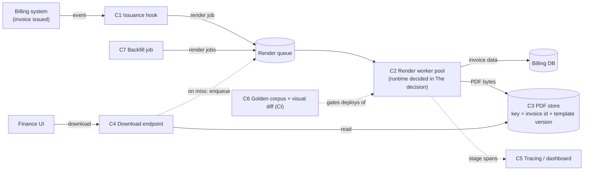
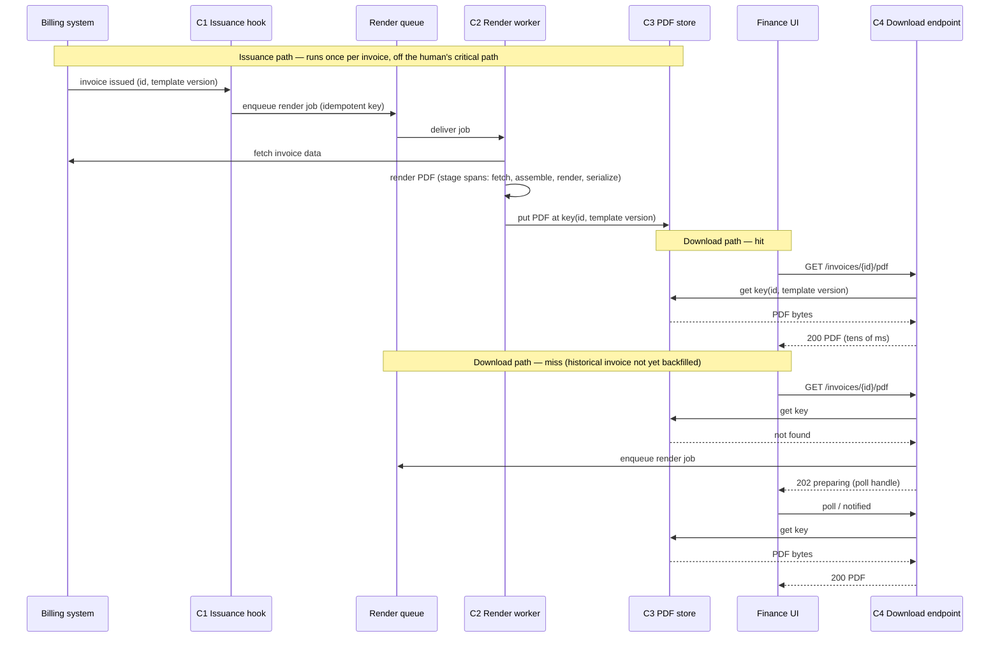

# RFC — Invoice PDF generation latency

**Status:** draft — for review
**Current working focus:** decision (profiling spike pending; see Launch strategy, Phase 0)
**Requested as:** "Rewrite the PDF generation service in Rust or Go — pick one."

## Summary

- The problem is that finance waits ~12 s for a 40-page invoice PDF. A language rewrite is one possible fix, and the most expensive and least reversible one available. This RFC treats the language as a subordinate dimension and decides the problem, not the ask.
- **Decision 1 (independent of language, ships first):** render each invoice PDF once, when the invoice is issued, and serve downloads from storage. Finance's wait becomes a storage read regardless of how fast rendering is.
- **Decision 2 (gated):** a two-day profiling spike decides whether rendering itself needs to be rewritten. If the majority of wall time is Python-interpreter CPU in code we own, rewrite; otherwise fix in place.
- **Decision 3 (the pick, as asked):** if the gate opens, **Go**. The conditions that would flip the pick to Rust, or to no rewrite, are listed under *The decision*.

## Related documents

None exist yet. The first roadmap tasks produce them; link them here when they do:

- Stage-by-stage profile of the current Python service on a real 40-page invoice.
- Finance usage figures: invoices per day, month-end batch size, page-count distribution, how PDFs are consumed.
- Golden corpus: the set of real invoices used for visual parity testing.

## Context

Our billing system issues invoices, and finance retrieves them as PDFs — to send to customers, reconcile payments, and close the month. The PDFs are produced by a Python service that takes an invoice's data (header, line items, taxes, totals) and renders a paginated document.

As accounts grew, so did invoices. A line-item-heavy account now produces an invoice of about 40 pages, and rendering one takes about 12 seconds — 300 ms per page. Finance hits this many times a day and constantly at month-end, and has escalated repeatedly. The wait sits on a person's critical path, not in a background job.

The proposal that reached engineering is to rewrite the service in a compiled language — Rust or Go — on the expectation that a faster runtime removes the wait.

**The problem to solve:** finance waits too long for invoice PDFs. **Why now:** the complaints are constant, month-end is when they hurt most, and a rewrite has been proposed. A rewrite is the largest and least reversible fix on the table, so before committing to it we must know that it fixes the problem — and whether a smaller change fixes it first.

### What we know and what we don't

Known:

- ~12 s wall time for a 40-page invoice (reported by users; not profiled).
- The service is written in Python.
- Finance waits for the result interactively — the complaints are about waiting, which implies rendering happens on demand, in the path of a human.

Unknown — and each changes the answer:

- **Which rendering library the service uses** (ReportLab, WeasyPrint, wkhtmltopdf, headless Chromium via Playwright, or another). This is the single most important fact missing from this RFC.
- **Where the 12 s go.** No stage-level timing exists (data fetch vs. layout vs. PDF serialization vs. asset loading).
- **How finance consumes PDFs:** one-at-a-time from the UI, or a month-end batch of many?
- **Whether generation runs in the HTTP request path** (so it is also exposed to gateway timeouts) or as a job.
- **Whether PDFs are stored after generation** or re-rendered on every download.
- **Volume:** invoices per day, distribution of page counts, month-end peak.
- **Team:** who maintains the service, and which languages the team already runs in production.
- **Deployment platform** (assumed below: containers on the existing platform).

### Where the 12 seconds could be going — hypotheses, to be measured

**[Inference]** These are the usual causes of slow PDF generation in Python services. The profile in Phase 0 decides which apply here; none is assumed.

| # | Hypothesis | Would a Rust/Go rewrite fix it? |
| --- | --- | --- |
| H1 | A pure-Python HTML/CSS layout engine (e.g. WeasyPrint) laying out 40 pages | Only indirectly. The fix is changing the engine — which can be done from Python. |
| H2 | A native engine (headless Chromium, wkhtmltopdf) called from Python | No. The time is inside a native binary; the caller's language is irrelevant. |
| H3 | Data assembly: ORM N+1 across line items, per-line tax lookups, lazy loading | No. The fix is the query shape; a compiled language issuing the same queries is equally slow. |
| H4 | Assets fetched on every render (logo, fonts over the network), font subsetting | No. Cache them. |
| H5 | Python CPU in code we own: templating over thousands of rows, Python-side pagination, per-cell formatting | **Yes.** This is the only case where the runtime itself is the bottleneck — and even here, an algorithmic fix may suffice. |
| H6 | Many invoices rendered serially (month-end batch) | No. Parallel workers fix it in any language. |

Only H5 makes a rewrite the *right* fix. Every other cause is fixed faster, cheaper, and more reversibly without one. The arithmetic also matters: to meet an interactive target of ~2 s (NF1 below) by rendering faster alone requires a 6× speedup end-to-end; a compiled rewrite delivers that only for the share of time that is Python-interpreter CPU.

### Out of scope

- Invoice content, template design, tax and rounding logic — unchanged.
- Other document types the service may render (statements, receipts). They benefit from the same pipeline but are not analyzed here.
- The billing data model and the invoice issuance flow itself.
- A language standard for services other than this one.

## Requirements

Only the architecturally relevant requirements: those that are hard to reverse, shape the structure, are business-critical, or set a cross-cutting quality target.

### Functional

- **F1 — Visual parity.** A PDF rendered by the new pipeline for a given invoice must be visually identical to today's output — same layout, fonts, page breaks, totals placement — verified by an automated visual diff against a golden corpus of real invoices, with finance sign-off on the corpus. Invoices are fiscal documents; a layout change is a compliance question, not a cosmetic one.
- **F2 — Numeric correctness.** Every figure in the PDF equals the billing system's source of truth for that invoice. Verified by the same golden corpus (extracted text compared to invoice data).
- **F3 — On-demand retrieval.** Finance can retrieve the PDF for any issued invoice, historical or new, from the billing UI.
- **F4 — Immutability and reproducibility.** An issued invoice is immutable. Its PDF is a derived artifact of (invoice data, template version) and, once produced, must be retrievable unchanged for as long as the invoice exists.

### Non-functional

- **NF1 — Interactive latency.** From finance clicking download to first byte: **≤ 2 s at p95, ≤ 5 s at p99, for any invoice up to 40 pages.** **[Assumption]** — the number is a typical tolerance for an interactive download; confirm with finance before design sign-off.
- **NF2 — Batch throughput.** The month-end run must complete within finance's working window. **[Assumption]** ≤ 2,000 invoices in ≤ 30 minutes until finance provides real figures. This is a throughput requirement, met by parallelism, not by per-document speed.
- **NF3 — Observability.** Every render emits per-stage timing (data fetch, assembly, layout/render, serialization, storage) as spans in the existing tracing stack, plus a latency dashboard by page-count bucket. This is the requirement whose absence made this RFC necessary: with it, the "Rust or Go?" question would already have an answer.
- **NF4 — Maintainability.** The team that owns billing today must be able to diagnose and fix a production incident in the service without outside help. A runtime that only one engineer can debug fails this requirement.
- **NF5 — Operability.** Deploys on the existing container platform with the existing CI, secrets, and observability. **[Assumption]** containers.

Deliberately excluded: compute cost. At 40 pages and this volume, compute is negligible next to engineering time **[Inference]**.

## Design

**Sizing.** 12 s / 40 pages = 300 ms per page today. NF1 asks for ≤ 2 s. There are two ways there: make rendering ≥ 6× faster on the request path, or take rendering off the request path. The second is a design change available in any runtime; the first is a runtime change whose payoff depends on the profile. The design below does the second unconditionally and gates the first.

For batch and backfill, throughput dominates. Illustrative: 10,000 historical invoices at 12 s each is 33 h serially; with 8 parallel workers, ~4 h; at 2 s per render with 8 workers, ~42 min. Parallelism moves the number more than per-document speed does.

### Dimension 1 — Delivery model: when the PDF is rendered

Options: render on demand synchronously (today); render once at issuance and store; render on demand asynchronously with notification.

F4 settles this. An issued invoice never changes, so its PDF can be rendered exactly once, when the invoice is issued, and stored. Every download then becomes a storage read — tens of milliseconds — regardless of how slow rendering is. NF1 is met for every invoice issued after rollout, and for every historical invoice once backfilled. Rendering speed then matters only for throughput (backfill, month-end, NF2), which parallel workers solve.

**Chosen: pre-render at issuance + immutable store, with an asynchronous miss path** (a download for an invoice with no stored PDF enqueues a render and returns a "preparing" state) for the window before backfill completes.

### Dimension 2 — Rendering runtime: what renders the PDF

Options: keep Python and fix the measured hot spots; keep Python and swap the rendering engine; rewrite in Go; rewrite in Rust.

This dimension is **gated by the profile** (Phase 0). The renderer sits behind a fixed interface — input: invoice id + template version; output: PDF bytes plus stage timings — so the runtime is swappable and a rewrite, if it happens, is a drop-in behind the same contract. The decision rule and the language pick are in *The decision*.

### Components

| # | Component | Responsibility | Requirements served |
| --- | --- | --- | --- |
| C1 | Issuance hook | On invoice issuance, enqueue a render job (idempotent, keyed by invoice id + template version) | F4, NF1 |
| C2 | Render worker pool | Consume render jobs; fetch invoice data; render PDF; write to store. The runtime under discussion lives here, behind a fixed interface. Horizontally scaled for NF2. | F1, F2, NF2 |
| C3 | PDF store | Object storage; key = invoice id + template version; write-once | F4, NF1 |
| C4 | Download endpoint | Read from store; on miss, enqueue a render and return "preparing" with a poll/notify handle | F3, NF1 |
| C5 | Stage instrumentation | Spans per stage inside C2; dashboard by page-count bucket | NF3 |
| C6 | Golden corpus + visual diff | CI gate: renders the corpus, diffs against approved output, compares extracted figures to billing data | F1, F2 |
| C7 | Backfill job | Enqueues render jobs for historical invoices, rate-limited | F3, NF2 |

Traceability: every requirement maps to at least one component (F1 → C2, C6; F2 → C2, C6; F3 → C4, C7; F4 → C1, C3; NF1 → C1, C3, C4; NF2 → C2, C7; NF3 → C5; NF4 → the runtime decision below; NF5 → all components deploy as containers on the existing platform). Every component names the requirement it serves; nothing else was added.

### Static diagram — components

### Dynamic diagram — issuance path and download path

## Alternatives analysis (Tradeoff)

Each alternative is weighed against the requirements above. Grouped by dimension. Multiple risks per alternative appear as additional rows.

| Alternative | Pros | Cons | Risk (description) | Impact | Probability | Mitigation | Contingency |
| --- | --- | --- | --- | --- | --- | --- | --- |
| **[Delivery] D1 — Keep synchronous on-demand rendering** | No new components; nothing to backfill | Every download pays the full render; NF1 is reachable only through a ≥ 6× render speedup; exposed to gateway timeouts under load | Even after a runtime rewrite, a 40-page render on a loaded worker lands above NF1 | High | Medium | None structural — this is the option's defining weakness | Move to D2 |
| | | | Request timeouts at the gateway during month-end concurrency | High | Medium | Raise timeouts (papers over it) | Move to D2 |
| **[Delivery] D2 — Pre-render at issuance, immutable store, serve from store** | Download latency independent of render speed; render once instead of once per download; meets NF1 for any runtime; matches F4 exactly | New components (hook, queue, store, backfill); a template-change policy is needed (new template version = new key); storage cost (small — invoice PDFs are typically hundreds of KB **[Inference]**) | Invoice mutated after the issuance event, leaving a stale PDF that finance trusts | High | Low | Key by (invoice id, template version, data hash); enforce immutability at the billing layer; any mutation invalidates the key | Force re-render flag on the download endpoint; reconciliation sweep compares hashes |
| | | | Issuance event lost or duplicated, so PDFs go missing or double-render | Medium | Medium | Transactional outbox on the billing side; idempotent job key; periodic reconciliation sweep | Download-path miss falls through to D3 |
| **[Delivery] D3 — Asynchronous on-demand (click, job, notify)** | No gateway timeouts; only a queue is added | Finance still waits the full render time the first time; UX change (poll or notify) | Perceived as "still slow" by finance — the complaint does not go away | Medium | High | Use D3 only as the miss path under D2, not as the primary path | Accelerate backfill so misses stop |
| **[Runtime] R1 — Keep Python; profile-driven fixes (queries, caching, parallel workers)** | Cheapest; no parity risk (same engine, same output); fully reversible; ships in days; fully resolves H3, H4, H6 | Ceiling bounded by the engine (H1) and the interpreter (H5) if those dominate | Profile shows H5 dominates and Python-level fixes plateau above target | Medium | Medium | Time-box the fixes; measure after each | Escalate to R2, then R3 |
| **[Runtime] R2 — Keep Python; swap the rendering engine (native engine invoked from Python)** | If H1 dominates, this is the fix: a native engine (headless Chromium, or a compiled typesetter such as Typst, invoked as a subprocess or library) turns the Python layer into a thin data-assembly shell; keeps the team's language | Layout parity is at risk — a new engine is not pixel-identical; a new dependency to operate | Visual regressions in fiscal documents | High | High | Golden corpus diff (C6) as a hard CI gate; finance signs off on the corpus before cutover | Route historical template versions to the old engine; only new template versions use the new engine |
| | | | Headless-browser footprint and instability (memory, zombie processes) if Chromium is the engine | Medium | Medium | Pooled browser instances with memory limits and recycling | Choose a non-browser engine |
| **[Runtime] R3 — Rewrite in Go** | Compiled; goroutines make parallel rendering trivial; single static binary, fast builds, small images; short ramp from Python for a service team **[Inference]**; mature headless-Chromium drivers | Full rewrite cost plus parity risk; pays off only if H5 dominates; PDF library ecosystem is adequate for programmatic layout but thinner than Python's for high-level document layout **[Inference — verify in Phase 0]** | The rewrite does not move the number because the bottleneck was never Python | High | Medium | Profile gate: the rewrite starts only if H5 is the majority of wall time | Stop after the spike, having spent two days instead of two months |
| | | | Visual regressions (new rendering code path) | High | High | Golden corpus gate (C6); shadow rendering — run old and new side by side on live invoices and diff before cutover | Per-template-version routing back to the old renderer |
| | | | Team unfamiliarity slows incident response (NF4) | Medium | Medium | Pairing; Go patterns doc up front; keep the service small behind the fixed renderer interface | The interface makes the renderer replaceable |
| **[Runtime] R4 — Rewrite in Rust** | Highest realistic performance ceiling; no GC pauses; strongest memory-safety guarantees; a typesetting engine (Typst) is embeddable natively **[Inference]** | Steepest ramp for a team new to it; slowest compile cycle; smallest hiring pool **[Inference]**; the headroom over Go is not needed at 40 pages and this concurrency | The rewrite does not move the number because the bottleneck was never Python | High | Medium | Same profile gate as R3 | Same as R3 |
| | | | Visual regressions | High | High | Same as R3 | Same as R3 |
| | | | Team unfamiliarity slows incident response (NF4) — steeper than Go | Medium | High | Same as R3, with more budget for the ramp | Same as R3 |
| | | | Delivery slips from the learning curve (ownership, lifetimes, async) | Medium | High | Budget the curve explicitly; pair with anyone fluent | Fall back to R3 mid-way — the interface is identical |

Weighed against the requirements:

- **NF1** is met structurally only by D2. Under D1 it depends on a ≥ 6× speedup that no option guarantees without a profile.
- **F1/F2** are safest under R1 (same engine), at risk under R2/R3/R4 equally; C6 is the mitigation for all three.
- **NF2** is met by parallel workers under every runtime; the runtime changes the worker count, not the design.
- **NF4** favors R1 and R2, then R3, then R4.
- **F3/F4** are satisfied by D2 + C3 regardless of runtime.

## The decision

The full document was re-read end to end before this section: the requirements hold, every component traces to a requirement, and the analysis supports the following.

**1. Delivery: adopt D2 (pre-render at issuance + immutable store) with D3 as the miss path.** This is independent of the runtime and ships first. It is the change that removes finance's wait: after rollout and backfill, a download is a storage read. It also matches the domain — an issued invoice is immutable, so its PDF is naturally a write-once artifact.

**2. Runtime: gate the rewrite on the Phase 0 profile.** Decision rule (proposed; adjust after seeing the profile):

- Apply the cheap fixes first (H3 query shape, H4 asset caching) — they are hours of work and remove noise.
- Then, if **the majority of remaining wall time is Python-interpreter CPU in code we own (H5)**, proceed to the rewrite (decision 3).
- If the time is in a native engine (H2), a pure-Python layout engine (H1), or I/O, do **not** rewrite. Fix in place (R1) or swap the engine from Python (R2). The language question is closed.

**3. Language, if the gate opens: Go.**

- The gap that matters is interpreted vs. compiled, not Go vs. Rust. For a 40-page document with modest concurrency, Go's ceiling is far above the target; Rust's extra headroom buys nothing NF1 or NF2 asks for.
- NF4 decides the tiebreak. A rewrite in a language the team does not yet run in production is already a maintainability cost; Go's ramp is shorter and its operational model (single binary, fast builds, simple concurrency) is closer to what a Python service team already knows **[Inference]**.
- Parity risk (F1/F2) is identical in both; the golden corpus and shadow rendering mitigate it identically. Rust offers no advantage on the requirement that carries the most risk.

**Conditions that flip the pick to Rust:**

- The team already runs Rust in production with at least two fluent engineers, and does not run Go. (NF4 then favors Rust.)
- The profile shows layout/typesetting itself is the hot path *and* the team chooses an embedded typesetting engine whose native API is Rust; even then, invoking it as a subprocess from Go or Python is likely sufficient, so this condition is weak.
- An organization-wide language standard already exists for one of them; follow it.

**Conditions that flip the pick to no rewrite:** any Phase 0 outcome other than H5-majority. **[Inference]** This is the more likely outcome; most slow Python PDF pipelines are slow in the engine or the queries, not in the interpreter.

**Strongest objection to this decision, and the answer.** "You were asked to pick a language and you are proposing a queue and a profiler." A rewrite is two months of work with a parity risk on fiscal documents; the profile is two days and tells us whether those two months would change the number. D2 is two weeks and fixes finance's wait whether or not the rewrite ever happens. If Phase 0 shows H5, the rewrite proceeds in Go with a clear conscience and a measured baseline.

**Strongest objection to Go over Rust.** "If we are rewriting anyway, Rust with a native typesetting engine gives the best output quality and the fastest renderer." The output quality of a typesetting engine is available to any caller as a subprocess; the marginal gain from embedding it natively does not justify the ramp cost or the NF4 exposure. If the team's composition changes, the flip condition above applies.

**Decision style: autocratic.** This document is the author's recommendation. The owner of the billing domain makes the call after review by a finance representative (for NF1/NF2 numbers and the golden corpus) and the platform team (for NF5).

## Launch strategy

**Phase 0 — Measure (week 1).** Add stage spans (C5) to the current Python service. Profile a real 40-page invoice and the top-10 slowest invoices of last month. Collect finance's usage figures and confirm NF1/NF2. Assemble the golden corpus (C6) with finance. **Decision checkpoint:** apply the rule in decision 2.

**Phase 1 — Take rendering off the critical path (weeks 2–3).** Build C1, C3, C4, C7 around the existing Python renderer. Backfill history, most-recent first. Finance sees the fix here, whatever Phase 2 decides.

**Phase 2 — Fix the renderer (conditional, weeks 3+).** Either R1/R2 in place, or the Go rewrite of C2 behind the fixed renderer interface. In both cases: C6 gate in CI, shadow rendering on live invoices, cutover per template version, old renderer kept for rollback.

**Phase 3 — Close.** Remove the old path; record the measured before/after numbers in this RFC and mark it accepted.

## Tasks and roadmap

Estimates are rough and assume one engineer; re-estimate after Phase 0.

| Task | Description | Estimate |
| --- | --- | --- |
| Stage instrumentation | Spans for fetch / assemble / render / serialize in the current service; dashboard by page-count bucket | 1d |
| Profiling spike | Profile a real 40-page invoice and last month's 10 slowest; classify wall time by hypothesis H1–H6; write up | 2d |
| Finance figures and targets | Invoices/day, month-end batch size, page distribution, consumption pattern; confirm NF1/NF2 | 1d |
| Golden corpus | Select ~50 real invoices covering page-count range and template variants; approved renders; visual diff + figure extraction in CI | 3d |
| Issuance hook + queue | Idempotent render job on invoice issuance; outbox on the billing side | 2d |
| PDF store + download endpoint | Write-once object storage keyed by (invoice id, template version, data hash); download reads store; miss path returns 202 + poll | 3d |
| Backfill job | Rate-limited enqueue of historical invoices, most-recent first; reconciliation sweep | 2d |
| Cheap fixes (if profile shows H3/H4) | Query shape, asset caching | 1–3d |
| Engine swap (if profile shows H1) | Native engine from Python behind the renderer interface; parity via corpus | 5–10d |
| Go rewrite of renderer (if profile shows H5) | Renderer behind the fixed interface; shadow rendering; parity via corpus; cutover per template version | 15–30d |
| Decommission | Remove old path; final numbers into this RFC | 1d |

## Version history

| Version | Date | Author | Description |
| --- | --- | --- | --- |
| 1.0 | 2026-09-08 | Drafted by Claude for the billing service owner | Document created; reframed the language question around the latency problem; decision gated on the Phase 0 profile. |
