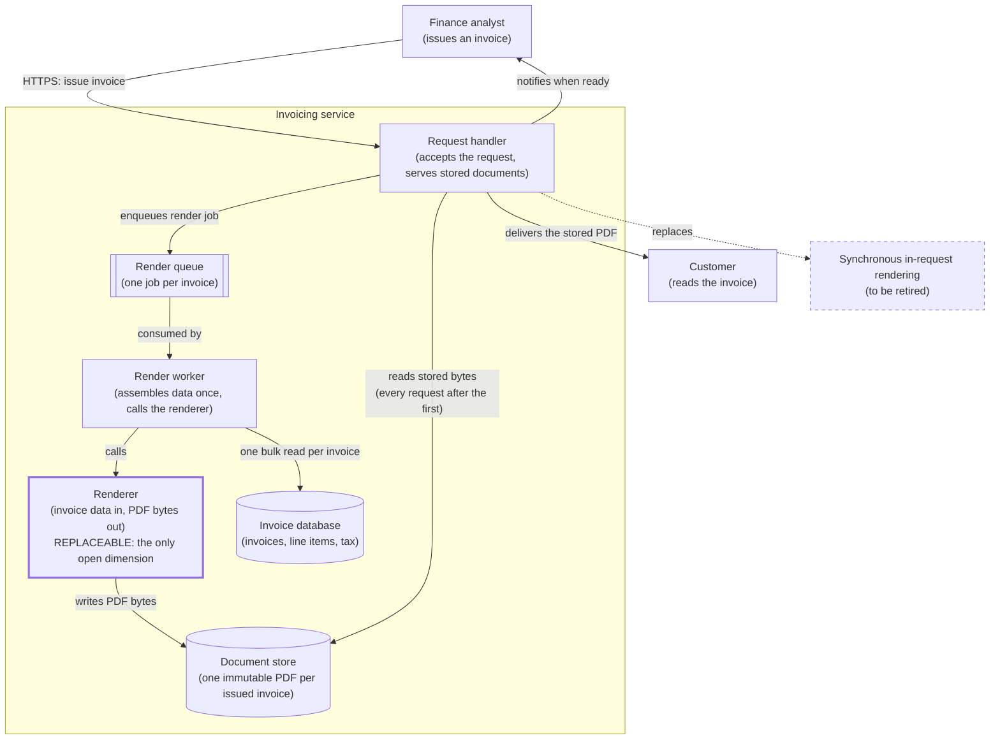
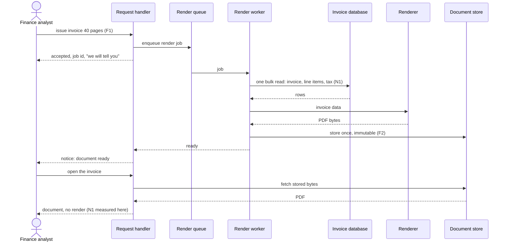
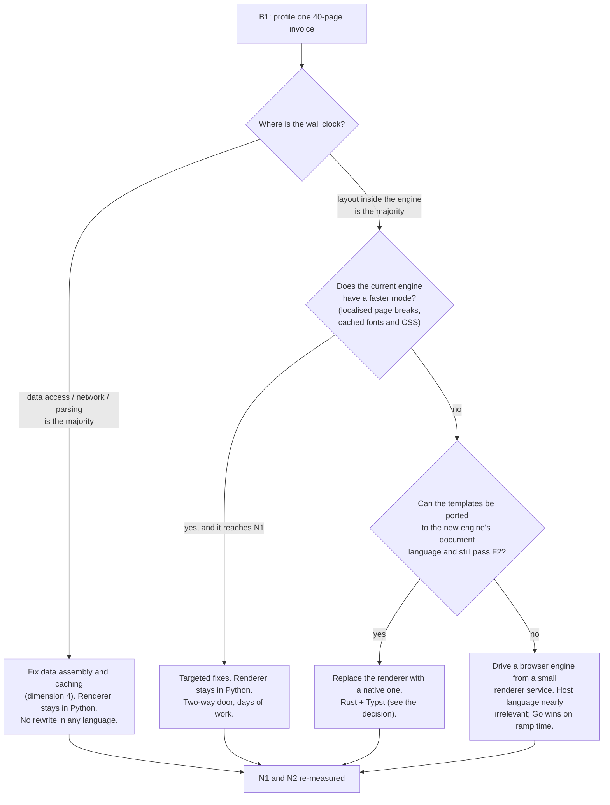

# RFC: Getting invoice PDFs to the finance team fast enough to stop waiting

**Status:** proposed (three blocking questions open; see Assumptions and open questions)
**Decider:** Owner of the invoicing service · **Reviewers:** Finance lead (the role that complains), the two or three engineers who maintain invoice templates, whoever answers tax and audit questions about invoice documents
**Current working focus:** decision

> **A note on the request.** The request was "Rust or Go, pick one". This document picks one (Rust,
> with Typst, for the renderer) but it does not recommend acting on that pick yet, and it narrows the
> unit of work from "the service" to "the renderer". The reasons are in
> [The decision](#the-decision). The narrowing is the substance of this RFC, not a hedge: on the
> published per-page cost of the most likely current engine, roughly 94% of the 12 seconds is
> unexplained by page layout, so a language rewrite is being aimed at a bottleneck nobody has located.

## Reversibility

**Rewriting the service is a one-way door.** Once three to six engineer-months have gone into a Go or
Rust reimplementation of invoice generation, nobody rewrites it back; the Python service is deleted, the
templates are ported, and the hiring profile for the team changes. Bezos's test applies directly: the
cost of undoing is not the code, it is the sunk commitment and the second engine's output fidelity.

Three other things this decision touches are **two-way doors**, and that asymmetry is the argument of
the whole document:

- **Replacing the rendering engine while keeping the service** is reversible in days: the renderer sits
  behind one function boundary (invoice data in, PDF bytes out) and can be swapped back behind a flag.
- **Moving rendering off the interactive request path** is reversible: the queue and the worker can be
  bypassed.
- **Storing the rendered document instead of re-rendering it** is reversible: delete the stored copy.

A one-way door is worth its ceremony only after the two-way doors have been tried, because a two-way
door that works makes the one-way door unnecessary. That ordering is what sets the shape of the
launch strategy below.

## Context

An invoicing service written in Python produces invoice PDFs. Generating a 40-page invoice takes about
12 seconds (reported by the requester; no dashboard, timing or trace was cited, so this figure is
***assumed***, with the requester as its origin. A timing run over the twenty largest invoices of the
last quarter would replace it with a measurement, and that run is under an hour of work). The finance
team complains about the wait constantly (reported by the requester; ***assumed***: the complaint
channel and its volume are not identified, and neither is whether the complaint is the wait itself, a
month-end batch that overruns, or a request that times out).

Nothing else about the system was available for this document: there is no codebase, schema, dashboard
or ticket to read. Everything below that is not labelled *measured* is therefore labelled
***assumed*** or ***estimated***, and the first phase of the launch strategy exists to replace those
labels with measurements. This is stated plainly rather than papered over, because the labels are what
tell a reader which parts of the argument are load-bearing and which are placeholders.

### What the 12 seconds probably is not

One thing can be checked without access to the system: what a PDF layout engine costs per page. An
independent benchmark ran the same mail-merge template through six typesetting engines with
`hyperfine` on a MacBook Air M4 (16 GB): at 500 pages, WeasyPrint, the most common HTML/CSS-to-PDF
path in Python, took 8.7 s, or 17.3 ms per page, and was the slowest of the six; Typst took 157 ms
total, or 0.3 ms per page (speedata typesetting benchmark, published 2026-02-10; *third-party
measurement*).

At 17.3 ms per page, 40 pages of layout is about **0.7 s** (40 × 17.3 ms = 692 ms; *estimated* from the
benchmark). The observed figure is 12 s. So roughly **94%** of the time (11.3 s of 12 s) is not
explained by per-page layout at benchmark rates. Two very different explanations fit, and they lead to
opposite decisions:

- **The template hits the engine's global-pagination cost.** WeasyPrint lays out the whole document
  before it knows where pages break, and its issue tracker carries repeated long-document performance
  reports (project issue tracker, issues #223, #545, #578, and a memory report #671; read
  2026-09-08 — *third-party reports*, including a user report of roughly 84 s for a 52-page document,
  which was not verified against the thread itself). If the invoice is in this regime, the cost is
  inside layout, superlinear in page count, and a faster engine is the lever.
- **The time is outside the renderer entirely.** Per-line-item database queries, images or logos
  fetched over the network per page, fonts and stylesheets parsed on every request, currency and tax
  formatting in a loop. If the time is here, a rewrite in any language moves the same 11 s of I/O and
  query work into a new codebase and the finance team keeps complaining.

Nobody has separated the two. That separation is blocking question B1, and it decides this RFC.

### Which Python pipeline is in use is unknown, and it changes everything

Python invoice generation is usually one of three shapes, and the language question means something
different in each:

| Candidate pipeline | Where the time goes | What a native rewrite buys |
| --- | --- | --- |
| HTML/CSS templates rendered by a pure-Python layout engine (WeasyPrint and similar) | Layout, in CPython, on one core | Real gains, but the templates must be ported to a different document language |
| HTML/CSS rendered by an out-of-process browser engine (headless Chromium, wkhtmltopdf) | Inside the browser process, not in Python | Almost nothing: the new service shells out to the same browser |
| Drawing commands issued directly (ReportLab and similar) | Python-level loops over line items | Real gains, and page composition must be rewritten by hand |

Identifying which one is in use costs one look at the dependency manifest. It is part of B1.

### Current usage

Every row here is ***assumed***: no usage data was available. Each row names what would confirm it.

| Role (what they do with the system) | What they do today | Through what | How often or how much (source) |
| --- | --- | --- | --- |
| Finance analyst issuing one invoice to a customer | Requests the invoice, waits on screen, sends the PDF to the customer | The invoicing service's generate action | Volume unknown (*assumed*; the endpoint's request log for one month would give it) |
| Finance analyst producing a period's invoices at close | Believed to run invoices in bulk near month end | Unknown; possibly the same action repeated | Unknown (*assumed*; B3 asks whether this role exists at all) |
| Customer receiving an invoice | Reads the PDF, pays against it, keeps it | Email attachment or a download link (*assumed*) | One per invoice issued |
| Auditor or tax authority asking for an issued invoice | Asks for the document as it was sent | Whatever archive exists (*assumed*; B2 asks whether one is required) | Rare, and unforgiving when it happens |
| Engineer maintaining invoice layouts | Changes a template when finance asks for a layout change | The template files in the service repository (*assumed*) | Unknown |
| Engineer on call for the invoicing service | Keeps the service up; handles timeouts and failed generations | Logs and dashboards (*assumed*) | Unknown |

**The problem.** A finance analyst who needs an invoice waits about 12 s for it (*assumed*), which is
long enough to abandon the task and come back, and short enough that no part of the product treats it
as a background job. That sits in the worst part of the response-time band: past the point where a wait
feels like part of the action, but not far enough past it that the system offers to hand the document
over later (Nielsen, *Usability Engineering*, 1993, after Miller 1968: responses under about 1 s keep a
user in flow, and about 10 s is the limit of attention before the user switches tasks). The
complaint is the symptom of that gap, and there are two ways to close it, making the wait short or not making a person
wait at all, which is why both appear as options below.

### Goals

| Goal | Who benefits | How we will know |
| --- | --- | --- |
| A finance analyst gets the invoice they asked for without parking the task and coming back to it | Finance analysts; the customers waiting on the invoice | Analysts stop raising the wait; the complaint channel goes quiet for a full close cycle |
| An invoice already sent to a customer stays exactly as the customer and the auditor saw it | Customers; auditors; the finance lead who would have to explain a discrepancy | A re-request of any issued invoice returns the document that was sent, checked page by page |
| The engineers who maintain invoice layouts can keep changing them at the pace finance asks | Finance analysts asking for layout changes; the maintaining engineers | Layout changes ship in the same working week they are asked for, as they do today |
| Invoicing stops being the reason other parts of the application are slow at close | Everyone using the application near month end | No close-period slowdown attributable to invoice generation |

### Stakeholders

| Role (what they do with the system) | What they need from this decision | Who speaks for them |
| --- | --- | --- |
| Finance analyst issuing an invoice | The document in hand when they need it, or an honest "we will tell you when it is ready" | Finance lead |
| Finance analyst at close | The period's invoices done inside the close window without babysitting | Finance lead |
| Customer receiving an invoice | An invoice identical in content and appearance to the ones already received | Finance lead |
| Auditor or tax authority | The issued document reproducible on demand, unchanged | Whoever answers tax and audit questions about invoice documents |
| Engineer maintaining invoice layouts | To keep changing layouts without learning a second document language and a second toolchain | The maintaining engineers themselves |
| Engineer on call | One place where rendering happens, and a failed render that does not take a user request down with it | The on-call engineer |
| Negative stakeholder: the engineer who inherits a second language in production | Not to own a runtime, build pipeline and dependency set that only one component uses | The maintaining engineers themselves |

### Constraints

| Constraint | Source (outside the organization, or a signed commitment) | What it excludes, and the clause |
| --- | --- | --- |
| None identified | — | Nothing is excluded on constraint grounds in this analysis |

Two candidate constraints were considered and could not be established, so neither excludes anything
here and both appear as open questions instead. If an invoice is a statutory document whose content or
appearance is fixed by a tax regime or a customer contract, that clause would raise the bar on output
fidelity (F2) and could exclude any engine that cannot reproduce the current layout. That is B2. If a
data-protection rule forbids invoice contents leaving the organization's network, that clause would
exclude the bought-service row in the tradeoff table. That is B4.

### Prior decisions

| Prior decision | Who made it, when | Incumbent it implies | Cost to reverse |
| --- | --- | --- | --- |
| Invoice generation is written in Python | Unknown author, unknown date (*assumed* from the request) | The Python service and its PDF library | High: a rewrite is the whole subject of this document |
| Invoices are produced from templates in whatever document language the current engine reads | Whoever chose the engine (*assumed*) | The current templates | Medium to high: porting templates is the dominant cost of any engine change, and it is where F2 is won or lost |
| The decision is "Rust or Go" | The requester, today | A rewrite in one of those two languages | **None.** It is a framing in a message, not a commitment. Reversing it costs nothing, which is why this document adds the options it excluded |
| Generation happens while the analyst waits, rather than as a background job | Unknown author (*assumed* from "takes about 12 seconds" being something a person notices) | Synchronous generation in the request path | Low: a queue and a worker are a well-understood addition |

The third row is the one that matters most. "Rust or Go, pick one" is a hypothesis about the option
space, made by a person, at no cost to revise, not a constraint. Under the method used here, a prior
decision never excludes an option; its incumbent enters the tradeoff table beside alternatives, and its
reversal cost is recorded in the row. That is exactly what section
[Alternatives analysis](#alternatives-analysis-tradeoff) does: Rust and Go both get rows, and so do the
five options the framing left out.

### Assumptions and open questions

**Blocking.** Any answer changes the decision. The status stays *proposed* until B1, B2 and B3 are
closed.

| Question | Owner | Date | If yes | If no |
| --- | --- | --- | --- | --- |
| **B1.** Of the ~12 s, how much is inside the layout engine, and how much is database queries, network fetches, template and font parsing, and serialization? (Run: a profile of one 40-page invoice with a sampling profiler plus per-query timing, and identify the PDF library from the dependency manifest.) Pass criterion: the 12 s is attributed to named phases summing to at least 90% of wall clock | Owner of the invoicing service | Within one week; the run is ~3 engineer-days | Layout is the majority: the engine — and therefore possibly the language — is the lever, and the renderer replacement in the decision proceeds | Layout is the minority: no rewrite in any language is justified; the fixes are in data access and I/O, and this RFC's language pick is shelved, not executed |
| **B2.** Is the invoice PDF a statutory or contractual document whose content and appearance are fixed, such that a re-rendered invoice must match the one already sent? | Whoever answers tax and audit questions about invoice documents | Within one week | F2 becomes a veto criterion; any engine change must pass the page-by-page regression suite before cutover, and the cost of porting templates rises sharply | F2 relaxes to "content identical, layout equivalent", and an engine change gets materially cheaper |
| **B3.** Does a month-end batch exist, and what is the volume and the close window? | Finance lead | Within one week | A throughput requirement is added; throughput favours parallelising renders across processes, which is a different lever from per-document latency and would add a Go row's concurrency story back into contention | The decision is purely about one analyst's wait, and per-document latency is the only target |
| **B4.** May invoice contents be sent to a third-party rendering service? | Whoever answers data-protection questions | Within one week | The bought-service row stays a live option | That row is excluded, by clause |

**Non-blocking:**

- The 12 s figure itself is ***assumed*** (requester's report, no instrument). A timing run over the
  twenty largest invoices of the last quarter would replace it, and it is the first task in phase 0.
  If the true figure is 3 s, the goals may already be met by the storage change alone.
- Whether the complaint is about the wait, a batch overrun, or timeouts is ***assumed*** to be the
  wait. Ten minutes with the finance lead would settle it, and it is the second task in phase 0.
- The maturity of the newer pure-Go and pure-Rust HTML-to-PDF layout engines (papyrus, gpdf, fulgur and
  similar) is ***assumed*** to be too low for a document with legal weight; none was evaluated. A
  half-day reading their issue trackers, release cadence and maintainer count would settle it, and it
  is part of the phase 3 spike.
- N1's target of 2 s is ***assumed***; see its Derived-from cell. It is the first thing to renegotiate
  with the finance lead, and the confirmation step measures it before defending it.

### Out of scope

- **Whether the invoice's numbers are right.** A data-correctness problem, owned by whoever owns the
  invoice model. This document is about how long the document takes to produce and whether it looks
  the same afterwards.
- **Delivering the invoice to the customer** (email, portal, e-invoicing transmission to a tax
  authority). A separate problem with its own failure modes; it consumes the PDF this service produces.
- **The rest of the invoicing domain.** Credit notes, dunning, reconciliation.

## Requirements

Only the architecturally relevant ones are here. Four items from the request were reclassified: "in
Rust" and "in Go" are design choices and appear as rows in the tradeoff table, not as requirements;
"rewrite the service" is a design choice about the *unit of work* and also appears as a row; "the
finance team complains constantly" is the problem statement, which belongs in Context; and "12 seconds"
is a measurement of the current state, which is the derivation for N1 rather than a requirement in
itself.

Three requirements are deliberately **not** written, because they cannot be sourced yet and an invented
target is worse than an acknowledged gap: a batch-throughput requirement (blocked on B3), a retention
and reproducibility requirement (blocked on B2), and a cost-of-ownership requirement (no cost figures
available). Each is named in the blocking-question table with what it would change.

### Functional

| ID | Goal (a row of the Goals table) | Requirement (the role, and what the system does for it) | Proof (the scenario, and how it is run) | Source |
| --- | --- | --- | --- | --- |
| F1 | A finance analyst gets the invoice without parking the task | A finance analyst requesting an invoice of any size in the current size distribution receives the finished document, or an explicit typed failure, without retrying by hand | Given the twenty largest invoices of the last quarter, when each is requested once, then each returns a document or a named error and none times out; run as an end-to-end suite against production-sized data | Context: the 12 s wait, and the possibility of timeouts on the largest invoices |
| F2 | An invoice already sent stays as the customer and the auditor saw it | For an invoice already issued, the system produces a document whose extracted text is identical and whose pages are visually unchanged from the one the customer received | Given the 200 most recently issued invoices, when each is re-produced, then extracted text matches exactly and a page-by-page image diff shows no difference above the antialiasing threshold; run as a regression suite that gates any engine or template change | Context: the auditor role; B2 raises this to a veto criterion if the answer is yes |

### Non-functional

| ID | Goal | Requirement (metric, target, condition) | Derived from | Proof (measurement) | Source |
| --- | --- | --- | --- | --- | --- |
| N1 | A finance analyst gets the invoice without parking the task | p95 wall-clock time from an analyst's request to a document they can open, at or below **2 s**, for invoices at the 95th percentile of page count, whenever the analyst is waiting on screen | Today ≈12 s for 40 pages (requester's report; ***assumed***, no instrument). 2 s sits inside the band where a wait is noticeable but the task is not abandoned: about 1 s to stay in flow, about 10 s before a user switches away (Nielsen, *Usability Engineering*, 1993, after Miller 1968; *external reference*). The exact value is ***assumed*** and is the first thing to renegotiate with the finance lead | Timing instrumented at the endpoint and reported per percentile; plus a load run at the concurrency B3 establishes | Context: the wait and the attention band |
| N2 | Invoicing stops being the reason other parts of the application are slow at close | While *c* invoice renders run concurrently at the close-period peak, p95 of every other interactive request rises by no more than 10% against its no-render baseline | Arithmetic of a fixed worker pool (***estimated***; the pool size *w* and the concurrency *c* are part of B3): at 12 s per render, *c* concurrent renders occupy *c* workers for 12 s each, so once *c* approaches *w* every other request queues behind a render. The 10% figure is ***assumed*** as a normal regression tolerance and needs the finance lead's and on-call engineer's agreement | Load run with *c* renders in flight while interactive p95 is read from the request dashboard | Context: 12 s of occupancy per render; the on-call engineer role |

Every target above that is labelled *assumed* is measured before it is defended: that is what the
confirmation step in the decision commits to. A reader who thinks 2 s is the wrong number can argue
with it now, which is the point of the Derived-from column.

## Design

The design below is the shape that serves F1, F2, N1 and N2 **whatever B1 answers**, with the one
genuinely open dimension, the renderer, drawn as a replaceable part. Decided dimension by dimension.

### Dimension 1: an issued invoice is rendered once, not on every request (F1, N1, N2)

An issued invoice is an immutable document: its numbers are fixed at issue, and F2 says it must not
change afterwards. So it should be rendered once, at issue time, and stored as bytes; every later
request serves the stored object. Every read after the first then costs an object-storage fetch instead
of a render, which puts N1 comfortably inside 2 s for the overwhelming majority of requests, in any
language, at any engine speed. This is the single largest available win and it is independent of B1.

It does not by itself solve the *first* render, the case of the analyst who issues the invoice and
wants it immediately, which is what dimensions 2 and 3 address.

### Dimension 2: rendering happens off the interactive request path (N2, F1)

The render runs in a worker consuming a queue, not in the process serving user requests. That is what
N2's 10% ceiling requires: 12 s of CPU inside a request handler occupies a slot in a fixed pool, and at
close-period concurrency that pool is what other users are queueing for. It also gives F1 its typed
failure: a render that fails leaves a failed job with a reason, not a browser tab that eventually times
out.

The analyst's experience becomes: request accepted, document appears when ready, with a notice. If the
render is fast (dimension 3) the notice is barely seen; if it is slow, the analyst is not holding the
screen for it. This is the option that addresses the *complaint* even when the *render time* does not
move, and it is why the goals table says "without parking the task" rather than "in under two
seconds".

### Dimension 3: the renderer is one replaceable component, not the service (F1, N1, F2)

The renderer's interface is narrow: invoice data in, PDF bytes out. Behind that boundary it can be a
Python function, a subprocess invoking a binary, or a small service over the network, and it can be
changed one way and back without touching data assembly, authorization, storage, the API or the
templates' *data* contract. Framing the language question as "rewrite the service" fuses this
replaceable part to everything around it that is not slow, and turns a two-way door into a one-way one.

This is the dimension B1 decides. If layout dominates, a native renderer is worth the trouble and
section 4's language rows apply. If it does not, the renderer stays in Python and the work goes into
data access.

### Dimension 4: data assembly is one query per invoice, not one per line item (N1)

Whatever the renderer, the invoice's data is fetched once, in bulk, before layout starts, with images
and fonts resolved from a local cache rather than the network. This is stated as a design choice because
it is the most common source of unexplained seconds in this shape of code, and because B1 may show it
is the entire problem.

### Static view

*Figure 1. C4 container diagram of the target state. Answers F1, F2, N1, N2.*

### Dynamic view

*Figure 2. Sequence for "an analyst issues a 40-page invoice and opens it", container level. Answers F1, F2, N1, N2.*

### Which lever B1 selects

*Figure 3. The lever B1 selects. Answers N1, N2; gated by F2.*

## Alternatives analysis (Tradeoff)

### Decision drivers

1. **B1's answer.** Nothing below can be chosen without it. A rewrite aimed at an unlocated bottleneck
   is not a decision, it is a bet.
2. **F2, output fidelity**, which B2 may raise to a veto. Every engine change re-opens the appearance
   of a document that customers and auditors already hold.
3. **N1**, the analyst's wait, then **N2**, the collateral damage at close.
4. **Reversibility** (from the sizing above): among options that meet the requirements, prefer the one
   that can be undone in days. This driver is what demotes the rewrite rows.
5. **Cost of ownership on a small team**: a second language in production means a second toolchain,
   dependency policy, build pipeline, on-call runbook and hiring profile, for one component.
6. **Time to relief for the finance team.** The complaint is live now; an option that helps in two weeks
   beats one that helps in two quarters, other things equal.

The requester's preference for a rewrite is not on this list. It is a prior decision with an author and
a reversal cost of nothing, and it appears as a cost inside the rows below.

### What every option shares

Every option below keeps invoice PDFs generated by software this organization operates, from this
organization's own invoice data, with the current invoice layout as the output to be reproduced. Each
of those is accounted for: **software we operate** is challenged by the bought-service row; **the
current layout** is a prior decision of whoever chose the engine, and its porting cost is a cost in
every engine-changing row; **our own data** is not challenged, since the alternative, someone else
producing our invoices, is a different business decision, not an architecture one.

What the options do *not* share, and the requester's framing assumed they would, is the unit of work.
Rows below change the storage, the interaction, the data access, the engine, the renderer or the whole
service, and those are five different sizes of commitment.

| Alternative | Requirements (met / partial / missed, by ID) | Pros | Cons | Risk | Impact | Probability | Mitigation | Contingency |
| --- | --- | --- | --- | --- | --- | --- | --- | --- |
| **[Storage] Render once at issue, serve stored bytes** | met: F2, N1 (every request after the first), N2 (for re-reads); partial: N1 (the first render is untouched); missed: none | Days of work; removes the wait entirely for every read after the first; makes F2 enforceable, since the stored bytes *are* what the customer got; helps whatever B1 says | Does nothing for the analyst who issues an invoice and wants it now; adds a document store to operate and back up | Stored documents drift from what the current engine would produce, so a template change silently makes old and new invoices differ | Low: divergence is the correct behaviour for an issued invoice | High: it will happen on the first template change | State explicitly that stored documents are never re-rendered; version the template with the document | Re-render on demand behind an audited flag |
| **[Interaction] Deliver asynchronously with a notice** | met: F1, N2; partial: N1 (the wait becomes a background job rather than a shorter wait) | Kills the complaint without touching render time; two weeks of work; the right shape for any batch B3 reveals | Analysts who need the document in the same breath as issuing it now get a two-step flow; needs a notification path | Analysts experience the change as a regression: a spinner replaced by a wait plus a click | Medium: it is the visible surface of the change | Medium: depends on how they work, which nobody has asked | Ask the finance lead before building it; keep the document opening automatically when it is ready | Keep the synchronous path for invoices under a page threshold |
| **[Data access] Targeted fixes inside the current Python pipeline** | met: N1 and N2 *if B1 attributes the time to data access*; missed: nothing new | Cheapest option that could fully solve it; no new language, engine or template port, so F2 is untouched; reversible in a pull request | Only works if B1 points here; can turn into an open-ended optimization hunt | The fixes reach, say, 5 s and stall short of N1 | Medium: partial relief keeps the complaint alive | Medium: unknown until B1 | Time-box to two weeks and re-measure against N1 | Escalate to the engine or renderer rows |
| **[Engine, same language] Replace the layout engine, keep the service in Python** | met: F1, N1, N2; partial: F2 (templates must be ported to the new engine's document language) | Attacks the bottleneck B1 may find without a second language in production; a native engine can be invoked as a subprocess from Python, so the speed is available without the rewrite; reversible behind a flag | Template port is the real cost and the real F2 risk; the team learns a second document language | Ported templates differ subtly from the originals: spacing, page breaks, font metrics | High: it is customer-facing paperwork, and B2 may make it a veto | High: exact reproduction across document engines is genuinely hard | The F2 regression suite over 200 issued invoices gates cutover; run old and new side by side on live issuance before switching | Keep the Python engine for existing templates; use the new one only for invoices issued after cutover |
| **[Language] Rewrite the renderer only, in Rust, using Typst as a library** | met: F1, N1, N2; partial: F2 (template port, as above) | Typst is Apache-2.0 and embeddable as a Rust crate, with an MIT wrapper for library use, stable at 0.15.1 (2026-07-17; *third-party*), and was the fastest of six engines benchmarked: 0.3 ms/page against WeasyPrint's 17.3 ms/page at 500 pages (speedata, 2026-02-10; *third-party measurement*). The component is small and its interface is narrow, which is where a harder language costs least. Lower memory matters if long invoices grow | Rust is the steepest ramp of the options; templates move to Typst markup, not HTML/CSS, so the engineers who maintain layouts learn a new document language; one more toolchain in production for one component | The team cannot maintain Rust after the author moves on | High: invoice rendering is business-critical | Medium: the component is small and stable, which cuts the exposure | Keep the component under ~2k lines with a narrow interface; two engineers minimum on it; the Python renderer stays behind a flag for one quarter | Revert the flag; the Python renderer is still there |
| | | | | Typst cannot express a layout the current templates rely on | High: it would strand the whole path | Medium: invoice layouts use tables spanning pages, running headers and footers, and page numbering, all of which Typst does — but this has not been tried on *our* templates | The phase 3 spike ports the twenty most complex invoices first, not the easiest | Fall back to the browser-engine row, where Go then wins |
| **[Language] Rewrite the renderer only, in Go** | met: F1, N2; partial: N1 (depends entirely on which library, and the strong ones are encumbered), F2 (template port) | Shortest ramp for a team coming from Python, and the easiest to hire and staff; a static binary and simple deployment; goroutines suit fanning out a month-end batch if B3 reveals one | Go has no widely adopted, permissively licensed HTML/CSS-to-PDF layout engine. The best-known low-level generator, `jung-kurt/gofpdf`, was archived read-only on 2021-11-13 (*verified*, project repository). The most capable library, UniDoc's `unipdf`, is dual-licensed AGPL-3.0 or commercial and watermarks every page until a licence is bought (*verified*, project documentation), so a closed-source deployment must purchase one. Newer pure-Go engines exist but are young and thinly maintained (maturity *assumed*, not evaluated) | The chosen Go library is a dead end: archived, encumbered, or abandoned by its single maintainer | High: invoice rendering stops being maintainable | High for `gofpdf` (already archived); medium for the new engines | Buy the `unipdf` licence and accept the recurring cost, or accept the maintenance risk knowingly | Drive a browser engine from Go instead, at which point the language buys little |
| | | | | Page layout has to be hand-coded on a low-level primitive | Medium: slow to build, and every layout change becomes code | Medium to high, given the library situation | Restrict the invoice layout to what the primitive does well | Revert to the Python renderer |
| **[Unit of work] Rewrite the whole service, in Rust or Go, as the request framed it** | met: nothing that the narrower rows do not also meet; partial: N1 (same dependence on the engine); missed: reversibility as a driver | One codebase, one language, no bridge between a Python service and a native renderer; the cleanest end state if the service is also a mess for other reasons nobody has stated | Carries data assembly, templating, authorization, storage and the API surface — the ~95% of the code that B1 has not implicated — into a new language; three to six engineer-months before the finance team sees anything; the rendering-engine question is still unsolved afterwards; a one-way door | The rewrite ships late and reproduces the same 11 s of non-layout work | High: the complaint survives the whole project | Medium to high: it is the standard outcome when a rewrite is chosen before the bottleneck is located | None available while B1 is open; that is why B1 blocks | Abandon the rewrite, keep the Python service, and fix what B1 identified |
| **[Buy] Third-party document-rendering service** | met: N1, N2; partial: F2 (output must still be re-verified); missed: none, subject to B4 | No engine, toolchain or language to own; elastic at close; the vendor absorbs engine upgrades | Invoice contents leave the network, which B4 may forbid outright; per-document pricing at invoice volume; an external dependency in the path of a statutory document; template port again | The service is unavailable during the close window | High: invoices cannot be issued | Low to medium: depends on the vendor's record, which nobody has checked | Store every rendered invoice locally (the storage row) so only first renders depend on the vendor | Keep the Python renderer as the fallback path |
| **Baseline: do nothing** | met: F2 (today's output is by definition today's output); missed: F1, N1, N2 | Zero effort, zero migration risk, zero fidelity risk | Leaves the ≈12 s wait, the complaint, and 12 s of worker occupancy per render at close | The complaint escalates into a mandate to rewrite, decided under pressure and without B1 | Medium | Medium: it is roughly what this request already is | None available without the work this RFC proposes | None |

Two rows deserve their steelman stated plainly, because they lose here and a reader may prefer them.
**The full rewrite** is the right call if the invoicing service is already unmaintainable for reasons
outside this document: if nobody understands the templates, the tests do not exist, and the team wants
out of Python for the whole domain. Nobody said that, and if it is true it is a different RFC with a
different problem statement. **Go** is the right call the moment the answer to "can the templates be
ported?" is no: the remaining native path is a small service driving a browser engine, where the host
language contributes almost nothing to the render time and Go's shorter ramp, easier hiring and
simpler deployment win outright.

## The decision

**Do not rewrite the service in either language yet. Commit to three things instead: (1) the B1
profile, before anything is built; (2) the two changes the goals require whatever B1 says — render an
issued invoice once and serve the stored bytes, and move rendering off the interactive request path;
(3) a conditional, pre-committed answer to the language question — if a native renderer turns out to be
needed, it is Rust with Typst, replacing the renderer only, behind a flag, not the service.**

The drivers carried it in this order. B1 is unanswered, and on the only per-page figure available
roughly 94% of the 12 s is unexplained by layout, so a rewrite would be aimed at a bottleneck nobody
has located. Reversibility then decides between the remaining candidates: the storage and interaction
changes are days-to-weeks of work, reversible, and helpful under every branch of figure 3. And F2
governs everything downstream: any engine change re-opens the appearance of documents customers already
hold, which is why it is gated by a 200-invoice regression suite rather than by a benchmark.

**The pick, stated as asked: Rust, not Go**, for the renderer, conditional on B1 and on the template
port passing F2. The reason is not the language, it is what each language gives you for laying out a
40-page document. Nobody should hand-code invoice pagination, so the decisive factor is whether a
maintained, permissively licensed layout engine exists. Rust has one: Typst, Apache-2.0, embeddable as
a library, stable at 0.15.1, and the fastest of six engines in an independent benchmark. Go does not:
its best-known low-level generator has been archived read-only since 2021-11-13, its most capable
library is AGPL-or-commercial and watermarks unlicensed output, and its newer pure-Go layout engines
are young and thinly maintained. Go's genuine advantages, a shorter ramp from Python, easier hiring and
better batch concurrency, apply least to this component: it is small, its interface is one function,
and rendering parallelises across processes rather than goroutines.

**Two conditions flip that pick, and they are named now so the flip is not an argument later.** If the
current templates cannot be ported to Typst markup within F2's threshold, the native path becomes a
small service driving a browser engine, and then Go wins on ramp, hiring and deployment. If B3 reveals
that the real problem is month-end throughput rather than one analyst's wait, the lever changes from
per-document speed to parallel fan-out, where Go's concurrency story is worth more than Typst's speed.

**Decision style: autocratic.** The owner of the invoicing service makes the call, after consulting the
finance lead (N1's target and B3), the engineers who maintain invoice templates (the port cost and the
ramp), and whoever answers tax and audit questions about invoice documents (B2). Recorded so the basis
is visible: this is one person's call, not a vote, and they own the outcome.

### Stakeholder conflicts

- **The requester asked for a rewrite of the service and for a language chosen today.** Overridden by
  driver 1 (B1 is open) and driver 4 (reversibility): the unit of work is narrowed from the service to
  the renderer, and execution is gated on the profile. The language pick they asked for is given,
  Rust, and it is pre-committed rather than shelved, so the answer exists the moment B1 lands. If the
  requester reaffirms the rewrite after reading this, that becomes a prior decision with the requester
  as its author, and this document should be amended to record it as such rather than quietly
  rewritten.
- **The finance lead wants the wait gone.** Partially met sooner than a rewrite would: the storage
  change removes the wait for every re-read within days, and the asynchronous delivery removes the
  *held screen* within weeks. The first render's duration may still exceed 2 s until phase 3.
- **The engineers who maintain invoice layouts** would keep HTML/CSS templates and no second language.
  Overridden by N1 only if B1 attributes the time to layout, and if it does, they inherit Typst
  markup. They are the reviewers of the phase 3 spike for exactly this reason, and their objection is
  the strongest argument for the browser-engine fallback.
- **The engineer who would inherit a second runtime** (the negative stakeholder above) loses either
  way if phase 3 runs. The mitigation is the size cap on the component and the requirement of two
  engineers on it, not a promise.

### Consequences

- Invoices become immutable stored artifacts rather than something recomputed on demand. Reads get
  fast and auditable; the team now operates and backs up a document store, and must never re-render an
  issued invoice.
- Invoice generation becomes asynchronous. The analyst's flow gains a step; the application stops
  losing request-handling capacity to rendering at close; the team gains a queue, a worker and a job
  status to monitor.
- The renderer becomes a named component with a narrow interface. That is what makes the language
  question reversible, and it is worth doing before phase 3 whether or not phase 3 runs.
- If phase 3 runs, the team owns a Rust toolchain and Typst templates for one component, and layout
  changes require whoever knows Typst. Hiring for the team changes at the margin.
- The finance team gets partial relief in weeks and full relief only after B1, which is slower than
  "start the rewrite on Monday" feels but faster than a rewrite delivers.

### Residual risks

- The 12 s figure is unverified. If it is materially wrong in either direction, N1's target and the
  phasing both move.
- Output fidelity across document engines is the risk no mitigation removes. The 200-invoice regression
  suite catches differences it can see; a customer noticing that a column moved is a real possibility
  under any engine change.
- The Typst path rests on third-party benchmark figures and on a template port nobody has attempted.
  The phase 3 spike is designed to fail fast, but a failure there costs the spike.
- B3 is unanswered, so it is possible that the problem is a month-end batch and this document has
  optimized the wrong axis. That is precisely why B3 blocks.

### Confirmation

- **The metric to watch** is N1: p95 request-to-document for invoices at the 95th percentile of page
  count, instrumented at the endpoint and read weekly by the service owner for the first quarter.
- **Measured first, before defended:** the ≈12 s baseline, N1's 2 s target with the finance lead, and
  N2's *c* and *w*. All three are labelled *assumed* today.
- **The fitness function:** the F2 regression suite over the 200 most recent issued invoices runs in CI
  and gates any engine or template change. If it fails, the change does not ship. That check outlives
  this decision and is the main durable artifact of it.
- **The complaint itself** is the honest confirmation for the goals: the finance lead is asked at the
  end of the first close cycle after phase 2 whether the wait is still a problem. If it is not, phase 3
  does not run, and the language pick stays on the shelf where it belongs.
- **Review date:** at the end of the first close cycle after phase 2, and immediately if B1, B2 or B3
  lands differently than the branches in figure 3 assume.
- **Status stays *proposed*** until B1, B2 and B3 are closed. The pick is on the record; executing it is
  not authorized by this document alone.

## Launch strategy

Four phases, ordered so that the cheap reversible work lands before the expensive irreversible work,
and so that each phase can end the project.

**Phase 0 — measure (about 3 engineer-days).** Time the twenty largest invoices of the last quarter.
Identify the PDF library from the dependency manifest. Profile one 40-page invoice with a sampling
profiler and per-query timing, and attribute at least 90% of wall clock to named phases. Ask the
finance lead what the complaint actually is, and answer B2, B3 and B4. **Phase 0 can end the project:**
if the time is in data access, phases 1 and 2 are the whole fix.

**Phase 1 — store and decouple (about 2 weeks).** Render an issued invoice once, store the bytes,
serve them thereafter. Move rendering into a queued worker. Add the F2 regression suite and put it in
CI. Instrument N1 and N2. Nothing here depends on B1's answer, and it delivers the first visible relief.

**Phase 2 — fix what phase 0 found (time-boxed to 2 weeks).** Whatever the profile named: bulk data
reads, cached fonts and stylesheets, local images, localized page breaks. Re-measure against N1. **Phase
2 can end the project:** if N1 is met, stop. Ask the finance lead at the end of the next close cycle.

**Phase 3 — the renderer spike, only if N1 is still missed (about 2 weeks, then a decision).** A proof
of concept with its contract fixed before it runs:

| Before it runs | This spike's answer |
| --- | --- |
| The question it answers | Can a Typst-based renderer, called from the existing worker, reproduce the twenty most complex issued invoices within F2's threshold, and render 40 pages in under 500 ms? |
| The pass criterion | All twenty pass the text-identity check; at most two show any image-diff difference above the antialiasing threshold, and those two are accepted in writing by the finance lead; p95 render under 500 ms for 40 pages on the target hardware |
| What each outcome changes | **Pass:** the Rust renderer ships behind a flag, the Python renderer stays for one quarter, and the flag flips per template. **Fail on fidelity:** the native path becomes a browser-engine renderer and the language pick flips to Go, as pre-committed above. **Fail on speed:** no native renderer is justified and N1's target is renegotiated with the finance lead |

There is no phase 4. If phase 3 fails both ways, this document's conclusion is that the 12 s is either
acceptable asynchronously or a data-access problem, and it should be reopened with the profile in hand.

## Tasks and roadmap

| Task | Description | Estimate |
| --- | --- | --- |
| Timing run on real invoices | Twenty largest invoices of the last quarter, wall clock per invoice, to replace the *assumed* 12 s | 0.5d |
| Identify the pipeline and profile it | Dependency manifest, sampling profiler, per-query timing; attribute ≥90% of the 12 s (B1) | 2d |
| Answer B2, B3, B4 | Three conversations: tax and audit, finance lead, data protection | 1d |
| F2 regression suite | 200 issued invoices, text-identity and page image diff, running in CI as the gate on every engine or template change | 4d |
| Document store and issue-time render | Object storage, one immutable PDF per issued invoice, served on every later request | 4d |
| Queue, worker and job status | Render off the request path; typed failures; a "ready" notice for the analyst | 5d |
| N1 and N2 instrumentation | Endpoint timing per percentile; a load run with *c* concurrent renders reading interactive p95 | 3d |
| Bulk data assembly and asset caching | One read per invoice; fonts, stylesheets and images resolved locally | 3d |
| Localized page breaks in templates | Only if the profile implicates global pagination | 3d |
| Phase 3 spike | Typst renderer over the twenty hardest invoices, against the contract above | 10d |
| Renderer interface and flag | Extract the renderer behind one function boundary with a per-template flag; a prerequisite for phase 3 and useful without it | 3d |

## Glossary

| Term | Meaning |
| --- | --- |
| Renderer | The component that turns invoice data into PDF bytes, and nothing else. The only open dimension in this decision |
| Invoicing service | The Python application that assembles invoice data, calls the renderer, stores and serves documents |
| Layout engine | The part of a renderer that decides where content falls on a page, including where pages break |
| Global pagination | Laying out an entire document before page breaks are known, so cost grows faster than page count |
| Issued invoice | An invoice whose numbers are fixed and which has been or will be sent to a customer; immutable thereafter |
| Document store | Object storage holding one immutable PDF per issued invoice |
| Typst | An open-source typesetting engine and document language, usable as a Rust library; a candidate renderer |
| F2 threshold | Extracted text identical, and no page image difference above the antialiasing threshold |
| Two-way door | A decision that can be undone cheaply. Its opposite, a one-way door, cannot |

## Sources

- The requester's message, 2026-09-08: the ≈12 s for a 40-page invoice, the Python implementation, the
  finance team's complaints, and the "Rust or Go" framing. This is the only source for the current
  state, which is why every current-state figure above is labelled *assumed*.
- speedata typesetting benchmark, published 2026-02-10: six engines on the same mail-merge template,
  `hyperfine` on a MacBook Air M4 (16 GB). One page — speedata Publisher 95 ms, Typst 106 ms, pdflatex
  329 ms, WeasyPrint 335 ms, LuaLaTeX 519 ms, Apache FOP 532 ms. 500 pages — Typst 157 ms (0.3 ms/page),
  pdflatex 712 ms, Apache FOP 1.6 s, LuaLaTeX 2.4 s, speedata 4.4 s, WeasyPrint 8.7 s (17.3 ms/page).
  Read 2026-09-08.
- WeasyPrint project issue tracker, issues #223, #545, #578 (long-document performance) and #671
  (memory on long documents); read via search 2026-09-08. Used as evidence that a global-pagination
  regime exists, not for any specific figure.
- `jung-kurt/gofpdf` project repository: archived read-only on 2021-11-13; the notice states it will
  not be maintained. Read 2026-09-08.
- UniDoc `unipdf` project documentation and licence file: dual-licensed AGPL-3.0 or commercial;
  unlicensed use watermarks every page. Read 2026-09-08.
- Typst project licensing page and crate registry: Apache-2.0, embeddable as a library; the
  `typst-as-lib` wrapper is MIT. Stable release 0.15.1 dated 2026-07-17 (encyclopedia entry). Read
  2026-09-08.
- J. Nielsen, *Usability Engineering*, 1993, response-time limits (after R. B. Miller, 1968): about
  0.1 s feels instantaneous, about 1 s keeps the user in flow, about 10 s is the limit of attention.
  Used as the external reference for N1's target band.
- J. Bezos, 2015 shareholder letter: one-way and two-way doors, used for the reversibility sizing.

## Version history

| Version | Date | Author | Description |
| --- | --- | --- | --- |
| 1.0 | 2026-09-08 | Owner of the invoicing service (drafted) | Document created. Status proposed: B1, B2 and B3 open. |
