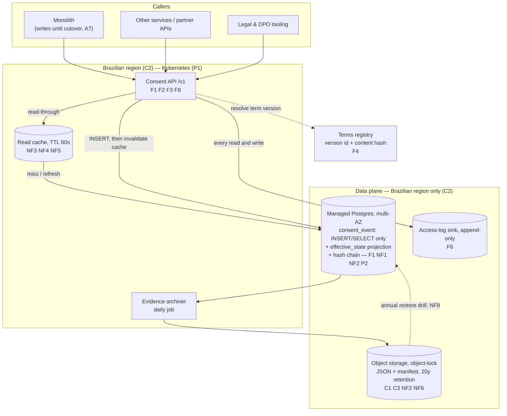
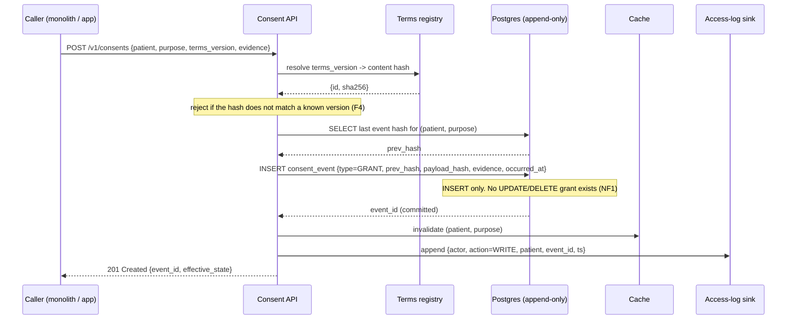
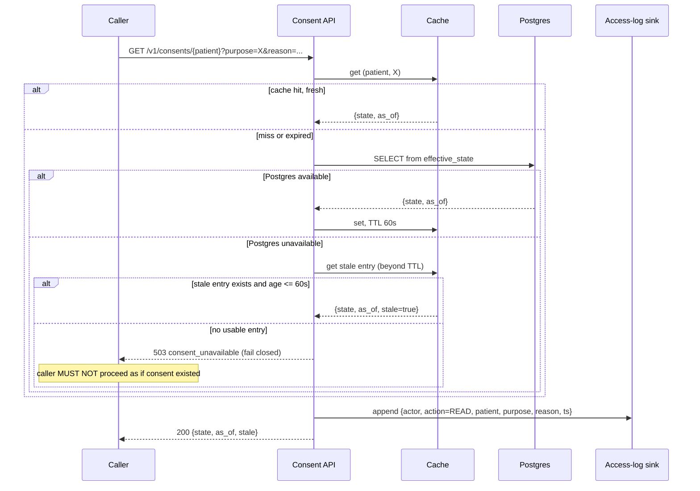

# RFC — Storage and serving of patient consent records

**Status:** draft — not approvable until the blocking questions in *Open questions* are answered
**Current working focus:** decision recorded; pending legal and platform confirmation
**Author:** Lucas Marques
**Date:** 2026-09-08

## Related documents

Nothing existed to reference when this was written. Before review, attach:

- the profiling report on the 4M JSON blobs in the monolith (field-completeness audit — see task T1);
- the platform team's 2025 standardization decision (the actual write-up, so we cite it rather than
  paraphrase it);
- the legal opinion establishing the retention period and the hosting-in-Brazil obligation, with the
  article and instrument each comes from;
- the versioned consent-terms corpus (every wording ever shown to a patient), or a statement that no
  such corpus exists.

---

## Context

Read this section assuming you have never seen the system.

**How things are today.** Patients grant consent for us to process their health data — consent to
treatment of data for a stated purpose, consent to share with a partner, and so on. Every one of those
grants is recorded by the monolith and stored in the monolith's MySQL database as a **JSON blob**: a
single text column holding an unstructured document, with whatever shape the code happened to write on
the day it was written. There are roughly **4 million of these rows**. There is no API in front of
them — anything that needs to know whether a patient consented reads the monolith's table, either
in-process or by querying the database.

**What changed.** Two independent things, arriving from opposite directions.

The first is legal. Consent records are not ordinary application data. Brazil's data protection law
(LGPD, Lei nº 13.709/2018) makes the controller *accountable* for demonstrating a lawful basis for
processing, and its art. 16 governs when personal data must be eliminated after processing ends — with
an explicit exception for data retained to comply with a legal or regulatory obligation. The sector
regulator's health-records rule supplies that obligation, and the period is **20 years**. Alongside it
we have been told the records must **stay hosted in Brazil**. Both of these are external and
non-negotiable — we do not get to design them away. A JSON blob in a shared monolith table that any
service can `UPDATE` is not a defensible way to hold a record we may be asked to produce, intact and
attributable, two decades from now.

The second is internal. In 2025 the platform team standardized: **new services run on Kubernetes and
use managed Postgres.** That decision exists to reduce the number of things the platform team has to
operate, and it is a real constraint on us in the ordinary sense that we should have a good reason to
deviate.

**Why the two directions matter.** These two things are not the same kind of statement, and the whole
document turns on keeping them apart. The retention period and the hosting location are **externally
imposed obligations**: if the design cannot meet them, the design is illegal, and no amount of internal
alignment fixes that. The Postgres-and-Kubernetes standard is an **internal decision by a peer team**:
it is excellent default guidance, it is revisable by the people who made it, and if it ever collides
with the legal obligations it is the standard that yields, not the law. Section *Requirements* therefore
files them in two different buckets, and section *The decision* states plainly the one condition under
which we would deviate from the platform standard.

**The problem to solve.** Decide where patient consent records live, how they are served, how they stay
readable and provable for 20 years, and how we get 4M existing blobs out of the monolith — without
losing the evidentiary value of a single one of them.

### What this is not

The temptation here is to treat the request as four independent deliverables ("a REST API", "a Postgres
migration", "an SLO", "an audit trail") and design each. They are not independent. The 20-year
obligation is what makes immutability non-optional; immutability is what makes the audit trail cheap;
the hosting constraint is what limits the availability topology; and the availability target is what
determines whether the API can read Postgres synchronously at all. The design below is driven by those
couplings.

### Out of scope

- **Consent enforcement.** This service records and serves consent state. Deciding whether a given
  processing operation is permitted — the policy decision point — stays with the callers. Merging the
  two would make every consumer's business logic a dependency of the record store.
- **Authoring the consent terms.** The wording shown to patients, and its approval workflow, belongs to
  a legal/content system. This service *references* term versions; it does not own them. (It does have
  a hard dependency on them existing and being versioned — see requirement F4.)
- **Patient-facing UI** for granting or revoking consent.
- **The rest of the monolith's data.** This is not a monolith decomposition programme; consent is being
  extracted because its legal profile is unusual, not as the first slice of a general migration.
- **Anonymization or pseudonymization of the consent record itself.** A consent record has to remain
  attributable to an identified person to prove anything, so LGPD's anonymization off-ramp (art. 16, IV)
  is unavailable for this dataset. Worth stating because it is a route people reach for.

### Labelled assumptions

This RFC was written without access to the people who could answer the questions in *Open questions*.
Every assumption below is load-bearing; each is marked where it is used, and each has a named owner who
must confirm or correct it before approval. **If an assumption marked (blocking) is wrong, the decision
in this document changes.**

| ID | Assumption | Owner | Blocking? |
| --- | --- | --- | --- |
| A1 | The platform's managed Postgres product is available in a Brazilian region, and we will use it. | Platform | **Blocking** — see *The decision* |
| A2 | The 20-year clock and the hosting obligation come from a specific, citable instrument, and the 20 years runs from the last entry on the record (not from collection). | Legal / DPO | **Blocking** — sets the archive retention policy |
| A3 | Cloud provider is one where the only Brazilian region has multiple availability zones but no second in-country region for cross-region DR. | Platform | **Blocking** — sets the DR ceiling |
| A4 | Consent event growth is ~1M events/year. | Product | No — volume is small under any plausible figure |
| A5 | Consent *reads* peak below 100/s. | Product / monolith owners | No — changes only the audit sink sizing |
| A6 | The existing 4M blobs are of unknown and uneven completeness; some will lack fields needed for proof. | Data / T1 spike | No — the design assumes the worst either way |
| A7 | The monolith continues to write consents until its callers are migrated. | Monolith owners | No — design supports it |
| A8 | 99.9% is a monthly target measured at the service's own edge. | Requester | No — stated as NF3 |

---

## Requirements

Split three ways, because the three kinds behave differently under pressure. **Constraints** are imposed
from outside and cannot be traded. **Requirements** are ours, concrete and checkable. **Preferences**
are strong defaults we should follow unless a constraint says otherwise.

### Constraints (external, non-negotiable)

| ID | Constraint | Consequence for the design |
| --- | --- | --- |
| C1 | Consent records retained **20 years** (A2). | The record must outlive ~4 Postgres major-version cycles and any single product SKU. Retention is a durability problem, not a storage-size problem. |
| C2 | Records **hosted in Brazil**. | Rules out any store, backup, replica, log sink, or managed service whose data plane leaves the country — including the audit sink and the observability platform if consent identifiers reach it. Also caps DR at what is available in-country (A3). |
| C3 | We must be able to **demonstrate** a lawful basis on request — produce the record, intact and attributable, for any patient, for any date in the last 20 years. | The record must be immutable and tamper-evident, and must pin the exact terms text the patient saw. This is the constraint the current JSON blob most clearly fails. |
| C4 | A patient's deletion request **cannot** remove the consent record, because it is retained under a legal obligation. | The API needs an explicit, auditable "retained under legal obligation" response path, not a silent failure. |

### Requirements

**Functional**

- **F1 — Record a consent event.** Grant, revoke, or supersede, for a (patient, purpose) pair.
  Append-only: a revocation is a new event, never an update to the grant. Verifiable by attempting an
  `UPDATE`/`DELETE` through every path and having it rejected.
- **F2 — Answer "is there consent right now".** Given patient + purpose, return the current effective
  state, in a single call, with the event that established it.
- **F3 — Produce the full history** of a (patient, purpose), and the evidence bundle for any single
  event, for legal or regulatory response.
- **F4 — Pin the terms version to every event.** Each event stores the identifier *and* the content
  hash of the exact terms wording presented. **This requirement is not in the original brief and is the
  most important addition in this document:** without it, in year 12 we can prove a patient clicked
  something, but not what they agreed to — which is not proof of consent. It is also why "terms
  authoring is out of scope" comes with a hard dependency attached.
- **F5 — Capture the evidence of the act:** UTC timestamp, subject identity, purpose, channel, actor
  (patient, or an operator acting on their behalf, named), and request-level evidence (source IP, user
  agent, or signature artifact). Also not in the brief; also required by C3.
- **F6 — Log every access.** Who read which patient's consent, when, on whose behalf, and for what
  stated reason. Append-only, queryable per patient.
- **F7 — Preserve the original blob verbatim** for every migrated record: byte-for-byte, as received
  from MySQL, alongside the normalized projection. Never "clean" a legal artifact — a cleaned blob is
  an altered record, and the alteration is not something we can prove was benign.
- **F8 — Versioned REST contract.** `/v1/...`, additive changes within a major version, and a written
  deprecation policy.

**Non-functional**

- **NF1 — Immutability enforced at the storage layer**, not by application convention. The application
  role holds `INSERT` and `SELECT` only; no role reachable from the service can `UPDATE` or `DELETE`
  consent events. Verified by a test that asserts the grant matrix.
- **NF2 — Tamper evidence.** Any alteration of a stored record, including by someone with database
  administrator rights, must be detectable after the fact. Enforced by hash-chaining events and by a
  copy in write-once storage the database role cannot reach.
- **NF3 — Availability 99.9% monthly, measured at the service edge** — 43.2 min/month, 8.76 h/year
  (A8). **Split by path, because the two paths fail differently:**
  - *Read path* (`GET` consent state) — 99.9%. This gates callers' request paths, so its failures are
    other teams' outages.
  - *Write path* (`POST` consent event) — 99.9%, with durability prioritized over availability: it is
    better to reject a write loudly than to accept one we cannot later prove.
  - *History/evidence endpoints* — 99.5% is sufficient. These serve legal response, measured in hours,
    not request paths.
- **NF4 — Bounded revocation staleness.** A revocation must be reflected on the read path within
  **60 seconds**, worst case, measured. This is the number that buys the read-path availability in NF3
  (see *Design*), and it is a compliance-relevant commitment, not a tuning knob: pick it with legal.
- **NF5 — Read latency p95 ≤ 50 ms, p99 ≤ 150 ms** at the service edge under 2× assumed peak (A5),
  validated by load test. Consent checks sit inside other services' request budgets, so a slow consent
  check is charged to them.
- **NF6 — Engine-independent archive format.** The 20-year copy is readable with no running database
  and no vendor: self-describing text (JSON) plus a manifest, in object storage. A `pg_dump` is not an
  archive — restoring it in 2046 requires a Postgres of a version that will be long unsupported.
- **NF7 — Observability**: structured logs with correlation IDs, OpenTelemetry traces across API and
  database, dashboards for the SLOs in NF3 and the staleness in NF4. Subject to C2 — see risk R-C2-1.
- **NF8 — Restore drill**: a documented, *rehearsed* procedure that reconstructs the serving store from
  the archive alone. Run at least annually; an untested 20-year archive is a 20-year assumption.
- **NF9 — Test coverage > 90%** on the domain, including an end-to-end test that grants, revokes, and
  asserts the effective state and the resulting audit records.

### Preferences (strong internal defaults)

- **P1 — Kubernetes** for compute (2025 platform standard).
- **P2 — Managed Postgres** as the primary store (2025 platform standard).

### What the brief asked for, and how it is filed

The request arrived as four objectives. Three of them named a solution rather than a requirement, so
they were re-filed. This is the analytical core of the document, not bookkeeping — each reclassification
opened a real question that the original framing hid.

| As requested | Filed as | Why |
| --- | --- | --- |
| "A REST API with versioning" | F8, plus **F4** | Kept, and cheap. But URL versioning is the *easy* versioning problem here. The hard one is versioning the consent terms and the record schema across 20 years, which the brief did not mention and which F4 now covers. |
| "Move to the managed Postgres the platform team standardized on" | **P2 (a preference), not a requirement** | This names a technology, so it is a candidate solution and belongs in the tradeoff analysis, not the requirements list. The requirement underneath it is *operability and standardization* — fewer bespoke things for the platform team to run. Filing it as a requirement would have meant the analysis could not ask whether it satisfies C2, which is the one question that could disqualify it. It is evaluated in *Alternatives* and it wins — conditionally on A1. |
| "99.9% availability" | NF3, **split three ways**, plus NF4 | A single number for the whole service hides that reads, writes, and legal-response endpoints have different consequences on failure, and it does not say what happens when the answer is unavailable. Splitting it surfaced the fail-open/fail-closed decision, which is the sharpest compliance question in the document. |
| "An audit trail" | **F1/F3 + F6 + platform logging — three different things** | "Audit trail" conflated three datasets with different retention, volume, and stores: (a) the *consent history* itself, which is the record, not an audit of it (F1, F3, retention 20y, ~24M rows); (b) the *access log* — who read whose consent (F6, retention TBD, and at A5's 100 reads/s this is **~3.2 billion records/year**, roughly 130× the consent data by row count); (c) *administrative and schema change* logs, which belong to the platform. Building one "audit table" would have put (b) in the same Postgres table as (a) and made the small, precious dataset a tenant of the enormous, disposable one. |
| — | **C3, NF1, NF2** (added) | Nothing in the brief said the records must be immutable or tamper-evident. The 20-year obligation is worthless without it: a record anyone can quietly edit proves nothing in year 12. |
| — | **F5, F7** (added) | Proof requires the evidence of the act, and requires not touching the original artifact. |

### Requirements explicitly rejected as not architecturally relevant

Named so nobody re-adds them later thinking they were forgotten:

- **Tiered hot/cold storage for size.** 4M rows now, ~24M after 20 years at A4, ≈ 46 GiB at a generous
  2 KB/row. That is a small single-instance database throughout the entire 20-year horizon. Any design
  that shards, tiers, or partitions *for volume* is solving a problem this dataset does not have. (The
  archive tier in the design exists for **evidence durability**, not size — a different justification,
  and the distinction matters because it changes what the archive has to do.)
- **Multi-region active-active.** Excluded by C2 under A3, and unnecessary for 99.9%.
- **Sub-10 ms reads.** Nobody asked, and it would drive a cache-first design with worse staleness
  properties than NF4 allows.

---

## Design

### The two facts that shape everything

**Fact 1 — 99.9% is not reachable by a synchronous chain of vendor SLAs.** Managed-Postgres HA SLAs are
typically 99.95% (99.99% for zone-redundant configurations on some vendors — confirm for the actual
product, Q1). Compose our own API at 99.95% with a store at 99.95% *synchronously* and the arithmetic
is:

```
0.9995 x 0.9995            = 0.99900   -> exactly the target, zero error budget
0.9995 x 0.9995 x 0.9995   = 0.99850   -> below target, once ingress is counted
```

A vendor SLA is a billing-credit commitment, not a prediction — and our measured availability also
includes our deploys, our migrations, and our connection-pool exhaustion. So the read path **must be
able to answer while Postgres is unavailable**. That is the entire reason a cache exists in this design;
it is not there for latency. And the moment we can answer from a cache, we have to say how stale an
answer may be — which is NF4, and why NF4 is a compliance commitment rather than a tuning knob.

**Fact 2 — the record must outlive the database.** 20 years is roughly four Postgres major-version
support cycles and longer than the lifetime of most managed database *products*. A design whose only
copy of the record is inside a specific managed Postgres has bet the legal obligation on a product
roadmap. Hence NF6: a second, engine-independent, write-once copy in Brazilian object storage, which is
also what satisfies NF2 (a copy the database role cannot reach) and C3.

### Components

Each component names the requirement that justifies it. Anything here without one would be cut.

| Component | Responsibility | Serves |
| --- | --- | --- |
| **Consent API** (Go or the team's default language, on Kubernetes) | Versioned REST surface; the only writer to the store | F1, F2, F3, F8, P1 |
| **Append-only event store** (managed Postgres, Brazilian region, multi-AZ) | `consent_event` — the system of record. `INSERT`/`SELECT` grants only | F1, F3, NF1, NF3, C1, C2, P2 |
| **Effective-state projection** (Postgres materialized view or maintained table) | Current state per (patient, purpose), so F2 is one indexed read, not a fold over history | F2, NF5 |
| **Read-through cache** (Redis or equivalent, in-region) | Answers the read path when Postgres is unreachable; TTL 60 s; invalidated synchronously on write | NF3 (read path), NF4, NF5 |
| **Hash chain** (`prev_hash`, `payload_hash` on each event) | Makes any post-hoc alteration or deletion detectable, including by a DBA | NF2, C3 |
| **Evidence archiver** (scheduled job) | Daily: serializes new events to self-describing JSON + manifest, writes to write-once object storage with a retention lock | C1, C3, NF2, NF6 |
| **Evidence archive** (object storage, Brazilian region, object-lock / compliance mode) | The 20-year copy of record. Immutable for the retention period, unreachable by the database role | C1, C2, C3, NF2, NF6 |
| **Access-log sink** (append-only log store / object storage, in-region) | High-volume "who read what" trail, deliberately *not* in Postgres | F6, C2 |
| **Migration pipeline** (one-off + CDC tail) | Moves 4M blobs, preserving each verbatim | F7, A7 |
| **Terms registry** (external; consumed, not owned) | Supplies term version ids and content hashes | F4 |

Explicitly **not** built: a ledger/blockchain database (see *Alternatives*), a separate audit service,
table partitioning at launch (revisit past ~100M rows), and any cold tier.

### Static diagram



### Dynamic diagram 1 — recording a consent grant (F1, F4, F5)



Order matters: the event is committed *before* the cache is invalidated and before the response, so a
crash anywhere after the `INSERT` leaves a durable, correct record with at most a stale cache entry that
expires within NF4's window. The reverse order could acknowledge a consent we did not store.

### Dynamic diagram 2 — checking consent, including the degraded path (F2, NF3, NF4)



Three deliberate decisions are visible here, and each is a commitment rather than an implementation
detail:

1. **Fail closed.** When we cannot establish consent, we say so and the caller must not proceed. Failing
   open — treating "unknown" as "consented" — converts our outage into an unlawful-processing incident,
   which is strictly worse than an outage. This needs legal sign-off, not just engineering agreement
   (Q6).
2. **Every response carries `as_of` and `stale`.** Callers can apply their own policy: a marketing send
   may accept a 60-second-old answer; a data-sharing operation may demand `stale=false`. We do not
   decide that for them — enforcement is out of scope — but we must give them the information to decide.
3. **The stale window is capped at NF4's 60 s, not at "whatever is in the cache".** An unbounded stale
   read is how a revoked consent gets honoured for an hour.

### Data model sketch

```
consent_event                          -- INSERT/SELECT only for the app role (NF1)
  event_id        uuid pk
  patient_id      text not null
  purpose         text not null
  event_type      text not null        -- GRANT | REVOKE | SUPERSEDE
  occurred_at     timestamptz not null -- when the patient acted
  recorded_at     timestamptz not null default now()
  terms_id        text not null        -- F4
  terms_sha256    bytea not null       -- F4: the wording, pinned by content
  actor           jsonb not null       -- F5: patient, or operator acting for them
  evidence        jsonb not null       -- F5: channel, source ip, user agent, signature
  source_blob     jsonb                -- F7: verbatim original, migrated rows only
  source_blob_sha bytea                -- F7: hash of the bytes as they left MySQL
  prev_hash       bytea                -- NF2: hash of the previous event for this (patient, purpose)
  payload_hash    bytea not null       -- NF2

effective_state                        -- projection, rebuildable from consent_event (F2, NF5)
  patient_id, purpose  pk
  state, as_of, established_by_event_id
```

`source_blob` is nullable *only* because natively-created events have no prior artifact; for every
migrated row it is mandatory, and the migration asserts it.

### Availability topology

- Managed Postgres, **multi-AZ within the single Brazilian region** (A3). This is the ceiling C2 allows:
  no cross-region replica, because a replica outside Brazil would put the record outside Brazil.
- DR within Brazil is therefore **backups plus the evidence archive**, not a warm standby in a second
  region. A full regional outage exceeds the 43.2 min/month budget and is an **accepted risk**, recorded
  as R-C2-2 — accepted because C2 outranks NF3, which is exactly the constraint-over-requirement
  ordering this document is built on.
- The read cache is what keeps ordinary Postgres unavailability (failovers, maintenance, upgrades) off
  the read-path SLO. Postgres failovers of 60–120 s are common; with the cache they are invisible to
  reads and only affect writes.
- Writes have no equivalent shelter, by choice: a write we cannot durably commit is a write we should
  refuse (NF3).

### Traceability

Every constraint and requirement lands somewhere; nothing in *Components* lacks a justification.

| ID | Met by |
| --- | --- |
| C1 (20 years) | Postgres retains all events (46 GiB at 20 years); evidence archive with retention lock; NF8 restore drill |
| C2 (Brazil) | Region pinning on Postgres, cache, object storage, access-log sink; no cross-region replica; observability scoped (R-C2-1) |
| C3 (demonstrate) | F3 endpoints, F4 terms pinning, F5 evidence, hash chain, archive |
| C4 (deletion refusal) | Documented `409 retained_under_legal_obligation` response with the citing instrument |
| F1 | Consent API + append-only event store + NF1 grants |
| F2 | Effective-state projection + cache |
| F3 | History and evidence endpoints reading `consent_event` |
| F4 | `terms_id` + `terms_sha256`, validated against the terms registry on write |
| F5 | `actor` + `evidence` columns, populated by the API |
| F6 | Access-log sink, written on every read and write |
| F7 | `source_blob` + `source_blob_sha`, asserted by the migration |
| F8 | `/v1` routing, additive-change and deprecation policy |
| NF1 | Database grant matrix, asserted by test |
| NF2 | Hash chain + archive outside the database role's reach |
| NF3 | Multi-AZ Postgres + read-through cache + per-path SLOs |
| NF4 | Cache TTL 60 s + synchronous invalidation on write + staleness dashboard |
| NF5 | Projection + cache + indexed `(patient_id, purpose)`; load test |
| NF6 | JSON + manifest archive format |
| NF7 | OTel + structured logs + SLO dashboards |
| NF8 | Annual rehearsed restore from archive |
| NF9 | Domain unit tests + grant/revoke E2E |
| P1, P2 | Kubernetes + managed Postgres, per the 2025 standard |

---

## Alternatives analysis (tradeoff)

Grouped by the dimension being decided. Each alternative is weighed against the constraints and
requirements above; an option that misses a **constraint** is disqualified regardless of its merits.

| Alternative | Pros | Cons | Risk (description) | Impact | Probability | Mitigation | Contingency |
| --- | --- | --- | --- | --- | --- | --- | --- |
| **[Store] D1-a Keep blobs in the monolith's MySQL, put a REST API in front** | No migration risk; no new datastore; fastest to an API; 4M rows stay where every current reader expects them | Fails C3 — the table stays mutable by the whole monolith, so the record proves nothing; fails NF1; couples a 20-year obligation to the monolith's release and upgrade cycle; contradicts P2 | Someone alters or deletes consent rows via existing monolith code paths, and we cannot tell | High | High | Would require revoking the monolith's write access to the table, which breaks it | None — this is why the option is rejected |
| | | | Monolith incident takes consent reads down with it | High | Medium | Nothing available short of extraction | None |
| **[Store] D1-b Managed Postgres (platform standard) as sole store — no archive** | Satisfies P2 and P1; append-only grants give NF1; one system to run; small dataset fits comfortably for 20 years | Fails NF6 and weakens NF2 — the only copy lives inside one managed product, and a DBA-level actor can alter it undetected; bets a legal obligation on a product roadmap and ~4 major-version upgrades | Vendor retires or renames the product, or forces a migration path we cannot take in-region | High | Medium | Engine-independent archive (this is what D2-b adds) | Emergency export under time pressure, mid-obligation |
| | | | Major-version upgrade over 20 years corrupts or subtly changes stored `jsonb` | High | Low | Hash chain detects it; but with no second copy there is nothing to restore from | None |
| **[Store] D1-c Managed Postgres + write-once object-storage evidence archive (recommended)** | Everything D1-b has, plus NF6, NF2 and C3 properly met; archive is cheap (tens of GiB) and readable with no database; gives NF8 something to drill against | Two stores to keep consistent; archiver is new code with its own failure modes; archive lag is a real window | Archiver silently stops; gap in the 20-year archive discovered late | High | Medium | Alert on archive lag > 24 h and on manifest row-count mismatch vs. Postgres; make the check a first-class SLO | Backfill from Postgres, which still holds all events; the gap is recoverable precisely because both copies exist |
| | | | Object-lock retention set wrong (too short, or too long to correct a genuine error) | High | Medium | Set lock from the legal opinion (A2/Q3), in writing; test the policy in a non-production bucket first | If too short: re-archive under a corrected policy. If too long: no remedy — hence "test first" |
| | | | Region has no second in-country region, so the archive shares a regional failure domain with Postgres | Medium | Low | Separate service (object storage vs. database) and separate credentials; cross-account copy within the region | Accept; C2 forbids leaving Brazil (see R-C2-2) |
| **[Store] D1-d Purpose-built immutable ledger database** | Cryptographic verifiability out of the box; append-only by construction — an exact fit on paper for C3/NF2 | Amazon QLDB reached end of support in 2025 (**verify — Q8**), so the obvious managed option is unavailable; alternatives are niche, with thin Brazilian-region availability (C2 risk) and no platform-team support (contradicts P1/P2); staff expertise near zero for a 20-year commitment | Choosing a niche store that is discontinued or unsupported inside the 20-year window | High | High | None that preserves the option's appeal | Migrate to D1-c under duress |
| | | | Product unavailable in a Brazilian region | High | Medium | Verify before committing | Disqualified by C2 |
| **[Store] D1-e Self-managed Postgres on the existing Kubernetes, in Brazil** | Satisfies C2 under any circumstance, including if A1 turns out false; full control of version cadence over 20 years | Contradicts P2; the platform team must operate a stateful workload it standardized away from; meeting NF3 needs operator-managed failover we would own | Operational burden lands on a team that did not sign up for it; availability worse than managed | Medium | High | Only adopt if A1 is false; if adopted, agree ownership in writing before build | Revisit when a Brazilian managed region exists |
| **[Retention] D2-a Everything in Postgres for 20 years, no second copy** | Simplest; volume genuinely supports it (~46 GiB) | Same NF6/NF2 failure as D1-b — this is the "it fits, so we are done" trap, and size was never the problem | Confusing "it fits" with "it is preserved" | High | Medium | State the distinction explicitly in the requirements (done: *Requirements explicitly rejected*) | — |
| **[Retention] D2-b Postgres (full history) + WORM archive for evidence (recommended)** | Serving and evidence separated by *purpose* rather than by age; no tiering, no partitioning, no cold path to get wrong; archive is engine-independent | Duplicate storage — irrelevant at this volume; archiver to build and monitor | Covered under D1-c | — | — | — | — |
| **[Retention] D2-c Hot Postgres window + cold tier, older records only in archive** | Smaller live database | Solves a volume problem that does not exist (A4 gives ~24M rows); adds a slow path to F3 exactly when legal is under a deadline | Complexity with no matching requirement; a legal request for a 15-year-old record hits an untested path | Medium | Medium | Reject the option | — |
| **[Audit] D3-a One `audit_log` table in the same Postgres** | Trivial to build; transactional with the write; one place to look | At A5 this is ~3.2 billion rows/year sharing an instance with 24M precious ones; index maintenance, vacuum and backup windows of the small dataset become hostage to the large one | Access-log growth degrades the consent store, or forces a retention purge that also touches consent data | High | High | Would need a separate instance — at which point it is D3-c | Emergency migration of the audit table off the instance |
| **[Audit] D3-b Database-native (`pgaudit` + logical decoding to an external sink)** | Catches direct database access the API never sees, including a DBA's; strong complement to NF2 | Does not capture *why* a read happened (F6 wants a stated reason), which only the API knows; log volume and rotation to manage | Coverage gap: API-level intent missing | Medium | High | Use as a *second* layer alongside D3-c, not instead of it | — |
| **[Audit] D3-c API-level append-only access log to a dedicated in-region sink (recommended, with D3-b as a second layer)** | Right volume profile for a log store; carries actor and reason (F6); keeps the consent instance small; independent retention policy | Two systems to query when investigating; the sink must satisfy C2, which rules out several SaaS log platforms | Chosen log platform processes or stores data outside Brazil | High | Medium | Confirm in-region data plane before adoption; prefer in-region object storage with a query layer | Fall back to in-region object storage + Athena-equivalent |
| | | | Access log becomes the de facto consent history because it is easier to query | Medium | Medium | Name the split in the API docs and the runbook; F3 endpoints are the only sanctioned history | Documentation and review |
| **[Availability] D4-a Single-AZ managed Postgres, synchronous reads** | Cheapest; simplest | Misses NF3: maintenance and failover alone can exceed 43.2 min/month, and the chain arithmetic above lands at 99.85% | SLO missed in the first month | High | High | Reject | — |
| **[Availability] D4-b Multi-AZ managed Postgres, synchronous reads, no cache** | Simple; no staleness question to answer; strongest consistency for revocations | Leaves zero error budget (0.9995 x 0.9995 = 0.99900) before counting ingress or our own deploys; every failover is a read-path outage | A single bad deploy or long failover breaches the monthly budget | High | High | Would require raising the target or lowering the chain length | Add the cache — i.e. D4-c |
| **[Availability] D4-c Multi-AZ + read-through cache with a 60 s bounded stale window (recommended)** | Read path survives Postgres unavailability; absorbs failovers and maintenance; also delivers NF5 | Introduces revocation staleness — a compliance-visible tradeoff, not a free win; cache is another in-region component under C2 | A revocation is honoured up to 60 s late and that window is legally material | Medium | Medium | Synchronous invalidation on write, so the window only applies when Postgres is *down*; publish `as_of`/`stale` on every response; get the 60 s agreed by legal (Q6, NF4) | Drop the stale-serving path and accept a lower read SLO; renegotiate NF3 rather than NF4 |
| | | | Cache is trusted beyond its window because of a bug in age checks | High | Medium | Age assertion in code plus a test that fails on unbounded staleness; alert on `stale=true` rate | Disable stale serving via a flag; degrade to fail-closed |
| **[Availability] D4-d Multi-AZ + cross-region replica for DR** | Survives a regional failure; the standard answer to this class of risk | **Disqualified by C2** if the second region is outside Brazil; under A3 no in-country second region exists | — | — | — | — | Re-evaluate if an in-country second region becomes available (Q1) |
| **[Migration] D5-a Big-bang: freeze writes, migrate 4M rows, cut over** | Single consistent point; no dual-write window | Requires a write freeze on a live monolith; if blob quality problems surface mid-migration (A6), the freeze extends under pressure | Migration reveals blobs that cannot form a valid record, with writes frozen | High | High | Profile the blobs first (T1) — which makes this option unnecessary | Roll back and take D5-c |
| **[Migration] D5-b Dual-write from the monolith to both stores** | Gradual; reversible per caller | Two writes to keep consistent, and a divergence in a *legal record* is the worst place for one; needs reconciliation to be trustworthy anyway | Silent divergence between MySQL and Postgres consent state | High | Medium | Continuous reconciliation on hash of the verbatim blob; alert on any mismatch | Treat MySQL as authoritative until reconciliation is clean |
| **[Migration] D5-c Backfill + CDC tail, monolith reads move to the API first, writes last (recommended)** | Read migration is safe and reversible; backfill runs with no freeze; CDC keeps the tail current; F7 preserved throughout | Longer coexistence; CDC on a JSON column needs care; MySQL stays the writer for a while (A7) | Incomplete or malformed blobs (A6) cannot be projected into a valid record | High | High | T1 profiling spike **before** committing a schema; quarantine table for unprojectable blobs; F7 keeps the verbatim original regardless, so nothing is lost even when projection fails | Record them with `state=UNKNOWN` and a documented legal position; re-collect consent from affected patients if legal requires |
| | | | CDC lag makes the new store stale during coexistence | Medium | Medium | Lag alert; keep the monolith authoritative for reads until lag SLO is met for 30 days | Point reads back at the monolith |
| | | | Cutover of writes leaves the monolith able to write directly to the old table | High | Medium | Revoke the monolith's write grant at cutover; assert it in CI | Reconcile and re-cut |

### Constraint-level risks (they apply to the whole design, not to one option)

| Risk | Impact | Probability | Mitigation | Contingency |
| --- | --- | --- | --- | --- |
| **R-C2-1** Observability or log SaaS ships patient identifiers outside Brazil, breaching C2 through a side door — the least visible way to fail this constraint | High | Medium | Audit every downstream of the service for data-plane region, not just the primary store; pseudonymize patient ids in traces and metrics; keep raw identifiers only in in-region sinks | Cut the exporter; re-issue a breach assessment with the DPO |
| **R-C2-2** Full regional outage in the single Brazilian region exceeds the 43.2 min/month budget, and C2 forbids the standard remedy | High | Low | Multi-AZ; separate archive credentials; rehearsed restore (NF8) | **Accepted risk.** Documented for the DPO and the SLO owner: C2 outranks NF3, so a regional event is a documented breach of the availability target, not a design defect |
| **R-A2-1** The legal basis for the 20 years and for the hosting obligation is not what we were told — for example the retention clock runs from a different event, or the hosting requirement comes from a contract rather than a regulation with different scope | High | Medium | Get the instrument cited in writing before setting the object-lock retention (Q2, Q3) | Re-archive under a corrected policy; a too-long lock cannot be shortened, so do not set it until Q3 is answered |
| **R-F4-1** No versioned corpus of consent terms exists, so historical events cannot be pinned to wording and C3 is unmeetable for records already collected | High | Medium | T1 profiling establishes what wording evidence exists; stand up the terms registry before, not after, the new write path | Record the best available reference plus an explicit "wording not recoverable" marker, and let legal decide whether re-collection is needed |

---

## The decision

**Chosen:** a new **Consent Service** on **Kubernetes** (P1), with an **append-only event model in
managed Postgres** in a **Brazilian region, multi-AZ** (P2, C2) as the system of record; a
**read-through cache with a 60-second bounded stale window** on the read path (D4-c); a **write-once
JSON evidence archive in Brazilian object storage** as the 20-year copy of record (D1-c / D2-b); an
**API-level access log to a dedicated in-region sink**, with `pgaudit` as a second layer (D3-c + D3-b);
and migration by **backfill plus CDC tail, reads before writes**, preserving every original blob
verbatim (D5-c).

**Why the platform standard survived.** The request framed "move to the managed Postgres the platform
team standardized on" as an objective. Filing it instead as a preference and testing it against the
constraints was the right move, and it changed nothing about the outcome — Postgres with `INSERT`-only
grants and a hash chain is a genuinely good fit for an append-only legal record, and the platform
standard adds operational leverage on top. But the reasoning is now on the record rather than assumed,
and so is its single condition.

**The one condition (A1).** The recommendation holds **if and only if** the platform's managed Postgres
is available in a Brazilian region. If it is not, C2 outranks P2 and the decision changes to **D1-e**:
self-managed Postgres in-country on the existing Kubernetes, with the operational burden negotiated with
the platform team in writing. A regulatory obligation is not tradeable against an internal
standardization decision, and the platform team's own decision-makers would not want it to be. **Q1
must be answered before build starts.**

**What would flip other parts of the decision:**

- If legal cannot accept a 60-second revocation staleness (Q6), drop stale-serving and renegotiate
  **NF3 downward** — do not weaken NF4. A lower availability number is a cost; honouring a revoked
  consent is an incident.
- If measured consent reads exceed ~1,000/s (A5, Q7), the access-log sink needs redesign, though the
  consent store does not.
- If legal requires notary-grade proof of time (ICP-Brasil timestamping, RFC 3161 — **verify**), the
  archiver must timestamp each daily bundle with an accredited authority. This adds a dependency but
  does not change the architecture.
- If a second Brazilian region becomes available, revisit D4-d and lift the R-C2-2 accepted risk.

**Strongest objection to the recommendation, stated at its best.** *You are building a separate service,
a second store, an archiver, a cache and a migration pipeline for 4 million rows — about 46 GiB after
twenty years — that a single well-configured table could hold. Every component is another thing to
operate and another way to lose data.* That objection is correct about the volume and it is the reason
this document explicitly rejects tiering, partitioning, sharding and a ledger database. The components
that remain are not there for scale: the **archive** exists because the record must outlive the database
engine (NF6) and be beyond the reach of the database role (NF2); the **cache** exists because the SLO
arithmetic makes a synchronous chain unable to reach 99.9%; the **append-only model** exists because a
mutable consent record proves nothing. Remove any of the three and a *constraint* fails, not a
preference. If someone can meet C1, C2, C3, NF2 and NF3 with less, that design is better than this one
and should replace it.

**Decision style: autocratic**, by the service's tech lead, with mandatory consultation of the DPO/legal
(C1–C4, NF4) and the platform team (A1, P1, P2). Not democratic: the binding inputs are legal
obligations and another team's operational ownership, neither of which is settled by a vote. **This
document is not approved until Q1, Q2, Q3 and Q6 have written answers** — those four are the ones that
can change the design.

---

## Launch strategy

Sequenced so the risky and irreversible steps come after the cheap ones that de-risk them, and so
nothing is one-way until the evidence is in.

**Phase 0 — Answer the blocking questions (no code).** Q1 (managed Postgres in a Brazilian region), Q2
and Q3 (the legal instrument, the clock, the retention lock), Q6 (fail-closed and the 60 s window). Plus
**T1**, the blob-profiling spike. Phase 0 exists because building before these are answered risks
building the wrong thing, and the object-lock retention in particular is not correctable in one
direction.

**Phase 1 — Write path, dark.** Service, schema, grant matrix, hash chain, `/v1` write and read
endpoints, access log. No production traffic. Exit criteria: NF1 grant matrix test passes; an
`UPDATE`/`DELETE` attempt is rejected on every path; NF9 coverage met.

**Phase 2 — Backfill + archive.** Migrate 4M blobs with F7 preservation; unprojectable rows to
quarantine with a legal position attached; archiver running; first **restore drill** (NF8) executed
before any caller depends on the service. An archive nobody has restored from is not yet an archive.

**Phase 3 — Reads migrate.** Move monolith and service read paths to `/v1`, one caller at a time, behind
a flag, with the monolith still authoritative. Enable the cache and measure NF3/NF4/NF5 under real
traffic. Exit criteria: 30 days at read SLO, staleness within NF4, CDC lag within SLO.

**Phase 4 — Writes cut over.** The monolith writes through the API. **Revoke the monolith's write grant
on the MySQL table** and assert it in CI — this is the step that makes the new store authoritative, and
skipping the revocation is how a "migration" becomes permanent coexistence.

**Phase 5 — Decommission.** MySQL consent table to read-only, retained until legal confirms the archive
plus Postgres satisfies C1, then dropped. **Named end date, agreed in Phase 0** — this is the guard
against an eternal migration.

## Tasks and roadmap

Estimates are rough and unvalidated with the team; treat them as shape, not commitment.

| Task | Description | Estimate |
| --- | --- | --- |
| **T1 — Blob profiling spike** | Field-completeness audit of the 4M blobs: which have terms reference, timestamp, purpose, subject id, evidence. Output: distribution and a projectability rate. **Gates the schema.** | 3d |
| T2 — Legal alignment | Written answers to Q2/Q3/Q5/Q6; the citable instrument; the retention-lock value | 5d (elapsed, not effort) |
| T3 — Platform alignment | Confirm A1/A3, region, HA topology, vendor SLA, in-region log sink options | 2d |
| T4 — Service skeleton | Kubernetes deployment, config, observability wiring (NF7), hexagonal layout | 3d |
| T5 — Schema + grant matrix + hash chain | Migrations, `INSERT`/`SELECT`-only role, chain computation, grant-matrix test (NF1, NF2) | 5d |
| T6 — Write and read endpoints `/v1` | F1, F2, F5, F8, with `as_of`/`stale` in every response | 5d |
| T7 — Terms registry integration | F4: resolve and validate `terms_id` + content hash; reject unknown versions | 3d |
| T8 — History and evidence endpoints | F3, plus C4's `retained_under_legal_obligation` path | 3d |
| T9 — Access log sink | F6, in-region, append-only; `pgaudit` second layer | 4d |
| T10 — Cache + bounded staleness | D4-c, synchronous invalidation, age assertion, staleness dashboard (NF4) | 4d |
| T11 — Evidence archiver | Daily JSON + manifest, object lock, lag and row-count alerts (C1, NF6) | 5d |
| T12 — Restore drill | Rebuild the serving store from archive alone; write the runbook (NF8) | 3d |
| T13 — Backfill pipeline | 4M rows with F7 preservation and quarantine handling | 5d |
| T14 — CDC tail + reconciliation | Blob-hash reconciliation, lag SLO, alerting | 5d |
| T15 — Caller migration | Reads per caller behind flags; then write cutover and grant revocation | 8d |
| T16 — Load test | NF5 at 2× assumed peak; NF3 verified through an induced failover | 3d |

## Open questions blocking approval

Q1–Q3 and Q6 are blocking. All are restated with context in the accompanying reply.

1. **Q1 (blocking)** Which cloud and which managed Postgres product, and is it available in a Brazilian
   region? Is there a second in-country region? — *decides A1/A3, and whether P2 survives at all.*
2. **Q2 (blocking)** What instrument imposes hosting in Brazil? LGPD does not itself require data
   localization — art. 33 permits international transfer under stated conditions — so C2 most likely
   comes from the sector regulator, a contract, or internal policy. We need the source to know its
   scope, including whether it covers backups and logs.
3. **Q3 (blocking)** Is the 20 years from the sector rule the one we think it is, does it cover consent
   records specifically, and does the clock run from collection, from revocation, or from the last entry
   on the record? — *sets the object-lock retention, which cannot be shortened once set.*
4. **Q4** Retention for the access log (F6), which is separate from the 20 years and much larger.
5. **Q5** Does a versioned corpus of consent terms exist for wording already shown to patients?
6. **Q6 (blocking)** Is fail-closed correct, and is a 60-second worst-case revocation staleness
   acceptable? Who signs that off?
7. **Q7** Actual consent read rate and peak.
8. **Q8** Confirm the QLDB end-of-support date cited in D1-d before publishing.
9. **Q9** Does anything today read the raw JSON blob shape directly, outside the monolith's own code?
10. **Q10** Who owns this service, and what is the agreed decommission date for the MySQL table?

## Version history

| Version | Date | Author | Description |
| --- | --- | --- | --- |
| 0.1 | 2026-09-08 | Lucas Marques | Document created. Draft; blocking questions Q1, Q2, Q3, Q6 unanswered. |
