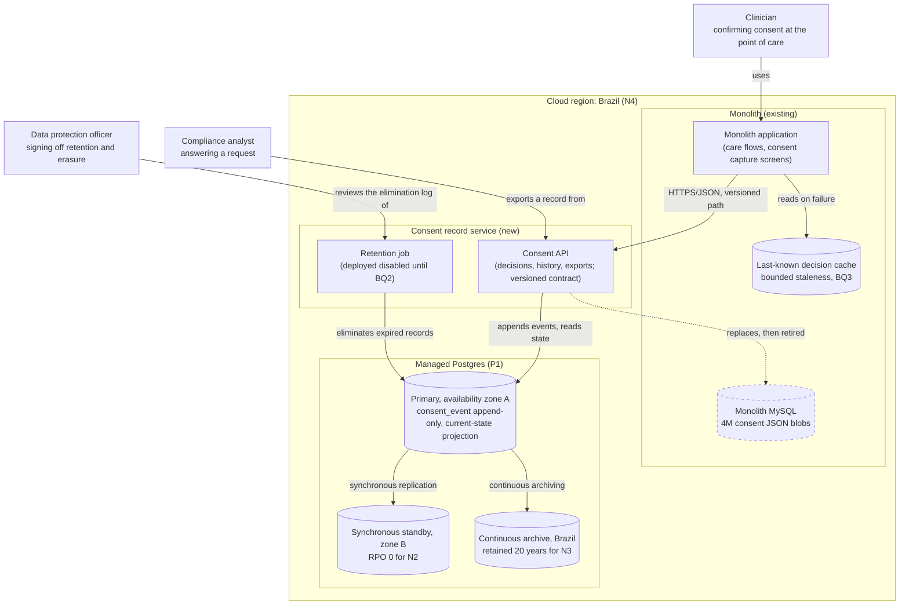
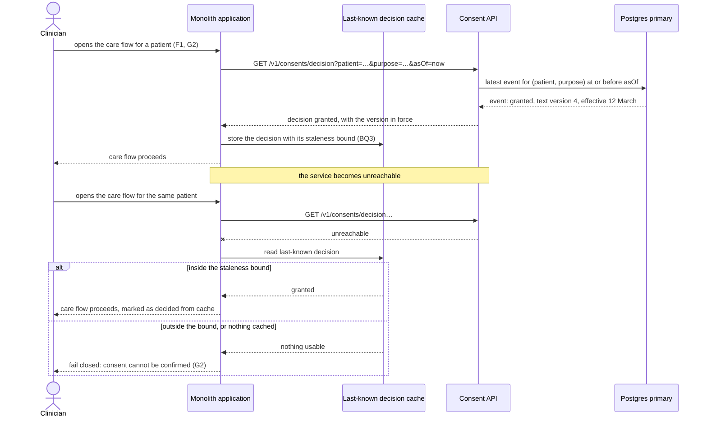
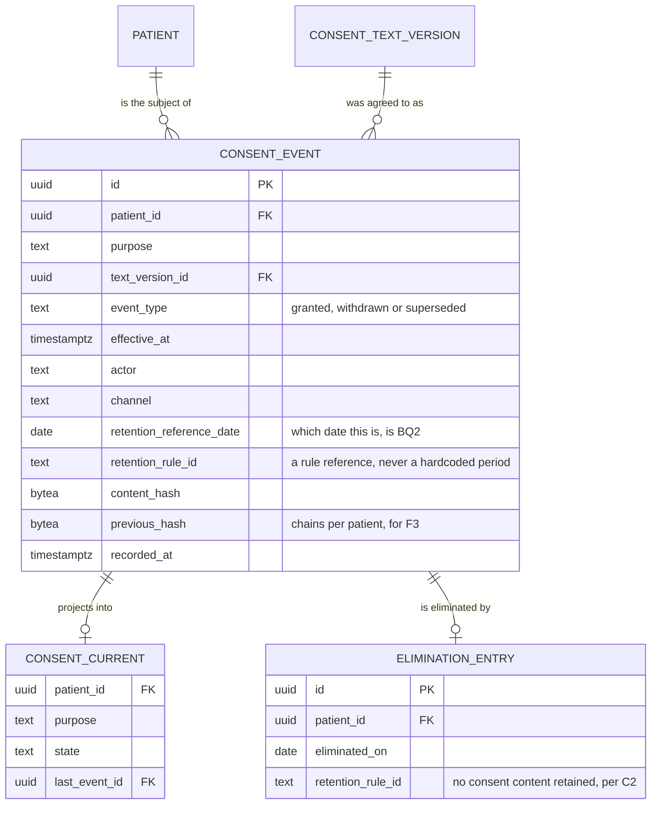
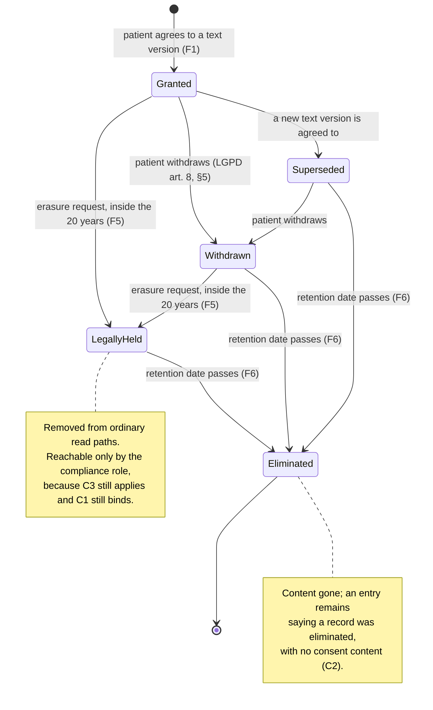

# RFC: Where patient consent records live, and how a consent can be proved for twenty years

**Status:** proposed — held there by two blocking questions (BQ1 residency source, BQ2 the retention clock's reference date)
**Decider:** the engineering lead who will own the consent domain · **Approver on the compliance requirements:** the data protection officer (*encarregado*, LGPD art. 41) · **Reviewers:** platform team, monolith maintainers, clinical operations lead
**Current working focus:** decision

---

## Reversibility

**One-way door**, on three of the four dimensions this document decides.

The **data model** is one: once four million consent records are migrated into a shape, and the
organization starts answering regulators out of that shape, changing it means re-migrating records it
is legally obliged to keep. The **retention and deletion posture** is one: a record deleted early
cannot be recovered, and the twenty-year duty runs to at least 2046 for anything recorded today. The
**read contract** is one in practice: once the monolith's care flows block on a network call to this
service, the call is in the critical path of care delivery and cannot be quietly withdrawn.

The **runtime** (where the service process runs) is a two-way door: moving a stateless service between
container platforms is a redeployment, and it gets proportionally less space below.

---

## Context

Patient consents are stored today as JSON blobs in a table inside the monolith's MySQL database, about
4 million rows (stated in the request, undated, no query attached; ***assumed***. `SELECT count(*)` on
the table plus one row of `information_schema.tables` would confirm the count and the size in under a
minute). Nothing else about the current state was supplied, and there was no database, dashboard or
repository available to this analysis, so every figure below is labelled for how it is known and the
unknowns are named rather than filled in.

The size does not drive this decision. At an assumed 1 KB average blob, 4 million rows is about 4 GB
(4 × 10⁶ × 1 KB; ***estimated*** from an assumed row size), and a versioned model that keeps one row
per change instead of one row per consent roughly doubles that. No option in this analysis is excluded
on volume; the pressure comes from the twenty-year duty and from what a JSON blob cannot prove.

**What a JSON blob cannot do.** A blob holds whatever the writing code put in it, in whatever shape
that version of the code used. Three consequences follow, and each of them is the real problem.

It cannot answer *what was in force on a date*. If a patient consented in March and withdrew in
August, and in November a regulator asks under which consent a procedure performed in June was
carried out, the current blob holds the current state. Whether the previous states survive depends
entirely on whether the monolith code happened to append instead of overwrite — which nobody in this
analysis could check (***assumed***; `SELECT` on any history or audit table in the monolith schema, or
a `grep` for the update statement, would settle it).

It cannot be shown unaltered. Under LGPD art. 8, §2 the burden of proving that consent was validly
obtained sits on the controller. A row in a table that the application can `UPDATE` is evidence that
the controller can rewrite, which is exactly the property a regulator has no reason to accept.

It cannot be queried by purpose. Finding every patient who granted consent for a given purpose, or
every consent whose retention has expired, means reading and parsing 4 million blobs.

**And the twenty-year duty sits inside the monolith's lifecycle.** A record that must survive until
2046 is stored in a database whose retirement, re-sharding or migration is decided by the monolith's
roadmap, not by the retention duty.

### Current usage

| Role (what they do with the system) | What they do today | Through what | How often or how much (source) |
| --- | --- | --- | --- |
| Patient granting or withdrawing consent | Agrees to a consent text, and may withdraw it later (LGPD art. 8, §5 gives them that right at any time) | The monolith's consent screens | Volume unknown. The write rate over the last 90 days would come from a `created_at`/`updated_at` histogram on the table (***assumed***: nobody has run it) |
| Clinician confirming consent before delivering care | Reads the current consent state from the monolith's own screen | The monolith, reading its own MySQL table in-process | Unknown. Today it is an in-process read, so it does not appear in any API metric (***assumed***) |
| Consuming application asking whether a patient consented | Reads the blob, or the monolith reads it on the caller's behalf | In-process, inside the monolith | Unknown. How many callers exist is the single most useful unknown, and a `grep` for the table name across the monolith would answer it (***assumed***) |
| Compliance analyst answering a data-subject or regulator request | Assembles the answer by hand from the blob and from whatever the monolith logged | Direct database access | Unknown. LGPD art. 19, II caps the response at 15 days for a clear and complete declaration, which is the deadline the role works against |
| Data protection officer accountable to the ANPD | Signs off that retention, deletion and proof of consent are being met | Reports assembled by the analyst above | Continuous obligation |
| On-call engineer when a consent read fails | Diagnoses inside the monolith, where a consent failure looks like any other monolith failure | Monolith logs | Unknown; there is no separate consent error rate today (***assumed***) |

**The problem, stated as the gap.** The roles above need three things the current store cannot give
them: the consent state as of a past date (the clinician's June procedure, the regulator's November
question), proof that a record was not rewritten (art. 8, §2), and a home whose lifetime is at least
as long as the twenty-year duty. What they get is a mutable blob whose history is incidental and whose
storage is coupled to the monolith's roadmap.

### Goals

| Goal | Who benefits | How we will know |
| --- | --- | --- |
| **G1** A patient can find out what they agreed to, and when, including after they withdraw it | Patients; the compliance analyst who answers for them | Every data-subject request about consent is answered inside the deadline the role works against, from the record alone and with no manual reconstruction (request log kept by the analyst) |
| **G2** A clinician never delivers care under a consent that is absent or withdrawn | Patients; clinicians; the organization's liability | No care event found, in review, to have been delivered against a withdrawn or missing consent (clinical incident review) |
| **G3** The organization can prove to a regulator that a consent was validly obtained, for any record it still holds | The data protection officer; the organization | A regulator or auditor accepts an export produced from the record with no supporting narrative (audit outcome) |
| **G4** Consent records outlive the monolith, this team, and whatever they are stored in today | Patients whose records must survive to 2046; whoever maintains this in ten years | A record written today is still readable and provable after the store's next major-version upgrade (annual restore-and-read drill) |
| **G5** Erasing a patient's data on request does not destroy what the law obliges the organization to keep, and keeping it does not become an excuse to keep everything | Patients exercising erasure; the data protection officer, who is accountable for both duties | Every erasure request is either fully executed or answered with the specific record retained and the clause that retains it (erasure request log) |

### Stakeholders

| Role (what they do with the system) | What they need from this decision | Who speaks for them |
| --- | --- | --- |
| Patient granting, withdrawing and asking about consent | Their withdrawal takes effect, and their history stays retrievable and honest | The data protection officer |
| Clinician confirming consent at the point of care | A trustworthy answer, and a defined thing to do when no answer comes back | Clinical operations lead |
| Consuming application asking for a consent decision | A contract that does not break under it when the service changes | The engineering lead owning the consent domain |
| Compliance analyst answering requests | The full history of one patient's consents, exportable, without hand-assembly | Head of compliance |
| Data protection officer accountable to the ANPD | Retention, erasure and proof of consent demonstrably met, and the minimum data kept to do it | Themselves |
| Sector regulator and the ANPD inspecting the records | Records kept for the statutory period, and consent provable | Nobody inside; represented through the data protection officer |
| Platform team operating the runtime and the database | A service and a database on the standards they operate, with an owner | Platform team lead |
| Monolith maintainers, who lose the table and gain a dependency | The care flow not made more fragile than the in-process read it replaces | Monolith tech lead |
| On-call engineer diagnosing a failed consent read | A failure they can attribute and a documented fail-mode | The engineering lead owning the consent domain |

The monolith maintainers are the **negative stakeholders** here: this decision takes a local, in-process
read that cannot fail independently and turns it into a network call that can. Their objection is real
and is answered in the Design and recorded in the Decision.

### Constraints

Externally imposed limitations only. Each row cites the clause, and only these rows may exclude an
option.

| Constraint | Source (outside the organization) | What it excludes, and the clause |
| --- | --- | --- |
| **C1** Patient records must be kept for a minimum of 20 years from the last entry, after which they *may* be eliminated | Lei 13.787/2018, art. 6: "Decorrido o prazo mínimo de 20 (vinte) anos a partir do último registro, os prontuários em suporte de papel e os digitalizados poderão ser eliminados." Art. 6, §1 allows a regulation to set different periods, so 20 years is a floor that can be raised | Excludes any store or plan whose retention horizon is shorter than 20 years, any design in which an ordinary erasure request can delete a record inside the window, and any hardcoded retention period (art. 6, §1 can move it) |
| **C2** Personal data must be eliminated once processing ends; retention beyond that is authorized only for the listed purposes, the first being compliance with a legal or regulatory obligation | LGPD (Lei 13.709/2018) art. 16, *caput* and item I | Excludes keeping consent records indefinitely, and excludes retaining fields beyond what C1 and C3 require. Note what this clause does **not** say: art. 16 does not impose the 20 years, it *permits* keeping data in order to comply with a duty that comes from elsewhere — C1 |
| **C3** The controller bears the burden of proving that consent was obtained in conformity with the law | LGPD art. 8, §2: "Cabe ao controlador o ônus da prova de que o consentimento foi obtido em conformidade com o disposto nesta Lei" | Excludes any design in which the consent state in force at a past moment cannot be reconstructed, and any design in which the ordinary application role can rewrite or delete a recorded consent |
| **C4** Confirmation of and access to personal data must be provided immediately in simplified form, or within 15 days as a clear and complete declaration | LGPD art. 19, I and II | Excludes a design in which answering "what did this patient consent to, and when" requires manual reconstruction that cannot be completed inside 15 days |
| **C5** *(source contested — see BQ1)* Every copy of the data, including replicas, backups and exports, resides in Brazil | Asserted in the request as coming from LGPD art. 16 plus the sector regulator's health-records rule. **Neither of those clauses says it.** Art. 16 is the elimination rule quoted in C2; LGPD arts. 33–35 *permit* international transfer under conditions (adequacy, or contractual guarantees proved by the controller), which is the opposite of a localization mandate. The binding source, if there is one, is a contract, a sector-specific rule or an internal policy that nobody has cited yet | **If binding:** excludes any store or standby outside Brazil, which removes cross-region failover from the availability options and excludes a consent-management vendor hosted abroad. **If it is internal policy:** it is a prior decision, not a constraint, and both of those options come back. Carried as ***assumed*** with the requester as its origin, pending BQ1 |

### Prior decisions

Decided by people inside the organization. None of these excludes an option. Each incumbent has a row
in the tradeoff table with at least one alternative beside it, and the cost of reversing it is a cost
in that row.

| Prior decision | Who made it, when | Incumbent it implies | Cost to reverse |
| --- | --- | --- | --- |
| **P1** All new services use Postgres and Kubernetes | Platform team, 2025 | Managed Postgres as the store; the platform's Kubernetes cluster as the runtime | **Store: high.** Postgres is what the platform team can operate, back up, patch and restore; a second database engine needs an owner for twenty years, which is longer than the standard is likely to last. **Runtime: low.** A stateless service can be moved between container platforms in a redeployment |
| **P2** Consents are stored as JSON blobs in the monolith's MySQL | Whoever built the feature, undated (***assumed***; `git log` on the migration that created the table would date it) | The monolith's MySQL | **Medium**, and it is what this document proposes to pay: 4 million rows migrated, plus every in-monolith read repointed |
| **P3** The service is reached through a versioned REST-over-HTTP contract | The requester, in this request (2026-09) | HTTP/JSON endpoints with an explicit version | **Low** while the only consumer is the monolith and both are deployed by the same organization; **high** once external or mobile clients are pinned to it |

Two items from the request are neither constraints nor prior decisions and are recorded where they
belong: **"99.9% availability"** is an unanchored non-functional target, restated as N1 below with its
derivation missing and labelled; **"an audit trail"** names a mechanism, and the capability under it
is F3, whose source is C3.

### Assumptions and open questions

**Blocking.** Any answer changes the decision. The status stays *proposed* while either is open.

| Question | Owner | Date | If yes | If no |
| --- | --- | --- | --- | --- |
| **BQ1** Does the Brazil-residency requirement (C5) come from a binding external source — a contract, a sector-specific rule, an ANPD ruling — rather than from internal policy? *Recommended answer: treat it as binding until legal says otherwise, because the cost of assuming it wrongly is a data transfer that cannot be undone.* | Data protection officer, with legal | Before the store is provisioned | C5 stays a constraint. Availability is met inside one Brazilian region with a synchronous standby in a second availability zone; the hosted consent-management option is excluded; the archive stays in-country | C5 moves to the prior decisions table. A cross-region standby and a hosted vendor re-enter the tradeoff, and N1 becomes cheaper to meet |
| **BQ2** Does the 20-year clock (C1) run from the last entry on the **patient's record as a whole**, as the wording of Lei 13.787/2018 art. 6 suggests, or from the last change to the **consent** itself? *Recommended answer: the patient record as a whole, which is the conservative reading and the one the text supports.* | Data protection officer, with legal | Before the deletion job is built | The consent service cannot compute its own expiry: it needs the patient record's last-entry date from whoever owns the chart, and until that exists it deletes nothing. That is a dependency this document does not currently design | Each consent version expires 20 years after its own last change, and the service computes expiry alone |

**Non-blocking.** Proceeding without proof, each with what would close it.

- The row count (4 million), the storage size and the write rate are ***assumed***, with the requester
  as origin. Three queries against the monolith's table close all three, and none of them changes the
  decision — volume is not a driver here.
- How many places read consents today is unknown (***assumed***). A `grep` for the table and model
  name across the monolith closes it. It does not change the choice of store; it changes the migration
  plan's size, which is why the migration task below is estimated as a range.
- No availability, latency or error-rate measurement of the current consent read exists
  (***assumed***: it is an in-process read and therefore invisible to API metrics). This is why N1's
  target has no derivation and is labelled as the requester's number, and why this document sets no
  latency target at all: inventing one with no baseline would be a number nobody could argue with.
  The first month after cutover measures both.
- Whether the current blobs preserve any history is unknown (***assumed***). If they do not, the
  migrated record starts from the current state and the record's own history begins at cutover — which
  is a compliance fact the data protection officer must know before an audit, not a technical detail.

### Out of scope

Problems this document does not solve. Every *option* considered appears in the tradeoff table, including the ones that lose.

- **The wording and legal sufficiency of the consent texts themselves.** Owned by the data protection
  officer. This service records which text version a patient agreed to; it does not judge the text.
- **The consent capture experience.** The screens stay where they are, in the products that own the
  patient relationship.
- **Retention of the rest of the patient record.** C1 covers the whole chart; this document covers
  consents only, and BQ2 is where the two meet.
- **Consent for marketing and commercial contact.** A different legal basis and a different
  lifecycle; putting it in the same store would be a decision, and it is not this one.

---

## Requirements

Only the architecturally relevant ones: hard to reverse, structure-shaping, or a cross-cutting quality
with a target.

**What was reclassified, and why.** None of the four objectives in the request survives as a
requirement in the form it arrived.

*Objective 2, "move to the managed Postgres the platform team standardized on"*, is a prior decision
(**P1**) made inside the organization in 2025. It is a good one and it is very likely to win, but it
wins in the tradeoff table with managed MySQL and an append-only ledger beside it, and with the twenty-year
cost of a second engine written down — not by arriving as a given.

*Objective 1, "a REST API with versioning"*, is a mechanism. The capability underneath it is **F4**:
a consumer already integrated keeps working when the contract changes. REST is one way to deliver
that; consent events on the platform bus and a shared library are two others, and all three are in
the table.

*Objective 3, "99.9% availability"*, is a target with no metric, no condition and no derivation. It is
restated as **N1** with the requester as its source and the target labelled ***assumed***, and it
brings a second requirement with it — **N2**, recoverability — because the availability of a service
whose data cannot be recovered is not the property anyone actually wants here.

*Objective 4, "an audit trail"*, is the mechanism whose capability is **F3**: a compliance analyst can
prove who recorded or changed a consent, when, and that the export was not altered since. Its source is
not a preference for logging; it is **C3**, the controller's burden of proof.

Two requirements are added that nobody asked for. **F5** and **F6** exist because C1 and C2 pull in
opposite directions — one obliges the organization to keep records for twenty years, the other obliges
it to eliminate them once the reason to keep them ends — and a design that implements only one of them
fails an audit in one direction or the other. The role they serve is the data protection officer, who
is accountable for both, and the goal is G5.

### Functional

| ID | Goal | Requirement (the role, and what the system does for it) | Proof (the scenario, and how it is run) | Source |
| --- | --- | --- | --- | --- |
| **F1** | G2 | A consuming application, and the clinician acting through it, can obtain the consent state for a patient and a purpose **as of any moment**, not only now | *Given* a patient who granted consent on 12 March and withdrew it on 3 August, *when* a caller asks for the state as of 20 June, *then* the answer is "granted" and identifies the consent text version in force on that date; *when* it asks as of 1 September, *then* the answer is "withdrawn" with the withdrawal timestamp. Run as a fixture suite over data shaped like the migrated production set, in CI | C3; the regulator's June-procedure question in Context |
| **F2** | G1 | A patient, through the compliance analyst or a self-service path, can obtain every version of their consents: the text version agreed to, when, through which channel, and which actor recorded it | *Given* a patient with three consents and five changes across them, *when* the analyst requests the patient's consent history, *then* one response contains all eight states in chronological order with no manual assembly. Run as an end-to-end test, and timed against C4's 15 days in the first quarterly compliance drill | C4; the analyst's hand-assembly in Context |
| **F3** | G3 | A compliance analyst can export any consent version in a form that shows who recorded or changed it, when, from which actor and channel, and that the export has not been altered since it was written | *Given* a regulator asking the organization to prove consent X was validly obtained, *when* the analyst exports it, *then* the export carries the text version, timestamp, actor, channel and an integrity value that recomputes from the stored record; *and given* a row altered directly in the database, *when* the integrity check runs, *then* it fails and names the record. Run as an integrity test in CI plus a tamper drill before launch | C3 (LGPD art. 8, §2) |
| **F4** | G4 | A consumer integrated against the contract in force keeps receiving responses it can parse after a new contract version ships, until its migration window closes | *Given* a consumer built against the current version, *when* a new version ships with an added field and a renamed one, *then* the old consumer's requests still succeed and its assertions still hold. Run as a contract suite in CI, executing the previous version's tests against the current deployment | P3; the monolith as the first pinned consumer |
| **F5** | G5 | An operator handling an erasure request (LGPD art. 18, VI) can remove the patient's consent data from every ordinary read path while the records held under C1 remain intact and reachable only by the compliance role | *Given* a patient requesting erasure whose consents are 4 years old, *when* the operator executes the request, *then* the consent API returns "not available" to ordinary callers, the record is still exportable by the compliance role, and the response to the patient cites C1 and the date the record becomes eligible for elimination; *and given* a patient whose consents are all past their retention date, *then* the records are eliminated outright. Run as an end-to-end test per branch, reviewed by the data protection officer before launch | C1 and C2 in tension; G5 |
| **F6** | G5 | An operator can eliminate a consent record once its retention duty has expired, and the elimination is itself recorded without retaining the eliminated content | *Given* a record whose retention date has passed, *when* the elimination job runs, *then* the record's content is gone, an entry remains stating that a record for that patient was eliminated on that date under that rule, and the entry contains no consent content. Run as a scheduled-job test with a fixed clock, in CI | C2 (LGPD art. 16, *caput*) |

### Non-functional

| ID | Goal | Requirement (metric, target, condition) | Derived from | Proof (measurement) | Source |
| --- | --- | --- | --- | --- | --- |
| **N1** | G2 | Successful responses to the consent-decision read, as a share of all such requests measured at the caller, at or above **99.9% per calendar month**, under the request rate observed in the first month after cutover | **Nothing.** The figure came from the request with no current measurement behind it, and none exists, because the read is in-process today and invisible to API metrics. 99.9% permits about 43 minutes of unavailability in a 30-day month (0.001 × 30 × 24 × 60 = 43.2 min; ***estimated***). Target labelled ***assumed***, origin: the requester | Monthly availability computed from the caller's own success and failure counters, not the service's — a service that is up while unreachable is not available to a clinician | The requester (objective 3) |
| **N2** | G3, G4 | **Zero** committed consent versions lost in any single-node or single-availability-zone failure (recovery point objective 0), and service restored within **10 minutes** of such a failure | RPO 0 is not a preference: a committed consent version that is lost is a record the controller can no longer prove (C3) and no longer holds (C1), so there is no loss level below which the outcome is merely degraded. RTO 10 min is derived from N1's budget — four independent failovers of 10 minutes fit inside the 43.2-minute monthly allowance (4 × 10 = 40 ≤ 43.2; ***estimated***) | Quarterly failover drill in the production topology: kill the primary, measure data loss by comparing committed writes before and after, and measure time to recovery | C1, C3, and N1's arithmetic |
| **N3** | G4 | Every consent version remains readable and its integrity verifiable for **at least 20 years** from its retention reference date, across store major-version upgrades and backup-format changes | C1's twenty-year floor (Lei 13.787/2018 art. 6). A record written in 2026-09 must be readable in 2046-09. Postgres major versions receive about five years of community support, so a twenty-year record outlives roughly four upgrade cycles (***assumed***: the versioning policy should be confirmed against the project's published schedule before the archive format is fixed) — which is why the requirement is on the record's readability, not on the store's | Annual restore-and-read drill: restore the oldest archive into a current-version store, read a sampled record, recompute its integrity value. Run every year, with the result filed by the data protection officer | C1 |
| **N4** | G5 | Every copy of consent data — primary, standby, backup, archive and export destination — resides in Brazil | C5, whose binding source is contested (BQ1). If BQ1 answers "internal policy", this requirement is renegotiable and N1 gets cheaper | An automated policy check over the infrastructure definition, failing the deployment if any storage or replica resource is outside a Brazilian region; plus a quarterly review of export destinations | C5 (***assumed***) |
| **N5** | G1, G3 | **100%** of the consent rows in the monolith's MySQL table are accounted for after migration: each is either present in the new store with its meaning preserved, or on an exception list reviewed and signed by the data protection officer | About 4 million rows (***assumed***, from the request), each one a record the organization may have to prove (C3) and must keep (C1). A migration that silently drops rows converts a data-quality problem into a compliance failure, so the target is the whole set rather than a percentage | Reconciliation report before the read switch: row counts per state, field-level comparison on a random sample of 10,000 rows, and every parse failure enumerated on the exception list. Gate: the read switch does not happen while the list is unreviewed | C1, C3; the 4M rows in Context |

**No latency target is set.** There is no current measurement to derive one from and no stakeholder has
committed to a number. The load run in the launch plan measures the read path first, and the target is
set from that measurement plus the clinical operations lead's tolerance — which is the same
conversation as BQ3 in the Design below. A target invented here would be a number nobody could argue
with, and it would be enforced for twenty years.

---

## Design

Solving the requirements above with technology, dimension by dimension, and nothing more.

### The data model: versions, not state

A consent is stored as an **append-only sequence of consent events** — granted, withdrawn, superseded
by a new text version — and the current state is derived from that sequence rather than stored beside
it. This is the choice that answers F1 and F3, and it is the reason the JSON blob has to go: a blob
holds state, and every requirement in this document is about history.

Concretely: `consent_event` is written once and never updated. Each event carries the patient, the
purpose, the consent text version, the event type, the moment it took effect, the actor who recorded
it and the channel it came through. The state as of any date (F1) is the latest event for that patient
and purpose with an effective time at or before that date. Current state, which is what most callers
actually want, is a materialized projection kept beside the events and rebuildable from them; if the
projection and the events ever disagree, the events win, and that ordering is what makes the projection
safe to optimize later.

**The append-only property is enforced by the database, not by the code.** The application's database
role is granted `INSERT` and `SELECT` on `consent_event` and nothing else: no `UPDATE`, no `DELETE`.
Elimination under F6 runs as a separate role, used by one scheduled job, with its own credentials and
its own audit. A rule the application *could* break is not the evidence C3 asks for.

**Integrity is chained per patient.** Each event stores a hash of its own content together with the
hash of the previous event for that patient. An export (F3) carries the chain, so recomputing it shows
whether anything between the two ends was altered or removed. This is what turns "an audit trail" into
something a regulator can check rather than something the organization asserts. It is deliberately
modest: it detects tampering by anyone without database-level write access to rewrite the whole chain,
and it does not defend against an attacker who has that. Making it stronger means an external anchor
(a signed digest published outside the database), which is a task in the roadmap, not a requirement
yet, because no stakeholder has asked to defend against that adversary.

### Retention, erasure and elimination

Every event is written with a **retention reference date** and a **retention rule identifier**, and the
elimination date is computed from them rather than hardcoded — because Lei 13.787/2018 art. 6, §1 lets
a regulation move the period, and this store will outlive the current period's wording (C1, F6).

Which date is the reference is exactly BQ2, and the design is honest about it: until BQ2 is answered,
the reference date column is populated with the consent's own last-change date and the elimination job
is **deployed disabled**. Nothing is eliminated by a job whose reference date might be wrong, and
nothing needs to be: the earliest possible elimination for a record migrated today is 2046.

An erasure request (F5) moves the patient's identifying fields into a restricted table reachable only
by the compliance role and marks the events as legally held. Ordinary callers get "not available";
the compliance analyst can still produce the export C3 requires. This is precisely the shape LGPD
art. 16, I authorizes: the data is kept, but only for the duty that justifies keeping it, and not for
the ordinary business use that has ended.

### The store and the runtime

**Managed Postgres in a Brazilian region, with a synchronous standby in a second availability zone,**
and continuous archiving to storage in the same country. Synchronous replication is what gives N2 its
RPO of 0; two availability zones are what N1 needs and are as far as N4 allows the topology to spread.
This follows prior decision P1, and the tradeoff table records what it cost to consider the
alternatives: the twenty-year cost of asking the platform team to operate a second engine is the
argument that carried it, not the standard's existence.

The service itself runs on the platform's Kubernetes cluster (also P1, and the cheap half of it). It is
stateless; the decision worth making about it is how many replicas, not which platform.

### The contract, and how consumers survive its changes

HTTP/JSON with the major version in the path, and an **additive-only change policy** within a version:
fields may be added, never removed or retyped, and a breaking change means a new version served
alongside the previous one for a stated window. F4's proof is the mechanism that keeps this honest —
the previous version's contract tests run against every deployment, so a breaking change fails the
build rather than a consumer.

### Moving four million rows

The migration is part of the design rather than an afterthought, because N5 makes it a compliance
artefact: every existing row is either in the new store with its meaning preserved or on an exception
list the data protection officer has signed. Each blob is parsed into one `granted` event carrying the
best timestamp available in the blob, and every blob that cannot be parsed into that shape goes on the
list with the reason — no blob is dropped, and no meaning is guessed.

The monolith **dual-writes** during the transition and stays authoritative until the read switch, so
the store that a clinician depends on is only ever swapped after the reconciliation report is signed.
The one thing this cannot recover is history the blobs never kept: if the current rows hold only the
latest state, then the record's own history begins at cutover, and that is a fact the data protection
officer needs before an audit rather than a footnote in a migration ticket.

### The point-of-care read, and what happens when it fails

This is where the monolith maintainers' objection lands, and it deserves a direct answer. Today's
consent read cannot fail on its own; after this decision it can. Two things absorb that.

The consumer keeps a **last-known decision cache** with a bounded staleness, and the fail-mode is
different for the two failure kinds. A consent that is *absent* fails closed: no record, no care, which
is the answer G2 requires. A service that is *unreachable* falls back to the cached decision within
its staleness bound, and outside that bound it fails closed too. A withdrawal therefore takes effect
within the staleness bound rather than instantly, and that bound is a clinical safety question rather
than an engineering one:

**BQ3 (non-blocking, owner: clinical operations lead):** how stale may a consent decision be at the
point of care, and what should a clinician do when no answer is available? *Recommended answer: 5
minutes of staleness, fail closed beyond it.* It is non-blocking because the cache is a consumer-side
choice that can be tuned after launch without touching the store — but until it is answered, N1's
99.9% is being asked to carry a clinical risk that a cache would carry better and more cheaply.

### Static view

*Figure 1. C4 container diagram of the target state, at container level. Answers F1, F2, F3, F4, F6, N1, N2, N3, N4.*

### Dynamic view

*Figure 2. Sequence diagram at container level, for "clinician confirms consent at the point of care", including the failure branch. Answers F1, N1, and the monolith maintainers' objection.*

### Data view

*Figure 3. Entity-relationship diagram of the tables this decision creates. Answers F1, F2, F3, F6, N3, N5.*

### Lifecycle view

*Figure 4. State diagram of one consent record. Answers F1, F5, F6, and shows where C1 and C2 meet.*

Every requirement ID appears in this section, and every component above names the requirements it
serves. The two checks run in opposite directions and catch different mistakes: a requirement nothing
implements, and a component nothing asked for.

---

## Alternatives analysis (Tradeoff)

### Decision drivers, in priority order

1. **C1, C2 and C3** — the twenty-year floor, the elimination duty and the burden of proof. These are
   veto criteria: an option that cannot prove a past consent state, or cannot keep a record for twenty
   years, or cannot eliminate one when the duty ends, is out regardless of everything else.
2. **N4 / C5, conditionally** — residency vetoes options only if BQ1 says it is binding. Every row
   below that turns on it says so, so the table can be re-read against either answer.
3. **F1 and F3, the one-way door on the data model.** Once 4 million records are in a shape and
   regulators are answered out of it, the shape is what the organization has.
4. **N2 over N1.** Losing a consent record is a compliance failure; being briefly unable to read one is
   an incident. Where the two compete, durability wins.
5. **The twenty-year cost of ownership**, which is longer than any current platform standard is likely
   to last, and which is why "who can operate this in 2036" carries more weight here than in most
   decisions.
6. **The migration risk on 4 million rows** (N5), and the fragility this decision adds to a care flow.

Note what is *not* a driver: that the platform team standardized on Postgres. That is P1, a prior
decision, and it appears as a **cost in the rows below** — high for the store, low for the runtime —
rather than as a reason.

### What every option shares

Every option keeps consent capture where it is today (out of scope), keeps the records inside the
organization's own control except where a row says otherwise, and treats the consent text versions as
data the service references rather than owns. Two shared elements needed accounting for, and both
produced a row:

- Every option the request implied was **"build a service"**. A **bought consent-management platform**
  is the option nobody proposed, and it is row **E** below. It is the honest test of whether this is a
  problem worth building for.
- Every option the request implied was **Postgres**, from P1. **Managed MySQL** — keeping the engine
  the data is already in — is row **B**, and the baseline row keeps the data exactly where it is.

| Alternative | Requirements (met / partial / missed, by ID) | Pros | Cons | Risk | Impact | Probability | Mitigation | Contingency |
| --- | --- | --- | --- | --- | --- | --- | --- | --- |
| **A. [Store] Managed Postgres, append-only events, synchronous standby in a second zone, Brazil region** *(P1's incumbent)* | met: F1–F6, N2, N3, N4, N5; partial: N1 (achievable in one region across two zones, but the target itself is unanchored — see the N1 row) | Relational history queryable by purpose and by date; append-only enforced by database privileges, which is what C3 wants; the platform team already operates, patches, backs up and restores this engine; no second engine to own for twenty years | The full 4M-row migration (N5); a new network dependency in a care flow; the team must hold the discipline that the projection never becomes the source of truth | A twenty-year record outlives roughly four Postgres major-version cycles, and an archive written today may not restore into the 2046 store | High: the record becomes unprovable exactly when it is needed (C1, C3) | Medium: the upgrade path is well-trodden, but nobody tests a twenty-year-old archive | N3's annual restore-and-read drill, filed by the data protection officer; archive format reviewed at every major upgrade | Export the archive to an engine-neutral format (one file per patient, with the hash chain) and keep that beside the database dump |
| | | | | The append-only rule is bypassed by a migration script or an incident fix that runs as a privileged role | High: one `UPDATE` destroys the property C3 depends on | Medium: privileged access exists and incidents create pressure to use it | Application role has `INSERT`/`SELECT` only; elimination runs as a separate role with its own audit; a policy check in CI asserts the grants | Chain verification detects it after the fact and names the record; the incident is reported to the data protection officer as a compliance event |
| **B. [Store] Managed MySQL, same append-only model** *(the alternative to P1)* | met: F1–F6, N2, N4, N5; partial: N3 (achievable, but a second engine's twenty-year operability depends on an owner the platform team has not committed) | The data is already in MySQL, so migration is a schema change rather than a cross-engine move — materially less migration risk on 4M rows; the model works as well here as in Postgres | Reverses P1 at its expensive half: a second engine needs someone to patch, back up, restore and upgrade it for twenty years, and the platform team's tooling and on-call runbooks do not cover it | A second engine loses its owner within the retention window | High: an unowned database holding legally mandated records | Medium-high: twenty years is longer than most platform standards survive, and longer than most team compositions | Written twenty-year ownership commitment from the platform team before choosing this | Migrate to the standard engine later, which is this same migration paid later and with more rows |
| **C. [Store] Postgres for current state, append-only ledger or write-once object storage for history** | met: F1, F3, N3, N4; partial: F2 (history spans two stores, so one query becomes two), F6 (elimination from write-once storage is the hard case), N5 (reconciliation across two stores); missed: none outright | Write-once storage is the strongest available answer to C3: the tamper resistance is a property of the medium, not of a privilege grant | Two stores to keep consistent, which is the class of bug the current two-source situation already demonstrates; C2's elimination duty fights write-once media directly — art. 16 obliges elimination, and the medium is designed to prevent it | Elimination under F6 becomes impossible on the write-once side, turning C3 compliance into C2 non-compliance | High: failing a legal duty in the opposite direction | High: it is inherent to the medium, not incidental | Per-record encryption with key destruction as the elimination mechanism (crypto-shredding), which the data protection officer would have to accept as "elimination" | Fall back to option A's privilege-enforced append-only, which is where this analysis lands anyway |
| **D. [Store] Keep the monolith's MySQL, add a proper schema and history tables in place** *(P2's incumbent, and the smallest change that would work)* | met: F1, F2, F3 (with the same model applied in place), N5 (no migration at all); partial: N2, N3, N4 (inherited from the monolith's database, whatever they are — nobody measured); missed: F4 (no contract to version), G4 (the records' lifetime stays coupled to the monolith's roadmap) | By far the cheapest and least risky; no migration, no new dependency in the care flow, no new runtime; delivers the history and the proof, which is most of the compliance value | The twenty-year duty stays inside a database whose retirement, re-sharding or migration is decided by the monolith's roadmap; every consumer keeps reaching into another service's table | The monolith's database is restructured or retired for reasons unrelated to consent, inside the retention window | High: a forced, unplanned migration of legally mandated records under someone else's timetable | Medium-high: twenty years of monolith roadmap | None available within this option; it is the option's defining cost | The migration this document proposes, executed later under time pressure |
| **E. [Buy] Hosted consent-management platform** | met: F1, F2, F3, F4; partial: F5, F6 (the vendor's retention model must be shown to implement C1 and C2, and the burden of proof stays with the controller regardless — C3); missed: N4 if the vendor hosts outside Brazil and BQ1 says C5 binds | Someone else's problem to operate, and consent management is a solved product category with audit features built for exactly this | A twenty-year dependency on a vendor's continuity, pricing and export format; the controller's burden of proof (C3) cannot be delegated with the data; residency depends entirely on BQ1 | The vendor is acquired, repriced or shut down inside the retention window | High: a forced export and migration of legally mandated records | Medium over twenty years | Contractual export guarantee in a documented format, exercised annually rather than promised | Import the export into option A, which means having built option A's model anyway |
| **F. [Contract] Versioned HTTP/JSON endpoints** *(P3's incumbent)* | met: F4, and F1–F3 as the access path | Universally consumable; the previous version's contract tests are a cheap and effective gate; the monolith can adopt it without new infrastructure | A synchronous dependency in the care flow, which is what the monolith maintainers object to | A consent read outage becomes a care-delivery outage | High: care blocked | Medium: N1 permits 43 min/month of it | The last-known decision cache with an explicit fail-mode (BQ3), which is what makes the clinical outcome better than N1 alone | Fail closed, and the clinician follows the paper procedure the clinical operations lead defines |
| **G. [Contract] Publish consent events on the platform bus; each consumer keeps its own read model** *(the alternative to P3)* | met: F1, F2 (inside each consumer's copy); partial: F3 (each copy is a place a consent can be misreported, and C3's burden sits on the original), F4 (schema versioning moves to the event payload, which is the same problem in a place with fewer tools); missed: nothing outright | No synchronous dependency in the care flow; consumers read locally, which is closest to today's behaviour and answers the maintainers' objection directly | Every consumer holds a copy of sensitive health data (LGPD art. 11), multiplying the surfaces subject to C1, C2 and N4; a withdrawal takes effect only as fast as the slowest consumer | A withdrawal is not honoured by a lagging consumer, and care is delivered against a withdrawn consent | High: the exact failure G2 exists to prevent | Medium: consumer lag is normal operation, not an incident | Bounded staleness with a consumer-side deadline, which is the cache in option F wearing a different hat and with more copies to govern | Consumers fall back to a synchronous read, i.e. option F |
| **H. [Runtime] The platform's Kubernetes cluster** *(P1's cheap half)* | met: N1 (with more than one replica) | The platform team operates it; no exception to request; nothing about it is hard to reverse | Pays for capacity at a request rate nobody has measured yet | The replica count is sized against an unmeasured load | Low: the service is stateless and rescaling is routine | Medium: the load is genuinely unknown | Size from the first month's measurement rather than from a guess | Rescale, which costs a deployment |
| **I. [Runtime] A managed container runtime outside the cluster** *(the alternative to P1's runtime half)* | met: N1 | Scales without the team sizing replicas; no cluster capacity to reserve for an unmeasured load | Reverses P1's runtime half, which needs a platform exception review; a second runtime for the on-call runbook to cover | The exception review delays a launch that the compliance drivers, not the runtime, are pacing | Low: the delay is weeks and the deadline is not external | Medium: the review's duration is not known to this analysis | Ask for the exception in parallel with phase 1 rather than after it | Deploy on the cluster, i.e. option H, which costs a pipeline change |
| **Baseline: do nothing — consents stay as JSON blobs in the monolith's MySQL** | met: nothing in this document; missed: F1, F2, F3, F4, F5, F6, N3, N5 | Zero effort, zero migration risk, and the care flow keeps a read that cannot fail on its own | Cannot reconstruct a past consent state, so C3's burden of proof cannot be discharged; cannot enumerate expired records, so C2's elimination duty is not being performed; an erasure request risks deleting records C1 obliges the organization to keep | A regulator or a data subject asks a question the records cannot answer | High: the burden of proof is on the controller (LGPD art. 8, §2), so an unanswerable question is a finding | Medium-high over twenty years, and it takes only one request | None available without the work this document proposes | None |

Note what the table says about the favoured option. Option A is *partial* on N1 for a reason worth
reading twice: the availability target it is being judged against has no derivation, and options D and
G both do better on the clinician's actual experience by not putting a network call in the care flow at
all. Option A wins on the compliance drivers and on the twenty-year ownership question — not on
availability, where the honest answer is that the cache in option F is doing more for G2 than the third
nine is.

---

## The decision

**Store patient consents as an append-only sequence of consent events in a managed Postgres instance in
a Brazilian region, with a synchronous standby in a second availability zone and a twenty-year archive
in-country; serve them from a new consent record service on the platform's Kubernetes cluster behind a
versioned HTTP/JSON contract; and have the monolith keep a last-known decision cache with an explicit
fail-closed rule.** Options A, F and H.

The drivers that carried it, in the order they mattered:

C3's burden of proof and C1's twenty-year floor eliminated the baseline and option D outright: neither
can reconstruct a past consent state or survive the monolith's roadmap, and no amount of cheapness
compensates for a record the organization cannot prove. Between A and B, the deciding factor was not
the platform standard but the twenty-year ownership question — B is genuinely the lower-risk migration,
and it lost because nobody would commit to operating a second database engine until 2046. C lost to C2:
write-once media and a legal duty to eliminate are in direct conflict, and resolving it with key
destruction is a compliance argument the organization would have to win rather than a property it would
have. E lost to a twenty-year vendor dependency that C3 does not let the organization delegate anyway.
G lost because it multiplies the copies of sensitive health data subject to C1, C2 and N4, and because
a lagging consumer produces exactly the failure G2 exists to prevent. H beat I on nothing more than
the absence of a reason to pay for an exception review: the runtime is the two-way door here, and a
two-way door should be decided cheaply and revisited if the load says otherwise.

**Decision style: autocratic, with one approval gate.** The engineering lead owning the consent domain
owns the call, having consulted the platform team (P1's cost), the monolith maintainers (the care-flow
dependency) and the clinical operations lead (the fail-mode). The data protection officer is the
**approver, not a consultee**, on C1–C5, F5, F6 and N3: those are their accountability, and the
engineering lead cannot overrule them.

*(The role names above are placeholders. Nobody was named to this analysis, and the decision is not
final until real names sit in those slots — recorded here rather than left to be inferred.)*

### Stakeholder conflicts

- **The requester asked for the platform's managed Postgres as a given; it was made to compete.** P1
  is a prior decision, not a constraint, so it entered the tradeoff table with managed MySQL beside
  it. It won, and the twenty-year ownership argument in its row is a better reason to hold it than the
  standard's existence — but had the platform team committed to operating MySQL until 2046, option B's
  materially smaller migration risk on 4 million rows would have been hard to refuse.
- **The requester asked for 99.9% availability; this document declines to treat that number as
  settled.** It is carried as N1 with the target labelled *assumed* and no derivation, because none
  exists. The recommendation is to derive it from BQ3's answer instead, and the analysis says plainly
  that the cache is doing more for the clinician than the third nine.
- **The requester's stated source for the residency and retention rules was wrong in a way that
  changes the option space.** LGPD art. 16 does not impose twenty years — it is the elimination rule
  that *permits* keeping data in order to comply with a duty from elsewhere, and that duty is Lei
  13.787/2018 art. 6. LGPD imposes no localization requirement at all; arts. 33–35 permit
  international transfer under stated conditions. Residency is therefore carried as C5 with its source
  contested, and BQ1 must resolve it, because if it is internal policy then two rejected options come
  back and N1 gets cheaper.
- **The monolith maintainers objected to a network dependency in a care flow, and they are right.**
  Overridden by C1 and G4 — the records must outlive the monolith — and answered rather than dismissed:
  the cache and the explicit fail-modes in Figure 2 exist because of this objection.
- **F5 and F6 were added against nobody's request.** The role they serve is the data protection
  officer, and the goal is G5. Without F6 the organization would be quietly failing LGPD art. 16 in
  the opposite direction from the one everyone worries about.

### Consequences

Consent history becomes a first-class, queryable thing: "what was in force on this date" and "which
records have expired" become one query each, and the class of question the compliance analyst currently
answers by hand goes away. The proof of consent stops being an assertion and becomes something a
regulator can recompute.

In exchange, the care flow gains a dependency that can fail, and the organization gains a cache whose
staleness bound is a clinical safety parameter that someone must own. The team takes on a database
whose append-only property is enforced by privilege grants, which means every migration script and
every incident fix now has a rule it must not break — and a CI check asserting the grants, because a
rule enforced by discipline is not enforced.

Two long obligations start now rather than later: the annual restore-and-read drill (N3), which is the
only thing standing between a 2026 archive and a 2046 store, and a retention job that stays disabled
until BQ2 is answered. And the monolith's consent table gets retired, which removes the only place
the records can currently be silently rewritten.

### Residual risks

The hash chain detects tampering by anyone who cannot rewrite the whole chain. It does not defend
against someone with database-level write access, and the mitigation for that adversary — a signed
digest anchored outside the database — is a roadmap item rather than part of this decision, because
nobody has yet said that adversary is in scope.

The twenty-year archive is the risk no drill fully retires: the annual restore proves last year's
format, not 2046's. The contingency is an engine-neutral export beside the database dump, and it is
the part of this decision most likely to need revisiting.

N1's target remains unanchored. If the first month's measurement shows the read is far more or far less
reliable than 99.9%, the requirement moves, and this document should be amended rather than quietly
ignored.

Finally, BQ2's answer may make elimination impossible for the consent service alone. If the retention
clock runs from the patient record's last entry, this service cannot compute its own expiry dates and
needs a dependency on whoever owns the chart — a component this document does not design.

### Confirmation

Four checks, three of them automated:

The **CI policy check** on the database grants is the fitness function for the whole append-only
argument: if the application role ever acquires `UPDATE` or `DELETE` on `consent_event`, the build
fails. The **residency policy check** fails any deployment placing a storage or replica resource
outside a Brazilian region (N4). The **previous version's contract tests** run against every
deployment (F4). And the **annual restore-and-read drill** (N3) is filed by the data protection officer
with a date and a result, because it is the one check no build can perform.

Measured first, because they were assumed: N1's availability, computed at the caller from the first
full month after cutover, and the read path's latency, from the same month — that measurement is what
sets a latency target, in an amendment to this document.

Reviewed: **at the read switch** (N5's reconciliation report, signed by the data protection officer),
**one month after cutover** (N1 and latency against measurement), and **annually thereafter**, or
sooner if BQ1 or BQ2 is answered in the direction that reopens options.

**Status: proposed.** BQ1 and BQ2 are open, and BQ1's answer can reopen two rejected options while
BQ2's can invalidate the retention design. Recommending a store above an unresolved legal question
would be hoping, not deciding.

---

## Launch strategy

Four phases, with a defined end.

**Phase 1 — the store and the record, no consumers.** Provision the Postgres instance with its standby
and archive, create the schema of Figure 3, and set the grants. Backfill all 4 million rows and produce
N5's reconciliation report. Nothing reads from the new store yet, and the monolith is untouched, so
this phase carries no risk to care delivery. It ends when the data protection officer signs the
reconciliation report and its exception list.

**Phase 2 — dual write, monolith still authoritative.** The monolith writes to both stores and keeps
reading its own. A daily divergence check compares them. This is where the write path's bugs surface
while the old store is still the one the clinician depends on.

**Phase 3 — read switch behind a flag, per consumer.** The cache and its fail-modes ship with the
first consumer. Each consumer moves individually, and the flag is the rollback. N1's measurement starts
here.

**Phase 4 — retire.** Stop the dual write, drop the monolith's consent table (after an archived dump
kept under C1 like any other copy), and delete the code that read it. **The migration ends here**, and
the date is a task with an owner — a dual write left running is how a two-store problem becomes
permanent, which is the situation this document exists to leave behind.

## Tasks and roadmap

| Task | Description | Estimate |
| --- | --- | --- |
| Answer BQ1 and BQ2 | Legal opinion on the residency source and on the retention clock's reference date. Gates the status and the retention job | 1–2 weeks elapsed, not engineering time |
| Measure the current state | Row count, table size, write rate, and a `grep` for every reader of the consent table in the monolith. Replaces four *assumed* labels in this document with measurements | 1d |
| Schema, grants and the hash chain | Tables of Figure 3, the `INSERT`/`SELECT`-only application role, the elimination role, and the CI policy check on the grants | 4d |
| Postgres provisioning | Instance, synchronous standby in a second zone, archive to in-country storage, residency policy check in CI | 3d |
| Consent API, version 1 | Decision read with `asOf` (F1), patient history (F2), compliance export with the chain (F3), and the contract test harness (F4) | 8d |
| Backfill and reconciliation | Migration of ~4M rows, the reconciliation report, and the exception list for the data protection officer (N5) | 5–10d, the range because the number of readers is unknown |
| Dual write and divergence check | Monolith writes to both stores; daily comparison | 4d |
| Erasure and elimination | F5's restricted-access path, F6's elimination job (deployed disabled), and the elimination entry | 5d |
| Consumer cache and fail-modes | Last-known decision cache with the staleness bound from BQ3, fail-closed rule, and the branch tests of Figure 2 | 4d |
| Drills | The N2 failover drill and the first N3 restore-and-read drill, run once before launch and then on their cadences | 3d |
| Retirement | Drop the monolith table (after an archived dump), delete the readers, stop the dual write | 2d |
| API contract document and on-call runbook | Produced by this decision, kept in the service's repository, not in this document | 2d |
| External integrity anchor | Roadmap, not this decision: publish a signed digest of each patient's chain outside the database, if the data protection officer scopes in an adversary with database write access | 5d |

## Glossary

| Term | Meaning |
| --- | --- |
| Consent record service | The new service that owns consent reads and writes; the single home for consent history |
| Consent event | One immutable row recording that a consent was granted, withdrawn or superseded, with when, by whom and through what |
| Current-state projection | The derived table holding the latest state per patient and purpose. Rebuildable from the events, which are the source of truth |
| Consent text version | The identified version of the wording a patient agreed to. Referenced by this service, owned elsewhere |
| Retention reference date | The date from which the twenty-year period is counted. Which date this is, is BQ2 |
| Legally held | A record removed from ordinary read paths after an erasure request, kept and reachable only by the compliance role because C1 still binds and C3 still applies |
| Elimination | Permanent removal of a record's content once its retention duty has expired, leaving an entry that records the removal and no content (LGPD art. 16) |
| Hash chain | Per-patient sequence in which each event stores its own content hash and the previous event's, so an export can be shown unaltered |
| LGPD | Lei Geral de Proteção de Dados Pessoais, Lei 13.709/2018, Brazil's data protection law |
| ANPD | Autoridade Nacional de Proteção de Dados, the authority that enforces the LGPD |
| Controller | The organization that decides how personal data is processed, and the one on whom LGPD art. 8, §2 places the burden of proving consent |
| Encarregado | The data protection officer required by LGPD art. 41, the organization's point of contact with the ANPD |
| Fail closed | When consent cannot be confirmed, care does not proceed on the assumption that it was granted |

## Sources

Provenance for facts already stated above. Nothing in the argument requires opening one of these.

- **Lei 13.787, de 27 de dezembro de 2018, art. 6** and **art. 6, §1** — the twenty-year minimum from
  the last entry, and the power of a regulation to set a different period. Verified against the
  published text, 2026-09-08.
- **Lei 13.709/2018 (LGPD), art. 16, *caput* and item I** — data must be eliminated once processing
  ends; retention authorized for compliance with a legal or regulatory obligation. Verified 2026-09-08.
- **LGPD art. 8, §2** — the controller bears the burden of proving consent was validly obtained.
  Verified 2026-09-08.
- **LGPD art. 8, §5** — consent may be withdrawn at any time.
- **LGPD art. 19, I and II** — immediate confirmation in simplified form, or a clear and complete
  declaration within 15 days.
- **LGPD arts. 33–35** — international transfer permitted on stated conditions. Consulted because the
  request cited the LGPD as the source of a residency requirement; the LGPD contains no localization
  mandate, which is why C5's source is contested and BQ1 exists. Verified 2026-09-08.
- **LGPD art. 11** — health data is sensitive personal data, which is why option G's multiplication of
  copies is treated as a cost rather than a detail.
- **LGPD art. 18, VI and art. 41** — the erasure right, and the data protection officer.
- **The requester's statement, 2026-09-08**: 4 million consent rows as JSON blobs in the monolith's
  MySQL; the platform team's 2025 Postgres and Kubernetes standard; the 99.9% target. Undated, no
  query attached, therefore ***assumed*** throughout, with the confirming query named at each use.
- **The sector regulator's health-records resolution** referenced in the request. Its number was not
  supplied and this analysis could not verify it. Non-blocking: Lei 13.787/2018 art. 6 already
  establishes the twenty-year floor, so C1 stands either way. The data protection officer should cite
  the resolution in the final version, because art. 6, §1 lets a regulation set a **longer** period.
- **PostgreSQL major-version support of about five years** — stated as ***assumed*** in N3; the
  project's published support schedule should be checked before the archive format is fixed.

## Version history

| Version | Date | Author | Description |
| --- | --- | --- | --- |
| 1.0 | 2026-09-08 | Architecture pair, on the consent domain | Document created. Status *proposed*: BQ1 (residency source) and BQ2 (retention clock) open. |
