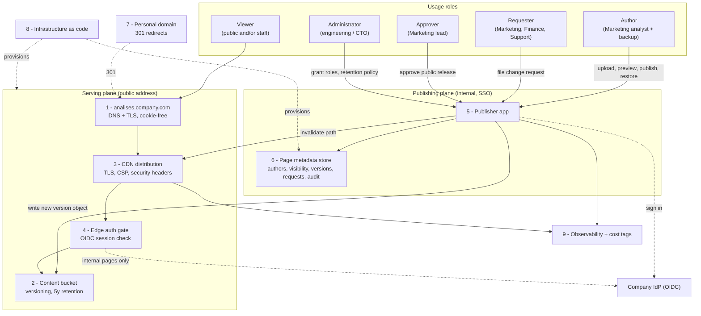
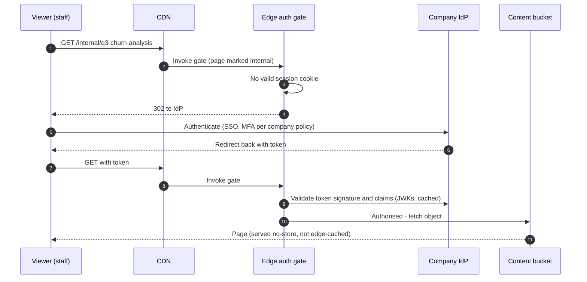

# RFC — Publishing Marketing analysis pages on a company domain

**Status:** draft (for review by CTO, Marketing, Finance, Support)
**Current working focus:** decision recorded; awaiting confirmation of the open assumptions (see *Assumptions* and *Open questions*)
**Author:** Lucas Marques — 2026-09-08

## Related documents

Nothing exists yet. Placeholders to be filled before review:

- Inventory of the ~30 pages currently live on the analyst's personal domain (URL, purpose, audience, last change, contains-personal-data yes/no).
- Current DNS/registrar records for the company domain and for the analyst's personal domain.
- Existing identity provider configuration (see assumption **A4**).
- Cost estimate sheet (AWS calculator export) for the chosen option.

---

## Context

One analyst in Marketing writes analysis pages — plain HTML pages containing charts, tables and commentary — and publishes them by hand on a domain he registered personally. There are roughly **30 pages** live today. When a colleague needs a number corrected, a chart relabelled or a page taken down, they message him over chat and he edits and re-uploads the file.

This worked while it was one person's side habit. It is now a dependency of several departments, and the shape has three problems that get worse, not better, with time:

1. **The company does not own its own published material.** The pages sit on a domain registered to an individual. If that person leaves, loses the registrar account, or simply lets the domain lapse, every page and every link anyone has shared to it disappears, and the company has no way to recover or redirect them. Anything published there also carries an individual's identity rather than the company's, which is the surface reason the request came in.
2. **One person is the bottleneck and the single point of failure.** Every change request routes through chat to one inbox. Requests are lost in scroll, priority is decided by whoever asks loudest, and nobody except the analyst can answer "what is live right now, and who asked for the last change?". While he is on holiday, nothing can be corrected — including a wrong number on a page that is publicly reachable.
3. **There is no history and no safety net.** Edits overwrite files in place. A bad edit, an accidental deletion, or a "can we go back to last month's version?" has no answer. Nobody can say who changed what, when, or why.

**The problem to decide:** where and how these pages should be hosted, and how a non-engineer publishes and corrects them, so that the company owns the domain and the content, more than one person can act, and no version is ever lost.

**Why now:** the exposure is already live and grows with every page added. The trigger is organisational rather than technical — see open question **Q10** on whether an external deadline (a campaign, an audit) also applies.

### Stakeholders — and why the department list is not the role list

The request names four stakeholders: **Marketing, Finance, the CTO, and Support.** Those are *departments* — org-chart boxes. They are useful for knowing whom to invite to the review, and useless as an input to the design: a permission model built on departments breaks the first time there is a reorg, the first time someone in Finance needs to fix a typo, and the first time a contractor who is in no department needs to see a draft.

So the departments are **reclassified into usage roles** — what a person *does* with the system. The design is built against the roles; the departments are just where today's holders happen to sit.

| Usage role | What the role does with the system | Who holds it today | Requirements it drives |
| --- | --- | --- | --- |
| **Author** | Creates a page, edits it, previews it, publishes it, takes it down | The one Marketing analyst (must become ≥ 2 people) | R-F2, R-F3, R-F6, R-F7, R-NF1 |
| **Requester** | Asks for a change to a page they do not edit themselves | Marketing colleagues, Finance, Support | R-F4 |
| **Reviewer / Approver** | Signs off before a page becomes reachable outside the company | Undecided — see **Q7**; assumed a named Marketing lead (**A7**) | R-F5, R-NF9 |
| **Viewer** | Reads a published page | Depends on visibility: company staff, or the public — see **Q1** | R-NF5, R-F5 |
| **Administrator / Operator** | Owns the domain, the infrastructure, the role grants and the retention policy | Engineering, under the CTO | R-F1, R-NF2, R-NF6, R-NF7, R-NF8 |
| **Auditor / Cost owner** | Answers "what was live on date X, who published it" and "what does this cost" | CTO (security, ownership), Finance (cost) | R-NF4, R-NF8 |

Two consequences of the reclassification, both architectural:

- **Author is a role, not a person.** Requirement R-F3 exists because the current design has exactly one holder. Fixing the domain without fixing this leaves the bottleneck in place.
- **Requester is a first-class role.** Today it is served by chat, which is why requests get lost. R-F4 exists to give it a real surface, and the departments (Finance, Support) that mostly hold this role need nothing department-specific built for them.

Support deserves one extra note: Support holds **Requester** and **Viewer**, because when a published page contains a wrong or confusing number, the questions land in Support's queue. Support therefore needs to see *what is live now* and to file a correction against a page — not a Support-specific feature.

### Out of scope

- **Authoring the analysis itself** — how the analyst produces charts and numbers, and from which data source. This RFC covers publishing an HTML page, not generating it.
- **The company's main marketing website and its CMS.** These analysis pages are a separate publishing surface; nothing here changes the main site.
- **Customer-facing personalisation, forms, logins or payments inside a page.** Pages are read-only documents (see assumption **A5**).
- **SEO strategy and analytics product decisions.** Redirects from the personal domain are in scope (R-F8); ranking strategy is not.
- **A general-purpose internal CMS for all departments.** If that is wanted later it is a different, larger decision; this RFC deliberately solves the analysis-pages case.

---

## Assumptions

There was no opportunity to interview stakeholders before writing, so every gap is recorded as a labelled assumption. **Each one is a decision someone else may overturn; the ones marked ⚠ change the design if they are wrong.** The matching questions are in *Open questions*.

| # | Assumption | If wrong |
| --- | --- | --- |
| **A1** ⚠ | Some pages must be reachable by the public (that is the point of a company domain), and some are internal-only or drafts. Both cases must be supported per page. | If *everything* is internal-only, the whole public-CDN and approval-gate layer collapses into an SSO-only site — materially simpler. If *everything* is public, the edge auth gate (component 4) is unnecessary. |
| **A2** ⚠ | No page contains personal data, customer data or health data; pages carry aggregate analysis only. Publishing such data is forbidden by policy and checked at review. | If pages may contain personal data, a data-protection review, a lawful basis, retention limits and probably encryption-at-rest-with-managed-keys and per-viewer access logging become hard requirements, and "public" is likely off the table. |
| **A3** | The company owns a registrable domain and controls its DNS, and can create a subdomain for this purpose. | If DNS is not controllable by engineering, or a new domain must be procured, add registrar/procurement lead time to phase 1. |
| **A4** | A company identity provider already exists and all staff are in it (Google Workspace or equivalent, capable of OIDC). | If not, standing up an IdP dwarfs this project and phase 2 must be re-scoped. |
| **A5** | Pages are self-contained static HTML (inline or bundled CSS/JS, images). They do not need to call internal APIs or read live databases at view time. | If pages must fetch live data, the serving layer needs an authenticated API path and the security analysis changes substantially. |
| **A6** | Volume is small and stays small in year one: order of 30–100 pages, under a few gigabytes total, low traffic (well under 100k views/month), 1–5 Authors. | Materially higher traffic or page counts do not break the chosen design, but they do change the cost estimate and would justify the phase-2 publisher app sooner. |
| **A7** | Anything reachable by the public needs sign-off from a named Marketing lead before going live; internal pages do not. | If Legal or Brand must approve too, the approval step becomes multi-party and the publish flow needs a review state, not a checkbox. |
| **A8** | The existing cloud footprint is AWS, and engineering already operates S3, CloudFront and Terraform (or equivalent IaC). | If the company is on another cloud, the equivalent primitives exist there and the decision logic carries over; the named services change. |
| **A9** | "Nothing is ever lost" means published versions, not editing keystrokes: every version that was ever live must be retrievable. Assumed retention of 5 years. | A shorter retention is cheaper; a legal-hold requirement adds immutability (object lock) and cost. |
| **A10** | Links to the current personal-domain pages have been shared outside the company, so those URLs must keep working via redirect for at least 12 months. | If no external links exist, R-F8's redirect half can be dropped and the personal domain simply retired. |

---

## Requirements

The request arrived as four adjectives: *intuitive, secure, fast,* and *nothing is ever lost*. None of those is checkable, and an unchecked adjective is where a bad decision hides. Each is translated below into something a reviewer can accept or reject, and only the **architecturally relevant** items are kept — those that are expensive to reverse, force a component to exist, or would fail the system's purpose.

| Stated as | Translated into |
| --- | --- |
| "intuitive" | R-NF1 — a non-engineer publishes and corrects a page unaided, measured |
| "secure" | R-F1, R-F5, R-NF2, R-NF3, R-NF4, R-NF9 — ownership, per-page visibility, authenticated identity, isolation of untrusted HTML, audit trail, no sensitive data |
| "fast" | R-NF5 — page-load and publish-to-live budgets |
| "nothing is ever lost" | R-NF6 — immutable version retention, self-service restore, soft delete, RPO/RTO |
| (implicit, from the chat bottleneck) | R-F3, R-F4 — Author is a role with ≥ 2 holders; Requester has a tracked surface |

### Functional

- **R-F1 — Company-owned address.** Pages are served from a domain the company owns, with DNS and TLS certificates under engineering's control. No individual's registrar account is in the path.
- **R-F2 — Author self-service.** An Author publishes a new page, replaces an existing one, and takes one down, with no engineering involvement and no code review.
- **R-F3 — No single-owner page.** Every page has at least two people who hold Author on it. Directly targets the bottleneck described in Context.
- **R-F4 — Requests attach to the page.** A Requester can file a change request against a specific page, and anyone can see the open requests for it. Chat stops being the queue.
- **R-F5 — Per-page visibility.** Each page is either *public* or *company-internal*, and the setting can be flipped without re-uploading content. Internal pages are unreachable without authentication.
- **R-F6 — Visible version history with restore.** Every published version of a page is listed with who published it and when, can be previewed, and can be restored by an Author without engineering help.
- **R-F7 — Preview before live.** An Author can view a page at a non-public URL before it is published.
- **R-F8 — Migration and continuity.** The ~30 existing pages are migrated, and the old personal-domain URLs redirect (HTTP 301) to the new ones for at least 12 months (**A10**).

### Non-functional

- **R-NF1 — Publishing is learnable in one sitting.** Acceptance test: two Marketing colleagues who are *not* the current analyst each publish a new page and correct an existing one, on their first attempt, unaided, in ≤ 10 minutes each, with only a one-page written guide. If they cannot, the interface has failed regardless of what this document says.
- **R-NF2 — Authenticated, authorised, attributable writes.** Every publish, unpublish, restore and visibility change is performed by a named identity from the company IdP (**A4**) and authorised by role. No shared credentials, no anonymous writes.
- **R-NF3 — Untrusted HTML is isolated from company sessions.** Page HTML is authored by hand and is effectively untrusted code. It is served from a dedicated hostname that sets no cookies and shares no session or storage origin with any company application, under a restrictive `Content-Security-Policy` and `X-Content-Type-Options: nosniff`, with no wildcard TLS certificate covering both this hostname and company applications. A script in a page must not be able to read any company application's cookies or local storage.
- **R-NF4 — Audit trail.** Who published or changed what, and when, is queryable for at least the retention period (**A9**), and is not editable by Authors.
- **R-NF5 — Speed budgets.** p95 time-to-first-byte ≤ 200 ms from the regions where viewers are (Brazil and Europe assumed); Largest Contentful Paint ≤ 2.5 s on a mid-range mobile device over a 4G-class connection — the published "good" threshold for that metric; publish-to-live ≤ 60 s at p95. All three measured, not asserted.
- **R-NF6 — Durability and recovery.** Every version that was ever published is retained for 5 years (**A9**) and is not deletable by an Author. Deletion is soft, with 30 days to undo. **RPO = 0** for published content (a published version is never lost). **RTO ≤ 4 h** for restoring the serving layer from infrastructure-as-code plus stored content.
- **R-NF7 — Operability without a server to patch.** No long-lived host that engineering must patch or capacity-plan. All infrastructure defined as code and reproducible into a fresh account.
- **R-NF8 — Observability and cost visibility.** Dashboards for request volume, 4xx/5xx rate and latency; alerts on 5xx rate and on certificate expiry; publish/audit events searchable; all resources tagged to one cost centre so Finance can see the spend as a single line item.
- **R-NF9 — Content policy gate.** Before a page becomes public, an Approver confirms it contains no personal, customer or health data (**A2**) and no internal-confidential figures. The gate is a recorded step, not a convention.

### Deliberately *not* requirements

Captured so nobody re-adds them mid-build: WYSIWYG/rich-text editing, page templates and a design system, comments or reactions on pages, scheduled publishing, i18n, per-viewer analytics dashboards, a page search engine. All are plausible later; none shapes the structure now, and every one of them would add a component that no requirement above needs.

---

## Design

The requirements decompose into five decisions, taken one dimension at a time. Each dimension is decided in *Alternatives analysis*; this section states the resulting shape and, for every component, the requirement that makes it exist.

### Components

| # | Component | Responsibility | Requirements served |
| --- | --- | --- | --- |
| 1 | **Dedicated hostname** (e.g. `analises.<company>.com`) — DNS + certificate, cookie-free, no wildcard certificate shared with applications | The company-owned public address for pages, isolated from company sessions | R-F1, R-NF3 |
| 2 | **Content bucket** (S3, versioning on, public access blocked, lifecycle → cold storage, 5-year retention) | Stores every version of every page, ever; the durability substrate | R-NF6, R-F6 |
| 3 | **CDN distribution** (CloudFront, origin access to the bucket only, TLS, security headers, CSP) | Fast global delivery; the only public path to content | R-NF5, R-NF3, R-F1 |
| 4 | **Edge auth gate** (CloudFront Function / Lambda@Edge validating an OIDC session against the company IdP) | Blocks unauthenticated access to internal-only pages and to previews | R-F5, R-F7, R-NF2 |
| 5 | **Publisher** — small internal web app behind SSO: upload/paste HTML, preview, publish, list versions, restore, toggle visibility, manage page Authors, file and view change requests | The Author-, Requester- and Approver-facing surface; the reason a non-engineer can operate this at all | R-F2, R-F3, R-F4, R-F6, R-F7, R-NF1, R-NF2, R-NF9 |
| 6 | **Page metadata store** (one small managed table) — slug, title, Authors, visibility, current version pointer, version list, change requests, append-only audit events | Makes roles, history, requests and the audit trail queryable; Authors cannot edit audit rows | R-F3, R-F4, R-F5, R-F6, R-NF4 |
| 7 | **Redirect map** (301s from the personal domain, held at the CDN or a small redirect distribution) | Keeps already-shared links working | R-F8 |
| 8 | **Infrastructure as code** (Terraform module for components 1–4, 6, 7) | Reproducibility, RTO, no snowflake infrastructure | R-NF7, R-NF6 |
| 9 | **Observability + cost tagging** (CDN and publisher logs → existing monitoring stack; dashboards, monitors, cost-allocation tags) | Answers "is it up, is it fast, who published, what does it cost" | R-NF8 |

Every requirement above maps to at least one component. The reverse also holds — there is no component here that a requirement does not demand, which is why there is no template engine, no build step, no CMS and no database of analysis data.

### Static diagram



### Dynamic diagram — publishing a correction

```mermaid
sequenceDiagram
  autonumber
  participant R as Requester (Support)
  participant A as Author (Marketing)
  participant P as Publisher app
  participant M as Metadata store
  participant S as Content bucket
  participant C as CDN
  participant V as Viewer

  R->>P: File change request on page "pricing-analysis"
  P->>M: Store request, notify page Authors
  A->>P: Sign in via company IdP
  P->>M: Read page, current version, Author role check
  A->>P: Upload corrected HTML
  P->>S: Write new version object (previous version retained)
  P->>M: Append version record + audit event (who, when, request link)
  P-->>A: Private preview URL (auth-gated)
  A->>P: Approve and publish
  P->>M: Move current-version pointer; record publish event
  P->>C: Invalidate the page path
  P->>M: Close the change request
  P-->>R: Notify requester that it is live
  V->>C: GET /pricing-analysis
  C->>S: Fetch current version (cache miss only)
  C-->>V: Corrected page
```

**Step-by-step, in words** (for readers who cannot render the diagram):

1. A Requester files a change request against the page in the Publisher; it is stored and the page's Authors are notified. Nothing depends on chat.
2. An Author signs in through the company identity provider; role is checked against the metadata store.
3. The Author uploads the corrected HTML. It is written as a **new object version** — the previously live version is never overwritten, which is what makes R-NF6 true rather than aspirational.
4. A version record and an append-only audit event are written: who, when, and which request this answers.
5. The Author opens the auth-gated preview URL and checks the page.
6. On approval, the current-version pointer moves and the CDN path is invalidated. Publish-to-live is one cache invalidation, which is what buys the ≤ 60 s budget in R-NF5.
7. The change request closes and the Requester is notified.
8. Viewers are served by the CDN from the edge; only a cache miss reaches the bucket.

### Dynamic diagram — viewing an internal-only page



Public pages skip the gate entirely and are cached at the edge, which is why R-NF5's latency budget is met for the public case without an authentication round trip.

### Why a dedicated, cookie-free hostname (R-NF3)

This is the least obvious part of the design, so it is stated explicitly. The pages are hand-written HTML that nobody code-reviews. Once such a page is served from a hostname that shares a cookie or storage origin with a real company application, a mistake or a malicious paste in one page can read that application's session. Concretely, the design requires:

- pages served from their own hostname that **never sets a cookie**;
- **no wildcard certificate** covering both this hostname and application hostnames;
- company applications using host-scoped cookies (`__Host-` prefix, no `Domain` attribute) so nothing under the parent domain can read them from the pages hostname;
- a restrictive `Content-Security-Policy` and `nosniff`, plus `Strict-Transport-Security`.

Residual risk, honestly: a sibling subdomain still shares the parent domain for cookies scoped to it, and a stale DNS record on the parent domain is a subdomain-takeover vector. A **separate registrable domain** would remove both. It was not chosen because the entire point of the request is that the pages carry the *company's* name — see the D3 tradeoff.

---

## Alternatives analysis (Tradeoff)

Grouped by the dimension being decided. Every alternative is checked against the requirements; an option that misses a hard requirement does not win on elegance.

### D1 — Where the pages are served from

| Alternative | Pros | Cons | Risk (description) | Impact | Probability | Mitigation | Contingency |
| --- | --- | --- | --- | --- | --- | --- | --- |
| **D1-A · Object storage + CDN (S3 + CloudFront)** ✅ | Meets R-NF5 (edge cache) and R-NF6 (object versioning is the durability substrate, not a bolt-on); nothing to patch (R-NF7); already operated in-house (**A8**); per-page cache and header control for R-NF3; cost scales to near zero at **A6** volumes | Most moving parts of the options here (bucket, distribution, certificate, IaC); auth-gating needs edge code (component 4); no authoring UI at all — D2 must supply one | Edge auth-gate code is a novel component for the team and gets it subtly wrong (session validated on the wrong request, gate bypassable via a direct object URL) | High | Medium | Block all public bucket access, origin access only via the distribution; use a maintained OIDC-at-edge pattern rather than hand-rolled crypto; security review plus a test asserting an unauthenticated request to an internal page returns 302/403 | Ship phase 1 with public-safe pages only and hold internal pages behind an IP/VPN allowlist until the gate passes review |
| | | | Misconfiguration exposes an internal page publicly | High | Medium | Visibility is a metadata field enforced at the edge, not a URL convention; automated check that every page marked internal answers 302/403 unauthenticated, run on every publish | Flip the distribution to deny-all, fix, re-publish; notify the Approver of the exposure window |
| **D1-B · Managed static host (Cloudflare Pages / Netlify / Vercel + their access product)** | Fastest to stand up — plausibly a day; CDN, TLS, per-deploy immutable history and SSO gating all built in, covering large parts of R-F5/F6/NF3/NF5 with no build; free or near-free at **A6** volumes | A new vendor to procure and review; content durability governed by the vendor's retention, so R-NF6's 5-year guarantee needs verification and probably a backup copy anyway; less control over headers and cache semantics than D1-A; another identity integration to maintain | Vendor retention/export limits do not satisfy R-NF6, discovered after migration | Medium | Medium | Verify export API and retention *before* committing; keep an independent copy of every published version in company storage regardless of vendor | Keep the vendor for serving, treat company storage as the source of truth, migrate serving later |
| | | | Procurement or data-residency review blocks or delays the vendor | Medium | Medium | Start the vendor review in parallel with phase 1 rather than after | Fall back to D1-A |
| **D1-C · GitHub Pages under the company org** | Effectively free; history is Git, so R-NF6 is nearly free; company-owned; engineering already has the org | Custom-domain TLS and cache behaviour are limited; **no per-page access control**, so R-F5 fails outright for internal pages; authoring requires Git, so R-NF1 fails without a separate UI; public/private repo constraints affect what can be hosted | Internal-only pages end up "protected" by an unguessable URL | High | High | None available within the option — this is why it is rejected | — |
| **D1-D · Publish inside the existing marketing CMS (WordPress/Webflow)** | Authors may already know the tool (helps R-NF1); already on the company domain; brand and approval workflows may exist | Arbitrary hand-written HTML sits badly in a CMS page model; **R-NF3 fails by construction** — same origin and cookie scope as an authenticated CMS admin session; CMS plugin/patch surface conflicts with R-NF7; version history is per-CMS and rarely 5-year | An untrusted analysis page executes script in the CMS admin's origin and steals a session | High | Medium | Would require a separate hostname and a headless setup — at which point this is D1-A with extra steps | Rebuild on D1-A |
| **D1-E · Nginx container on the existing cluster** | Full control; reuses existing deployment and ingress; team knows it | A long-lived host to patch and capacity-plan (violates R-NF7); no CDN unless one is added anyway; slowest path to R-NF5; most operational cost for the least benefit at **A6** volumes | Cluster incident takes analysis pages down with unrelated services (shared blast radius) | Medium | Medium | Separate namespace and resource limits | Move to D1-A |

### D2 — How an Author publishes (the interface)

| Alternative | Pros | Cons | Risk (description) | Impact | Probability | Mitigation | Contingency |
| --- | --- | --- | --- | --- | --- | --- | --- |
| **D2-A · Git repository + pull request + CI deploy** ✅ *(phase 1 bridge)* | Nearly free to build; history, attribution, review and rollback come from Git and satisfy R-F6/R-NF4/R-NF6 on day one; engineering already lives here; unblocks the domain-ownership risk within days | **Fails R-NF1 for a non-engineer** — branches, PRs and merge conflicts are exactly the friction the request is about; R-F4 is served only crudely (issues); a stalled review re-creates the bottleneck in a new place | Marketing never adopts it and the analyst keeps publishing on his personal domain | High | High | Use it only as the phase-1 bridge with the analyst (who is technical enough) while the Publisher app is built; set an explicit end date for the bridge | If phase 2 slips past the date, escalate to the CTO rather than let the bridge become permanent |
| **D2-B · Purpose-built Publisher app behind SSO** ✅ *(phase 2, target)* | The only option that plausibly meets **R-NF1** for a non-engineer, and the only one that gives R-F3 (Author roles), R-F4 (requests on the page) and R-NF9 (approval gate) a real home; upload → preview → publish in one screen | Real software the company must own, run and patch forever; the largest build cost in this RFC; easy to over-build into an unwanted CMS | Build overruns; the app becomes a small unowned product with no maintainer | Medium | Medium | Hard scope cap: upload, preview, publish, versions, restore, visibility, authors, requests — nothing else; a named owning team before the build starts; timebox and re-evaluate at the cap | Stay on D2-A/D2-C and accept the weaker author experience |
| | | | Scope creep into a general internal CMS | Medium | High | The *Deliberately not requirements* list is part of the acceptance criteria | Freeze features; route new asks to a separate decision |
| **D2-C · Sync a shared drive folder (Drive/SharePoint → storage)** | Genuinely intuitive for a non-engineer — drag a file into a folder; zero new UI; strong R-NF1 candidate | Publishing becomes implicit, so there is no preview step (R-F7), no approval gate (R-NF9) and no place to hold visibility or Author roles (R-F5, R-F3); accidental drag equals instant live change; audit is the drive's, which is weaker than R-NF4 needs | A wrong or sensitive file goes live the moment it is dropped in the folder | High | Medium | Two folders (`draft/`, `published/`) with a manual promotion step | Add a promotion gate — which is the beginning of D2-B |
| **D2-D · Off-the-shelf CMS as the authoring surface** | No build; mature editor, roles and workflow; covers R-NF1, R-F3, R-F6, R-NF9 out of the box | Optimised for CMS-authored content, not for pasting hand-written HTML documents; licence and admin overhead; the tempting same-origin deployment is D1-D, which fails R-NF3 | The team fights the CMS's page model to publish plain HTML, and authors end up bypassing it | Medium | Medium | Evaluate only headless CMSs that support a raw-HTML field, publishing to the D1-A origin | Fall back to D2-B |
| **D2-E · Chat bot ("upload here to publish")** | Meets people where the requests already are; near-zero learning curve | Encodes the bottleneck's medium into the architecture; no preview, no history UI, weak authorisation, chat retention is not R-NF4 | Publishing history lives in a chat log nobody can query in 5 years | Medium | High | — (rejected) | — |

### D3 — Domain and isolation

| Alternative | Pros | Cons | Risk (description) | Impact | Probability | Mitigation | Contingency |
| --- | --- | --- | --- | --- | --- | --- | --- |
| **D3-A · Dedicated cookie-free subdomain of the company domain** ✅ | Carries the company's name, which *is* the request (R-F1); no cookies, no shared session origin, no wildcard certificate → satisfies R-NF3 in practice; DNS already controlled (**A3**) | Still shares the parent domain, so parent-scoped cookies and a subdomain-takeover vector remain theoretically reachable | A stale DNS record enables subdomain takeover on the pages hostname | Medium | Low | Records managed in IaC only (R-NF7); periodic audit of dangling records; host-scoped (`__Host-`) cookies in company applications | Remove the record, rotate anything exposed, re-provision |
| **D3-B · Separate registrable domain** | Strongest isolation — no shared cookie scope with anything the company runs at all | Does **not** satisfy the actual ask: the material would not visibly be the company's; a second brand to explain to viewers; registrar and certificate work; looks like the personal-domain problem again to an outside reader | Viewers do not trust an unfamiliar domain; Marketing's goal is missed | High | Medium | — | Point it at the company domain and adopt D3-A |
| **D3-C · A path on the main company website (`/analysis/...`)** | Best brand and SEO consolidation; one hostname | **Fails R-NF3** — same origin and cookie scope as the main site; couples publishing to the main site's release process, which fails R-F2 and R-NF5's 60 s budget | Untrusted page script runs in the main site's origin | High | Medium | — (rejected) | — |

### D4 — How "nothing is ever lost" is guaranteed

| Alternative | Pros | Cons | Risk (description) | Impact | Probability | Mitigation | Contingency |
| --- | --- | --- | --- | --- | --- | --- | --- |
| **D4-A · Object versioning + lifecycle + deny-delete policy** ✅ | The storage layer *is* the version store — RPO 0 for anything written (R-NF6); every version addressable, so R-F6's restore is a pointer move; lifecycle to cold storage keeps 5 years cheap; Authors have no delete permission | Not legally immutable unless object lock is enabled; an administrator with sufficient privilege could still purge | Someone with admin rights deletes versions, by accident or otherwise | High | Low | Deny delete and version-suppression in the bucket policy for all non-break-glass roles; MFA-delete; alarm on delete-marker creation; separate the admin role from the Author role | Restore from the cross-region backup copy; enable object lock if the risk is judged real (see **Q9**) |
| | | | Retention cost grows unnoticed | Low | Low | Lifecycle to cold storage; cost tag and Finance dashboard (R-NF8) | Shorten retention after a documented decision |
| **D4-B · Git history as the source of truth** | Free, familiar, diffable, and an excellent audit narrative; strong fit if D2-A were permanent | Ties durability to the authoring interface, so replacing D2-A later means migrating the durability guarantee too; large binary assets sit badly in Git; a force-push can rewrite history | History rewritten or repository lost with the hosting account | Medium | Low | Protected branches; mirror the repository | Restore from the mirror |
| **D4-C · Store versions as rows/blobs in a database** | One query surface for content, metadata and audit; transactional | Backups become the durability story (RPO > 0 between snapshots); serving from a database contradicts R-NF5 and R-NF7; more to operate for no requirement gained | Content lost between snapshots | High | Low | Point-in-time recovery | Rebuild from CDN logs and author copies — i.e. R-NF6 is not actually met |

### D5 — Access control for internal-only pages

| Alternative | Pros | Cons | Risk (description) | Impact | Probability | Mitigation | Contingency |
| --- | --- | --- | --- | --- | --- | --- | --- |
| **D5-A · OIDC session validated at the CDN edge** ✅ | Real authentication and per-page authorisation (R-F5, R-NF2) with the public path still edge-cached, so R-NF5 holds; reuses the existing IdP (**A4**) | Edge code is the fiddliest component in this design; a second place where sessions are validated | See D1-A's gate risks (bypass, misconfiguration) — same mitigations | High | Medium | Maintained OIDC-at-edge pattern; automated unauthenticated-access test per publish; security review | IP/VPN allowlist until the gate is trusted |
| **D5-B · Unguessable URLs only** | Zero build | Not access control; fails R-F5 and R-NF2; a shared link leaks permanently and cannot be revoked without moving the page | An internal analysis is forwarded outside the company | High | High | — (rejected) | — |
| **D5-C · VPN / IP allowlist** | Simple, well understood, no new code; a good *phase-1 stopgap* | Excludes anyone off-VPN (contractors, phones, home); gives identity per network location, not per person, so R-NF4's attribution weakens; awkward alongside public pages on the same hostname | Staff cannot read internal pages and go back to asking over chat | Medium | Medium | Use only as a stopgap with a stated end date | Ship D5-A |
| **D5-D · Signed, expiring URLs issued by the Publisher** | No edge auth code; revocation via expiry; useful for previews (R-F7) | Every viewer must first visit the Publisher, which is poor for a page meant to be linked in chat or email; link-sharing defeats it after issue | Signed links are forwarded and remain valid until expiry | Medium | High | Short expiry; use for previews only, not for internal published pages | Adopt D5-A for published internal pages |

### Requirements check across the chosen set

| Requirement | Met by | Notes |
| --- | --- | --- |
| R-F1 company-owned address | D3-A + D1-A | DNS and certificate in IaC |
| R-F2 author self-service | D2-B (phase 2); partially D2-A (phase 1) | Phase 1 is a bridge and does not fully meet R-NF1 — stated plainly |
| R-F3 ≥ 2 Authors per page | D2-B + component 6 | Phase 1 mitigates by having two people with repository access |
| R-F4 requests on the page | D2-B + component 6 | Phase 1 uses repository issues as a weak substitute |
| R-F5 per-page visibility | D5-A + component 6 | Phase 1: public-safe pages only, internal held behind D5-C |
| R-F6 history + restore | D4-A + D2-B | Phase 1: Git history plus object versions, restore by engineering |
| R-F7 preview | D5-D + D2-B | |
| R-F8 migration + redirects | Component 7 | Needs registrar access to the personal domain — see **Q11** |
| R-NF1 learnable in one sitting | D2-B only | **The one requirement phase 1 does not meet.** It is the reason phase 2 exists |
| R-NF2 authenticated writes | D2-B + IdP (**A4**) | |
| R-NF3 isolation | D3-A + component 3 headers | Residual risk documented above |
| R-NF4 audit | Component 6 (append-only) + D4-A | |
| R-NF5 speed | D1-A + D3-A | Must be measured, not assumed — task in the roadmap |
| R-NF6 durability | D4-A | |
| R-NF7 operability | D1-A + component 8 | The Publisher app is the one thing to run; keep it small |
| R-NF8 observability + cost | Component 9 | |
| R-NF9 content policy gate | D2-B approval step | Phase 1: written checklist signed by the Approver |

---

## The decision

**Decided:**

- **D1-A** — serve from object storage behind a CDN (S3 + CloudFront), on
- **D3-A** — a dedicated, cookie-free subdomain of the company domain, with
- **D4-A** — object versioning plus a deny-delete policy and 5-year lifecycle retention as the "nothing is ever lost" guarantee,
- **D5-A** — internal pages gated by an OIDC session validated at the edge, and
- **D2-A → D2-B** — a Git-and-CI bridge for the first two weeks, replaced by a deliberately small internal **Publisher** app as the durable Author interface.

**Reasoning.** The two things that are expensive to get wrong are *who owns the address and the content* (R-F1, R-NF6) and *whether untrusted HTML can touch company sessions* (R-NF3). D1-A + D3-A + D4-A settle all three with primitives the team already runs, and they settle them in days, not months — which matters because the exposure is live now. The Author interface, by contrast, is cheap to change later: it sits behind the storage layer and can be swapped without moving a single page. So the plan spends its irreversible decisions on ownership, isolation and durability, and defers the reversible one — the interface — behind a bridge with an explicit end date.

**Decision style: autocratic.** The CTO owns the security boundary, the domain and the bill, and makes the final call. Marketing is consulted on the Author experience and owns the R-NF1 acceptance test (they can veto the Publisher as not-intuitive); Finance is consulted on cost and owns the tagged budget line; Support is consulted on the change-request flow. This is deliberately not a vote: the alternatives are not close on the security and ownership dimensions, and a democratic tie-break would only obscure that.

### The strongest objection to this decision

For **30 pages and one author**, this is more machinery than the problem strictly needs. **D1-B** — a managed static host with its own access product — plausibly delivers a company subdomain, TLS, a CDN, per-deploy history and SSO gating in about a day, with no edge code to write and no app to own, and probably free at **A6** volumes. Against that, the recommendation asks engineering to write an edge auth gate *and* own a small internal web app forever. Every extra component here is a real, permanent maintenance liability, and "we already run S3" is a weaker argument than it feels like.

The honest answer is that D1-B was rejected on **R-NF6** and on procurement, not on capability — and both of those are *assumptions*, not measurements (**A9**, and the vendor review noted in D1-B).

**Conditions that flip the decision:**

- If the vendor review clears quickly **and** the vendor's export/retention story satisfies R-NF6 with a company-side backup copy → **take D1-B and skip the edge gate entirely.** That is a smaller system and a better outcome.
- If **A1** turns out to be "everything is internal-only" → drop the public-CDN and approval layers; an SSO-gated static site is enough, and D1-B becomes even more attractive.
- If Authors stay at exactly one person for six months → **do not build the Publisher.** Keep D2-A or D2-C; R-NF1 matters only because more than one non-engineer must publish.
- If **A2** is wrong and pages may carry personal or health data → stop, and re-run this decision with data-protection requirements as first-class inputs. Nothing here is designed for that.
- If Authors exceed roughly five, or the HTML becomes machine-generated on a schedule → the Publisher pays for itself sooner than estimated.

---

## Launch strategy

Phased so the largest risk dies first, with a stated end for the bridge — no eternal migration.

**Phase 0 — Inventory and triage (2–3 days).** List all ~30 pages: purpose, audience, whether they contain anything sensitive (**A2**), whether they are still needed. Expect a meaningful fraction to be retired rather than migrated; that is a win. Classify each surviving page public or internal (R-F5).

**Phase 1 — Company ownership (target: 2 weeks).** Provision D1-A + D3-A + D4-A in IaC. Migrate the public-safe pages. Publish via the Git+CI bridge (D2-A). Set up 301 redirects from the personal domain (R-F8, **Q11**). Internal pages either wait or sit behind the D5-C stopgap. **Exit criteria:** every surviving page is served from the company subdomain; no page depends on the personal registrar account; every version is in the versioned bucket; the latency budget in R-NF5 is *measured*.

**Phase 2 — Author self-service (target: 3–4 weeks, hard scope cap).** Build the Publisher (D2-B) and the edge auth gate (D5-A). **Exit criterion is the R-NF1 acceptance test:** two Marketing colleagues who are not the current analyst each publish and correct a page unaided in ≤ 10 minutes. If that test fails, phase 2 is not done, regardless of the feature list.

**Phase 3 — Retire the bridge and the old domain (1 week).** Revoke the Git-publish path so there is one way to publish. Keep the redirects for 12 months (**A10**), then let the personal domain go — with the company holding the redirect, not the individual.

**The bridge end date is a commitment.** If phase 2 has not started by the end of phase 1 plus four weeks, it is escalated to the CTO. The failure mode this guards against is the temporary bridge quietly becoming the architecture — with the bottleneck intact and one analyst still fielding chat requests.

## Tasks and roadmap

| Task | Description | Estimate |
| --- | --- | --- |
| Page inventory and triage | Classify all ~30 pages: audience, sensitivity, keep/retire | 2d |
| Answer the open questions | Get **Q1–Q12** decided; revise this RFC before build | 2d |
| IaC module: storage + CDN + DNS + certificate | Versioned bucket, lifecycle, distribution, origin access, security headers, CSP (components 1–3, 8) | 3d |
| Deny-delete and retention policy | Bucket policy, MFA-delete, delete-marker alarm (R-NF6) | 1d |
| Git + CI publish bridge | Repository, deploy pipeline, invalidation (D2-A) | 2d |
| Migrate pages and 301 redirects | Move content, redirect map from the personal domain (R-F8) | 3d |
| Performance validation | Measure TTFB/LCP against R-NF5 from BR and EU; fix or renegotiate the budget | 1d |
| Observability and cost tagging | Dashboards, 5xx and certificate alerts, audit event search, cost tags (component 9) | 2d |
| Edge auth gate | OIDC validation at the edge plus automated unauthenticated-access test (component 4, D5-A) | 4d |
| Metadata store | Page/authors/visibility/versions/requests/audit schema, append-only audit (component 6) | 2d |
| Publisher app | Upload, preview, publish, versions, restore, visibility, authors, change requests — scope-capped (component 5) | 10d |
| Approval gate and content checklist | Approver step and the no-sensitive-data confirmation (R-NF9) | 1d |
| R-NF1 acceptance test | Two non-author Marketing colleagues publish and correct unaided; write the one-page guide | 1d |
| Retire the bridge | Revoke Git publishing; document the single path | 1d |

Estimates are engineering days for one person and exclude review latency and the vendor review in D1-B. They are order-of-magnitude, not a commitment.

## Cost

At the volumes in **A6** (order of 30–100 small pages, under a few gigabytes, low traffic), storage-plus-CDN spend for the chosen option is expected to be **single-digit to low-tens of US dollars per month** — dominated by fixed items rather than traffic. That figure is an order-of-magnitude estimate from list pricing and **has not been verified against a pricing calculator**; producing that estimate is a roadmap task, and Finance should see it before sign-off. The dominant real cost of this decision is **engineering time** (roughly the roadmap above), not infrastructure — which is itself an argument to take the smaller D1-B path if its review clears.

## Open questions

Blocking questions are marked ⚠ — they can change the design, not just fill a blank. The assumption currently standing in for each is named.

| # | Question | Standing assumption |
| --- | --- | --- |
| **Q1** ⚠ | Are these pages meant for the public, for staff, or both? | **A1** |
| **Q2** ⚠ | Can a page ever contain personal, customer or health data? | **A2** |
| **Q3** | Which domain, and who controls its DNS today? | **A3** |
| **Q4** | Which identity provider, and is everyone in it? | **A4** |
| **Q5** | Are pages fully self-contained, or must they read live data? | **A5** |
| **Q6** | How many pages and Authors do we expect in a year, and what traffic? | **A6** |
| **Q7** | Who approves a page before it is publicly reachable? Is Legal or Brand in that path? | **A7** |
| **Q8** | Which cloud and tooling is engineering already operating, and what is the budget ceiling? | **A8** |
| **Q9** | How long must published versions be kept, and is legal-hold immutability required? | **A9** |
| **Q10** | Is there an external deadline driving this? | none — timeline assumed flexible |
| **Q11** | Will the analyst grant registrar/DNS access to the personal domain for the redirects? | **A10** |
| **Q12** | Is a marketing CMS or static-hosting vendor already licensed and reviewed? | assumed none available |

## Version history

| Version | Date | Author | Description |
| --- | --- | --- | --- |
| 1.0 | 2026-09-08 | Lucas Marques | Document created. Written without stakeholder interviews; all gaps recorded as labelled assumptions **A1–A10** and open questions **Q1–Q12**. |
