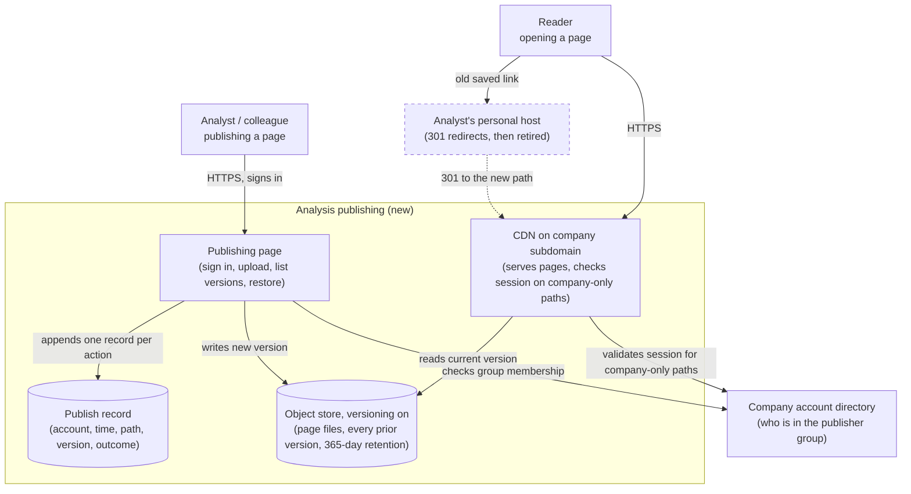
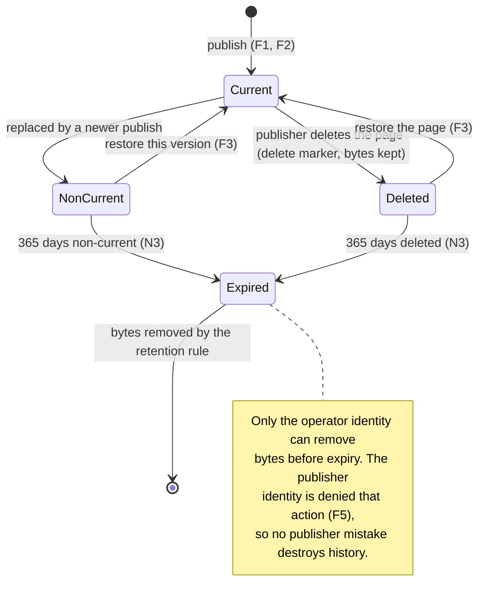

# RFC: Publishing analysis pages on a company-owned domain without one person in the loop

**Status:** proposed (two blocking questions open, Q1 and Q2 below)
**Decider:** CTO · **Reviewers:** the analyst who publishes the current pages, the head of marketing, the budget owner for recurring spend, the support lead
**Current working focus:** decision

> **Evidence warning, stated once so it is not repeated on every line.** There is no system to inspect
> for this decision: no repository, no hosting panel, no bill, no ticket queue was available while
> writing. Every figure about the current state comes from the requesting conversation of 2026-09-08 and
> is therefore labelled *assumed*, with the way to confirm it named in the row. Nothing here is
> *measured*. The first phase of the launch strategy exists partly to replace those labels.

## Reversibility

**One-way door on two things: the URL namespace and the retention model.** Once a page is served at
`https://<subdomain>.<company-domain>/<path>`, that URL is pasted into chat messages, emails, slide
decks and possibly customer conversations; changing the scheme later means every saved link breaks or
needs a redirect kept alive indefinitely. The retention model is the second: a version not captured at
publish time cannot be recovered afterwards, so a design that keeps only the current file forecloses
the recovery the request asks for, permanently, for everything published before it changes.

**Two-way door on the rest.** Where the files physically sit, what the upload page is written in, and
which CDN fronts it can each be swapped in a weekend as long as the URL namespace and the version
history survive the swap. Those dimensions get proportionally less space below.

Because the irreversible part is real, this document uses the full method rather than the one-page
form.

## Context

One analyst in marketing writes analysis pages as hand-authored HTML and publishes them on a domain he
registered himself. About 30 pages are live there (requester, 2026-09-08; *assumed*: a link inventory
of what the team currently shares would confirm the count in under an hour). When a colleague needs a
number changed, a chart replaced or a typo fixed on one of those pages, they ask the analyst over chat
and wait for him to get to it. There is no queue, no ticket and no record of what was asked or when
(requester, 2026-09-08; *assumed*: the chat history and the absence of tickets in the issue tracker
would confirm it).

That arrangement costs the company in three places, and the three are different in kind.

**A single person is the publishing mechanism.** Every change to any of the 30 pages goes through one
person's availability. Nobody has proposed a number for how long a request waits, because nobody
records it (*assumed*). The cost is not only delay: a colleague who cannot get a change made stops
asking, and the page goes stale instead of getting fixed.

**The company's content sits on an individual's assets.** The domain registration, the hosting
subscription and the account that can change the files all belong to one employee. If the registration
lapses, the subscription's payment card expires or the employee leaves, every link stops resolving and
nobody else can republish. Nothing is signed on either side: the company has no right to the domain,
and the employee has no obligation to keep paying for it.

**There is no history.** Replacing a file overwrites what was there. The request's phrase for this was
"guarantee that nothing is ever lost", which says the risk is felt but does not say what is currently
kept. As far as the requester knows, the only copies of earlier versions are whatever the analyst still
has on his laptop (*assumed*: asking the analyst what he still holds locally settles it in one
conversation).

### Current usage

| Role (what they do with the system) | What they do today | Through what | How often or how much (source) |
| --- | --- | --- | --- |
| Analyst authoring and publishing an analysis page | Writes HTML on his laptop, uploads the file, checks the page in a browser | The hosting panel of a domain he registered personally | About 30 pages live (requester, 2026-09-08; *assumed*: a link inventory would confirm) |
| Colleague who needs a change to a page they did not write | Describes the change in a chat message and waits for the analyst | Chat, with no queue or record | Volume unknown; no request is recorded anywhere (*assumed*: a fortnight of counting chat asks would give a rate) |
| Reader opening an analysis page | Clicks a link someone sent and reads the page | A public URL on the analyst's personal domain, no sign-in | Traffic unknown; the personal host's access logs would show it (*assumed*) |
| Support agent pointing a customer at an analysis | Sends the same public link outward, if this happens at all | Chat or email to the customer | Unconfirmed. This is the one role in the request whose relationship to the pages was not stated; see Q1 (*assumed*) |
| Owner of the company domain and its DNS | Nothing: these pages are outside the company's DNS entirely | — | No company control over what the 30 pages serve today (requester; *assumed*) |
| Budget owner approving recurring spend | Pays nothing for this; the analyst carries the hosting cost personally | — | No line on any bill (*assumed*: the analyst can say what he pays) |

**The problem.** The pages are useful enough that colleagues keep asking for changes, and the mechanism
for making a change is one person's attention. At the same time the company's published material
depends on assets the company does not own and keeps no history of. The decision is what to put in
place of that, and how much machinery it justifies for roughly 30 static pages.

### Goals

| Goal | Who benefits | How we will know |
| --- | --- | --- |
| **G1** Colleagues get the change they need without waiting on one person's availability | Colleagues who need a change; the analyst who is interrupted | Changes published by someone other than the original author, as a share of all changes, rises from zero |
| **G2** Analysis pages carry the company's name and outlive any one employee's account and registration | Everyone who reads or links to a page; the company | No page still served from a personal domain after cutover, and no saved link broken by the move |
| **G3** Published work stays recoverable by the people who need it, without depending on one machine or one person | The analyst; colleagues who need last quarter's version back | A named earlier version of a page can be produced on request, by someone who did not publish it |
| **G4** The company can answer for what it publishes under its own name | The domain owner; the approver who is asked "who put this up" | Every page change has an account and a time attached to it |
| **G5** Readers get to the analysis instead of waiting for it | Readers, wherever they read from | Page load measured against the reader-experience threshold in N2 |
| **G6** The arrangement costs what the budget owner will approve once, without a case-by-case negotiation | The budget owner; the analyst who currently pays personally | One recurring line on the company bill, at or under the level in N5 |

### Stakeholders

The request named four departments: Marketing, Finance, the CTO and Support. Departments do not use
systems; people in roles do, and the same person often holds two roles. The table below is the
translation, and it is where the request's "intuitive" also lands, as an attribute of the roles rather
than a requirement.

| Role (what they do with the system) | What they need from this decision | Who speaks for them |
| --- | --- | --- |
| Analyst authoring and publishing an analysis page | Publish and replace a page himself, in a browser, without a terminal, a build step or a pull request | The analyst who built the current pages |
| Colleague who needs a change to someone else's page | Make the change and publish it themselves, without knowing who wrote the page originally | Head of marketing |
| Reader opening an analysis page | The link works, on the company's name, on any office machine, and keeps working next quarter | Head of marketing |
| Support agent pointing a customer at an analysis | To know whether a page may be sent outside the company, before sending it | Support lead |
| Operator answering "who changed this page, and when" | The account, the time and the content of every published version, without asking the author | CTO |
| Approver of what the company publishes under its own name | Pages that carry the company's name cannot be changed by accounts outside a named group | CTO |
| Budget owner approving recurring spend | One predictable recurring line, approved once, with the amount known before launch | Budget owner (the Finance role in the request) |
| Analyst as the person losing sole control (negative stakeholder) | Not to be made slower than he is today: no review gate, no ticket, no waiting for a deploy | The analyst |
| Whoever operates the new host (negative stakeholder) | As little to run as possible: no server to patch, no framework to upgrade | CTO |

### Constraints

Externally imposed limitations. Nothing a colleague decided belongs here; those are in the next table.

| Constraint | Source (outside the organization, or a signed commitment) | What it excludes, and the clause |
| --- | --- | --- |
| A published page containing personal data brings the applicable data-protection regime with it: a lawful basis for the processing, and security measures appropriate to the risk | General data-protection legislation of the jurisdiction the company operates in. The specific statute and article are not identified in this document because the jurisdiction was not stated; see Q2 | Excludes nothing *if* no page carries personal data. If Q2 comes back "yes", it excludes serving those pages publicly with no access control, and F6 becomes mandatory rather than optional |
| The current domain registration is a contract between one employee and a registrar, to which the company is not a party | The registration agreement itself | Excludes any option that keeps the pages on that domain as the durable arrangement, because the company cannot enforce its renewal. It does not exclude keeping the domain alive as a redirect source for a bounded period, which the launch strategy uses |

No other external constraint was identified. No budget ceiling, regulatory date or contractual
commitment was stated in the request; the cost target in N5 is therefore *assumed* and Q3 asks for the
real number.

### Prior decisions

Decided by someone inside the organization. None of these excludes an option. Each incumbent gets a row
in the tradeoff table with an alternative beside it.

| Prior decision | Who made it, when | Incumbent it implies | Cost to reverse |
| --- | --- | --- | --- |
| Pages move to a company domain rather than a personal one | The requester, 2026-09-08, in the request itself | A subdomain of the existing company domain | Low now, high later: once URLs are shared under it, changing the domain again breaks saved links (the one-way door named above) |
| Analyses are hand-authored HTML files | The analyst, when he built the first page | Static file hosting | Medium: about 30 pages would need re-authoring to move into a page-based tool, and the authoring habit of one person would change |
| Everyone signs in with the existing company account directory | *Assumed*, not confirmed: the request implies employees have company accounts but no directory was named. Q4 confirms it | Reuse of that directory for authorization | Low if the directory exists; if it does not, the publishing path needs its own accounts and the operational load rises |
| The analyst pays for hosting personally rather than through the company | The analyst, informally | No procurement step, no cost line | Low: the cost moves onto the company bill, which is what G6 wants |

Two items from the request are neither constraints nor prior decisions, and go elsewhere. "It must be
intuitive" is an attribute of the analyst and colleague roles and sits in the stakeholder table, with
its measurable consequence in N1. "It must guarantee that nothing is ever lost" is a risk posture; it
becomes decision driver 2 and, in measurable form, N3.

### Assumptions and open questions

**Blocking.** Any answer changes the design, so the status stays *proposed* until both are closed.

| Question | Owner | Date | If yes | If no |
| --- | --- | --- | --- | --- |
| **Q1** Are these pages meant to be readable by anyone with the link, including customers, or only by people with a company account? The concrete test: does a support agent send these links to customers today, or would they want to? | CTO with the head of marketing and the support lead | 2026-09-19 | Public serving, F6 becomes an optional per-page marking, and the launch adds a "what may go public" note for publishers | Every page sits behind a company sign-in at the edge, F6 becomes mandatory, and the CDN option set narrows to those that can check a session |
| **Q2** Do any of the current 30 pages, or the analyses planned next, contain personal data or client-identifying figures? | CTO with the analyst | 2026-09-19 | The data-protection constraint above binds: those pages cannot be served publicly without access control, and retention of old versions needs a deletion path that actually deletes | Retention can be set purely for recoverability, and Q1 decides audience on its own |

**Non-blocking.**

- **Q3, the cost ceiling.** No budget figure was given. N5's USD 50/month is *assumed* as the level a
  budget owner approves without discussion. Confirming it costs one message; the recommended option is
  the cheapest on the table either way, so the answer is unlikely to change the decision.
- **Q4, the account directory.** That every employee has a company account in one directory is
  *assumed*. Confirmed by naming the directory. If it does not exist, the publishing path needs its own
  accounts, which raises operational load but does not change which option wins.
- **The page count and the change rate.** About 30 pages and "colleagues ask over chat" are the
  requester's figures, *assumed*. A link inventory and two weeks of counting chat asks would replace
  both. N1's target is re-tested if the change rate turns out to be more than a few per week, because a
  higher rate makes the self-service requirement more valuable, not less.
- **Current page load.** Unknown; the current pages have not been measured (*assumed*). N2 is therefore
  anchored to an external threshold rather than to a delta, and the first measurement after cutover
  establishes the baseline.
- **Q5, the two targets nobody has committed to.** N1's 10 minutes and N3's 365 days are the architect's
  numbers, offered as commitments the head of marketing has not yet made. Closed by that person naming
  their own numbers; both are re-derived after the first month of real use either way.

### Out of scope

- **How the analyses themselves are produced.** The queries, the spreadsheets and the charts upstream of
  the HTML file are a separate problem.
- **Making the pages look like the company's brand.** Real, and worth doing, but it is a design problem
  that does not change where the files live or who may publish them.
- **Search ranking for public pages.** Only becomes a problem if Q1 comes back "public", and then it is
  its own document.
- **Everything published that is not an HTML page**: dashboards, spreadsheets, slide decks. This
  decision covers the pages described in the request.

## Requirements

Seven items from the request were reclassified before this section was written, and the moves matter
more than the rows themselves.

- **"Intuitive"** is an evaluative adjective: two reviewers cannot measure it. It splits in two. As an
  attribute of the people involved (no terminal, no git, no build step) it went to the stakeholder
  table. As something checkable it became **N1**, which measures whether a colleague can actually
  publish a change unaided.
- **"Fast"** is a category, not a requirement, and it is ambiguous here in a way worth stating: it can
  mean the page loads quickly for a reader, or that a change goes live quickly after someone asks for
  it. The problem described in the request is the second one, so **N1** is the turnaround requirement
  and **N2** is the page-load one, kept because readers are a role too. If only one was meant, it is N1.
- **"Secure"** is a category as well. It became three capabilities with different owners: only
  authorized accounts can change what the domain serves (**F5**), every change is attributable
  (**F4**), and the audience of a page is controlled (**F6**, whose scope depends on Q1).
- **"Guarantee that nothing is ever lost"** cannot be a requirement in that form: nothing is verifiable
  at "never", and a guarantee is not something a design provides. It became **N3**, a bounded retention
  window with a restore drill that either passes or fails, plus the risk posture in driver 2.
- **"Publish on a company domain"** is a prior decision of the requester, not a requirement, and it sits
  in that table with the incumbent it implies. **F1** is the capability underneath it.
- **The four departments** became the usage roles in the stakeholder table. Marketing split into three
  roles that want different things (authoring, requesting a change, reading); Finance became the budget
  owner approving recurring spend; the CTO became three roles (domain operator, approver of what carries
  the company name, and the person who would have to run whatever is built); Support became a role whose
  relationship to the pages is genuinely unknown, which is why it is the concrete test inside Q1.

**F4, F5 and F6 were added here, not requested.** They serve the operator, approver and support roles
above, and the conflict this creates with the analyst's "do not make me slower" is recorded in the
Decision rather than hidden in the Design. What was deliberately *not* added is a human review gate
before a page goes live: it would recreate exactly the bottleneck this decision exists to remove. That
choice is revisited in the residual risks.

### Functional

Scenario first, requirement second: the requirement is the generalization of the scenario beside it.

| ID | Goal | Requirement (the role, and what the system does for it) | Proof (the scenario, and how it is run) | Source |
| --- | --- | --- | --- | --- |
| **F1** | G1, G2 | An analyst can publish a new page and replace an existing one, and see it live on the company domain, without another person doing anything | Given an analyst signed in on an office laptop with an HTML file and its images, when they publish it to a chosen path, then the page is readable at that path on the company domain and no other person acted; run as a scripted walkthrough before cutover and repeated after each change to the publishing path | Context: every change goes through one person today |
| **F2** | G1 | A colleague who did not create a page can change and republish it | Given a page published by someone else who is on holiday, when a colleague in the publisher group replaces its content, then the new version is live and the original author was not involved; run as the same walkthrough performed by a second person | Context: colleagues ask over chat and wait |
| **F3** | G3 | A publisher can bring back an earlier version of a page, and a page that was deleted, without an operator's help | Given a page replaced three times and then deleted, when a publisher asks for the version published before the last replacement, then that exact content is live again at its original path; run as a quarterly restore drill, timed | The request: "nothing is ever lost"; Context: no history exists |
| **F4** | G4 | An operator can find, for any published version of any page, which account published it and when | Given a page whose content is disputed, when the operator opens its history, then each version shows the publishing account, the timestamp and the content served; run as a drill on a page changed by two different accounts | Added for the operator role; no attribution exists today |
| **F5** | G4, G2 | Only accounts in a named publisher group can change what the company domain serves; any other attempt is refused and recorded | Given an employee outside the publisher group and a signed-out browser, when each attempts to publish or overwrite a page, then both are refused and both attempts appear in the record; run as an access test in the deployment pipeline, so it fails the release if it regresses | Added for the approver role |
| **F6** | G4 | A publisher can mark a page as readable only by holders of a company account, and a reader without one gets no content, not a partial page | Given a page marked company-only, when a signed-out browser requests it and every asset it references, then each request is refused without disclosing the content; run as an end-to-end test per page marking | Added for the support and approver roles; scope depends on Q1 |

### Non-functional

Five parts each: metric, target, condition, derivation, measurement. Where the derivation is *assumed*,
the confirmation step measures it first.

| ID | Goal | Requirement (metric, target, condition) | Derived from | Proof (measurement) | Source |
| --- | --- | --- | --- | --- | --- |
| **N1** | G1 | Time for a publisher to replace the content of a page they did not create, unaided, on their first attempt after one 15-minute walkthrough: at or below 10 minutes for 4 of 5 publishers tested. Condition: office laptop, browser only, no terminal and no build step | No current value exists, because the current path is a chat message with an unbounded wait (*assumed*). 10 minutes is the level at which doing it yourself beats asking someone else and waiting; it is offered as the head of marketing's commitment and needs confirming (Q5) | A timed task walkthrough with five people from marketing before cutover, repeated once a quarter with a new page | The request's "intuitive", made measurable |
| **N2** | G5 | Largest contentful paint at the 75th percentile of page loads at or below 2,500 ms, for each migrated page. Condition: office network, a mid-range laptop, cold cache | The 2,500 ms threshold at p75 is the published "good" boundary of the Core Web Vitals largest-contentful-paint metric (external reference). No baseline exists for the current pages (*assumed*), so the first run establishes it | A synthetic load run against every migrated page after cutover, then monthly, reported per page | The request's "fast", reading it as reader-facing load |
| **N3** | G3 | Retention window for a non-current or deleted version: at least 365 days from the moment it stops being current, including after the publishing account is disabled. Restore of a named version to its original path: 15 minutes or less. A drill that cannot produce the requested version is a failure of this requirement | Restatement of "nothing is ever lost" as something that can pass or fail. 365 days is *assumed*: nobody named a period, and a year covers re-consulting the same analysis in the next annual cycle. Confirm with the head of marketing; if the answer is shorter, storage cost falls | Quarterly restore drill: publish, replace twice, delete, restore the middle version, timed, run by someone who did not publish it | The request: "nothing is ever lost" |
| **N4** | G2 | Number of inventoried published URLs that fail the monthly check: zero at each check. A failure is any URL in the inventory that does not return the page or a redirect to a current page. Condition: the full inventory of pages published since cutover, plus the redirects from the old personal domain for as long as they are kept | Today all 30 URLs depend on one individual's registration, subscription and account, any of which can lapse without notice (*assumed*). Zero is the level because a broken link on the company domain is indistinguishable to a reader from the company having nothing to say | A scheduled link check over the inventory, monthly, alerting the operator | Context: the company's content sits on an individual's assets |
| **N5** | G6 | Recurring run cost of hosting and serving the pages at or below USD 50/month, as one line on the company bill, at 30 pages and up to 5,000 page views/month | No budget was stated (Q3). USD 50 is *assumed* as the level approved once rather than negotiated monthly; the volume figures are *assumed* from the page count and the absence of any traffic data | The cost report, tagged, one month after cutover and quarterly after | The request's Finance stakeholder, translated into the budget-owner role |

## Design

Decided dimension by dimension, each choice naming the requirement it answers. The alternatives for
each dimension are weighed in the next section; what follows is the shape that comes out of it.

### Where the files are served from

Page files sit in an **object store with versioning switched on**, fronted by a **content delivery
network** answering on a subdomain of the company domain (F1, N2, N4). Nothing is generated at request
time, so there is no server to patch and no framework to keep current, which is what the "as little to
run as possible" need in the stakeholder table asks for and what keeps the recurring bill inside N5:
storage and transfer for 30 static pages, with no compute billed by the hour. The company owns the domain, the DNS record and
the store, so no individual's registration or payment card is in the path (N4, and the second
constraint above).

The prior decision that pages stay hand-authored HTML is what makes this viable: static files need no
rendering tier. If that decision is reversed later, this dimension reopens.

### How a page gets published

A small **publishing page** in the browser: sign in with the company account, choose or create a path,
drop the HTML file and its assets, publish (F1, F2). It writes to the object store and records the
event. No terminal, no git, no pull request, no build — those are the stakeholder attributes behind the
request's "intuitive", and they are also what N1 measures.

Authorization is a single **publisher group** in the company account directory (F5). Membership is the
whole permission model: no per-page owners, no roles matrix. That is deliberate — per-page ownership is
how the current bottleneck would grow back, since a page's author would again be the only person who
can change it (F2).

### History, deletion and recovery

The object store's versioning keeps every previous object rather than overwriting it, and a
**retention rule keeps non-current versions for 365 days** before expiring them (N3). Deleting a page
writes a delete marker instead of erasing bytes, so a deletion is recoverable for the same window
(F3, N3). A **deletion policy on the bucket denies permanent version deletion** to the publishing
identity, so neither a mistake nor a compromised publisher account can destroy history; only the
operator identity can, and that path exists for the deletion obligation in Q2's "yes" branch.

The publishing page lists a page's versions with their timestamps and accounts and offers "make this
version current again" (F3, F4). Restoring is itself a publish, so it appears in the history too.

### Attribution

Every publish, restore and delete writes one record: account, timestamp, path, version identifier, and
the outcome (F4). It is kept for the same 365 days as the versions it describes, so a version and its
provenance expire together. This is the design choice that answers F4; the requirement is that the
operator can answer the question, not that any particular log product is used.

### Audience

Pages are marked either company-only or open, and the marking is enforced at the edge, not in the page
(F6). A company-only page's requests carry a session check before any byte of content or any referenced
asset is served; a signed-out request gets a refusal, not a partial page. **Which marking is the default
depends on Q1**: company-only if the pages are internal, open if support agents send them to customers.
Until Q1 is answered, the safe default is company-only, because switching a page from closed to open
breaks nothing and the reverse means the content was already public.

Unguessable URLs are not part of the design. They are a way of hoping nobody shares a link, and links
here are shared by definition.

### Migration and the old domain

The 30 pages are copied to the same relative paths under the new subdomain, and the personal domain
keeps serving **permanent redirects** to them for a bounded period so saved links survive (G2, N4). The
redirects are what makes the personal domain's eventual lapse harmless, and the launch strategy names
when they stop.

### Static view



*Figure 1. C4 container diagram of the target state. Answers F1, F2, F4, F5, F6, N2, N4.*

### Dynamic view

```mermaid
sequenceDiagram
    actor C as Colleague (not the author)
    participant A as Publishing page
    participant D as Company account directory
    participant S as Object store
    participant L as Publish record
    participant E as CDN
    C->>A: signs in, opens the page's path (F2)
    A->>D: is this account in the publisher group? (F5)
    D-->>A: yes
    A-->>C: current version, plus the version list with accounts and times (F4)
    C->>A: uploads the corrected HTML, publishes
    A->>S: writes a new object version; the prior one becomes non-current (N3)
    A->>L: appends account, time, path, version, published
    A-->>C: the live URL
    C->>E: opens the URL to check it
    E->>S: reads the current version
    E-->>C: the corrected page (N2 measured here)
```

*Figure 2. Sequence for "a colleague republishes a page they did not write", container level. Answers F2, F4, F5, N2, N3.*

### Data view: what a page version can be

The recovery requirement is a data-model question, not a feature, so the states a version moves through
are worth drawing: they are what determines whether N3 can be met at all.



*Figure 3. State diagram of one page version, data level. Answers F3, F5, N3.*

## Alternatives analysis (Tradeoff)

### Decision drivers

1. **F2 with N1**: a colleague who is not the author can publish a change unaided. This is the problem
   the request describes, and an option that fails it fails the decision, however cheap it is.
2. **N3 and N4**: history and continuity. This is the request's "nothing is ever lost", sized as a
   bounded window rather than an absolute, and it is the second irreversible part of the decision.
3. **Operational load on a company with no team assigned to this.** Nobody was named as the operator of
   whatever gets built. An option that needs patching, upgrading or on-call attention is paying a
   recurring cost against a benefit of about 30 static pages.
4. **N5, cost**, ranked below operational load deliberately: at this size the difference between the
   options is a few tens of dollars a month, while an hour of someone's attention per week is worth
   more.
5. **Reversibility.** The URL namespace and the retention model are one-way doors, so evidence matters
   more there than on the choice of store or CDN.

### What every option shares

Every option below serves the pages under a company-controlled subdomain, keeps them as hand-authored
HTML, and reuses the company account directory for sign-in. Each of those three is a prior decision, not
a law, so each is examined in the table rather than assumed: the company subdomain against both the
smallest-change variant (point it at the analyst's existing host) and a sign-in-gated, internal-only
variant in the readership rows; hand-authored HTML against a page-based tool in the wiki and hosted
product rows; and the directory-group authorization against per-page owners. Per-tool accounts, the
alternative to the directory itself, has no row because it only becomes relevant if Q4 says the
directory does not exist, and it is a variation of the same design rather than a different one. Two
options nobody proposed are in the table: publishing the analyses as pages in the company wiki, and
paying a hosted website product to do all of it.

| Alternative | Requirements (met / partial / missed, by ID) | Pros | Cons | Risk | Impact | Probability | Mitigation | Contingency |
| --- | --- | --- | --- | --- | --- | --- | --- | --- |
| **[Serving] Object store with versioning + CDN on a company subdomain** | met: F1, F2, F3, F4, F5, F6, N2, N3, N4, N5 | Nothing to patch or upgrade; versioning and retention are configuration, not code; cost at this size is a rounding error; the company owns every asset in the path | The publishing page has to be built and then owned by someone; edge session checking for F6 needs a CDN that supports it | The publishing page becomes an unowned internal tool nobody maintains | Medium: publishing stops working and the bottleneck returns, though the pages keep serving | Medium: small internal tools drift when the author moves on | Keep it to upload, list, restore, delete; no framework; a named owner in the launch tasks | Publishers fall back to the store's own console, which the operator can grant temporarily |
| | | | | Edge session checks are misconfigured and a company-only page is served to a signed-out reader | High if Q2 comes back "yes": exposure of client figures | Medium: enforcement at the edge is easy to get subtly wrong | F6's end-to-end test per marking runs in the pipeline and blocks release | Mark every page company-only and take the pages down until fixed |
| **[Serving] Point a company subdomain at the analyst's existing host (the smallest change that would work)** | met: F1 (for the analyst only), N2, N5; partial: N4 (the company owns the DNS record but not the host or its subscription); missed: F2, F3, F4, F5, F6, N1, N3 | Days of work, not weeks; readers see the company's name immediately; nothing new to run | Publishing still runs through one person's panel and one person's subscription; no history, no attribution, no audience control | The subscription or the account lapses and the company domain now points at nothing | High: the failure is now visible under the company's name | Medium: an individual's payment card and a departure are both ordinary events | None available while the host belongs to an individual | Rebuild on the recommended option under time pressure |
| **[Serving] Company wiki or internal docs platform, analyses published as pages (nobody proposed this)** | met: F2, F3, F4, F5, N1, N4, N5; partial: F6 (audience follows the platform's own model, not per page); missed: F1 (hand-authored HTML with custom charts does not survive the page editor) | Already run by someone; history, attribution and permissions come for free; colleagues already know it | Reverses the hand-authored-HTML prior decision: charts and layout would be rebuilt in the editor, and about 30 pages re-authored; URLs look like wiki URLs | The analyses lose the interactive charts that make them worth reading | High: the output is the product here | High: page editors do not run arbitrary HTML and scripts | Keep the richest analyses as attached files, which is a worse reading experience | Move those pages back to static hosting, i.e. the recommended option, for a subset |
| **[Serving] Hosted website product with a page editor and its own hosting (buy instead of build)** | met: F1, F2, F3, F4, F5, N1, N2, N4; partial: F6 (per-page access control usually needs the higher tier); partial: N5 (per-seat pricing rises with the number of publishers); partial: N3 (history depth is the vendor's, typically shorter than 365 days) | Nothing to build; publishing, history and attribution are the product; a support contract exists | Recurring per-seat cost that grows as more colleagues publish; retention depth and access control are the vendor's to change; content lives in someone else's account again | Vendor changes pricing, retention or the export path | Medium: a migration under someone else's schedule | Medium: normal for this software category | Contractual export of the raw HTML, checked before launch | Export and move to the object-store option |
| **[Publishing path] Browser upload page with the company account sign-in (recommended)** | met: F1, F2, N1 | No terminal, no build step, no git: the roles in the stakeholder table can use it as they are | Custom code, however small, and someone has to own it | The upload page is the only way to publish and it breaks | Medium: publishing stops; reading is unaffected | Low: an upload form has few moving parts | Operator can grant temporary console access to the store | Publish through the store's console until fixed |
| **[Publishing path] Git repository with a pipeline that deploys on merge (the engineering incumbent)** | met: F1, F3, F4, F5, N3; missed: F2, N1 | History, review and attribution come free; the operator already knows this path | Every publisher needs git, a pull request and a pipeline run; the colleague who wants a typo fixed will go back to chatting the analyst | The path is not used and the chat bottleneck returns in a new form | High: the decision's own goal fails | High: the stakeholder table says these roles do not use a terminal | A one-page guide and a template repository, which does not remove the underlying friction | Put the upload page in front of the repository, i.e. the recommended option |
| **[Publishing path] A synced cloud drive folder that a job copies to the store** | met: F1, F2, N1; partial: F4 (the drive attributes the file change, but the copy job publishes under its own identity); missed: F5 (anyone with folder access publishes to the company domain) | The most familiar interface of all: drag a file into a folder | Publishing rights become folder-sharing rights, which spread by accident; a sync conflict silently publishes the wrong file | A file shared into the folder by mistake goes live under the company's name | High: uncontrolled publication | Medium: shared folders accumulate members | Restrict the folder and audit membership monthly, which is exactly the control the group in F5 provides more cheaply | Cut the copy job and move to the upload page |
| **[History] Store versioning with a 365-day retention rule and delete denied to publishers (recommended)** | met: F3, F4, N3 | Every version kept without anyone remembering to keep it; no backup job to fail silently; restore is a metadata operation, so 15 minutes is comfortable | Storage grows with every publish; a genuine deletion obligation needs the operator's path | Retention is configured too loosely and versions expire early | High: unrecoverable, and only discovered when someone needs an old version | Low: it is one rule, and the quarterly drill exercises it | The N3 restore drill each quarter reaches back past the last publish | Extend the window; anything already expired is gone |
| **[History] Nightly backup of the whole site, no versioning** | partial: N3 (a version published and replaced between two backups is never captured); missed: F3 (restoring needs an operator and a full-site rollback), F4 | Familiar; one job to reason about | Loses same-day changes; restore is all-or-nothing; nobody notices a silently failing backup job until they need it | The job fails quietly and the gap is discovered during a restore | High | Medium: unmonitored backup jobs are a well-known failure | Monitor the job and alert on a missed run | Recover whatever the last good backup holds |
| **[Readership] Company sign-in enforced at the edge (recommended default until Q1 closes)** | met: F6 | A page cannot leak by link-sharing; the marking is enforced before any content is served | Support agents cannot send a link to a customer; every reader must sign in | The gate blocks a use that turns out to be the main one | Medium: pages get copied out of the tool to share them | Medium: unknown until Q1 is answered | Q1 answers it before launch, not after | Flip the affected pages to open |
| **[Readership] All pages public, no sign-in (the current arrangement's model)** | met: F1, N2; missed: F6; and if Q2 is "yes", it collides with the data-protection constraint | Simplest thing that can be served; no session logic at the edge | Anything published is public the moment it is published, including a draft published to the wrong path | A page with client figures is indexed and found | High: a disclosure the company cannot take back | Medium: publishing mistakes are ordinary | None once it is public; caches and indexes keep copies | Take it down and treat it as an incident |
| **[Authorization] One publisher group in the company account directory (incumbent, per the assumed prior decision)** | met: F5; supports F2 | One place to add and remove people; leaving the company removes publishing rights with the account | Group membership is coarse: any publisher can change any page | A publisher changes a page they did not understand | Low: F3 restores the previous version in minutes | Medium: it is the same openness that makes F2 work | Version history and attribution make it visible and reversible | Restore, and talk to the person |
| **[Authorization] Per-page owners with request-and-approve** | met: F4, F5; missed: F2, N1 | The author keeps control of their page | Recreates the bottleneck the decision exists to remove, one page at a time | Colleagues go back to chatting the author | High: the decision's own goal fails | High: it is the current behaviour, formalized | None: the model itself is the problem | Drop back to the single group |
| **Baseline: do nothing — chat requests to one analyst on his personal domain** | met: F1 (for one person); missed: F2, F3, F4, F5, F6, N1, N3, N4, N5 | Zero effort, zero migration risk, and it has worked well enough to produce about 30 pages | Every change waits on one person; no history; no attribution; the company's published material depends on an individual's registration and account | The analyst leaves, or the registration lapses, and 30 published pages disappear with no way to republish them | High: every saved link breaks and the content is unrecoverable | Medium over a year: departures and lapsed renewals are ordinary events | None available without the work this document proposes | None |

The strongest case against the recommendation is the wiki row, and it deserves stating at its best: a
platform someone already operates, with history, attribution and permissions built in, beats a small
tool nobody owns — and driver 3 says operational load matters. It loses on one thing only, which is that
the analyses are hand-authored HTML with charts that a page editor will not run. If that stops being
true — if the analyses become mostly prose and tables — this decision should be revisited, and the wiki
would probably win.

## The decision

**Serve the pages from a versioned object store behind a CDN on a company subdomain, publish through a
browser upload page authorized by a single publisher group in the company account directory, keep every
version for 365 days with permanent deletion denied to publishers, and default every page to
company-sign-in-only until Q1 says otherwise.** The drivers decided it in order: it is the only option
that meets F2 with N1 (a colleague who is not the author publishes unaided, in a browser) while also
meeting N3 and N4 without depending on an individual's assets or a vendor's retention policy. The wiki
option was rejected on F1, the git option on F2 and N1, and the "point the subdomain at the analyst's
host" option on N3 and N4, which are the two things the request cared about most.

**Decision style: autocratic.** The CTO owns the call, after consulting the analyst who publishes today
(F1, F2, N1), the head of marketing (N1's and N3's targets), the budget owner (N5) and the support lead
(Q1). Recorded so the basis is visible.

**Status stays proposed** until Q1 and Q2 are answered. Q1 changes the default audience and the CDN
requirement; Q2 can turn the data-protection constraint from inert into binding. Recommending a public
serving model above an unanswered question about personal data would be hoping, not deciding.

### Stakeholder conflicts

- **The analyst asked, in effect, not to be slowed down.** F4, F5 and F6 were added anyway, for the
  operator, approver and support roles. The cost to him is one marking per page and a group he must be
  in; N1's 10-minute target is what holds that cost bounded, and it is measured with him in the room.
- **The approver role wants review before something carries the company's name.** Overridden by G1 and
  driver 1: a review gate is the bottleneck this decision removes. What was granted instead is
  attribution (F4) and reversibility (F3), so a bad page can be found and undone in minutes. This is
  the conflict most likely to be reopened, and the residual risks say under what circumstances.
- **The budget owner was given a number nobody approved.** N5's USD 50 is the architect's assumption
  standing in for a decision that belongs to that role (Q3). If the real ceiling is lower, the
  recommended option still fits; if the answer is that no recurring line is acceptable at all, the
  decision changes and this document reopens.

### Consequences

- Publishing becomes a group activity, so any publisher can change any page. That is the point of F2 and
  it is also the openness the approver role dislikes; version history is what makes it safe rather than
  a policy.
- The company now owns a small internal tool. It is deliberately tiny — upload, list versions, restore,
  delete — and it still needs a named owner, which is a task in the roadmap rather than an assumption.
- Storage grows with every publish and is never pruned inside the window, which is the price of N3. At
  30 pages of HTML and images the amount is negligible; if the pages start carrying large media, the
  retention window becomes a cost conversation.
- The analyst's personal domain stays alive as a redirect source for a bounded period, so the company
  depends on it for slightly longer, not less. That dependency ends on a date rather than whenever the
  registration lapses.
- A genuine deletion request (Q2's "yes" branch) now needs the operator, because publishers are denied
  permanent deletion. That is a deliberate trade of convenience for the retention window in N3.

### Residual risks

- **The publishing page is a small internal tool with one owner.** Mitigated by keeping it minimal, not
  removed. If it rots, publishing degrades to the store's console and the bottleneck returns in a new
  shape.
- **No content review before publish.** F4 and F3 make a bad page findable and reversible, but not
  prevented. If a page under the company's name causes a real problem, the right response is a
  lightweight review for the pages that carry client-identifying figures, not a gate on all of them.
- **Every target in this document is assumed, not measured**, because there was no system to measure. N1
  and N3 in particular were derived from a phrase in a request rather than from a baseline, and both
  should be re-derived after the first month of real use.
- **Support's relationship to these pages is unknown.** Q1 is the mechanism for finding out, but if the
  answer arrives after launch, some pages will have been marked company-only when they needed to be
  public, and the support role will have worked around it in the meantime.

### Confirmation

- **The F5 access test and the F6 audience test run in the deployment pipeline** and fail the release if
  either regresses. Those two are the fitness function for the security part of this decision.
- **The N3 restore drill runs quarterly**, performed by someone who did not publish the page, and reaches
  back past the most recent publish. A drill that cannot produce the version is the signal that
  retention has drifted.
- **The N4 link check runs monthly** over the inventory, including the old-domain redirects while they
  live.
- **N1, N2, N3 and N5 all carry assumed numbers, so they are measured before they are trusted**: the N1
  walkthrough with five publishers before cutover, the N2 synthetic run on every page immediately after,
  and the N5 cost line one month after.
- **Review date: three months after cutover**, or earlier if the change rate turns out to be more than a
  few per week, if the analyses stop being hand-authored HTML (which would reopen the wiki option), or if
  Q2 comes back "yes".

## Launch strategy

Four phases, with the old arrangement retired on a date rather than left running.

1. **One page, end to end.** Subdomain, store with versioning and retention, CDN, upload page, publisher
   group with the analyst and two colleagues in it. Publish one new page through it. This phase also
   replaces the *assumed* labels on N2 and N5 with measurements.
2. **The N1 walkthrough.** Five people from marketing, timed, on a page they did not write. If it fails,
   the upload page changes before anything migrates, because F2 is driver 1.
3. **Migrate the 30 pages** to the same relative paths, with permanent redirects from the personal
   domain, and run the link check over both inventories.
4. **Retire the old serving path 90 days after phase 3**, keeping only the redirects, and drop those when
   the link check shows no traffic arriving through them for a full month. The personal domain's
   registration can then lapse without consequence, which is the point of G2.

## Tasks and roadmap

| Task | Description | Estimate |
| --- | --- | --- |
| Subdomain, store and CDN | DNS record, bucket with versioning, 365-day non-current retention, deny permanent delete to the publisher identity, CDN distribution | 2d |
| Publisher group | Group in the company account directory, membership, and the access test that F5's proof runs in the pipeline | 1d |
| Publishing page | Sign in, upload files, list versions with account and time, restore a version, delete a page | 5d |
| Audience enforcement at the edge | Per-page marking, session check before content and assets, the end-to-end test F6's proof describes | 3d |
| Publish record | One record per publish, restore and delete; 365-day retention matching the versions | 1d |
| N1 walkthrough | Script the task, run it with five publishers, record the times | 1d |
| Migration and redirects | Copy the 30 pages, map paths, configure permanent redirects on the old host, inventory the URLs | 2d |
| Link check | Scheduled check over the inventory, alerting the operator (N4) | 1d |
| Restore drill runbook | The quarterly N3 drill, written so someone who did not build this can run it | 1d |
| Named owner for the publishing page | Not an engineering task: an assignment, without which the first residual risk has no mitigation | — |
| Answer Q1 and Q2 | Blocking. Owner CTO, by 2026-09-19 | — |

## Glossary

| Term | Meaning |
| --- | --- |
| Analysis page | One hand-authored HTML file, with its images and scripts, published at one path |
| Publisher | Anyone in the publisher group; may publish, replace, restore and delete any page |
| Publishing page | The browser tool publishers use: upload, list versions, restore, delete |
| Version | The content of a page as it stood at one publish. Current, non-current, deleted or expired, per Figure 3 |
| Company-only | A page marking that makes the edge require a company account session before serving any content |
| Publish record | One entry per publish, restore or delete: account, time, path, version, outcome |
| Retention window | The 365 days a non-current or deleted version stays retrievable (N3) |

## Sources

- The requesting conversation, 2026-09-08: the page count, the personal-domain arrangement, the chat
  request flow, the four departments, and the words "intuitive", "secure", "fast" and "nothing is ever
  lost". Every current-state figure in this document traces here and is labelled *assumed*.
- Core Web Vitals largest-contentful-paint thresholds: the "good" boundary of 2,500 ms at the 75th
  percentile, used as N2's external anchor.
- Not consulted, because they were not available: any hosting bill, the personal host's access logs, the
  chat history, a link inventory of the 30 pages, and the company's account directory. Each is named in
  the row whose label it would change.

## Version history

| Version | Date | Author | Description |
| --- | --- | --- | --- |
| 1.0 | 2026-09-08 | Architect on this decision | Document created. Status proposed: Q1 (audience) and Q2 (personal data) open. |
