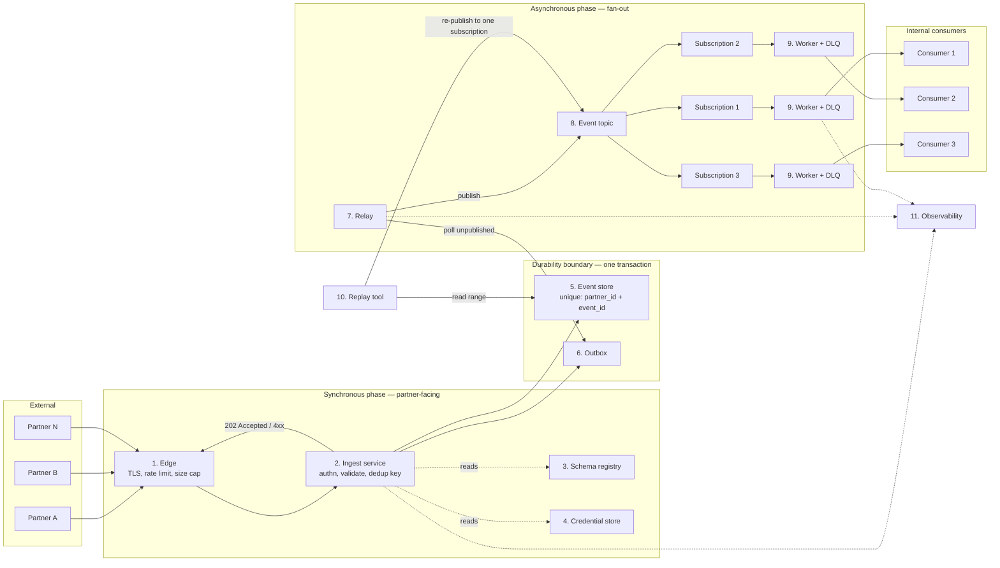
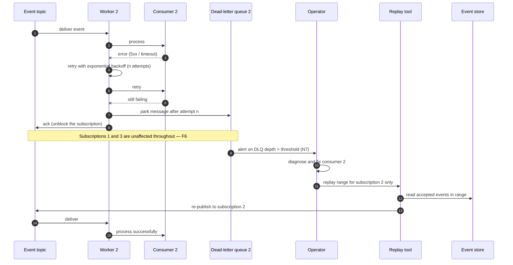

# RFC — Partner webhook ingestion pipeline

**Status:** draft (open for comment)
**Current working focus:** concluded — decision recorded, pending review
**Date:** 2026-09-08

> **How to read this on the wiki.** Every diagram is embedded in this page as a Mermaid code block —
> nothing here links out to a drawing tool. If your wiki does not render Mermaid, each diagram is
> followed by a plain-text equivalent (an ASCII box drawing or a numbered step list) that carries the
> same information. Nothing in this document requires opening an external link.

## Related documents

No prior documents exist for this pipeline. The following need to be produced and linked here as they
are written; each is referenced from the section that depends on it:

- **Partner-facing ingestion contract** — endpoint, envelope schema, signing scheme, error codes,
  retry expectations. Depends on the decision in this RFC. Blocks partner onboarding.
- **Event schema registry** — per-partner, per-event-type versioned schemas (see *Design → Schema
  registry*).
- **Capacity measurement** — the source of the "≈200 events/s at peak, measured last month" figure
  used throughout. **This figure was supplied verbally and is not verified in this document**; see
  Assumption **A1**.
- **Consumer contracts** — one per internal consumer: delivery semantics, payload shape, idempotency
  obligations, replay procedure.

---

## Context

Partners send us business events. Today each partner integration is negotiated and handled on its own
terms, and we have no single place where an incoming event is authenticated, checked, recorded, and
handed to the systems that need it. That means three things go wrong repeatedly in this class of
system, and all three are structural rather than accidental:

1. **An event that arrives is not necessarily an event we keep.** Without a durable write that happens
   before we answer the partner, a crash, a deploy, or a downstream outage during the request loses
   data that the partner believes we accepted. Partners retry on failure, but they do not retry on a
   `200` we should not have sent.
2. **Partners retry, so we receive the same event more than once.** Any partner that implements
   at-least-once delivery — which is the norm for webhooks — will occasionally send a duplicate: a
   timeout on their side where our side actually succeeded, a redeploy mid-flight, an operator
   replaying a backlog. If we treat every delivery as new, downstream systems double-count.
3. **Every new internal consumer becomes a change to the partner-facing hot path.** When the code that
   answers the partner also calls the systems that consume the event, adding a fourth consumer means
   editing and redeploying the endpoint that partners depend on, and one slow consumer becomes a
   partner-visible outage.

**The problem to solve:** define one ingestion pipeline that accepts partner events over HTTP,
validates them, removes duplicates, persists them durably, and delivers them to three internal
consumers, such that (a) nothing we accept is ever lost, (b) a duplicate delivery from a partner does
not become a duplicate event internally, and (c) a broken or slow consumer affects neither the
partners nor the other two consumers.

**Why now:** three consumers are already waiting on the same event stream. Whatever we build for the
first one, the other two will inherit — including its failure modes. The shape of the pipeline is
expensive to change once three teams have built against it and partners have integrated against a
published contract, which puts this squarely in the category of decision that deserves a written
record before code.

**Scale we are designing for.** Peak load is **≈200 events/s**, measured last month (Assumption
**A1** — the measurement basis, the window, and the averaging interval are unverified here). Every
sizing number below is derived from that single figure, and the derivations are shown so a reviewer
can recheck them against the real measurement:

| Derived quantity | Arithmetic | Value |
| --- | --- | --- |
| Events per day at sustained peak | 200 × 86,400 | 17,280,000 |
| Design target with 2× headroom | 200 × 2 | 400 events/s |
| Canonical writes at design target | 400 ingest + 400 outbox rows | 800 writes/s |
| Fan-out deliveries at design target | 400 × 3 consumers | 1,200 deliveries/s |
| Raw intake/day at measured peak, 4 KB per event (Assumption **A2**) | 200 × 4 KB × 86,400 | ≈69 GB/day |
| Stored volume over a 30-day window | 69.12 × 30 | ≈2.07 TB |

> Note on volume: at the **measured** 200 events/s and an assumed 4 KB average payload, raw intake is
> 800 KB/s → **≈69 GB/day** (800 × 86,400 = 69,120,000 KB) → **≈2.07 TB** over a 30-day retention
> window. Payload size is a pure assumption (**A2**) and it, not the event rate, dominates storage
> cost — a 40 KB average payload makes this 20.7 TB. **This is the single most important number to
> replace with a measurement before implementation starts.**

### Out of scope

- **What each of the three consumers does with an event.** This RFC ends at delivery. Consumer-internal
  design belongs to the consumer teams.
- **Outbound webhooks (us → partners).** Different problem, different failure modes, different document.
- **Partner onboarding workflow** (contracts, credentials issuance UI, sandbox environment). Named as
  a dependency, designed elsewhere.
- **Choice of specific cloud products.** The deployment target was not stated (Assumption **A5**), so
  this document decides the pipeline's *structure* and states each component as a capability. A mapping
  from capability to common implementations is given in *Design → Vendor mapping*; picking a specific
  product is a smaller, more reversible follow-up decision.
- **Replacing or migrating any existing integration.** No existing pipeline was described to me
  (Open question **Q1**); if one exists, a migration section must be added before this is approved.

---

## Requirements

Only requirements that shape the structure are listed here: things that are hard to reverse, that
force a component to exist, that the business cannot do without, or that are system-wide qualities with
a real target. Feature-level details of individual partner payloads deliberately do not appear.

### Functional

| ID | Requirement | Why it is architecturally relevant |
| --- | --- | --- |
| **F1** | A partner can `POST` an event over HTTPS to a single, stable, versioned endpoint and receive a definitive response for that request. | Public contract — irreversible once partners integrate. |
| **F2** | Every request is authenticated as a specific partner, and its payload integrity is verified, before any processing. | Security boundary; forces an authentication component. |
| **F3** | Every event is validated against a declared, versioned schema for its partner and type. Invalid events are **rejected in the response** with a stable, machine-readable error code and are never silently dropped. | Determines whether validation sits on the synchronous path; forces a schema registry. |
| **F4** | An accepted event is durably persisted **before** the success response is sent. Once accepted, an event is never lost. | Business-critical; forces the durability boundary to sit inside the request. |
| **F5** | A repeat delivery of an event already accepted — identified by `(partner_id, event_id)` — is acknowledged as success but produces **exactly one** canonical event and **no** additional fan-out. | Business-critical (double-counting); forces a dedup mechanism and a uniqueness constraint. |
| **F6** | Each of the three consumers receives every accepted event independently. A consumer that is down, slow, or failing does not affect the partners, the pipeline, or the other two consumers. | The core structural requirement; forces decoupled fan-out with per-consumer state. |
| **F7** | Any accepted event can be re-delivered to any single consumer, for an arbitrary time range or event id, without partner involvement. | Forces the canonical store to be the source of truth, and forces per-consumer addressable delivery. |
| **F8** | An event that a consumer cannot process is parked where an operator can see it, count it, inspect it, and re-drive it — it is neither dropped nor retried forever. | Forces per-consumer dead-letter handling. |
| **F9** | Adding a fourth consumer requires no change to the ingest path partners talk to. | Shapes the boundary between ingest and fan-out. |

### Non-functional

| ID | Requirement | Target | Notes |
| --- | --- | --- | --- |
| **N1** | Ingest throughput | Sustains **400 events/s** (2× measured peak) with no error-rate increase, validated by load test before launch | Derived from A1 |
| **N2** | Ingest latency | p95 ≤ 150 ms, p99 ≤ 500 ms, measured at our edge | Assumption **A3** — no partner timeout requirement was given |
| **N3** | Ingest availability | 99.9% monthly on the partner-facing endpoint | Assumption **A4**. Note the ingest path must be *more* available than any consumer, which is the point of decoupling |
| **N4** | Durability & retention | Zero loss of accepted events; all accepted events replayable for **30 days** | Assumption **A6**; drives the storage sizing above |
| **N5** | Delivery semantics | **At-least-once** to each consumer. Consumers must be idempotent; this is a published, non-negotiable clause of the consumer contract | Hard to reverse: it is a contract with three teams |
| **N6** | Fan-out freshness | p95 end-to-end (accepted → delivered) ≤ 5 s under normal operation | Assumption **A7**. Distinct from N2 — this is the asynchronous leg |
| **N7** | Observability | `event_id` propagated as the correlation id across every hop; per-partner accept/reject/duplicate rates; per-consumer lag, retry, and dead-letter depth; alert on unpublished-event age | Operability is what makes an asynchronous pipeline supportable at all |
| **N8** | Abuse & blast-radius control | Per-partner request rate limit and payload size cap enforced at the edge; one partner's traffic cannot degrade another's | Forces enforcement at the edge rather than in application code |
| **N9** | Ordering | **No global ordering guarantee.** Per-partner ordering is best-effort only | Assumption **A8**, and the highest-leverage one: a strict per-key ordering requirement would change the fan-out design materially |

---

## Design

Every component below exists to satisfy named requirements, and every requirement above is met by a
named component. The traceability check runs in both directions in *Requirement coverage* at the end
of this section.

The pipeline splits at one seam, and that seam is the whole design: a **synchronous phase** that ends
the moment the event is durably ours, and an **asynchronous phase** that gets it to the consumers.
The partner's response depends only on the synchronous phase.

### Components

| # | Component | Responsibility | Requirements served |
| --- | --- | --- | --- |
| 1 | **Edge** (TLS terminator / API gateway) | TLS, per-partner rate limiting, request body size cap, request logging | N8, N3 |
| 2 | **Ingest service** (stateless, horizontally scaled) | Verify partner signature; validate envelope + payload against the registry; compute the dedup key; write canonically; answer the partner | F1, F2, F3, F4, F5, N1, N2 |
| 3 | **Schema registry** | Versioned schema per `(partner, event_type, version)`, loaded and cached by ingest | F3 |
| 4 | **Partner credential store** | Per-partner signing secrets, supporting two live keys for rotation | F2 |
| 5 | **Event store** (canonical) | The source of truth. One row per accepted event, with a **unique constraint on `(partner_id, event_id)`** | F4, F5, F7, N4 |
| 6 | **Outbox** | A row written **in the same transaction** as the event row, recording that the event still needs publishing | F4, F6 |
| 7 | **Relay** | Polls the outbox, publishes to the event topic, marks the row published. At-least-once; restartable | F6, N6 |
| 8 | **Event topic** with **three independent durable subscriptions** | Decouples ingest from consumers; each subscription tracks its own position, retries, and failures | F6, F8, F9 |
| 9 | **Per-consumer delivery worker + dead-letter queue** | Retries with backoff; parks poison messages after a bounded number of attempts | F8 |
| 10 | **Replay tool** (operator CLI / admin endpoint) | Re-publishes a time range or id set to **one** named subscription, from the event store | F7 |
| 11 | **Observability stack** | Metrics, structured logs keyed by `event_id`, traces, dashboards, alerts | N7 |

Component 6 (the outbox) is the one that reviewers should push on hardest — it is the price paid for
"nothing accepted is ever lost" and it is argued out in *Alternatives → Dimension C*.

### Static diagram — components



<details>
<summary>Plain-text equivalent of the static diagram (if Mermaid does not render)</summary>

```
                  SYNCHRONOUS PHASE (partner-facing)          DURABILITY BOUNDARY
  Partner A ─┐   ┌────────┐   ┌──────────────────┐           ┌──────────────────────┐
  Partner B ─┼──►│ 1 Edge │──►│ 2 Ingest service │──one txn─►│ 5 Event store        │
  Partner N ─┘   │ TLS    │   │  - verify sig    │           │   unique(partner_id, │
                 │ rate   │   │  - validate      │           │          event_id)   │
                 │ limit  │◄──│  - dedup key     │           ├──────────────────────┤
                 │ size   │202│                  │           │ 6 Outbox             │
                 └────────┘   └───┬──────────┬───┘           └───────────┬──────────┘
                                  │          │                           │ poll
                        ┌─────────▼──┐  ┌────▼───────────┐               │
                        │ 3 Schema   │  │ 4 Credential   │        ┌──────▼──────┐
                        │   registry │  │   store        │        │  7 Relay    │
                        └────────────┘  └────────────────┘        └──────┬──────┘
                                                                         │ publish
  ASYNCHRONOUS PHASE (fan-out)                                    ┌──────▼──────┐
                                                                  │ 8 Event     │
   10 Replay tool ──reads range from event store──────────────────►│   topic     │
                                                                  └──┬───┬───┬──┘
                                      ┌──────────────────────────────┘   │   └────────────┐
                              ┌───────▼────────┐            ┌────────────▼───┐   ┌────────▼───────┐
                              │ Subscription 1 │            │ Subscription 2 │   │ Subscription 3 │
                              │ 9 worker + DLQ │            │ 9 worker + DLQ │   │ 9 worker + DLQ │
                              └───────┬────────┘            └────────────┬───┘   └────────┬───────┘
                                      ▼                                  ▼                ▼
                                 Consumer 1                         Consumer 2       Consumer 3

  11 Observability collects from ingest, relay and every worker (correlation id = event_id).
```
</details>

**Reading the diagram:** everything left of the durability boundary happens inside the partner's HTTP
request. Everything right of it happens afterwards and cannot influence what the partner was told. The
three subscriptions are the mechanism behind F6 and F9 — they are the only place that knows how many
consumers exist.

### Dynamic diagram 1 — happy path, and the duplicate path

```mermaid
sequenceDiagram
  autonumber
  participant P as Partner
  participant E as Edge
  participant I as Ingest service
  participant DB as Event store and Outbox
  participant R as Relay
  participant T as Event topic
  participant C as Consumers 1 to 3

  P->>E: POST /v1/events (signed body)
  E->>E: rate limit + size cap
  E->>I: forward request
  I->>I: verify signature (partner key)
  I->>I: validate envelope + payload vs schema
  I->>DB: BEGIN; insert event ON CONFLICT DO NOTHING
  alt new event (0 conflicts)
    DB-->>I: 1 row inserted
    I->>DB: insert outbox row; COMMIT
    I-->>P: 202 Accepted - receipt event_id, status accepted
  else duplicate (conflict on partner_id + event_id)
    DB-->>I: 0 rows inserted
    I->>DB: ROLLBACK (no outbox row)
    I-->>P: 200 OK - receipt event_id, status duplicate
  end
  R->>DB: poll unpublished outbox rows (batch)
  R->>T: publish event
  T-->>R: ack
  R->>DB: mark outbox row published
  T->>C: deliver to each of 3 subscriptions independently
```

Numbered flow, for readers whose wiki does not render the sequence diagram:

1. **Partner posts.** `POST /v1/events` over TLS, body signed with the partner's current key, carrying
   the partner's own `event_id`.
2. **Edge checks the cheap things first.** Per-partner rate limit and body size cap. Rejections here
   never reach application code (N8).
3. **Ingest verifies identity.** Signature recomputed over timestamp + body using the partner's keys;
   stale timestamps rejected as replays (F2).
4. **Ingest validates content.** Envelope, then payload against the registry schema for
   `(partner, event_type, version)`. Failure → `422` with a stable error code naming the offending
   field. The partner learns this synchronously (F3).
5. **One transaction crosses the durability boundary.** Insert the canonical event row; on conflict with
   the unique `(partner_id, event_id)` index, do nothing. If a row was inserted, also insert the outbox
   row, then commit (F4, F5).
6. **Partner is answered.** `202 Accepted` for a new event, `200 OK` with `status: duplicate` for a
   repeat — both are successes from the partner's point of view, so the partner stops retrying, which
   is exactly what we want. Nothing downstream has run yet, and the response does not depend on it.
7. **Relay publishes.** A separate process claims a batch of unpublished outbox rows, publishes to the
   topic, and marks them published. A crash before marking republishes later — hence at-least-once, hence
   N5.
8. **Each subscription delivers on its own clock.** Three independent cursors, three independent retry
   states, three independent dead-letter queues (F6, F8).

**The duplicate case is the important one to notice:** because the conflict is detected by the same
atomic insert that provides durability, two concurrent deliveries of the same event cannot both win a
race — there is no check-then-act window. One inserts, the other conflicts. And because the outbox row
is only written when a row was actually inserted, a duplicate produces **no** fan-out (F5).

### Dynamic diagram 2 — a consumer fails, and what recovery looks like



The recovery story in words: consumer 2 breaks; its worker retries with backoff; after a bounded number
of attempts the message is parked in consumer 2's dead-letter queue and acknowledged, so the
subscription keeps moving rather than head-of-line blocking behind one bad event (F8). Consumers 1 and
3 never notice, and partners never notice. An operator is alerted on dead-letter depth (N7), fixes the
consumer, and replays the affected range **to consumer 2's subscription only**, sourced from the event
store rather than from the partners (F7). Consumer 2's idempotency (N5) makes the replay safe even
where it overlaps events it already processed.

### Vendor mapping

The deployment target was not stated (Assumption **A5**), so components are specified as capabilities.
This table exists so the design can be implemented on whatever we already run, and so nobody reads a
product name into the decision. **Picking a row is a follow-up decision, not part of this RFC** — the
structure above holds for any row.

| # | Capability required | Non-exhaustive implementations that satisfy it |
| --- | --- | --- |
| 1 | TLS termination, per-client rate limit, body size cap | Managed API gateway; NGINX / Envoy; a CDN edge |
| 5 | Durable store with a **transactional unique constraint** and range queries | PostgreSQL, MySQL, or any relational store; a document store with a unique index and multi-document transactions |
| 6 | Outbox — must share a transaction with #5 | A table in the same database as #5. **Not** a separate system, or the guarantee is lost |
| 8 | Topic with **independent durable per-consumer cursors**, retry, and a dead-letter destination | Kafka (consumer groups), Pulsar, NATS with JetStream, RabbitMQ (one queue per consumer bound to a fanout exchange), or a managed pub/sub with three subscriptions |
| 9 | Bounded retry with backoff and a dead-letter destination | Broker-native where available; otherwise a small worker library |

The one hard constraint in this table: **#6 must live in the same transactional scope as #5.** If the
chosen store cannot do that, the outbox mechanism is unavailable and Dimension C must be re-decided
(see *What would flip this decision*).

### Requirement coverage

| Requirement | Met by | Requirement | Met by |
| --- | --- | --- | --- |
| F1 | 1, 2 | F9 | 8 |
| F2 | 2, 4 | N1 | 2 (stateless, scales horizontally), 5 |
| F3 | 2, 3 | N2 | seam: response depends on 1, 2, 5 only |
| F4 | 5, 6 (one transaction) | N3 | 1, 2, 5 — no consumer on the path |
| F5 | 5 (unique constraint), 2 | N4 | 5 |
| F6 | 7, 8, 9 | N5 | 7 (at-least-once publish), consumer contract |
| F7 | 5, 10 | N6 | 7, 8 |
| F8 | 9 | N7 | 11 |
| — | — | N8 | 1 |
| — | — | N9 | stated as a non-guarantee; no component needed |

No component in the list lacks a requirement, and no requirement lacks a component. **N9 is the one to
challenge:** it is satisfied by *declaring* that we do not guarantee ordering. If a consumer turns out
to need per-key ordering, component 8 and the relay both change (see *What would flip this decision*).

---

## Alternatives analysis (Tradeoff)

Four dimensions are genuinely open, and each is decided against the requirements above rather than on
preference. Where an alternative has more than one material risk, it occupies more than one row.

| Alternative | Pros | Cons | Risk (description) | Impact | Probability | Mitigation | Contingency |
| --- | --- | --- | --- | --- | --- | --- | --- |
| **[A. Response mode] A1 — Fully synchronous: validate, dedupe, persist, and call all three consumers before responding** | Partner learns the true end-to-end outcome in the response; no broker, no outbox, no lag to monitor; simplest possible tracing; no "accepted ≠ processed" ambiguity to explain | Partner-visible latency is the sum of the slowest consumer; endpoint availability becomes the product of four systems' availability, violating N3; cannot absorb bursts; any consumer deploy is a partner-facing risk; violates F6 and F9 outright | One consumer's latency spike breaches partner timeouts → 5xx to partners → partner-side retry storm amplifies load exactly when we are already degraded | High | High | Per-consumer timeouts and circuit breakers — which, taken to their conclusion, *are* the asynchronous design | Emergency switch to accept-then-process, i.e. build A2 anyway under incident pressure |
| | | | Burst above measured peak cannot be buffered anywhere | Medium | Medium | Autoscale ingest and all three consumers together | Shed load with 429 and depend on partner retry behaviour we do not control |
| **[A] A2 — Accept-then-process: authenticate, validate and persist synchronously; fan out asynchronously** *(chosen)* | Partner latency bounded by our own store only (N2); consumer outages invisible to partners (N3, F6); absorbs bursts; the store becomes a replay source (F7); new consumers do not touch the ingest path (F9) | Partner cannot learn a downstream outcome from the response — needs a documented contract and a receipt lookup; requires monitoring of lag and dead-letter depth or failures go unnoticed; more components to operate | Partner reads `202` as "fully processed" and never checks for downstream failures → divergence discovered late, by someone else | Medium | Medium | State it explicitly in the partner contract; return a receipt id; expose a per-event status lookup; notify partners on systematic failures | Daily per-partner reconciliation report (counts accepted vs. processed) |
| | | | Fan-out backlog grows silently while ingest looks perfectly healthy | High | Medium | Alert on oldest-unpublished-outbox-age and per-subscription lag against N6, not on error rate alone | Replay from the event store once the consumer recovers (F7) |
| **[A] A3 — Accept with authentication only; validate asynchronously** | Lowest possible ingest latency and cheapest hot path; ingest never rejects for content reasons, so partner integration "always works" | Malformed events get a success response, so partners lose the fastest and most useful feedback loop they have; invalid data enters the canonical store; violates F3 | A partner's bad release floods the store with invalid events; the failure surfaces hours later, in our queues rather than in their tests | High | Medium | Validate synchronously — i.e. reject this alternative | Per-partner quarantine plus bulk purge tooling, and a difficult conversation |
| **[B. Deduplication] B1 — Unique constraint on `(partner_id, event_id)` in the canonical store, insert with on-conflict-do-nothing** *(chosen)* | Dedup happens in the same atomic operation as durability, so there is no check-then-act race; correct across restarts and concurrent requests; no extra component; window is the full retention period, not a cache TTL; on-conflict result is what decides whether fan-out happens | Every duplicate costs a store round trip; index grows with retention; dedup window bounded by retention (N4) | Index size and write amplification degrade write latency at 2× peak (800 writes/s) | Medium | Medium | Partition by ingest date with per-partition indexes; verify with a load test at 2× peak before launch (N1) | Add a short-TTL cache in front as a read-through filter (B2), keeping B1 as the authority |
| | | | A partner reuses an `event_id` for a genuinely different event → a real event is silently discarded as a duplicate. This is the worst failure in the whole design: silent data loss that looks like correct behaviour | High | Medium | Store a payload hash alongside the key; on key match with hash mismatch, **reject with a distinct error code and alert** — never silently treat it as a duplicate | Quarantine table for hash-mismatch events plus partner escalation; nothing is lost because nothing was dropped |
| **[B] B2 — Dedicated cache with TTL (set-if-not-exists)** | Very fast; keeps duplicate traffic off the store entirely; trivially horizontally scalable | Not authoritative: eviction, restart or failover admits duplicates; TTL caps the dedup window; two systems that can disagree about what has been seen | Cache failover loses keys → a burst of duplicates flows through to all three consumers | Medium | Medium | Use only as an optimisation in front of B1, never as the authority | Fall back to B1 plus consumer idempotency (N5) |
| **[B] B3 — Stateful stream-processor with windowed dedup** | Scales independently of the database; keeps dedup load off the store; natural fit if we already ran stream processing | Introduces a stateful streaming runtime and its whole operational surface for one function; window still bounded; rebalance and state-restore edge cases; dedup would sit *after* the durability boundary, so the store could still hold duplicates | Operational complexity exceeds what the value justifies at 200 events/s | Medium | High | Adopt only if load tests prove B1 cannot hold 2× peak | Revert to B1 (+B2 as a filter) |
| **[B] B4 — No central dedup; require all three consumers to be idempotent** | No dedup component at all; consumers must be idempotent under at-least-once delivery regardless (N5), so this adds no new obligation | The same problem is solved three times, by three teams, with three chances to get it wrong; duplicate rows in the canonical store destroy its value as a source of truth and corrupt replay (F7); violates F5 | One of three consumers implements idempotency subtly wrong → double-counted business data, found by finance rather than by us | High | High | Central dedup at B1, with consumer idempotency as defence in depth rather than the primary control | Per-consumer reconciliation and corrective replay, after the fact |
| **[C. Fan-out] C1 — Ingest calls the three consumers directly (in-process, after responding)** | No broker and no outbox; fewest moving parts; end-to-end trace in one service | Ingest must know every consumer, so consumer changes redeploy the partner-facing service (violates F9); partial-failure bookkeeping, retry and backoff all hand-rolled; in-process work is lost on pod termination unless it is persisted — which reinvents the outbox | Events lost on deploy or crash between the response and the delivery attempt, contradicting F4's spirit ("never lost") | High | High | Persist pending deliveries before responding — which is the outbox, i.e. C3 | Replay from the store, if the store is authoritative; otherwise nothing to replay from |
| **[C] C2 — Publish to a topic directly from the request handler; three durable subscriptions** | Consumers fully decoupled and independently added (F6, F9); broker-native retry, dead-lettering and lag metrics; 1,200 deliveries/s at design target is unremarkable for any mainstream broker (inference — to be confirmed by load test) | Dual write: the store commit and the topic publish are two systems and cannot be made atomic. A crash between them either loses the fan-out or duplicates it | An event is committed to the store but never published — silent, permanent, and invisible to every dashboard that only watches error rates | High | Medium | A transactional outbox (C3) removes the dual write entirely | Periodic sweep comparing stored events against a published watermark, then replay the gap |
| **[C] C3 — Transactional outbox + relay, then topic with three subscriptions** *(chosen)* | Event row and outbox row commit atomically, so "accepted" and "will be published" become the same fact (F4, F6); the relay is small, stateless and restartable; publishing problems cannot affect the partner response; keeps every decoupling benefit of C2 | One more moving part to run; adds poll-interval latency to N6; the outbox needs pruning; the relay is at-least-once, so duplicate *publishes* are possible and consumers must be idempotent (N5) | The relay stalls (bad deploy, lock contention, credential expiry) and all three consumers silently go stale while ingest reports perfect health | High | Medium | Alert on oldest-unpublished-outbox-age (e.g. > 60 s) as a first-class SLO; run ≥ 2 relay instances with claim-based row locking; relay is stateless so restart is safe and instant | Manual replay from the store (F7); the outbox retains everything unpublished, so nothing is lost by the stall itself |
| | | | Outbox becomes a write hotspot at 2× peak (a second write per event, plus a delete) | Medium | Medium | Delete-on-publish so the table stays small; batch the claim query; load test at 800 writes/s (N1) | Move the outbox to its own database instance, accepting the loss of atomicity only if a compensating sweep is in place |
| **[C] C4 — Consumers pull directly from the event store, each with its own cursor** | No broker and no outbox; the source of truth is the only source; replay is inherent and free (F7); each consumer owns its position; genuinely fewer systems to run | Three pollers query the transactional store continuously; each consumer reimplements cursors, batching and backoff; consumers couple to our internal schema, which we then cannot change; polling interval trades freshness (N6) against load; no native dead-lettering (F8) | Consumer read load degrades ingest writes → partner-visible latency, violating N2 and N3 | High | Medium | Dedicated read replica for consumer polling | Cut over to C3 |
| | | | Three teams coupled to our table schema; any migration becomes a four-team negotiation | Medium | High | Expose a versioned view rather than base tables | Introduce the topic (C3) as an insulating layer |
| **[D. Partner authentication] D1 — HMAC signature over timestamp + body, per-partner shared secret** *(chosen)* | The de facto webhook standard, so most partners already have working client code; no client-certificate infrastructure; protects payload integrity as well as identity (F2); the signed timestamp defeats replay | Shared secrets must be distributed and rotated; body canonicalisation must be specified precisely or signatures mismatch across HTTP stacks; a leaked secret means impersonation | A partner's secret leaks (their logs, their repo, an ex-employee) | High | Low | Per-partner secrets; support two live keys from day one so rotation needs no downtime; store in a managed secret store; never log bodies or signatures | Revoke and rotate that one partner's key; the replay window bounds the damage; blast radius is one partner |
| **[D] D2 — Mutual TLS** | Strongest option; no shared secret travels in the payload path; revocation via short-lived certificates; identity established before any application code runs | A certificate lifecycle per partner, which is real ongoing work for both sides; some partners cannot present client certificates at all; the terminating proxy must forward the verified identity, which constrains component 1 | A partner's certificate expires unnoticed → their ingestion stops entirely | Medium | High | Monitor expiry with alerts at 30/14/7 days for every partner certificate | Temporary signed-secret path for the affected partner while the certificate is reissued |
| **[D] D3 — Bearer token / OAuth client credentials** | Familiar to partners with existing OAuth clients; centralised issuance and revocation; short-lived tokens limit exposure | The token endpoint becomes a hard dependency for every partner request cycle; a bearer token proves identity but not payload integrity, so F2's second half needs another mechanism; tokens are replayable if captured | Token endpoint outage blocks ingestion from every partner simultaneously | High | Low | Generous token TTL plus locally cached key-set validation, so ingestion survives a token-endpoint outage | Emergency per-partner static key path |

### Checking the finalists against the requirements

| Requirement | A2 | A1 | A3 | B1 | B4 | C3 | C2 | C4 |
| --- | --- | --- | --- | --- | --- | --- | --- | --- |
| F3 reject invalid synchronously | yes | yes | **no** | n/a | n/a | n/a | n/a | n/a |
| F4 never lose an accepted event | yes | yes | yes | yes | yes | yes | **no** (dual write) | yes |
| F5 exactly one canonical event | n/a | n/a | n/a | yes | **no** | n/a | n/a | n/a |
| F6 consumer isolation | yes | **no** | yes | n/a | n/a | yes | yes | partial |
| F7 per-consumer replay | yes | no | yes | yes | **no** (store holds duplicates) | yes | yes | yes |
| F9 add a consumer without touching ingest | yes | **no** | yes | n/a | n/a | yes | yes | yes |
| N2 / N3 ingest latency & availability | yes | **no** | yes | yes | yes | yes | yes | **no** (poll load on the store) |

Each rejected option fails at least one requirement outright, in bold. That is the basis for the
decision — not that the chosen options are more elegant.

---

## The decision

**Decision: A2 + B1 + C3 + D1.** Concretely:

1. **Accept-then-process.** Partners are answered as soon as the event is durably ours: authenticate,
   validate against the registry, write canonically, respond `202` (or `200 … duplicate`). Fan-out
   happens afterwards and never affects that response.
2. **Deduplicate with a unique constraint** on `(partner_id, event_id)` in the canonical store, applied
   by an on-conflict-do-nothing insert, with a payload hash guarding against `event_id` reuse. Consumer
   idempotency remains contractually required (N5) as defence in depth, not as the primary control.
3. **Fan out through a transactional outbox and relay** into one topic with three independent durable
   subscriptions, each with its own retry policy and dead-letter queue.
4. **Authenticate partners with per-partner HMAC signatures** over timestamp and body, with two live keys
   for rotation. mTLS (D2) is offered additively to partners whose security policy requires it — the
   ingest service treats both as "an authenticated partner identity".

**Decision style: autocratic.** This is the author's call to make as the owner of the ingestion path,
taken after weighing the alternatives above; it is published here for comment rather than for a vote.
The three consumer teams hold a veto on exactly one clause — **N5, the at-least-once contract** —
because it imposes work on them; if any of them cannot meet it, Dimension B must be re-opened before
implementation. (Assumption **A9**: no team structure or approval process was described to me.)

### The strongest objection to this recommendation

Not a strawman — this is the argument I would expect from the most senior reviewer, and it is a good one:

> *"You have specified a store, an outbox, a relay, a topic, three subscriptions, three dead-letter
> queues and a replay tool for a pipeline handling 200 events per second. A single service that writes
> to a table and three consumers that poll it (C4) would ship in a fraction of the time, has fewer
> failure modes because it has fewer parts, and 200 events per second does not justify a broker."*

That is right about the throughput: **nothing here is justified by 200 events/s.** A single modest
database node handles 800 writes/s comfortably (inference — to be confirmed by the load test in N1),
and the broker is not carrying load, it is carrying *isolation*. The design is justified by three
requirements instead:

- **F6 / N3** — with C4, consumer polling load lands on the store that partners depend on. The isolation
  we need is not throughput isolation, it is failure isolation.
- **F9** — three consumers exist today and a fourth is the normal course of events. With C1 or C4, each
  new consumer touches either the partner-facing service or our internal schema.
- **F4** — the outbox exists solely so that "we accepted it" and "it will be delivered" are one atomic
  fact. Without it (C2), the failure mode is an event that is stored but never delivered: silent,
  permanent, and invisible to error-rate dashboards.

If those three requirements were relaxed, C4 would be the better engineering decision, and I would
switch to it. The honest summary is that this design buys isolation and a no-loss guarantee at the cost
of two extra moving parts, and that trade only makes sense because three teams and an unbounded stream
of future ones depend on it.

### What would flip this decision

Concrete, checkable conditions — if any holds, re-open the named dimension before writing code:

- **Only one consumer is real for the next 12 months, and losing fan-out is tolerable** → drop to C4;
  the store plus per-consumer cursors is then simpler and sufficient.
- **We already operate a change-data-capture pipeline off the chosen store in production** → drop the
  outbox and relay; capture the change log directly. Same guarantee, one component fewer, *provided* the
  pipeline is already load-bearing rather than aspirational.
- **The chosen store cannot write the event row and the outbox row in one transaction** (Assumption
  **A5** resolves against us) → the outbox guarantee is unavailable; re-decide Dimension C between
  change-data-capture and C2-plus-a-reconciliation-sweep.
- **Any consumer requires strict per-key ordering** (N9 turns out to be wrong) → the relay must publish
  with a partition key, the subscriptions must preserve per-key order, and dead-lettering can no longer
  simply skip a failing message. This is the single assumption most likely to change the design.
- **Measured duplicate rate is effectively zero and the load test shows the unique index cannot hold 2×
  peak** → re-open Dimension B toward B2-in-front-of-B1.
- **Measured payload size is an order of magnitude above Assumption A2** → retention (N4) and the store
  choice both need revisiting; consider storing large payloads by reference.

### Evidence still needed before implementation

Three cheap measurements, each of which can invalidate part of this design. All three are
axe-sharpening, not delay:

1. **Re-derive the load numbers from the source of the 200 events/s measurement** (Assumption A1): peak
   averaging window, per-partner distribution, burst ratio, and above all **average and p99 payload
   size** (A2). Roughly a day's work against existing logs. Highest value per hour spent of anything in
   this document.
2. **Measure the actual duplicate rate** in the same historical window. It sets how much the dedup path
   matters and whether `event_id` reuse (the B1 high-impact risk) already happens today.
3. **Load test at 2× peak** — 400 events/s ingest, 800 writes/s including the outbox — plus a soak test
   with one consumer stopped for 24 h, to prove that the backlog behaves, that ingest is unaffected, and
   that replay recovers the stopped consumer (validates N1, N6, F6, F7).

---

## Assumptions and open questions

Everything below was assumed because no input was available. Each is labelled, and each names who must
confirm it. **An assumption marked "would change the design" must be resolved before implementation
starts, not during it.**

| ID | Assumption | Confirm with | Would change the design? |
| --- | --- | --- | --- |
| **A1** | Peak is ≈200 events/s as measured last month; treated as a sustained peak, not a one-second spike. Unverified in this document. | Whoever produced the measurement | Only the sizing, unless it is off by >5× |
| **A2** | Average payload ≈4 KB. Drives all storage sizing. | Historical request logs | Yes — retention and store choice |
| **A3** | Ingest p95 ≤ 150 ms / p99 ≤ 500 ms; no partner-mandated timeout is tighter. | Partner integration contracts | Yes if a partner demands a hard sub-100 ms budget |
| **A4** | 99.9% monthly availability on the ingest endpoint is sufficient. | Business / partner contracts | Yes at 99.99% — multi-region, and the store becomes the hard part |
| **A5** | We can deploy a relational-class store with transactional unique constraints, and a broker with independent per-consumer cursors. | Platform / infrastructure owners | Yes — see *What would flip this decision* |
| **A6** | 30-day replayable retention is enough; older events may be archived or dropped. | Consumer teams, compliance | Only sizing, unless retention is measured in years |
| **A7** | End-to-end fan-out freshness of ≤ 5 s at p95 is acceptable to all three consumers. | The three consumer teams | Yes if any consumer needs sub-second delivery |
| **A8** | No consumer requires strict per-key or global ordering. | The three consumer teams | **Yes — materially.** The highest-risk assumption here |
| **A9** | The author owns this decision; consumer teams are consulted, and hold a veto only on N5. | Engineering leadership | No, but it changes how this is approved |
| **A10** | Partners can implement HMAC request signing; a minority may need mTLS instead. | Partner-facing team | No — both are supported |

Open questions I could not answer and that a reviewer should answer inline:

- **Q1** — Does an ingestion path already exist for any partner? If so, this RFC needs a migration
  section and a decommissioning plan, and *Out of scope* is wrong.
- **Q2** — Who are the three consumers, and what does each actually need (full payload or a
  notification, freshness, ordering, replay depth)? Answers may collapse or complicate Dimension C.
- **Q3** — How many partners, and what is the per-partner traffic skew? Drives per-partner rate limits
  (N8) and whether one partner can starve the others.
- **Q4** — Do payloads contain personal or regulated data? If yes, retention (N4), the replay tool
  (component 10), the dead-letter queues, and logging all acquire requirements this document does not
  cover.
- **Q5** — Must a partner be able to query the status of an event they sent? The `202` contract implies
  the need for a receipt lookup; it is not designed here.
- **Q6** — Is there an existing internal event bus? If we already run one, Dimension C is largely
  pre-decided and this document should say so.

---

## Launch strategy

Phased so that each phase is independently valuable and the risky parts meet real traffic early, with
no phase depending on all three consumers being ready.

| Phase | What ships | Exit criterion |
| --- | --- | --- |
| **0 — Contract & evidence** | Partner-facing contract, envelope schema, error codes, signing spec, schema registry with one partner's schemas. The three measurements from *Evidence still needed*. | Contract reviewed by the partner-facing team; A1, A2 and the duplicate rate replaced by measurements |
| **1 — Ingest and store, no consumers** | Edge, ingest service, event store, outbox, relay, topic. Nothing subscribes yet. One pilot partner sends real traffic. | 400 events/s load test passes (N1); zero loss over a 24 h soak; unpublished-outbox-age alert proven by deliberately stopping the relay |
| **2 — First consumer** | Subscription 1, its worker, its dead-letter queue, and the replay tool. | Consumer 1 in production; replay demonstrated end to end (F7); one consumer deliberately stopped for 24 h and recovered by replay (F6) |
| **3 — Remaining consumers** | Subscriptions 2 and 3. No change to ingest — this phase is the proof of F9. | All three consumers live; per-subscription lag and dead-letter dashboards green |
| **4 — Partner rollout** | Remaining partners onboarded against the published contract; per-partner rate limits tuned from real traffic. | All partners migrated; no open reconciliation gaps |

Phase 2 is the honest test of the whole design: replay and consumer isolation either work there, on real
traffic with one consumer, or they will not work later with three. Phase 3 shipping without touching
ingest is what F9 was for — if that phase requires ingest changes, the design failed and this document
should be revised rather than worked around.

## Tasks and roadmap

Estimates are engineering-days for one engineer, and they are estimates, not commitments. They assume
the platform capabilities in Assumption A5 already exist; if any must be provisioned from scratch, add
its own line.

| Task | Description | Estimate |
| --- | --- | --- |
| Load & payload measurement | Re-derive A1/A2 and the duplicate rate from historical logs | 1d |
| Partner contract & envelope schema | Endpoint shape, envelope, error codes, signing spec, retry guidance | 3d |
| Schema registry | Versioned schemas per partner/type; loading and caching in ingest | 3d |
| Credential store & key rotation | Two-live-key model, secret storage, rotation runbook | 2d |
| Ingest service skeleton | Project setup, config, health checks, structured logging with `event_id` correlation | 2d |
| Signature verification | HMAC over timestamp + body, canonicalisation, replay window | 2d |
| Validation layer | Envelope + payload validation against the registry, stable error codes | 3d |
| Event store schema & migrations | Event table, unique index on `(partner_id, event_id)`, payload hash, date partitioning | 3d |
| Transactional write + dedup path | On-conflict insert, conditional outbox write, hash-mismatch rejection | 3d |
| Relay | Batch claim, publish, mark published, prune; ≥2 instances with row locking | 4d |
| Topic & three subscriptions | Topic, subscriptions, retry policies, dead-letter destinations | 3d |
| Consumer worker template | Shared retry/backoff/dead-letter worker the three consumers reuse | 4d |
| Replay tool | Range and id-set replay to one named subscription, from the store | 3d |
| Observability | Dashboards and alerts for N7, including unpublished-outbox-age and per-subscription lag | 3d |
| Edge configuration | Per-partner rate limits, body size cap, TLS | 2d |
| Load & soak testing | 400 events/s, 800 writes/s, 24 h soak with a stopped consumer, replay verification | 4d |
| Runbooks | Consumer down, relay stalled, dead-letter drain, key rotation, partner onboarding | 2d |

## Version history

| Version | Date | Author | Description |
| --- | --- | --- | --- |
| 1.0 | 2026-09-08 | (author) | Document created. Decision A2 + B1 + C3 + D1 recorded, pending review; assumptions A1–A10 and open questions Q1–Q6 outstanding. |
