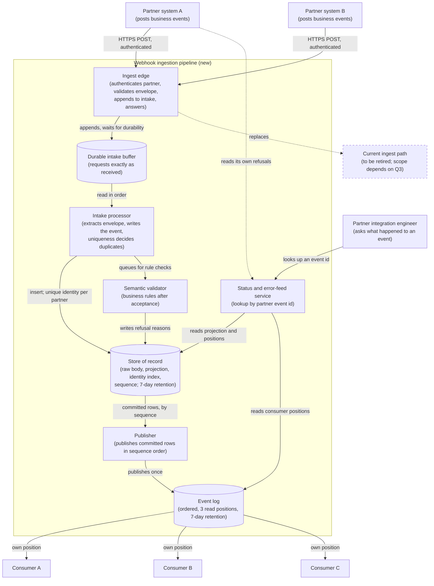
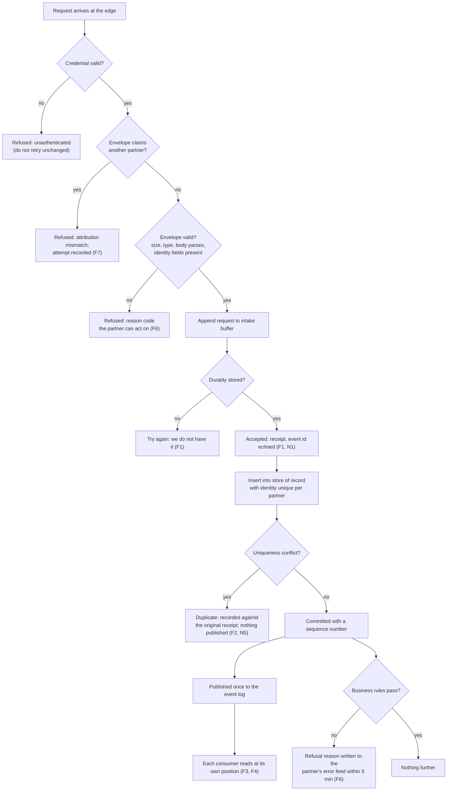
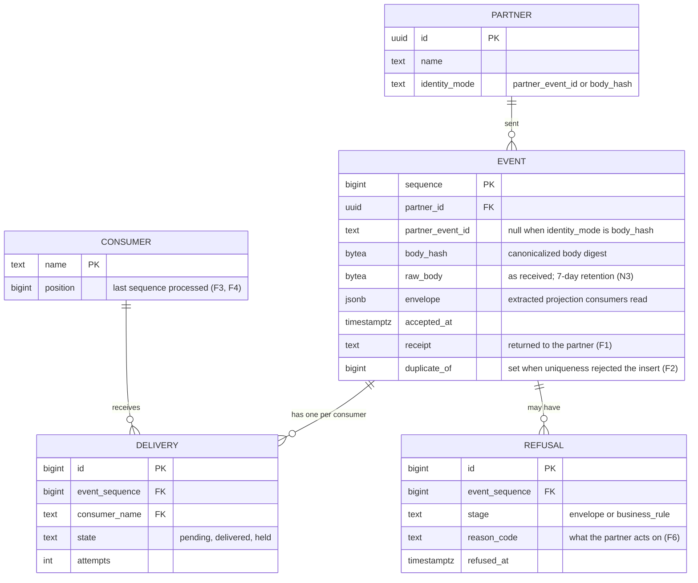

# RFC: Taking events from partners once, and getting them to every internal consumer

**Status:** proposed (three blocking questions are open; see *Assumptions and open questions*)
**Decider:** Owner of the partner-integration service (role; the person is not named in the request)  ·  **Reviewers:** the three internal consumer team leads, the owner of the data platform, the security function
**Current working focus:** decision

> Everything this document argues from is stated inside it, including the diagrams, because the team
> reads it on the wiki and does not follow links. The *Sources* section at the end is provenance for
> facts already stated above, not required reading.

## Reversibility

**Mixed, and the split decides how much space each part gets below.**

**One-way doors.** What partners see is the expensive part: the response codes they branch on, whether
they must send an event identifier, and what a successful response promises. Partners run their own
release cycles; once a dozen of them have shipped against a contract, changing it means a coordinated
migration we do not control. The retained payload is the second one: what we did not keep on the day
we accepted an event cannot be recovered later, and what we did keep may be subject to obligations we
have not yet confirmed (blocking question Q2). These two get the evidence and the alternatives.

**Two-way doors.** The mechanism that carries an accepted event to the three consumers sits entirely
behind our own boundary; swapping it is a migration of our own code with no external coordination.
Where semantic validation runs, and whether a fast duplicate check sits in front of the authoritative
one, are likewise cheap to revisit. These are decided below with less ceremony.

## Context

Partner organizations send us events by posting them to an HTTP endpoint we expose. At the busiest
point of the day that arrives at about **200 events per second** (reported by the requester as measured
last month; the instrument and the averaging window were not named, so the figure is recorded as
*measured by report* and its provenance is a non-blocking assumption below). Nothing else about the
current path was available while writing this document: no code, dashboard, cost report or ticket was
in reach, so every other number here is arithmetic on that one figure or an explicitly labelled
assumption. Where a claim would normally carry a query or a board, it carries a label instead.

Three internal consumer services need every event that arrives. Referred to below as **Consumer A**,
**Consumer B** and **Consumer C**; the request did not name them, and the names do not change the
argument.

What the single measured figure implies, as arithmetic:

- **720,000 events per hour** at the peak rate (200/s × 3,600; *estimated*).
- **17.3 million events per day** if the peak rate held all day (200/s × 86,400; *estimated*, and an
  upper bound rather than a forecast: the daily shape was not measured).
- **600 consumer deliveries per second** at the peak, because every accepted event goes to three
  consumers (200 × 3; *estimated*).
- **35.4 GB of raw payload per day** at the peak rate, assuming a 2 KB average payload (200 × 2,048 B
  = 409,600 B/s, × 86,400 = 35.4 GB; *estimated* on an *assumed* payload size). Seven days of it is
  **248 GB**.

**The problem.** Four things have to be true at once for this traffic, and each of them fails in a
different way if the pipeline is assembled without deciding them deliberately.

A partner that does not get a clear answer retries, and a retry storm arrives exactly when the
pipeline is already slow, so the acknowledgement is a load-shedding decision as much as a courtesy.
Retries mean the same event arrives more than once, so *some* deduplication is unavoidable rather than
optional, and a duplicate check that is a separate step from the write is a race that produces either
duplicates or losses under concurrency. Three consumers reading the same stream means one of them
being down, slow or broken must not stop the other two, and must not push back into ingest. And when a
partner asks "what happened to event `X`", somebody has to be able to answer without reading logs for
an afternoon.

### Current usage

| Role (what they do with the system) | What they do today | Through what | How often or how much (source) |
| --- | --- | --- | --- |
| Partner system emitting a business event | Posts the event to our endpoint and retries on failure per its own policy | HTTP POST over the public internet | ≈200 events/s at the daily peak, all partners combined (requester's report of a measurement taken 2026-08; *measured by report*) |
| Partner integration engineer investigating a delivery | Asks us whether an event arrived, and re-sends by hand if unsure | Support channel; no self-service lookup is known to exist | Volume not measured (*assumed* to be non-zero: the request names deduplication as a requirement, which implies redeliveries happen) |
| Consumer A, B and C, each processing every event | Consume events from whatever the current path exposes | Not known to this document (blocking question Q3) | Each needs 100% of accepted events; ≈600 deliveries/s combined at the peak (*estimated*) |
| On-call engineer for the ingest path | Distinguishes a partner problem from our problem during an incident | Not known to this document | No incident history was available (*assumed*: none was offered) |

### Goals

| Goal | Who benefits | How we will know |
| --- | --- | --- |
| **G1** A partner hands us an event once and does not have to reconcile it by hand afterwards | Partner integration engineers; our support | Partner-reported "you missed it" and "you processed it twice" tickets, counted from launch (no baseline exists) |
| **G2** A consumer team can be down without partners or the other consumers noticing | The three consumer teams; partners | During a consumer outage: partner-visible errors stay at zero and the other consumers' lag is unchanged (fault-injection drill, then production incidents) |
| **G3** Anyone can answer "what happened to this event" on the day it is asked | Partner integration engineers; our integrations engineers; on-call | Time from question to answer, recorded on the support ticket |
| **G4** Consumer teams can trust that what they processed is the complete set of what partners sent | The three consumer teams and everyone downstream of them | Per-consumer reconciliation: events accepted minus events processed, per day |
| **G5** Only the partner that owns an event can create it | Every partner, and every consumer relying on the data being attributable | Cross-partner write attempts: detected and rejected, counted in the audit record |

### Stakeholders

| Role (what they do with the system) | What they need from this decision | Who speaks for them |
| --- | --- | --- |
| Partner system posting events | An answer it can branch on: keep the event and retry, or drop it, or fix it and resend | Owner of the partner-integration service |
| Partner integration engineer | To know why something was rejected without opening a support ticket | Owner of the partner-integration service |
| Consumer A / B / C, each processing every event | Every accepted event; the ability to fall behind and catch up on their own; no coupling to the other two | The three consumer team leads |
| On-call engineer for the pipeline | To tell "the partner sent nonsense" from "we dropped it" in minutes, per event | Owner of the partner-integration service |
| Owner of the data platform that stores the events | A stated ceiling on storage growth and on write rate, not an open-ended one | Owner of the data platform |
| Security function | Every event attributable to the partner that sent it; a decision recorded about what the payloads contain | The security function |
| Reader of this document | The whole argument, diagrams included, without leaving the wiki page | The requester (stated in the request) |

### Constraints

No externally imposed constraint has been established. Two candidates exist and neither may exclude an
option until its clause is produced, so both are carried as blocking questions rather than as
constraints.

| Constraint | Source (outside the organization, or a signed commitment) | What it excludes, and the clause |
| --- | --- | --- |
| *Candidate, unconfirmed:* a response-time or availability commitment to partners | A partner contract or integration agreement; none was produced | Nothing, until the clause is produced. If one exists, it fixes N1's target instead of the assumed value used below |
| *Candidate, unconfirmed:* obligations over personal data in payloads (retention limits, erasure on request, encryption) | Data-protection law applicable to the partners' subjects; not established (blocking question Q2) | Nothing, until established. If it applies, it constrains the retention window in N3 and the raw-payload choice in Design |

### Prior decisions

Decided inside the organization. None of these excludes an option; each incumbent has a row in the
tradeoff table with an alternative beside it, and the cost of reversing it is carried in that row.

| Prior decision | Who made it, when | Incumbent it implies | Cost to reverse |
| --- | --- | --- | --- |
| Partners push events to an endpoint we expose, rather than us pulling from them | Whoever built the current partner integration, inside the organization; date unknown | HTTP push ingest | High: every partner would have to expose and operate a queryable API, and every existing integration would be renegotiated |
| The three consumers are separate services with their own teams | The consuming teams; date unknown | Fan-out to three independent readers | High: it is an organizational boundary, not a technical one |
| The processing order named in the request — validate, then deduplicate, then persist, then fan out | The requester, 2026-09-08 | A pipeline whose duplicate check precedes its write | Low as a document change; the analysis below argues for deduplicating *at* the write instead, and that is a row in the tradeoff table |
| Which broker, data store and runtime the team already operates | Not known to this document | Not known | Not assessable. This is why the tradeoff table compares **capability classes** rather than products: the concrete product per class cannot be chosen without knowing what is already run and owned, and that follow-up is listed in *Tasks* |

### Assumptions and open questions

**Blocking** — any answer changes the decision, so the status stays *proposed* until all three are
closed.

| Question | Owner | Date | If yes | If no |
| --- | --- | --- | --- | --- |
| **Q1** Does any of the three consumers require events in a strict order, and if so ordered by which key? | The three consumer team leads | 2026-09-15 | The fan-out must preserve order per that key, the key must be extractable from the envelope at the edge, and every fan-out option that cannot promise per-key order is excluded. Recommended answer to verify first: at least one consumer needs per-entity order | Fan-out gets simpler and the queue-per-consumer option becomes competitive with the log option |
| **Q2** Do partner payloads carry personal data, and what retention, erasure and encryption obligations follow? | The security function, with legal | 2026-09-22 | Retaining the raw payload for the replay window needs encryption at rest and a way to erase a subject's events inside a window we also replay from; N3's window becomes a constrained choice rather than a cost choice | Retention is a cost decision only, and the 7-day window below stands on the replay argument alone |
| **Q3** Is there an ingest path in production today carrying these 200 events/s, and is this decision replacing it? | Owner of the partner-integration service | 2026-09-15 | This is a cutover: the launch strategy's dual-run phase applies, and the current path supplies the latency baseline that N1 is missing | It is greenfield, the dual-run phase is dropped, and the 200 events/s figure needs a different provenance because it cannot have come from a path that does not exist |

**Non-blocking** — what this document proceeds on, and what would close each one.

- **The 200 events/s figure** is a report of a measurement, not a measurement in reach of this document
  (*measured by report*). Whether it is a one-second peak or an average over a five-minute window
  changes the burst the edge must absorb by a factor this document cannot state. Reading the instrument
  that produced it closes this in minutes.
- **2× headroom.** The capacity target below is 400 events/s, twice the reported peak, because the
  measurement is a month old and no growth rate was given (*assumed*). Three months of monthly peaks
  would replace the factor with a trend.
- **A 2 KB average payload** (*assumed*, nobody has measured it) drives every storage figure above and
  below. One hour of payload-size sampling at the edge closes it.
- **Partners drop their own copy once we answer successfully** (*assumed*). If instead they retain and
  reconcile, then N2's reconciliation can be run against the partner's own count, which is a stronger
  check than ours alone.
- **Not every partner can supply a stable event identifier.** Assumed true for at least one partner,
  which is why the design carries a fallback identity rather than requiring the identifier outright.
  Confirming it per partner does not change the design, only which branch each partner lands in.
- **Team size and on-call coverage are unknown**, so every "operational load" comparison in the
  tradeoff table is qualitative and none of them is decisive on its own.
- **The wiki renders Mermaid.** *Assumed.* If it does not, each figure below is exported as an image
  and pasted into the page, and the Mermaid source stays in this document as the editable original.

### Out of scope

- **What the consumers do with an event.** Three separate concerns owned by three teams.
- **Per-partner business rules and payload schemas** beyond the shared envelope. The pipeline validates
  the envelope and carries the body; the body's meaning is the consumers' problem.
- **Events we send outward to partners.** A different direction, a different failure model, its own
  document.
- **Partner onboarding: credentials, sandbox, documentation.** Real work, produced by this decision
  rather than decided in it.
- **Archival and analytics beyond the replay window.** Depends on Q2's answer.

## Requirements

Six items in the request were reclassified. *"Partners post events to us"* is a prior decision about
the integration model, not a requirement, and the pull alternative is in the tradeoff table beside it.
*"Validate"*, *"deduplicate"*, *"persist"* and *"fan out"* are mechanisms; the requirements underneath
them are what a role can observe — a definitive answer (F1), exactly one persisted event and one
delivery per consumer however many times it is sent (F2), catch-up without a resend (F3) — and the
order they were listed in is treated as a hypothesis and argued with in Design. *"Three internal
consumers"* is a count in Context, not a requirement; the requirement is that consumers make progress
independently (F4), which is what stops the number three from being wired into the design. *"Include
the diagrams, the team will not open external links"* is an attribute of this document's readers and
sits in the stakeholder table. *"About 200 events per second at peak"* is Context evidence and appears
as the load condition in N1, N4 and N6, doubled.

One requirement was **added** that nobody asked for: **F7**, partner attribution. It serves two roles
already in the stakeholder table — every partner whose data could otherwise be forged by another
partner, and the security function — under goal G5. It is here rather than in Design because it is a
security boundary, and boundaries are one-way doors.

### Functional

| ID | Goal | Requirement (the role, and what the system does for it) | Proof (the scenario, and how it is run) | Source |
| --- | --- | --- | --- | --- |
| **F1** | G1 | A partner system receives one of three unambiguous answers to every post: *we have it, stop sending it*; *we do not have it, send it again*; *we will not take it, fix it and send it again* | Given a well-formed event, when the pipeline has durably stored it, then the answer is *accepted* and carries the receipt and the partner's own identifier back. Given the durable store unavailable, then the answer is *try again*. Given a malformed envelope, then the answer is *rejected* with a machine-readable reason. Run as a contract suite, one case per answer class, plus a partner-facing sandbox that can be made to produce each | Context: retries are the partner's response to ambiguity, and they arrive when we are already slow |
| **F2** | G1 | However many times a partner sends the same event, one event is persisted and each consumer is delivered it once | Given an event already accepted, when the same partner sends it again inside the retention window, then the store holds one copy, no consumer receives a second delivery, and the answer is *accepted* marked as a duplicate with the original receipt. Run as an injection test in the build, plus a production counter of duplicate acceptances per partner | The request names deduplication; retries make it unavoidable |
| **F3** | G4 | A consumer that stopped can process everything it missed without any partner sending anything again | Given Consumer B stopped for 48 hours, when it restarts, then it processes every event accepted while it was down, and no partner is contacted. Run as a quarterly drill against a copy of production volume | Context: three consumers, independent teams |
| **F4** | G2 | One consumer failing or falling behind leaves the other two and the ingest path unaffected | Given Consumer C rejecting every event, when partners keep posting, then ingest keeps answering inside N1's target, A and B stay inside their lag budget, and C's undeliverable events are held with the reason attached. Run as a fault-injection drill before launch and quarterly | Context: three consumers must not couple |
| **F5** | G3 | An integrations engineer, given a partner's own event identifier, can see what happened to it end to end | Given a partner asking about identifier `X`, when it is looked up, then the answer shows the acceptance decision and its reason, the time, and the delivery state for each of the three consumers. Run as a synthetic probe every 5 minutes and as a support drill before launch | G3; no self-service lookup is known to exist today |
| **F6** | G1 | A partner learns why an event was refused, in terms it can act on, whether the refusal is immediate or later | Given an envelope that fails validation, then the reason is in the immediate answer. Given an event that passes the envelope but fails a business rule after acceptance, then the failure appears in that partner's error feed, keyed by the partner's own identifier, within 5 minutes. Run as a validation suite covering both classes | The request names validation; a rejection a partner cannot act on produces a support ticket instead of a fix |
| **F7** | G5 | A partner cannot create an event attributed to another partner | Given credentials belonging to partner A, when a request claims partner B in the envelope or the path, then it is refused and the attempt is recorded with both identities. Run as a security test in the build | Added by the architect; serves the partners and the security function |

### Non-functional

Every target below states its metric, its target, the load condition it holds under, where the number
came from, and how it is measured. Three of the targets have no measured baseline to derive from and
are labelled *assumed*; those are the first things measured after launch, per *Confirmation*.

| ID | Goal | Requirement (metric, target, condition) | Derived from | Proof (measurement) | Source |
| --- | --- | --- | --- | --- | --- |
| **N1** | G1 | Time from request arriving at our edge to the answer leaving it: p99 at or below 250 ms, sustained for 60 minutes at 400 accepted events/s, excluding time on the partner's network | No baseline exists (Q3 would supply one). 400/s is 200/s (*measured by report*, 2026-08) × 2 for a month-old measurement with no known growth rate. The 250 ms is *assumed*: its purpose is to stay far enough below any partner's client timeout that a slow answer does not become a second copy of the same event. A partner contract clause would replace it | Load run in a pre-production environment replaying a captured hour of traffic, in the build before each release | Context: 200 events/s; the retry-storm argument |
| **N2** | G1 | Events answered *accepted* but not retrievable from the store of record within 5 seconds: 0 per 24 hours, with any single occurrence raising an alarm, at 400 events/s | An *accepted* answer is a promise the partner acts on by dropping its copy (*assumed*), so the fail level for this metric is one event, not a percentage | Daily reconciliation comparing the identifiers in the edge's acknowledgement log with the identifiers in the store of record | F1's *accepted* answer |
| **N3** | G4 | Accepted events remain replayable by any consumer for at least 7 days after acceptance | No consumer outage history was available (*assumed*). 7 days covers a three-day weekend plus two working days to fix and resume, and it is deliberately the same number as N5's deduplication window so one retention figure governs both. Storage cost at that window is 248 GB at the reported peak rate, 496 GB at N1's doubled condition (*estimated* on the assumed 2 KB payload) | Quarterly drill: stop a consumer, restart it after a measured interval, count gaps | F3; the storage arithmetic in Context |
| **N4** | G2 | With one consumer stopped or failing every delivery: the other two stay at or below 60 s p99 end-to-end lag, and ingest stays inside N1, at 400 events/s | *Assumed*, for want of any measured lag budget from the consumer teams. 60 s is the value to confirm with them, not one they gave | Fault-injection drill before launch and quarterly: stop one consumer, hold the load, read the other two consumers' lag and the edge's p99 | F4 |
| **N5** | G1 | A redelivery of an event first accepted up to 7 days earlier results in one persisted event and no additional consumer delivery | Partner retry policies were not available (*assumed*). The window is tied to N3's retention so that anything a consumer can still replay is also still recognized as a duplicate. Recognizing duplicates for 7 days costs about 7.7 GB of identity index at the reported peak (200/s × 86,400 × 7 = 121 million identifiers × ≈64 B; *estimated*) | Injection test at the window edge: a redelivery on day 6 is deduplicated; one on day 8 is documented as accepted again, which is this requirement's stated fail level | F2 |
| **N6** | G1 | Sustains 400 accepted events/s at the edge and 1,200 consumer deliveries/s (400 × 3) for 60 minutes while holding N1 and N4 | 200/s (*measured by report*) × 2 headroom; × 3 consumers is arithmetic, not a choice | The same load run as N1, with all three consumers attached and reading | Context arithmetic |
| **N7** | G3 | Status of any event inside the retention window, looked up by partner and the partner's own identifier: returned within 5 s at p95 | *Assumed*, from G3's "on the day it is asked"; 5 s is what makes the lookup usable during a live conversation with a partner | Synthetic probe every 5 minutes against a known identifier | F5 |

## Design

Decided one dimension at a time. Every component names the requirement identifiers it answers, and
every identifier above appears at least once here.

### The acknowledgement boundary (F1, F6, N1, N2)

The edge accepts a POST, authenticates the partner, checks the **envelope** — size, content type,
partner identity, the identity fields deduplication needs, and that the body parses — and then appends
the request exactly as received to a **durable intake buffer**. Only once that append is acknowledged
by the buffer does the edge answer *accepted*, returning a receipt and echoing the partner's own
identifier (F1). An envelope that fails those checks is refused immediately with a machine-readable
reason, because that is the only refusal a partner can act on inside its own retry loop (F6). A
failure to append answers *try again*, which is the honest answer: we do not have the event.

Business-rule validation runs after acceptance, off the request path, and its failures reach the
partner through a per-partner error feed keyed by the partner's own identifier (F6). This splits what
the request called "validate" into two steps with different costs: the envelope check is cheap and
bounded, so it belongs in the response where it is most useful; a semantic check may need to consult
other systems, and putting that inside the request would tie N1 to the availability of everything it
consults.

This is the section the one-way door lives in. Everything a partner branches on is decided here.

### Partner authentication and attribution (F7)

Each partner authenticates with a credential bound to exactly one partner identity. The identity used
for storage and for deduplication is the authenticated one, never a value read out of the body; a body
claiming a different partner is refused and the attempt recorded with both identities (F7). This is
what makes the deduplication identity in the next section trustworthy: it is scoped per partner, so
one partner's identifier collisions cannot delete or shadow another's events.

### Event identity and deduplication (F2, N5)

Identity is **the authenticated partner plus the partner's own event identifier** when the partner
supplies one, and **the authenticated partner plus a hash of the canonicalized body** when it does
not. The hybrid exists because at least one partner is assumed unable to supply a stable identifier,
and refusing those partners outright would be a contract change we cannot make unilaterally. The
weaker property for hash-identified partners is stated plainly: two legitimately distinct events with
byte-identical bodies from the same partner are indistinguishable from a redelivery, and the second
one is deduplicated away. Partners in that branch are listed, and moving a partner to an
identifier-based envelope is the fix.

Deduplication is enforced **by a uniqueness constraint on that identity in the store of record, in the
same write that persists the event** — not as a lookup before the write. A check-then-write is two
operations with a gap between them; two copies of the same event arriving in that gap both pass the
check, and closing that gap means either a lock on the identity or accepting duplicates. Making the
write itself the arbiter removes the gap: a conflicting insert is the duplicate, and the pipeline
answers *accepted, duplicate* with the original receipt (F2). This is the point where this document
disagrees with the order given in the request: deduplication is not a stage before persistence, it is
a property of the persistence write.

An expiring in-memory or cached check may sit in front of it later as a cost optimization, to avoid
paying for a write that will conflict. It is explicitly *not* authoritative, and the design does not
depend on it.

### The store of record and retention (F2, N2, N3, N5)

One append-only table of events holds the raw body as received, the envelope fields extracted from it,
the authenticated partner, the identity, the acceptance decision and a monotonically increasing
sequence number. Raw retention matters twice: a consumer added later can be replayed the original
bytes rather than a projection someone's parser decided on, and a partner dispute is settled by what
they actually sent. Retention is 7 days for replay (N3) and the identity index is kept for the same 7
days (N5), one number governing both.

The extracted projection is what consumers read and what the status lookup queries; the raw body is
what settles arguments. If Q2 comes back saying the payloads carry personal data, this is the section
that changes: encryption at rest, and an erasure path that can remove a subject's raw bodies while
leaving the identity index intact enough to keep deduplicating.

### Fan-out and consumer independence (F3, F4, N3, N4, N6)

Accepted events are published once to a **durable, ordered log with per-consumer read positions and a
retention window at least as long as N3's**. Each of the three consumers holds its own position, so
each is a different distance behind, and each can be moved backwards to replay (F3). A consumer that
fails does so against its own position and its own retry-and-hold area; it does not acknowledge on
behalf of the others and cannot push back into ingest (F4, N4). Nothing in the pipeline counts to
three: a fourth consumer is a fourth position on the same log.

Publishing to the log and inserting into the store of record must not be able to disagree. The
insertion is the commit point, and publication is driven off the committed rows in sequence order, so
an event that exists is eventually published and an event that was never committed is never published.
That is what makes N2's reconciliation a real check rather than a comparison of two systems that were
never meant to agree.

If Q1 comes back requiring per-key order, the log is partitioned by that key and the key must be
extractable from the envelope at the edge, which makes it an envelope field and therefore part of the
one-way-door contract. This is why Q1 is blocking.

### Status and traceability (F5, N7)

One lookup, by partner and the partner's own identifier, returns the event's lifecycle: received,
accepted or refused with the reason, persisted, and the delivery state for each consumer position
(F5). It is served from the projection plus the three consumer positions rather than from logs, which
is what makes the 5-second target in N7 achievable. The same lookup, restricted to a partner's own
events, is what the per-partner error feed in F6 reads from.

### Capacity (N6)

At the design condition of 400 accepted events/s: 400 durable appends/s at the intake buffer, 400
inserts/s with a unique-index check at the store of record, one publication per event, and 1,200
consumer deliveries/s across three positions. The write to the store of record is the narrowest point,
because it is the one that pays for the uniqueness check, and it is what the N1 and N6 load runs are
pointed at.

### Static view



*Figure 1. C4 container diagram, level 2, of the target state. Answers F1, F2, F3, F4, F5, F6, F7, N2,
N3, N4.*

### Dynamic view

The scenario that matters most is not the happy path on its own; it is the happy path followed by the
partner sending the same event again, because that is what every retry produces.

```mermaid
sequenceDiagram
    actor P as Partner system
    participant E as Ingest edge
    participant I as Intake buffer
    participant W as Intake processor
    participant S as Store of record
    participant L as Event log
    participant C as Consumers A, B, C
    P->>E: POST event, credential, partner event id (F1, F7)
    E->>E: authenticate; envelope checks; reject here if malformed (F6, F7)
    E->>I: append request as received
    I-->>E: durably stored
    E-->>P: accepted, receipt, event id echoed (N1 measured here)
    I->>W: deliver for processing
    W->>S: insert event, identity unique per partner (F2)
    S-->>W: inserted, sequence assigned
    S->>L: publish committed row once
    L->>C: each consumer reads at its own position (F3, F4)
    Note over P,E: the partner times out on its side and sends the same event again
    P->>E: POST the same event, same partner event id
    E->>I: append request as received
    E-->>P: accepted, receipt
    I->>W: deliver for processing
    W->>S: insert event, same identity
    S-->>W: uniqueness conflict, this is a duplicate (F2, N5)
    W->>S: record the duplicate against the original receipt
    Note over L,C: nothing is published; no consumer sees a second copy (F2)
```

*Figure 2. Sequence diagram, container level, for "a partner posts an event and then re-posts it".
Answers F1, F2, F6, F7, N1, N5.*

### The ingest decision path



*Figure 3. Flowchart of one ingest request's decisions, container level. Answers F1, F2, F6, F7, N1,
N5.*

### Data view

Included because the identity and the retained body are the one-way door on the data side: the
uniqueness scope decides what deduplication can promise, and a body not kept on the day of acceptance
cannot be reconstructed.



*Figure 4. Entity-relationship diagram of the data the decision fixes, level: the store of record.
Answers F2, F5, N3, N5, N7.* The uniqueness constraint that implements F2 is on
`(partner_id, partner_event_id)` where the identifier is present and on `(partner_id, body_hash)`
where it is not; it is the constraint, not a preceding lookup, that decides a duplicate.

## Alternatives analysis (Tradeoff)

### Decision drivers

1. **The partner-facing contract**, because it is the one-way door: F1, F6, F7, and F2's identity
   requirement. Evidence and alternatives are spent here first.
2. **Not losing what we said we had**: N2, then F2 and N5. A pipeline that answers *accepted* and then
   drops the event is worse than one that answers *try again*.
3. **Consumer independence and catch-up without partner involvement**: F3, F4, N3, N4.
4. **Holding at twice the reported peak**: N6, then N1.
5. **Operational load on the owning team**, whose size is unknown (*assumed* small), which favours
   fewer moving parts where the requirements allow it. Qualitative, and decisive only between options
   that are otherwise level.
6. **Platform neutrality.** What broker, store and runtime the team already operates is not known to
   this document, so options are compared as capability classes. Choosing the product inside the chosen
   class is a follow-up task, and it is a two-way door in a way the class is not.
7. **Reversibility**, from the sizing above: the fan-out mechanism and the placement of semantic
   validation are two-way doors, so they get less evidence than the contract and the data model.

### What every option shares

Every option below except two keeps the same three things, and each is accounted for rather than
assumed. Partners **push** over HTTP: a prior decision, and the pull inversion is a row in the table.
The three consumers stay **separate services**: a prior decision, and "consumers read the store
directly" is the row that challenges it. The events stay **in systems we run**: nothing proposed a
bought product, so a managed relay for the edge is a row too. One more shared element is left
unstated only because it cannot be priced here: the concrete products inside each capability class,
which driver 6 defers.

| Alternative | Requirements (met / partial / missed, by ID) | Pros | Cons | Risk | Impact | Probability | Mitigation | Contingency |
| --- | --- | --- | --- | --- | --- | --- | --- | --- |
| **[Acknowledgement] Accept after a durable append; envelope checks synchronous, business rules asynchronous** | met: F1, F2, F3, F4, F5, F7, N1, N2, N6; partial: F6 (a business-rule refusal reaches the partner through a feed, minutes later, not in the response) | The answer depends only on the intake buffer, so N1 is not tied to the availability of everything a rule consults; the buffer absorbs bursts and retry storms; the retained request settles disputes | Two validation paths to build and document; partners must learn to read a feed as well as a response | A partner ignores the error feed and believes *accepted* means *processed* | High: silent data divergence a consumer never sees | Medium: it depends on partner engineering discipline | Name the two states differently in the contract and the documentation; expose per-partner refusal counts the partner can alert on | Reject the classes of rule that partners most often violate at the envelope instead, moving them into the synchronous answer |
| | | | | The buffer hides a processing backlog: partners are answered *accepted* while the store falls behind | Medium: N2's 5-second retrievability breached, replay delayed | Medium: it is the normal failure mode of accept-then-process | Alarm on buffer depth and on intake-to-commit age, not only on error rate | Shed load at the edge with *try again* once the age crosses a stated threshold, which is a correct answer |
| **[Acknowledgement] Validate, deduplicate and persist synchronously, then answer** | met: F1, F2, F6, F7, N2, N5; partial: N1, N6 (the answer now includes the store write and every rule lookup) | One code path, one state, the simplest thing to explain to a partner; a refusal always arrives in the response, which is where partners look | Ingest availability becomes the product of everything a rule consults; a slow store becomes partner-visible latency and then partner retries, which add load exactly when it is least affordable | A rule dependency slows down and ingest fails with it | High: partners retry, multiplying the load | Medium: unknown until the rules are known | Timeouts on every dependency, with a documented degraded mode | Fall back to accepting and validating asynchronously, which is the recommended option arrived at the hard way |
| **[Acknowledgement] Answer before the event is durable (in-memory hand-off)** | met: F1 (formally), N1, N6; missed: N2; partial: F2 | The lowest achievable latency and the fewest components; genuinely correct for traffic where loss is acceptable | An *accepted* answer that can evaporate; partners drop their copy on the strength of it, so loss is unrecoverable and invisible | Events lost on any process restart | High: unrecoverable, and G1 fails outright | High: restarts are routine | None that preserves the property | Not applicable; rejected |
| **[Identity] Require a partner-supplied event identifier in every envelope** | met: F2, N5; missed: F1 for partners that cannot supply one (their events would be refused) | The strongest deduplication semantics; two identical bodies stay two events; the smallest identity index | It is a contract change imposed on partners who have already shipped, and it cannot be imposed unilaterally | Partners that cannot comply are cut off or stay on the old path indefinitely | High: an eternal migration, which the launch strategy exists to avoid | Medium: at least one partner is assumed unable | Publish the requirement for new integrations only | The hybrid below, for existing partners |
| **[Identity] Hash of the canonicalized body only** | met: F2, N5 (with a weaker meaning); partial: F1 | Nothing is asked of partners; uniform treatment; works from day one | Two legitimately distinct identical events from one partner collapse into one, invisibly; canonicalization becomes contract surface (field order, whitespace, numeric form) | Legitimate events silently deduplicated away | High: missing data no consumer can detect | Medium: it depends on how repetitive the payloads are | Include a partner-supplied timestamp in the canonical form where one exists | Move that partner to an identifier-based envelope |
| **[Identity] Hybrid: partner identifier when supplied, canonical body hash otherwise** | met: F1, F2; partial: N5 (the hash branch carries the collapse risk above, for a named list of partners) | Every partner is servable on day one; the strong semantics apply wherever they can; the weak branch is a named, shrinking list rather than a global property | Two semantics to document and support; the per-partner mode becomes configuration that has to be right | The weak branch becomes permanent because nothing forces partners off it | Medium: F2's promise stays uneven | High: nothing in the design creates pressure to migrate | Publish the branch per partner and review the list quarterly | Require identifiers at the next contract renewal |
| **[Deduplication] Uniqueness constraint in the store of record, in the same write as the insert** | met: F2, N2, N5 | No gap between checking and writing, so concurrent copies cannot both pass; the identity index is the same structure that already stores the events; no second system to keep consistent | Every duplicate costs a rejected write; the index adds ≈7.7 GB and write cost at the reported peak (*estimated*) | The uniqueness index becomes the write bottleneck at N6's rate | Medium: N6 missed, ingest slows | Medium: it is the one write that cannot be batched away | Point the N6 load run at exactly this write; size the index deliberately | Add the non-authoritative front check below purely as a cost optimization |
| **[Deduplication] Expiring key-value check before the write** | met: N5 (within its window); partial: F2, N2 | Cheap, fast, keeps duplicate load off the store entirely; the obvious optimization | Check-then-write is two operations with a gap; concurrent copies both pass it. An eviction or a window shorter than N5's silently readmits a duplicate | Duplicates admitted under exactly the concurrency that retries produce | High: F2 fails when it matters most | High: it is inherent to the pattern, not a tuning problem | None that makes it authoritative | Keep it, but only in front of the constraint above, never instead of it |
| **[Fan-out] One durable ordered log, three independent read positions, retention ≥ N3** | met: F3, F4, N3, N4, N6 | Replay is moving a position, not a resend; consumer count is not encoded anywhere; one publication regardless of consumer count | A component class to run and understand; ordering guarantees depend on partitioning, which depends on Q1 | Retention is set below what a real outage needs, and replay is impossible exactly when needed | High: F3 fails and partners are asked to resend | Medium: 7 days is *assumed*, not derived from outage history | Alarm on any consumer position approaching the retention edge | Extend retention; in the worst case replay from the store of record, which holds the same window |
| **[Fan-out] One durable queue per consumer, written with the event** | met: F4; partial: F3 (replay means re-enqueuing from the store), N3 | Simple, well-understood isolation; per-consumer retry and holding come for free | Three writes per event instead of one; adding a consumer means a new queue and a producer change; ordering across queues is not a property anyone owns | Fan-out writes diverge: two queues get the event, one does not | Medium: one consumer silently incomplete | Medium: three writes cannot be one atomic act | Drive all three writes off the committed rows, which is most of the log option rebuilt | Reconcile each consumer against the store's sequence nightly |
| **[Fan-out] Call the three consumers synchronously inside the ingest request** | met: none fully; missed: F3, F4, N1, N4, N6 | No new components at all; an event is either processed everywhere or nowhere, which is easy to reason about | Ingest availability becomes the product of three consumers' availability; the slowest consumer sets partner-visible latency; one consumer down stops ingest | One consumer's deployment refuses partner traffic | High: G1 and G2 both fail | High: three services deploy independently | None while the calls are inside the request | Not applicable; rejected |
| **[Fan-out] Consumers poll the store of record by sequence** | met: F3, F4, N3; partial: N4, N6 | One durable system, not two; replay is a `WHERE sequence >` query; the smallest thing that meets F3 and F4, and the strongest candidate against the log for a small team | Three pollers adding read load to the write path; latency is the polling interval; every consumer team implements cursor management itself, three times, subtly differently | Poller read load competes with the ingest write at N6's rate | Medium: N1 and N6 degrade together | Medium: it depends on how the store is provisioned | Read replica for pollers; a stated ceiling on read load agreed with the data-platform owner | Introduce the log for the consumers whose lag budget the polling interval cannot meet |
| **[Durability] The log is the only durable copy; no separate store of record** | met: F3, F4, N4, N6; partial: N2, N3; missed: F5, N5, N7 | One system fewer to run and reconcile; the fewest moving parts of any option here | Deduplication has no uniqueness constraint to lean on; status lookup by partner event identifier means scanning a log; retention beyond the log's window means a copy anyway | F2 degrades to whatever a scan can do | High: the deduplication requirement is the reason this decision exists | High: logs are not indexed by arbitrary key | None within the option | Not applicable; rejected on F2 and F5 |
| **[Whole problem] Buy a managed ingestion or webhook-relay product for the edge** | met: F1, F4, N1, N6; partial: F2 (its deduplication window and identity rules are its own), F7, N2; missed: F5, N5, N7 as stated | Removes the edge, the buffer and the retry machinery from the team's ownership on day one; strongest option if the team is very small; genuinely the fastest route to accepting traffic reliably | The deduplication identity, the retention window and the status lookup are the requirements this decision exists to satisfy, and they stay ours regardless, so the product replaces the easy half; per-partner credentials and attribution (F7) become its model, not ours | The product's deduplication window or identity rule differs from N5's and cannot be changed | High: F2 and N5 are the core of the decision | Medium: unknowable without naming a product and reading its terms | Treat the product as the edge only, keeping the store of record and deduplication ours | Fall back to running the edge, which is the smaller part of the build |
| **[Whole problem] Invert the transport: we pull from partner APIs** | met: F2, N5 (deduplication becomes unnecessary; we own the cursor), F3; missed: F1, N1; partial: F6 | Removes the entire duplicate-delivery problem at its root rather than mitigating it, because a cursor we own cannot deliver twice; no inbound endpoint to defend | Reverses a prior decision at high cost: every partner must expose and operate a queryable, ordered, replayable API. Freshness becomes our polling interval. Per-partner integration work grows without bound | Most partners cannot or will not build it | High: the integration model collapses to a per-partner project | High: it is a much larger ask of them than posting | None available to us | Not applicable for existing partners; worth offering to a partner that already has such an API |
| **Baseline: leave the current path as it is** | met: nothing verifiably; missed: F2, F3, F4, F5, F6, F7, N2, N3, N4, N5, N7 | Zero effort, zero migration risk, and it is already carrying 200 events/s, which is more than can be said for anything else in this table | None of the four failure modes in *The problem* is addressed: duplicates are whatever they are today, a consumer outage means asking partners to resend, and "what happened to event X" stays an afternoon of log reading | Duplicate or missing events reach consumers and are found by whoever depends on them downstream | High: G1 and G4 fail, and the cost lands outside the pipeline team | Medium: it is *assumed* to be happening now, since deduplication was asked for | None available without the work this document proposes | None |

**What would flip the recommendation.** Three specific conditions, stated so a reader who disagrees can
check whether they hold. If the owning team is smaller than about three engineers, the managed-relay
row wins the edge on operational load alone and the build shrinks to the store of record and the
fan-out. If Q1 comes back saying no consumer needs ordering *and* their lag budgets are minutes rather
than seconds, the store-polling row beats the log on driver 5 and removes a component class. And if the
reported 200 events/s turns out to be an average over a long window with bursts several times higher,
the intake buffer stops being a convenience and becomes the only row in the acknowledgement dimension
that can hold.

## The decision

**Accept an event once it is durably buffered, answering the partner immediately after envelope checks;
identify it by the partner's own identifier where there is one and by a canonical body hash where there
is not; let a uniqueness constraint in the same write that persists it decide what is a duplicate;
retain the raw body and the identity index for 7 days; and publish committed events once to a durable
ordered log that the three consumers read at their own positions.**

Driver 1 chose the acknowledgement boundary and the hybrid identity: both are contract surface, and
both were decided for what they let us promise partners who have already shipped code. Driver 2 chose
the uniqueness constraint over the expiring pre-check, which is the single most consequential row in
the table — the pre-check is faster and simpler and cannot be made correct under the concurrency that
retries produce, so it survives only as an optimization in front of the constraint. Drivers 3 and 4
chose the log over the queue-per-consumer and store-polling rows, on replay being a position move and
on the consumer count not appearing anywhere in the design. Driver 6 is why no product is named here:
the class is decided, the product is not.

**Decision style: autocratic.** The owner of the partner-integration service makes the call, having
consulted the three consumer team leads (Q1, N4), the data-platform owner (retention and write load)
and the security function (F7, Q2). Recorded so the basis is visible rather than inferred.

### Stakeholder conflicts

- **The requester's ordering was overridden.** The request specified validate, then deduplicate, then
  persist, then fan out. This document splits validation across the acknowledgement boundary and makes
  deduplication a property of the persistence write rather than a stage before it. The reason is the
  check-then-write gap set out in the table; the requester is the author of the original ordering and
  should say if the argument does not hold.
- **F7 was added by the architect**, not requested. It serves partners and the security function under
  G5. No objection is on record, because the question was never put; if the requester declines it, that
  refusal belongs here, next to the roles that lose by it.
- **The consumer teams have not agreed N4's 60-second lag budget.** The number is this document's, not
  theirs, and it is one of the first things *Confirmation* measures.

### Consequences

- The partner contract now has three answer classes and two refusal paths, one synchronous and one
  through a feed. That is more to document and support than a single response, and it is what buys N1
  independence from every system a business rule consults.
- Deduplication semantics are uneven by design: strong for partners with identifiers, weaker for the
  hash branch. The branch each partner is in becomes something we publish and review, not an
  implementation detail.
- The team now runs an intake buffer, a store of record and an event log, and owns a reconciliation job
  that compares the first against the second daily. Three durable systems is the cost of N2 being a
  check rather than a hope.
- Retention is a single number (7 days) governing replay and duplicate recognition together. Changing
  it changes both, and the storage bill moves with it: 248 GB at the reported peak, 496 GB at the design
  condition (*estimated*).
- Adding a fourth consumer becomes a new read position and no pipeline change. Adding a partner who
  cannot supply an identifier becomes a documented entry on the hash-branch list.
- Nothing here answers what the events *mean*. Three consumer teams still interpret the same body three
  times, and this decision does not reduce that.

### Residual risks

- **The hash branch collapses legitimate duplicates.** Mitigated by including a partner timestamp in
  the canonical form where one exists, not removed. A partner whose payloads are genuinely repetitive
  will lose events, invisibly, until they move to identifiers.
- **Every latency and lag target in this document is assumed.** N1's 250 ms, N4's 60 s and N7's 5 s have
  no measured baseline behind them. They are numbers to argue with, and the first month's measurements
  may move them.
- **The 200 events/s figure is a report.** If it is an average over a long window, the real burst is
  higher and N1 and N6 both need re-running against it.
- **The buffer can hide a backlog.** Alarms on intake-to-commit age reduce the window in which partners
  are told *accepted* while the store falls behind; they do not eliminate it.
- **Q2 is unanswered.** If the payloads carry personal data, retaining raw bodies for 7 days and
  replaying from them may need to change, and this decision would be revisited at the store-of-record
  section rather than wholesale.

### Confirmation

- The N1 and N6 load run — 400 accepted events/s and 1,200 deliveries/s for 60 minutes, pointed at the
  uniqueness-checked write — stays in the build as a release gate. Crossing 250 ms at p99 fails the
  build. That is this decision's fitness function.
- The daily reconciliation for N2 (acknowledgements against persisted identifiers) alarms on a single
  unreconciled event, not on a rate.
- Measured first, because they are assumed: the real peak and its averaging window; the average payload
  size; the consumer teams' actual lag budgets against N4's 60 s; and the current path's latency if Q3
  says one exists.
- Quarterly drills for F3 (stop a consumer, restart it, count gaps) and F4 (fail one consumer, read the
  other two's lag and the edge's p99).
- Review this document when any of these holds: the reported peak doubles, a fourth consumer is
  proposed, Q2 comes back requiring erasure inside the replay window, or the hash-branch partner list
  stops shrinking for two consecutive quarters.
- Status moves from *proposed* to *accepted* when Q1, Q2 and Q3 are answered, and not before.

## Launch strategy

Four phases, each ending in something usable, so there is no state the pipeline can get stuck in
indefinitely.

1. **The contract and the edge.** Envelope, answer classes, credentials and attribution (F1, F6, F7),
   the intake buffer, and a partner sandbox that can be made to produce each answer class. Nothing
   downstream exists yet; accepted events accumulate in the buffer.
2. **The store of record and deduplication.** The insert with its uniqueness constraint, the raw body
   and projection, the sequence, the 7-day retention (F2, N2, N3, N5). The N1 and N6 load run goes into
   the build here, because this is the write it measures.
3. **Fan-out, one consumer at a time.** The log and the publisher, then Consumer A, then B, then C,
   each cutting over behind its own switch and reconciled against the store's sequence before the next
   one starts (F3, F4, N4). If Q3 says a current path exists, it keeps running in parallel through this
   phase and each consumer is compared against both before its switch flips.
4. **Status, error feed, and retirement.** The lookup and the per-partner error feed (F5, F6, N7), then
   the old path is switched off and deleted. Phase 4 is not complete until the old path is gone, which
   is what stops the migration from becoming permanent.

## Tasks and roadmap

| Task | Description | Estimate |
| --- | --- | --- |
| Close Q1, Q2, Q3 | Three conversations, with the owners and dates in the blocking table. Nothing below is safe to start before Q1 | 3d |
| Choose the products inside each capability class | Intake buffer, store of record, event log, matched against what the team already runs and owns (driver 6); recorded as a short decision record referencing this one | 3d |
| Partner contract specification | Envelope, answer classes, reason codes, identity rules per branch, error-feed format. Produced by this decision, kept with the service | 5d |
| Ingest edge | Authentication, attribution, envelope validation, durable append, receipts (F1, F6, F7) | 8d |
| Store of record and deduplication | Schema per Figure 4, uniqueness constraints, retention, duplicate receipts (F2, N3, N5) | 8d |
| Publisher and event log | Publication off committed rows in sequence order; partitioning per Q1's answer (F3, F4) | 5d |
| Consumer cutover, three times | One switch, one reconciliation, one drill per consumer (F3, F4, N4) | 9d |
| Semantic validation and error feed | Rule execution off the request path; refusals to the per-partner feed within 5 minutes (F6) | 5d |
| Status lookup | By partner and partner event identifier, with per-consumer delivery state (F5, N7) | 4d |
| Load run in the build | 400 events/s, 1,200 deliveries/s, 60 minutes, as a release gate (N1, N6) | 4d |
| Reconciliation job and alarms | Daily acknowledgement-versus-persisted check; buffer depth and intake-to-commit age (N2) | 3d |
| Baseline measurements | Real peak and averaging window, payload size, current-path latency if one exists | 2d |
| Partner onboarding material and on-call runbook | Produced by this decision, not part of it | 4d |

## Glossary

| Term | Meaning |
| --- | --- |
| Event | One business fact a partner sends us, in one HTTP request |
| Partner | An external organization authorized to send us events, authenticated as exactly one identity |
| Envelope | The fields the pipeline itself reads: partner identity, the partner's event identifier, type, timestamp. Everything else is the body |
| Body | The payload the consumers interpret; retained as received |
| Accepted | The answer meaning the event is durably ours and the partner may stop sending it |
| Receipt | The identifier we return with *accepted*, and the one a duplicate is recorded against |
| Partner event identifier | The identifier the partner assigns to its own event, one half of the deduplication identity |
| Identity (for deduplication) | Partner plus partner event identifier, or partner plus canonical body hash where no identifier is supplied |
| Intake buffer | The durable store the edge appends to before answering; holds requests exactly as received |
| Store of record | The authoritative append-only store of accepted events; its uniqueness constraint decides duplicates |
| Event log | The ordered, retained stream consumers read, each at its own position |
| Position | How far one consumer has read; moving it backwards is replay |
| Consumer A / B / C | The three internal services that each process every accepted event; placeholder names |
| Replay window | How far back a consumer can be moved; 7 days, the same number as the deduplication window |

## Sources

- The requester's statement, 2026-09-08: partners post events, which are validated, deduplicated,
  persisted and fanned out to three internal consumers; peak of about 200 events per second, measured
  last month; the document is read on the wiki without following links. This is the only source
  available while writing, which is why the Context arithmetic and the assumption labels carry the
  weight that boards, queries and cost reports normally would.
- Arithmetic on that figure, shown inline where used: hourly and daily volume, fan-out rate, raw storage
  per day and per 7 days, identity-index size at a 7-day window, all on an assumed 2 KB average payload.
- No code, dashboard, cost report, incident record or ticket was in reach. Nothing above is sourced to
  one, and every claim that would normally cite one is labelled *assumed* instead.

## Version history

| Version | Date | Author | Description |
| --- | --- | --- | --- |
| 1.0 | 2026-09-08 | Architect (this document) | Created. Status *proposed*: Q1, Q2 and Q3 open. |
